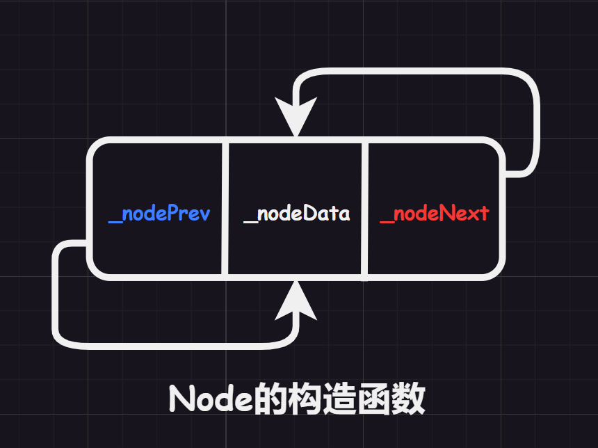
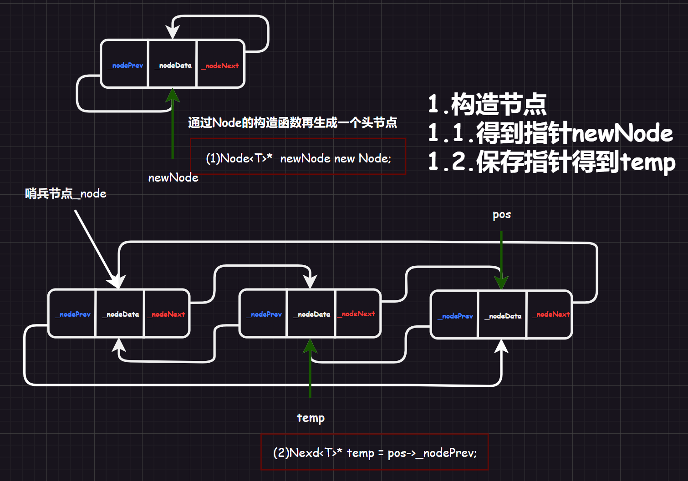
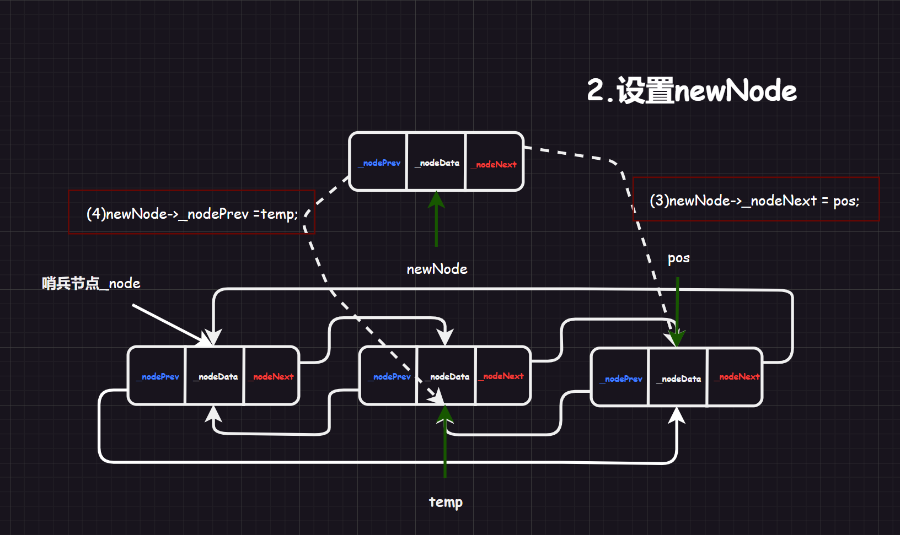
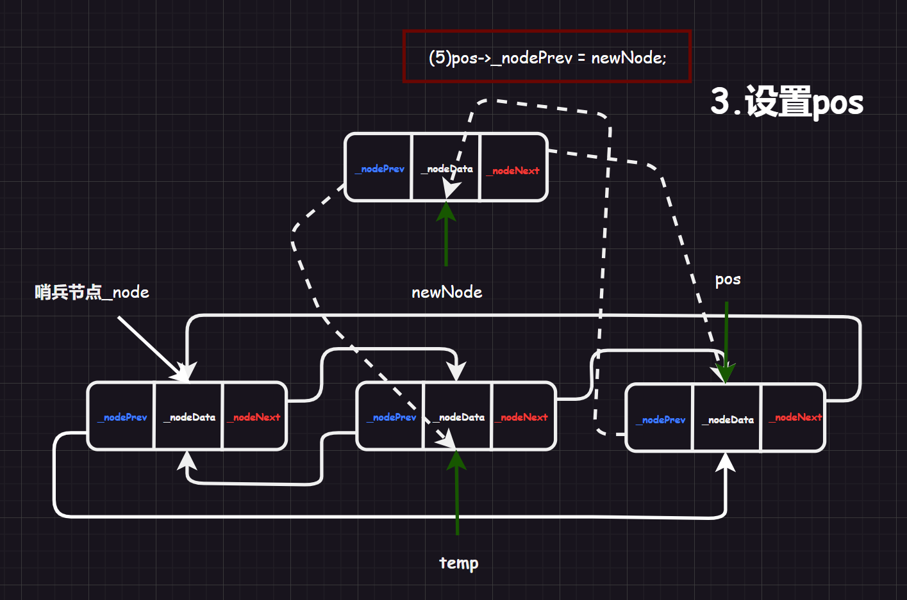
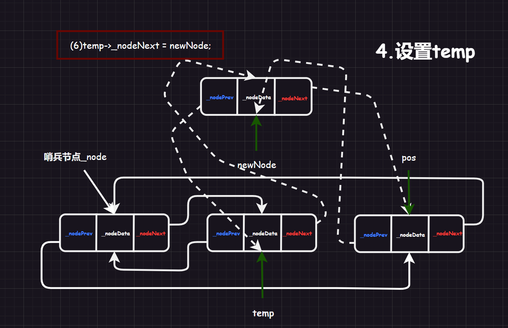
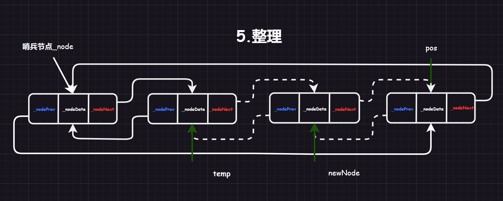
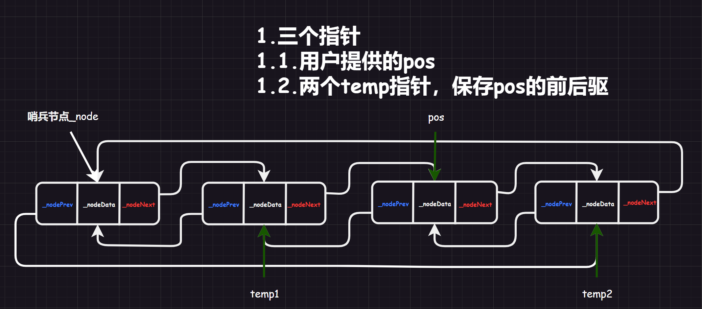
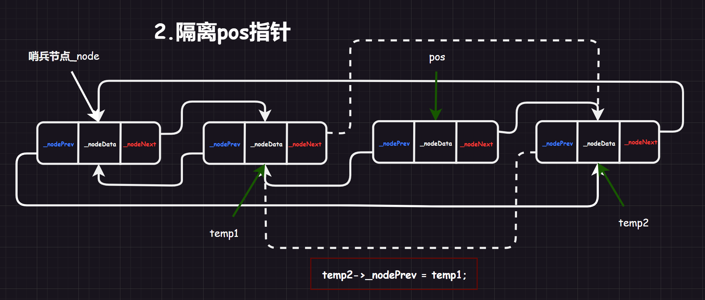
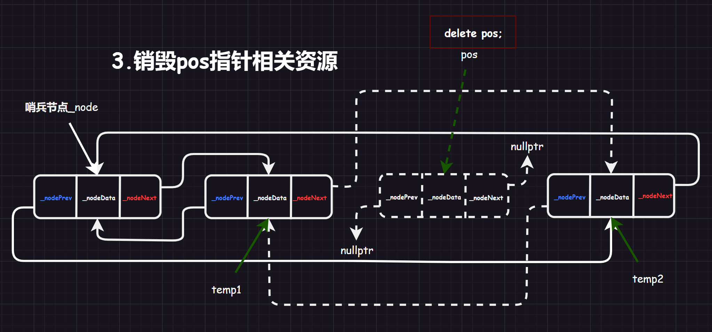

# 1.任意插入原理

## 1.1.三个重要指针

`Node`的构造函数专门用来创建一个结点结构，前驱和后驱指针都指向自己。

假设我们已经有一段`2`个结点以上（因为这样可能会比直接从空链表干起好理解）的双向带头循环链表了（这里链表虽然带有哨兵结点，但是没有计入结点个数）。

首先需要记录`temp = pos->_nodePrev`和利用`new`创建`newNode`，这一步记录很重要。并且注意，还有用户使用`Find()`找到的`pos`指针。

## 1.2.设置newNode的前后驱

我建议先从`newNode`的前后驱设置开始。

## 1.3.设置pos的后驱

## 1.4.设置temp的前驱

走到这里也就成功了：

细心的读者可能会发现，我们实现的链表任意插入没有办法实现从`0`结点开始插入，并且也无法直接使用`insert()`直接尾插（但是有方法，如果允许暴露`_root`则可以间接达到尾插，但是这就暴露了成员，不太好）。

为什么呢？因为我们设置的是插入到`pos`之前，这是符合逻辑的。但是没有办法兼顾尾插和从`0`创建（但是可以通过后面头插和尾插函数来弥补，并且在这两个函数的内部可以使用`insert()`来实现，这是因为在类声明内部所有的成员变量都是可见的）。

>   注意：如果用`_size`记录链表的大小，然后设计`Find()`返回类似数组下标的链表下标，那么可以解决上面的问题，但是这会引发另外一个问题，`insert()`需要修改成根据链表下标遍历来插入，尾插和从`0`创建是方便了，但是使用`list.Insert(list.find(val))`的时候就需要遍历两次才可以实现插入，这就降低了效率。
>
>   因此综合考虑，我还是选择了这种较为简单的插入方法。

# 2.任意删除原理

## 2.1.三个重要指针

也是类似的设置好三个指针

## 2.2.隔离pos

## 2.3.销毁pos

# 3.具体实现

等测试更加完善再来填上......

