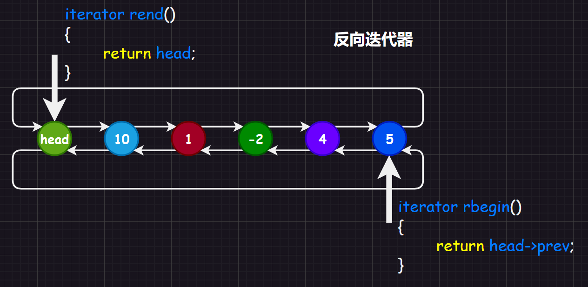
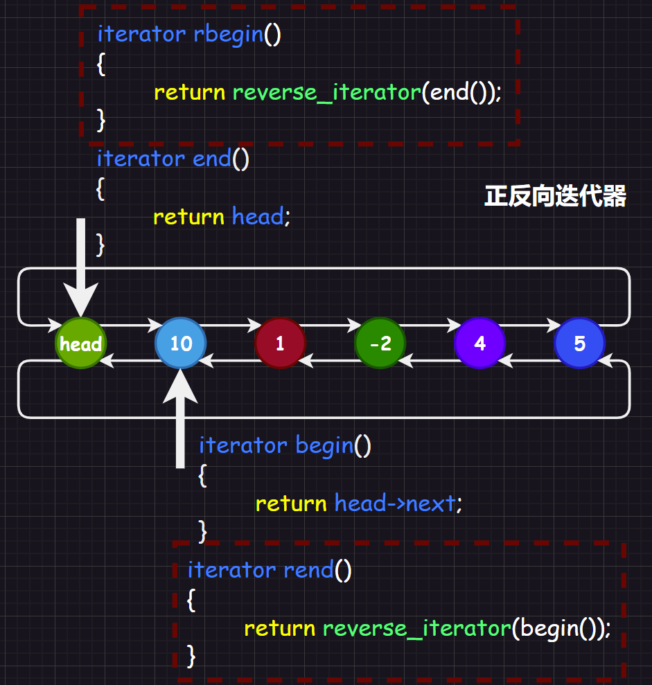

[TOC]

# 1.正反迭代器重要性

迭代器号称`C++`的六大组件之一，那么就注意说明迭代器的重要性。迭代器是为了屏蔽`STL`的实现细节，便于用户使用容器的同时可以有遍历的手段。

而关于反向迭代器，之前我们在顺序表模拟实现中，只是简单地复制正向迭代器的代码，然后稍微修改即可。

再举一个例子，以前我们在写双向循环链表的时候，写正向迭代器的时候，如图：


而如果是反向迭代器，则可能会认为`rend()`指向的就是头节点，然后`rbegin()`指向的是最后一个节点，这样子的话，一直`rbegin()++`到遇到头节点就停下，如图：



这些实现都使得用户无需知道容器的具体成员，也可以遍历、取得内部的成员。

# 2.反向迭代器适配器

但是能不能使用正向迭代器适配出反向迭代器呢（也就是使用一个正向迭代器达到使用反向迭代器的目的）？

实际上是可以的，为什么会这么思考呢？因为实际上反向迭代器相比正向迭代器仅仅只是`++`和`--`的方向不一样（这里只考虑双向迭代器和随机迭代器），而其他操作在代码上都很类似，那就没有必要重复书写代码。

>   注意：这里的适配器类似充电使用的转接头，转接头将电压转化为合适的电压，而“正向迭代器”就类似转化前的电压，“反向迭代器适配器”就相当于转接头，而“反向迭代器”就是转化后的电压。

## 2.1.实现逻辑

下面我们试试用正向迭代器来构造出一个方向迭代器：

```cpp
//伪代码：使用正向迭代器构造反向迭代器
template <class Iterator>//传递一个正向迭代器类型，可以是任意支持双向和随机迭代器
class ReverseIterator
{
public:
	typedef ReverseIterator<Iterator> self;
	Iterator _it;//一个正向迭代器的成员变量

	ReverseIterator(Iterator it) : _it(it) {}//构造一个反向迭代器的时候，首先传递一个正向迭代器变量然后初始化内部的正向迭代器成员变量
	self& operator++()
	{
		--_it;//对于反向迭代器，++就是正向迭代器的--
		return *this;
	}
	self& operator--()
	{
		_it++;//对于反向迭代器，--就是正向迭代器的++
		return *this;
	}
	bool operator!=(const Self& s)
	{
		return _it != s._it;//对于反向迭代器，相等也就是正向迭代器的相等
	}
    //operator*()
    //operator->()
};
```

这样我们就可以成功通过正向迭代器来构造反向迭代器了！如果您没有看懂，没关系，我们把这种思路具体实践到我们之前实现的`list`代码里即可（这份代码我经过了调整，删除了一些注释，让您重点焦距在正向迭代器和构造反向迭代器上，`list`的大致逻辑是没有变化的，您也无需考虑除了迭代器以外的代码）。

## 2.2.初始代码

首先我们来看原代码，我们可以看到下面代码中还没有实现反向迭代器，但是正向迭代器已经实现得很完善。

```cpp
#pragma once
#include <iostream>
#include <string>
#include <vector>
using std::cout;
using std::cin;
using std::endl;

namespace limou
{
    //1.Node节点结构体
    template <typename T>
    struct list_node
    {
        T _data;
        list_node<T>* _next;
        list_node<T>* _prev;
        //构造函数
        list_node(const T& x = T())//注意不能给0，因为不一定是int，这个内置类型有了模板之后就升级了，也有构造函数了
            : _data(x)
            , _next(nullptr)
            , _prev(nullptr)
        {}
    };

    //2.迭代器结构体（合二为一）
    //这里的迭代器是我们本次的研究重点
    //--------
    template<typename T, typename Ref, typename Ptr>
    struct __list_iterator
    {
        typedef list_node<T> Node;
        typedef __list_iterator<T, Ref, Ptr> self;
        Node* _node;

        //构造函数
        __list_iterator(Node* x) : _node(x) {}

        self& operator++()
        {
            _node = _node->_next;
            return *this;
        }
        self operator++(int)
        {
            self tmp(*this);
            _node = _node->_next;
            return tmp;
        }
        self& operator--()
        {
            _node = _node->_prev;
            return *this;
        }
        self operator--(int)
        {
            self tmp(*this);
            _node = _node->_prev;
            return tmp;
        }
        Ref operator*()
        {
            return _node->_data;
        }
        Ptr operator->()
        {
            return &_node->_data;
        }
        bool operator!=(const self& s)
        {
            return _node != s._node;
        }
        bool operator==(const self& s)
        {
            return _node == s._node;
        }
    };
    //--------

    //3.list容器
    template <typename T>
    class list
    {
        typedef list_node<T> Node;//节点结构体被重命名
        void empty_init()//空初始化函数，由于后面有很多该操作，故专门写成一个函数
        {
            _head = new Node;
            _head->_next = _head;
            _head->_prev = _head;
            _head->_data = T();

            _size = 0;
        }

    public:
        //这里的迭代器是我们本次的研究重点
        //--------
        typedef __list_iterator<T, T&, T*> iterator;//迭代器结构体被重命名
        typedef __list_iterator<T, const T&, const T*> const_iterator;//迭代器结构体被重命名
        iterator begin()
        {
            return _head->_next;
        }
        iterator end()//实际上是返回哨兵位节点
        {
            return _head;
        }
        const_iterator begin() const
        {
            return _head->_next;
        }
        const_iterator end() const//实际上是返回哨兵位节点
        {
            return _head;
        }
        //--------

    public:
        list()//初始化好头节点
        {
            empty_init();
        }
        list(list<T>& li)
        {
            empty_init();
            for (auto e : li)
            {
                push_back(e);
            }
        }
        list<T>& operator=(list<T> tmp)//拷贝构造一份
        {
            swap(tmp);
            return *this;
        }

        iterator inster(iterator pos, const T& x)
        {
            //在pos前插入
            Node* newNode = new Node(x);

            Node* cur = pos._node;
            Node* prev = cur->_prev;

            prev->_next = newNode;
            newNode->_prev = prev;
            newNode->_next = cur;
            cur->_prev = newNode;

            _size++;
            return iterator(newNode);
        }
        iterator erase(iterator pos)
        {
            Node* cur = pos._node;
            Node* prev = cur->_prev;
            Node* next = cur->_next;

            delete cur;
            prev->_next = next;
            next->_prev = prev;
            _size--;

            return iterator(next);
        }
        void push_back(const T& x)
        {
            inster(end(), x);
        }
        void pop_back()
        {
            erase(--end());
        }
        void push_front(const T& x)
        {
            inster(begin(), x);
        }
        void pop_front()
        {
            erase(begin());
        }

        void clear()
        {
            iterator it = begin();
            while (it != end())
            {
                it = erase(it);
            }
        }
        size_t size()
        {
            return _size;
        }
        void swap(list<T>& li)
        {
            std::swap(_head, li._head);
            std::swap(_size, li._size);
        }
    private:
        Node* _head;
        size_t _size;//方便事先size()，避免效率底下
    };
}
```

## 2.3.改后代码

### 2.3.1.node.hpp

```cpp
#pragma once
//node.hpp(链表结点结构体)
#include <iostream>
template <typename T>
struct list_node
{
    T _data;
    list_node<T>* _next;
    list_node<T>* _prev;
    //构造函数
    list_node(const T& x = T())//注意不能给0，因为不一定是int，这个内置类型有了模板之后就升级了，也有构造函数了
        : _data(x)
        , _next(nullptr)
        , _prev(nullptr)
    {}
};
```

### 2.3.2.iterator.hpp

```cpp
#pragma once
//iterator.hpp(正向迭代器实现)
#include "node.hpp"
template<typename T, typename Ref, typename Ptr>
struct __list_iterator
{
    typedef list_node<T> Node;
    typedef __list_iterator<T, Ref, Ptr> self;
    Node* _node;

    //构造函数
    __list_iterator(Node* x) : _node(x) {}

    self& operator++()
    {
        _node = _node->_next;
        return *this;
    }
    self operator++(int)
    {
        self tmp(*this);
        _node = _node->_next;
        return tmp;
    }
    self& operator--()
    {
        _node = _node->_prev;
        return *this;
    }
    self operator--(int)
    {
        self tmp(*this);
        _node = _node->_prev;
        return tmp;
    }
    Ref operator*()
    {
        return _node->_data;
    }
    Ptr operator->()
    {
        return &_node->_data;
    }
    bool operator!=(const self& s)
    {
        return _node != s._node;
    }
    bool operator==(const self& s)
    {
        return _node == s._node;
    }
};
```

### 2.3.3.reverse_iterator.hpp

```cpp
#pragma once
//reverse_iterator.hpp(反向迭代器适配器)
#include "iterator.hpp"
template<typename Iterator, class Ref, class Ptr>//传递正向迭代器的类型、迭代器内部节点的_data引用、_data指针
struct ReverseIterator
{
    typedef ReverseIterator<Iterator, Ref, Ptr> Self;
    Iterator _it;//正向迭代器成员变量
    ReverseIterator(Iterator it) : _it(it) {}//拿外部传递过来得正向迭代器初始化成员变量

    Ref operator*()
    {
        return *_it;
    }
    Ptr operator->()
    {
        return _it.operator->();
    }

    Self& operator++()
    {
        --_it;
        return *this;
    }
    Self& operator--()
    {
        ++_it;
        return *this;
    }

    //这两个您可以尝试实现一下
    //Self& operator++(int) {}
    //Self& operator--(int) {}
    bool operator!=(const Self& s)
    {
        return _it != s._it;//这里得等于实际上就是正向迭代器的比较，但是在用户看来是比较反向迭代器
    }
    bool operator==(const Self& s)
    {
        return _it == s._it;//这里得等于实际上就是正向迭代器的比较，但是在用户看来是比较反向迭代器
    }
};
```

### 2.3.4.list.hpp

```cpp
#pragma once
//list.hpp(链表实现)
#include "iterator.hpp"
#include "reverse_iterator.hpp"

namespace limou
{
    //list容器
    template <typename T>
    class list
    {
        typedef list_node<T> Node;//节点结构体被重命名
        void empty_init()//空初始化函数，由于后面有很多该操作，故专门写成一个函数
        {
            _head = new Node;
            _head->_next = _head;
            _head->_prev = _head;
            _head->_data = T();

            _size = 0;
        }

    public:
        //(1)正向迭代器
        typedef __list_iterator<T, T&, T*> iterator;//迭代器结构体被重命名
        typedef __list_iterator<T, const T&, const T*> const_iterator;//迭代器结构体被重命名
        iterator begin()
        {
            return _head->_next;
        }
        iterator end()//实际上是返回哨兵位节点
        {
            return _head;
        }
        const_iterator begin() const
        {
            return _head->_next;
        }
        const_iterator end() const//实际上是返回哨兵位节点
        {
            return _head;
        }

        //(2)反向迭代器
        typedef ReverseIterator<iterator, T&, T*> reverse_iterator;//迭代器结构体被重命名
        typedef ReverseIterator<const_iterator, const T&, const T*> const_reverse_iterator;//迭代器结构体被重命名
        reverse_iterator rbegin()
        {
            end();
            return reverse_iterator(--end());
            //注意这个end()虽然返回的是常属性，
            //但是由于是自定义类型，依旧可以调用operator--()...
            //这实际上还是很离谱的，最好还是在正向迭代器内实现一个operator+()，
            //然后这里替换成return(end() - 1)即可。
            //但是，如果是自定义类型就不可以这么写。
        }
        reverse_iterator rend()//实际上是返回哨兵位节点
        {
            return reverse_iterator(end());
        }
        const_reverse_iterator rbegin() const
        {
            return const_reverse_iterator(--end());
            //这里也和前面类似，最好重载一个常正向迭代器的operator+()
        }
        const_reverse_iterator rend() const//实际上是返回哨兵位节点
        {
            return reverse_iterator(end());
        }

    public:
        list()//初始化好头节点
        {
            empty_init();
        }
        list(list<T>& li)
        {
            empty_init();
            for (auto e : li)
            {
                push_back(e);
            }
        }
        list<T>& operator=(list<T> tmp)//拷贝构造一份
        {
            swap(tmp);
            return *this;
        }

        iterator inster(iterator pos, const T& x)
        {
            //在pos前插入
            Node* newNode = new Node(x);

            Node* cur = pos._node;
            Node* prev = cur->_prev;

            prev->_next = newNode;
            newNode->_prev = prev;
            newNode->_next = cur;
            cur->_prev = newNode;

            _size++;
            return iterator(newNode);
        }
        iterator erase(iterator pos)
        {
            Node* cur = pos._node;
            Node* prev = cur->_prev;
            Node* next = cur->_next;

            delete cur;
            prev->_next = next;
            next->_prev = prev;
            _size--;

            return iterator(next);
        }
        void push_back(const T& x)
        {
            inster(end(), x);
        }
        void pop_back()
        {
            erase(--end());
        }
        void push_front(const T& x)
        {
            inster(begin(), x);
        }
        void pop_front()
        {
            erase(begin());
        }

        void clear()
        {
            iterator it = begin();
            while (it != end())
            {
                it = erase(it);
            }
        }
        size_t size()
        {
            return _size;
        }
        void swap(list<T>& li)
        {
            std::swap(_head, li._head);
            std::swap(_size, li._size);
        }
    private:
        Node* _head;
        size_t _size;//方便事先size()，避免效率底下
    };
}
```

### 2.3.5.main.cpp

```cpp
//main.cpp(测试驱动)
#include "list.hpp"
#define SIZE 8
void func(const limou::list<int>& list1)
{
	limou::list<int>::const_reverse_iterator crit = list1.rbegin();
	while (crit != list1.end())
	{
		//*crit = *crit + 1;//不可修改
		std::cout << *crit << " ";
		++crit;
	}std::cout << std::endl;
}
int main()
{
	int arr1[SIZE] = { 1, 2, 3, 4, 5, 6, 7, 8 };
	limou::list<int> list1;
	for (int i = 0; i < SIZE; i++)
	{
		list1.push_back(arr1[i]);
	}

	//1.使用正向迭代器
	limou::list<int>::iterator it = list1.begin();
	while (it != list1.end())
	{
		*it = *it + 1;
		std::cout << *it << " ";
		++it;
	}std::cout << std::endl;


	//2.使用反向迭代器
	limou::list<int>::reverse_iterator rit = list1.rbegin();
	while (rit != list1.rend())
	{
		*rit = *rit - 1;
		std::cout << *rit << " ";
		++rit;
	}std::cout << std::endl;

	//3.使用常反向迭代器
	func(list1);
	return 0;
}
```

也就是如图的实现：


# 3.迭代器对称实现

在实际实现中，`C++`在库中的实现将正向和反向迭代器做了对称处理，也就是：



这里的`begin()`和`rbegin()`以及`end()`和`rend()`是设计成对称的，只需要在`++`和`--`的时候动一些“手脚”即可。

这样使用适配器，最厉害的地方在于：无论您使用哪一种正向迭代器，只需要是双向迭代器和随机迭代器，就可以构造出任意类型的反向迭代器！

>   补充：但是`C++`为了效率，降低代码重复率，使用了`萃取`这一技巧，但是太过于复杂，后期有机会再补充。

>   拓展：这里保留三个任务以后补充：
>
>   1.   实现`vector`的适配器（在没有实现`+/-`重载的情况下），注意消除常属性的问题
>   2.   让模拟实现的`vector`和`list`支持正向迭代器的`+`和`-`重载，消除常属性问题
>   3.   模拟对称迭代器的实现，运用在`vector`和`list`中
