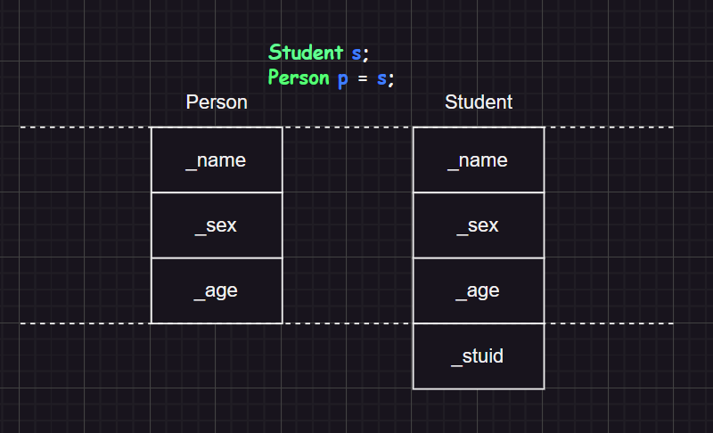
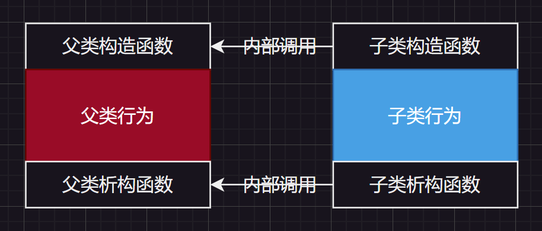
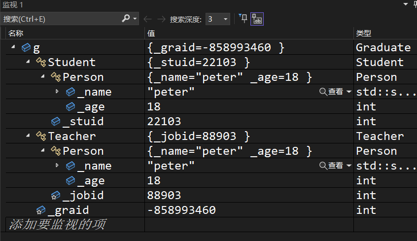
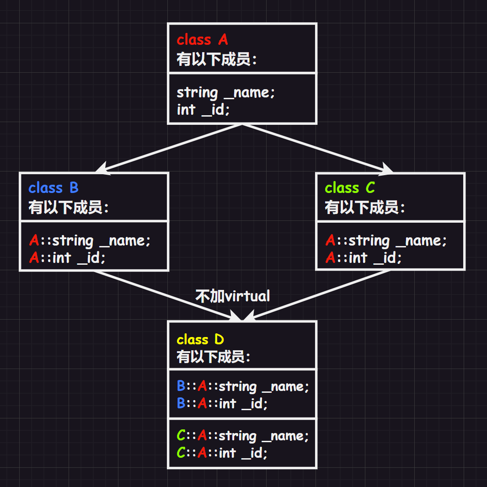
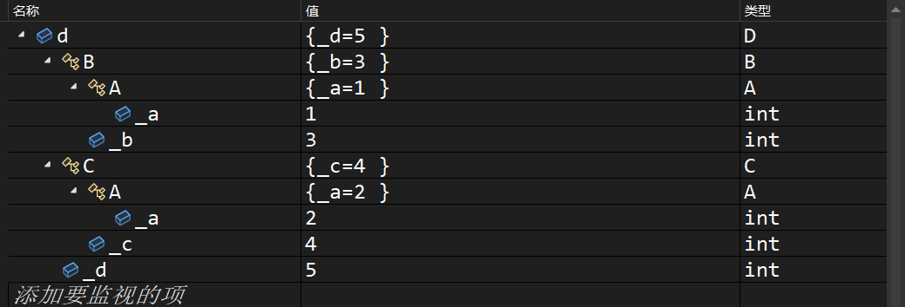
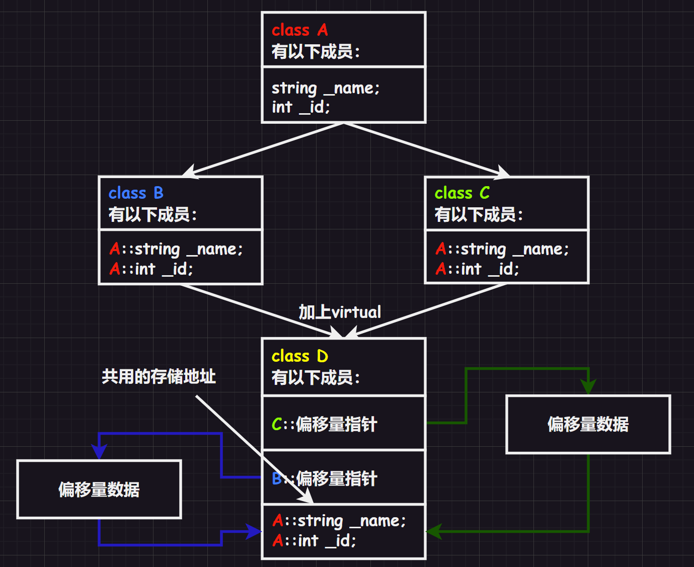
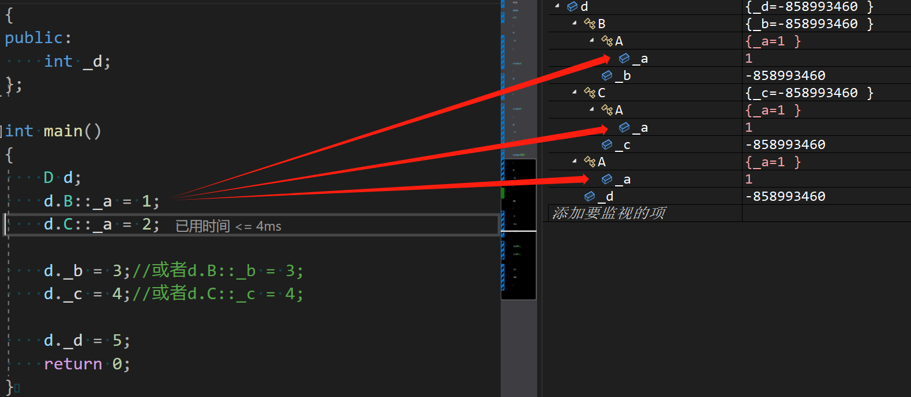
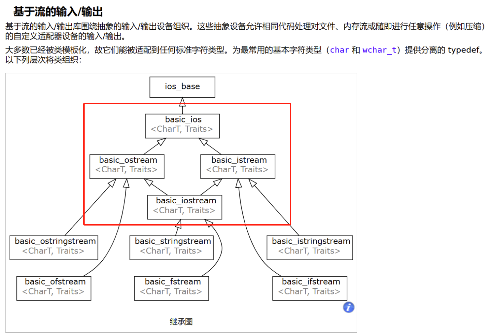

[TOC]

# 1.继承概念

“继承”是面向对象语言的三大特性之一（封装、继承、多态）。

继承（`inheritance`）机制是面向对象程序设计使代码可以复用的最重要的手段，它允许程序员在保持原有类特性基础上进行扩展，增加功能，这样产生新的类，称为“派生类/子类”。

继承呈现了面向对象程序设计的层次结构，体现了由简单到复杂的认知过程。之前我们接触的复用都是函数复用，继承是类设计层次的复用。

# 2.继承使用

继承发生在“基类/父类”和“派生类/子类”之间（后面统一使用父子关系描述继承关系），语法形式就是：

```cpp
class 父类名
{
    //方法
    //属性
};
class 子类名 : 继承方式 父类
{
    //...
};
```

那这个继承方式又是什么呢？在字面上和我们之前看到的`public`、`protected`、`private`是一样的，但是意义有所不同。继承方式和访问限定符可以相互组合，在父子类中有以下组合：

| 类成员/继承方式             | `public`继承         | `protected`继承      | `private`继承      |
| -------------------- | ------------------ | ------------------ | ---------------- |
| **子类的`public`成员**    | 子类中仍是`public`成员    | 子类中变成`protected`成员 | 子类中变成`private`成员 |
| **子类的`protected`成员** | 子类中仍是`protected`成员 | 子类中仍是`protected`成员 | 子类中变成`private`成员 |
| **子类的`private`成员**   | 子类中不可见，该成员为父类私有    | 子类中不可见，该成员为父类私有    | 子类中不可见，该成员为父类私有  |

实际上规律也简单：`公有 > 保护 > 私有`，在两个关键字中取权限最小的即可，有点类似`const`权限缩小的感觉。

下面我们就以“人`Person`”父类来生成子类“学生`Student`”和“老师`Teacher`”：

```cpp
class Person//父类  
{  
public:  
    void Print()  
    {  
        cout << "name:" << _name << endl;  
        cout << "age:" << _age << endl;  
    }
protected:  
    string _name = "peter";//姓名  
    int _age = 18;//年龄 
};  
//继承后父类的Person的成员（成员函数+成员变量）都会变成子类的一部分

class Student : public Person//继承子类
{  
protected:  
    int _stuid;//学号  
};
class Teacher : public Person
{
protected:
    int _jobid;//工号
};

int main()
{
    Student s;
    Teacher t;
    s.Print();
    t.Print();
    return 0;
}
```

> 注意`1`：实际应用中继承方式大多使用`public`，还有类内的访问限定符也大多使用`public`和`protected`。其他的继承方式和访问限定符基本上都很少用，并且有很多时候都不推荐使用。
>
> 注意`2`：如果不写继承方式，那么默认的继承方式是`private`（如果是结构体`struct`就默认`public`），但是最好还是显式写出继承方式为好。
>
> 注意`3`：父类的`private`成员在子类中无论以什么方式继承都是不可见的。这里的不可见是指：父类的私有成员被继承到了子类对象中，但是语法上限制子类不管在类里还是类外都不能去访问它。
>
> ```cpp
> #include <iostream>
> #include <string>
> using namespace std;
> class Person//父类  
> {
> public:
>        void Print()
>        {
>            cout << "name:" << _name << endl;
>            cout << "age:" << _age << endl;
>        }
> private:
>        string _name = "peter";//姓名  
>        int _age = 18;//年龄 
> };
> //继承后父类的Person的成员（成员函数+成员变量）都会变成子类的一部分
> 
> class Student : public Person//继承子类
> {
>        /*void function()
>        {
>            _name = "student";//失败
>            _age = 12;//失败
>        }*/
> };//不可以直接在类内使用从父类继承来的private变量，包括子类创建出来的对象（不可见），但是依旧可以被继承来的Print()使用
> class Teacher : public Person
> {
>        /*void function()
>        {
>            _name = "teacher";//失败
>            _age = 20;//失败
>        }*/
> };//不可以直接在类内使用从父类继承来的private变量，包括子类创建出来的对象（不可见），但是依旧可以被Print()使用
> 
> int main()
> {
>        Student s;
>        Teacher t;
>        /* 失败
>        s._name;
>        s._age;
>        t._name;
>        t._age;
>        */
>        s.Print();
>        t.Print();
>        return 0;
> }
> ```
>
> 注意`4`：由于父类的`private`成员在子类中是不能被访问，如果子类成员不想在类外直接被访问，但需要在子类中被访问，就使用限定符为`protected`即可。从这点也可以看出，保护成员限定符是因为继承才出现的。
>
> ```cpp
> #include <iostream>
> #include <string>
> using namespace std;
> class Person//父类  
> {
> public:
>     void Print()
>     {
>         cout << "name:" << _name << endl;
>         cout << "age:" << _age << endl;
>     }
> protected:
>     string _name = "peter";//姓名  
>     int _age = 18;//年龄 
> };
> 
> class Student : public Person//继承子类
> {
> public:
>     void function()
>     {
>         _name = "student";//成功
>         _age = 12;//失败
>     }
> };
> class Teacher : public Person
> {
> public:
>     void function()
>     {
>         _name = "teacher";//成功
>         _age = 20;//失败
>     }
> };
> 
> int main()
> {
>     Student s;
>     Teacher t;
>     /* 失败语句
>     s._name = "student";
>     s._age = 12;
>     t._name = "teacher";
>     t._age = 20;
>     */
>     s.function();
>     t.function();
>     s.Print();
>     t.Print();
>     return 0;
> }
> ```

# 3.切片赋值



公有类继承的子类可以直接赋值、初始化给父类，这个过程形象的说法叫做“切割/切片”，也有叫“赋值兼容转化”的。这个过程是纯天然的，没有隐式类型转化的发（也就是说：中间没有临时变量产生的过程）。

而这种“切片”的现象在指针和引用上也有体现，更多也是在这里使用。

```cpp
class Father
{
public:
	Father(int f_val) : _f_number(f_val) {}
	int _f_number;
};
class Child : public Father
{
public:
	Child(int f_val, int c_val) : Father(f_val), _c_number(c_val) {}
	int _c_number;
};
int main()
{
	//1.内置类型
	int a1 = 1;
	int a2 = 10;
	a2 = a1;//没有临时变量产生，是比较自然天然的
	int& a3 = a2;//成功

	int b1 = 100;
	double b2 = 3.14;
	b2 = b1;//有临时变量产生
	//double& b3 = b1;//失败
	const double& b3 = b1;//成功

	//2.自定义类型
	Father n1(1);
	Child n2(2, 3);
	n1 = n2;//报警告，但是成功（只是将子类中的成员变量拷贝给父类）
	Father n3 = n2;//报警告，但是成功（只是将子类中的成员变量拷贝给父类）
	Father& n4 = n2;//成功
	Father* n5 = &n2;//成功

	return 0;
}
```

>   注意：直接赋值或者初始化切片可能会报警告。

也许会有人好奇，能不能反过来，用子类接受父类呢？答案是：有办法可以，但是一般不这样做，很容易造成子类的属性缺失，有可能会出现问题（这很危险）。

```cpp
#include <iostream>
#include <string>
using namespace std;
class Person
{
public:
    void Print()
    {
        cout << "name:" << _name << endl;
        cout << "age:" << _age << endl;
    }
protected:
    string _name = "peter";
    int _age = 18;
};

class Student : public Person
{
protected:
    int _stuid;
};

class Teacher : public Person
{
protected:
    int _jobid;
};

int main()
{
    Person per;//父类对象

    //1.子类对象引用父类
    //Student& rstu = per;//不允许
    //Student& rstu = (Student)per;//不允许

    //2.子类指针指向父类
    //Student* pstu = &per;//不允许
    Student* pstu = (Student*)&per;//虽然可以通过，但是很危险，有可能会越界

    //3.这种操作我们以后有机会再来讨论（会涉及到 dynamic_cast 的使用）
    Student std;
    Person* pper = &std;
    Student* pstd = (Student*)pper;//允许

    return 0;
}
```

# 4.隐藏父类

1. 在继承中父类和子类都有自己独立的作用域

2. 子类和父类有同名成员，但是子类将屏蔽父对类同名对象的直接访问，这种情况就叫“隐藏/重定义”，但是更加推荐使用“隐藏”，毕竟继承过来的父类对象也可以被显式使用

3. 函数也有类似“隐藏”的情况，注意需要和“重载区分（在同一个作用域）”。实际上，只需要函数名相同就可以达到“隐藏父类成员函数”，而重载需要在同一个作用域（隐藏关系的两个同名函数在两个类域），并且还有参数要求

4. 尽可能不使用同名的成员构成隐藏，不然有的时候会给自己挖坑...

```cpp
#include <iostream>
#include <string>
using namespace std;
class Person
{
public:
    void Print()
    {
        cout << "name:" << _name << endl;
        cout << "age:" << _age << endl;
    }
protected:
    string _name = "peter";
    int _age = 18;
};

class Student : public Person
{
protected:
    string _name = "student";//父类的_name被子类Student隐藏了
    int _stuid;
public:
    void Print()//父类的Print()被子类Student隐藏了
    {
        cout << "name:" << _name << endl;
        cout << "age:" << _age << endl;//_age没有被子类隐藏，依旧打印从父类继承过来的_age
    }
};

class Teacher : public Person
{
protected:
    string _name = "teacher";//父类的_name被子类Teacher隐藏了
    int _jobid;
public:
    void Print()//父类的Print()被子类Teacher隐藏了
    {
        cout << "name:" << _name << endl;
        cout << "age:" << _age << endl;//_age没有被子类隐藏，依旧打印从父类继承过来的_age
    }
};

int main()
{
    Student s;
    s.Print();
    Teacher t;
    t.Print();
    return 0;
}
```

但是想要直接访问父类中被子类隐藏的成员怎么办呢？使用作用域解析运算符即可，因为父类的成员只是被隐藏而不是不存在了。

```cpp
#include <iostream>
#include <string>
using namespace std;
class Person
{
public:
    void Print()
    {
        cout << "name:" << _name << endl;
        cout << "age:" << _age << endl;
    }
protected:
    string _name = "peter";
    int _age = 18;
};

class Student : public Person
{
protected:
    string _name = "student";//父类的_name被子类Student隐藏了
    int _stuid;
public:
    void Print()//父类的Print()被子类Student隐藏了
    {
        cout << "name:" << _name << endl;
        cout << "age:" << _age << endl;//_age没有被子类隐藏，依旧打印父类的_age
    }
};

class Teacher : public Person
{
protected:
    string _name = "teacher";//父类的_name被子类Teacher隐藏了
    int _jobid;
public:
    void Print()//父类的Print()被子类Teacher隐藏了
    {
        cout << "name:" << _name << endl;
        cout << "age:" << _age << endl;//_age没有被子类隐藏，依旧打印父类的_age
    }
};

int main()
{
    Student s;
    s.Print();
    Teacher t;
    t.Print();
    s.Person::Print();
    t.Person::Print();
    return 0;
}
```

我们再次总结对比一下。

从父类继承过来的子类，如果子类为空：

1.   继承父类的变量，是另开空间独立给子类使用，只是两个变量同名
2.   继承父类的函数，那实际上就是子类可以调用父类的函数

```cpp
//单纯继承出空子类，没有隐藏/重定义
#include <iostream>
#include <string>
using namespace std;
class Person//父类  
{
public:
	void Print()
	{
		cout << "name:" << _name << endl;
		cout << "age:" << _age << endl;
	}
	string _name = "peter";//姓名
	int _age = 18;//年龄 
};

class Student : public Person {};
class Teacher : public Person {};

int main()
{
	Person p;
	Student s;
	Teacher t;

	printf("%p\n", &Person::_name);
	//在创建类的对象之前，类的成员变量不会拥有任何有效的内存地址，这些地址尚未分配
	//当你尝试打印类内的成员变量地址时，如果类的对象尚未被创建，那么这些成员变量的地址有可能将是nullptr
	//因此不能这么打印变量的地址，除非是静态成员变量

	cout << endl << "打印成员变量地址:" << endl;
	printf("%s, %p\n", p._name.c_str(), &p._name);
	printf("%s, %p\n", s._name.c_str(), &s._name);
	printf("%s, %p\n", t._name.c_str(), &t._name);

	cout << endl << "打印成员函数地址:" << endl;
	printf("%p\n", &Person::Print);
	p.Print();
	printf("%p\n", &Student::Print);
	s.Print();
	printf("%p\n", &Teacher::Print);
	t.Print();

	return 0;
}
```

如果子类对父类进行隐藏/重定义：

1.   子类隐藏了父类的成员变量，则此时子类对象内会有两个同名成员变量，但它们的所属类不同，不会冲突，因此也是两个地址的变量（访问同名成员变量时默认访问子类的成员变量）
2.   子类隐藏了父类的成员函数，则此时子类内会有两个同名成员函数，但它们的所属类不同，不会冲突，因此也是两个地址的成员函数（访问同名成员函数时默认访问子类的成员函数）

这里再次强调：父类中的成员函数中的`this`类型也会被子类继承，也就是说，假设父类`A`有成员函数`void fun();`，编译器展开为`void fun(A* const this);`，被`B`子类继承后依旧是`void fun(A* const this);`，不会被自动修改为`void fun(B* const this);`（但是在子类中如果发生成员函数的隐藏/重定义那就会发生改变，创建一个独属于子类的成员函数，并且两个函数同名。如果不指定，子类对象调用该函数时默认调用子类内的函数，指明则会调用父类的同名函数）。

因此函数继承的实质是：子类对象可以使用父类的函数，而不是真的有一个函数在子类中出现（不然写隐藏的时候不就变成函数重载了？很奇怪吧...），所谓”继承“只是一种形象的说法。

```cpp
//继承出子类，有隐藏/重定义
#include <iostream>
#include <string>
using namespace std;
class Person//父类  
{
public:
	void Print()
	{
		cout << "name:" << _name << endl;
		cout << "age:" << _age << endl;
	}
	string _name = "peter";//姓名
	int _age = 18;//年龄 
};

class Student : public Person
{
public:
	void Print()//隐藏了父类函数，但是父类函数依旧存在这个类中
	{
		cout << "Student::void Print()" << endl;
	}
	string _name = "limou";//隐藏了父类变量，但是父类变量依旧存在这个类中
};
class Teacher : public Person
{
public:
	void Print()//隐藏了父类函数，但是父类函数依旧存在这个类中
	{
		cout << "Teacher::void Print()" << endl;
	}
	string _name = "dimou";//隐藏了父类变量，但是父类变量依旧存在这个类中
};

int main()
{
	Person p;
	Student s;
	Teacher t;

	printf("%p\n", &Person::_name);
	//在创建类的对象之前，类的成员变量不会拥有任何有效的内存地址，这些地址尚未分配
	//当你尝试打印类内的成员变量地址时，如果类的对象尚未被创建，那么这些成员变量的地址有可能将是nullptr
	//因此不能这么打印变量的地址，除非是静态成员变量
	
	cout << endl << "打印成员变量地址:" << endl;
	printf("%s, %p\n", p._name.c_str(), &p._name);
	printf("%s, %p\n", s._name.c_str(), &s._name);
	printf("%s, %p\n", t._name.c_str(), &t._name);
	
	cout << endl << "打印成员函数地址:" << endl;
	printf("%p\n", &Person::Print);
	p.Print();
	printf("%p\n", &Student::Print);
	s.Print();
	printf("%p\n", &Teacher::Print);
	t.Print();

	return 0;
}
```

# 5.子类成员

上面的继承只涉及了我们自己定义的成员变量和成员函数，但是类内六大成员函数在继承时会发生什么呢？

1.   子类的构造函数必须调用父类的构造函数初始化继承自父类的那一部分成员，而不能自己在子类中直接初始化。如果父类有默认构造函数，哪怕用户不写也会在子类构造函数的初始化列表处自动调用父类的默认构造函数

     继承父类函数，实际上就是子类对象可以调用父类函数，这里子类继承父类的构造函数，内部使用的是父类的`this`指针，根据切片即可让父类构造函数只构造从父类继承过来的成员变量，而剩下的子类成员变量交给子类构造来构造。

     如果父类没有默认构造函数，则用户必须在子类构造函数的初始化列表阶段显示调用。因此，子类对象初始化先调用父类构造函数再调用子类构造函数。

     ```cpp
     #include <iostream>
     #include <string>
     using namespace std;
     class Person//父类  
     {
     public:
     	Person() : _name("Person"), _age(18) { cout << "Person() : _name(\"Person\"), _age(18)" << endl; }
     	void Print()
     	{
     		cout << "Person::void Print()" << endl;
     		cout << "Person::name:" << _name << endl;
     		cout << "Person::age:" << _age << endl << endl;
     	}
     	string _name;//姓名
     	int _age;//年龄 
     };
     
     class Student : public Person
     {
     public:
     	Student() : _name("Student"), _age(15) { cout << "Student() : _name(\"Student\"), _age(15)" << endl; }
     	void Print()
     	{
     		cout << "Student::void Print()" << endl;
     		cout << "Student::name:" << _name << endl;
     		cout << "Student::age:" << _age << endl;
     		cout << "Student::Person::name:" << Person::_name << endl;
     		cout << "Student::Person::age:" << Person::_age << endl << endl;
     	}
     	string _name;//姓名
     	int _age;//年龄 
     };
     
     int main()
     {
     	Person p;
     	Student s;
     
     	p.Print();
     	s.Print();
     
     	return 0;
     }
     ```

2.   子类的析构函数会在被调用完成后自动调用父类的析构函数清理父类成员（不需要我们自己调用）。因为这样才能保证派生类对象先清理派生类成员再清理基类成员的顺序，避免出现：用户自己调用父类的析构函数，父类成员先被释放了，但是子类依旧可以使用父类的成员，造成越界访问的现象。

     因此在子类的析构函数内用户最好不要自己显式调用父类的析构函数，否则会多次调用析构函数。

     >   事实上，编译器会对父子类内析构函数名会进行特殊处理，统一换名成`destrutor()`，所以子类析构函数和父类析构函数是默认构成隐藏关系的（这是因为多态，才必须这么设置，后续多态的部分还会继续提及）。

     

3.   子类的拷贝构造函数必须调用父类的拷贝构造完成继承自父类的那一部分成员的拷贝初始化。但是父类的拷贝构造函数需要传递一个父类对象过去，如何把继承于父类的成员变量拿出来作为父类对象传给父类的拷贝构造函数呢？也是使用切片即可。

4.   子类的`operator=`必须要调用父类的`operator=`完成继承自父类的那一部分成员的复制，同理也是使用切片（不过需要指定父类，否则会发生无穷递归调用，因为名字是一样的）

     事实上，使用父类的成员函数最好一定要带上父类和作用域解析运算符，否则就有可能因为隐藏而出现自己调用自己的情况，就会变成无穷递归。

下面展示类内置成员函数的父子继承的过程：

```cpp
#include <iostream>
#include <string>
using namespace std;
//1.父类Person
class Person
{
public:
    Person(string name, int age) : _name(name), _age(age)//不是默认的构造函数
    {
        cout << "Person(string nume, int age) : _name(\"peter\"), _age(18)" << endl;
    }
    ~Person()
    {
        cout << "~Person()" << endl;
    }
    Person(Person& p)//不是默认的拷贝构造函数
    {
        cout << "Person(Person& p)" << endl;
        _name = p._name;
        _age = p._age;
    }
    Person& operator=(const Person& p)//不是默认的赋值重载函数
    {
        cout << "Person operator=(const Person& p)" << endl;
        if (this != &p)
        {
            _name = p._name;
            _age = p._age;
        }
        return *this;
    }
    void Print()
    {
        cout << "Print()" << endl;
        cout << "name:" << _name << " age:" << _age << endl;
    }
protected:
    string _name;
    int _age;
};

//2.子类Student
class Student : public Person
{
public:
    Student(string name, int age, int stuid = 00000000) : Person(name, age), _stuid(stuid)//这里调用显示调用父类的构造函数（并且没有明确指定父类成员，只是简写了父类成员变量的名字），初始化子类中从父类继承过来的成员，然后才初始化子类自己的成员
    {
        cout << "Student(string name, int age, int stuid = 00000000) : Person(name, age), _stuid(stuid)" << endl;
    }
    ~Student()
    {
        cout << "~Student()" << endl;
        //无需自己调用父类函数的析构函数，编译器会自己帮助我们调用
    }
    Student(Student& s) : Person(s), _stuid(s._stuid)//这里使用了切片显式调用父类的拷贝构造函数（可以选择不指定父类），初学者推荐一直显式调用，有助于代码理解和可读性。
    {
        cout << "Student(Student& s) : Person(s), _stuid(s._stuid)" << endl;
    }
    Student& operator=(const Student& p)
    {
        cout << "Student& operator=(const Student& p)" << endl;
        if (this != &p)
        {
            Person::operator=(p);
            _stuid = p._stuid;
        }
        return *this;
    }
    void Print()//构成成员函数隐藏了
    {
        //Print();//这就变成自己调用自己了，此时就不可以不明确父类了
        Person::Print();//指明父类
        cout << "stuid:" << _stuid << endl;
    }
protected:
    int _stuid;
};
int main()
{
    Student s1("limou", 18, 22130800);
    Student s2(s1);
    Student s3("daimou", 22, 22109988);
    s1 = s3;

    s1.Print();
    s2.Print();
    s3.Print();
    return 0;
}
```

# 6.不可继承

## 6.1.友元关系

友元关系是不会被继承的，也就是说，如果父类有一个友元函数，那么这个友元函数只可以使用父类的成员变量，而不可以使用从父类继承过来的子类的内部成员变量。

```c++
#include <iostream>
#include <string>
using namespace std;

class Student;//这句是声明，告诉编译器有一个类的存在，让下面在Person内的函数可以通过编译
class Person
{
public:
	friend void Display(const Person& p, const Student& s);
protected:
	string _name;//姓名
};
class Student : public Person
{
protected:
	int _stuNum;//学号
};
void Display(const Person& p, const Student& s)
{
	cout << p._name << endl;
	//cout << s._stuNum << endl;//该语句不正确
}

int main()
{
	Person p;
	Student s;
	Display(p, s);
	return 0;
}
```

这种情况下只能再定义一个友元关系给子类。

```cpp
#include <iostream>
#include <string>
using namespace std;

class Student;//这句是声明，告诉编译器有一个类的存在，让下面在Person内的函数可以通过编译
class Person
{
public:
	friend void Display(const Person& p, const Student& s);
protected:
	string _name;//姓名
};
class Student : public Person
{
	friend void Display(const Person& p, const Student& s);
protected:
	int _stuNum;//学号
};
void Display(const Person& p, const Student& s)
{
	cout << p._name << endl;
	cout << s._stuNum << endl;//该语句不正确
}

int main()
{
	Person p;
	Student s;
	Display(p, s);
	return 0;
}
```

## 6.2.静态成员

静态成员变量属于整个类，不仅仅属于父类，也属于子类，因此不能说子类继承静态成员变量，这么说是不准确的。

```cpp
#include <iostream>
#include <string>
using namespace std;
class Person
{
public:
	Person() { ++_count; }
protected:
	string _name;//姓名
public:
	static int _count;//统计人（对象）的个数
};
int Person::_count = 0;

class Student : public Person
{
protected:
	int _stuNum;//学号
};

class Graduate : public Student
{
protected:
	string _seminarCourse;//研究科目
};
void TestPerson()
{
	Student s1;
	Student s2;
	Graduate s3;
	Graduate s4;
	cout << "人数:" << Student::_count << endl;
	Person::_count = 0;
	cout << "人数:" << Graduate::_count << endl;
}
int main()
{
	TestPerson();
	return 0;
}
```

也就是说父类中使用的静态成员变量和子类的静态成员变量是一样的（不过这其实也侧面说明，从父类中的成员变量和子类中继承自父类的成员变量只是拷贝关系，各自的地址是不一样的）。  

## 6.3.final修饰

实际上`C++11`还给出了一个新的关键字`final`，可以让一个类变成最终类，带有该关键字修饰的类无法被继承。

```cpp
class A final
{
public:
    int _a;
    int _b;
    int _c;
};
class B : public A//报错
{};
```

# 7.虚拟继承

## 7.1.不可能棱形

我之前提到的继承都是“单个父类继承给多个子类”的“单继承”，但是`C++`在开发之初为了更加符合现实中“多个父类继承给单个子类”的现象，设计了“多继承”。

但是出现了一个有名的问题：棱形继承，具有“二义性”和”数据冗余“的两大缺陷。这些缺陷导致`C++`之父在推出继承特性不久后，迫于无奈加紧了`C++`的一次更新（针对菱形继承的一次更新）。

棱形继承是多继承的一种特殊情况，其内容为：”假设有一个父类，其有两个子类，而两个子类又通过多继承得出一个孙类，这个孙类创建出来的对象会从两个子类中继承，那么会出现相同的成员，也就是二义性（不知道使用的是哪一个子类的成员）和数据冗余（有可能出现重复相同的成员变量）“。


```cpp
#include <iostream>
#include <string>
using namespace std;
class Person
{
public:
    Person()
        : _name("peter"), _age(18)
    {
        cout << "Person()" << endl;
    }
public:
    string _name;
    int _age;
};

class Student : public Person
{
public:
    Student()
        :Person(), _stuid(22103)
    {}
public:
    int _stuid;
};

class Teacher : public Person
{
public:
    Teacher()
        :Person(), _jobid(88903)
    {}
protected:
    int _jobid;
};
class Graduate : public Student, public Teacher//多继承
{
protected:
    int _graid;
};

int main()
{
    Graduate g;
    //cout << g._name << endl;//运行失败，具有二义性
    cout << g.Student::_name << endl;//运行成功，成功解决二义性
    cout << g.Teacher::_name << endl;//运行成功，成功解决二义性
    return 0;
}
```



二义性我们尚且可以通过作用域解析运算符来解决，但是数据冗余还需要使用`virtual`关键字才能解决。该关键字加在两个被继承类的继承方式处，但是设计多继承的代码也因此变得很复杂...

> 补充：由于多继承会让代码变得复杂，所以`Java`直接移除了多继承的功能。

## 7.2.虚继承操作

为什么数据冗余使用`virtual`关键字就能解决呢？我们来查看一下底层。

这里我们最好不要查看编译器的调试窗口，而是使用内存窗口（因为调试窗口为了方便展示可能做了一些优化，比如：使用内联函数，有些编译器的调试器会让您觉得这是在调用函数，但是实际上该函数会在代码中展开）。

### 7.2.1.不加关键字



```cpp
#include <iostream>
#include <string>
using namespace std;
class A//父类A
{
public:
    int _a;
};

class B : public A//子类B
{
public:
    int _b;
};

class C : public A//子类C
{
public:
    int _c;
};

class D : public B, public C//多继承后的子子类D
{
public:
    int _d;
};

int main()
{
    D d;

    //1.赋值给_a，但是由于产生了二义性，赋值失败
    //d._a = 0;

    //2.使用::指定访问_a，勉强解决了二义性，但是出现了数据冗余（有两个_a继承自不同的父类）
    d.B::_a = 1;
    d.C::_a = 2;
    cout << d.B::_a << " " << d.C::_a << endl;

    //3.由于没有二义性问题，因此不需要使用::
    d._b = 3;//或者d.B::_b = 3;
    d._c = 4;//或者d.C::_c = 4;
    cout << d._b << " " << d._c << endl;

    d._d = 5
    return 0;
}
```




可以看到，每一个变量都存储在不同的地址上。

### 7.2.2.加上关键字



```cpp
#include <iostream>
#include <string>
using namespace std;
class A//父类A
{
public:
    int _a;
};

class B : virtual public A//子类B
{
public:
    int _b;
};

class C : virtual public A//子类C
{
public:
    int _c;
};

class D : public B, public C//多继承后的子子类D
{
public:
    int _d;
};

int main()
{
    D d;
    d._a = 1;
    d._a = 2;

    cout << d.B::_a << " " << d.C::_a << endl;//解决了二义性和冗余问题

    d._b = 3;//或者d.B::_b = 3;
    d._c = 4;//或者d.C::_c = 4;
    cout << d._b << " " << d._c << endl;

    d._d = 5;
    return 0;
}
```




欸？！多继承中同名且冗余的变量的存储位置是一样的，我们成功解决了二义性和数据冗余的问题。

>   注意：注意关键字的修饰位置主要是看有二义性和数据冗余可能性的两个父类上。
>
>   

## 7.3.虚继承原理

通过上面的调试我们发现，在解决二义性的时候，好像`D`从`B`、`C`、`A`处继承的`_a`成员是在一个地址上的变量？这个应该怎么理解呢？让我们通过调试来理解虚继承的原理。


将`B`和`C`中同属于`A`的部分变成一个公共部分，在继承自`B`和`C`的部分中多出两个指针（这两个指针在调试窗口很可能看不到，并且公共部分调试窗口也会单独拉出来），各自指向一块表空间，这些表内存储了指针偏移量信息。利用指针偏移量和表指针的地址即可找到一块公共空间，这样同时消除二义性和数据冗余的问题。

那为什么是指针指向一个偏移量表，而不是直接使用指针指向共用的公共空间呢？这些后面多态再来讨论，指针固然能解决这个问题，但是使用偏移量表还能再进一步解决多态的问题...

既然棱形继承这么复杂，那应该会很少使用吧？实际上您有可能天天在用，`iostream`类就是通过`istream`类和`ostream`类棱形继承来的...但是在实际编码中，菱形继承能不用则不用。




>   注意：上述两图来源于：[Reference - C++ Reference (cplusplus.com)](https://legacy.cplusplus.com/reference/)和[输入/输出库 - cppreference.com](https://zh.cppreference.com/w/cpp/io)，感兴趣您可以去查看一下。

# 8.继承/组合

继承和组合都是一种复用，以下是继承和组合的区别（不过这里只讨论公有方式的继承）：

```cpp
//继承is-a
class A1
{};
class B1 : public A1
{};

//组合has-a
class A2
{};
class B2
{
private:
    A2 _a;
};
```

那么这个`is-a`和`has-a`，是什么呢？一个是“是一个（也就是继承）”的关系，一个是“拥有一个（也就是组合）”的关系。

从“关联关系/耦合度”上来看继承会更高，`B1`可以直接使用`A1`的所有成员，但是`B2`只能使用`A2`的函数成员，间接调用其他的`A2`成员。

1.   组合是一种黑箱/黑盒风格，无法看到内部
2.   继承是一种白箱/白盒风格，可以看到内部

但在软件设计中有一种设计理念就是“低耦合、高内聚”，因此在实践中，应该尽可能去用组合，这样的代码维护性更好（当然，具体还是要看实际）。

1.   如果是为了实现多态，那就必须使用继承（多态我们后面再谈）
2.   如果描述类之间的关系时，继承和组合都可以，那么应尽量使用组合

有很多更多关于继承和组合的文章，您可以看看这一篇的内容：

>   [优先使用对象组合，而不是类继承 - 残雪余香 - 博客园 (cnblogs.com)](https://www.cnblogs.com/nexiyi/archive/2013/06/16/3138568.html)
>
>   《极限编程（`Extreme programming`）》的指导原则之一是“只要能用，就做最简单的”。一个似乎需要继承的设计常常能够戏剧性地使用组合来代替而大简化，从而使其更加灵活。因此，在考虑一个设计时，问问自己：“使用组合是不是更简单？这里真的需要继承吗？它能带来什么好处？”
>
>   继承和组合的比较：面向对象系统中功能复用的两种最常用技术是“类继承”和“对象组合（`object composition`）”。正如我们已解释过的，类继承允许你根据其他类的实现来定义一个类的实现。这种通过生成子类的复用通常被称为白箱复用（`white-box reuse`）。术语“白箱”是相对可视性而言：在继承方式中，父类的内部细节对子类可见。
>
>   对象组合是类继承之外的另一种复用选择。新的更复杂的功能可以通过组装或组合对象来获得。对象组合要求被组合的对象具有良好定义的接口。这种复用风格被称为黑箱复用（`black-box reuse`），因为对象的内部细节是不可见的。对象只以“黑箱”的形式出现。
>
>   继承和组合各有优缺点。类继承是在编译时刻静态定义的，且可直接使用，因为程序设计语言直接支持类继承。类继承可以较方便地改变被复用的实现。当一个子类重定义一些而不是全部操作时，它也能影响它所继承的操作，只要在这些操作中调用了被重定义的操作。
>
>   但是类继承也有一些不足之处。首先，因为继承在编译时刻就定义了，所以无法在运行时刻改变从父类继承的实现。更糟的是，父类通常至少定义了部分子类的具体表示。因为继承对子类揭示了其父类的实现细节，所以继承常被认为“破坏了封装性” 。子类中的实现与它的父类有如此紧密的依赖关系，以至于父类实现中的任何变化必然会导致子类发生变化。当你需要复用子类时，实现上的依赖性就会产生一些问题。如果继承下来的实现不适合解决新的问题，则父类必须重写或被其他更适合的类替换。这种依赖关系限制了灵活性并最终限制了复用性。一个可用的解决方法就是只继承抽象类，因为抽象类通常提供较少的实现。
>
>   对象组合是通过获得对其他对象的引用而在运行时刻动态定义的。组合要求对象遵守彼此的接口约定，进而要求更仔细地定义接口，而这些接口并不妨碍你将一个对象和其他对象一起使用。这还会产生良好的结果：因为对象只能通过接口访问，所以我们并不破坏封装性；只要类型一致，运行时刻还可以用一个对象来替代另一个对象；更进一步，因为对象的实现是基于接口写的，所以实现上存在较少的依赖关系。
>
>   对象组合对系统设计还有另一个作用，即优先使用对象组合有助于你保持每个类被封装，并被集中在单个任务上。这样类和类继承层次会保持较小规模，并且不太可能增长为不可控制的庞然大物。另一方面，基于对象组合的设计会有更多的对象（而有较少的类），且系统的行为将依赖于对象间的关系而不是被定义在某个类中。
>
>   这导出了我们的面向对象设计的第二个原则：优先使用对象组合，而不是类继承。

# 9.相关题目

## 9.1.题目一：切片地址问题

下述三个地址相同吗（切片问题）？

```cpp
#include <iostream>
using namespace std;
class Base1 { public: int _b1; };
class Base2 { public: int _b2; };
class Derive : public Base1, public Base2 { public: int _d; };

int main()
{
	Derive d;
	Base1* p1 = &d;
	Base2* p2 = &d;
	Derive* p3 = &d;

	cout << (void*)p1 << endl << (void*)p2 << endl << (void*)p3 << endl;
	return 0;
}
```

实际上由于切片的缘故，`p1==p3!=p2`.

## 9.2.题目二：继承先后的构造顺序

### 9.2.1.情况一

下面的输出结果是什么，为什么这样输出呢（根据类先后继承顺序来调用构造函数初始化、继承的实质）？

```cpp
#include <iostream>
#include <string>
using namespace std;
class A
{
public:
    A(const char* s) { cout << s << endl; }
    ~A() {}
    int _a;
};

class B : virtual public A
{
public:
    B(const char* s1, const char* s2) : A(s1) { cout << s2 << endl; }
    int _b;
};

class C : virtual public A
{
public:
    C(const char* s1, const char* s2) : A(s1) { cout << s2 << endl; }
    int _c;
};

class D : public C, public B//多继承，并且是虚继承
{
public:
    D(const char* s1, const char* s2, const char* s3, const char* s4)
        : B(s1, s2), C(s1, s3), A(s1)
    {
        cout << s4 << endl;
    }
};

int main()
{
    D* p = new D("class A", "class B", "class C", "class D");
    delete p;
    return 0;
}
```

按照初始化列表的根据谁先被继承，谁就先初始化的原则：

因此先调用`A(s1)`，然后调用`C(s1, s2)`，然后调用`B(s1, s3)`，然后打印`class D`（这是根据继承的先后顺序来决定的）。

为什么先调用`A(s1)`呢？是因为在`p`指向的对象中，最先被继承的是“虚继承”，先提取了`C`和`B`的公共成员存储在某个地方，再给`C`和`B`设置偏移量指针，因此先调用了`A(s1)`（这里能让您更深刻理解为什么叫“虚继承”，这里的共有部分`A`的成员变量就是虚继承过来的，即使我们没有显式使用继承方式继承，因此虚继承也是继承）。

因此上述调用顺序更完整的说法就是：

1.   调用`D`内构造函数里的`A(s1)`：打印出`class A`
2.   调用`D`内构造函数里的`C`的构造函数：先执行`A(s1)`，然后打印`class C`
3.   调用`D`内构造函数里的`B`的构造函数：先执行`A(s1)`，然后打印`class B`
4.   由于虚继承的缘故，在`D`中从`B`和`C`中继承过来的`A`的成员是公共部分，因此只会也只需要调用一次构造函数`A(s1)`。也就是说：只会执行步骤`1`中`A`的构造函数，不会调用步骤`2`和步骤`3`的`A`的构造函数（构造函数`A(s1)`在`D`类构造函数中早就先被调用了）
5.   于是得到输出：`class A`、`class C`、`class B`、`class D`

### 9.2.2.情况二

再次注意在`D`中的构造函数初始化列表是按照继承的先后顺序来初始化的（因此如果修改为：先从`B`继承，再从`C`继承，结果就会不一样）

下面这份代码又会输出什么结果呢？

```cpp
#include <iostream>
#include <string>
using namespace std;
class A
{
public:
    A(const char* s) { cout << s << endl; }
    ~A() {}
    int _a;
};

class B : virtual public A
{
public:
    B(const char* s1, const char* s2) : A(s1) { cout << s2 << endl; }
    int _b;
};

class C : virtual public A
{
public:
    C(const char* s1, const char* s2) : A(s1) { cout << s2 << endl; }
    int _c;
};

class D : public B, public C//多继承，并且是虚继承
{
public:
    D(const char* s1, const char* s2, const char* s3, const char* s4)
        : B(s1, s2), C(s1, s3), A(s1)
    {
        cout << s4 << endl;
    }
};

int main()
{
    D* p = new D("class A", "class B", "class C", "class D");
    delete p;
    return 0;
}
```

### 9.2.3.情况三

下面这份代码又会输出什么结果呢？

```cpp
#include <iostream>
#include <string>
using namespace std;
class A
{
public:
    A(const char* s) { cout << s << endl; }
    ~A() {}
    int _a;
};

class B : public A
{
public:
    B(const char* s1, const char* s2) : A(s1) 
    { 
        cout << s2 << endl;
    }
    int _b;
};

class C : public A
{
public:
    C(const char* s1, const char* s2) : A(s1)
    {
        cout << s2 << endl;
    }
    int _c;
};

class D : public C, public B//多继承，并且是菱形继承
{
public:
    D(const char* s1, const char* s2, const char* s3, const char* s4)
        : B(s1, s2), C(s1, s3)//, A(s1)//这里没有虚继承了就不可以使用最后一个构造函数了
    {
        cout << s4 << endl;
    }
};

int main()
{
    D* p = new D("class A", "class B", "class C", "class D");
    delete p;
    return 0;
}
```

## 9.3.题目三：解释菱形继承

1.   什么是菱形继承？
2.   菱形继承的问题是什么？
3.   什么是菱形虚拟继承？
4.   如何解决数据冗余和二义性的？

## 9.4.题目四：继承和组合的择取

1.   继承和组合的区别？
2.   什么时候用继承？
3.   什么时候用组合？
