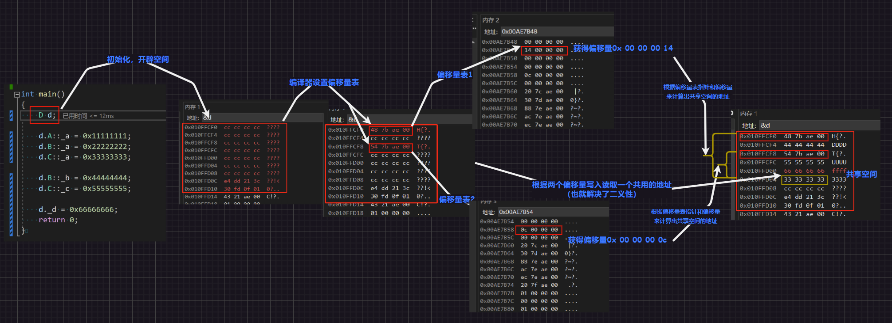

[TOC]

# 1.继承概念

“继承”是面向对象语言的三大特性之一（封装、继承、多态）。

继承（`inheritance`）机制是面向对象程序设计使代码可以复用的最重要的手段，它允许程序员在保持原有类特性基础上进行扩展，增加功能，这样产生新的类，称为“派生类/子类”。

继承呈现了面向对象程序设计的层次结构，体现了由简单到复杂的认知过程。之前我们接触的复用都是函数复用，继承是类设计层次的复用。

# 2.继承使用

继承发生在“基类/父类”和“派生类/子类”之间，语法形式就是：

```c++
class 父类名
{
    //方法
    //属性
};
class 子类名 : 继承方式 父类
{
    //...
};
```

那这个继承方式又是什么呢？在字面上和我们之前看到的`public`、`protected`、`private`是一样的，但是意义有所不同。继承方式和访问限定符可以相互组合，在父子类中有以下组合：

| 类成员/继承方式             | `public`继承         | `protected`继承      | `private`继承      |
| -------------------- | ------------------ | ------------------ | ---------------- |
| **子类的`public`成员**    | 子类中仍是`public`成员    | 子类中变成`protected`成员 | 子类中变成`private`成员 |
| **子类的`protected`成员** | 子类中仍是`protected`成员 | 子类中仍是`protected`成员 | 子类中变成`private`成员 |
| **子类的`private`成员**   | 子类中不可见，该成员为父类私有    | 子类中不可见，该成员为父类私有    | 子类中不可见，该成员为父类私有  |

实际上规律也简单：`公有>保护>私有`，在两个关键字中取小即可，有点类似权限缩小的感觉，当然：您可以选择调用父类的函数来无视这些限定（也就是间接访问）。

下面我们就以“人`Person`”父类来生成子类“学生`Student`”和“老师`Teacher`”：

```c++
class Person//父类  
{  
public:  
    void Print()  
    {  
        cout << "name:" << _name << endl;  
        cout << "age:" << _age << endl;  
    }
protected:  
    string _name = "peter";//姓名  
    int _age = 18;//年龄 
};  
//继承后父类的Person的成员（成员函数+成员变量）都会变成子类的一部分

class Student : public Person//继承子类
{  
protected:  
    int _stuid;//学号  
};
class Teacher : public Person
{
protected:
    int _jobid;//工号
};

int main()
{
    Student s;
    Teacher t;
    s.Print();
    t.Print();
    return 0;
}
```

> 注意`1`：实际应用中继承方式大多使用`public`，还有类内的访问限定符也大多使用`public`和`protected`。其他的继承方式和类内的访问限定符基本上都很少用，并且有很多时候都不推荐使用。
>
> 注意`2`：如果不写继承方式，那么默认继承方式是`private`（如果是结构体`struct`就默认`public`），但是最好还是显式写出继承方式为好。
>
> 注意`3`：父类的`private`成员在子类中无论以什么方式继承都是不可见的。这里的不可见是指父类的私有成员被继承到了子类对象中，但是语法上限制子类不管在类里还是类外都不能去访问它。
>
> ```c++
> #include <iostream>
> #include <string>
> using namespace std;
> class Person//父类  
> {
> public:
>     void Print()
>     {
>         cout << "name:" << _name << endl;
>         cout << "age:" << _age << endl;
>     }
> private:
>     string _name = "peter";//姓名  
>     int _age = 18;//年龄 
> };
> //继承后父类的Person的成员（成员函数+成员变量）都会变成子类的一部分
> 
> class Student : public Person//继承子类
> {
>     /*void function()
>     {
>         _name = "student";//失败
>         _age = 12;//失败
>     }*/
> };//不可以直接在类内使用从父类继承来的private变量，包括子类创建出来的对象（不可见），但是依旧可以被Print()使用
> class Teacher : public Person
> {
>     /*void function()
>     {
>         _name = "teacher";//失败
>         _age = 20;//失败
>     }*/
> };//不可以直接在类内使用从父类继承来的private变量，包括子类创建出来的对象（不可见），但是依旧可以被Print()使用
> 
> int main()
> {
>     Student s;
>     Teacher t;
>     /* 失败
>     s._name;
>     s._age;
>     t._name;
>     t._age;
>     */
>     s.Print();
>     t.Print();
>     return 0;
> }
> ```
>
> 注意`4`：由于父类的`private`成员在子类中是不能被访问，如果子类成员不想在类外直接被访问，但需要在子类中被访问，就使用限定符为`protected`即可。从这点也可以看出，保护成员限定符是因为继承才出现的。
>
> ```c++
> #include <iostream>
> #include <string>
> using namespace std;
> class Person//父类  
> {
> public:
>     void Print()
>     {
>         cout << "name:" << _name << endl;
>         cout << "age:" << _age << endl;
>     }
> protected:
>     string _name = "peter";//姓名  
>     int _age = 18;//年龄 
> };
> 
> class Student : public Person//继承子类
> {
> public:
>     void function()
>     {
>         _name = "student";//成功
>         _age = 12;//失败
>     }
> };
> class Teacher : public Person
> {
> public:
>     void function()
>     {
>         _name = "teacher";//成功
>         _age = 20;//失败
>     }
> };
> 
> int main()
> {
>     Student s;
>     Teacher t;
>     /* 失败语句
>     s._name = "student";
>     s._age = 12;
>     t._name = "teacher";
>     t._age = 20;
>     */
>     s.function();
>     t.function();
>     s.Print();
>     t.Print();
>     return 0;
> }
> ```

# 3.切片赋值 

公有类继承的子类可以直接赋值给父类，这个过程形象的说法叫做“切割/切片”，也有叫“赋值兼容转化”的。这个过程是纯天然的，没有隐式类型转化的发生（没有临时变量的产生，类似`int a = 1; int b = 10; a = b`的过程），而这种“切片”的现象实际上在指针和引用上也有体现。

```c++
#include <iostream>
#include <string>
using namespace std;
class Person
{
public:
    void Print()
    {
        cout << "name:" << _name << endl;
        cout << "age:" << _age << endl;
    }
protected:
    string _name = "peter";
    int _age = 18;
};

class Student : public Person
{
protected:
    int _stuid;
};

class Teacher : public Person
{
protected:
    int _jobid;
};

int main()
{
    //1.普通类型
    double a = 1.1;
    int b = a;//发生类型转化
    const int& ra = a;//中间会产生临时变量
    int* pa = (int*)&a;
    
    //2.子类切片给父类
    Student std;
    Person per = std;//没有发生类型转化，只是将子类中的成员变量拷贝给父类
    Person& rper = std;//没有产生临时变量，并且使用这一特性就好像给子类做了“切片”，rp本身还是子类，但是却只引用/切出了子类中继承自父类的那一部分成员（因此无需加上const）
    Person* pper = &std;//同理指针也是做了一些“切片”，指针解引用只能看到子类从父类哪里继承的那一部分成员
    
    //3.父类赋值给子类
    //std = per;//不允许
    //Student& rstd = per;//不允许
    //Student* pstd = &per;//不允许


    /* 这里我还暂时理解不了
    Student& rstd = (Student)per;//不允许
    
    pper = &std;
    Student* pstd = (Student*)pper;//允许

    pper = &per;
    pstd = (Student*)pper;//允许，但是有可能会越界
    */
    return 0;
}
```


*那反过来可以么？一般是不可以的，父类不可以直接赋值给子类，因为容易造成子类的属性缺失，有可能会出现问题。*

>   补充：父类的指针和引用可以通过“强制类型转化”赋值给子类的指针和引用，但是必须是父类的指针是指向子类对象时才是安全的（这里的父类如果是多态的，就可以使用`RTTI(Run-Time Type Information)`的`dynamic cast`来进行识别，然后进行安全转换，这点我们以后再来细说）。

# 4.隐藏父类

1. 在继承中父类和子类都有自己独立的作用域

2. 子类和父类有同名成员，但是子类将屏蔽父对类同名对象的直接访问，这种情况就叫“隐藏/重定义”，但是更加推荐使用“隐藏”，毕竟继承过来的父类对象也可以被显式使用

3. 函数也有类似“隐藏”的情况，注意需要和“重载区分（在同一个作用域）”。实际上，只需要函数名相同就可以达到“隐藏父类成员函数”，而重载需要在同一个作用域（隐藏关系的两个同名函数在两个类域），并且还有参数要求

4. 尽可能不使用同名的成员构成隐藏，不然有的时候会给自己挖坑...

```c++
#include <iostream>
#include <string>
using namespace std;
class Person
{
public:
    void Print()
    {
        cout << "name:" << _name << endl;
        cout << "age:" << _age << endl;
    }
protected:
    string _name = "peter";
    int _age = 18;
};

class Student : public Person
{
protected:
    string _name = "student";//父类的_name被子类Student隐藏了
    int _stuid;
public:
    void Print()//父类的Print()被子类Student隐藏了
    {
        cout << "name:" << _name << endl;
        cout << "age:" << _age << endl;//_age没有被子类隐藏，依旧打印从父类继承过来的_age
    }
};

class Teacher : public Person
{
protected:
    string _name = "teacher";//父类的_name被子类Teacher隐藏了
    int _jobid;
public:
    void Print()//父类的Print()被子类Teacher隐藏了
    {
        cout << "name:" << _name << endl;
        cout << "age:" << _age << endl;//_age没有被子类隐藏，依旧打印从父类继承过来的_age
    }
};

int main()
{
    Student s;
    s.Print();
    Teacher t;
    t.Print();
    return 0;
}
```

但是想要直接访问父类中被子类隐藏的成员怎么办呢？使用作用域解析运算符即可，因为父类的成员只是被隐藏而不是不存在了。

```c++
#include <iostream>
#include <string>
using namespace std;
class Person
{
public:
    void Print()
    {
        cout << "name:" << _name << endl;
        cout << "age:" << _age << endl;
    }
protected:
    string _name = "peter";
    int _age = 18;
};

class Student : public Person
{
protected:
    string _name = "student";//父类的_name被子类Student隐藏了
    int _stuid;
public:
    void Print()//父类的Print()被子类Student隐藏了
    {
        cout << "name:" << _name << endl;
        cout << "age:" << _age << endl;//_age没有被子类隐藏，依旧打印父类的_age
    }
};

class Teacher : public Person
{
protected:
    string _name = "teacher";//父类的_name被子类Teacher隐藏了
    int _jobid;
public:
    void Print()//父类的Print()被子类Teacher隐藏了
    {
        cout << "name:" << _name << endl;
        cout << "age:" << _age << endl;//_age没有被子类隐藏，依旧打印父类的_age
    }
};

int main()
{
    Student s;
    s.Print();
    Teacher t;
    t.Print();
    s.Person::Print();
    t.Person::Print();
    return 0;
}
```

# 5.子类成员

1.   子类的构造函数必须调用父类的构造函数初始化继承自父类的那一部分成员，而不能自己在子类中直接初始化。

     如果父类有默认构造函数，哪怕用户不写也会在子类构造函数的初始化列表处自动调用父类的默认构造函数。

     如果父类没有默认构造函数，则用户必须在子类构造函数的初始化列表阶段显示调用。因此，子类对象初始化先调用父类构造函数再调用子类构造函数。

2.   子类的析构函数会在被调用完成后自动调用父类的析构函数清理父类成员（不需要我们自己调用）。因为这样才能保证派生类对象先清理派生类成员再清理基类成员的顺序，避免出现：用户自己调用父类的析构函数，父类成员先被释放了，但是子类依旧可以使用父类的成员，造成越界访问的现象。

     因此在子类的析构函数内用户最好不要自己显式调用父类的析构函数，否则会多次调用析构函数。

     另外，编译器会对析构函数名进行特殊处理，处理成`destrutor()`，所以父类析构函数不加`virtual`的情况下，子类析构函数和父类析构函数是构成隐藏关系的（这是因为多态，才必须这么设置）。

     

3.   子类的拷贝构造函数必须调用父类的拷贝构造完成继承自父类的那一部分成员的拷贝初始化。但是父类的拷贝构造函数需要传递一个父类对象过去，如何把继承于父类的成员变量拿出来作为父类对象传给父类的拷贝构造函数呢？使用切片即可，这就是切片的实际应用

4.   子类的`operator=`必须要调用父类的`operator=`完成继承自父类的那一部分成员的复制，同理也是使用切片（不过需要指定父类，否则会发生无穷递归调用）

     >   注意：子类是没有办法直接隐藏父类的特殊成员函数的，这也体现了成员函数的特殊性。当然，这除去了析构函数的特殊情况。

5.   使用父类的成员函数最好一定要带上父类和作用域解析运算符，否则就有可能因为隐藏而出现自己调用自己的情况，就会变成无穷递归（例如：下述代码中子类的`Person::Print()`调用）。

```c++
#include <iostream>
#include <string>
using namespace std;
//1.父类Person
class Person
{
public:
    Person(string name, int age) : _name(name), _age(age)//不是默认的构造函数
    {
        cout << "Person(string nume, int age) : _name(\"peter\"), _age(18)" << endl;
    }
    ~Person()
    {
        cout << "~Person()" << endl;
    }
    Person(Person& p)//不是默认的拷贝构造函数
    {
        cout << "Person(Person& p)" << endl;
        _name = p._name;
        _age = p._age;
    }
    Person& operator=(const Person& p)//不是默认的赋值重载函数
    {
        cout << "Person operator=(const Person& p)" << endl;
        if (this != &p)
        {
            _name = p._name;
            _age = p._age;
        }
        return *this;
    }
    void Print()
    {
        cout << "Print()" << endl;
        cout << "name:" << _name << " age:" << _age << endl;
    }
protected:
    string _name;
    int _age;
};

//2.子类Student
class Student : public Person
{
public:
    Student(string name, int age, int stuid = 00000000) : Person(name, age), _stuid(stuid)//这里调用显示调用父类的构造函数（并且没有明确指定父类），初始化子类中从父类继承过来的成员，然后才初始化子类自己的成员
    {
        cout << "Student(string name, int age, int stuid = 00000000) : Person(name, age), _stuid(stuid)" << endl;
    }
    ~Student()
    {
        cout << "~Student()" << endl;
        //无需自己调用父类函数的析构函数，编译器会自己帮助我们调用
    }
    Student(Student& s) : Person(s), _stuid(s._stuid)//这里使用了切片显式调用父类的拷贝构造函数（可以选择不指定父类），初学者推荐一直显式调用，有助于代码理解和可读性。
    {
        cout << "Student(Student& s) : Person(s), _stuid(s._stuid)" << endl;
    }
    Student& operator=(const Student& p)
    {
        cout << "Student& operator=(const Student& p)" << endl;
        if (this != &p)
        {
            Person::operator=(p);
            _stuid = p._stuid;
        }
        return *this;
    }
    void Print()//构成成员函数隐藏了
    {
        //Print();//这就变成自己调用自己了，此时就不可以不明确父类了
        Person::Print();//指明父类
        cout << "stuid:" << _stuid << endl;
    }
protected:
    int _stuid;
};
int main()
{
    Student s1("limou", 18, 22130800);
    Student s2(s1);
    Student s3("daimou", 22, 22109988);
    s1 = s3;

    s1.Print();
    s2.Print();
    s3.Print();
    return 0;
}
```

# 6.不可继承

## 6.1.友元关系

友元关系是不会被继承的，也就是说，如果父类有一个友元函数，那么这个友元函数只可以使用父类的成员变量，而不可以使用从父类继承过来的子类的内部成员变量。

```c++
#include <iostream>
#include <string>
using namespace std;

class Student;//这句是声明，告诉编译器有一个类的存在，让下面在Person内的函数可以通过编译
class Person
{
public:
	friend void Display(const Person& p, const Student& s);
protected:
	string _name;//姓名
};
class Student : public Person
{
protected:
	int _stuNum;//学号
};
void Display(const Person& p, const Student& s)
{
	cout << p._name << endl;
	//cout << s._stuNum << endl;//该语句不正确
}

int main()
{
	Person p;
	Student s;
	Display(p, s);
	return 0;
}
```

这种情况下只能再定义一个友元关系给子类。

```c++
#include <iostream>
#include <string>
using namespace std;

class Student;//这句是声明，告诉编译器有一个类的存在，让下面在Person内的函数可以通过编译
class Person
{
public:
	friend void Display(const Person& p, const Student& s);
protected:
	string _name;//姓名
};
class Student : public Person
{
	friend void Display(const Person& p, const Student& s);
protected:
	int _stuNum;//学号
};
void Display(const Person& p, const Student& s)
{
	cout << p._name << endl;
	cout << s._stuNum << endl;//该语句不正确
}

int main()
{
	Person p;
	Student s;
	Display(p, s);
	return 0;
}
```

## 6.2 .静态成员

静态成员变量属于整个类，不仅仅属于父类，也属于子类，因此不能说子类继承静态成员变量，这么说是不准确的。

```c++
#include <iostream>
#include <string>
using namespace std;
class Person
{
public:
	Person() { ++_count; }
protected:
	string _name;//姓名
public:
	static int _count;//统计人（对象）的个数
};
int Person::_count = 0;

class Student : public Person
{
protected:
	int _stuNum;//学号
};

class Graduate : public Student
{
protected:
	string _seminarCourse;//研究科目
};
void TestPerson()
{
	Student s1;
	Student s2;
	Graduate s3;
	Graduate s4;
	cout << "人数:" << Student::_count << endl;
	Person::_count = 0;
	cout << "人数:" << Graduate::_count << endl;
}
int main()
{
	TestPerson();
	return 0;
}
```

也就是说父类中使用的静态成员变量和子类的静态成员变量是一样的（不过这其实也侧面说明，从父类中的成员变量和子类中的成员变量只是拷贝关系，各自的地址是不一样的）。  

# 7.虚拟继承

## 7.1.不可能棱形

我之前提到的继承都是“单个父类继承给多个子类”的“单继承”，但是`C++`在开发之初为了更加符合现实中“多个父类继承个单个子类”的现象，设计了“多继承”。

但是没有想到因此出现了一个新的问题：棱形继承，具有“二义性”和”数据冗余“的两大缺陷。棱形继承是多继承的一种特殊情况，其内容为：”假设有一个父类，其有两个子类，而两个子类又通过多继承得出一个子子类，这个子子类创建出来的对象会从两个子类继承，那么会出现相同的成员，也就是二义性（不知道使用的是哪一个子类的成员）和数据冗余（有可能出现重复相同的成员变量）“。


```c++
#include <iostream>
#include <string>
using namespace std;
class Person
{
public:
    Person()
        : _name("peter"), _age(18)
    {
        cout << "Person()" << endl;
    }
public:
    string _name;
    int _age;
};

class Student : public Person
{
public:
    Student()
        :Person(), _stuid(22103)
    {}
public:
    int _stuid;
};

class Teacher : public Person
{
public:
    Teacher()
        :Person(), _jobid(88903)
    {}
protected:
    int _jobid;
};
class Graduate : public Student, public Teacher//多继承
{
protected:
    int _graid;
};

int main()
{
    Graduate g;
    //cout << g._name << endl;//运行失败，具有二义性
    cout << g.Student::_name << endl;//运行成功，成功解决二义性
    cout << g.Teacher::_name << endl;//运行成功，成功解决二义性
    return 0;
}
```


二义性我们尚且可以通过作用域解析运算符来解决，但是数据冗余还需要使用`virtual`关键字才能解决。该关键字加在两个子类的继承方式处，但是也因此变得很复杂...

> 补充：因此多继承会让代码变得复杂，所以`Java`直接移除了多继承的功能。

## 7.2.虚继承操作

为什么数据冗余使用`virtual`关键字就能解决呢？我们来查看一下底层。

这里我们最好不要查看编译器的调试窗口，而是使用内存窗口（因为调试窗口为了方便展示又可能做了一些优化，比如：使用内联函数，有些编译器的调试器会让您觉得这是在调用函数）。

### 7.2.1.不加关键字

```c++
#include <iostream>
#include <string>
using namespace std;
class A//父类A
{
public:
    int _a;
};

class B : public A//子类B
{
public:
    int _b;
};

class C : public A//子类C
{
public:
    int _c;
};

class D : public B, public C//多继承后的子子类D
{
public:
    int _d;
};

int main()
{
    D d;
    d.B::_a = 1;
    d.C::_a = 2;

    d._b = 3;//或者d.B::_b = 3;
    d._c = 4;//或者d.C::_c = 4;

    d._d = 5;
    return 0;
}
```


可以看到，每一个变量都存储在不同的地址上。

### 7.2.2.加上关键字

```c++
#include <iostream>
#include <string>
using namespace std;
class A//父类A
{
public:
    int _a;
};

class B : virtual public A//子类B
{
public:
    int _b;
};

class C : virtual public A//子类C
{
public:
    int _c;
};

class D : public B, public C//多继承后的子子类D
{
public:
    int _d;
};

int main()
{
    D d;
    d.B::_a = 1;
    d.C::_a = 2;

    d._b = 3;//或者d.B::_b = 3;
    d._c = 4;//或者d.C::_c = 4;

    d._d = 5;
    return 0;
}
```


因此我们成功解决了二义性和数据冗余的问题，需要注意的是，虚拟继承最好不要在其他地方去使用。

## 7.3.虚继承原理

通过上面的调试我们发现，在解决二义性的时候，好像`D`从`B`、`C`、`A`处继承的`_a`成员是在一个地址上的变量？这个应该怎么理解呢？让我们通过调试来理解虚继承的原理。



将`B`和`C`和`D`中同属于`A`的部分变成一个公共部分，在继承自`B`和`C`的部分中多出两个指针，各自指向一块表空间，这些表内存储了指针偏移量信息。利用指针偏移量和表指针的地址即可找到一块公共空间，消除二义性。

那为什么是指针指向一个偏移量表，而不是直接使用指针指向公共空间呢？这些后面多态再来讨论，指针固然能解决这个问题，但是使用偏移量还能再进一步解决多态的问题...
这样子子类在使用从两个子类继承过来的变量的时候，实际上是同一个变量，解决了冗余性和二义性。

既然棱形继承这么复杂，那应该会很少使用吧？实际上您有可能天天用这，`iostream`类就是通过`istream`类和`ostream`类棱形继承来的...


>   注意：上述两图来源于：[Reference - C++ Reference (cplusplus.com)](https://legacy.cplusplus.com/reference/)和[输入/输出库 - cppreference.com](https://zh.cppreference.com/w/cpp/io)，感兴趣您可以去查看一下。

下面有一道结合了虚拟继承的面试题目供您思考一下，让您更加了解虚继承和初始化列表的初始化顺序。

```c++
#include <iostream>
#include <string>
using namespace std;
class A
{
public:
    A(const char* s)
    {
        cout << s << endl;
    }
    ~A() {}
};

class B : virtual public A
{
public:
    B(const char* s1, const char* s2)
        : A(s1)
    {
        cout << s2 << endl;
    }
};

class C : virtual public A
{
public:
    C(const char* s1, const char* s2)
        : A(s1)
    {
        cout << s2 << endl;
    }
};
class D : public B, public C//多继承
{
public:
    D(const char* s1, const char* s2, const char* s3, const char* s4)
        : B(s1, s2), C(s1, s3), A(s1)
    {
        cout << s4 << endl;
    }
};

int main()
{
    D* p = new D("class A", "class B", "class C", "class D");
    //按照初始化列表的根据谁先定义先初始化的原则：
    //先调用A(s1)，然后调用B(s1, s2)，然后调用C(s1, s3)，然后打印"class D"
    //也就是先调用A(s1)，然后打印"class B"，然后调用A(s1)，然后打印"class C"，然后调用A(s1)，然后打印"class D"
    //由于在D中从B和C中继承过来的A的成员是公共部分，因此只会调用一次构造函数A(s1)，并且这个构造函数A(s1)是在D中被调用的
    //于是得到：A、B、C、D
    delete p;
    return 0;
}
```

# 8.继承/组合

继承和组合都是一种复用，以下是继承和组合的区别（不过这里只讨论公有方式的继承）：

```c++
//继承is-a
class A1
{};
class B1 : public A1
{};

//组合has-a
class A2
{};
class B2
{
private:
    A2 _a;
};
```

那么这个`is-a`和`has-a`，是什么呢？一个是“是一个（也就是继承）”的关系，一个是“拥有一个（也就是组合）”的关系。

从“关联关系/耦合度”上来看继承会更高，`B1`可以直接使用`A1`的所有成员，但是`B2`只能使用`A2`的函数成员，间接调用其他的`A2`成员（因此对象组合也是一种黑箱/黑盒风格）。

但在软件设计中有一种设计理念就是“低耦合、高内聚”，因此在实践中，应该尽可能去用组合，这样的代码维护性更好（具体还要看实际）。

1.   如果是为了实现多态，那就必须使用继承（多态我们后面再谈）
2.   如果描述类之间的关系时，继承和组合都可以，那么应该尽量使用组合
