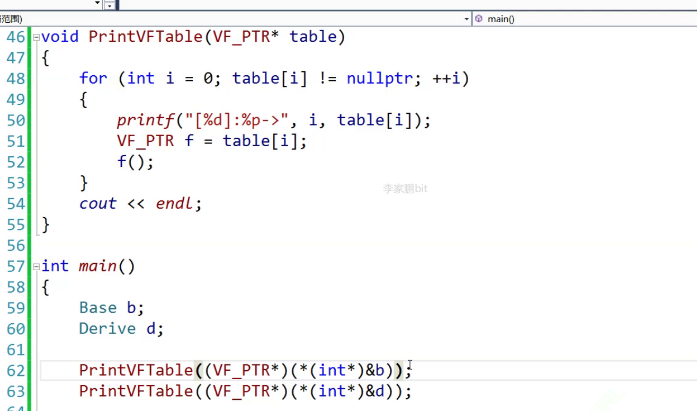
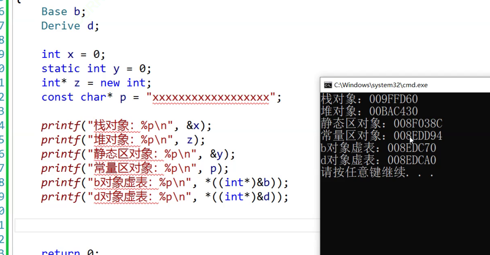

# 1.多态概念

就是“多种形态”，完成某个方法的时候，使用不同的对象就会得出不同的结果。

# 2.多态使用

多态会使用一种叫做”虚函数“的东西，多态关键字和虚继承是一样的，但是两者没有关系，只是共用了一个关键字`virtual`，这个关键字只能修饰成员。

书写一个子类的虚函数，可以叫做“对父类成员函数的重写/覆盖（注意和继承的隐藏/重定义做好区分）”。

>   区分：隐藏/重定义、重写/覆盖、重载的区别
>
>   1.   隐藏/重定义发生在两个具有父子关系的类中，只需要父子各自拥有的函数或者变量名字相同即可构成隐藏/重定义
>   2.   重写/覆盖发生在两个具有父子关系的类中，需要父子各自拥有的函数的函数签名（函数返回值、函数名、函数参数列表）严格相同，并且带有关键字`virtual`（除去协变的情况）
>   3.   重载发生在同一个作用域中（不能发生在两个类域），需要函数名字相同，参数列表不同

```c++
#include <iostream>
#include <string>
using namespace std;
class Person
{
public:
    virtual void BuyTicket()//虚函数
    {
        cout << "买票-全价" << endl;
    }
};

class Student : public Person
{
public:
    virtual void BuyTicket()//虚函数
    {
        cout << "买票-半价" << endl;
    }
};

class Child : public Person
{
public:
    virtual void BuyTicket()//虚函数
    {
        cout << "买票-免费" << endl;
    }
};

void Function(Person& p)//只能使用指针和引用去调用达成多态
{
    p.BuyTicket();
}

int main()
{
    //1.父类
    Person p;
    //2.子类
    Student s;
    Child c;
    //3.调用不同的函数
    Function(p);
    Function(s);
    Function(c);
    return 0;
}
```

这里使用多态的时候就产生了切片。这里要注意多态的构成条件：

1.   构成多态必须有虚函数重写
2.   必须使用父类的指针或引用去调用虚函数

这里的虚函数重写怎么理解呢？必须是具有父子继承关系的两个成员虚函数，并且两者的函数签名（函数返回值、函数名、函数参数列表）完全相同，但是内部定义可以不同的。

但是，`C++`有些例外情况，使得哪怕函数签名不完全相同也构成多态。虚函数的返回值可以不同，这种情况也叫做”协变“（很少使用协变）。但是此时构成多态的函数的返回值类型必须是具有父子继承关系类的类型的指针或引用（如果是其他不具有继承关系的类型的返回值就有可能会报错）。

```cpp
//协变例子
#include <iostream>
using namespace std;

//一对具有父子关系的类
class Father
{
	int _father_value;
};
class Child: public Father
{
	int _child_value;
};

//A、B父子类，内含虚函数
class A
{
public:
	virtual A* func()
	{
		cout << "virtual A* func()" << endl;
		return nullptr;
	}
};
class B : public A
{
public:
	virtual B* func()//构成多态
	{
		cout << "virtual B* func()" << endl;
		return nullptr;
	}
};

int main()
{
	A a;
	B b;
	A* pa = &a;
	A* pb = &b;

	pa->func();
	pb->func();

	return 0;
}
```

另外如果父类的函数加了`virtual`成为了虚函数，那么子类就可以不加`virtual`，依旧是构成了多态的重写（挺让人吐槽的），但是我们建议加上，因为这样可读性更好。

# 3.多态析构

之前我们提到过：在继承的时候，析构函数是很特殊的，是编译器自己调用，并且还统一改名为`destrutor()`。编译器为了避免内存泄露自己调控析构的顺序这我们能立即，但是为什么需要改名呢？

```c++
//不用多态
#include <iostream>
using namespace std;
class Person
{
public:
    void func()
    {
        cout << "Person:virtual void func()" << endl;
    }
    ~Person()
    {
        cout << "~Person()" << endl;
    }
};
class Student : public Person
{
public:
    void func()
    {
        cout << "Student:virtual void func()" << endl;
    }
    ~Student()
    {
        cout << "~Student()" << endl;
    }
};

int main()
{
    Person* ptr1 = new Person;
    Student* ptr2 = new Student;

    ptr1->func();
    ptr2->func();

    delete ptr1;
    delete ptr2;

    return 0;
}
//输出：
//Person:virtual void func()
//Student:virtual void func()
//~Person()
//~Student()
//~Person()
//没毛病，这里析构的前两句都是在ptr2内完成的，在ptr2释放完自己的资源后，编译器自动调用父类的资源，释放父类的资源
```

但是如果使用指针或者引用来构成多态就会出现问题了：

```c++
//使用多态（修改前）
#include <iostream>
using namespace std;
class Person
{
public:
    virtual void func()
    {
        cout << "Person:virtual void func()" << endl;
    }
    ~Person()
    {
        cout << "~Person()" << endl;
    }
};
class Student : public Person
{
public:
    virtual void func()
    {
        cout << "Student:virtual void func()" << endl;
    }
    ~Student()
    {
        cout << "~Student()" << endl;
    }
};

int main()
{
    Person* ptr1 = new Person;
    Person* ptr2 = new Student;

    ptr1->func();
    ptr2->func();

    delete ptr1;
    delete ptr2;
    return 0;
}
//输出：
//Person:virtual void func()
//Student:virtual void func()
//~Person()
//~Person()
//出问题了，ptr2内部的子类资源没有被释放掉，原因是因为析构函数没有构成多态
```

为什么呢，因为这里的析构函数没有构成多态，而`delete`调用`ptr1->destructor()`和`ptr2->destructor()`，由于析构函数没有关键字`virtual`，没有构成多态，在编译器看来，使用了什么类型的指针调用析构函数，就用对应类型的析构函数，也就造成了内存泄漏。

那么如何构成多态呢？原本析构函数在不同类中的名字一定是不相同的，无法直接构成多态。但是编译器已经统一将具有继承关系的析构函数名称改为`destructor()`，让析构函数构成父子隐藏，这样使用析构函数才会变成使用`ptr1->destructor()`和`ptr2->destructor()`。

这个时候只要给所有具有继承关系的析构函数加上关键字`virtual`即可让析构函数构成多态，使用`ptr1->destructor()`和`ptr2->destructor()`也就具有了多态的行为（也就是单独对析构改名的原因，而其他成员函数无需这样，他们并不需要构成多态）。

只需要这么修改即可：

```c++
//使用多态（修改后）
#include <iostream>
using namespace std;
class Person
{
public:
    virtual void func()
    {
        cout << "Person:virtual void func()" << endl;
    }
    virtual ~Person()
    {
        cout << "~Person()" << endl;
    }
};
class Student : public Person
{
public:
    virtual void func()
    {
        cout << "Student:virtual void func()" << endl;
    }
    virtual ~Student()
    {
        cout << "~Student()" << endl;
    }
};

int main()
{
    Person* ptr1 = new Person;
    Person* ptr2 = new Student;

    ptr1->func();
    ptr2->func();

    delete ptr1;
    delete ptr2;
    return 0;
}
//输出：
//Person:virtual void func()
//Student:virtual void func()
//~Person()
//~Student()
//~Person()
```

再结合我们之前在[2.多态使用](#2.多态使用)最后中提到的”如果父类的函数加了`virtual`成为了虚函数，那么子类就可以不加`virtual`，依旧是构成了多态的重写“，我们其实只需要在父类析构函数加上关键字足够了。

```c++
//使用多态（修改后）
#include <iostream>
using namespace std;
class Person
{
public:
    virtual void func()
    {
        cout << "Person:virtual void func()" << endl;
    }
    virtual ~Person()
    {
        cout << "~Person()" << endl;
    }
};
class Student : public Person
{
public:
    void func()
    {
        cout << "Student:virtual void func()" << endl;
    }
    ~Student()
    {
        cout << "~Student()" << endl;
    }
};

int main()
{
    Person* ptr1 = new Person;
    Person* ptr2 = new Student;

    ptr1->func();
    ptr2->func();

    delete ptr1;
    delete ptr2;
    return 0;
}
//输出：
//Person:virtual void func()
//Student:virtual void func()
//~Person()
//~Student()
//~Person()
```

# 4.多态原理

## 4.1.单继承

使用虚函数的类会多一个`_vfptr`虚函数表指针成员，指向一个虚函数指针数组。

实际这就是多态的原理，虚函数为什么和指针类型无关，而是指针指向的类型有关呢？

父类对象的虚表存储父类虚函数，子类对象的虚表存储子类虚函数。

在汇编代码的时候就可以看出。

重写是语言层面，覆盖是原理层面（覆盖率虚函数表内的指针成员）。

为什么不直接存在对象内？有可能有多个虚函数。

虚函数表在编译时就会提前准备好。

并且虚函数谁先声明谁的下标就越前。

那为什么直接对象切片不可以使用多态呢？表面看是规定，本质是内部虚表指针成员不会被拷贝（调用拷贝构造函数没有办法拷贝虚表，只能拷贝别的成员）因此不会有多态。

也就是说多态依赖于虚函数表/虚函数表指针。

虚函数存在虚表？不对的，虚函数和普通函数一样存储方式，但是虚表留有虚函数的指针。

## 4.2.多继承

多继承就会又多个虚表存在，但是对于子类自己实现的，在两个虚表内会有两个覆盖。如果用父类调用两个覆盖，在调试器的地址中不一样，这是为什么？实际上最后函数调用的结果是一样，只是做了封装将`this`指针做了修改。

# 5.打印虚表

虚表是在编译时生成好的，实际并不神秘。而对象中的虚表指针是在构造函数的初始化列表阶段生成的（这点可以调试出来，这一过程是编译器自己做的）。



那么虚表存储在哪里呢？可以打印不同存储空间的变量来对比一下，可以看到在常量区。



# 6.抽象概念

这个也叫“接口继承”，只需要继承父类的虚函数成员之后重写这个函数即可，不需要关键字修饰。

普通函数的继承是一种实现继承，如果子类继承了父类函数，那么就可以使用该函数。而虚函数的继承是一种实现继承，目的是为了重写，达成多态，继承的是接口，如果不实现多态就不要写成虚函数。

> 补充：两个有关虚函数的关键字
>
> 1. `final`：修饰虚函数，表示该函数不能被重写，加在函数名后面
>
> 2. `override`：检查子类的虚函数是否重写了父类的某个虚函数，没有重写就编译报错，也是写在函数名字的后面（但是是在子类写）

>   区别：重载、重写/覆盖、重定义/隐藏的区别

在虚函数的后面加上`=0`那么这个函数就会变成纯虚函数，包含纯虚函数的类也叫抽象类（接口类），抽象类不能实例出对象。

抽象类强制子类重写。
