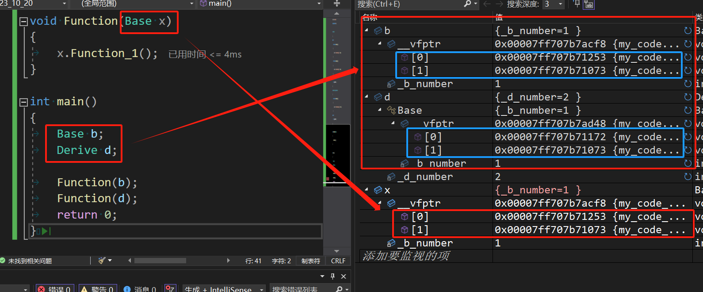
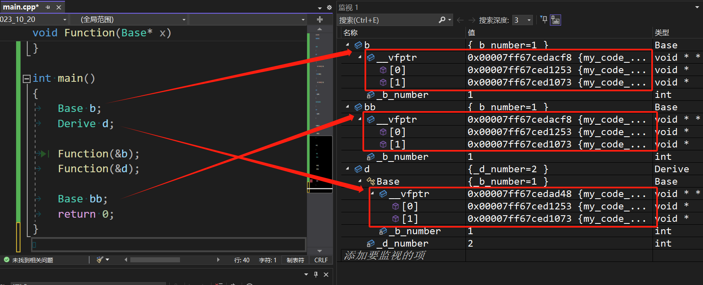

# 1.多态概念

就是“多种形态”，完成某个方法的时候，使用不同的对象就会得出不同的结果。

# 2.多态使用

多态会使用一种叫做”虚函数“的东西，多态关键字和虚继承是一样的，但是两者没有关系，只是共用了一个关键字`virtual`，这个关键字只能修饰成员。

书写一个子类的虚函数，可以叫做“对父类成员函数的重写/覆盖（注意和继承的隐藏/重定义做好区分）”。

>   区分：隐藏/重定义、重写/覆盖、重载的区别
>
>   1.   隐藏/重定义发生在两个具有父子关系的类中，只需要父子各自拥有的函数或者变量名字相同即可构成隐藏/重定义
>   2.   重写/覆盖发生在两个具有父子关系的类中，需要父子各自拥有的函数的函数签名（函数返回值、函数名、函数参数列表）严格相同，并且带有关键字`virtual`（除去协变的情况）
>   3.   重载发生在同一个作用域中（不能发生在两个类域），需要函数名字相同，参数列表不同

```c++
#include <iostream>
#include <string>
using namespace std;
class Person
{
public:
    virtual void BuyTicket()//虚函数
    {
        cout << "买票-全价" << endl;
    }
};

class Student : public Person
{
public:
    virtual void BuyTicket()//虚函数
    {
        cout << "买票-半价" << endl;
    }
};

class Child : public Person
{
public:
    virtual void BuyTicket()//虚函数
    {
        cout << "买票-免费" << endl;
    }
};

void Function(Person& p)//只能使用指针和引用去调用达成多态
{
    p.BuyTicket();
}

int main()
{
    //1.父类
    Person p;
    //2.子类
    Student s;
    Child c;
    //3.调用不同的函数
    Function(p);
    Function(s);
    Function(c);
    return 0;
}
```

这里使用多态的时候就产生了切片。这里要注意多态的构成条件：

1.   构成多态必须有虚函数重写
2.   必须使用父类的指针或引用去调用虚函数

这里的虚函数重写怎么理解呢？必须是具有父子继承关系的两个成员虚函数，并且两者的函数签名（函数返回值、函数名、函数参数列表）完全相同（函数参数主要是看类型是否相同，与缺省值是否相同或者参数名字是否相同无关），但是内部定义可以不同的。

但是，`C++`有些例外情况，使得哪怕函数签名不完全相同也构成多态。虚函数的返回值可以不同，这种情况也叫做”协变“（很少使用协变）。但是此时构成多态的函数的返回值类型必须是具有父子继承关系类的类型的指针或引用（如果是其他不具有继承关系的类型的返回值就有可能会报错）。

```cpp
//协变例子
#include <iostream>
using namespace std;

//一对具有父子关系的类
class Father
{
	int _father_value;
};
class Child: public Father
{
	int _child_value;
};

//A、B父子类，内含虚函数
class A
{
public:
	virtual A* func()
	{
		cout << "virtual A* func()" << endl;
		return nullptr;
	}
};
class B : public A
{
public:
	virtual B* func()//构成多态
	{
		cout << "virtual B* func()" << endl;
		return nullptr;
	}
};

int main()
{
	A a;
	B b;
	A* pa = &a;
	A* pb = &b;

	pa->func();
	pb->func();

	return 0;
}
```

另外如果父类的函数加了`virtual`成为了虚函数，那么子类就可以不加`virtual`，依旧是构成了多态的重写（挺让人吐槽的），但是我们建议加上，因为这样可读性更好。

>   补充`1`：两个有关虚函数的关键字
>
>   1. `final`：必须是修饰虚函数，表示该函数不能被重写，加在函数名后面（如果是加在类后，该类就不能被继承）
>
>   2. `override`：检查子类的虚函数是否真的重写了父类的某个虚函数，没有重写就编译报错，也是写在函数名字的后面（但是是在子类写）
>
>   补充`2`：实际上虚函数继承就是一种接口继承，而普通的继承是一种实现继承。

# 3.多态析构

之前我们提到过：在继承的时候，析构函数是很特殊的，是编译器自己调用，并且还统一改名为`destrutor()`。编译器为了避免内存泄露自己调控析构的顺序这我们能立即，但是为什么需要改名呢？

```c++
//不用多态
#include <iostream>
using namespace std;
class Person
{
public:
    void func()
    {
        cout << "Person:virtual void func()" << endl;
    }
    ~Person()
    {
        cout << "~Person()" << endl;
    }
};
class Student : public Person
{
public:
    void func()
    {
        cout << "Student:virtual void func()" << endl;
    }
    ~Student()
    {
        cout << "~Student()" << endl;
    }
};

int main()
{
    Person* ptr1 = new Person;
    Student* ptr2 = new Student;

    ptr1->func();
    ptr2->func();

    delete ptr1;
    delete ptr2;

    return 0;
}
//输出：
//Person:virtual void func()
//Student:virtual void func()
//~Person()
//~Student()
//~Person()
//没毛病，这里析构的前两句都是在ptr2内完成的，在ptr2释放完自己的资源后，编译器自动调用父类的资源，释放父类的资源
```

但是如果使用指针或者引用来构成多态就会出现问题了：

```c++
//使用多态（修改前）
#include <iostream>
using namespace std;
class Person
{
public:
    virtual void func()
    {
        cout << "Person:virtual void func()" << endl;
    }
    ~Person()
    {
        cout << "~Person()" << endl;
    }
};
class Student : public Person
{
public:
    virtual void func()
    {
        cout << "Student:virtual void func()" << endl;
    }
    ~Student()
    {
        cout << "~Student()" << endl;
    }
};

int main()
{
    Person* ptr1 = new Person;
    Person* ptr2 = new Student;

    ptr1->func();
    ptr2->func();

    delete ptr1;
    delete ptr2;
    return 0;
}
//输出：
//Person:virtual void func()
//Student:virtual void func()
//~Person()
//~Person()
//出问题了，ptr2内部的子类资源没有被释放掉，原因是因为析构函数没有构成多态
```

为什么呢，因为这里的析构函数没有构成多态，而`delete`调用`ptr1->destructor()`和`ptr2->destructor()`，由于析构函数没有关键字`virtual`，没有构成多态，在编译器看来，使用了什么类型的指针调用析构函数，就用对应类型的析构函数，也就造成了内存泄漏。

那么如何构成多态呢？原本析构函数在不同类中的名字一定是不相同的，无法直接构成多态。但是编译器已经统一将具有继承关系的析构函数名称改为`destructor()`，让析构函数构成父子隐藏，这样使用析构函数才会变成使用`ptr1->destructor()`和`ptr2->destructor()`。

这个时候只要给所有具有继承关系的析构函数加上关键字`virtual`即可让析构函数构成多态，使用`ptr1->destructor()`和`ptr2->destructor()`也就具有了多态的行为（也就是单独对析构改名的原因，而其他成员函数无需这样，他们并不需要构成多态）。

只需要这么修改即可：

```c++
//使用多态（修改后）
#include <iostream>
using namespace std;
class Person
{
public:
    virtual void func()
    {
        cout << "Person:virtual void func()" << endl;
    }
    virtual ~Person()
    {
        cout << "~Person()" << endl;
    }
};
class Student : public Person
{
public:
    virtual void func()
    {
        cout << "Student:virtual void func()" << endl;
    }
    virtual ~Student()
    {
        cout << "~Student()" << endl;
    }
};

int main()
{
    Person* ptr1 = new Person;
    Person* ptr2 = new Student;

    ptr1->func();
    ptr2->func();

    delete ptr1;
    delete ptr2;
    return 0;
}
//输出：
//Person:virtual void func()
//Student:virtual void func()
//~Person()
//~Student()
//~Person()
```

再结合我们之前在[2.多态使用](#2.多态使用)最后中提到的”如果父类的函数加了`virtual`成为了虚函数，那么子类就可以不加`virtual`，依旧是构成了多态的重写“，我们其实只需要在父类析构函数加上关键字足够了。

```c++
//使用多态（修改后）
#include <iostream>
using namespace std;
class Person
{
public:
    virtual void func()
    {
        cout << "Person:virtual void func()" << endl;
    }
    virtual ~Person()
    {
        cout << "~Person()" << endl;
    }
};
class Student : public Person
{
public:
    void func()
    {
        cout << "Student:virtual void func()" << endl;
    }
    ~Student()
    {
        cout << "~Student()" << endl;
    }
};

int main()
{
    Person* ptr1 = new Person;
    Person* ptr2 = new Student;

    ptr1->func();
    ptr2->func();

    delete ptr1;
    delete ptr2;
    return 0;
}
//输出：
//Person:virtual void func()
//Student:virtual void func()
//~Person()
//~Student()
//~Person()
```

当然需要注意，只有在使用指针`new`和`delete`的时候才会出现这样的问题,，使用引用就不会，原因很简单，引用之前已经有了子类的实例化变量，析构已经不关多态的事情了。

```cpp
//使用多态（修改前）
#include <iostream>
using namespace std;
class Person
{
public:
    virtual void func()
    {
        cout << "Person:virtual void func()" << endl;
    }
    ~Person()
    {
        cout << "~Person()" << endl;
    }
};
class Student : public Person
{
public:
    virtual void func()
    {
        cout << "Student:virtual void func()" << endl;
    }
    ~Student()
    {
        cout << "~Student()" << endl;
    }
};

int main()
{
    Student s;
    Person p;

    Person& rs = s;
    Person& rp = p;

    rs.func();
    rp.func();

    return 0;
}
//输出：
//Student:virtual void func()
//Person : virtual void func()
//~Person()
//~Student()
//~Person()
//没有出问题
```

# 4.多态隐藏

有些时候，多态隐藏得很深，有可能会隐藏到`this`里，下面这个题目就很坑：

```cpp
//隐藏的多态
#include <iostream>
using namespace std;
class A
{
public:
	virtual void func(int val = 1)
	{
		cout << "A->" << val << endl;
	}
	virtual void test()
	{
		func();
	}
};
class B : public A
{
public:
	void func(int val = 0)//隐藏/重定义了func
	{
		cout << "B->" << val << endl;
	}
	//还完整继承了 virtual void test(A* const this) 继承的实质是可以使用父类的函数，而不是真的有一个函数在子类中
};
int main()
{
	B* p = new B;
	p->test();
	//调用了B类内的test函数，但是使用父类指针接受p指针，
	//造成多态，因此调用的是子类的func()，但是实际上虚函数是
	//虚函数的继承实际上是继承了了父类函数的接口，然后重写了实现，
	//因此子类内的缺省值用的是父类的缺省值（子类）

	p->func();//这里就没有构成多态了，正常调用了子类成员函数
	return 0;
}
```

>   吐槽：实际当中谁要是写了这种代码必会被人吐槽...

# 5.多态原理

我们先来看一段代码：

```cpp
#include <iostream>
using namespace std;

class Base
{
public:
	virtual void Function()
	{
		cout << "Function()" << endl;
	}
private:
	int _b = 1;
};

int main()
{
	Base b;
	cout << sizeof(b) << endl;//32位输出8，64位输出16
	return 0;
}
```

这个现象很奇怪，仿佛类的实例化变量还有一个成员。实际上，的确存在一个隐藏的成员。

## 5.1.单类继承

虚函数为什么和指针类型无关，而是指针指向的类型有关呢？

这是因为使用虚函数的父类在编译时就会多一个`_vfptr`（在`VS`中是叫这个名字，但是名称起得不太好，应该叫`_vft`之类的，代表指向一个虚函数表）虚函数表指针成员，指向一个虚函数指针数组，该数组存储虚函数成员的地址，这就是多态的原理。

父类对象的虚表指针成员指向的虚表存储父类虚函数，而子类对象的虚表指针从父类继承来。虚表只能存储虚函数指针，而父子的虚函数本身存储在代码段。

但是父子之间的虚函数表指针指向的虚函数表是不一样的，父子各自指向的表内的众多虚函数指针原本是一样的（子类拷贝的是父类的虚函数地址），但是经过覆盖，导致子类的指向的虚函数表内存储的虚函数地址发生了变化（这个过程就是虚函数重写，如果没有覆盖，那么数组内容就会一样），当然这是一种现象的说法，实际上的编译器可能会直接在汇编层面直接修改，达成多态，只是我们的说法与之等价罢了。

```cpp
#include <iostream>
using namespace std;

class Base
{
public:
	virtual void Function_1()
	{
		cout << "Base:Function_1()" << endl;
	}
	virtual void Function_2()
	{
		cout << "Base:Function_2()" << endl;
	}
private:
	int _b_number = 1;
};
class Derive : public Base
{
	virtual void Function_1()
	{
		cout << "Derive:Function_1()" << endl;
	}
private:
	int _d_number = 2;
};

void Function(Base* b)
{
	b->Function_1();
}

int main()
{
	Base b;
	Derive d;

	Function(&b);
	Function(&d);
	return 0;
}
```


我们还可以注意到，虚函数谁先声明谁的下标就越靠前。

因此重写是语言层面的概念，而覆盖是原理层面的概念（子类覆盖从父类拷贝过来的虚函数地址）。

>   注意：如果没有构成多态，那么上述说的所有现象都不会存在。

### 5.1.1.问题一

为什么普通的子类对象赋值给父类对象，使用父类对象无法达成多态？这是因为父类只拷贝了子类的成员，而没有拷贝子类的虚函数表指针（因为父类自己就有，只会调用父类自己的虚函数表指针）。

而指针和引用给子类对象的虚函数表指针（内部数组已经经过覆盖）部分提供了指向或别名，就不会有上面的问题。

```cpp
#include <iostream>
using namespace std;

class Base
{
public:
	virtual void Function_1()
	{
		cout << "Base:Function_1()" << endl;
	}
	virtual void Function_2()
	{
		cout << "Base:Function_2()" << endl;
	}
private:
	int _b_number = 1;
};
class Derive : public Base
{
	virtual void Function_1()
	{
		cout << "Derive:Function_1()" << endl;
	}
private:
	int _d_number = 2;
};

void Function(Base x)//赋值调用，不构成多态
{
	x.Function_1();
}

int main()
{
	Base b;
	Derive d;

	Function(b);
	Function(d);
	return 0;
}
```



>   补充：从实现上来看，如果赋值的时候，将子类对象的虚函数表指针拷贝给父类对象会发生什么？无法保证父类对象内部的虚表是父类的虚表，父类对象一旦不小心被子类对象赋值，就会完全转变为调用子类虚函数。这在有些场景会极度坑人：析构函数错误调用，由于析构函数是有可能会进入虚表的，父类对象被`new`出来后，一旦被子类对象赋值就会调错析构函数。
>
>   ```cpp
>   Perosn* p = new Person;
>   Students s;
>   *p = s;
>   delete p;//调错析构函数，调成子类的了
>   ```

### 5.1.2.问题二

为什么不直接存在对象内？因为有可能会有多个虚函数。

### 5.1.3.问题三

如果有虚函数，但是没有构成重写/覆盖，父子对象用的不是也同一张虚表（因为有可能会发生覆盖）。但是同一个类的对象就一样，共用一张虚表。

```cpp
#include <iostream>
using namespace std;

class Base
{
public:
	virtual void Function_1()
	{
		cout << "Base:Function_1()" << endl;
	}
	virtual void Function_2()
	{
		cout << "Base:Function_2()" << endl;
	}
private:
	int _b_number = 1;
};
class Derive : public Base
{
private:
	int _d_number = 2;
};

void Function(Base* x)
{
	x->Function_1();
}

int main()
{
	Base b;
	Derive d;

	Function(&b);
	Function(&d);

	Base bb;
	return 0;
}
```



## 5.2.打印地址

虚表是在编译时生成好的，实际并不神秘。而对象中的虚表指针是在构造函数的初始化列表阶段生成的（这点可以调试出来，这一过程是编译器自己做的）。

在`VS 2022`中，这个虚表指针指向的数组会以`0`为结点，我们可以利用指针的强制转化在`VS 2022`的环境下打印虚函数表内的成员内容。

并且可以和其他区域的地址对比，得到虚函数表存储位置。

```cpp
//打印虚函数表地址和虚函数地址，以及其他区域的地址对比
#include <iostream>
using namespace std;

class Father
{
public:
	virtual void Function_1()
	{
		cout << "Father:Function_1()" << endl;
	}
	virtual void Function_2()
	{
		cout << "Father:Function_2()" << endl;
	}
private:
	int _b_number = 1;
};
class Son : public Father
{
public:
	virtual void Function_1()
	{
		cout << "Son:Function_1()" << endl;
	}
	virtual void Function_3()
	{
		cout << "Son:Function_3()" << endl;
	}
	virtual void Function_4()
	{
		cout << "Son:Function_4()" << endl;
	}
	void Function_5()
	{
		cout << "Son:Function_5()" << endl;
	}
private:
	int _d_number = 2;
};
class Grandson : public Son
{
public:
	virtual void Function_3()
	{
		cout << "Grandson:Function_3()" << endl;
	}
};
void Function(Father* f)
{
	f->Function_1();
}

void test_1()
{
	Father f;
	Son s;
	Grandson g;

	static int a = 0;
	int b = 0;
	int* p1 = new int;
	const char* p2 = "hello";

	printf("静态区：%p\n", &a);
	printf("栈区：%p\n", &b);
	printf("堆区：%p\n", p1);
	printf("代码段/常理量区：%p\n", p2);
	printf("虚表地址：%p\n", *((int*)(&s)));

	printf("Father::Function_1 虚函数地址：%p\n", &Father::Function_1);//成员函数这里有一个语法规定，不能只使用函数名，必须加上取地址
	printf("Father::Function_2 虚函数地址：%p\n", &Father::Function_2);//成员函数这里有一个语法规定，不能只使用函数名，必须加上取地址
	printf("Son::Function_1 虚函数地址：%p\n", &Son::Function_1);//成员函数这里有一个语法规定，不能只使用函数名，必须加上取地址
	printf("Son::Function_2 虚函数地址：%p\n", &Son::Function_2);//成员函数这里有一个语法规定，不能只使用函数名，必须加上取地址
	printf("Son::Function_3 虚函数地址：%p\n", &Son::Function_3);//成员函数这里有一个语法规定，不能只使用函数名，必须加上取地址
	printf("Son::Function_4 虚函数地址：%p\n", &Son::Function_4);//成员函数这里有一个语法规定，不能只使用函数名，必须加上取地址
	printf("Grandson::Function_1 虚函数地址：%p\n", &Grandson::Function_1);//成员函数这里有一个语法规定，不能只使用函数名，必须加上取地址
	printf("Grandson::Function_2 虚函数地址：%p\n", &Grandson::Function_2);//成员函数这里有一个语法规定，不能只使用函数名，必须加上取地址
	printf("Grandson::Function_3 虚函数地址：%p\n", &Grandson::Function_3);//成员函数这里有一个语法规定，不能只使用函数名，必须加上取地址
	printf("Grandson::Function_4 虚函数地址：%p\n", &Grandson::Function_4);//成员函数这里有一个语法规定，不能只使用函数名，必须加上取地址

	printf("普通函数地址：%p\n", Function);
	//注意：成员函数这里有一个语法规定，不能只使用函数名，必须加上取地址
	//注意：不可以使用 bTest.Function_1 这种方式打印虚函数地址，因为函数地址没有被存储在对象中
}

typedef void(*VFUNC)();
void PrintVFT(VFUNC arr[])//打印虚函数表内的函数
{
	for (size_t i = 0; arr[i] != 0; i++)//这里是根据VS的特殊处理才可以这么写停止循环的条件的，其他环境可能只能自己写固定的循环次数
	{
		printf("[%d]:%p->", i, arr[i]);
		arr[i]();//调用函数
	}
	printf("\n");
}
void test_2()
{
	Father f;
	VFUNC* vPtrT1 = (VFUNC*)(*(int*)&f);//虚函数表地址
	PrintVFT(vPtrT1);

	Son s;
	VFUNC* vPtrT2 = (VFUNC*)(*(int*)&s);//虚函数表地址
	PrintVFT(vPtrT2);

	Grandson g;
	VFUNC* vPtrT3 = (VFUNC*)(*(int*)&g);//虚函数表地址
	PrintVFT(vPtrT3);
}
int main()
{
	test_1();
	test_2();
	return 0;
}
//64位的输出有可能不一样，建议换成32位平台
```

## 5.3.多类继承

```cpp
#include <iostream>
using namespace std;

class Father
{
public:
	virtual void Function_1()
	{
		cout << "Father:Function_1()" << endl;
	}
	virtual void Function_2()
	{
		cout << "Father:Function_2()" << endl;
	}
private:
	int _f_number = 1;
};

class Mother
{
public:
	virtual void Function_1()
	{
		cout << "Mother:Function_1()" << endl;
	}
	virtual void Function_2()
	{
		cout << "Mother:Function_2()" << endl;
	}
private:
	int _m_number = 2;
};
class Son : public Father, public Mother
{
public:
	virtual void Function_1()
	{
		cout << "Son:Function_1()" << endl;
	}
	virtual void Function_3()//这个虚函数被放在第一个虚表里了
	{
		cout << "Son:Function_3()" << endl;
	}

private:
	int _s_number = 3;
};

typedef void(*VFUNC)();
void PrintVFT(VFUNC arr[])//打印虚函数表内的函数
{
	for (size_t i = 0; arr[i] != 0; i++)//这里是根据VS的特殊处理才可以这么写停止循环的条件的，其他环境可能只能自己写固定的循环次数
	{
		printf("[%d]:%p->", i, arr[i]);
		arr[i]();//调用函数
	}
	printf("\n");
}

int main()
{
	Son s;
	VFUNC* table1 = (VFUNC*)( *(int*)&s );//第一张虚表
	//VFUNC* table2 = (VFUNC*)( *( (int*)( (char*)&s + sizeof(Father))));//第二张虚表（直接使用指针操作）
	Mother* ptr = &s;
	VFUNC* table2 = (VFUNC*)( *( (int*)ptr ) );//第二张虚表（利用内置切片让指针偏移）
	PrintVFT(table1);
	PrintVFT(table2); 
	return 0;
}
```

>   注意：虚函数都会放到虚表内，但是不一定会造成多态。

# 6.抽象概念

在虚函数的后面加上`=0`那么这个函数就会变成纯虚函数，只要包含一个及以上的纯虚函数的类就叫抽象类（接口类），抽象类不能实例出对象，这也是我们第一次接触”抽象“的概念。

抽象类强制子类重写虚函数，并且无法实例化出对象，但是可以构建指针。

```cpp
#include <iostream>
using namespace std;
class A
{
	virtual void function() = 0;
};
class B : public A
{
	void function()
	{
		cout << "I am a function." << endl;
	}
};
int main()
{
	//A a;//无法创建出对象
	A* pa;//允许
	B b;//允许
	return 0;
}
```

那么有什么用呢？首先父类是抽象类，因此不存在父类对象，这个抽象只是为了多态而设计的出来的，抽象类可以拥有很多子类（`Java`也大量使用了这种抽象类）。

```cpp
#include <iostream>
using namespace std;
class A
{
public:
	virtual void function() = 0;
};
class B : public A
{
public:
	void function()
	{
		cout << "B:I am a function." << endl;
	}
};
class C : public A
{
public:
	void function()
	{
		cout << "C:I am a function." << endl;
	}
};

void func(A* a)
{
	a->function();
}
int main()
{
	B b;
	C c;
	b.function();
	c.function();
	return 0;
}
```


