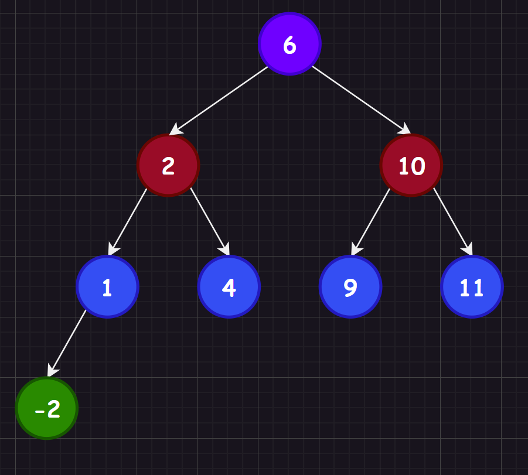

本章主要是二叉树的进阶部分，学习搜索二叉树可以更好理解后面的`map`和`set`的特性。

# 1.二叉搜索树概念

二叉搜索树的递归定义为：非空左子树所有元素都小于根节点的值，非空右子树所有元素都大于根节点的值，而左右子树也是二叉搜索树。



# 2.二叉搜索树实现

```c++
#include <iostream>
#include <string>
using namespace std;

template<typename K>//这里更加习惯写K，也就是关键值key的类型
struct BinarySearchTreeNode
{
	BinarySearchTreeNode<K>* _left;
	BinarySearchTreeNode<K>* _right;
	K _key; 
	BinarySearchTreeNode(K key = K()) : _key(key), _left(nullptr), _right(nullptr) {}
};

template<typename K>
class BinarySearchTree
{
	typedef BinarySearchTreeNode<K> Node;
public:
	//BinarySearchTree() : _root(nullptr) {}
	BinarySearchTree() = default;//强制编译器生成默认的构造函数
	BinarySearchTree(const BinarySearchTree<K>& b)
	{
		_root = copy(b._root);
	}
	BinarySearchTree<K>& operator=(BinarySearchTree<K> b)//b拷贝了一份
	{
		swap(_root, b._root);
		return *this;
	}
	~BinarySearchTree()
	{
		destroy(_root);
	}
	//1.插入
	bool insert(const K& key)
	{
		/*对于第一个插入的节点就是根节点。
		至于数据冗余，我在这里定义不允许数
		据冗余，也就是不允许出现重复的数据
		节点。这样的搜索二叉树会受到数据先
		后顺序插入的影响（您也可定义允许）*/
		
		//1.查看是否根节点
		if (_root == nullptr)
		{
			_root = new Node(key);
			return true;
		}
		//2.寻找存放的位置
		Node* parent = nullptr;//存放root的父节点
		Node* root = _root;//遍历，从根节点开始
		while (root)//直到空为止
		{
			parent = root;
			if (root->_key < key) 
			{
				root = root->_right;
			}
			else if(root->_key > key)
			{
				root = root->_left;
			}
			else//root->_key == key
			{
				return false;
			}
		}
		//3.插入节点及数据
		root = new Node(key);
		if (parent->_key < key)//注意不可以直接赋值给root，不仅内存泄露还连接不上节点
		{
			parent->_right = root;
		}
		else
		{
			parent->_left = root;
		}
		return true;
	}
	bool insertR(const K& key)
	{
		return _insertR(_root, key);
	}
	//2.删除
	bool erase(const K& key)
	{
		/*寻找被删除的节点，删除后，如果是单子节点还好，如果是多
		子节点就需要找到一个托孤后依旧满足二叉搜索树性质的节点，因此删除有两种情况：
		A.被删除节点是叶子节点 或者 被删除节点的左或右孩子为空，直接将孩子节点替换被删除节点即可
		B.被删除节点拥有两个子节点，取右子树中最小的节点替代被删除的节点（当然也可以取左子树的最大节点）
			b1.最小节点没有右孩子，最小节点直接替代被删除节点，并且将最小节点的空孩子节点交给父节点领养
			b2.最小节点存在右孩子，最小节点直接替代被删除节点，并且将最小节点的右孩子节点交给父节点领养
		最后还需要注意删除根节点，根节点没有父节点的问题*/
		Node* parent = nullptr;
		Node* cur = _root;
		//1.寻找节点
		while (cur)
		{
			if (cur->_key < key)
			{
				parent = cur;//不可以和下一个if语句共用，会出现cur和parenat的情况，例如：test_1()中删除10的时候
				cur = cur->_right;
			}
			else if (cur->_key > key)
			{
				parent = cur;
				cur = cur->_left;
			}
			else
			{
				//2.删除节点（找到了）
				if (cur->_left == nullptr)//2.1.左为空
				{
					if (parent == nullptr)//避免cur是根节点，没有父节点，例如：test_1()中删除11的时候
					{
						_root = cur->_right;
						delete cur;
						return true;
					}
					if (parent->_left == cur)
					{
						parent->_left = cur->_right;
					}
					else//parent->_right == cur
					{
						parent->_right = cur->_right;
					}
					delete cur;
				}
				else if (cur->_right == nullptr)//2.2.右为空
				{
					if (parent == nullptr)
					{
						_root = cur->_left;
						delete cur;
						return true;
					}
					if (parent->_left == cur)
					{
						parent->_left = cur->_left;
					}
					else//parent->_right == cur
					{
						parent->_right = cur->_left;
					}
					delete cur;
				}
				else//2.3.左右均不为空，取左子树中最大的或者取右子树中最小的节点替代被删除的节点
				{
					Node* pminRight = cur;//注意不能为nullptr，因为有可能出现不进循环的情况
					Node* minRight = cur->_right;//我们选择找右数最小节点
					while (minRight->_left != nullptr)//找到最左节点，但是需要注意这个最左节点如果有右树，那就需要最左节点的父节点接管
					{
						pminRight = minRight;
						minRight = minRight->_left;
					}
					cur->_key = minRight->_key;//替换相当于删除
					if (pminRight->_left == minRight)//最左节点的父节点托管最左节点的右树，注意可能有两种情况
					{
						pminRight->_left = minRight->_right;
					}
					else if (pminRight->_right == minRight)//最左节点的父节点托管最左节点的右树，注意可能有两种情况
					{
						pminRight->_right = minRight->_right;
					}
					delete minRight;
				}
				return true;
			}
		}
		return false;
	}
	bool eraseR(const K& key)
	{
		return _eraseR(_root, key);
	}
	//3.查找
	bool find(const K& key)
	{
		Node* root = _root;
		while (root)
		{
			if (root->_key < key)
			{
				root = root->_right;
			}
			else if (root->_key > key)
			{
				root = root->_left;
			}
			else
			{
				return true;
			}
		}
		return false;
	}
	bool findR(const K& key)
	{
		return _findR(_root, key);
	}
	//4.打印
	void inOrder()
	{
		_inOrder(_root);
		cout << endl;
	}

private:
	//1.销毁（提供给析构）
	void destroy(Node*& root)
	{
		if (root == nullptr)
			return;
		destroy(root->_left);
		destroy(root->_right);
		delete root;
		root = nullptr;
	}
	//2.拷贝（提供给拷贝构造）
	Node* copy(Node* root)
	{
		if (root == nullptr)
		{
			return nullptr;
		}
		Node* newroot = new Node(root->_key);
		newroot->_left = copy(root->_left);
		newroot->_right = copy(root->_right);
		return newroot;
	}
	//3.插入（提供给递归插入）
	bool _insertR(Node*& root, const K& key)//注意root是引用
	{
		if (root == nullptr)
		{
			root = new Node(key);//这里由于传递的是引用，那么root就是上一级递归的root->_left或者root->_right
			return true;
		}

		if (root->_key < key)
		{
			return _insertR(root->_right, key);
		}
		else if (root->_key > key)
		{
			return _insertR(root->_left, key);
		}
		else
		{
			return false;
		}
	}
	//4.删除（提供给递归插入）
	bool _eraseR(Node*& root, const K& key)
	{
		if (root == nullptr)
			return false;

		if (root->_key < key)
		{
			return _eraseR(root->_right, key);
		}
		else if (root->_key > key)
		{
			return _eraseR(root->_left, key);
		}
		else//root->_key == key
		{
			Node* del = root;//保存要删除的节点
			if (root->_right == nullptr)
			{
				root = root->_left;
			}
			else if (root->_left == nullptr)
			{
				root = root->_right;
			}
			else//左右均不为空
			{
				Node* maxleft = root->_left;
				while (maxleft->_right != nullptr)//找左树的最大节点
				{
					maxleft = maxleft->_right;
				}
				swap(root->_key, maxleft->_key);
				return _eraseR(root->_left, key);//由于左树的最大节点必有一个空孩子节点，因此使用递归删除即可，可以看到递归的删除比非递归及其的简单明了（注意不可以直接传递maxleft，这是一个局部变量）
			}
			delete del;
			return true;
		}
	}
	//5.查找（提供给递归查找）
	bool _findR(Node* root, const K& key)
	{
		if (root == nullptr)
			return false;
		if (root->_key == key)
			return true;

		if (root->_key < key)
		{
			return _isRecursionFind(root->_left, key);
		}
		else//root->_key > key
		{
			return _isRecursionFind(root->_right, key);
		}

	}
	//6.打印（提供给递归打印）
	void _inOrder(Node* root)//注意这里不能直接就拿_root当作缺省值了，因为缺省值只能是常量或者全局变量，而_root需要使用this->_root，而this指针是函数形参，不一定传过来了，别谈使用_root了
	{
		if (root == nullptr)
			return;
		_inOrder(root->_left);
		cout << root->_key << " ";
		_inOrder(root->_right);
	}
	//？.成员变量
	Node* _root;
};
```

这里我还为您提供了三个测试样例：

```c++
//普通测试
void test_1()
{
	BinarySearchTree<int> b;
	b.insert(6);
	b.insert(2);
	b.insert(1);
	b.insert(4);
	b.insert(-2);
	b.insert(10);
	b.insert(9);
	b.insert(11);

	b.inOrder();

	b.erase(6);
	b.inOrder();

	b.erase(2);
	b.inOrder();

	b.erase(10);
	b.inOrder();

	b.erase(1);
	b.inOrder();

	b.erase(4);
	b.inOrder();

	b.erase(9);
	b.inOrder();

	b.erase(11);
	b.inOrder();

	b.erase(-2);
	b.inOrder();
}
//头删测试（需要该_root为公有成员才可以测试）
void test_2()
{
	BinarySearchTree<int> b;
	b.insert(6);
	b.insert(2);
	b.insert(1);
	b.insert(4);
	b.insert(-2);
	b.insert(10);
	b.insert(9);
	b.insert(11);

	//b.inOrder();
	//b.erase(b._root->_key);
	//b.inOrder();

	//b.erase(b._root->_key);
	//b.inOrder();

	//b.erase(b._root->_key);
	//b.inOrder();

	//b.erase(b._root->_key);
	//b.inOrder();

	//b.erase(b._root->_key);
	//b.inOrder();

	//b.erase(b._root->_key);
	//b.inOrder();

	//b.erase(b._root->_key);
	//b.inOrder();

	//b.erase(b._root->_key);
	//b.inOrder();
}
//递归测试
void test_3()
{
	BinarySearchTree<int> b;
	b.insertR(6);
	b.insertR(2);
	b.insertR(1);
	b.insertR(4);
	b.insertR(-2);
	b.insertR(10);
	b.insertR(9);
	b.insertR(11);

	BinarySearchTree<int> b1(b);

	b.inOrder();

	b.eraseR(6);
	b.inOrder();

	b.eraseR(2);
	b.inOrder();

	b.eraseR(10);
	b.inOrder();

	b.eraseR(1);
	b.inOrder();

	b.eraseR(4);
	b.inOrder();

	b.eraseR(9);
	b.inOrder();

	b.eraseR(11);
	b.inOrder();

	b.eraseR(-2);
	b.inOrder();

	b1.inOrder();
	b.inOrder();
}
```

# 3.二叉搜索树应用

## 3.1.Key模型

考虑“在不在”的问题，例如：门禁系统、车库系统、 单词检查...查找对象是否在数据库中存在？这些场景在现实中有很多。

## 3.2.Key/Value模型

通过一个值查找另外一个值，例如：中英文互译、电话号码查询快递信息、验证码查询信息...只需要在一个节点中包含一个数据对即可。另外我们之前说过二叉搜索树一般不存储重复的元素，如果相同的元素可以让该元素绑定一个`int`元素形成键值对，这种情况的实际应用有：统计高频词汇。

# 4.二叉搜索树分析

由于缺失平衡性，二叉搜索树在最不理想的状态查找的时间复杂度是`O(n)`。

# 5.二叉搜索树练习

这里还额外补充一些二叉树的相关题目，这些题目在以前`C`学习中没有过多提及，这是因为采用`C`写会比较痛苦，因此我放在这里供您练习。

1.   [力扣606. 根据二叉树创建字符串](https://leetcode.cn/problems/construct-string-from-binary-tree/)
2.   [力扣102. 二叉树的层序遍历](https://leetcode.cn/problems/binary-tree-level-order-traversal/)
3.   [力扣107. 二叉树的层序遍历 II](https://leetcode.cn/problems/binary-tree-level-order-traversal-ii/)
4.   [力扣236. 二叉树的最近公共祖先](https://leetcode.cn/problems/lowest-common-ancestor-of-a-binary-tree/)
5.   [力扣LCR 155. 将二叉搜索树转化为排序的双向链表](https://leetcode.cn/problems/er-cha-sou-suo-shu-yu-shuang-xiang-lian-biao-lcof/)
6.   [力扣105. 从前序与中序遍历序列构造二叉树](https://leetcode.cn/problems/construct-binary-tree-from-preorder-and-inorder-traversal/)
7.   [力扣106. 从中序与后序遍历序列构造二叉树](https://leetcode.cn/problems/construct-binary-tree-from-inorder-and-postorder-traversal/)
8.   [力扣144. 二叉树的前序遍历（非递归实现）](https://leetcode.cn/problems/binary-tree-preorder-traversal/)

 
