# 1.set 简介

`set` 是 `C++` 的容器，底层使用了平衡搜索树的红黑树（`Red-Black Tree`）。使用起来很简单，就是需要注意不能有重复的元素。并且不允许通过迭代器直接修改元素，这会导致搜索树的结构被破坏。

合理使用该容器可以达到排序和去重的目的。

除了普通的 `set` 还有一个 `multiset`，插入的时候允许键值冗余的平衡搜索二叉树，使用这个容器可以只达到排序的目的。其他的功能和 `set` 差不多，但是使用 `count()` 接口的时候会出现些许不同（返回一个键值的出现次数）如果使用 `find()` 会按照中序的顺序查找。

# 2.map 简介

而 `map` 是存储键值对的关联容器，依靠 `pair<Key, T>` 键值对结构对象来构造二叉树（或者使用函数模板 `make_pair()` 的自动推导和构造，而且一般是作为内联），底层也是红黑树。

需要注意 `find()` 函数的返回值是一个迭代器，指向要查找的键值对，如果找到了指定的键，则返回指向该键值对的迭代器。如果未找到指定的键，则返回指向 `map` 末尾元素的迭代器 `end()`。

不过 `map` 有个别具一格的 `[]` 重载（`multimap` 则不支持，因为对应多个 `value`），可以根据 `key` 值，查找对应的 `value` 值。其中 `insert()` 的返回值也很特殊，是一个 `pair<iterator, bool>` 类型。

```cpp
V& operator[]<const K& key>
{
    pair<iterator, bool> ret = insert(make_pair(key, V()));//插入的时候有两种可能：成功或者失败，成功返回一个<当前迭代器,true>，失败返回一个<当前迭代器,false>
    return ret.first->second;//找到迭代器中的值
}
```

这就使得 `[]` 有多种可能性：

1.   通过 `key` 查找对应的 `value`
2.   修改 `key` 对应的 `value` 值
3.   插入从未出现过的 `key` 值，默认 `value=V()`

# 3.AVL 树

## 3.1.定义

我们前面提到过，二叉搜索树虽然可以缩短查找的效率，但是有可能会退化为单枝树，导致效率变成 `O(n)`，因此俄罗斯数学家 `G.M.Adelson-Velskii` 和 `E.M.Landis` 在 `1962` 年发明了一种调整方法：：当向二叉搜索树中插入新结点后，如果能保证每个结点的左右子树高度之差的绝对值不超过 `1`（需要对树中的结点进行调整），即可降低树的高度，从而减少平均搜索长度。

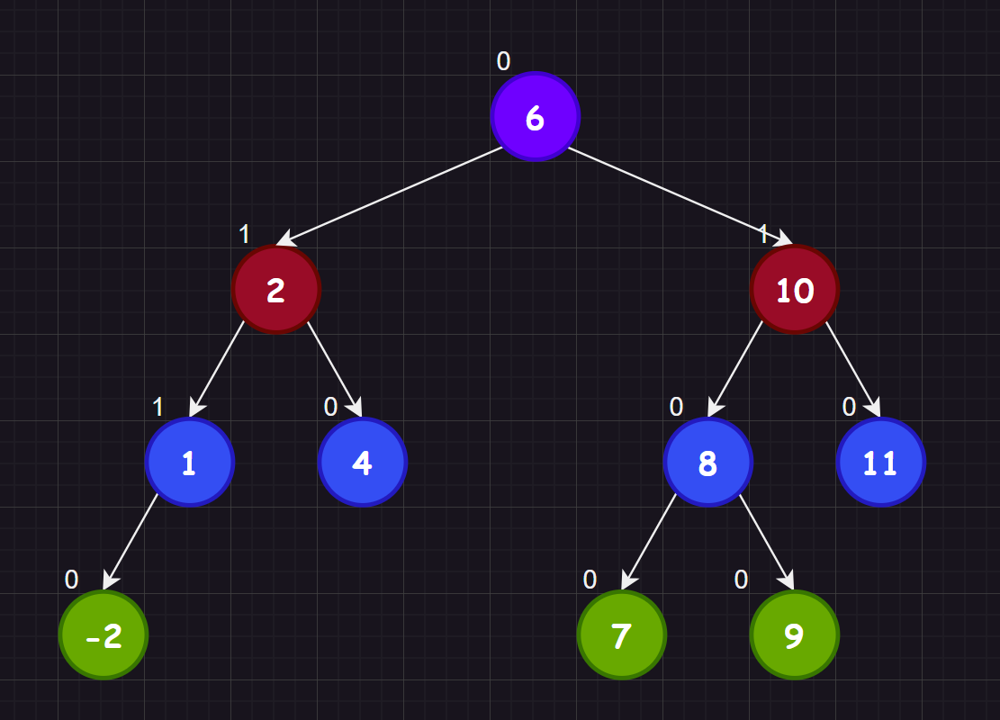

>   补充：这里引入平衡因子是比较好理解的，但是有些 `AVL` 实现是不依赖平衡因子的。

在我们的实现里，结点结构体和 `AVL` 树类的大概框架就是：

```cpp
#include <iostream>
#include <utility>
#include <cassert>
using namespace std;

namespace limou
{
	//1.结点结构体
	template <typename Key, typename Value>
	struct AVLTreeNode
	{
		AVLTreeNode<Key, Value>* _left;
		AVLTreeNode<Key, Value>* _right;
		AVLTreeNode<Key, Value>* _parent;
		pair<Key, Value> _kv;
		int _bf;

		AVLTreeNode(const pair<Key, Value>& kv)
			: _left(nullptr)
			, _right(nullptr)
			, _parentright(nullptr)
			, _kv(kv)
			, _bf(0)
		{}
	};

	//2.AVLTree类
	template <typename Key, typename Value>
	class AVLTree
	{
        typedef AVLTree<Key, Value> Node;
	public:
        //1.插入
        bool Inster(const pair<Key, Value>& kv);
        //2.删除
        
	private:
		Node* _root = nullptr;
	};
}
```

## 3.2.插入

### 3.2.1.插入结点

插入的时候，关于更新平衡因子的大逻辑如下（实际上就是搜索二叉树的插入逻辑，但是最后一部分有关平衡因子的代码是 `AVL` 树新加入的代码）：

```cpp
#include <iostream>
#include <utility>
#include <cassert>
using namespace std;

namespace limou
{
	//1.结点结构体
	template <typename Key, typename Value>
	struct AVLTreeNode
	{
		AVLTreeNode<Key, Value>* _left;
		AVLTreeNode<Key, Value>* _right;
		AVLTreeNode<Key, Value>* _parent;
		pair<Key, Value> _kv;
		int _bf;

		AVLTreeNode(const pair<Key, Value>& kv)
			: _left(nullptr)
			, _right(nullptr)
			, _parentright(nullptr)
			, _kv(kv)
			, _bf(0)
		{}
	};

	//2.AVLTree类
	template <typename Key, typename Value>
	class AVLTree
	{
        typedef AVLTree<Key, Value> Node;
	public:
		bool Inster(const pair<Key, Value>& kv)
		{
			//1.搜索二叉树插入的部分
			if (_root == nullptr)
			{
				_root = new Node(kv);
				return true;
			}

			Node* parent = nullptr;
			Node* cur = _root;
			while (cur)
			{
				if (cur->_kv.first < kv.first)
				{
					parent = cur;
					cur = cur->_right;
				}
				else if (cur->_kv.first > kv.first)
				{
					parent = cur;
					cur = cur->_left;
				}
				else
				{
					return false;
				}
			}

			cur = new Node(kv);

			if (parent->_kv.first > kv.first)
			{
				parent->_left = cur;
			}
			else//parent->_kv.first < kv.first
			{
				parent->_right = cur;
			}

			cur->_parent = parent;

			//2.AVL的部分开始
			
			//插入cur后，更新结点的父节点平衡因子：
			//if(cur == parent->right) 
			//	parent->_bf++
			//else(cur == parent->left)
			//	parent->_bf--
			//然后出现以下情况：
			//if(parent->_bf == 1 || parent->_bf == -1)，
			//{
			//	说明父结点原本的平衡因子必为 parent->_bf == 0，
			//	就说明插入后父节点的左右子树高度差发生了改变，
			//  则要向上持续更新父节点的部分/全部祖先平衡因子
			//	if(cur == parent->right) parent->_bf++
			//	else(cur == parent->left) parent->_bf--
			//	...
			//}
			//else if(parent->_bf == 2 || parent->_bf == -2)
			//{
			//	说明父节点所在的左右子树已经不平衡了，需要旋转
			//}
			//else
			//{
			//	原本是parent->_bf == 1 or parent->_bf == -1，
			//	而新插入的cur把高度低的子树变高了，这说明：
			//	父节点的左右子树变成了绝对平衡（平衡因子==0），无需更新祖先
			//}
			//由于插入结点会影响自己的部分/全部的祖先，因此我们的结构加上_parent指针
			//然后需要注意有可能会更新到根结点去（最差情况）

			while (parent)//最差更新到根节点，根结点的父节点为空，就可以停下
			{
				if (cur == parent->_right)
				{
					parent = _bf++;
				}
				else//cur == parent->_left
				{
					parent = _bf--;
				}

				if (parent->_bf == 1 || parent->_bf = -1)
				{
					//继续更新
					parent = parent->_parent;
					cur = cur->_parent;
				}
				else if (parent->_bf == 0)
				{
					break;
				}
				else if (parent->_bf == 2 || parent->_bf == -2)
				{
					//旋转
				}
				else
				{
					assert(false);//留给我们自己调试使用
				}
			}

			return true;
		}
	private:
		Node* _root = nullptr;
	};
}
```

这里还缺少一个最重要的环节：旋转，接下来我们仔细分析四种旋转的情况。

### 3.2.2.旋转结点

由于我们走到 `if-else` 语句中的 `(parent->_bf == 2 || parent->_bf == -2)` 了，那么我们下面假设所有情况的插入都会引发调整，进而旋转。

并且需要注意出现不平衡的情况，其高度一定是大于 `2` 的。

#### 3.2.2.1.左单旋 [新结点插入较高右子树的右侧]

在一颗满足 `AVL` 树性质的树中，假设根右子树高，将新结点插入到根右子树的右侧。

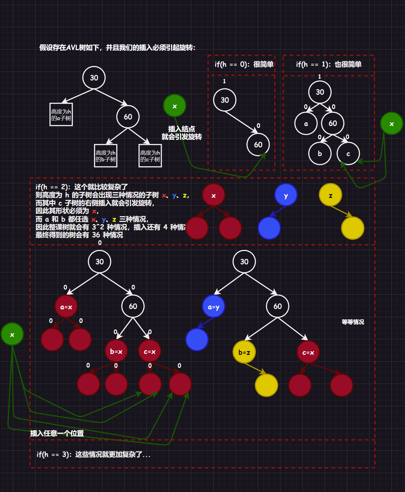

>   补充：为什么 `c` 必须是 `x` 呢？
>
>   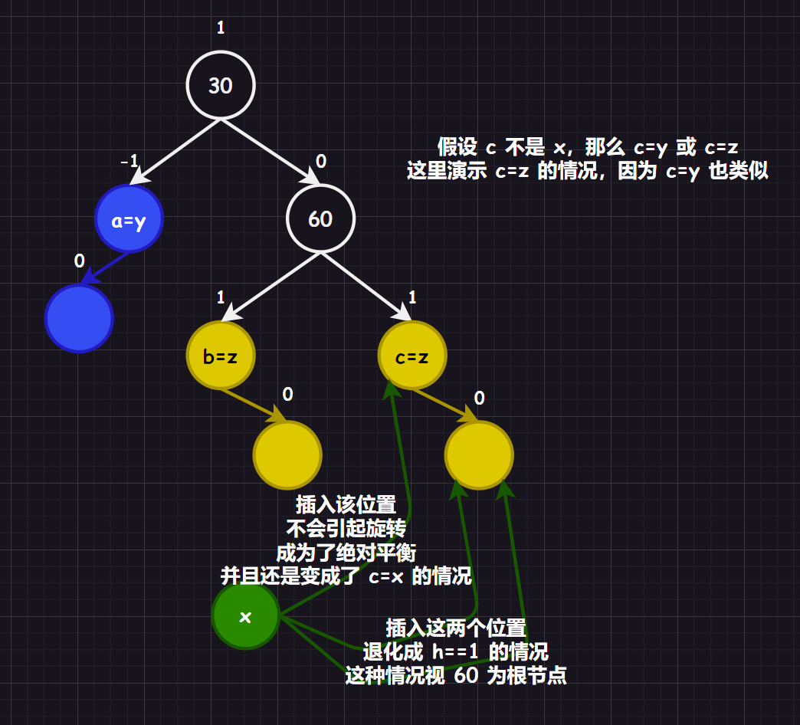

>   注意：有时间一定要尝试一下 `h=4` 的情况，画一画几个具象树图。

这么一看，插入分析实际上是一件很复杂的事情，但是我们可以通过抽象树图，来简化这一过程。

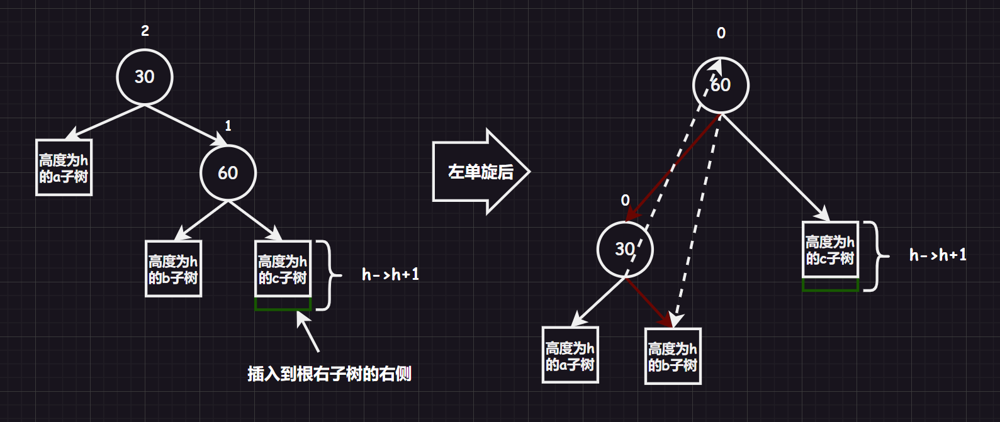

#### 3.2.2.2.右单旋 [新结点插入较高左子树的左侧]

关于右单旋，我们就不画具象树图了（因为和左单旋的情况是镜像的），而是继续采用抽象树图来演示过程：

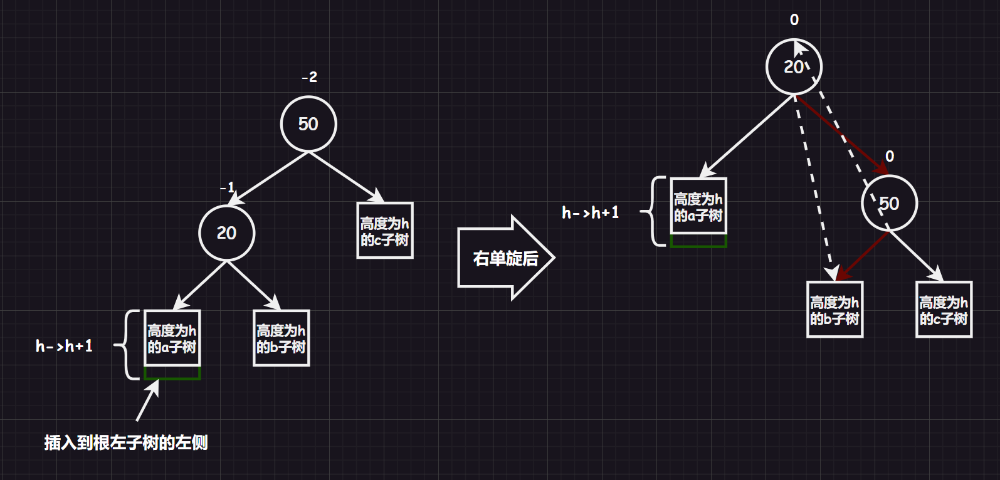

#### 3.2.2.3.先左单旋，再右单旋 [新结点插入较高左子树的右侧]

这里我们也先来分析具象树图，再给出抽象树图旋转的过程。

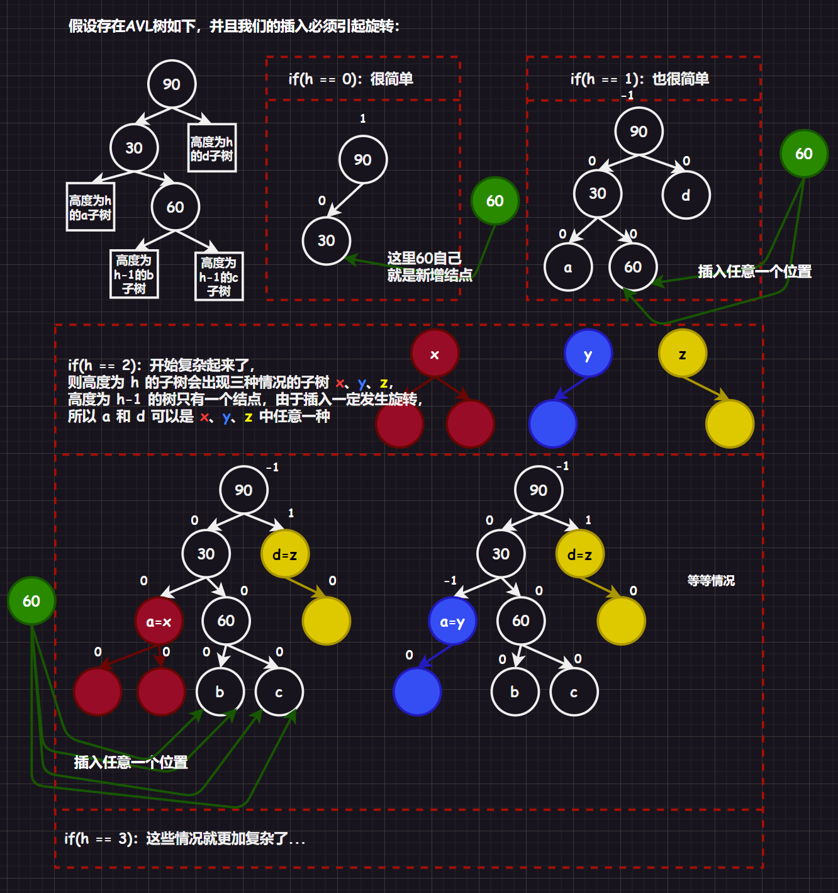

>   补充：有时间可以试试 `h` 取值为其他的情况。

而抽象树图旋转过程就是：

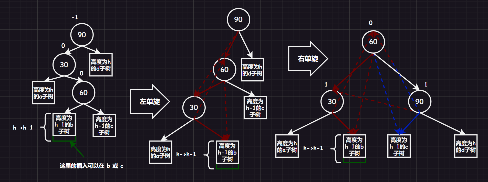

但是在具体代码实现中，最困难的是更新平衡因子的问题（例如：在上图，插入在 `b` 或者 `c` 会产生不同的平衡因子）。

让我们来具体分析一下平衡因子的情况：

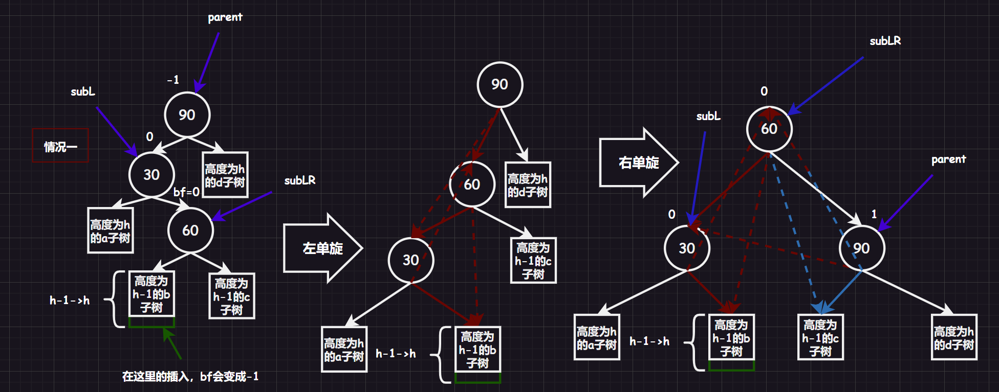

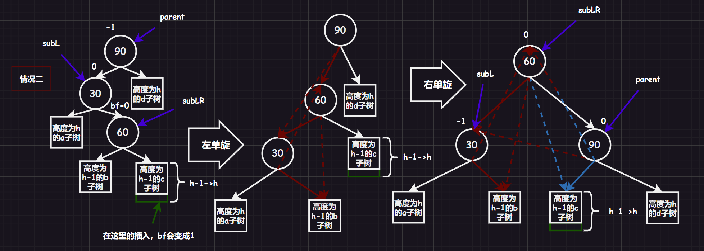

可以看到主要是有两种情况，平衡因子需要特殊设置。

另外最好也要处理一下 `h=0` 的情况，这种情况就是 `b` 和 `c` 子树都不存在，而是插入他们的父节点（在上面例子中就是 `60` 这个结点），也就是说，插入后 `bf=0`。

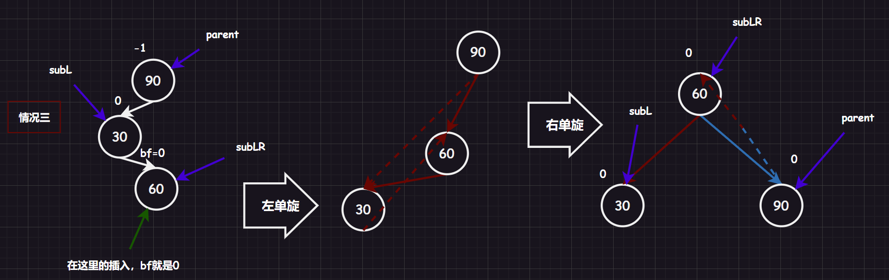

#### 3.2.2.4.先右单旋，再左单旋 [新结点插入较高右子树的左侧]

这个我们也是做抽象树图，不做具体分析（和前一种情况是镜像的）。

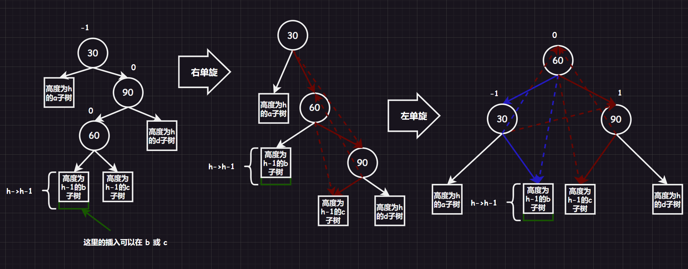

然后也要分两种情况：

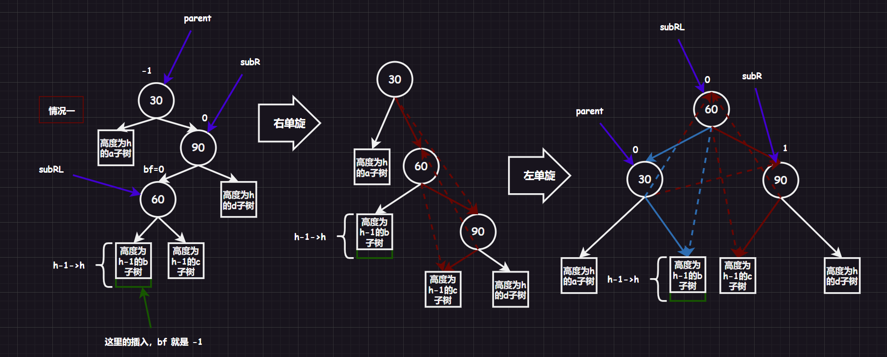

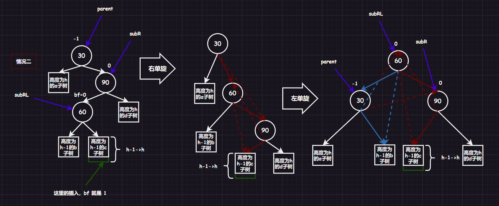

最好也要处理一下 `h=0` 的情况：

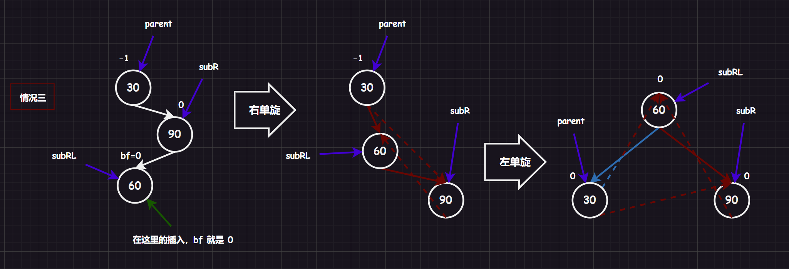

### 3.2.3.具体实现

上面我们的抽象树图没有考虑诸多字段/指针（比如父指针、还有根指针），下面我们将上述抽象树图做进一步细化，并且将旋转过程和具体代码一样对应起来。

#### 3.2.3.1.左单旋指针图解

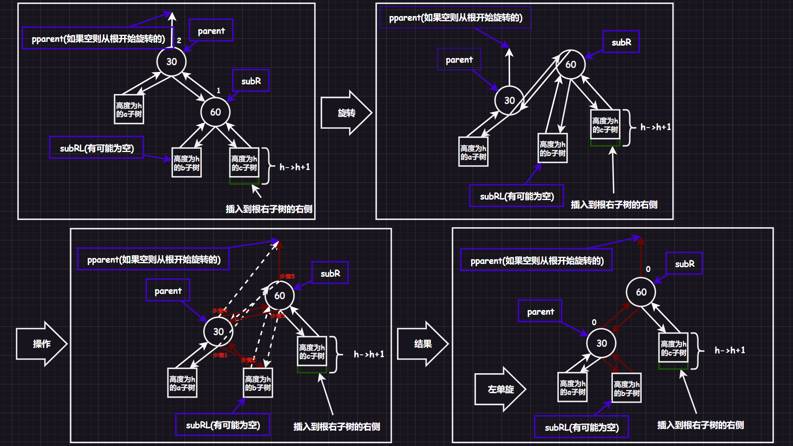

#### 3.2.3.2.右单旋指针图解

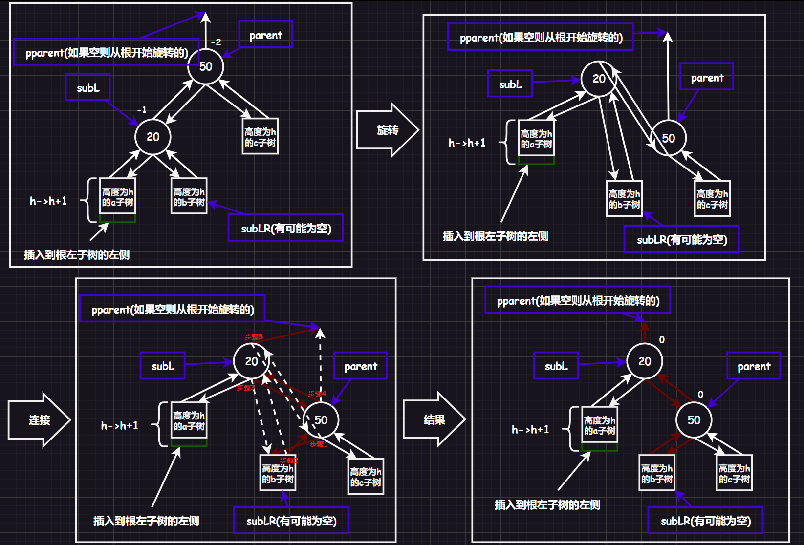

#### 3.2.3.3.先左后右指针图解

实际上就是先左单旋，后右单旋，就无须绘图了，只需根据抽象树图来复用前两个函数即可，就是需要注意调整平衡因子。

#### 3.2.3.4.先右后左指针图解

实际上就是先右单旋，后左单旋，就无须绘图了，只需根据抽象树图来复用前两个函数即可，就是需要注意调整平衡因子。

```cpp
//AVLTree.hpp
//接下来我们来完善一下Insert()的代码，成为完整的插入函数，并且做一次完整的测试
#include <iostream>
#include <utility>
#include <cassert>
using namespace std;

namespace limou
{
	//1.结点结构体
	template <typename Key, typename Value>
	struct AVLTreeNode
	{
		AVLTreeNode<Key, Value>* _left;
		AVLTreeNode<Key, Value>* _right;
		AVLTreeNode<Key, Value>* _parent;
		pair<Key, Value> _kv;
		int _bf;

		AVLTreeNode(const pair<Key, Value>& kv)
			: _left(nullptr)
			, _right(nullptr)
			, _parent(nullptr)
			, _kv(kv)
			, _bf(0)
		{}
	};

	//2.AVLTree类
	template <typename Key, typename Value>
	class AVLTree
	{
		typedef AVLTreeNode<Key, Value> Node;
	public:
		bool Inster(const pair<Key, Value>& kv)
		{
			//1.搜索二叉树插入的部分
			if (_root == nullptr)
			{
				_root = new Node(kv);
				return true;
			}

			Node* parent = nullptr;
			Node* cur = _root;
			while (cur)
			{
				if (cur->_kv.first < kv.first)
				{
					parent = cur;
					cur = cur->_right;
				}
				else if (cur->_kv.first > kv.first)
				{
					parent = cur;
					cur = cur->_left;
				}
				else//不可以等于
				{
					return false;
				}
			}

			cur = new Node(kv);

			if (parent->_kv.first > kv.first)
			{
				parent->_left = cur;
			}
			else//parent->_kv.first < kv.first)
			{
				parent->_right = cur;
			}

			cur->_parent = parent;

			//2.AVL的部分开始
			
			//插入cur后，更新结点的父节点平衡因子：
			//if(cur == parent->right) 
			//	parent->_bf++
			//else(cur == parent->left)
			//	parent->_bf--
			//然后出现以下情况：
			//if(parent->_bf == 1 || parent->_bf == -1)，
			//{
			//	说明父结点原本的平衡因子必为 parent->_bf == 0，
			//	就说明插入后父节点的左右子树高度差发生了改变，
			//  则要向上持续更新父节点的部分/全部祖先平衡因子
			//	if(cur == parent->right) parent->_bf++
			//	else(cur == parent->left) parent->_bf--
			//	...
			//}
			//else if(parent->_bf == 2 || parent->_bf == -2)
			//{
			//	说明父节点所在的左右子树已经不平衡了，需要旋转
			//}
			//else
			//{
			//	原本是parent->_bf == 1 or parent->_bf == -1，
			//	而新插入的cur把高度低的子树变高了，这说明：
			//	父节点的左右子树变成了绝对平衡（平衡因子==0），无需更新祖先
			//}
			//由于插入结点会影响自己的部分/全部的祖先，因此我们的结构加上_parent指针
			//然后需要注意有可能会更新到根结点去（最差情况）

			while (parent)//最差更新到根节点，根结点的父节点为空，就可以停下
			{
				if (cur == parent->_right)
				{
					parent->_bf++;
				}
				else//cur == parent->_left
				{
					parent->_bf--;
				}

				if (parent->_bf == 1 || parent->_bf == -1)
				{
					//继续更新
					parent = parent->_parent;
					cur = cur->_parent;
				}
				else if (parent->_bf == 0)
				{
					break;
				}
				else if (parent->_bf == 2 || parent->_bf == -2)
				{
					//旋转
					if (parent->_bf == 2 && cur->_bf == 1)//左单旋
					{
						RotateL(parent);
					}
					else if (parent->_bf == -2 && cur->_bf == -1)//右单旋
					{
						RotateR(parent);
					}
					else if (parent->_bf == -2 && cur->_bf == 1)//右左双旋
					{
						RotateLAndR(parent);
					}
					else if (parent->_bf == 2 && cur->_bf == -1)//左右双旋
					{
						RotateRAndL(parent);
					}
					else
					{
						assert(false);
					}
					break;
				}
				else
				{
					assert(false);//留给我们自己调试使用
				}
			}

			return true;
		}

		//2.中序遍历
		void InOrder()
		{
			_InOrder(_root);
			std::cout << std::endl;
		}

		//3.检查是否平衡
		bool IsBalance()
		{
			return _IsBalance(_root);
		}


	private:
		//左单旋
		void RotateL(Node* parent)
		{
			Node* subR = parent->_right;
			Node* subRL = subR->_left;
			Node* pparent = parent->_parent;

			//记录了四个指针parent、subR、subRL、pparent

			//步骤1
			parent->_right = subRL;
			//步骤2
			if (subRL)//不为空才连接
				subRL->_parent = parent;
			//步骤3
			subR->_left = parent;
			//步骤4
			parent->_parent = subR;
			//步骤5
			if (pparent == nullptr)//说明是从根结点开始旋转的
			{
				_root = subR;//换子
				_root->_parent = nullptr;//置空
			}
			else//如果不是根
			{
				if (pparent->_left == parent)
				{
					pparent->_left = subR;//换子
				}
				else
				{
					pparent->_right = subR;//换子
				}
				subR->_parent = pparent;//换父
			}

			//更新平衡因子
			parent->_bf = subR->_bf = 0;
		}
		//右单旋
		void RotateR(Node* parent)
		{
			Node* subL = parent->_left;
			Node* subLR = subL->_right;
			Node* pparent = parent->_parent;

			//记录了四个指针parent、subR、subRL、pparent

			//步骤1
			parent->_left = subLR;
			//步骤2
			if (subLR)//不为空才连接
				subLR->_parent = parent;
			//步骤3
			subL->_right = parent;
			//步骤4
			parent->_parent = subL;
			//步骤5
			if (pparent == nullptr)//说明是从根结点开始旋转的
			{
				_root = subL;//换子
				_root->_parent = nullptr;//置空
			}
			else//如果不是根
			{
				if (pparent->_left == parent)
				{
					pparent->_left = subL;//换子
				}
				else
				{
					pparent->_right = subL;//换子
				}
				subL->_parent = pparent;//换父
			}

			//更新平衡因子
			parent->_bf = subL->_bf = 0;
		}
		//双旋：左单旋，右单旋
		void RotateLAndR(Node* parent)
		{
			Node* subL = parent->_left;
			Node* subLR = subL->_right;
			int bf = subLR->_bf;

			//这里的复用代码很简单，但是双旋最困难的问题是更新平衡因子
			RotateL(parent->_left);
			RotateR(parent);

			if (bf == -1)//在较高左子树的右树的右插入
			{
				parent->_bf = 1;
				subLR->_bf = 0;
				subL->_bf = 0;
			}
			else if (bf == 1)//在较高左子树的右树的左插入
			{
				parent->_bf = 0;
				subLR->_bf = 0;
				subL->_bf = -1;
			}
			else if (bf == 0)//建议写上，逻辑更清晰
			{
				parent->_bf = 0;
				subLR->_bf = 0;
				subL->_bf = 0;
			}
			else
			{
				assert(false);//供自己调试使用
			}
		}
		//双旋：右单旋，左单旋
		void RotateRAndL(Node* parent)
		{
			Node* subR = parent->_right;
			Node* subRL = subR->_left;
			int bf = subRL->_bf;

			//这里的复用代码很简单，但是双旋最困难的问题是更新平衡因子
			RotateR(parent->_right);
			RotateL(parent);

			if (bf == -1)//在较高右子树的左树的左插入
			{
				parent->_bf = 0;
				subRL->_bf = 0;
				subR->_bf = 1;
			}
			else if (bf == 1)//在较高右子树的左树的右插入
			{
				parent->_bf = -1;
				subRL->_bf = 0;
				subR->_bf = 0;
			}
			else if (bf == 0)//建议写上，逻辑更清晰
			{
				parent->_bf = 0;
				subRL->_bf = 0;
				subR->_bf = 0;
			}
			else
			{
				assert(false);//供自己调试使用
			}
		}
		//中序子函数
		void _InOrder(Node* root)
		{
			if (root == nullptr)
			{
				return;
			}

			_InOrder(root->_left);
			std::cout << root->_kv.first << "-" << root->_kv.second << " ";
			_InOrder(root->_right);
		}
		//判断平衡的子函数
		int _Height(Node* root)
		{
			if (root == nullptr)
			{
				return 0;
			}
			int leftHeight = _Height(root->_left);
			int rightHeight = _Height(root->_right);
			return  leftHeight > rightHeight ? leftHeight + 1 : rightHeight + 1;
		}
		bool _IsBalance(Node* root)
		{
			if (root == nullptr)
			{
				return true;
			}
			int leftH = _Height(root->_left);
			int rightH = _Height(root->_right);

			if (rightH - leftH != root->_bf)//检查平衡因子
			{
				std::cout << "平衡因子异常:" << root->_kv.first << "-" << root->_kv.second << std::endl;
				return false;
			}

			return abs(leftH - rightH) < 2
				&& _IsBalance(root->_left)
				&& _IsBalance(root->_right);
		}
	private:
		Node* _root = nullptr;
	};
}
```

```cpp
//测试用例
#include "AVLTree.hpp"
#include <vector>
#include <cstdlib>
#include <ctime>
using namespace std;
#define SIZE 1000000

int main()
{
	limou::AVLTree<int, char> a;
	//vector<int> arr = { 16,3,7,11,9,26,18,14,15 };
	//vector<int> arr = { 4,2,6,1,3,5,15,7,16,14 };
	//vector<int> arr = {};
	//vector<int> arr = { 1 };
	//vector<int> arr = { 1, 2, 3 };

	srand((unsigned)time(0));
	vector<int> arr;
	for (int i = 0; i < SIZE; i++)
	{
		arr.push_back(rand() % SIZE);
	}

	for (auto it : arr)
	{
		a.Inster(make_pair(it, 'a' + (it % 26)));
	}
	a.InOrder();

	if (a.IsBalance())
	{
		cout << "OK" << endl;
	}

	return 0;
}
```

而其他的接口，比如：删除，从保持平衡上来看，和普通的二叉搜索树是一样的，就是需要注意平衡因子的问题，但是删除实际上比插入还要复杂，这里挖一个坑以后再来实现。

简单提一下，删除和插入有些地方是相反操作，删除也会导致高度变化，这里推荐看书《数据结构-用面向对象方法与 `C++` 描述》殷人昆版，使用细节的实际代码）。

查找就不提了和普通的二叉搜索树是一样的实现。

## 3.3.性能

`AVL` 树是绝对平衡的二叉搜索树，这可以保证高效率的查找（即：$O(log_{2}(n))$，在 `10` 亿数据的结点下，只需要查找 `26` 次左右）。但是 `AVL` 树也有一些缺点：在数据改动较大的动态场景里，频繁的结构修改（插入或者删除）会导致性能非常低下。

# 4.RB 树

## 4.1.定义

只需要满足下面的性质即可：

1.   在每一个结点内增加一个存储颜色的字段（存储 `Red` 和 `Black`），保证每个结点不是红色就是黑色
2.   根节点、空叶子结点（也叫 `NIL` 结点）必须是黑色的
3.   如果一个节点是红色的，则它的两个孩子结点是黑色的
4.   对于每个结点，从该结点到其所有后代空叶子结点的路径上，均包含相同数目的黑色结点

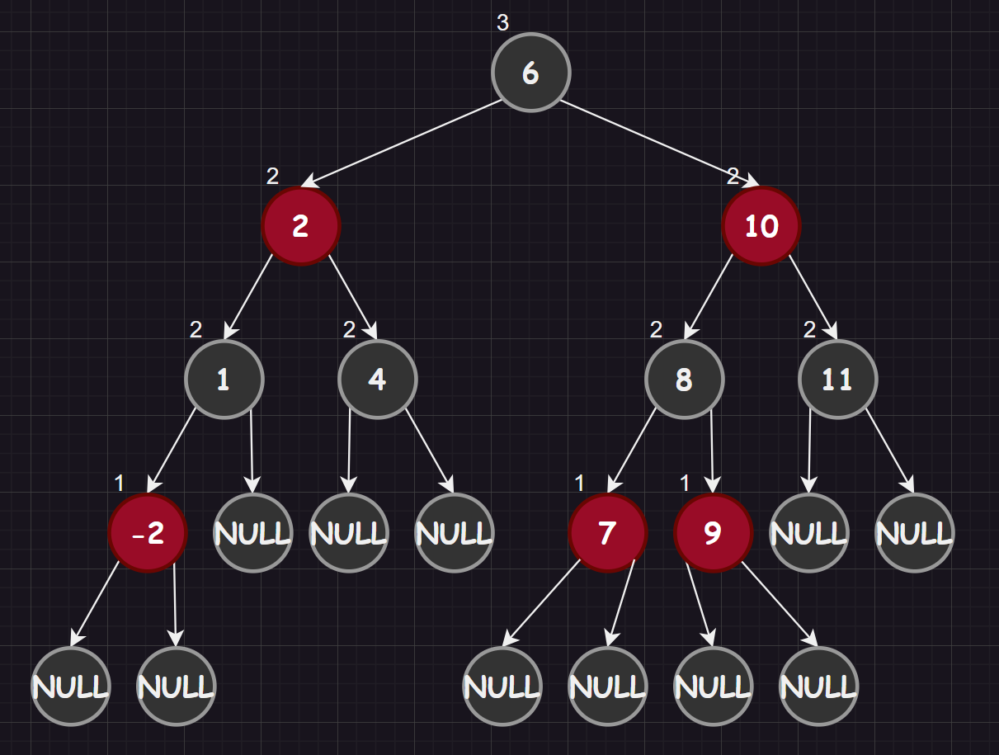

红黑树保证没有一条路径（包括空叶子结点）会比其他路径长两倍，因此是近似平衡，而不是 `AVL` 树的那种绝对平衡。

不过上述保证的原理是什么呢？这是因为：最 `Min` 的路径就是全黑路径，最 `Max` 路径就是红黑间隔路径（当然，实际的红黑树不一定有最短和最长路径）。

这样最长和最短之间为了保证黑结点数量相同，就必须满足红黑间隔路径结点个数是全黑路径结点的两倍。

>   补充：假设红黑树全部有 `N` 个黑色结点，则最 `Min` 路径长度为 $log_{2}(N)$，最 `Max` 路径长度为 $2log_{2}(N)$，整棵树的结点个数为 $[N,2N]$。

`RB` 树比 `AVL` 树的查找略差一些，但是对于 `CPU` 来说差别不大，并且不严格使得 `RB` 树不至于一直处于旋转的状态，消耗较低。

而后续具体实现的大致框架和 `AVL` 树差不多，也是重点讲解插入的过程。

## 4.2.插入

### 4.2.1.插入结点

插入的大逻辑还是二叉搜索树（但是需要设置颜色）。

### 4.2.2.设置颜色

如果是插入第一个结点，也就是根结点，那么就设置为黑色即可，而如果不是根结点，最好还是默认插入红色结点（这一默认行为可以直接在 `RBTreeNode{/*...*/};` 内的构造函数里实现）。

因为如果是黑色，就会必定违反上述第 `4` 条规则。如果是红色，就有可能违反第 `3` 规则。

对比起来违反规则 `3` 是有可能的，但是总比一定违法规则 `4` 要更好。

接下来，如果插入红结点：

1.   若其父节点是黑结点，那么插入是不会影响红黑树的性质的

     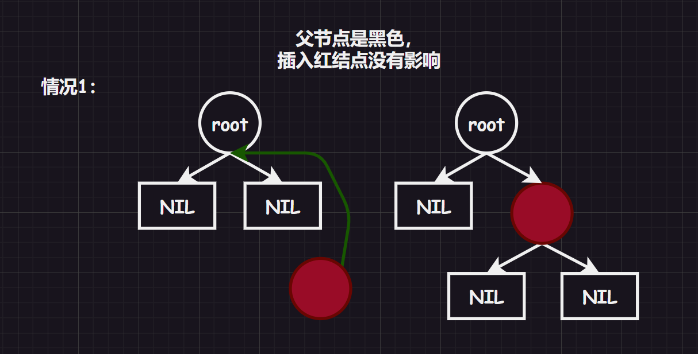

2.   若其父节点是红结点，那么插入就有可能会发生影响，会衍生出两种情况

     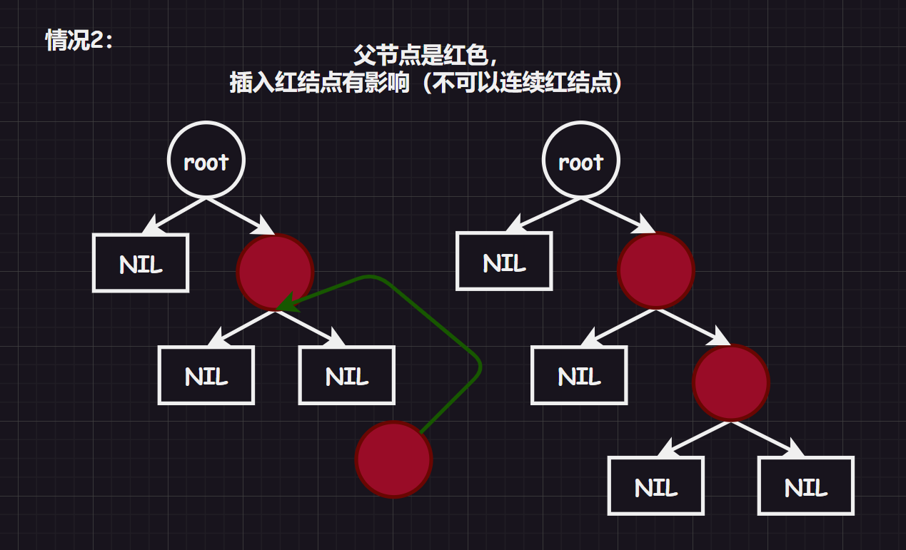

### 4.2.3.调整结点

针对第二种情况，我们来做细致的分析：

1.   `uncle` 存在且为红
2.   `uncle` 不存在或者存在且为黑

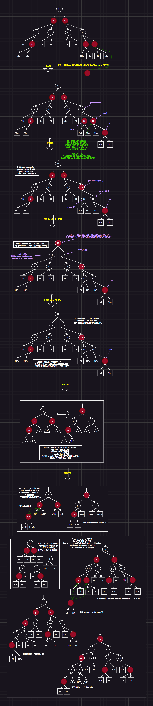

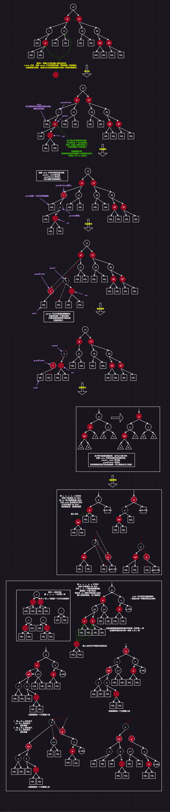

### 4.2.4.具体实现

```cpp
//AVLTree.hpp
#pragma once
#include <iostream>
#include <utility>
#include <cassert>
#include <cstdio>
#include <cstdlib>
#include <ctime>
namespace limou
{
	//1.颜色结构体
	enum Colour
	{
		RED,
		BLACK
	};

	//2.结点结构体
	template <typename K, class V>
	struct RBTreeNode
	{
		RBTreeNode<K, V>* _left;
		RBTreeNode<K, V>* _right;
		RBTreeNode<K, V>* _parent;
		std::pair<K, V> _kv;
		Colour _col;

		RBTreeNode(const std::pair<K, V>& kv)
			: _left(nullptr)
			, _right(nullptr)
			, _parent(nullptr)
			, _kv(kv)
			, _col(RED)
		{}
	};

	//3.RBTree类结构
	template <typename K, class V>
	class RBTree
	{
		typedef RBTreeNode<K, V> Node;

	public://3.1.成员函数
		~RBTree()
		{
			Destroy(_root);
			_root = nullptr;
		}
		bool Insert(const std::pair<K, V>& kv)
		{
			//1.搜索二叉树插入的部分
			if (_root == nullptr)
			{
				_root = new Node(kv);
				_root->_col = BLACK;
				return true;
			}

			Node* parent = nullptr;
			Node* cur = _root;
			while (cur)
			{
				if (cur->_kv.first < kv.first)
				{
					parent = cur;
					cur = cur->_right;
				}
				else if (cur->_kv.first > kv.first)
				{
					parent = cur;
					cur = cur->_left;
				}
				else//不可以等于
				{
					return false;
				}
			}

			cur = new Node(kv);//默认新增加的是红色结点（这么设置会好一些，这个默认设置行为在RBTreeNode的构造函数里）

			if (parent->_kv.first > kv.first)
			{
				parent->_left = cur;
			}
			else//parent->_kv.first < kv.first
			{
				parent->_right = cur;
			}

			cur->_parent = parent;

			//2.RBTree的部分开始
			while (parent && parent->_col == RED)//只要父节点为空（避免是根节点）或者父节点是黑（黑就随便插入，不影响RB定义）
			{
				Node* grandFather = parent->_parent;//parent是红的，就一定存在grandFather（只有parent为根节点才不会有grandFather）

				//根据 uncle 的位置来做类似的处理
				if (grandFather->_left == parent)
				{
					Node* uncle = grandFather->_right;

					//情况一：uncle 存在并且颜色为红
					if (uncle && uncle->_col == RED)
					{
						parent->_col = BLACK;//设置颜色
						uncle->_col = BLACK;
						grandFather->_col = RED;

						cur = grandFather;//继续往上调整
						parent = cur->_parent;
					}
					else//情况二：uncle 不存在或者颜色为黑
					{
						if (cur == parent->_left)
						{

							//     g
							//   p   u
							// c
							RotateR(grandFather);
							parent->_col = BLACK;
							grandFather->_col = RED;
						}
						else
						{
							//     g
							//   p   u
							//     c
							RotateL(parent);
							RotateR(grandFather);
							cur->_col = BLACK;
							//parent->_col = RED;//这句话可以不写
							grandFather->_col = RED;
						}
						break;
					}
				}
				else//grandFather->_right == parent
				{
					Node* uncle = grandFather->_left;

					//情况一：uncle 存在并且颜色为红
					if (uncle && uncle->_col == RED)
					{
						parent->_col = BLACK;//设置颜色
						uncle->_col = BLACK;
						grandFather->_col = RED;

						cur = grandFather;//继续往上调整
						parent = cur->_parent;
					}
					else//情况二：uncle 不存在或者颜色为黑
					{
						if (cur == parent->_right)
						{

							//     g
							//   u   p
							//         c
							RotateL(grandFather);
							parent->_col = BLACK;
							grandFather->_col = RED;
						}
						else
						{
							//     g
							//   u   p
							//     c
							RotateR(parent);
							RotateL(grandFather);
							cur->_col = BLACK;
							//parent->_col = RED;//这句话可以不写
							grandFather->_col = RED;
						}
						break;
					}
				}
			}

			_root->_col = BLACK;
			return true;
		}
		Node* Find(const K& key)
		{
			Node* cur = _root;
			while (cur)
			{
				if (cur->_kv.first < key)
				{
					cur = cur->_right;
				}
				else if (cur->_kv.first > key)
				{
					cur = cur->_left;
				}
				else
				{
					return cur;
				}
			}
			return nullptr;
		}

	private://3.2.辅助函数
		//左单旋
		void RotateL(Node* parent)
		{
			Node* subR = parent->_right;
			Node* subRL = subR->_left;
			Node* pparent = parent->_parent;

			//记录了四个指针parent、subR、subRL、pparent

			//步骤1
			parent->_right = subRL;
			//步骤2
			if (subRL)//不为空才连接
				subRL->_parent = parent;
			//步骤3
			subR->_left = parent;
			//步骤4
			parent->_parent = subR;
			//步骤5
			if (pparent == nullptr)//说明是从根结点开始旋转的
			{
				_root = subR;//换子
				_root->_parent = nullptr;//置空
			}
			else//如果不是根
			{
				if (pparent->_left == parent)
				{
					pparent->_left = subR;//换子
				}
				else
				{
					pparent->_right = subR;//换子
				}
				subR->_parent = pparent;//换父
			}

			//无需更新平衡因子（RBTree没有这个东西）
			//parent->_bf = subR->_bf = 0;
		}
		//右单旋
		void RotateR(Node* parent)
		{
			Node* subL = parent->_left;
			Node* subLR = subL->_right;
			Node* pparent = parent->_parent;

			//记录了四个指针parent、subR、subRL、pparent

			//步骤1
			parent->_left = subLR;
			//步骤2
			if (subLR)//不为空才连接
				subLR->_parent = parent;
			//步骤3
			subL->_right = parent;
			//步骤4
			parent->_parent = subL;
			//步骤5
			if (pparent == nullptr)//说明是从根结点开始旋转的
			{
				_root = subL;//换子
				_root->_parent = nullptr;//置空
			}
			else//如果不是根
			{
				if (pparent->_left == parent)
				{
					pparent->_left = subL;//换子
				}
				else
				{
					pparent->_right = subL;//换子
				}
				subL->_parent = pparent;//换父
			}

			//无需更新平衡因子（RBTree没有这个东西）
			//parent->_bf = subL->_bf = 0;
		}
		//销毁
		void Destroy(Node* root)
		{
			if (root == nullptr)
			{
				return;
			}
			Destroy(root->_left);
			Destroy(root->_right);
			delete root;
		}

	private://3.3.测试函数
		//检查性质（辅助测试）
		void _InOrder(Node* root)
		{
			if (root == nullptr)
			{
				return;
			}

			_InOrder(root->_left);
			std::cout << root->_kv.first << " ";
			_InOrder(root->_right);
		}
		//检查颜色（辅助测试）
		bool _Check(Node* root, int blackNum, int benchmark)
		{
			if (root == nullptr)
			{
				//走到空的时候就检查黑色结点的数量和是否相等（没有记录黑结点）
				if (benchmark != blackNum)
				{
					std::cout << "某条路径黑色节点的数量不相等,违反：4.对于每个结点，从该结点到其所有后代空叶子结点的路径上，均包含相同数目的黑色结点" << std::endl;
					return false;
				}

				return true;
			}

			if (root->_col == BLACK)
			{
				++blackNum;
			}

			if (root->_col == RED
				&& root->_parent
				&& root->_parent->_col == RED)//这里倒过来检查，如果检查父节点的子，有可能出现空的情况
			{
				std::cout << "存在连续的红色节点，违反：3.如果一个节点是红色的，则它的两个孩子结点是黑色的" << std::endl;
				return false;
			}

			return _Check(root->_left, blackNum, benchmark)
				&& _Check(root->_right, blackNum, benchmark);
		}
		//检查高度（辅助测试）
		int _Height(Node* root)
		{
			if (root == NULL)
				return 0;

			int leftH = _Height(root->_left);
			int rightH = _Height(root->_right);

			return leftH > rightH ? leftH + 1 : rightH + 1;
		}
	public:
		void InOrder()
		{
			_InOrder(_root);
			std::cout << std::endl;
		}
		bool IsBalance()
		{
			//根据红黑树的定义来检查
			//1.在每一个结点内增加一个存储颜色的字段（存储 Red 和 Black），保证每个结点不是红色就是黑色（这点可以不证明）

			//2.根节点、空叶子结点（也叫 NIL 结点）必须是黑色的
			if (_root && _root->_col == RED)
			{
				std::cout << "违反：2.根节点、空叶子结点（也叫 NIL 结点）必须是黑色的" << std::endl;
				return false;
			}

			//3.如果一个节点是红色的，则它的两个孩子结点是黑色的
			//4.对于每个结点，从该结点到其所有后代空叶子结点的路径上，均包含相同数目的黑色结点
			int benchmark = 0;//一个基准值
			Node* cur = _root;
			while (cur)//先走一条路，得出黑色结点的数量，然后检查每一条路径就可以了（没有记录黑空结点）
			{
				if (cur->_col == BLACK)
					++benchmark;
				cur = cur->_left;
			}
			return _Check(_root, 0, benchmark);//检查是否有连续红色节点
		}
		int Height()
		{
			return _Height(_root);
		}

	private://3.4.成员变量
		Node* _root = nullptr;
	};

	//4.测试函数（证明符合RB二叉搜索树）
	//4.1.证明一（有限证明）
	void Test_1_RBTree()
	{
		int arr[] = { 4, 2, 6, 1, 3, 5, 15, 7, 16, 14 };
		RBTree<int, int> r;
		for (auto e : arr)
		{
			r.Insert(std::make_pair(e, e));
		}
		r.InOrder();
		r.IsBalance();
		std::cout << "高度：" << r.Height() << std::endl;
	}
	//4.2.证明二（随机证明）
	void Test_2_RBTree()
	{
		//设置要插入的数量
		int size = 100000;

		//设置随机数
		srand(time(0));

		//开始插入验证
		RBTree<int, int> r;
		while (size--)
		{
			int x = rand();
			r.Insert(std::make_pair(x, x));
		}
		r.InOrder();
		r.IsBalance();
		std::cout << "高度：" << r.Height() << std::endl;
	}
}
```

## 4.3.性能

# 5.set 和 map 的实现

下面我们就利用我们已有的结果简单封装出一个 `set` 和 `map`，在很多库中的实现模板如下：

## 5.1.红黑树模板

以下是红黑树类模板的部分代码，这里忽略了很多代码：

```cpp
//RBTree.hpp
template <class Value>
struct __rb_tree_node : public __rb_tree_node_base
{
	typedef __rb_tree_node<Value>* link_type;
	Value value_field;
};

template <class Key, class Value, class KeyOfValue, class Compare, class Alloc = alloc>
class rb_tree
{
	typedef __rb_tree_node<Value> rb_tree_node;
	typedef rb_tree_node* link_type;
	size_type node_count;
	link_type header;
};
```

## 5.2.封装 set 和 map

此时就可以使用红黑树类模板来封装出 `set` 和 `map`，使用 `set<K, K>` 和 `map<K, V>`。其中，第一个模板参数用来记忆 `K` 的类型，不然没办法正确构造出 `find()` 和 `erase()` 接口，第二个模板参数就决定树节点存储的类型。

## 5.3.自定义封装

接下来我们根据之前实现的红黑树代码，来封装出 `set` 和 `map` 容器。

```cpp
//RBTree.hpp
#pragma once

/* ---在很多库中的实现---
template <class Value>
struct __rb_tree_node : public __rb_tree_node_base
{
	typedef __rb_tree_node<Value>* link_type;
	Value value_field;
};

template <class Key, class Value, class KeyOfValue, class Compare, class Alloc = alloc>
class rb_tree
{
	typedef __rb_tree_node<Value> rb_tree_node;
	typedef rb_tree_node* link_type;
	size_type node_count;
	link_type header;
};
*/

#include <iostream>
#include <string>
#include <vector>
#include <utility>
#include <cassert>
#include <cstdio>
#include <cstdlib>
#include <ctime>

namespace limou
{
	//1.颜色结构体
	enum Colour
	{
		RED,
		BLACK
	};

	//2.结点结构体
	template <class T>
	struct RBTreeNode
	{
		RBTreeNode<T>* _left;
		RBTreeNode<T>* _right;
		RBTreeNode<T>* _parent;
		T _data;
		Colour _col;

		RBTreeNode(const T& data)
			: _left(nullptr)
			, _right(nullptr)
			, _parent(nullptr)
			, _data(data)
			, _col(RED)
		{}
	};

	//3.迭代器类结构（用结点去构造一个迭代器然后返回）
	template<class T, class Ref, class Ptr>
	struct __RBTreeIterator
	{
		typedef RBTreeNode<T> Node;
		typedef __RBTreeIterator<T, Ref, Ptr> Self;

		Node* _node;

		__RBTreeIterator(Node* node) : _node(node) {}
		__RBTreeIterator(const __RBTreeIterator<T, T&, T*>& it) : _node(it._node) {}

		Ref operator*()
		{
			return _node->_data;
		}

		Ptr operator->()
		{
			return &_node->_data;
		}

		bool operator!=(const Self& s)
		{
			return _node != s._node;
		}

		Self& operator++()
		{
			if (_node->_right != nullptr)
			{
				//右不空，就找右子树的最左结点
				Node* subLeft = _node->_right;
				while (subLeft->_left)
				{
					subLeft = subLeft->_left;
				}
				_node = subLeft;
			}
			else
			{
				//右为空，说明要重新走一次中序遍历（前面左子树和根一点遍历过了），
				//沿着根结点路径，选择祖先（从祖先路径中选择将自己视为左子树的第一个祖先结点），
				//如果没有可以选择的祖先，直接设置为空，代表遍历结束
				//由于我们有三叉链，实现起来比较简单（如果没有设计这种结构，也可以使用栈结构辅助）
				Node* cur = _node;
				Node* parent = cur->_parent;
				while (parent && cur == parent->_right)
				{
					cur = parent;
					parent = parent->_parent;
				}
				_node = parent;
			}
			return *this;
		}

		Self& operator--()
		{
			//走右根左，和 ++ 相反即可
			if (_node->_left != nullptr)
			{
				//左不空，就找左子树的最右结点
				Node* subRight = _node->_left;
				while (subRight->_right)
				{
					subRight = subRight->_right;
				}
				_node = subRight;
			}
			else
			{
				Node* cur = _node;
				Node* parent = cur->_parent;
				while (parent && cur == parent->_left)
				{
					cur = parent;
					parent = parent->_parent;
				}
				_node = parent;
			}
			return *this;
		}
	};

	//4.RBTree类结构
	template <typename K, class T, class KeyOfT>
	class RBTree
	{
	public://迭代器
		typedef RBTreeNode<T> Node;
		typedef __RBTreeIterator<T, T&, T*> iterator;
		typedef __RBTreeIterator<T, const T&, const T*> const_iterator;
		iterator begin()
		{
			Node* cur = _root;
			while (cur && cur->_left)
			{
				cur = cur->_left;
			}
			return iterator(cur);
		}
		iterator end()
		{
			return iterator(nullptr);
		}
		const_iterator begin() const
		{
			Node* cur = _root;
			while (cur && cur->_left)
			{
				cur = cur->_left;
			}
			return const_iterator(cur);
		}
		const_iterator end() const
		{
			return const_iterator(nullptr);
		}

	public://成员函数
		~RBTree()
		{
			Destroy(_root);
			_root = nullptr;
		}

		/*
		下面的 data 已经是泛型了，有可能是 Key，也有可能是 Key-Value
		后者虽然可以直接比较大小，但是不是我们想要的，
		其底层比较的是先比较 key 再比较 value。
		而我们只期望比较 key 的值，为了解决这个问题，
		我们采用仿函数来对这种泛型进行比较
		*/
		std::pair<iterator, bool> Insert(const T& data)
		{
			//1.搜索二叉树插入的部分
			if (_root == nullptr)
			{
				_root = new Node(data);
				_root->_col = BLACK;
				return std::make_pair(iterator(_root), true);
			}

			KeyOfT kot;
			Node* parent = nullptr;
			Node* cur = _root;
			while (cur)
			{
				if (kot(cur->_data) < kot(data))
				{
					parent = cur;
					cur = cur->_right;
				}
				else if (kot(cur->_data) > kot(data))
				{
					parent = cur;
					cur = cur->_left;
				}
				else//不可以等于
				{
					return std::make_pair(iterator(cur), false);
				}
			}

			cur = new Node(data);//默认新增加的是红色结点（这么设置会好一些，这个默认设置行为在RBTreeNode的构造函数里）
			Node* copy = cur;

			if (kot(parent->_data) > kot(data))
			{
				parent->_left = cur;
			}
			else//parent->_kv.first < kv.first
			{
				parent->_right = cur;
			}

			cur->_parent = parent;

			//2.RBTree的部分开始
			while (parent && parent->_col == RED)//只要父节点为空（避免是根节点）或者父节点是黑（黑就随便插入，不影响 RB 定义）
			{
				Node* grandFather = parent->_parent;//parent 是红的，就一定存在 grandFather（只有 parent 为根节点才不会有 grandFather）

				//根据 uncle 的位置来做类似的处理
				if (grandFather->_left == parent)
				{
					Node* uncle = grandFather->_right;

					//情况一：uncle 存在并且颜色为红
					if (uncle && uncle->_col == RED)
					{
						parent->_col = BLACK;//设置颜色
						uncle->_col = BLACK;
						grandFather->_col = RED;

						cur = grandFather;//继续往上调整
						parent = cur->_parent;
					}
					else//情况二：uncle 不存在或者颜色为黑
					{
						if (cur == parent->_left)
						{

							//     g
							//   p   u
							// c
							RotateR(grandFather);
							parent->_col = BLACK;
							grandFather->_col = RED;
						}
						else
						{
							//     g
							//   p   u
							//     c
							RotateL(parent);
							RotateR(grandFather);
							cur->_col = BLACK;
							//parent->_col = RED;//这句话可以不写
							grandFather->_col = RED;
						}
						break;
					}
				}
				else//grandFather->_right == parent
				{
					Node* uncle = grandFather->_left;

					//情况一：uncle 存在并且颜色为红
					if (uncle && uncle->_col == RED)
					{
						parent->_col = BLACK;//设置颜色
						uncle->_col = BLACK;
						grandFather->_col = RED;

						cur = grandFather;//继续往上调整
						parent = cur->_parent;
					}
					else//情况二：uncle 不存在或者颜色为黑
					{
						if (cur == parent->_right)
						{

							//     g
							//   u   p
							//         c
							RotateL(grandFather);
							parent->_col = BLACK;
							grandFather->_col = RED;
						}
						else
						{
							//     g
							//   u   p
							//     c
							RotateR(parent);
							RotateL(grandFather);
							cur->_col = BLACK;
							//parent->_col = RED;//这句话可以不写
							grandFather->_col = RED;
						}
						break;
					}
				}
			}

			_root->_col = BLACK;
			return std::make_pair(copy, true);
		}
		Node* Find(const K& key)
		{
			Node* cur = _root;
			KeyOfT kot;
			while (cur)
			{
				if (kot(cur->_data) < key)
				{
					cur = cur->_right;
				}
				else if (kot(cur->_data) > key)
				{
					cur = cur->_left;
				}
				else
				{
					return cur;
				}
			}
			return nullptr;
		}

	private://辅助函数
		//左单旋
		void RotateL(Node* parent)
		{
			Node* subR = parent->_right;
			Node* subRL = subR->_left;
			Node* pparent = parent->_parent;

			//记录了四个指针parent、subR、subRL、pparent

			//步骤1
			parent->_right = subRL;
			//步骤2
			if (subRL)//不为空才连接
				subRL->_parent = parent;
			//步骤3
			subR->_left = parent;
			//步骤4
			parent->_parent = subR;
			//步骤5
			if (pparent == nullptr)//说明是从根结点开始旋转的
			{
				_root = subR;//换子
				_root->_parent = nullptr;//置空
			}
			else//如果不是根
			{
				if (pparent->_left == parent)
				{
					pparent->_left = subR;//换子
				}
				else
				{
					pparent->_right = subR;//换子
				}
				subR->_parent = pparent;//换父
			}

			//无需更新平衡因子（RBTree没有这个东西）
			//parent->_bf = subR->_bf = 0;
		}
		//右单旋
		void RotateR(Node* parent)
		{
			Node* subL = parent->_left;
			Node* subLR = subL->_right;
			Node* pparent = parent->_parent;

			//记录了四个指针parent、subR、subRL、pparent

			//步骤1
			parent->_left = subLR;
			//步骤2
			if (subLR)//不为空才连接
				subLR->_parent = parent;
			//步骤3
			subL->_right = parent;
			//步骤4
			parent->_parent = subL;
			//步骤5
			if (pparent == nullptr)//说明是从根结点开始旋转的
			{
				_root = subL;//换子
				_root->_parent = nullptr;//置空
			}
			else//如果不是根
			{
				if (pparent->_left == parent)
				{
					pparent->_left = subL;//换子
				}
				else
				{
					pparent->_right = subL;//换子
				}
				subL->_parent = pparent;//换父
			}

			//无需更新平衡因子（RBTree没有这个东西）
			//parent->_bf = subL->_bf = 0;
		}
		//销毁
		void Destroy(Node* root)
		{
			if (root == nullptr)
			{
				return;
			}
			Destroy(root->_left);
			Destroy(root->_right);
			delete root;
		}

	private://成员变量
		Node* _root = nullptr;
	};
}
```

```cpp
//Set.hpp
#pragma once
#include "RBTree.hpp"
namespace limou
{
	template<class K>
	class Set
	{
	private://内部类（泛函数）
		struct SetKeyOfT
		{
			const K& operator()(const K& key)
			{
				return key;//可以取出 key，这是为了和 map 同步
			}
		};

	public://迭代器
		//这里的 iterator 实际上也是常量迭代器，由于 set 容器为了满足二叉搜索性质，
		//不能改动 key，而我们设计的迭代器器会返回可以修改的迭代器，一旦允许改动，
		//就会出现 bug，因此干脆返回一个常量迭代器，伪装成普通迭代器
		typedef typename RBTree<K, K, SetKeyOfT>::const_iterator iterator;
		//注意获取别的类的内嵌类型需要用到 typename（不然无法区分是静态成员还是类型）
		typedef typename RBTree<K, K, SetKeyOfT>::const_iterator const_iterator;
		
		iterator begin()
		{
			//一旦上述普通迭代器成为常量迭代器的伪装，
			//这里调用的还是普通迭代器 begin()，
			//无法转为常量迭代器来作为函数返回值返回，
			//因此就需要将普通迭代器转化为常量迭代器
			//转化方法就是在 __RBTreeIterator 中，
			//多写一个用于转化的构造函数
			return _t.begin();
		}
		iterator end()
		{
			return _t.end();
		}

	public://成员函数
		std::pair<iterator, bool> Insert(const K& key)
		{
			return _t.Insert(key);
		}

	private://成员变量
		RBTree<K, K, SetKeyOfT> _t;
	};

	//测试函数
	void test_set()
	{
		Set<int> s;
		s.Insert(3);
		s.Insert(1);
		s.Insert(2);
		s.Insert(10);
		s.Insert(4);
		s.Insert(100);
		s.Insert(5);

		for (auto e : s)
		{
			std::cout << e << " ";
		}
		std::cout << std::endl;
	}
}
```

```cpp
//Map.hpp
#pragma once
#include "RBTree.hpp"
namespace limou
{
	template<class K, class V>
	class Map
	{
	private://内部类（泛函数）
		struct MapKeyOfT
		{
			const K& operator()(const std::pair<const K, V>& kv)
			{
				return kv.first;//可以取出 key 的部分
			}
		};

	public://迭代器
		typedef typename RBTree<K, std::pair<const K, V>, MapKeyOfT>::iterator iterator;//获取别的类的内嵌类型需要用到typename（不然无法区分是静态成员还是类型）
		iterator begin()
		{
			return _t.begin();
		}
		iterator end()
		{
			return _t.end();
		}

	public://成员函数
		std::pair<iterator, bool> Insert(const std::pair<const K, V>& kv)
		{
			return _t.Insert(kv);
		}
		V& operator[](const K& key)
		{
			std::pair<iterator, bool> ret = _t.Insert(std::make_pair(key, V()));
			return ret.first->second;
		}

	private://成员变量
		RBTree<K, std::pair<const K, V>, MapKeyOfT> _t;
	};

	//测试函数
	void test_map()
	{
		Map<int, int> m1;
		m1.Insert(std::make_pair(1, 1));
		m1.Insert(std::make_pair(3, 1));
		m1.Insert(std::make_pair(4, 1));
		m1.Insert(std::make_pair(2, 1));
		m1.Insert(std::make_pair(10, 1));
		m1.Insert(std::make_pair(50, 1));
		m1.Insert(std::make_pair(0, 1));

		for (auto e : m1)
		{
			std::cout <<  "<" << e.first << "," << e.second << ">" << " ";
		}
		std::cout << std::endl;

		Map<std::string, int> m2;
		std::vector<std::string> arr = { "红色", "白色", "绿色", "红色", "黑色", "黑色", "红色", "红色" };
		for (auto e : arr)
		{
			m2[e]++;
		}

		for (auto e : m2)
		{
			std::cout << "<" << e.first << "," << e.second << ">" << std::endl;
		}
	}
}
```

