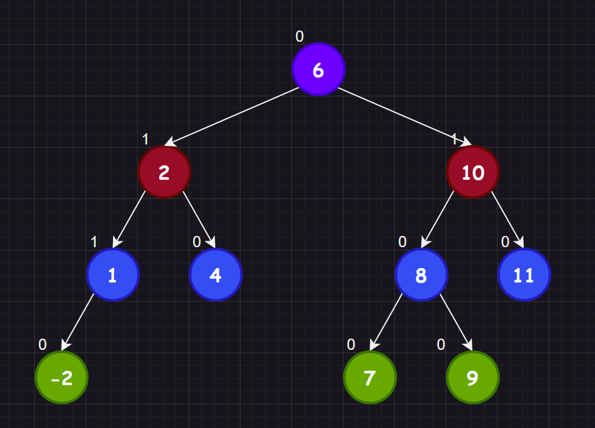
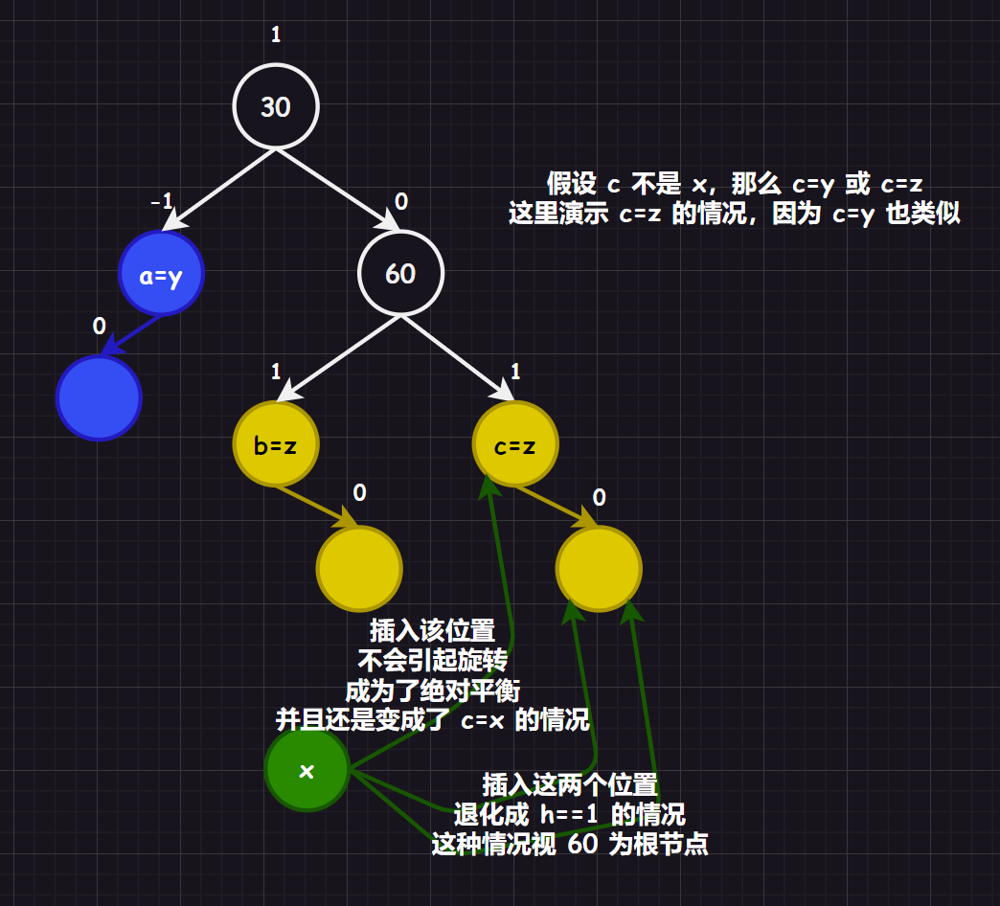
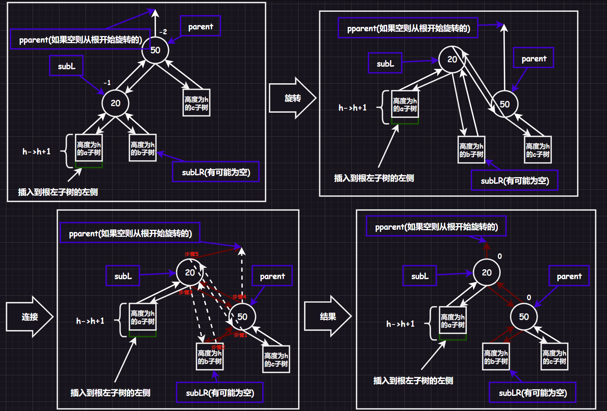

# 1.set

`set`是`C++`的容器，底层使用了平衡搜索树的红黑树（`Red-Black Tree`）。使用起来很简单，就是需要注意不能有重复的元素。并且不允许通过迭代器直接修改元素，这会导致搜索树的结构被破坏。

合理使用该容器可以达到排序和去重的目的。

除了普通的`set`还有一个`multiset`，插入的时候允许键值冗余的平衡搜索二叉树，使用这个容器可以只达到排序的目的。其他的功能和`set`差不多，但是使用`count()`接口的时候会出现些许不同（返回一个键值的出现次数）如果使用`find()`会按照中序的顺序查找。

# 2.map

而`map`是存储键值对的关联容器，依靠`pair<Key, T>`键值对结构对象来构造二叉树（或者使用函数模板`make_pair()`的自动推导和构造，而且一般是作为内联），底层也是红黑树。

需要注意`find()`函数的返回值是一个迭代器，指向要查找的键值对，如果找到了指定的键，则返回指向该键值对的迭代器。如果未找到指定的键，则返回指向`map`末尾元素的迭代器`end()`。

不过`map`有个别具一格的`[]`重载（`multimap`则不支持，因为对应多个`value`），可以根据`key`值，查找对应的`value`值。其中`insert()`的返回值也很特殊，是一个`pair<iterator, bool>`类型。

```cpp
V& operator[]<const K& key>
{
    pair<iterator, bool> ret = insert(make_pair(key, V()));//插入的时候有两种可能：成功或者失败，成功返回一个<当前迭代器,true>，失败返回一个<当前迭代器,false>
    return ret.first->second;//找到迭代器中的值
}
```

这就使得`[]`有多种可能性：

1.   通过`key`查找对应的`value`
2.   修改`key`对应的`value`值
3.   插入从未出现过的`key`值，默认`value=V()`

# 3.AVL树

## 3.1.平衡

我们前面提到过，二叉搜索树虽然可以缩短查找的效率，但是有可能会退化为单枝树，导致效率变成`O(n)`，因此俄罗斯数学家`G.M.Adelson-Velskii`和`E.M.Landis`在`1962`年发明了一种调整方法：：当向二叉搜索树中插入新结点后，如果能保证每个结点的左右子树高度之差的绝对值不超过`1`（需要对树中的结点进行调整），即可降低树的高度，从而减少平均搜索长度。



>   补充：这里引入平衡因子是比较好理解的，但是有些`AVL`实现是不依赖平衡因子的。

在我们的实现里，结点结构体和`AVL`树类的大概框架就是：

```cpp
#include <iostream>
#include <utility>
#include <cassert>
using namespace std;

namespace limou
{
	//1.结点结构体
	template <typename Key, typename Value>
	struct AVLTreeNode
	{
		AVLTreeNode<Key, Value>* _left;
		AVLTreeNode<Key, Value>* _right;
		AVLTreeNode<Key, Value>* _parent;
		pair<Key, Value> _kv;
		int _bf;

		AVLTreeNode(const pair<Key, Value>& kv)
			: _left(nullptr)
			, _right(nullptr)
			, _parentright(nullptr)
			, _kv(kv)
			, _bf(0)
		{}
	};

	//2.AVLTree类
	template <typename Key, typename Value>
	class AVLTree
	{
        typedef AVLTree<Key, Value> Node;
	public:
        //1.插入
        bool Inster(const pair<Key, Value>& kv);
        //2.删除
        
	private:
		Node* _root = nullptr;
	};
}
```

## 3.2.插入

### 3.2.1.插入结点

插入的时候，关于更新平衡因子的大逻辑如下（实际上就是搜索二叉树的插入逻辑，但是最后一部分有关平衡因子的代码是`AVL`树新加入的代码）：

```cpp
#include <iostream>
#include <utility>
#include <cassert>
using namespace std;

namespace limou
{
	//1.结点结构体
	template <typename Key, typename Value>
	struct AVLTreeNode
	{
		AVLTreeNode<Key, Value>* _left;
		AVLTreeNode<Key, Value>* _right;
		AVLTreeNode<Key, Value>* _parent;
		pair<Key, Value> _kv;
		int _bf;

		AVLTreeNode(const pair<Key, Value>& kv)
			: _left(nullptr)
			, _right(nullptr)
			, _parentright(nullptr)
			, _kv(kv)
			, _bf(0)
		{}
	};

	//2.AVLTree类
	template <typename Key, typename Value>
	class AVLTree
	{
        typedef AVLTree<Key, Value> Node;
	public:
		bool Inster(const pair<Key, Value>& kv)
		{
			//1.搜索二叉树插入的部分
			if (_root == nullptr)
			{
				_root = new Node(kv);
				return true;
			}

			Node* parent = nullptr;
			Node* cur = _root;
			while (cur)
			{
				if (cur->_kv.first < kv.first)
				{
					parent = cur;
					cur = cur->_right;
				}
				else if (cur->_kv.first > kv.first)
				{
					parent = cur;
					cur = cur->_left;
				}
				else
				{
					return false;
				}
			}

			cur = new Node(kv);

			if (parent->_kv.first > kv.first)
			{
				parent->_left = cur;
			}
			else//parent->_kv.first < kv.first)
			{
				parent->_right = cur;
			}

			cur->_parent = parent;

			//2.AVL的部分开始
			
			//插入cur后，更新结点的父节点平衡因子：
			//if(cur == parent->right) 
			//	parent->_bf++
			//else(cur == parent->left)
			//	parent->_bf--
			//然后出现以下情况：
			//if(parent->_bf == 1 || parent->_bf == -1)，
			//{
			//	说明父结点原本的平衡因子必为 parent->_bf == 0，
			//	就说明插入后父节点的左右子树高度差发生了改变，
			//  则要向上持续更新父节点的部分/全部祖先平衡因子
			//	if(cur == parent->right) parent->_bf++
			//	else(cur == parent->left) parent->_bf--
			//	...
			//}
			//else if(parent->_bf == 2 || parent->_bf == -2)
			//{
			//	说明父节点所在的左右子树已经不平衡了，需要旋转
			//}
			//else
			//{
			//	原本是parent->_bf == 1 or parent->_bf == -1，
			//	而新插入的cur把高度低的子树变高了，这说明：
			//	父节点的左右子树变成了绝对平衡（平衡因子==0），无需更新祖先
			//}
			//由于插入结点会影响自己的部分/全部的祖先，因此我们的结构加上_parent指针
			//然后需要注意有可能会更新到根结点去（最差情况）

			while (parent)//最差更新到根节点，根结点的父节点为空，就可以停下
			{
				if (cur == parent->_right)
				{
					parent = _bf++;
				}
				else//cur == parent->_left
				{
					parent = _bf--;
				}

				if (parent->_bf == 1 || parent->_bf = -1)
				{
					//继续更新
					parent = parent->_parent;
					cur = cur->_parent;
				}
				else if (parent->_bf == 0)
				{
					break;
				}
				else if (parent->_bf == 2 || parent->_bf == -2)
				{
					//旋转
				}
				else
				{
					assert(false);//留给我们自己调试使用
				}
			}

			return true;
		}
	private:
		Node* _root = nullptr;
	};
}
```

这里还缺少一个最重要的环节：旋转，接下来我们仔细分析四种旋转的情况。

### 3.2.2.旋转结点

由于我们走到`if-else`语句中的`(parent->_bf == 2 || parent->_bf == -2)`了，那么我们下面假设所有情况的插入都会引发调整，进而旋转。

并且需要注意出现不平衡的情况，其高度一定是大于`2`的。

#### 3.2.2.1.左单旋[新结点插入较高右子树的右侧]

在一颗满足`AVL`树性质的树中，假设根右子树高，将新结点插入到根右子树的右侧。


>   补充：为什么`c`必须是`x`呢？
>
>   

>   注意：有时间一定要尝试一下`h=4`的情况，画一画几个具象树图。

这么一看，插入分析实际上是一件很复杂的事情，但是我们可以通过抽象树图，来简化这一过程。


#### 3.2.2.2.右单旋[新结点插入较高左子树的左侧]

关于右单旋，我们就不画具象树图了（因为和左单旋的情况是镜像的），而是继续采用抽象树图来演示过程：


#### 3.2.2.3.先右单旋，再左单旋[新结点插入较高右子树的左侧]

#### 3.2.2.4.先左单旋，再右单旋[新结点插入较高左子树的右侧]


### 3.2.3.具体实现

#### 3.2.3.1.左单旋


#### 3.2.3.2.右单旋



#### 3.2.3.3.先右后左

#### 3.2.3.4.先左后右

```cpp
//接下来我们来完善一下Insert()的代码，成为完整的插入函数

```

## 3.3.删除

# 4.红黑树

只需要满足下面的性质即可：

1.   每个结点不是红色就是黑色
2.   根节点是黑色的
3.   如果一个节点是红色的，则它的两个孩子结点是黑色的
4.   对于每个结点，从该结点到其所有后代叶结点的简单路径上，均包含相同数目的黑色结点
5.   每个空叶子结点都是黑色的（此处的叶子结点指的是空结点）


