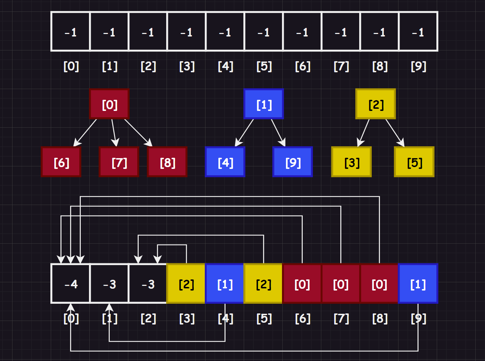
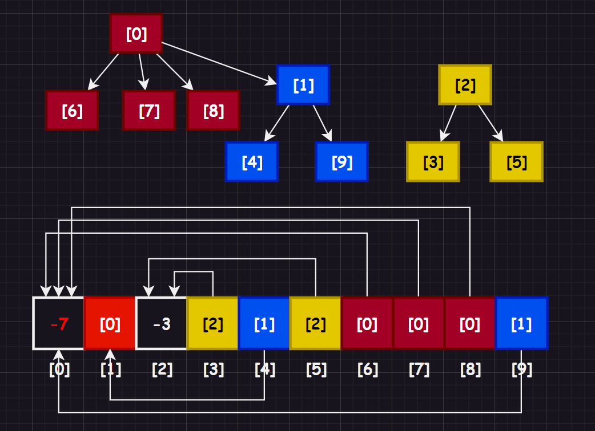

# 1.并查集概念

## 1.1.并查集定义

在一些应用问题中，需要：

1.   将 `n` 个不同的元素划分成一些不相交的集合
2.   开始时，每个元素自成成为一个集合
3.   然后按一定的规律，将归于同一组元素的集合合并
4.   期间需要反复用到查询某个元素归属于那个集合的算法

适合于描述这类问题的抽象数据类型称为并查集（`union-find set`）。

并查集这类问题在实际中有很多体现，例如：一开学的时候，大家都不认识（每个元素自成一个集合），相互熟悉了一段时间，就会产生一些小群体（归并小集合到大集合）。

## 1.2.并查集术语

1.  **元素**（`element`）：指并查集中的一个结点，可以是任何类型的数据结构
2.  **集合**（`set`）：由若干个元素组成的子集，所有元素构成并查集的所有集合
3.  **父结点**（`parent`）：指一个元素在并查集中的父结点，如果它没有父结点，则为根结点
4.  **根结点**（`root`）：一个集合中唯一的没有父结点的元素
5.  **合并**（`union`）：将两个集合合并成一个集合的操作，即将一个集合的根结点连接到另一个集合的根结点上
6.  **查找**（`find`）：查找一个元素所在的集合的操作，即找到该元素的根结点
7.  **路径压缩**（`path compression`）：在查找时，将路径上的每个结点的父结点更新为集合的根结点，其他父结点转为普通结点作为根结点的子结点以加快后续查找的速度
8.  **按秩合并**（`union by rank`）：在合并时，通过记录每个集合根节点的秩（即树高），将较矮的树连接到较高的树上，以减小整体树高，提高查找效率

# 2.并查集接口

在后续的代码中，我将会围绕下面这些接口进行展开，这里先给出给您看看。

```cpp
#pragma once
#include <vector>

namespace limou
{
	template <typename Type = int>
	class UnionFindSet
	{
		/*
		* 这里的并查集只使用了索引来作为集合内的元素的编号
		* 对应存储的是“根结点包含元素的个数”和“双亲结点索引”的信息
		*/

	public:
		UnionFindSet(int n)
			: _ufs(n, -1)
		{}

		bool Union(int x1, int x2)
		{
			/* 根据编号合并两个集合：合并之前要先找根，因此可以复用 voidFindRoot() */
		}

		int FindRoot(int x)
		{
			/* 根据编号找编号对应元素的根：通过编号存储的父结点，不断跳转到根即可 */
		}

		bool InSet(int x, int y)
		{
			/* 两编号对应元素是否在同一个集合 */
		}

		size_t Count()
		{
			/* 计算并查集内集合的个数 */
		}

	private:
		std::vector<Type> _ufs;
	};
}
```

# 3.并查集细节

## 3.1.映射问题

在探讨并查集问题之前，首先我们需要解决一个问题，我们知道可以使用 `key` 来寻找 `value`，那怎么通过 `value` 找 `key` 呢？我们可以利用 `vector` 和 `map` 结合使用。

```cpp
#include <vector>
#include <map>
#include <iostream>

namespace limou
{
	template <typename Type>
	class UnionFindSet
	{
	public:
		UnionFindSet(const Type* arr, size_t n)
		{
			for (size_t i = 0; i < n; i++)
			{
				_arr.push_back(arr[i]);
				_indexMap[arr[i]] = i;
			}
		}
	private:
		std::vector<Type> _arr;			//key 找 value
		std::map<Type, int> _indexMap;	//value 找 key
	};
}

int main()
{
	std::string arr[3] = { "limou", "dimou", "iimou" };
	limou::UnionFindSet<std::string> ufs(arr, 3);
	return 0;
}
```

这样就可以通过 `vector` 来根据 `key` 值查找 `value`，通过 `map` 来根据 `value` 查找 `key` 的双向查找，当然，这么做只是可选的，实际上使用一个`vector`也可以，就是需要遍历导致性能下降一些（但是为了简化您的代码负担，我下面代码实现中，先使用只有`vector`的并查集（也就说，我们存储的元素只有 `int` 数据类型的编号），以后我有时间再来补充拓展...）。

## 3.2.集合表示

回到并查集，我们应该如何一个小集合呢？使用一颗树来表示，并且采用双亲表示法和索引来构建一个并查集。



其中，有一些特征您需要注意一下：

1.   数组的下标对应集合中元素的编号
2.   数组中如果为负数，负号代表根，数字代表该集合中元素个数
3.   数组中如果为非负数，代表该元素双亲在数组中的下标

## 3.3.集合合并

那么怎么模拟集合之间的合并呢？看看图示即可快速明白：



也就是将一个集合的根结点作为另外一个集合的成员合并进去，并且更新索引对应的值即可（一般建议将数据量小的集合合并到数据量大的集合，避免数据量大的集合层数过多，找出寻根次数概率提高）。

## 3.4.压缩路径

如果数据量比较大，就会产生寻根时间长的问题，因此就会有一种思路认为：反正所有的元素都在一个集合内，那干脆超过一定层数，或者干脆直接重构一个集合（重构一颗树），让元素在一个层内，这样寻根就会方便很多（这一过程发生在查找和合并的时候，只要发现一个结点的路径过长，在找到该结点的根结点后将其父节点更改为根节点）。

# 4.并查集实现

## 4.1.具体实现

接下来实现一个简答的并查集：

```cpp
#pragma once
#include <iostream>
#include <vector>
#include <cmath>
using std::cout;
using std::swap;
using std::vector;

namespace limou
{
	template <typename Type = int>
	class UnionFindSet
	{
		/*
		* 这里的并查集只使用了索引来作为集合内的元素的编号
		* 对应存储的是“根结点包含元素的个数”和“双亲结点索引”的信息
		*/

	public:
		UnionFindSet(int n)
			: _ufs(n, -1)
		{}

		bool Union(int x1, int x2)
		{
			/* 根据编号合并两个集合：合并之前要先找根，因此可以复用 voidFindRoot() */
			int root1 = FindRoot(x1);
			int root2 = FindRoot(x2);

			if (root1 != root2)
			{
				if (abs(_ufs[root1]) < abs(_ufs[root2]))//谁合并谁都可以，但是最好还是小数据量的集合合并到大数据量的集合，让大数据集合的层数不知增大
					swap(root1, root2);

				_ufs[root1] += _ufs[root2];
				_ufs[root2] = root1;
				return true;
			}

			return false;
		}

		int FindRoot(int x)
		{
			/* 根据编号找编号对应元素的根：通过编号存储的父结点，不断跳转到根即可 */
			int root = x;
			while (_ufs[root] >= 0)
			{
				root = _ufs[root];
			}

			//路径压缩，更改父结点从结果上来看没有区别
			while (_ufs[x] >= 0)
			{
				int parent = _ufs[x];
				_ufs[x] = root;

				x = parent;
			}

			return root;
		}

		bool InSet(int x, int y)
		{
			/* 两编号对应元素是否在同一个集合 */
			return FindRoot(x) == FindRoot(y);
		}

		size_t Count()
		{
			/* 计算并查集内集合的个数 */
			size_t count = 0;
			for (auto it : _ufs)
			{
				if (it < 0)
					++count;
			}

			return count;
		}

	private:
		vector<Type> _ufs;
	};

	void TestUnionFindSet()
	{

		//{0}, {1}, {2}, {3}
		UnionFindSet<> ufs(4);
		cout << ufs.Count() << '\n';
		if (ufs.InSet(1, 2))
			cout << "OK" << '\n';

		//{0, 1, 2}, {3}
		ufs.Union(0, 1);
		ufs.Union(1, 2);
		cout << ufs.Count() << '\n';
		if (ufs.InSet(1, 2))
			cout << "OK" << '\n';

		//{0, 1, 2} root->0
		//{3} root->3
		cout << ufs.FindRoot(2) << '\n';
		cout << ufs.FindRoot(3) << '\n';
	}
}
```

## 4.2.测试用例

```cpp
#include "union_find_set.hpp"

int main()
{
	limou::TestUnionFindSet();
	return 0;
}
```

# 5.并查集分析

## 5.1.并查集优势

1.  高效的合并与查询操作：并查集通过使用树结构来表示集合，并采用路径压缩和按秩合并等优化技术，使得合并和查询操作的时间复杂度接近于常数级别，具有高效性能
2.  简单易用：并查集操作简单直观，易于实现和使用。只需要实现合并（`Union`）和查询（`Find`）两个基本操作即可，且这些操作的语义清晰明确
3.  动态增加集合的支持：并查集可以在运行过程中动态地增加或删除集合。当新元素加入时，可以直接创建一个独立的集合；当两个集合合并时，可以通过合并两个根节点来实现
4.  适用于连通性问题：并查集广泛应用于处理连通性问题，例如判断图中的两个节点是否连通、求解最小生成树、判断图中是否存在环等
5.  节省存储空间：并查集采用树结构表示集合，相比使用数组或矩阵表示集合，可以节省存储空间。而且通过路径压缩等优化技术，可以进一步减小树的深度，减少存储空间的占用

## 5.2.并查集劣势

1.  不支持高效地获取集合中的所有元素：并查集主要用于处理连通性问题，它更注重的是判断两个元素是否属于同一个集合，而不是提供高效的遍历集合中的所有元素的能力。如果需要频繁地遍历集合中的元素，在并查集中可能会有一些局限性
2.  不支持删除元素：并查集在元素加入后，无法直接删除元素。虽然可以通过一些额外的操作来实现删除元素的功能，但这可能会引入一定的复杂性和开销

# 6.并查集实践

## 6.1.[LCR 116. 省份数量](https://leetcode.cn/problems/bLyHh0/)

这道题目使用并查集简直不要太简单。

```cpp
template <typename Type = int>
class UnionFindSet
{
    /*
    * 这里的并查集只使用了索引来作为集合内的元素的编号
    * 对应存储的是“根结点包含元素的个数”和“双亲结点索引”的信息
    */

public:
    UnionFindSet(int n)
        : _ufs(n, -1)
    {}

    bool Union(int x1, int x2)
    {
        /* 根据编号合并两个集合：合并之前要先找根，因此可以复用 voidFindRoot() */
        int root1 = FindRoot(x1);
        int root2 = FindRoot(x2);

        if (root1 != root2)
        {
            _ufs[root1] += _ufs[root2];//谁合并谁都可以，没有特别强制的规定
            _ufs[root2] = root1;
            return true;
        }

        return false;
    }

    int FindRoot(int x)
    {
        /* 根据编号找编号对应元素的根：通过编号存储的父结点，不断跳转到根即可 */
        int parent = x;
        while (_ufs[x] >= 0)
        {
            parent = _ufs[x];
            x = parent;
        }

        return parent;
    }

    bool InSet(int x, int y)
    {
        /* 两编号对应元素是否在同一个集合 */
        return FindRoot(x) == FindRoot(y);
    }

    size_t Count()
    {
        /* 计算并查集内集合的个数 */
        size_t count = 0;
        for (auto it : _ufs)
        {
            if (it < 0)
                ++count;
        }

        return count;
    }

private:
    std::vector<Type> _ufs;
};

class Solution
{
public:
    int findCircleNum(vector<vector<int>>& isConnected)
    {
        UnionFindSet<> ufs(isConnected.size());

        for(size_t i = 0; i < isConnected.size(); i++)
        {
            for(size_t j = 0; j < isConnected[i].size(); j++)
            {
                if(isConnected[i][j] == 1)
                    ufs.Union(i, j);
            }
        }
        return ufs.Count();
    }
};
```

或者不要使用那么长的封装，直接使用面向过程的思路：

```cpp
class Solution
{
public:
    int findCircleNum(vector<vector<int>>& isConnected)
    {
        vector<int> ufs(isConnected.size(), -1);

        auto findRoot = [&ufs](int x)
        {
            /* 根据编号找编号对应元素的根：通过编号存储的父结点，不断跳转到根即可 */
            while (ufs[x] >= 0)
                x = ufs[x];
            return x;
        };

        for(size_t i = 0; i < isConnected.size(); ++i)
        {
            for(size_t j = 0; j < isConnected[i].size(); ++j)
            {
                if(isConnected[i][j] == 1)
                {
                    int root1 = findRoot(i);
                    int root2 = findRoot(j);   
                    if(root1 != root2)
                    {
                        ufs[root1] += ufs[root2];
                        ufs[root2] = root1;
                    }
                }
            }
        }

        int n = 0;
        for(auto e : ufs)
        {
            if(e < 0)
                ++n;
        }
            
        return n;
    }
};
```

## 6.2.[990. 等式方程的可满足性](https://leetcode.cn/problems/satisfiability-of-equality-equations/)

```cpp
class Solution
{
public:
    bool equationsPossible(vector<string>& equations)
    {
        //1.将 26 个字母通过并查集的归并，变成两个集合，一个相等集合，一个不等集合（先归并好相等集合）
        vector<int> ufs(26, -1);

        auto findRoot = [&ufs](int x)
        {
            /* 根据编号找编号对应元素的根：通过编号存储的父结点，不断跳转到根即可 */
            while (ufs[x] >= 0)
                x = ufs[x];
            return x;
        };

        for(auto& str : equations)
        {
            if(str[1] == '=')
            {
                int root1 = findRoot(str[0] - 'a');
                int root2 = findRoot(str[3] - 'a');
                if(root1 != root2)
                {
                    ufs[root1] += ufs[root2];
                    ufs[root2] = root1;
                }
            }
        }

        //2.根据不等式，查找在两字母是否在相等集合中，是则出现相悖，返回假
        for(auto& str : equations)
        {
            if(str[1] == '!')
            {
                int root1 = findRoot(str[0] - 'a');
                int root2 = findRoot(str[3] - 'a');
                if(root1 == root2)
                {
                    return false;
                }
            }
        }

        return true;
    }
};
```
