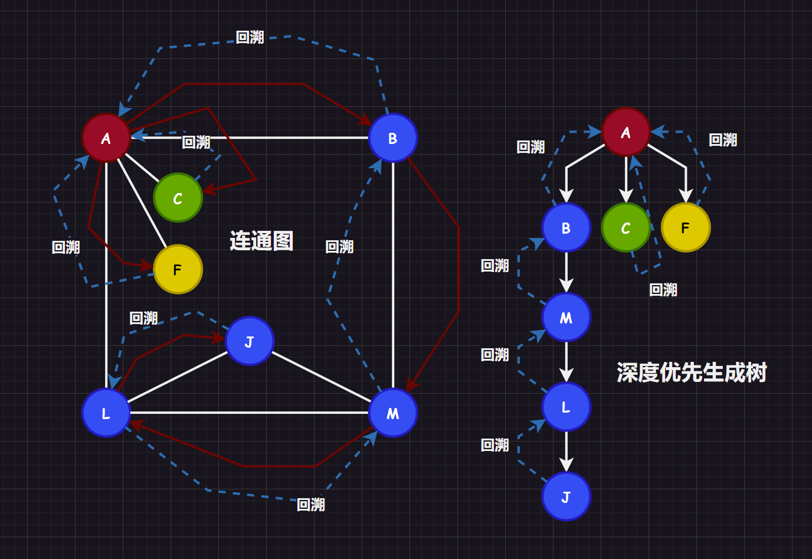

# 1.图概念

## 1.1.图的定义

图 $G$ 由两个集合 $V$ 和 $E$ 构成，记为 $G = (V, E)$，其中：

1.   $V(G)$ 为顶点的有穷非空集合
2.   $E(G)$ 为 $V$ 中顶点偶对（边/弧长）的有穷集合

其中，我们规定：

1.   $E(G)$ 是无方向的边 $(v, v')$，则 $G$ 为无向图
2.   $E(G)$ 是有方向的弧 $<v, v'>$ 则 $G$ 为有向图


图用于解决一些交通网络、人物社交关系等等问题十分方便，尤其是求最短路径和最小生成树，这在实践中有较大的意义。

>   补充：树是特殊的图（无环但连通的图），而图不一定是树。树关注的是结点和其中存储的值，而图更加关注的是结点和权值，尤其是权值更为重要。本质上来说树是一种存储结构，而图是一种表示结构。

## 1.2.图的术语

-   **顶点、边**：一般使用$n$表示顶点个数，用$e$表示边的数目

-   **子图**：如果对于两个集合$G = (V, E)$和$G' = (V', E')$，如果有$V' \subseteq V, E' \subseteq E$，则称$G$为$G'$的子图

-   **完全图**：无向图若具有$n(n - 1)/2$条边就称为“无向完全图”，有向图若具有$n(n-1)$则称为“有向完全图”。实际上，就是将所有的顶点都链接起来，达到顶点对集合的大小最大化

-   **稀疏图和稠密图**：这个是相对的概念，有较少的顶点对就被称为“稀疏图”，有较多的顶点对就被称为“稠密图”

-   **权和网**：每一条顶点对都可以带上具有某种意义的数值，称为“权值”，具有权值的图也被称作“网”

-   **顶点对/顶点偶对**：无向图的边可以根据两个点表示为顶点对$(v, v') \in E$，有向图的边可以根据两个点表示为顶点对$<v, v'> \in E$

-   **邻接点**：对于两个点$V$和$V’$，若有$(v, v') \in E$或者$<v, v'> \in E$，则两点称为“邻接点”（其实就是两个顶点有链接形成顶点对），也称顶点对依附于两个顶点，或者说顶点对和两个顶点相关联

-   **度**：对于顶点$V$有多少条相关联的边的数目，记着$TD(v)$，其中在有向图中还将一个顶点的度分为入度$ID(v)$和出度$OD(v)$。一般的，如果有$n$个顶点，$e$条边的图，满足关系$e = \frac{1}{2} \displaystyle\sum_{i = 1}^{n}TD(v_i)  = \frac{1}{2}\displaystyle\sum_{i = 1}^{n}(ID(v_i) + OD(v_i))$

-   **路径和路径长度**：路劲是指一个顶点$v$到达另外一个顶点$v'$之间的顶点序列$V = \{v = v_{i}, v_{i+1}, v_{i+2}, ..., v_{i+n} = v' \}$，而路径长度就是一条路径上经过的边或者弧的数目，也就是$V.size() - 1$，如果顶点序列没有出现重复的元素，就是一个简单路径

-   **环**：第一个顶点和最后一个顶点相同的路径就是回路/环，如果路径（顶点序列）中没有出现重复的元素（除了第一个和最后一个顶点可以重复），就是一个简单回路/环

-   **连通/强连通**：如果图中一个顶点到另外一个顶点之间的路径（顶点序列）存在（无向图就是有链接，有向图就是两个方向都有），则称两顶点之间“连通/强连通”

-   **连通图、联通分量**：而如果对一个无向图来说，任意两个顶点都是连通的，则称为“连通图”。而如果一个图不是连通图，那么可以尽可能找到图中连通的子图，该子图被称为“图的连通分量”

    

-   **强连通图、强连通分量**：而如果对一个有向图来说，任意两个顶点都是连通的，则称为“强连通图”。而如果一个图不是强连通图，那么可以尽可能找到图中强连通的子图，该子图被称为“图的强连通分量”

    

-   **连通图的生成树**：对于有$n$个结点的连通图$G$，其连通分量$g$若包含连通图$G$中所有的节点，并且拥有$n - 1$条边，则该连通分量也被称为“生成树”，并且如果添加了一个边，就必点构成一个回环

    >   补充：根据图的顶点个数和边个数可以反向得到一些结论
    >
    >   1.   若一个图有 $n$ 个顶点和小于 $n - 1$ 条边，则为非连通图
    >   2.   若一个图有 $n$ 个顶点和大于 $n - 1$ 条边，则图中存在环
    >   3.   若一个图有 $n$ 个顶点和等于 $n - 1$ 条边，则不一定为生成树

-   **强连通图的有向树**：有向图中有一个顶点的入度为$0$，其余顶点的入度均为$1$，则该有向图被称为“有向树”

# 2.图接口

## 2.1.邻接矩阵类模板

```cpp
#pragma once

#include <vector>
#include <iostream>
#include <string>
#include <map>
#include <stdexcept>
#include <climits>
#include <cstdio>

namespace limou
{
	using std::vector;
	using std::string;
	using std::cout;
	using std::map;
	using std::invalid_argument;

	template <
		typename VertexType = char, //顶点数据类型
		typename WeightType = int, //权重数据类型
		WeightType MAX_W = INT_MAX, //表示无穷的数
		bool Direction = false //判断是否有向
	>
	class AMGraph
	{
		/*
		* 无向图或有向图（考虑带权值）模板类，
		* 测试有三种方法：IO 输入、文件读取样例、手动在代码中添加
		*/
	public:
		AMGraph(const vector<VertexType>& arr, size_t arrSize)
		{
			/* 根据顶点序列，初始化邻接矩阵和其他相关信息 */
		}

		size_t GetVertexIndex(const VertexType& v)
		{
			/* 返回顶点对应的索引，并且有检查机制，防止用户输错顶点 */
		}

		void AddEdge(const VertexType& src, const VertexType& dst, const WeightType& w)
		{
			/* 添加边以及对应的权值 */
		}

		void Print()
		{
			/* 打印顶点集合和邻接矩阵来测试（只限于 int 类型的顶点数据） */
		}

	private:
		vector<VertexType> _vertexs; //顶点表
		vector<vector<WeightType>> _weights; //邻接矩阵（无向图的时候表示链接关系，有向图的时候不仅可以查看是否有链接，还可以查看权值）
		map<VertexType, int> _indexMap; //顶点映射下标（主要是用来提高效率的）
	};

	void TestGraph()
	{
        /* 测试邻接矩阵 */
    }
}
```

## 2.1.邻接表类模板

```cpp

```

# 3.图细节

## 3.1.存储结构

根据图的定义，很容易就会想到一种方案：将顶点序列和顶点对序列直接使用 `vector` 存储起来。

```cpp
#include <vector>
#include <utility>
using std::vector;
using std::pair;

template <
	typename VertexType = char, //顶点数据类型
	typename WeightType = int, //权重数据类型
	bool Direction = false //判断是否有向
>
class Graph
{
private:
	vector<VertexType> _vertexs; //顶点表
	vector<pair<VertexType, VertexType>> _edges; //顶点对表
};
```

但是这种存储结构有点问题：

1.   两个顶点是否相连需要遍历 `_edges` 才可得知
2.   相连的权值怎么存储？怎么快速得到权值？
3.   对于有向图，怎么判断方向？

因此我们就需要探索其他的存储结构，其中邻接矩阵和邻接表是相辅相成的结构。

>   注意：下面我只是探讨存储结构的大致思路和图解，最后实现的过程中，我会结合多种存储结构来书写图的多种类模板（也就是开头给出的类模板和接口声明）。

### 3.1.1.邻接矩阵（adjacent matrix）

```cpp
#include <vector>
#include <map>
#include <climits>
using std::vector
using std::map

template <
	typename VertexType = char, //顶点数据类型
	typename WeightType = int, //权重数据类型
	WeightType MAX_W = INT_MAX, //表示无穷的数
	bool Direction = false //判断是否有向
>
class AMGraph
{
private:
	vector<VertexType> _vertexs; //顶点表
	vector<vector<WeightType>> _weights; //邻接矩阵（无向图的时候表示链接关系，有向图的时候不仅可以查看是否有链接，还可以查看权值）
	map<VertexType, int> _indexMap; //顶点映射下标（主要是用来提高效率的）
};
```

#### 3.1.1.1.无向图

对于无向图，我们可以使用一个字符数组存储顶点数据，使用一个二维数组来存储两个结点之间的关系，用 `1` 表示两顶点有边，`0` 表示两顶点无边（也可以用 `int` 的最大值 `INT_MAX` 来代表 `0`，具体看实现）。


1.   无向图的邻接矩阵是对称的，且主对角线元素全为 `0`（因为顶点和自己没有边）
2.   顶点 `i` 的度 = 第 `i` 行(列)中 `1` 的个数
3.   完全图的邻接矩阵中，主对角元素为 `0`，其余全为 `1`

#### 3.1.1.2.有向图

有向图也是类似的实现，就是可能需要人为规定方向的规则，本系列文章的实现中认为：第 `i` 行和为一个顶点的出度，第 `j` 列和为一个顶点的入度。 


#### 3.1.1.3.网

我们可以在 `int` 的二维数组存储权值，来构成网，而没有权值的边或弧一般使用 `int` 的最大值 `INT_MAX` 来代表（或者记作 $∞$）。


>   解析：邻接矩阵的优缺点
>
>   邻接矩阵的优点：
>
>   1.   快速判断两个顶点是否有顶点对，时间复杂度为 $O(1)$
>   2.   对于有向图可以快速查找权值
>   3.   适合稠密图的存储，比邻接表的密度高
>   4.   邻接矩阵对应唯一的一个图
>
>   邻接矩阵的缺点：
>
>   1.   增加和删除顶点困难，移动复制或扩容代价很大、步骤繁琐
>   2.   要得到每个顶点的度，需要时间复杂度为 $O(n)$
>   3.   占用空间大，对于稀疏图来说消耗大，时间复杂度为 $O(n^{2})$
>   4.   统计边的数目需要遍历二维数组才可得知，时间复杂度为 $O(n^{2})$

### 3.1.2.邻接表（adjacency list）

```cpp
#include <vector>
#include <list>
#include <utility>
using std::vector;
using std::list;
using std::pair;

template <
	typename VertexType = char, //顶点数据类型
	typename WeightType = int, //权重数据类型
	bool Direction = false //判断是否有向
>
class ALGraph
{
private:
	vector<
		pair<
			VertexType, list<pair<int, WeightType>>
		>
	> _vertexs;
};
```

有了前面的铺垫，我这里就简单给出邻接表的图解，实际上就是给使用顺序表存储每个顶点的链表，每个链表内存储的都是对应顶点的邻接点或者出度点/入度点在顺序表中的索引。


>   补充 `1`：上述的结构中存储的是出度的正邻接表，也可以存储入度的逆邻接表
>
>   补充 `2`：邻接表只存储了一个顶点的索引，而邻接多重表将一个顶点的索引改为存储边的两个顶点索引或者弧长、弧尾，这在某些操作中会更加方便，例如：标记某一条边或弧是否被访问过，删除一条边等。

>   解析：邻接表的优缺点
>
>   邻接表的优点：
>
>   1.   便于书写增加和删除顶点的代码
>   2.   可以快速统计边的数目，时间复杂度为 $O(n + e)$
>   3.   空间利用率较高，非常适合表示稀疏图，空间复杂度为 $(n + e)$
>
>   邻接表的缺点：
>
>   1.   判断两顶点是否有边的速度不如邻接矩阵快，需要去扫描其中一个顶点的边表，时间复杂度为 $O(n)$
>   2.   在有些情况判断一个结点的度比较困难，对于无向图顶点的度和有向图顶点的出度还好，但是得到入度就比较困难，需要遍历整个边表，时间复杂度为 $O(n + e)$，如果我们一开始定义边表是存储入度点的索引（也就是“逆邻接表”），则情况相反
>   3.   一个图有可能会产生不同的邻接表，取决于算法实现和输入顺序

### 3.1.4.十字链表（across linker）

```cpp
#include <vector>
using namespace std;

template <typename ArcType = int>
struct ArcBox
{
	int tailIndex, headInde;	//尾索引和头索引
	ArcType arc;				//携带的权值权值
	ArcBox* sameHead;			//相同头的弧
	ArcBox* sameTail;			//相同尾的弧
};

template <typename VertexType = char, typename ArcType = int>
struct VexNode
{
	VertexType data;					//顶点存储的数据
	ArcBox<ArcType>* firstHead;			//指向以该顶点为弧头的第一个顶点
	ArcBox<ArcType>* firstTail;			//指向以该顶点为弧尾的第一个顶点
};

template <typename VertexType = char, typename ArcType = int>
class OLGraph
{
private:
	vector<VexNode<VertexType, ArcType>> table;		//顶点表
};
```

这样的结构有些复杂，十字链表是专门用来方便求取有向图的出度和入度的。

顶点表包含：

-   每一个元素都包含顶点数据
-   指向以该顶点为头的第一个弧
-   指向以该顶点为尾的第一个弧

边表则包含：

-   该弧的头尾索引
-   指向下一个同弧头的顶点
-   指向下一个同弧尾的顶点

同样这里也只给出一个例子的图解：


>   解析：十字链表的优缺点
>
>   方便求取有向图的出度和入度：
>
>   1. 求一个顶点的出度：找到该顶点的 `firstTail` ，一直遍历同尾的弧
>   1. 求一个顶点的入度：找到该顶点的 `firstHead` ，一直遍历同头的弧

## 3.2.图的遍历

### 3.2.1.深度优先遍历

连通图的深度优先遍历（`DFS`）是树的先序遍历的推广：

1.   从起始顶点开始访问，一直访问起始顶点的未被访问的邻接点
2.   邻接点被访问后，成为新的起始顶点，跳转步骤 `1`，直到遇到一个顶点的所有邻接点都被访问过的时候停下
3.   开始进行回溯，返回前面被访问过，但是其还有邻接点没有被访问的顶点，跳转步骤 `1`
4.   最后图中所有的顶点都被访问过，搜索结束，得到深度搜索序列和深度优先生成树



### 3.2.2.广度优先遍历

连通图的深度优先遍历（`DFS`）是树的层序遍历的推广：

1.   从起始顶点开始访问，一直访问起始顶点的未被访问的所有邻接点
2.   所有邻接点被访问后，依顺序，每一个邻接点成为一个又一个新的起始顶点，跳转步骤 `1`，直到遇到一个顶点的所有邻接点都被访问过的时候停下
3.   最后图中所有的顶点都被访问过，搜索结束，得到广度搜索序列和广度优先生成树


## 3.3.最小生成树

### 3.3.1.普里姆算法（Prim）

### 3.3.2.克鲁斯卡尔算法（Kruskal）

## 3.4.最短路径

### 3.4.1.迪杰斯特拉算法

### 3.4.2.弗洛伊德算法

## 3.5.拓扑排序


## 3.6.关键路径

# 4.图实现

## 4.1.邻接矩阵实现

```cpp
#pragma once

#include <vector>
#include <iostream>
#include <string>
#include <map>
#include <stdexcept>
#include <climits>
#include <cstdio>

namespace limou
{
	using std::vector;
	using std::string;
	using std::cout;
	using std::map;
	using std::invalid_argument;

	template <
		typename VertexType = char, //顶点数据类型
		typename WeightType = int, //权重数据类型
		WeightType MAX_W = INT_MAX, //表示无穷的数
		bool Direction = false //判断是否有向
	>
	class AMGraph
	{
		/*
		* 无向图或有向图（考虑带权值）模板类，
		* 测试有三种方法：IO 输入、文件读取样例、手动在代码中添加
		*/
	public:
		AMGraph(const vector<VertexType>& arr, size_t arrSize)
		{
			/* 根据顶点序列，初始化邻接矩阵和其他相关信息 */
			_vertexs.reserve(arrSize);
			for (size_t i = 0; i < arrSize; ++i)
			{
				_vertexs.push_back(arr[i]);
				_indexMap[arr[i]] = (int)i;
			}

			_weights.resize(arrSize);
			for (size_t i = 0; i < arrSize; i++)
			{
				_weights[i].resize(arrSize, MAX_W);
			}
		}

		size_t GetVertexIndex(const VertexType& v)
		{
			/* 返回顶点对应的索引，并且有检查机制，防止用户输错顶点 */
			auto it = _indexMap.find(v);
			if (it != _indexMap.end())
			{
				return it->second;
			}
			throw invalid_argument("顶点不存在");//运行时报错
			return -1;//防止编译器警告
		}

		void AddEdge(const VertexType& src, const VertexType& dst, const WeightType& w)
		{
			/* 添加边以及对应的权值 */
			size_t srci = GetVertexIndex(src);
			size_t dsti = GetVertexIndex(dst);

			_weights[srci][dsti] = w;//链接
			if (Direction == false)//如果是无向图还需要镜像处理
			{
				_weights[dsti][srci] = w;
			}
		}

		void Print()
		{
			/* 打印顶点集合和邻接矩阵来测试（只限于 int 类型的顶点数据） */
			int i = 0;
			for (auto ver : _vertexs)
			{
				cout << "[" << i++ << "]" << "->" << ver << '\n';
			}
			cout << '\n';

			for (size_t i = 0; i < _weights.size(); i++)
			{
				for (size_t j = 0; j < _weights[i].size(); j++)
				{
					if (_weights[i][j] != INT_MAX)
					{
						printf("[%zd, %zd]:%-10d  ", i, j, _weights[i][j]);
					}
					else
					{
						printf("[%zd, %zd]:%-10d  ", i, j, 0);
					}
				}
				cout << '\n';
			}
		}

	private:
		vector<VertexType> _vertexs; //顶点表
		vector<vector<WeightType>> _weights; //邻接矩阵（无向图的时候表示链接关系，有向图的时候不仅可以查看是否有链接，还可以查看权值）
		map<VertexType, int> _indexMap; //顶点映射下标（主要是用来提高效率的）
	};

	void TestGraph()
	{
		string str = "0123";
		vector<char> vec(str.begin(), str.end());
		AMGraph<char, int, INT_MAX, true> amg(vec , 4);
		amg.AddEdge('0', '1', 1);
		amg.AddEdge('0', '3', 4);
		amg.AddEdge('1', '3', 2);
		amg.AddEdge('1', '2', 9);
		amg.AddEdge('2', '3', 8);
		amg.AddEdge('2', '1', 5);
		amg.AddEdge('2', '0', 3);
		amg.AddEdge('3', '2', 6);
		amg.Print();
	}
}
```

## 4.1.邻接表实现

```cpp

```

# 5.图分析

# 6.图实践

