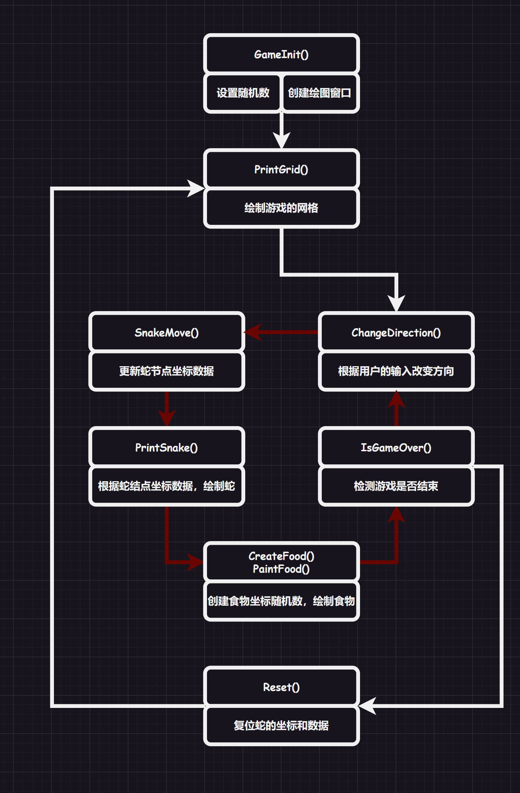
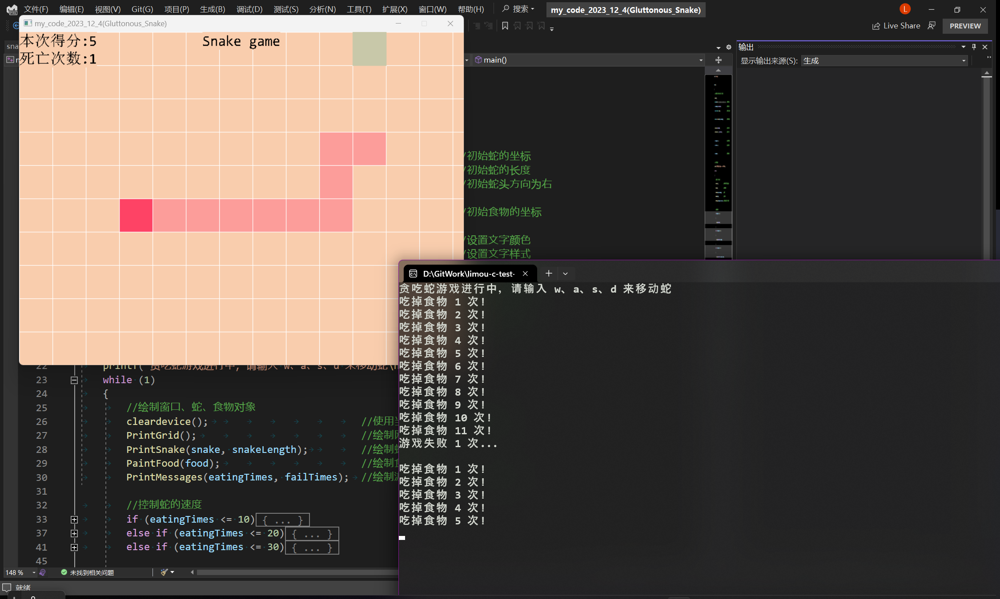

# 1.EasyX库认知

有关`EasyX`库的相关信息，您可以看一下官方的文档：[EasyX官方文档](https://docs.easyx.cn/zh-cn/intro)。

这里我做几点总结：

1.   `EasyX`库就和名字一样，可以让用户调用一些简单的函数来绘制图像和几何图形
2.   利用`EasyX`库可以制作一些带有图形界面的小游戏、小软件等小型项目
3.   比较使用新手锻炼`C`语言的代码组织能力，了解一些有关于图形设计的知识（比如：一些动画制作的知识）

基本上使用`EasyX`库就是几个步骤：

1.   使用函数初始化出一个绘图窗口，窗口的坐标有两种（逻辑坐标和物理坐标，默认两者是重叠的），无论哪一种坐标，一开始都是以屏幕的左上角为原点，向右为`x`轴正方向，向下为`y`轴正方向
2.   然后利用`C++/C`语言的代码控制一些绘图用的数据
3.   调用绘图函数绘制几何图形，例如：正方向、圆形、椭圆......
4.   根据项目逻辑、或者控制台输入来更新绘图数据
5.   再次条用函数绘制几何函数，就仿佛“动了”起来
6.   最后结束时关闭绘图窗口，清理各种资源即可

# 2.贪吃蛇项目描述

主要是使用`EasyX`图形库，结合`C`语言以及部分数据结构知识来构建一只贪吃蛇，用户通过`[w]`、`[a]`、`[s]`、`[d]`四个键操控贪吃蛇，通过吃掉网格图上的“食物”来得分，一旦吃到墙壁和自己，就会结束游戏重新开始。

在游戏界面的左上角还显示了用户当前的得分和用户的贪吃蛇死亡次数。并且还提供了根据得分加速游戏的机制，还可以点击“空格”暂停游戏，点击`[esc]`退出游戏。

# 3.贪吃蛇项目细节

## 3.1.基础设置

由于语言特性，我们认为较小游戏项目使用宏来设置更好管理和调试代码，因此我们使用`#define`定义了在游戏中需要的相关设置，例如：蛇的颜色、食物的颜色、游戏窗口的大小、文字颜色、文字风格等，除此以外还包含了一些游戏用的头文件以及`easyx.h`图形库。

```cpp
#pragma once
#pragma warning(disable:4996)

#include <easyx.h>
#include <stdio.h>
#include <windows.h>
#include <conio.h>
#include <time.h>
#include <stdlib.h>
#include <string.h>

#define _CRT_SECURE_NO_WARNINGS 1			//解决 VS2022 的 scanf() 禁用问题

#define NODE_WIDTH 60						//格点大小（通过格点大小调整格数和难度)
#define WINDOW_LENGTH 800					//窗体长度
#define WINDOW_WIDTH 600					//窗体宽度

#define SNAKE_LENGTH 5						//蛇初始长度
#define SNAKE_MAX_LENGTH 50					//蛇最大长度
#define SNAKE_SPEED 500						//蛇初始速度

#define SNAKE_HEAD_COLOUR RGB(254, 67, 101)			//蛇头颜色
#define SNAKE_BODY_COLOUR RGB(252, 157, 154)		//蛇身颜色
#define SNAKE_BODY_EDGE_COLOUR RGB(252, 157, 154)	//蛇身外边颜色
#define FOOD_COLOUR RGB(200, 200, 169)				//食物颜色
#define WINDOW_COLOUR RGB(249, 205, 173)			//背景颜色

#define TEXT_COLOUR RGB(0, 0, 0)					//文字颜色
#define TEXE_STYLE "Consolas"						//文字风格
```

## 3.2.结构管理

### 3.2.1.坐标结构

`easy.h`通过绘图函数在一个叫做“绘图设备”的窗口上（默认该窗口的左上角为原点，向左为`x`轴，向下为`y`轴），根据坐标轴来绘制图形。

由于每次绘图都需要用到坐标，因此为了方便，我们使用了一个结构体`node`管理一个点的横纵坐标。

```cpp
typedef struct
{
	int x;
	int y;
} node;
```

### 3.2.2.方向结构

由于后期需要用户输入`[w]`、`[a]`、`[s]`、`[d]`四个键操控贪吃蛇，因此就需要将方向也管理起来，使用枚举体来标识方向和方向对应的标识符。

```cpp
enum direction
{
	eUp,	//上(0)
	eDown,	//下(1)
	eLeft,	//左(2)
	eRight	//右(3)
};
```

## 3.3.游戏接口

这里先给出游戏用到的接口，再一一解释接口的调用逻辑。

```cpp
//初始化窗口
void GameInit();
//绘制网格
void PrintGrid();
//更新蛇坐标
node SnakeMove(node* snake, int snakeLength, direction dir);
//绘制蛇
void PrintSnake(node* snake, int snakeLength);
//检查输入方向
void ChangeDirection(enum direction* pD);
//生成食物坐标
node CreateFood(node* snake, int snakeLength);
//绘制食物
void PaintFood(node food);
//检测游戏结束条件
bool IsGameOver(node* snake, int snakeLength);
//复位蛇数据
void Reset(node* snake, int* pLength, enum direction* dir);
//绘制游戏信息
void PrintMessages(int eatingTimes, int failTimes);
```



# 4.贪吃蛇项目实现

## 4.1.头文件、宏和接口声明

```cpp
//1.头文件导入和宏设置
#pragma once
#pragma warning(disable:4996)

#include <easyx.h>
#include <stdio.h>
#include <windows.h>
#include <conio.h>
#include <time.h>
#include <stdlib.h>
#include <string.h>

#define _CRT_SECURE_NO_WARNINGS 1			//解决 VS2022 的 scanf() 禁用问题

#define NODE_WIDTH 60						//格点大小（通过格点大小调整格数和难度)
#define WINDOW_LENGTH 800					//窗体长度
#define WINDOW_WIDTH 600					//窗体宽度

#define SNAKE_LENGTH 5						//蛇初始长度
#define SNAKE_MAX_LENGTH 50					//蛇最大长度
#define SNAKE_SPEED 500						//蛇初始速度

#define SNAKE_HEAD_COLOUR RGB(254, 67, 101)			//蛇头颜色
#define SNAKE_BODY_COLOUR RGB(252, 157, 154)		//蛇身颜色
#define SNAKE_BODY_EDGE_COLOUR RGB(252, 157, 154)	//蛇身外边颜色
#define FOOD_COLOUR RGB(200, 200, 169)				//食物颜色
#define WINDOW_COLOUR RGB(249, 205, 173)			//背景颜色

#define TEXT_COLOUR RGB(0, 0, 0)					//文字颜色
#define TEXE_STYLE "Consolas"						//文字风格


//2.结构体组织
//相对坐标结构体
typedef struct
{
	int x;
	int y;
} node;

//方向枚举体
enum direction
{
	eUp,	//上(0)
	eDown,	//下(1)
	eLeft,	//左(2)
	eRight	//右(3)
};

//3.相关函数声明
//初始化窗口
void GameInit();

//绘制网格
void PrintGrid();

//更新蛇坐标
node SnakeMove(node* snake, int snakeLength, direction dir);

//绘制蛇
void PrintSnake(node* snake, int snakeLength);

//检查输入方向
void ChangeDirection(enum direction* pD);

//生成食物坐标
node CreateFood(node* snake, int snakeLength);

//绘制食物
void PaintFood(node food);

//检测游戏结束条件
bool IsGameOver(node* snake, int snakeLength);

//复位蛇数据
void Reset(node* snake, int* pLength, enum direction* dir);

//绘制游戏信息
void PrintMessages(int eatingTimes, int failTimes);
```

## 4.2.游戏接口的实现

```cpp
#include "snake.hpp"

//初始化窗口
void GameInit()
{
	//默认逻辑坐标原点和物理坐标原点重叠
	srand((unsigned)time(NULL));							//设置伪随机数

	initgraph(WINDOW_LENGTH, WINDOW_WIDTH, EX_SHOWCONSOLE);	//创建一个窗体
	setbkcolor(WINDOW_COLOUR);								//背景颜色属性
	cleardevice();											//刷新背景颜色
}

//绘制网格
void PrintGrid()
{
	for (int x = 0; x <= 800; x += NODE_WIDTH)
	{
		line(x, 0, x, 600);
	}
	for (int y = 0; y <= 600; y += NODE_WIDTH)
	{
		line(0, y, 800, y);
	}
}

//更新蛇坐标
node SnakeMove(node* snake, int snakeLength, direction dir)
{
	//记录下蛇的尾部节点坐标
	node tail = snake[snakeLength - 1];

	//将每个前面的节点覆盖掉后面的节点
	for (int i = snakeLength - 1; i > 0; i--)
	{
		snake[i] = snake[i - 1];
	}

	//蛇头节点根据方向进行重定义坐标
	node newHead;
	newHead = snake[0];
	if (dir == eUp)
	{
		newHead.y--;
	}
	else if (dir == eDown)
	{
		newHead.y++;
	}
	else if (dir == eLeft)
	{
		newHead.x--;
	}
	else if (dir == eRight)
	{
		newHead.x++;
	}
	snake[0] = newHead;

	//返回蛇最尾部节点坐标，方便吃掉食物后不删除尾部节点坐标
	return tail;
}

//绘制蛇
void PrintSnake(node* snake, int snakeLength)
{
	//某一段蛇节点的左上、右下坐标
	int left, top;
	int right, bottom;

	//遍历蛇结点的每一个结点
	for (int i = 0; i < snakeLength; i++)
	{
		//绘制蛇的某个节点
		left = snake[i].x * NODE_WIDTH;
		top = snake[i].y * NODE_WIDTH;

		right = (snake[i].x + 1) * NODE_WIDTH;
		bottom = (snake[i].y + 1) * NODE_WIDTH;

		if(i == 0)	
			setfillcolor(SNAKE_HEAD_COLOUR);

		fillrectangle(left, top, right, bottom);
		
		setfillcolor(SNAKE_BODY_COLOUR);
	}
	setfillcolor(WHITE);
}

//检查输入方向
void ChangeDirection(enum direction* pD)
{
	if (_kbhit() != 0)//检查控制台窗口的按键是否被按下，按下返回非零值
	{
		char signal = _getch();	//输入 a、s、d、w 四个方向键到 signal 中，不回显
		switch (signal)
		{
		case 'w':
			if (*pD != eDown)	//如果原蛇头方向不是向下才可以向上
				*pD = eUp;
			break;
		case 's':
			if (*pD != eUp)		//如果原蛇头方向不是向上才可以向下
				*pD = eDown;
			break;
		case 'a':
			if (*pD != eRight)	//如果原蛇头方向不是向右才可以向左
				*pD = eLeft;
			break;
		case 'd':
			if (*pD != eLeft)	//如果原蛇头方向不是向左才可以向右
				*pD = eRight;
			break;
		case VK_ESCAPE:			//处理其他的输入情况（暂停和退出）
			printf("游戏已退出，感谢您的游玩！ +\n");
			exit(0);
		case VK_SPACE:
			printf("游戏暂停...输入空格键位恢复...\n");
			while (1)
			{
				signal = _getch();
				if (signal == VK_SPACE)
				{
					printf("游戏继续进行\n");
					break;
				}
				else if (signal == VK_ESCAPE)
				{
					printf("游戏暂停...输入空格键位恢复...\n");
					exit(0);
				}
			}
		}
	}
}

//生成食物的坐标
node CreateFood(node* snake, int snakeLength)
{
	node food;
	while (1)
	{
		//先生成食物的随机坐标，并且限制在一定的范围内
		//推导也比较简单：
		//x * (NODE_WIDTH) < WINDOW_LENGTH 推出 x < WINDOW_LENGTH / NODE_WIDTH
		//y * (NODE_WIDTH) < WINDOW_WIDTH 推出 y < WINDOW_WIDTH / NODE_WIDTH
		food.x = rand() % (WINDOW_LENGTH / NODE_WIDTH);
		food.y = rand() % (WINDOW_WIDTH / NODE_WIDTH);

		//保证食物和蛇节点坐标不重叠
		int i;
		for (i = 0; i < snakeLength; i++)
		{
			if (snake[i].x == food.x && snake[i].y == food.y)
			{
				break;//如果发生坐标冲突则跳出内循环
			}
		}
		if (i < snakeLength)
		{
			continue;//由于坐标发生冲突，跳出了内循环，所以循环数没有再增加，使用 continue 重新回到循环开头生成符合的食物节点
		}
		else
		{
			break;//没有和蛇结点坐标冲突的食物坐标，准备返回结点
		}
	}

	//返回食物的坐标（注意噢，这是返回结构体）
	return food;
}

//绘制食物
void PaintFood(node food)
{
	//食物的左上、右下坐标
	int left, top;
	int right, bottom;

	left = food.x * NODE_WIDTH;
	top = food.y * NODE_WIDTH;

	right = (food.x + 1) * NODE_WIDTH;
	bottom = (food.y + 1) * NODE_WIDTH;

	//设置食物颜色，并且绘制食物
	setfillcolor(FOOD_COLOUR);
	solidrectangle(left, top, right, bottom);

	//填充颜色改回白色，避免后续填充绘画出现误用（EasyX 库默认使用白色填充）
	setfillcolor(WHITE);
}

//检测游戏结束条件
bool IsGameOver(node* snake, int snakeLength)
{
	//超出窗口的情况，注意 EasyX 库的设备坐标系
	if (snake[0].x < 0 || snake[0].x * NODE_WIDTH > WINDOW_LENGTH)//蛇头超出左右窗体
	{
		return true;
	}
	if (snake[0].y < 0 || snake[0].y * NODE_WIDTH > WINDOW_WIDTH)//蛇头超出上下窗体
	{
		return true;
	}

	//蛇自己吃到自己的情况
	for (int i = 1; i < snakeLength; i++)
	{
		//判断蛇头是否和蛇生身坐标重叠
		if (snake[0].x == snake[i].x && snake[0].y == snake[i].y)
		{
			return true;
		}
	}

	//都不满足就返回假
	return false;
}

//复位蛇数据
void Reset(node* snake, int* pLength, enum direction* dir)
{
	snake[0] = node{ 5, 7 };
	snake[1] = node{ 4, 7 };
	snake[2] = node{ 3, 7 };
	snake[3] = node{ 2, 7 };
	snake[4] = node{ 1, 7 };
	*pLength = 5;
	*dir = eRight;
}

//绘制游戏信息
void PrintMessages(int eatingTimes, int failTimes)
{
	//控制文字输出的窗口范围
	RECT r = { 0, 0, WINDOW_LENGTH, WINDOW_WIDTH };
	
	//输出游戏的名称
	drawtext(_T("Snake game"), &r, DT_CENTER | DT_SINGLELINE);

	//设置 wchar_t 宽字符类型数组，并且将游戏信息填充进去，再输出
	TCHAR count[100];
	_stprintf(count, _T("本次得分:%d\n死亡次数:%d"), eatingTimes, failTimes);//这个函数对标 sprintf()，只不过是从打印普通的 char 字符变成打印宽字符 wchar_t 而已
	drawtext(count, &r, DT_LEFT);
}
```

## 4.1.游戏的运行逻辑

```cpp
#include "snake.hpp"

int main()
{
	//1.初始游戏背景、蛇和食物、游戏文字、游戏信息
	GameInit();
	node snake[100] = { {5,7}, {4,7}, {3,7}, {2,7}, {1,7} };	//初始蛇的坐标
	int snakeLength = SNAKE_LENGTH;								//初始蛇的长度
	enum direction dir = eRight;								//初始蛇头方向为右

	node food = CreateFood(snake, snakeLength);					//初始食物的坐标

	settextcolor(TEXT_COLOUR);									//设置文字颜色
	settextstyle(32, 14, _T(TEXE_STYLE));						//设置文字样式

	int eatingTimes = 0;										//统计吃掉的食物
	int failTimes = 0;											//统计失败次数

	int speedUp = 2;											//提速用的变量

	//2.运行游戏逻辑
	printf("贪吃蛇游戏进行中，请输入 w、a、s、d 来移动蛇\n");
	while (1)
	{
		//绘制窗口、蛇、食物对象
		cleardevice();							//使用当前背景色清空绘图设备
		PrintGrid();							//绘制网格函数
		PrintSnake(snake, snakeLength);			//绘制蛇
		PaintFood(food);						//绘制食物
		PrintMessages(eatingTimes, failTimes);	//绘制游戏标题、得分、失败次数

		//控制蛇的速度
		if (eatingTimes <= 10)
		{
			Sleep(SNAKE_SPEED);
		}
		else if (eatingTimes <= 20)
		{
			Sleep(SNAKE_SPEED / speedUp);
		}
		else if (eatingTimes <= 30)
		{
			Sleep(SNAKE_SPEED / speedUp / speedUp);
		}

		//检测方向，修改蛇结点坐标
		ChangeDirection(&dir);								//检查是否有键盘输入，有的话修改蛇头的方向
		node lastTail = SnakeMove(snake, snakeLength, dir);	//改变蛇头方向后的新坐标数组，并且返回储存了最尾部节点的坐标（注意：这里的snake是数组，可以直接传数组名字）
		
		//吃掉食物，增长蛇长度
		if (snake[0].x == food.x && snake[0].y == food.y)	//蛇头节点和食物节点重合，说明吃到了食物
		{
			if (snakeLength < SNAKE_MAX_LENGTH)				//限制蛇的长度，超出就不再增长蛇的长度
			{
				snake[snakeLength] = lastTail;		//增加蛇的尾巴
				snakeLength++;						//蛇的长度增加
				eatingTimes++;						//统计吃到食物数量
				printf("吃掉食物 %d 次!\n", eatingTimes);
			}
			food = CreateFood(snake, snakeLength);			//再次生成食物
		}
		
		//判断游戏是否结束
		if (IsGameOver(snake, snakeLength) == true)			//蛇头撞到墙壁 or 蛇头吃到蛇身
		{
			printf("游戏失败 %d 次...\n\n", ++failTimes);	//打印游戏失败次数
			Sleep(1000);									//让玩家缓一会，调整状态

			eatingTimes = 0;								//复位所吃食物数量
			Reset(snake, &snakeLength, &dir);				//复位蛇的数据和方向
			food = CreateFood(snake, snakeLength);			//再次生成食物
		}
	}

	//3.清理游戏资源
	int ch = getchar();	//阻塞控制台窗口，让用户可以得知结果
	closegraph();		//关闭绘画窗口
	return 0;
}
```

# 5.贪吃蛇项目运行

上述代码运行结果如下：



# 6.贪吃蛇项目拓展

还有一些功能正等待补充拓张：

1.   有一些接口我们认为还可以再次集中为一个接口
2.   可以设计出能够使用按钮来开始和结束游戏的功能
3.   文件保存功能，用户每次游玩后，数据应该得到保存，并且可以被用户再游戏内查看，而不是打开文件查看
4.   用户可以通过快捷键来加速蛇
5.   用户可以选择贪吃蛇的游戏难度

这些功能有机会再进行实现。
