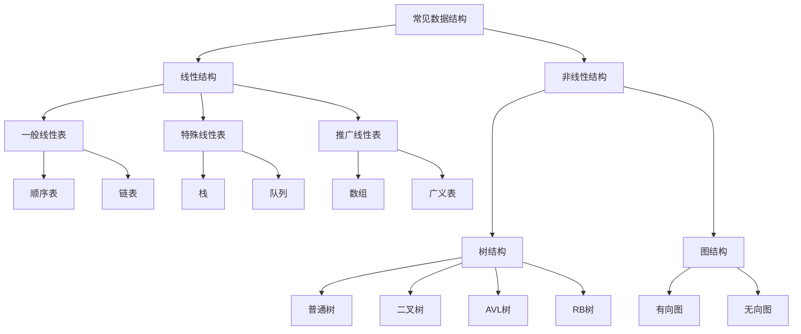

这里主要是科普一些基本的概念和术语。

# 1.数据结构

## 1.1.数据基础

### 1.1.1.数据项

数据是对客观事物的符号表示，在计算机科学中是指所有能输入计算机中并且能被计算机程序处理的符号总称。

### 1.1.2.数据元素

一个元素由若干数据（数据项）构成，通常被计算机作为一个整体来处理操作。

### 1.1.3.数据对象

这里和面向对象中的对象有些许不同，是指若干个相同元素构成的一个整体对象。

## 1.2.数据结构

数据结构是内部元素具有特殊关系的对象，是一个集合。而“结构”这个词主要描述一种“关系”，这种关系可以是：

数据结构在数学上的形式定义为：$Data\_Structure = (D, S)$，其中$D$是一个有关于元素的有限集合，$S$代表基于$D$集合上元素之间关系的有限集合。

数据结构在伪代码上表示为：

```cpp
ADT 抽象数据类型名 {
    数据对象:<数据对象的定义>
    数据关系:<数据关系的定义>
    基本操作:<基本操作的定义>
        基本操作名1(参数列表)
        	初始条件:<初始条件的描述>
        	操作结果:<操作结果的描述>
        基本操作名2(参数列表)
           	初始条件:<初始条件的描述>
        	操作结果:<操作结果的描述>
        基本操作名3(参数列表)
           	初始条件:<初始条件的描述>
        	操作结果:<操作结果的描述>
      	//...
} ADT 抽象数据类型名
```

### 1.2.1.分类数据结构

可以根据“结构/关系”分类：

1.   集合结构：数据结构内的元素只有“属于一个集合”这一特征
2.   线性结构：数据结构内的元素存在一个对一个的关系
3.   树形结构：数据结构内的元素存在一个对多个的关系
4.   图状结构：数据结构内的元素存在多个对多个的关系

### 1.2.2.描述数据结构

1.   逻辑结构：有两种对数据结构的描述和理解，一个是按照数学逻辑来定义一个数据结构，利用数学语言描述元素间的逻辑关系，这也叫做“逻辑结构”。
2.   物理结构：另外一种就是使用数据结构在计算机硬件上真实的映射来描述数据结构，这也叫做“物理结构”（也有叫“存储结构”的）。

### 1.2.3.常见数据结构



## 1.3.数据类型

数据类型是一个值的集合和定义在这个值集上的一组操作的总称。

1.   固定聚合类型：属于该类型的变量，其值由确定数目的成分按照某种结构组成（例如：复数的实部和虚部只需要两个变量就可以确定）。
2.   可变聚合类型：属于该类型的变量，其值的确定成分数目不定（例如：`vector<int>`，每一个该类型的变量长度都不确定）。

# 2.算法

## 2.1.算法定义

算法是为了解决某类问题规定的额一个有限长的操作序列。

### 2.1.1.有穷性

### 2.1.2.确定性

### 2.1.3.可行性

### 2.1.4.输入输出

## 2.2.算法优劣

### 2.2.1.正确性

### 2.2.2.可读性

### 2.2.3.健壮性

### 2.2.4.高效性

### 2.2.5.时间复杂度

### 2.2.6.空间复杂度

