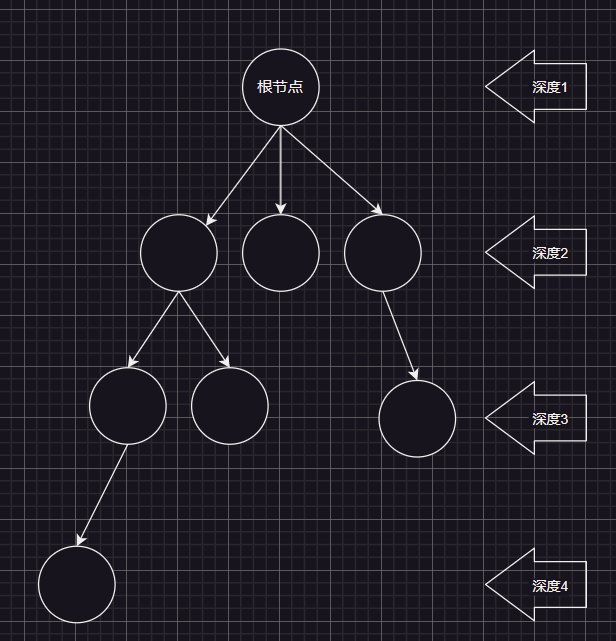

# 1.树和二叉树

## 1.1.树的分类

### 1.1.1.一般树



树是一种非线性结构，由$n,(n>=0)$个有限节点构成一个具有层次关系的集合，看起来就像一棵倒挂的树，是一种`1`对多的关系。

*   有且仅有一个特殊的节点，称为“根节点”，根节点没有父亲节点
*   除根节点外的其余节点被分为$M,(M>0)$个互不相交的集合$T_1、T_2、…T_m$，其中每一个集合$T_i,(1<=i<=m)$又是一棵树结构，每个子树的根节点有且只有一个前驱，可以有`0`或多个后继

很明显，树是递归定义的的数据结构。

>   补充：另外，我们称树中，某个结点拥有的子树的“个数”，成为该结点的“度”，而整颗树的度就是所有结点的最大值。

### 1.1.2.二叉树

有的时候我们不需要子树很多的树，因此就有了二叉树。二叉树的每一个结点的度最大为`2`，由一个根节点加上左右子树构成（也是递归定义）。

#### 1.1.2.1.完全二叉树

假设有一棵二叉树，高度为`h`，则前`h-1`层都是满的，最后一层是不满的，但呈现连续的状态，我们称这棵二叉树为完全二叉树。


#### 1.1.2.2.满二叉树

满二叉树就是二叉树的每一层都是满的（每一层都塞满了节点），可以认为满二叉树是特殊的完全二叉树。


>   补充：根据前面的知识，我们可以来了解一些树的相关术语
>
>   *   **度**：一个节点含有的子树个数称为该节点的度
>   *   **根节点**：根节点没有前驱节点，一棵树有且只有一个根节点
>   *   **叶节点/终端节点**：叶节点没有后驱节点，其“度”为零，一棵树最少也有一个叶节点
>   *   **分支节点/非终端节点**：“度”不为零的节点都叫分支节点
>   *   **节点的层次**：从根开始定义起，根为第一层，根的子节点为第二层（最好不要从第零层开始定义，因为如果一棵树只有一个根结点，层数为零，那么怎么表示空树呢？负一么？有些奇怪，还是使用前一种定义吧）…
>   *   **树的高度/深度**：树中节点最大层次数即树的深度
>   *   **节点之前的亲缘关系**
>       *   **父亲节点/双亲节点**：若一个节点含有子节点，则这个节点时其子节点的父亲节点
>       *   **兄弟节点**：具有相同父亲节点的子节点互称为兄弟节点
>       *   **孩子节点**：一个节点若含有子树的根节点，该子结点称为节点的孩子节点
>       *   **堂兄弟节点**：各自的父结点在同一层的节点互为堂兄弟结点
>       *   **节点的祖先**：从根节点到该节点所经分支上的所有节点，除了它本身都是他的祖先（其中根节点时所有非根节点的祖先）。
>       *   **子孙**：以某节点为根的子树中任一节点都称为该节点上的子孙
>   *   **森林**：由$m,(m>0)$棵互不相交的多棵树的集合被称为森林（在比较复杂的数据结构中，使用并查集就会用到这一概念，我们以后再提及）。

## 1.2.树的存储

### 1.2.1.一般树的存储

#### 1.2.1.1.暴力存储

```cpp
typedef struct TreeNode
{
	int data;//存储节点的数据
	struct TreeNode* child_1;//存储节点指向的子孩子1
	struct TreeNode* child_2;//存储节点指向的子孩子2
	struct TreeNode* child_3;//存储节点指向的子孩子3
	//…
} TreeNode;
```

理论上来说，如果明确树的最大度，的确可以暴力穷举，但是对于有新数据插入的树这个方法就有些差劲了，因为谁也不知道到底最终会插入多少个子节点，更加不知道度的最大值是否会产生变化。

#### 1.2.1.2.亲缘关系存储

##### 1.2.1.2.1.双亲表示法


```cpp
typedef struct TreeNode
{
	int data;//存储节点的数据
	int parenti;
} TreeNode;
//然后创建一个数据元素是TreeNode的结构体数组
```

以双亲为重点，使用数组依次存储树中各个节点，每个节点只存储数据和指向双亲节点的指针或下标，只不过这个方法用的比较少。

##### 1.2.1.2.2.孩子表示法


```cpp
typedef struct TreeNode 
{ 
  	int data;//存储节点的数据 
  	ListNode* childArr;//或者使用顺序表SeqList childArr; 
} TreeNode;
```

使用数组依次存储树中各个节点。节点不止存储数据，还分别配备了一个链表/顺序表，用于存储各节点的孩子节点位于顺序表中的位置。

##### 1.2.1.2.3.孩子兄弟表示法


每一个节点除了存储自己携带的数据，还携带了指向兄弟节点的指针，以及指向第一个孩子节点的指针。这个结构很优秀，无论度有多大都可以存储起来，并且可以将多叉树转化为一种类二叉树的存在。

### 1.2.2.二叉树的存储

#### 1.2.2.1.顺序存储

使用数组来存储，一般能使用数组的只适合表示完全二叉树，如果不是完全二叉树会有空间上的浪费。使用数组存储这一点在实际应用中一般只有堆会这么使用，这一点我们后面讲解堆的时候再来细细研究。

#### 1.2.2.2.链式存储

常用的就是二叉链和三叉链，在以后关于平衡搜索树中（`AVL`树和`RB`树）会大量使用这种结构，并且刷题的时候大多都是二叉链的实现。

```cpp
//二叉链
struct Tree
{
	struct Tree* _leftChild;
  	struct Tree* _rihtChlid;
  	TreeType _data;
};
```

```cpp
//三叉链
struct Tree
{
	struct Tree* _leftChild;
  	struct Tree* _rihtChlid;
  	struct Tree* _parent;
  	TreeType _data;
};
```

## 1.3.树的性质

### 1.3.1.一般树的性质

### 1.3.2.二叉树的性质

#### 1.3.2.1.完全二叉树的性质

#### 1.3.2.2.满二叉树的性质

## 1.4.树的遍历

### 1.4.1.前序、中序、后序遍历

#### 1.4.1.1.递归实现

#### 1.4.1.2.非递归实现

### 1.4.2.层序遍历

## 1.5.树的应用

树的应用最经典的地方是在文件系统上，可以叫系统里的所有文件目录为一颗“目录树”。而二叉树最主要的目的不是为了存储数据，而是为了优化搜索，比如：搜索二叉树。

而在搜索二叉树里，任何一棵树，左子树都比根要小，右子树都比根要大，这个特性特别适合搜索，最多查找它的高度$K$次，时间复杂度最好情况下可以达到$O(N)$，而左右平衡节点个数还能影响搜索效率，这就涉及到更为复杂的平衡树：`AVL`树、`RB`树、`B`树。

但是这些有关搜索的内容我们暂时还没法接触，当下更重要的是理解堆数据结构的构建。

# 2.二叉堆

## 2.1.堆概念


## 2.2.堆接口

### 2.2.1.

## 2.3.堆细节


## 2.4.堆实现


## 2.5.堆应用


# 3.实践

## 3.1.入门题目


## 3.2.高阶题目


