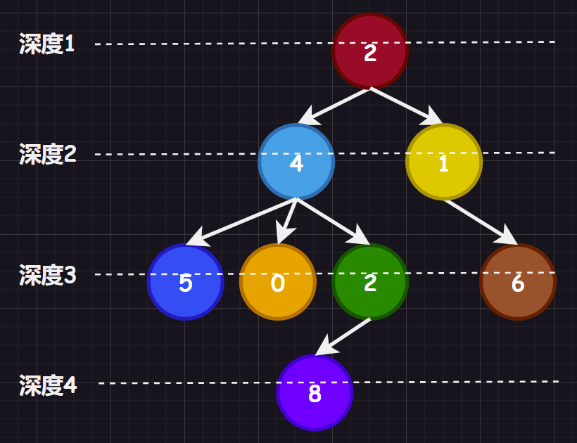
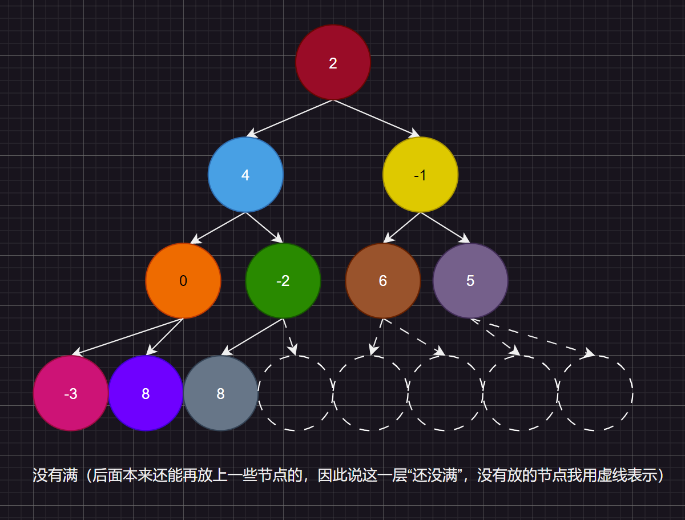
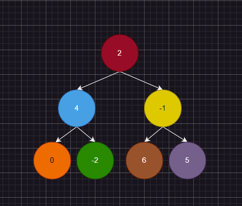
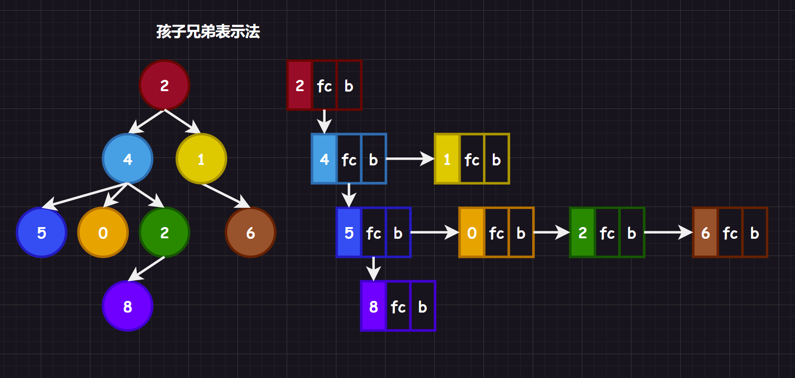
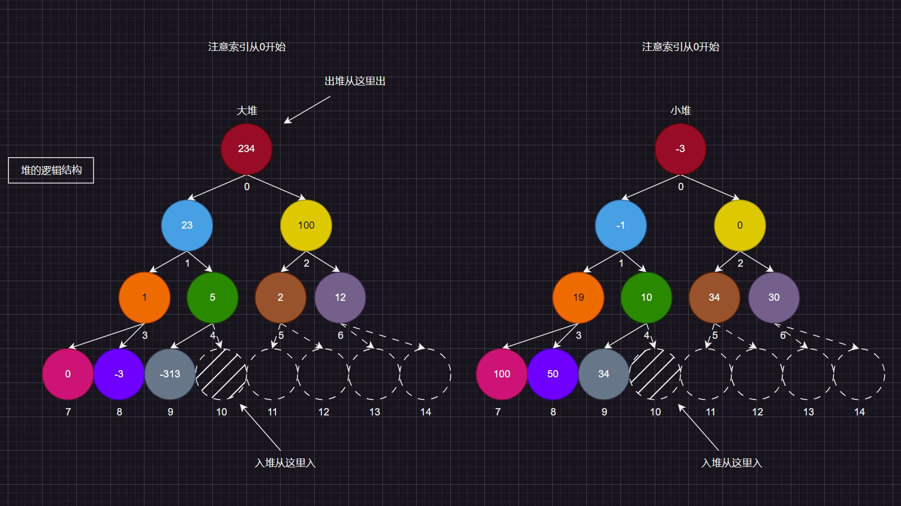

树的结构我们使用最为广泛的还是二叉树，因此我会提及树的相关概念，并且重点提及二叉树的应用。

# 1.树和二叉树

## 1.1.树的分类

### 1.1.1.一般树

树是一种非线性结构，由$n,(n>=0)$个有限节点构成一个具有层次关系的集合，看起来就像一棵倒挂的树，是一种`1`对多的关系。



*   有且仅有一个特殊的节点，称为“根节点”，根节点没有父亲节点
*   除根节点外的其余节点被分为$M,(M>0)$个互不相交的集合$T_1、T_2、…T_m$，其中每一个集合$T_i,(1<=i<=m)$又是一棵树结构，每个子树的根节点有且只有一个前驱，可以有`0`或多个后继
*   如果一个结点都没有（包括根结点），就称该树为“空树”。

很明显，树是递归定义的的数据结构。

>   补充：根据前面的知识，我们可以来了解一些树的相关术语
>
>   *   **度**：一个节点含有的子树的“个数”称为该节点的“度”，而所有结点的度作为一个整数序列，在序列中取得的最大值就是整颗树的度
>   *   **根节点**：根节点没有前驱节点，一棵树有且只有一个根节点
>   *   **叶子节点/终端节点**：叶子节点没有后驱节点，其“度”为零，一棵树最少也有一个叶节点
>   *   **分支节点/非终端节点**：“度”不为零的节点都叫分支节点
>   *   **树的层次**：从根开始定义起，根为第一层，根的子节点为第二层（最好不要从第零层开始定义，因为如果一棵树只有一个根结点，层数为零，那么怎么表示空树呢？负一么？有些奇怪，还是使用前一种定义吧）…
>   *   **树的高度/深度**：树中节点最大层次数即树的深度
>   *   **节点之间的亲缘关系**
>       *   **父亲节点/双亲节点**：若一个节点含有子节点，则这个节点时其子节点的父亲节点
>       *   **兄弟节点**：具有相同父亲节点的子节点互称为兄弟节点
>       *   **孩子节点**：一个节点若含有子树的根节点，该子结点称为节点的孩子节点
>       *   **堂兄弟节点**：各自的父结点在同一层的节点互为堂兄弟结点
>       *   **节点的祖先**：从根节点到该节点所经分支上的所有节点，除了它本身都是他的祖先（其中根节点时所有非根节点的祖先）。
>       *   **子孙**：以某节点为根的子树中任一节点都称为该节点上的子孙
>   *   **森林**：由$m,(m>0)$棵互不相交的多棵树的集合被称为森林（在比较复杂的数据结构中，使用并查集就会用到这一概念，我们以后再提及）
>   *   **有序树和无序树**：如果对于子树没有顺序要求就是无序树，如果有就是有序树，下面要提及的二叉树就是有序树，有左右子树的概念。对于有序树，哪怕是左右子树互换顺序都是不同的树

### 1.1.2.二叉树

有的时候我们不需要子树很多的树，因此就有了二叉树。二叉树的每一个结点的度最大为`2`，由一个根节点加上左右子树构成（也是递归定义）。

#### 1.1.2.1.完全二叉树

假设有一棵二叉树，高度为`h`，则前`h-1`层都是满的，最后一层是不满的，但呈现连续的状态，我们称这棵二叉树为完全二叉树。



#### 1.1.2.2.满二叉树

满二叉树就是二叉树的每一层都是满的（每一层都塞满了节点），可以认为满二叉树是特殊的完全二叉树。



## 1.2.树的存储

### 1.2.1.一般树的存储

#### 1.2.1.1.暴力存储

```cpp
typedef struct TreeNode
{
	int data;//存储节点的数据
	struct TreeNode* child_1;//存储节点指向的子孩子1
	struct TreeNode* child_2;//存储节点指向的子孩子2
	struct TreeNode* child_3;//存储节点指向的子孩子3
	//…
} TreeNode;
```

理论上来说，如果明确树的最大度，的确可以暴力穷举，但是对于有新数据插入的树这个方法就有些差劲了，因为谁也不知道到底最终会插入多少个子节点，更加不知道度的最大值是否会产生变化。

#### 1.2.1.2.亲缘关系存储

下面“某某”表示法就是一个结点里存储了“某某”。

##### 1.2.1.2.1.双亲表示法


```cpp
typedef struct TreeNode
{
	int data;//存储节点的数据
	int parenti;
} TreeNode;
//然后创建一个数据元素是TreeNode的结构体数组
```

以双亲为重点，使用数组依次存储树中各个节点，每个节点只存储数据和指向双亲节点的指针或下标，只不过这个方法用的比较少。

##### 1.2.1.2.2.孩子表示法


```cpp
typedef struct TreeNode 
{ 
  	int data;//存储节点的数据 
  	ListNode* childArr;//或者使用顺序表SeqList childArr; 
} TreeNode;
```

使用数组依次存储树中各个节点。节点不止存储数据，还分别配备了一个链表/顺序表，用于存储各节点的孩子节点位于顺序表中的位置。

##### 1.2.1.2.3.孩子兄弟表示法



每一个节点除了存储自己携带的数据，还携带了指向兄弟节点的指针，以及指向第一个孩子节点的指针。这个结构很优秀，无论度有多大都可以存储起来，并且可以将多叉树转化为一种类二叉树的存在，这在后面树的转化中有所提及。

### 1.2.2.二叉树的存储

#### 1.2.2.1.顺序存储

使用数组来存储二叉树的层序遍历（也就是每一层每一层逐结点存储进数组），一般能使用数组的只适合表示完全二叉树，如果不是完全二叉树会有空间上的浪费。使用数组存储这一点在实际应用中一般只有堆会这么使用，这一点我们后面讲解堆的时候再来细细研究。

#### 1.2.2.2.链式存储

最常用的就是二叉链和三叉链，在以后关于平衡搜索树中（`AVL`树和`RB`树）会大量使用这种结构，并且刷题的时候大多都是二叉链的实现。我们所讨论的二叉树大部分是二叉链结构，在`C++`高阶部分，我会在`AVL`树和`RB`树中使用三叉链结构（除了左右孩子指针还有父指针）。

```cpp
//二叉链
struct Tree
{
	struct Tree* _leftChild;
  	struct Tree* _rihtChlid;
  	TreeType _data;
};
```

```cpp
//三叉链
struct Tree
{
	struct Tree* _leftChild;
  	struct Tree* _rihtChlid;
  	struct Tree* _parent;
  	TreeType _data;
};
```

## 1.3.树的性质

### 1.3.1.一般树的性质

### 1.3.2.普通二叉树的性质

#### 1.3.2.1.性质一：深度K与节点数N的关系

把一棵二叉树的$N$个节点想象成两个极端：完全二叉树（最小高度）和斜树（最大高度），因此$K$的范围就是$[⌊log_2(N)⌋ + 1, N]$这个全闭区间（其中$⌊x⌋$表示取不大于$x$的最大整数，去小数）

#### 1.3.2.2.性质二：层阶i的max节点数N

若规定根节点的层数为$1$，则一颗非空二叉树的第$k$层最多拥有节点数$N$为$2^{(k - 1)}$

#### 1.3.2.3.性质三：深度K的max节点数N

若规定根节点的层数为$1$，则深度为$K$的二叉树的最大节点数$N$为$(2^K) - 1$

#### 1.3.2.4.性质四：不同度结点的关系

对任何一棵非空二叉树，如果度为$0$的分支节点个数为$n_0$，度为$2$的分支节点个数为$n_2$，则有关系式$n_0 = n_2 + 1$。

>   证明：假设有$n$个节点，其中度为$0$的节点有$n_0$个、度为$1$的节点有$n_1$个、度为$2$的节点有$n_2$个，那么$①n_0 + n_1 + n_2 = n$
>
>   假设所有的祖先节点和其拥有的所有子节点都有连线：
>
>   -   则向上看，除了根节点，每一个节点拥有一根连线，那么总共有$n - 1$条连线。
>   -   则向下看，而由于度为$0$的节点向下引出$0$根线，度为$1$的节点向下引出$1$根线，度为$2$的节点向下引出$2$根线。则$n - 1 = 2 \cdot n2 + 1 \cdot n1 + 0 \cdot n0$，即$②n - 1 == 2 \cdot n2 + n1$
>
>   结合$①$和$②$得出$n0 == n2 + 1$这一性质。

### 1.3.3.完全二叉树的性质

#### 1.3.3.1.性质一：深度K与节点数N的关系

对于完全二叉树，假设其具有$N$个节点，则其深度$K$为$⌊log_2(N)⌋ + 1$（$⌊x⌋$表示取不大于$x$的最大整数）

#### 1.3.3.2.性质二：节点与子节点的关系

对一颗有$n$个节点的完全二叉树，对每个节点进行编号（从1开始，从左到右，从上到下）对任意节点$i$都有：

*   若$i=1$，则节点$i$是根，没有双亲节点
*   若$i > 1$，则节点$i$的双亲节点是$⌊i/2⌋$
*   若$2 \cdot i>n$，则节点$i$没有左孩子，否则左孩子为$2 \cdot i$
*   若$2 \cdot i + 1 > n$，则节点$i$没有右孩子，否则左孩子为$2 \cdot i + 1$

### 1.3.4.满二叉树的性质

若规定根节点的层数为$1$，具有$N$个节点的满二叉树的深度$K$为$log_2(N + 1)$

## 1.4.树的遍历

本系列文章提到树的遍历，一般特指对二叉树的遍历。

### 1.4.1.根序遍历（深度优先遍历）

简单来说，就是根据根的访问时机来遍历一颗树，可以分为：

-   前序遍历：先遍历根，然后遍历左子树，最后遍历右子树
-   中序遍历：先遍历左子树，然后遍历根，最后遍历右子树
-   后序遍历：先遍历左子树，然后遍历右子树，最后遍历根

#### 1.4.1.1.递归实现

由于树是递归定义的，因此使用递归函数实现根序遍历十分快捷。

```cpp
typedef char type;
typedef struct TreeNode
{
	type _data;
	struct TreeNode* _left;
	struct TreeNode* _right;
} TreeNode;

//前序函数
void Prev_Order(TreeNode* root)
{
	if (root == NULL)
	{
		return;
	}
	printf("%c ", root->_data);
	Prev_Order(root->_left);
	Prev_Order(root->_right);
}
//中序函数
void In_Order(TreeNode* root)
{
	if (root == NULL)
	{
		return;
	}
	In_Order(root->_left);
	printf("%c ", root->_data);
	In_Order(root->_right);
}
//后序函数
void Post_Order(TreeNode* root)
{
	if (root == NULL)
	{
		return;
	}
	Post_Order(root->_left);
	Post_Order(root->_right);
	printf("%c ", root->_data);
}
```

#### 1.4.1.2.非递归实现

在有些实现中非递归实现的根序遍历会借助其他的数据结构。


>   补充：有很多根据两个根序遍历推演一颗二叉树的考题

### 1.4.2.层序遍历（广度优先遍历）

从树的每一层左边开始，从左到右遍历树的每一个结点，直到遍历到树的最深处。

#### 1.4.2.1.递归实现


#### 1.4.2.2.非递归实现


## 1.5.树的应用

树的应用最经典的地方是在文件系统上，可以叫系统里的所有文件目录为一颗“目录树”。而二叉树最主要的目的不是为了存储数据，而是为了优化搜索，比如：搜索二叉树。

而在搜索二叉树里，任何一棵树，左子树都比根要小，右子树都比根要大，这个特性特别适合搜索，最多查找它的高度$K$次，时间复杂度最好情况下可以达到$O(N)$，而左右平衡节点个数还能影响搜索效率，这就涉及到更为复杂的平衡树：`AVL`树、`RB`树、`B`树。

但是这些有关搜索的内容我们暂时还没法接触，当下更重要的是理解堆数据结构的构建。

## 1.6.树的转化

### 1.6.1.普通树转为二叉树

## 1.6.2.二叉树转为普通树

# 2.二叉堆

## 2.1.堆概念

这里提到的堆是一种数据结构，而不是操作系统里的堆空间，这两者没有半毛钱关系。

堆的表现形式是一棵完全二叉树，不过这棵完全二叉树的要求是：“任何一个父节点都大于或等于子节点”或者“任何一个父节点都小于或等于子节点”，因此堆也被分为“大堆”或“小堆”。



## 2.2.堆接口

```cpp
//堆的实现（以下是大堆结构）
typedef int HPDataType;
typedef struct Heap
{
    HPDataType* _a;
    int _size;
    int _capacity;
} Heap;
//1.堆的初始化
void HeapInit(Heap* hp);
//2.堆的销毁
void HeapDestory(Heap* hp);
//3.堆的判空
bool HeapEmpty(Heap* hp);
//4.堆的插入
void AdjustUp(HPDataType* arr, int childi);
void HeapPush(Heap* hp, HPDataType x);
//5.堆的删除
void AdjustDown(HPDataType* arr, int arrsize, int parenti);
void HeapPop(Heap* hp);
//6.取堆顶的数据
HPDataType HeapTop(Heap* hp);
//7.堆的数据个数
int HeapSize(Heap* hp);
```

## 2.3.堆细节

### 2.3.1.存储结构

堆的实现可以采用逻辑结构为“完全二叉树”、物理结构为“数组”的方式来实现。

### 2.3.1.入堆（向上调整算法）

将要入堆的元素放在堆的最后一个位置（即数组的最后一个位置），将其与其父节点进行比较，使用向“上调整算法”来调整节点位置，直到满足堆的特性为止。

### 2.3.2.出堆（向下调整算法）

将堆的最后一个节点和堆顶节点互换，然后将原来的堆顶节点隔离（也就是说不再将其视为堆的节点）。将此时新的堆顶节点与其子节点进行比较，使用向下调整算法调整节点位置，直到满足堆的特性为止。

可以看到，关于堆的实现，最为重要的是向上调整算法和向下调整算法的实现，那么这两个算法是怎么操作的呢？

## 2.4.堆实现


## 2.5.堆测试


## 2.6.堆应用


# 3.线索树

## 3.1.线索树概念

遍历实际上是对树的一种线性化，最终可以得到一个线性序列存储起来。

但是如果直接考虑树的二叉存储结构中得到线性序列则有些困难，二叉存储结构下，只能找到一个结点的左右结点，而没有办法找到该节点的前驱和后继结点。

线索树是线索化的二叉树，将没每个结点中没有利用到的空指针域利用起来，作为前驱和后继的依据。

因此一般线索树的结构为：

```cpp
typedef int ElementType;
typedef struct ThreadTreeNode
{
    struct ThreadTreeNode* _lChild;
    char _lTag;
    struct ThreadTreeNode* _rChild;
    char _rTag;
    ElementType _data;
} ThreadTreeNode;
```

## 3.2.线索树接口

## 2.3.线索树细节

## 2.4.线索树实现

## 2.5.线索树测试

## 2.6.线索树应用

# 4.哈夫曼树

## 4.1.哈夫曼树概念

## 4.2.哈夫曼树接口

## 4.3.哈夫曼树细节

## 4.4.哈夫曼树实现

## 4.5.哈夫曼树测试

## 4.6.哈夫曼树应用

# 5.二叉搜索树

如果规定左子树元素小于根节点，根结点小于右子树元素，即可得到一颗搜索二叉树，普通的二叉搜索树没有太大的价值，但是经过调整的`AVL`树和`RB`树有极大的价值。

这些内容我在这里也只是简单提及，在`C++`的高阶内容我还会提及。

# 6.实践

## 6.1.根据根序遍历构建二叉树

## 6.2.复制二叉树

## 6.3.计算二叉树的深度

## 6.4.统计二叉树结点的个数

## 6.5.哈夫曼编码

## 6.6.逆波兰表达式
