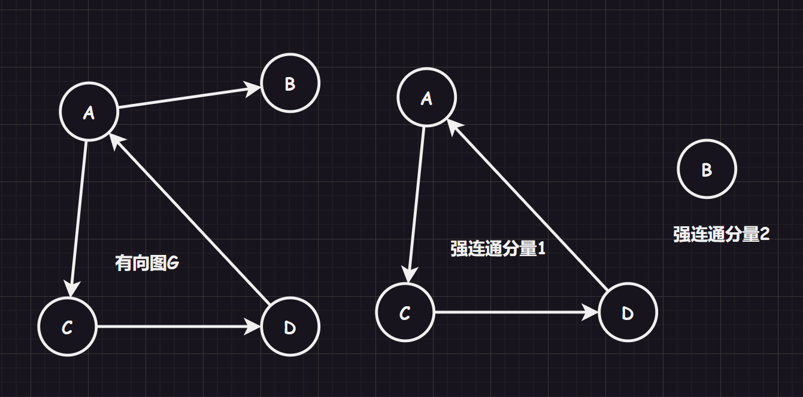

# 1.图基础

## 1.1.图的定义

图 $G$ 由两个集合 $V$ 和 $E$ 构成，记为 $G = (V, E)$，其中：

1.   $V(G)$ 为顶点的有穷非空集合
2.   $E(G)$ 为 $V$ 中顶点偶对（边/弧长）的有穷集合

若其中，$E(G)$ 是无方向的边则 $G$ 为无向图，$E(G)$ 是有方向的弧长则 $G$ 为有向图。


## 1.2.图的术语

-   **顶点、边**：一般使用 `n` 表示顶点个数，用 `e` 表示边的数目

-   **子图**：如果对于两个集合$G = (V, E)$和$G' = (V', E')$，如果有$V' \subseteq V, E' \subseteq E$，则称$G$为$G'$的子图

-   **完全图**：无向图若具有$n(n - 1)/2$条边就称为“无向完全图”，有向图若具有$n(n-1)$则称为“有向完全图”。实际上，就是所有点都要链接起来

-   **稀疏图和稠密图**：这个是相对的概念，有很少的链接就称为“稀疏图”，有很多的链接的称为“稠密图”

-   **权和网**：每一条链接都可以带上具有某种意义的数值，称为“权”，具有权的图也被称为“网”

-   **顶点对**：无向图的边可以根据两个点表示为顶点对$(v, v') \in E$，有向图的边可以根据两个点表示为顶点对$<v, v'> \in E$

-   **邻接点**：对于两个点$V$和$V’$，若有$(v, v') \in E$或者$<v, v'> \in E$，则两点称为“邻接点”。另外，也称链接（边/弧）依附两个顶点，或者说链接（边/弧）和两个顶点相关联

-   **度**：对于顶点$V$有多少条相关联的边的数目，记着$TD(v)$，其中在有向图中还将一个顶点的度分为入度$ID(v)$和出度$OD(v)$。一般的，如果有$n$个顶点，$e$条边的图，满足关系$e = \frac{1}{2} \displaystyle\sum_{i = 1}^{n}TD(v_i)$

-   **路径和路径长度**：路劲是指一个顶点$v$到达另外一个顶点$v'$之间的顶点序列$V = \{v = v_{i}, v_{i+1}, v_{i+2}, ..., v_{i+n} = v' \}$，而路径长度就是一条路径上经过的边或者弧的数目，也就是$V.size() - 1$，如果顶点序列没有出现重复的元素，就是一个简单路径

-   **环**：第一个顶点和最后一个顶点相同的路径就是回路/环，如果路径（顶点序列）中没有出现重复的元素（除了第一个和最后一个顶点可以重复），就是一个简单回路/环

-   **连通/强连通**：如果图中一个顶点到另外一个顶点之间的路径（顶点序列）存在（无向图就是有链接，有向图就是两个方向都有），则称两顶点之间“连通/强连通”

-   **连通图、联通分量**：而如果对一个无向图来说，任意两个顶点都是连通的，则称为“连通图”。而如果一个图不是连通图，那么可以尽可能找到图中连通的子图，该子图被称为“图的连通分量”

    

-   **强连通图、强连通分量**：而如果对一个有向图来说，任意两个顶点都是连通的，则称为“强连通图”。而如果一个图不是强连通图，那么可以尽可能找到图中强连通的子图，该子图被称为“图的强连通分量”

    

-   **连通图的生成树**：对于有$n$个结点的连通图$G$，其连通分量$g$若包含连通图$G$中所有的节点，并且拥有$n - 1$条边，则该连通分量也被称为“生成树”，并且如果添加了一个边，就必点构成一个回环

    >   补充：根据图的顶点个数和边个数可以反向得到一些结论
    >
    >   1.   若一个图有 $n$ 个顶点和小于 $n - 1$ 条边，则为非连通图
    >   2.   若一个图有 $n$ 个顶点和大于 $n - 1$ 条边，则图中存在环
    >   3.   若一个图有 $n$ 个顶点和等于 $n - 1$ 条边，则不一定为生成树

-   **强连通图的有向树**：有向图中有一个顶点的入度为$0$，其余顶点的入度均为$1$，则该有向图被称为“有向树”

# 2.图接口

```cpp

```

# 3.图细节

## 3.1.存储结构

### 3.1.1.邻接矩阵（adjacent matrix）

```cpp
#include <vector>
using namespace std;

template <typename VertexType>
class AMGraph
{
private:
	vector<VertexType> vexs;	//顶点表
	vector<vector<int>> arcs;	//邻接矩阵
	int vexNum;		//图当前的顶点数
	int arcNum;		//图当前的边数
};
```

#### 3.1.1.1.无向图

对于无向图，我们可以使用一个字符数组存储顶点数据，使用一个二维数组来存储两个结点之间的关系，用 `1` 表示两顶点有边，`0` 表示两顶点无边。


1.   无向图的邻接矩阵是对称的，且主对角线元素全为 `0`（因为顶点和自己没有边）
2.   顶点 `i` 的度 = 第 `i` 行(列)中 `1` 的个数
3.   完全图的邻接矩阵中，主对角元素为 `0`，其余全为 `1`

#### 3.1.1.2.有向图

有向图也是类似的实现，就是可能需要人为规定方向的规则，本系列文章的实现中认为：第 `i` 行和为一个顶点的出度，第 `j` 列和为一个顶点的入度。 


#### 3.1.1.3.网

我们可以在 `int` 的二维数组存储权值，来构成网，而没有权值的边或弧一般使用`int`的最大值`INT_MAX`来代表（或者记作$∞$）。


>   解析：邻接表的优缺点
>
>   邻接表的优点：
>
>   1.   快速判断两个顶点是否有边或弧，时间复杂度为$O(1)$
>   2.   快速得出每个顶点的度，时间复杂度为$O(n)$
>
>   邻接表的缺点：
>
>   1.   增加和删除顶点困难，移动复制或扩容代价很大、步骤繁琐
>   2.   占用空间大，对于稀疏图来说消耗大，时间复杂度为$O(n^{2})$
>   3.   统计边的数目需要遍历二维数组才可得知，时间复杂度为$O(n^{2})$

### 3.1.2.邻接表（adjacency list）


### 3.1.3.十字链表（across linker）


### 3.1.4.邻接多重表（adjacency multilist）


## 3.2.图的遍历

### 3.2.1.深度优先遍历

连通图的深度优先遍历（`DFS`）是树的先序遍历的推广：

1.   从起始顶点开始访问，一直访问起始顶点的未被访问的邻接点
2.   邻接点被访问后，成为新的起始顶点，跳转步骤 `1`，直到遇到一个顶点的所有邻接点都被访问过的时候停下
3.   开始进行回溯，返回前面被访问过，但是其还有邻接点没有被访问的顶点，跳转步骤 `1`
4.   最后图中所有的顶点都被访问过，搜索结束，得到深度搜索序列和深度优先生成树


### 3.2.2.广度优先遍历

连通图的深度优先遍历（`DFS`）是树的层序遍历的推广：

1.   从起始顶点开始访问，一直访问起始顶点的未被访问的所有邻接点
2.   所有邻接点被访问后，依顺序，每一个邻接点成为一个又一个新的起始顶点，跳转步骤 `1`，直到遇到一个顶点的所有邻接点都被访问过的时候停下
3.   最后图中所有的顶点都被访问过，搜索结束，得到广度搜索序列和广度优先生成树


# 4.图实现

```cpp
```

# 5.实践

## 3.3.最小生成树


## 3.4.最短路径


## 3.5.拓扑排序


## 3.6.关键路径
