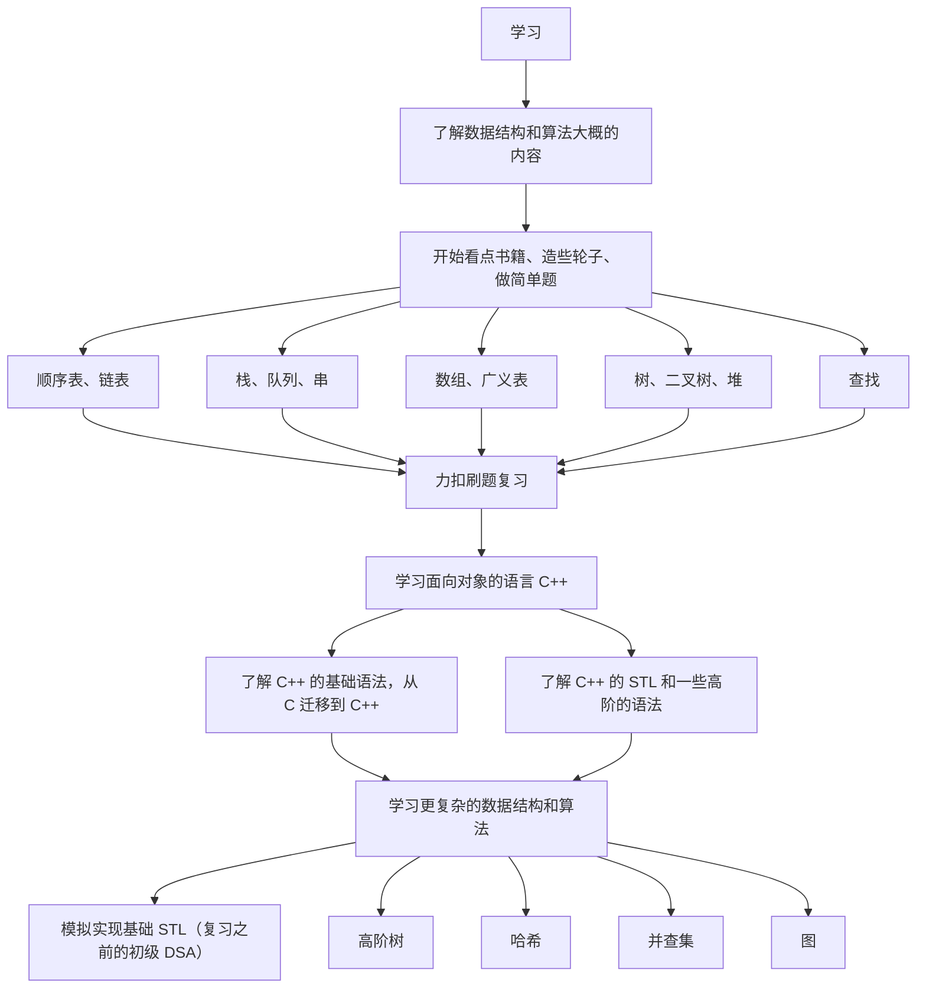

# 1.意义

编程语言只是让我们学会了“写字”，而真正组织代码需要一些写作框架（数据结构），还需要我们学习优秀的修辞手法（算法），只有踏过数据结构和算法（下文都简称为 `DSA`）这一“拐点”，才有精进一步的可能。

# 2.资源

## 2.1.书籍

这里推荐一些书籍供您查阅，需要注意的是，有些书籍并不适合您仔细阅读，而需要您作为科普类书籍查看即可。

### 2.1.1.入门

上面这两本书个人觉得作为入门科普书籍还是不错的，图文并茂：

1.   《小黑的漫画算法》
2.   《大话数据结构》

前一本我只看过一半，没看下去的原因是我看的是电子版本，有部分缺失内容，并且太简略了。后一本我完整看过一遍，稍微详细了一些，但是书内的代码一言难尽（看不懂代码不要硬看，因为书内的代码比较一般，学习起来很费劲）。

这两本书您简单作为科普书看一看即可，只需要摸索一下大概的框架，心里有底就行，不必过于较真。

此外还有这个网站的思维导图值得一看，让您更清楚您要学习的内容：[DSA 学习大纲](https://www.bitejiuyeke.com/path?key=dsh)。

### 2.1.2.初学

上面的书籍还是太过于

1.   《[数据结构（C 语言版）](https://book.douban.com/subject/24699581/)》
2.   《[算法（第 4 版）](https://book.douban.com/subject/19952400/)》
3.   《剑指 offer》

国内的很多大学教材都会先从数学化的定义和抽象的描述来写 DSA 的教程，这种教程对于初学者来说，很容易会出现知其意不知其所然的情况（经典的我懂但是写不出代码）。

有了上述的理论知识，就可以开始深入“造轮子”了，注意不是看完再“造”，而是边看边“造”。

### 2.1.3.深入

这个阶段赶紧去学习面向对象的语言！入门阶段过去了就需要开始过渡一些比较高级的 DSA 了，这些纯 `C` 实现起来颇为复杂和“恶心”，容易消化不良。

`C++` 或 `Java` 都可以，不过本系列文章主要还是面向 `C++` 学习者的，还是推荐您使用 `C++` 来学习本系列的文章。

等学习完 `C++` 的基础语法后，再开始看我的高级 `DSA`。

如果您看过我的文章结构，就可以发现：我将 `C` 语言学习和初阶 `DSA` 混合在一起，并且将 `C++` 语法学习和高级 `DSA` 混杂在一起，我认为这样学习起来会比较连贯一些，您顺序看下去就行。

还要推荐几本书，属于比较晦涩的书：

1.   《STL 源码剖析》
1.   《算法（第 4 版）》

## 2.2.网站

### 2.2.1.刷题网站

1.   [力扣（国外版）](https://leetcode.com/)
2.   [力扣（国内版）](https://leetcode.cn/)

### 2.2.2.可视化网站

1.   [Data Structure Visualizations](https://www.cs.usfca.edu/~galles/visualization/Algorithms.html)
2.   [visualgo](https://blog.csdn.net/weixin_42208959/article/details/108065466)
3.   [BinaryTreeVisualiser](http://btv.melezinek.cz/home.html)
4.   [btree-js](https://yangez.github.io/btree-js/)
5.   [Algorithm Visualizer](https://algorithm-visualizer.org/backtracking/hamiltonean-cycles)
6.   [bigocheatsheet]()

## 2.3.课程

暂时还没有，等待补充...

# 3.规划

