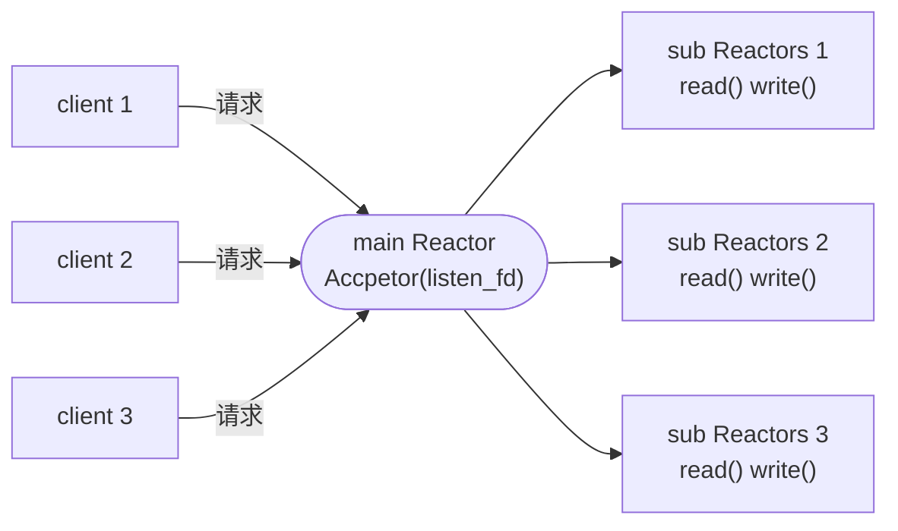

# 1.网络的基本概念


# 2.网络的第三方库

## 2.1.cpp-httplib

`cpp-httplib`（也称为 `httplib`）是一个基于 `C++` 的轻量级 `HTTP` 框架，它提供了简单易用的 `API`，用于创建 `HTTP` 服务器和客户端。本身简单易用，适用于快速搭建简单的 `HTTP` 服务器和客户端，因此本身可能不支持复杂的功能。

`httplib` 的安装也很简单，直接克隆库中的 `httplib.h` 到项目中即可（https://github.com/yhirose/cpp-httplib）。接口有点多，我先写出常用的接口声明和类声明（另外，该编译该库最好使用 `g++7.3`）。

### 2.1.1.协议接口

首先 `http` 报文内会包含：

-   首部：请求方法（`GET、POST`）、`URL(<protocol>://<username>:<password>@<host>:<port>/<path>?<params>#<fragment>)`、协议版本
-   报头：`key-value\r\n` 对
-   空行：`\r\n`
-   正文：请求的数据或者返回的数据

而 `http` 报文还会分为请求报文和响应报文，因此在 `httplib` 中存在以下两个类（只是作为归纳的两个简化的类，实际声明可能有很大的不同）。

```cpp
//Request 类
struct MultipartFormDataMap
{
    std::string name; //表单字段的名称, 用于标识表单数据
    std::string content; //文件内容
    std::string filename; //文件名称
    std::string content_type; //文件类型
};

struct Request
{
    //(1)请求行
    std::string method; //请求方法
    std::string path; //资源路径（不是所有的 URL, 通常是域名之后, 查询字符之前）
    Params params; //查询字符串
    std::string version; //协议版本
    
    //(2)请求头部
    Headers headers; //头部

    //(3)请求正文
    std::string body; //正文
    MultipartFormDataMap files; //保存客户端上传的文件信息
    Ranges ranges; //指定要获取资源范围, 会根据 Range 字段指定的范围来返回相应的资源内容, 一旦中断后重连, 就会从中断的位置继续下载文件, 而不需要重新下载整个文件
    
    bool has_header(const char *key) const;
   	//检查请求头部是否包含指定键名的头部字段, 参数 key 是要检查的头部字段的键名
    //如果请求头部中包含指定键名的头部字段, 则返回 true 否则返回 false
    
    std::string get_header_value(const char *key, size_t id = 0) const;
    //获取请求头部中指定键名的报头字段的值, 参数 key 是要获取的字段键名, 参数 id 是可选的
    //若头部字段有多个同名键名, 则可通过 id 来指定获取其中一个
    //如果请求头部中存在指定键名的头部字段, 则返回该字段的值, 否则返回空字符串
    
    void set_header(const char *key, const char *val);
    //用于设置请求头部中的一个新的头部字段或更新已存在的头部字段
    
    bool has_file(const char *key) const;
    //用于检查请求中是否包含指定键名的文件字段(表单 name)
    
    MultipartFormData get_file_value(const char *key) const;
    //用于获取请求中指定键名的文件字段的值(表单 name)
};
```

```cpp
//Response 类
struct Response
{
    //(1)状态行
    std::string version;    //协议版本
    int status = -1;        //状态码
    std::string reason;     //状态描述
    
    //(2)响应头部
    Headers headers;        //响应头部
    
    //(3)响应正文
    std::string body;       //响应体
    std::string location;   //重定向地址

    //设置响应头部
    void set_header(const char *key, const char *val);

    //设置响应正文
    void set_content(const std::string &s, const char *content_type);
};
```

### 2.1.2.双端接口

```cpp
//Server 类
class Server
{
public:
	//1.路由方法设置
    //请求路由：Handler 是函数类型, 无返回值, 传入请求, 带出响应
    using Handler = std::function<void(const Request&, Response&)>;
    //请求路由数组：众多 Handler 类型函数的列表 std::regex 是正则表达式, 用于填充和路由方法匹配 http 请求资源路径(实际上就是请求中的 path), 以后就可以根据用户端请求的路由选择对应的路由函数进行请求处理(若没有对端就会收到 404)
    using Handlers = std::vector<std::pair<std::regex, Handler>>;
    
    //(2)线程池设置
    //线程池成员, 其工作就是接受请求, 解析请求, 在映射表中查看是否有可以执行方法, 每接到链接请求, 就会把新的客户端连接抛入线程池中,
    std::function<TaskQueue* (void)> new_task_queue;

    //(3)请求方法设置, 通过下面接口, 针对不同的请求, 把路由方法添加到 Handlers 中
    //注册处理 GET 请求的处理程序
    Server &Get(const std::string &pattern, Handler handler);
    //注册处理 POST 请求的处理程序
    Server &Post(const std::string &pattern, Handler handler);
    //注册处理 PUT 请求的处理程序
    Server &Put(const std::string &pattern, Handler handler);
    //注册处理 PATCH 请求的处理程序
    Server &Patch(const std::string &pattern, Handler handler);
    //注册处理 DELETE 请求的处理程序
    Server &Delete(const std::string &pattern, Handler handler);
    //注册处理 OPTIONS 请求的处理程序
    Server &Options(const std::string &pattern, Handler handler);

    //4.启动 HTTP 服务器
    bool listen(const char* host, int port, int socket_flags = 0);
};
```

```cpp
//Client 类
class Client
{
public:
    //传入对端服务器的 ip 和 port
    Client(const std::string &host, int port);

    //发送 GET 请求到指定路径, 可附带头部信息, 并返回结果
    Result Get(const char *path, const Headers &headers);

    //发送 POST 请求到指定路径, 包含纯文本主体、内容长度、内容类型
    Result Post(const char *path, const char *body, size_t content_length, const char *content_type);

    //发送 POST 请求到指定路径，包含多部分表单数据项
    Result Post(const char *path, const MultipartFormDataItems &items); //最后一个参数是一个文件数组
};
```

### 2.1.3.实际使用

接下来我们尝试使用一下上述的接口。

先写一个自动化脚本，方便多次代码编译。

```makefile
# makefile

all: clean http_server http_client

maker: http_server http_client

http_server: http_server.cpp
	g++ -o $@ $^ -std=c++11 -lpthread -O3

http_client: http_client.cpp
	g++ -o $@ $^ -std=c++11 -lpthread -O3 

.PHONT: clean
clean:
	rm http_server http_client
```

然后编写服务端代码，支持两个接口。

```cpp
//http_server.cpp
#include <iostream>
#include <string>
#include <cstdlib>
#include "../cpp-httplib/httplib.h"

int main(int argc, char const* argv[]) {
    using namespace httplib;
    Server svr;

    svr.Get(R"(/my_get)", [](const Request& req, Response& res) {
            std::cout << "a get request." << std::endl;
            res.set_content("hello world!", "text/plain");
            res.status = 200;
        }
    );

    svr.Post(R"(/my_post)", [](const Request& req, Response& res) {
            std::cout << "a post request." << std::endl;
            auto ret = req.has_file("file");
            if (!ret) 
            {
                std::cout << "not file upload.\n";
                res.status = 404;
                return;
            }
                
            const auto& file = req.get_file_value("file");
            std::cout
                << file.filename << std::endl
                << file.content_type << std::endl
                << file.content << std::endl;
        
            std::string message = "The file is ";
            message += file.filename;
            message += "-";
            message += file.content_type;
            message += "\n";
            message += file.content;
            
            res.set_content(message.c_str(), "text/plain");
            res.status = 200;
        }
    );

    svr.listen("0.0.0.0", atoi(argv[1]));
    
    return 0;
}
```

`make maker` 编译成功后，直接运行 `./http_server 选定的端口号`。

而客户端我们不着急编写，我们直接使用浏览器测试一下 `GET` 接口。


观察服务端代码的输出结果。

```bash
# 运行结果
$ ./http_server 选定的端口号
a get request.
```

然后再测试 `POST` 接口，看看是否可以上传文件。

```html
<!-- test.html -->

<!DOCTYPE html>
<html lang="en">
<head>
    <meta charset="UTF-8">
    <meta name="viewport" content="width=device-width, initial-scale=1.0">
    <title>File Upload</title>
</head>
<body>
    <form action="http://这里填您的服务器公网ip/这里填您给服务端代码绑定的port" method="post" enctype="multipart/form-data">
        <input type="file" name="file" id="file">
        <input type="submit" value="提交文件">
    </form>
</body>
</html>
```

页面渲染如下，选择任意一个文件进行提交。


```bash
# 运行结果
$ ./http_server 选定的端口号
a get request. # 这一句是之前运行的
a post request.
test.html
text/html
<!DOCTYPE html>
<html lang="en">
<head>
    <meta charset="UTF-8">
    <meta name="viewport" content="width=device-width, initial-scale=1.0">
    <title>File Upload</title>
</head>
<body>
    <h2>File Upload</h2>
    <form action="http://这里填您的服务器公网ip/这里填您给服务端代码绑定的port" enctype="multipart/form-data">
        <input type="file" name="file" id="file">
        <input type="submit" value="Upload">
    </form>
</body>
</html>
```

到这里，您基本就会初步使用这个库了。

当然，如果写得完整一些则如下：

```cpp
//较完整的 http_client.cpp
#include <iostream>
#include <string>
#include <cstdlib>
#include "../cpp-httplib/httplib.h"

int main(int argc, char const* argv[]) {
    using namespace httplib;
    Server svr;

    svr.Get(R"(/my_get)", [](const Request& req, Response& res) {
            std::cout << "a get request." << std::endl;
            res.set_content("hello world!", "text/plain");
            res.status = 200;
        }
    );

    svr.Post(R"(/my_post)", [](const Request& req, Response& res) {
            std::cout << "a post request." << std::endl;
            auto ret = req.has_file("file");
            if (!ret) 
            {
                std::cout << "not file upload.\n";
                res.status = 404;
                return;
            }
                
            const auto& file = req.get_file_value("file");
            std::cout
                << file.filename << std::endl
                << file.content_type << std::endl
                << file.content << std::endl;
        
            std::string message = "The file is ";
            message += file.filename;
            message += "-";
            message += file.content_type;
            message += "\n";
            message += file.content;
            
            res.set_content(message.c_str(), "text/plain");
            res.status = 200;
        }
    );

    svr.listen("0.0.0.0", atoi(argv[1]));
    
    return 0;
}
```

另外，直接使用浏览器上传文件忽略了很多上传细节，我们来自己写一个较完整的客户端试试。

```cpp
//较完整的 http_client.cpp
#include <iostream>
#include <cstdlib>
#include <fstream>
#include "../cpp-httplib/httplib.h"

int main(int argc, char const* argv[]) {
    using namespace httplib;
    Client cli(argv[1], atoi(argv[2]));

    //1.发送 GET 请求
    auto res_get = cli.Get("/my_get");
    if (res_get->status == 200) {
        std::cout << "get success" << std::endl;
        std::cout << "返回响应的状态码: " << res_get->status << std::endl;
        std::cout << "返回响应具体内容: " << res_get->body << std::endl;
    } else {
        std::cout << "get error" << std::endl;
    }

    //2.发送 POST 请求
    //读取文件内容
    std::ifstream file("example.txt", std::ios::binary);
    if (!file.is_open()) {
        std::cout << "open error" << std::endl;
        return 1;
    }

    //读取文件内容到字符串
    std::stringstream buffer;
    buffer << file.rdbuf(); //使用 rdbuf() 获取文件流的底层缓冲区, 类似 read(), 您也可以使用 read() 的
    std::string file_content = buffer.str();

    MultipartFormData item;
    item.name = "file"; //表单字段名
    item.filename = "example.txt"; //作为文件名
    item.content = file_content.c_str(); //文件内容
    item.content_type = "text/plain"; //文件格式
    MultipartFormDataItems items;
    items.push_back(item);

    //发送 POST 请求上传文件, 并且返回 res 响应
    auto res = cli.Post("/my_post", items);

    if (res && res->status == 200) { //注意 res 其实就是一个指向响应的智能指针
        std::cout << "port success" << std::endl;
        std::cout << "返回响应的状态码: " << res_get->status << std::endl;
        std::cout << "返回响应具体内容: " << res->body << std::endl;
    } else {
        std::cout << "port error" << std::endl;
    }

    return 0;
}
```

然后在客户端用的机器这边写一个 `example.txt` 文本文件，内容是 `Hello, I am limou3434`。运行两端程序后，结果如下：

```bash
# 运行结果
$ ./http_server 5000
a get request.
a post request.
example.txt
text/plain
Hello, I am limou3434

$ ./http_client 127.0.0.1 5000
get success
返回响应的状态码: 200
返回响应具体内容: hello world!
port success
返回响应的状态码: 200
返回响应具体内容: The file is example.txt-text/plain
Hello, I am limou3434
```

到这里我们会发现，所谓的上传文件实际上就是客户端读取文件内容，然后包装为请求发送给服务端，最后服务端对该文件传输做出响应而已。

## 2.2.Muduo

`Muduo` 是一个基于 `C++11` 的网络库，用于开发高性能的服务器应用程序。由陈硕开发的，旨在提供简单且高效的网络编程解决方案。`Muduo` 的设计目标是为多线程网络编程提供支持，并在多核系统上实现高并发性能。

`Muduo` 提供了以下主要特性：

1.  **“事件驱动”的“异步”编程模型**：`Muduo` 基于事件驱动的设计，使用非阻塞 `I/O` 和多线程技术，实现了高效的异步编程模型，使得服务器能够同时处理多个连接，提高了系统的并发能力和响应速度。
2.  **Reactor 模式**：`Muduo` 采用了 `主从 Reactor 模式`，通过 `epoll` 或者 `kqueue` 等系统调用来监控事件和处理事件，使得服务器能够高效地管理大量的连接。
3.  **线程池**：`Muduo` 提供了线程池来管理多线程，有效地利用多核资源，并且避免了线程频繁创建和销毁的开销。
4.  **定时器**：`Muduo` 支持定时器功能，可以方便地实现定时任务，例如心跳检测、超时处理等。
5.  **TCP 和 UDP 支持**：`Muduo` 提供了对 `TCP` 和 `UDP` 协议的支持，可以用于开发各种类型的网络应用，如 `Web` 服务器、游戏服务器、消息队列等。

>   补充：`Reactor 模式` 是一种设计模式，用于处理并发的 `I/O` 操作。它的核心思想是，将 `I/O` 事件的处理分离成两个阶段：事件的监视和事件的处理。在 `Reactor` 模式中，一个 `Reactor` 对象负责监视所有的 `I/O` 事件，并将这些事件分发给对应的处理器（也称为处理器句柄），然后处理器负责具体的事件处理。

>   补充：在前端开发中，`"Reactor"` 一词可以指代一种基于组件化的前端开发模式，即将前端页面拆分成多个独立的组件，每个组件负责特定的功能或者展示。这种模式使得前端开发更加灵活、可维护性更强，因为开发者可以独立地开发、测试和部署每个组件，而不会影响到其他部分的功能。
>
>   在这种意义下，因为 `Reactor` 模式强调了组件的独立性和可重用性，这与前端分离的理念是一致的。因此，虽然在不同的领域中，`"Reactor"` 这个词可能指代不同的概念，但是它们都强调了将系统拆分成独立的部分，并且通过组合这些部分来构建更加复杂的系统。



-   一个线程只能有一个事件循环（`EventLoop`）用来响应计时器和 `IO` 事件，也就是 `one loop per thread`
-   一个文件描述符只能由一个线程进行读写，换句话来说就是一个 `TCP` 链接必须归属某个 `EventLoop` 来管理
-   `主 Reactor` 只对新建立链接事件进行监控，不受 `IO` 影响，实现高效新建连接获取（其实就是掌控了 `listenfd`）
-   `从 Reactor` 针对新链接进行 `IO` 事件监控，进行 `IO` 操作和业务处理（也就是掌控了多个 `serverfd`）

### 2.2.1.InetAddress

```cpp
// InetAddress(地址信息类)
class InetAddress : public muduo::copyable
{
public:
    InetAddress(
        StringArg ip,		// ip
        uint16_t port,		// port
        bool ipv6 = false	// 协议版本信息
    );
};
```

创建出地址消息对象，记录了一端的地址、端口号、协议版本信息。

### 2.2.2.EventLoop

```cpp
// :EventLoop(事件循环类)
class EventLoop : noncopyable {
public:
    // 事件管理接口
    void loop(); // 启动事件循环
    void quit(); // 退出事件循环
    
    // 定时器的接口
    TimerId runAt(Timestamp time, TimerCallback cb); // 在指定的时间 time 运行回调函数 cb
    TimerId runAfter(double delay, TimerCallback cb); // 在当前时间 delay 秒后运行回调函数 cb
    TimerId runEvery(double interval, TimerCallback cb); // 每隔 interval 秒重复运行回调函数 cb
    void cancel(TimerId timerId); // 取消定时器 timerId 对应的回调函数

private:
    std::atomic<bool> quit_; // 标记事件循环是否应该退出
    std::unique_ptr<Poller> poller_; // 负责管理事件多路复用的 Poller 对象
    mutable MutexLock mutex_; // 保护 pendingFunctors_ 线程安全的互斥锁
    std::vector<Functor> pendingFunctors_ GUARDED_BY(mutex_); // 存储需要在事件循环中执行的回调函数队列
};
```

创建出循环事件对象，可以启动事件循环和停止事件循环，一个事件循环代表一个任务，内部是阻塞的。并且还有一些定时器接口，非常好用。

### 2.2.3.TcpConnection

```cpp
// TcpConnection(连接管理类)

// 定义被智能指针管理的链接对象指针类型
typedef std::shared_ptr<TcpConnection> TcpConnectionPtr;

// 定义一个用于连接管理的回调函数类型
typedef std::function<void (
    const TcpConnectionPtr& 	// TCP 连接对象指针
)> ConnectionCallback;

// 定义一个用于接受消息的回调函数类型
typedef std::function<void (
    const TcpConnectionPtr&, 	// TCP 连接对象指针
    Buffer*, 					// 发生的消息
    Timestamp					// 收到消息的时间
)> MessageCallback;

// 链接类
class TcpConnection : noncopyable, public std::enable_shared_from_this<TcpConnection> {
public:
    // 构造函数
    TcpConnection(
        EventLoop* loop,				// 事件循环对象
        const string& name,				// 链接标识名称
        int sockfd,						// 链接文件描述
        const InetAddress& localAddr,	// 本地地址
        const InetAddress& peerAddr		// 对端地址
    );
    
	// 查询连接状态
    bool connected() const { return state_ == kConnected; } // 当前是否处于连接状态
    bool disconnected() const { return state_ == kDisconnected; } // 是否处于断开连接状态

    // 关闭连接接口
    void shutdown(); // NOT thread safe, no simultaneous calling
    
    // 发送数据接口
    void send(string&& message); // c++11 接口
    void send(const void* message, int len);
    void send(const StringPiece& message);
    void send(Buffer* message); // this one will swap data
    void send(Buffer&& message); // c++11 接口

    // 连接建立时自动调用回调
    void setConnectionCallback(const ConnectionCallback& cb) { connectionCallback_ = cb; }
    
    // 收到消息时自动调用回调
    void setMessageCallback(const MessageCallback& cb) { messageCallback_ = cb; }

    // 上下文的接口(这里可以不用了解)
    void setContext(const boost::any& context) { context_ = context; } // 设置连接上下文
    const boost::any& getContext() const { return context_; } // 获取连接上下文
    boost::any* getMutableContext() { return &context_; } // 获取连接的可修改上下文信息指针
    
private:
    // 表示 TcpConnection 的连接状态
    enum StateE {
        kDisconnected,	// 表示连接已断开状态
        kConnected,		// 表示连接已建立状态
        kConnecting,	// 表示连接正在建立中
        kDisconnecting	// 表示连接正在断开中
    };

    EventLoop* loop_;
    ConnectionCallback connectionCallback_;
    MessageCallback messageCallback_;
    WriteCompleteCallback writeCompleteCallback_;
    boost::any context_;
};
```

创建出链接管理对象，可以管理一条链接，查询链接的状态，关闭链接，使用链接发送数据，还可以设置两个回调函数。不过这个类几乎只需要作为类型定义一个链接变量即可，将链接变量传递给后续的服务端类和客户端类时，会自动对这个链接对象做一些管理和设置（尤其是两个回调函数无需我们自己设置）。

### 2.2.4.Buffer

```cpp
// Buffer(接收缓存类)
class Buffer : public muduo::copyable { // 这个继承表明该类的对象时可复制的, 可以进行拷贝构造和赋值操作
public:
    static const size_t kCheapPrepend = 8; // 缓冲区头部预留的空间大小
    static const size_t kInitialSize = 1024; // 和缓冲区的初始大小

    // 用于创建一个指定大小的缓冲区对象, 内部自动创建一个 std::vector<char> 类型的 buffer, 并设置读写指针
    explicit Buffer(size_t initialSize = kInitialSize)
        : buffer_(kCheapPrepend + initialSize),
          readerIndex_(kCheapPrepend),
          writerIndex_(kCheapPrepend)
    {}

    // 用于交换两个 Buffer 对象的内容, 包括缓冲区数据和读写指针
    void swap(Buffer& rhs) {
        buffer_.swap(rhs.buffer_);
        std::swap(readerIndex_, rhs.readerIndex_);
        std::swap(writerIndex_, rhs.writerIndex_);
    }

    // readableBytes() 和 writableBytes() 分别返回可读和可写字节数
    size_t readableBytes() const { return writerIndex_ - readerIndex_; }
    size_t writableBytes() const { return buffer_.size() - writerIndex_; }
    
    // 返回指向缓冲区可读数据的指针
    const char* peek() const { return begin() + readerIndex_; }

    // 在缓冲区中查找换行符, 返回对应的指针
    const char* findEOL() const {
        const char* eol = std::find(peek(), beginWrite(), '\n');
        return eol == beginWrite() ? nullptr : eol;
    }

    const char* findEOL(const char* start) const {
        const char* eol = std::find(start, beginWrite(), '\n');
        return eol == beginWrite() ? nullptr : eol;
    }

    // 移动读指针, 丢弃指定长度的数据
    void retrieve(size_t len) {
        if (len < readableBytes()) {
            readerIndex_ += len;
        } else {
            retrieveAll();
        }
    }

    void retrieveInt64() { retrieve(sizeof(int64_t)); }
    void retrieveInt32() { retrieve(sizeof(int32_t)); }
    void retrieveInt16() { retrieve(sizeof(int16_t)); }
    void retrieveInt8()  { retrieve(sizeof(int8_t)); }

    string retrieveAllAsString() {
        return retrieveAsString(readableBytes());
    }

    // 读取缓冲区中的所有数据
    string retrieveAsString(size_t len) {
        string result(peek(), len);
        retrieve(len);
        return result;
    }

    // 向缓冲区中追加数据
    void append(const StringPiece& str) {
        append(str.data(), str.size());
    }

    void append(const char* /*restrict*/ data, size_t len) {
        ensureWritableBytes(len);
        std::copy(data, data + len, beginWrite());
        hasWritten(len);
    }

    void append(const void* /*restrict*/ data, size_t len) {
        append(static_cast<const char*>(data), len);
    }

    char* beginWrite() { return begin() + writerIndex_; }
    const char* beginWrite() const { return begin() + writerIndex_; }

    void hasWritten(size_t len) { writerIndex_ += len; }

    void appendInt64(int64_t x) { append(&x, sizeof x); }
    void appendInt32(int32_t x) { append(&x, sizeof x); }
    void appendInt16(int16_t x) { append(&x, sizeof x); }
    void appendInt8(int8_t x)   { append(&x, sizeof x); }

    int64_t readInt64() { 
        int64_t result = peekInt64(); 
        retrieveInt64();
        return result;
    }
    int32_t readInt32() { 
        int32_t result = peekInt32(); 
        retrieveInt32();
        return result;
    }
    int16_t readInt16() { 
        int16_t result = peekInt16(); 
        retrieveInt16();
        return result;
    }
    int8_t readInt8() { 
        int8_t result = peekInt8(); 
        retrieveInt8();
        return result;
    }

    int64_t peekInt64() const {
        assert(readableBytes() >= sizeof(int64_t));
        int64_t be64 = 0;
        ::memcpy(&be64, peek(), sizeof be64);
        return be64;
    }

    int32_t peekInt32() const {
        assert(readableBytes() >= sizeof(int32_t));
        int32_t be32 = 0;
        ::memcpy(&be32, peek(), sizeof be32);
        return be32;
    }

    int16_t peekInt16() const {
        assert(readableBytes() >= sizeof(int16_t));
        int16_t be16 = 0;
        ::memcpy(&be16, peek(), sizeof be16);
        return be16;
    }

    int8_t peekInt8() const {
        assert(readableBytes() >= sizeof(int8_t));
        int8_t be8 = 0;
        ::memcpy(&be8, peek(), sizeof be8);
        return be8;
    }

    void prependInt64(int64_t x) { prepend(&x, sizeof x); }
    void prependInt32(int32_t x) { prepend(&x, sizeof x); }
    void prependInt16(int16_t x) { prepend(&x, sizeof x); }
    void prependInt8(int8_t x)   { prepend(&x, sizeof x); }

    void prepend(const void* /*restrict*/ data, size_t len) {
        assert(len <= prependableBytes());
        readerIndex_ -= len;
        const char* d = static_cast<const char*>(data);
        std::copy(d, d + len, begin() + readerIndex_);
    }

private:
    char* begin() { return &*buffer_.begin(); }
    const char* begin() const { return &*buffer_.begin(); }

    void ensureWritableBytes(size_t len) {
        if (writableBytes() < len) {
            makeSpace(len);
        }
        assert(writableBytes() >= len);
    }

    void makeSpace(size_t len) {
        if (writableBytes() + prependableBytes() < len + kCheapPrepend) {
            buffer_.resize(writerIndex_ + len);
        } else {
            size_t readable = readableBytes();
            std::copy(begin() + readerIndex_,
                      begin() + writerIndex_,
                      begin() + kCheapPrepend);
            readerIndex_ = kCheapPrepend;
            writerIndex_ = readerIndex_ + readable;
            assert(readable == readableBytes());
        }
    }

    size_t prependableBytes() const { return readerIndex_; }
    void retrieveAll() {
        readerIndex_ = kCheapPrepend;
        writerIndex_ = kCheapPrepend;
    }

    std::vector<char> buffer_;
    size_t readerIndex_;
    size_t writerIndex_;

    static const char kCRLF[];
};

```

创建出接收缓冲对象，之前建立的链接对象只会发送数据，而接收数据依靠这个接收缓存对象，内部都是关于接收缓冲区内容的一些查、读、改操作。

### 2.2.4.CountDownLatch

```cpp
// CountDownLatch(倒计数器类)
class CountDownLatch : noncopyable {
public:
    // 构造计时器对象
    explicit CountDownLatch(int count); // explicit 禁止隐式转换

    // 等待计数器归零
    void wait() {
        MutexLockGuard lock(mutex_);
        while (count_ > 0) {
            condition_.wait();
        }
    }

    // 等待和递减计数器
    void countDown() {
        MutexLockGuard lock(mutex_);
        --count_;
        if (count_ == 0) {
            condition_.notifyAll();
        }
    }

    // 获取当前计数值
    int getCount() const;

private:
    mutable MutexLock mutex_;
    Condition condition_ GUARDED_BY(mutex_);
    int count_ GUARDED_BY(mutex_);
};
```

构造出倒计时对象，可以等待倒计时归零，也可以一边递减一边等待，或者获取当前倒计值（这里很难解释清楚为什么需要这个类，后面编码的时候告诉您）。

### 2.2.5.TcpServer

```cpp
// TcpServer(TCP 服务端类)

// 定义被智能指针管理的链接对象指针类型
typedef std::shared_ptr<TcpConnection> TcpConnectionPtr;

// 定义一个用于连接管理的回调函数类型
typedef std::function<void (
    const TcpConnectionPtr& 	// TCP 连接对象指针
)> ConnectionCallback;

// 定义一个用于接受消息的回调函数类型
typedef std::function<void (
    const TcpConnectionPtr&, 	// TCP 连接对象指针
    Buffer*, 					// 发生的消息
    Timestamp					// 收到消息的时间
)> MessageCallback;

// 服务器类
class TcpServer : noncopyable
{
public:
    enum Option
    {
        kNoReusePort,
        kReusePort
    };
    
    // 构造函数
    TcpServer(
        EventLoop* loop,				// 主事件循环对象指针
        InetAddress& listenAddr,		// 服务器对象绑定的地址信息
        string& nameArg, 				// 服务器对象的标识名称
        Option option = kNoReusePort 	// 操作选项, 是否启动端口重用, 避免 TIME_WAIT 状态的发生
    );
    
    // 设置线程池的线程个数
    void setThreadNum(int numThreads);
    
    // 启动服务器, 开始套接字监听
    void start();
    
    // 新连接变动时被自动调用(回调函数)
    void setConnectionCallback(const ConnectionCallback& cb); 
    
    // 新连接收到新消息时被自动调用(回调函数)
    void setMessageCallback(const MessageCallback& cb); 
}
```

创建出服务器对象，设置好一些服务器的初始信息后（主事件循环对象指针、地址信息、标识名字、操作选项），还可以设置线程池的线程个数。开始监听后，在链接有变动（连接或断开）和收到消息后就会自动调用两个回调函数。

而主事件循环不做 `IO` 操作，只对多个链接做分发和调优工作，让线程池中的线程进行 `IO` 事件操作，其中每个线程包含自己的事件循环对象（内部自己会进行维护）。

### 2.2.6.TcpClient

```cpp
// muduo::net::TcpClient(TCP 客户端类)

// 定义被智能指针管理的链接对象指针类型
typedef std::shared_ptr<TcpConnection> TcpConnectionPtr;

// 定义一个用于连接管理的回调函数类型
typedef std::function<void (
    const TcpConnectionPtr& 	// TCP 连接对象指针
)> ConnectionCallback;

// 定义一个用于接受消息的回调函数类型
typedef std::function<void (
    const TcpConnectionPtr&, 	// TCP 连接对象指针
    Buffer*, 					// 发生的消息
    Timestamp					// 收到消息的时间
)> MessageCallback;

// 客户端类
class TcpClient : noncopyable {
public:
    // 构造函数
    TcpClient(
        EventLoop* loop, 				// 主事件循环对象指针
        const InetAddress& serverAddr, 	// 地址信息
        const string& nameArg 			// 客户端的标识名称
    );
    
    // 析构函数
    ~TcpClient();

    // 连接管理接口
    void connect(); 	// 连接服务器
    void disconnect(); 	// 断开服务器
    void stop(); 		// 停止客户端

    // 获取连接对象指针(进而获取本段和对端信息)
    TcpConnectionPtr connection() const {
        MutexLockGuard lock(mutex_);
        return connection_;
    }

    // 连接回调函数, 处理连接建立和关闭事件
    void setConnectionCallback(ConnectionCallback cb) {
        connectionCallback_ = std::move(cb);
    }

    // 消息回调函数, 处理收到的消息并发送响应
    void setMessageCallback(MessageCallback cb) {
        messageCallback_ = std::move(cb);
    }

private:
    EventLoop* loop_;
    
    ConnectionCallback connectionCallback_;
    MessageCallback messageCallback_;
    
    WriteCompleteCallback writeCompleteCallback_;
    TcpConnectionPtr connection_ GUARDED_BY(mutex_);
};
```

创建出客户端对象，设置好一些客户端的初始信息后（主事件循环对象指针、地址信息、标识名字），可以手动连接、断开、停止和服务器之间的联系。还可以使用获取链接对象指针的接口，进一步获取本段和对端的信息。同样，在链接有变动（连接或断开）和收到消息后就会自动调用两个回调函数。
