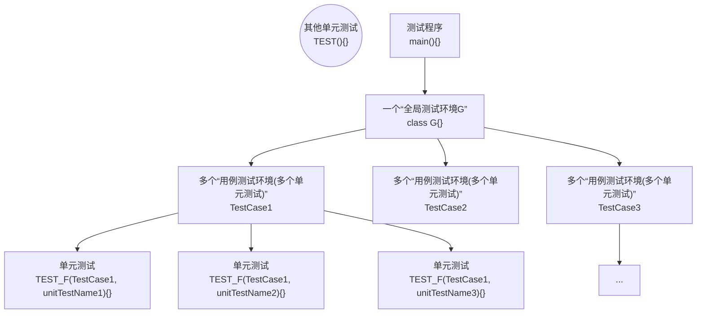

# 1.测试的基本概念

代码测试是软件开发中的重要环节，确保软件在投入使用前运行正确且符合预期。常见的代码测试策略包括以下几种：

| 测试类型 | 定义                                                         | 特点                                                       | 示例                                                         |
| -------- | ------------------------------------------------------------ | ---------------------------------------------------------- | ------------------------------------------------------------ |
| 单元测试 | 单元测试是对软件中的最小可测试部分（通常是单个函数或方法）进行的测试。 | 测试范围小，测试代码与被测代码紧密相关。                   | 测试一个计算两个数之和的函数，确保它在各种输入情况下都返回正确的结果。 |
| 集成测试 | 集成测试是将多个单元组合在一起进行测试，以发现不同模块之间的接口问题。 | 测试范围比单元测试大，需要关注模块间的交互。               | 测试用户登录功能，确保从输入用户名密码到验证再到用户主页显示这一完整流程的正确性。 |
| 系统测试 | 系统测试是对整个系统进行的测试，验证系统在一个完整环境中的表现。 | 涵盖功能测试、性能测试、安全性测试等。                     | 在生产环境中部署一个 Web 应用，模拟真实用户操作进行测试，确保所有功能如预期运行。 |
| 验收测试 | 验收测试是根据用户需求和业务目标，对系统进行的最终测试，验证系统是否满足需求。 | 通常由 QA 团队或用户进行，测试通过即表示系统可以交付使用。 | 用户在新系统上线前进行最终确认测试，确保所有功能符合业务需求。 |
| 回归测试 | 回归测试是对修改后的软件进行重新测试，确保修改没有引入新的缺陷。 | 频繁进行，确保新代码与旧代码的兼容性。                     | 在系统功能更新或修复 bug 后，重新运行所有相关测试用例，确保系统稳定性。 |
| 冒烟测试 | 冒烟测试是一种浅层次的测试，确保软件的主要功能能正常工作。   | 测试范围窄，时间短，用于验证基本功能是否正常。             | 每次构建后快速测试系统的关键功能，如启动应用程序、基本用户操作等。 |
| 探索测试 | 探索性测试是一种灵活、非正式的测试方法，测试人员在测试过程中探索软件，发现潜在问题。 | 依赖测试人员的经验和直觉，无预定测试用例。                 | 测试人员根据自身对系统的理解，随机测试不同功能，发现异常或问题。 |

每种测试策略都有其独特的作用和适用场景，开发团队通常会综合运用多种策略，以确保软件的质量和可靠性。

# 2.测试的第三方库

## 2.1.GoogleTest

`GoogleTest`（也称为 `GTest`）是一个由 `Google` 开发的 `C++` 测试框架。它广泛用于编写和运行单元测试，支持跨平台使用，包括 `Linux、Windows、MacOS` 等操作系统。`GoogleTest` 提供了丰富的功能，帮助开发人员高效地编写和维护测试代码。

您可以 [前往 GTest 对应的 Github 地址](https://github.com/google/googletest) 一看，不过更推荐 [查看 GTest 对应的主页](https://google.github.io/googletest/) 里面有更多的官方教程...

### 2.1.1.GoogleTest 下载

1.   `sudo apt-get install libgtest-dev`：安装 `GoogleTest` 的开发库包 `libgtest-dev`，这里把源代码安装到 `/usr/src/` 的同时，还把头文件也包含进了 `/usr/include/`
2.   `cd /usr/src/`：进入系统级源代码目录，此时 `ll` 一下应该就可以看到一个存放 `Gtest` 源代码文件夹 `/usr/src/gtest`
3.   `mkdir -p /usr/src/gtest/build && cd /usr/src/gtest/build`：进入源代码目录的同时使用创建一个 `build` 构建目录后进入该目录，等待使用后续的 `CMake`
4.   `cmake ..`：在 `/usr/src/gtest/build` 中使用 `CMake` 工具（这个工具您一定要下载下来，不过 `Ubuntu` 较新版本中一般都有），这些都是基本的 `CMake` 构建指令，使用 `cmke ..` 构建时，一般都需要确保上级源代码文件中包含一个叫 `CMakeList.txt` 的文件
5.   `make`：在 `build` 目录中使用 `make` 指令来运行 `makefile` 文件，可以看到内部有一个新目录 `lib`，内部包含库文件，也可能直接生成在 `build` 目录下，您需要所谓找一下
6.   `sudo cp libgtest*.a /usr/local/lib/`：将库文件拷贝到用户级库文件目录下即可使用

>   补充：关于安装目录的相关知识，这里您可以稍微看一下。
>
>   ```shell
>   # 查看系统安装目录
>   $ tree /usr -L 1
>   /usr # 存放系统资源
>   ├── include # 存放系统级别的头文件
>   ├── src # 存放系统级别的源代码
>   ├── bin # 存放系统级别的可执行文件
>   ├── sbin # 存放系统级别的管理员可执行文件
>   ├── lib # 存放动态链接库
>   ├── lib32 # 存放 32 位动态链接库
>   ├── lib64 # 存放 64 位动态链接库
>   ├── local # 存放用户资源
>   └── share # 存放系统级别的共享数据文件
>   
>   $ tree /usr/local/ -L 1 
>   /usr/local/
>   ├── include
>   ├── src
>   ├── bin
>   ├── sbin
>   ├── lib
>   ├── etc # 自定义软件的相关配置文件
>   ├── man -> share/man # 自定义软件的帮助手册
>   └── share
>   ```

### 2.1.2.GoogleTest 使用

#### 2.1.2.1.宏体测试

最为简单的测试就是宏体测试，宏体测试和 `C 语言` 的断言宏很类似。

-   `ASSERT_` 系列，检测失败退出当前函数
-   `EXPECT_` 系列，检测失败继续往下执行

```cpp
// 常见的测试宏
TEST (测试用例名称, 测试名称) {
    ASSERT_TRUE(参数); // 期待结果是 true
    ASSERT_FALSE(参数); // 期待结果是 false
    ASSERT_LT(参数1, 参数2); // lessthan, 小于才返回 true
    ASSERT_GT(参数1, 参数2); // greater than, 大于才返回 true
    ASSERT_LE(参数1, 参数2); // lessequal, 小于等于才返回 true
    ASSERT_GE(参数1, 参数2); // greaterequal, 大于等于才返回 true
    EXPECT_EQ(参数1, 参数2); // 相等就返回 true
    EXPECT_NE(参数1, 参数2); // 不等就返回 true
}

int main(int argc, char const* argv[]) {
    testing::InitGoogleTest(argc, argv); // 初始化 GTest
    RUN_ALL_TESTS(); // 运行所有测试用例
    return 0;
}
```

使用方法也很简单：

1.   在多个 `TEST(测试用例名称, 测试名称){}` 中使用常见的宏体定义多个单元测试
2.   然后使用 `testing::InitGoogleTest(argc, argv);` 初始化 `GTest`
3.   使用 `RUN_ALL_TESTS()` 运行所有的单元测试

下面简单给出一些测试例子。

```cpp
// 测试宏的使用
#include <gtest/gtest.h>

TEST(BoolTets, testTrue) {
    bool a = true;
    ASSERT_TRUE(a);
}

TEST(BoolTets, testFalse) {
    bool b = false;
    ASSERT_FALSE(b);
}

TEST(CompareTets, testLt) {
    int a = 1, b = 2;
    ASSERT_LT(a, b);
}

TEST(CompareTets, testGt) {
    int a = 2, b = 1;
    ASSERT_GT(a, b);
}

TEST(CompareTets, testLe) {
    int a = 2, b = 1;
    ASSERT_LE(a, b);
}

TEST(CompareTets, testGe) {
    int a = 1, b = 2;
    ASSERT_GE(a, b);
}

int main(int argc, char* argv[]) {
    testing::InitGoogleTest(&argc, argv); // 初始化 GTest
    RUN_ALL_TESTS(); // 运行所有测试用例
    return 0;
}
```

上面的宏测试中，`EXPECT_` 系列和 `ASSERT_` 系列的使用接口类似，只是行为不一样而已。这种测试较为简单，我们来试试更加由技术含量的事件测试。

#### 2.1.2.2.事件测试

`GTest` 中的事件机制是指在测试前和测试后提供给用户自行添加操作的机制，而且该机制也可以让同一测试套件下的测试用例共享数据。`GTest` 框架中事件的结构层次如下：




在单元测试之前需要进行测试环境初始化，测试完毕后就会进行测试环境清理，而测试环境分为：

-   **全局测试环境**：整体测试中只初始化一次环境，所有测试用例执行完毕后清理测试环境
-   **用例测试环境**：在每次的测试环境中，都会重新初始化测试环境，完成测试后立刻清理测试环境

全局测试环境设置机制如下：

1.   创建一个自己的类，然后继承 `testing::Environment{};`，接着分别实现成员函数 `SetUp()` 和 `TearDown()` 
2.   在多个 `TEST(测试用例名称, 测试名称){}` 中使用常见的宏体定义多个单元测试
3.   在 `main` 函数内调用 `testing::AddGlobalTestEnvironment(new MyEnvironment);` 设置全局测试环境
4.   使用 `InitGoogleTest(&argc, argv)` 初始化 `GTest`
5.   使用 `RUN_ALL_TESTS()` 运行所有的单元测试

用例测试环境设置机制如下：

1.   创建一个自己的类，然后继承自 `testing::Test{};`，分别实现两个静态成员函数 `SetUpTestCase()` 和 `TearDownTestCase()`
2.   在多个 `TEST_F(测试用例名称, 测试名称){}` 中使用常见的宏体定义多个单元测试
3.   测试套件的事件机制不需要像全局事件机制 ⼀ 样在 `main` 注册
4.   使用 `InitGoogleTest(&argc, argv)` 初始化 `GTest`
5.   使用 `RUN_ALL_TESTS()` 运行所有的单元测试

我们直接上代码会更容易理解，比某些教程快多了。

```cpp
// 使用普通的单元测试并且结合“全局测试环境”和“用例测试环境”
#include <iostream>
#include <gtest/gtest.h>
#include <unordered_map>

// 全局字典
std::unordered_map<std::string, std::string> dict;

// 全局测试环境类
class TestEnv : public testing::Environment {
public:
    virtual void SetUp() override { // 重写父类的虚函数成员(多态)
        std::cout << "全局测试环境初始化: 准备数据\n";
        dict.insert(std::make_pair("limou", "李某"));
        dict.insert(std::make_pair("iimou", "艾某"));
        dict.insert(std::make_pair("dimou", "戴某"));
    }

    virtual void TearDown() override { // 重写父类的虚函数成员(多态)
        std::cout << "全局测试环境清理: 清理数据\n";
        dict.clear();
    }
};

// 用例测试环境类
class TestCase_1 : public ::testing::Test {
protected:
    void SetUp() override { // 在每个测试用例执行前调用(多态)
        std::cout << "测试用例环境初始化 1\n";
    }

    void TearDown() override { // 在每个测试用例执行后调用(多态)
        std::cout << "测试用例环境清理 1\n";
    }
};

// 用例测试环境类
class TestCase_2 : public ::testing::Test {
protected:
    void SetUp() override { // 在每个测试用例执行前调用(多态)
        std::cout << "测试用例环境初始化 2\n";
    }

    void TearDown() override { // 在每个测试用例执行后调用(多态)
        std::cout << "测试用例环境清理 2\n";
    }
};

// 定义其他测试
TEST(MyTest_1, NeualTest) {
    ASSERT_NE(10, 100);
}

// 定义测试用例
TEST_F(TestCase_2, FindTest) {
    auto it = dict.find("limou");
    ASSERT_NE(it, dict.end());
}

TEST_F(TestCase_2, SizeTest) {
    ASSERT_GT(dict.size(), 0);
}

TEST_F(TestCase_2, NonExistentKeyTest) {
    auto it = dict.find("non existent");
    ASSERT_EQ(it, dict.end());
}

// 定义测试用例
TEST_F(TestCase_1, FindTest) {
    auto it = dict.find("limou");
    ASSERT_NE(it, dict.end());
}

TEST_F(TestCase_1, SizeTest) {
    ASSERT_GT(dict.size(), 0);
}

TEST_F(TestCase_1, NonExistentKeyTest) {
    auto it = dict.find("non existent");
    ASSERT_EQ(it, dict.end());
}


// 定义其他测试
TEST(MyTest_2, EqualTest) {
    ASSERT_EQ(100, 100);
}

// 测试程序
int main(int argc, char* argv[]) {
    // 设置全局测试环境
    ::testing::AddGlobalTestEnvironment(new TestEnv()); // 第一个 :: 代表从全局命名空间查找

    // 初始化 GTest
    ::testing::InitGoogleTest(&argc, argv);

    // 运行所有测试用例
    return RUN_ALL_TESTS();
}
```

在命令行中，对应如下测试结果输出。

```shell
# 单例测试结果
$ ./a.out 
[==========] Running 8 tests from 4 test suites.
[----------] Global test environment set-up.
全局测试环境初始化: 准备数据
[----------] 1 test from MyTest_1
[ RUN      ] MyTest_1.NeualTest
[       OK ] MyTest_1.NeualTest (0 ms)
[----------] 1 test from MyTest_1 (0 ms total)

[----------] 3 tests from TestCase_2
[ RUN      ] TestCase_2.FindTest
测试用例环境初始化 2
测试用例环境清理 2
[       OK ] TestCase_2.FindTest (0 ms)
[ RUN      ] TestCase_2.SizeTest
测试用例环境初始化 2
测试用例环境清理 2
[       OK ] TestCase_2.SizeTest (0 ms)
[ RUN      ] TestCase_2.NonExistentKeyTest
测试用例环境初始化 2
测试用例环境清理 2
[       OK ] TestCase_2.NonExistentKeyTest (0 ms)
[----------] 3 tests from TestCase_2 (0 ms total)

[----------] 3 tests from TestCase_1
[ RUN      ] TestCase_1.FindTest
测试用例环境初始化 1
测试用例环境清理 1
[       OK ] TestCase_1.FindTest (0 ms)
[ RUN      ] TestCase_1.SizeTest
测试用例环境初始化 1
测试用例环境清理 1
[       OK ] TestCase_1.SizeTest (0 ms)
[ RUN      ] TestCase_1.NonExistentKeyTest
测试用例环境初始化 1
测试用例环境清理 1
[       OK ] TestCase_1.NonExistentKeyTest (0 ms)
[----------] 3 tests from TestCase_1 (0 ms total)

[----------] 1 test from MyTest_2
[ RUN      ] MyTest_2.EqualTest
[       OK ] MyTest_2.EqualTest (0 ms)
[----------] 1 test from MyTest_2 (0 ms total)

[----------] Global test environment tear-down
全局测试环境清理: 清理数据
[==========] 8 tests from 4 test suites ran. (0 ms total)
[  PASSED  ] 8 tests.
```


