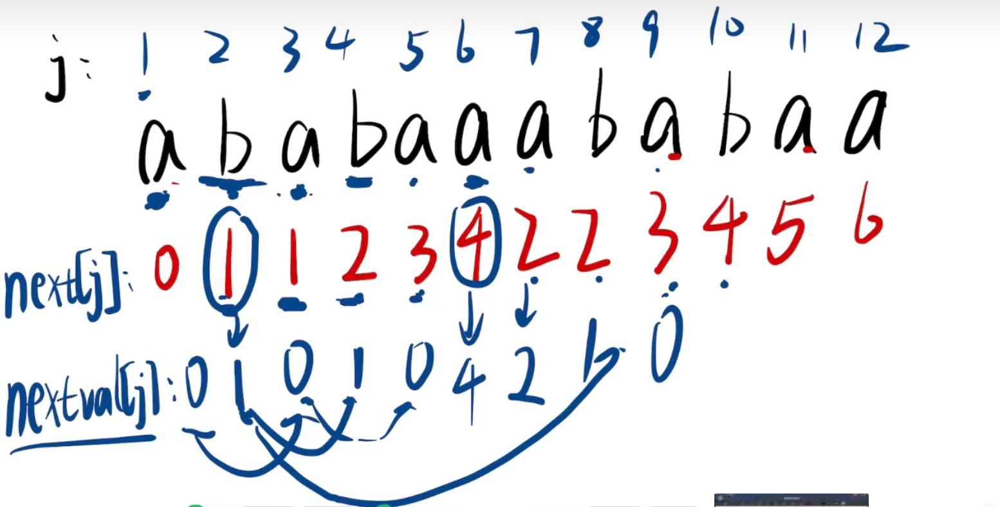

# 1.栈

## 1.1.栈概念

## 1.2.栈接口

## 1.3.栈细节

## 1.4.栈实现

# 2.队列

## 2.1.队列概念

## 2.2.队列接口

## 2.3.队列细节

## 2.4.队列实现

# 3.串

## 3.1.串概念

## 3.2.串接口

## 3.3.串细节

串最重要的接口莫过于在主串中定位子串的位置，这种定位运算就是串的模式匹配（串匹配），这里简单介绍两种实现。

### 3.3.1.BF 算法

暴力匹配的算法。

```cpp
//BF 算法
#define _CRT_SECURE_NO_WARNINGS 1
#include <stdio.h>
#include <string.h>
#include <stdbool.h>
#include <assert.h>

bool IsEqual(const char* s, const char* subS)
{
	//避免一开始就传过来空的模式串
	assert(*subS != '\0');

	//一一比较每一个字符
	while ((*subS != '\0') && (*s == *subS))
	{
		s++;
		subS++;

		//处理模式字符长度大于主串子串的情况
		if ((*subS != '\0') && (*s == '\0'))
			return false;
	}

	//相等说明匹配完
	return *subS == '\0';
}

int BF(const char* mainS, const char* subS)
{
	int mainSSize = strlen(mainS);
	int subSSize = strlen(subS);
	int size = mainSSize - subSSize + 1;
	for (int i = 0; i < size; i++)
	{
		if (IsEqual(mainS + i, subS))
		{
			return i;
		}
	}
	return -1;
}

int main()
{
	const char* mainS= "aaabcd"; //主串
	const char* subS = "abcd"; //模式串
	int index = BF(mainS, subS); //暴力匹配
	printf("%d\n", index); //得出主串中对于的索引值 
	return 0;
}
```

### 3.3.2.KMP 算法

| $KMP$                                      | a                                     | b                                       | a                                       | b                                       | a                                       | a                                     | a                                     | b                                     | a                                     | b                                     | a                                     | a                                     |
| ------------------------------------------ | ------------------------------------- | --------------------------------------- | --------------------------------------- | --------------------------------------- | --------------------------------------- | ------------------------------------- | ------------------------------------- | ------------------------------------- | ------------------------------------- | ------------------------------------- | ------------------------------------- | ------------------------------------- |
| $PM_i，且i \in [0, n-1]$                   | <span style="color:#FF0000;">0</span> | <span style="color:#FF0000;"> 0 </span> | <span style="color:#FF0000;"> 1 </span> | <span style="color:#FF0000;"> 2 </span> | <span style="color:#FF0000;">3</span>   | <span style="color:#FF0000;">1</span> | <span style="color:#FF0000;">1</span> | <span style="color:#FF0000;">2</span> | <span style="color:#FF0000;">3</span> | <span style="color:#FF0000;">4</span> | <span style="color:#FF0000;">5</span> | <span style="color:#FF0000;">6</span> |
| $写法一:next1_i = PM_{i-1},且next1_0=-1$   | -1                                    | <span style="color:#FF0000;">0</span>   | <span style="color:#FF0000;"> 0 </span> | <span style="color:#FF0000;"> 1 </span> | <span style="color:#FF0000;"> 2 </span> | <span style="color:#FF0000;">3</span> | <span style="color:#FF0000;">1</span> | <span style="color:#FF0000;">1</span> | <span style="color:#FF0000;">2</span> | <span style="color:#FF0000;">3</span> | <span style="color:#FF0000;">4</span> | <span style="color:#FF0000;">5</span> |
| $写法二:next2_i = next1_i + 1$             | <span style="color:#FF00FF;">0</span> | <span style="color:#FF00FF;"> 1</span>  | <span style="color:#FF00FF;">1</span>   | <span style="color:#FF00FF;">2</span>   | <span style="color:#FF00FF;">3</span>   | <span style="color:#FF00FF;">4</span> | <span style="color:#FF00FF;">2</span> | <span style="color:#FF00FF;">2</span> | <span style="color:#FF00FF;">3</span> | <span style="color:#FF00FF;">4</span> | <span style="color:#FF00FF;">5</span> | <span style="color:#FF00FF;">6</span> |
| $根据next2_i值得对应字符,找到不匹配的字符$ | null                                  | <span style="color:#FFFF00;">a</span>   | a                                       | b                                       | a                                       | <span style="color:#FFFF00;">b</span> | <span style="color:#FFFF00;">b</span> | b                                     | a                                     | b                                     | a                                     | a                                     |
| $不匹配字符直接落下，匹配字符直接拷贝$     | <span style="color:#FF00FF;">0</span> | <span style="color:#FFFF00;">1</span>   | <span style="color:#00FF00;">0</span>   | <span style="color:#00FF00;">1</span>   | <span style="color:#00FF00;">0</span>   | <span style="color:#FFFF00;">4</span> | <span style="color:#FFFF00;">2</span> | <span style="color:#00FF00;">1</span> | <span style="color:#00FF00;">0</span> | <span style="color:#00FF00;">1</span> | <span style="color:#00FF00;">0</span> | <span style="color:#00FF00;">4</span> |



## 3.4.串实现


# 4.实践

## 4.1.栈

### 4.1.1.逆波兰表达式

### 4.1.2.双栈

### 4.1.3.递归与非递归转化

$$
Ack(m, n) = 
\left\{
\begin{array}{left}
n + 1, m = 0\\
Ack(m-1, 1), m \neq 0 且 n = 0 \\
Ack(m - 1, Ack(m, n - 1)), m \neq 0 且 n \neq 0\\
\end{array}
\right.
$$

用递归和非递归的方式写出上述函数的对应算法。

#### 4.1.3.1.斐波那契数列

#### 4.1.3.2.青蛙跳荷叶问题

#### 4.1.3.3.汉诺塔问题

### 4.1.4.数制转化

### 4.1.5.括号匹配问题

### 4.1.6.栈模拟队列

## 4.2.队列

### 4.2.1.队列模拟栈


