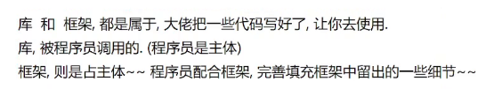
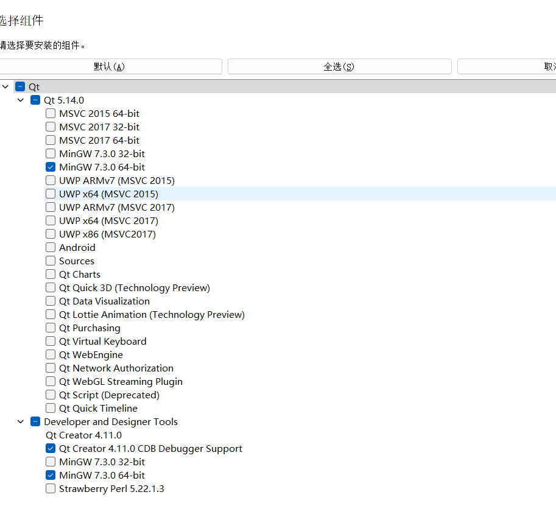

`TUI` 和 `GUI`。

多种 `GUI` 解决方案：

在 Windows 平台上进行桌面开发时，有几种常见的 GUI 解决方案可供选择。以下是一些主要的 GUI 框架和工具：

1.  **Windows API（WinAPI）：** Windows API 是 Microsoft 提供的一套用于开发 Windows 应用程序的原生接口。使用 C 或 C++ 编程语言，可以直接调用 Windows API 来创建 Windows 应用程序，实现自定义的用户界面和功能。
2.  **Windows Presentation Foundation（WPF）：** WPF 是 Microsoft 提供的一种基于 .NET Framework 的 GUI 框架，用于创建富客户端应用程序。WPF 使用 XAML（可扩展应用程序标记语言）和 C#（或其他 .NET 语言）来构建用户界面，并提供了丰富的视觉效果和动画效果。
3.  **Windows Forms（WinForms）：** Windows Forms 是 Microsoft 提供的一种传统的 GUI 框架，用于创建基于窗体的 Windows 应用程序。与 WPF 不同，Windows Forms 使用的是 Win32 API，而不是 WPF 的 DirectX 技术，因此它更接近于传统的 Windows 应用程序开发模式。
4.  **Microsoft Foundation Classes（MFC）：** MFC 是 Microsoft 提供的 C++ 类库，用于开发 Windows 应用程序。MFC 提供了一组封装了 Windows API 的类和函数，使开发者可以更方便地创建 Windows 应用程序的用户界面和功能。
5.  **Electron：** Electron 是一个跨平台的开发工具包，可以使用 HTML、CSS 和 JavaScript 来构建桌面应用程序。它基于 Chromium 和 Node.js，可以创建具有现代界面和强大功能的桌面应用程序。虽然 Electron 不是 Windows 平台的本机解决方案，但它可以在 Windows 上进行开发，并且可以打包成独立的 Windows 应用程序。
6.  **Qt：** Qt 是一个跨平台的 C++ 应用程序开发框架，可以用于开发桌面、移动和嵌入式应用程序。Qt 提供了丰富的 GUI 组件和工具，可以快速构建现代化的桌面应用程序，并且可以在 Windows 平台上进行开发。
7.  **Gtk#：** Gtk# 是一个用于开发桌面应用程序的 GUI 工具包，它基于 Gtk+ 库，并提供了 C# 的绑定。Gtk# 可以在 Windows 平台上使用，并且支持跨平台开发。
8.  **Avalonia：** Avalonia 是一个跨平台的 XAML 标准实现，用于构建高性能的跨平台应用程序。它可以在 Windows 平台上进行开发，并提供了一种类似于 WPF 的开发体验。
9.  **UWP（Universal Windows Platform）：** UWP 是 Microsoft 提供的一种用于构建通用 Windows 应用程序的平台。使用 UWP，开发者可以创建一次编译，跨设备部署的应用程序，支持 Windows 10 平台上的各种设备，包括桌面、平板、手机和 IoT 设备。
10.  **Xamarin.Forms：** Xamarin.Forms 是一个用于创建跨平台的移动和桌面应用程序的框架，它基于 C# 和 .NET 平台，并提供了一种统一的 API，可以在多个平台上使用。Xamarin.Forms 可以在 Windows 平台上进行开发，并且支持桌面应用程序的开发。
11.  **Electron**: 本质是吧 `HTML` 网页，打包为 `Windows` 上运行的客户端程序，原本是作为 `atom` 开发使用的（但被 `vscode` 干掉了，最后 `github` 被微软收购后也经过了各种迭代）。

`QT` 的资料。

`QT` 的历史和发展。

`QT` 的跨平台，支持 `Windows、MacOS、Linux`，效率也可以。

什么是应用程序框架。

1.  **GNOME（GNU Network Object Model Environment）：** GNOME 是一个流行的开源桌面环境，它注重用户友好性和现代化设计。GNOME 采用了扁平化的设计风格，提供了一系列的应用程序和工具，如文件管理器 Nautilus、文本编辑器 GNOME Builder 等。
2.  **KDE Plasma：** KDE Plasma 是另一个流行的开源桌面环境，它提供了丰富的功能和高度可定制性。KDE Plasma 使用了 Qt 框架来开发，它包括了一系列的应用程序和工具，如 Dolphin 文件管理器、Konsole 终端仿真器等。
3.  **Xfce：** Xfce 是一个轻量级的桌面环境，它注重性能和资源利用效率。Xfce 提供了一组简洁但功能强大的应用程序，如 Thunar 文件管理器、Xfce 终端等。
4.  **Cinnamon：** Cinnamon 是 Linux Mint 发行版的默认桌面环境，它是基于 GNOME 3 开发的一个分支。Cinnamon 提供了一个传统的桌面体验，包括任务栏、菜单、系统托盘等经典的桌面元素。
5.  **MATE：** MATE 是另一个基于 GNOME 2 开发的桌面环境，它提供了一个传统的桌面体验，并且注重性能和稳定性。MATE 提供了一系列经典的应用程序和工具，如 Caja 文件管理器、Pluma 文本编辑器等。
6.  **LXQt：** LXQt 是 LXDE 和 Razor-qt 桌面环境的合并，它使用了 Qt 框架来开发，提供了一个轻量级但现代化的桌面环境。

版本为 `QT5` 

简化了内存回收机制。

https://download.qt.io/archive/qt/5.14/5.14.0/

