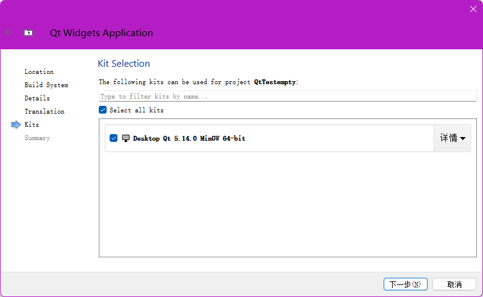

>   前要：我推荐新手先难受会，使用 `Qt Creator` 来直接开发。
>
>   
>
>   
>
>   
>
>   >   补充：元编程是指编写能够操作、生成或者改变其他程序或者自身的程序。简单来说，元编程是关于编写程序的程序，它可以自我修改或者生成新的代码，也可以在运行时动态地创建、修改和执行代码。
>
>   使用 `Qt Creator` 会自动生成一些代码，接下来选择一个父类来用于后续的继承。
>
>   -   `QMainWindows`：表示完整的窗口
>   -   `QWidget`：表示一个控件（窗口上的一个具体元素，例如输入框、按钮、下拉框、单选按钮、复选按钮）
>   -   `QDialog`：表示一个对话框
>
>   
>
>   `Qt` 中创建图形化界面的程序, 有两种：
>
>   1.   `Qt` 创建 `C++` 代码的方式
>   2.   通过 `from file` 图形化的方式
>
>   选择基于不同版本编译器的 `Qt SDK` 来构建后续代码。
>
>   
>
>   