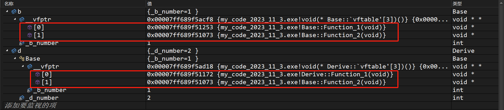

[TOC]

# 1.多态概念

就是“多种形态”，完成某个方法的时候，使用不同的对象就会得出不同的结果。

# 2.多态使用

多态会使用一种叫做”虚函数“的东西，多态关键字和虚继承是一样的，但是两者没有关系，只是共用了一个关键字`virtual`，这个关键字只能修饰成员。

书写一个子类的虚函数，可以叫做“对父类成员函数的重写/覆盖（注意和继承的隐藏/重定义做好区分）”。

>   区分：隐藏/重定义、重写/覆盖、重载的区别
>
>   1.   隐藏/重定义发生在两个具有父子关系的类中，只需要父子各自拥有的函数或者变量名字相同即可构成隐藏/重定义
>   2.   重写/覆盖发生在两个具有父子关系的类中，需要父子各自拥有的函数的函数签名（函数返回值、函数名、函数参数列表）严格相同，并且带有关键字`virtual`（除去协变的情况）
>   3.   重载发生在同一个作用域中（不能发生在两个类域），需要函数名字相同，参数列表不同

```cpp
#include <iostream>
#include <string>
using namespace std;
class Person
{
public:
    virtual void BuyTicket()//虚函数
    {
        cout << "买票-全价" << endl;
    }
};

class Student : public Person
{
public:
    virtual void BuyTicket()//虚函数
    {
        cout << "买票-半价" << endl;
    }
};

class Child : public Person
{
public:
    virtual void BuyTicket()//虚函数
    {
        cout << "买票-免费" << endl;
    }
};

void Function(Person& p)//只能使用指针和引用去调用达成多态
{
    p.BuyTicket();
}

int main()
{
    //1.父类
    Person p;
    //2.子类
    Student s;
    Child c;
    //3.调用不同的函数
    Function(p);
    Function(s);
    Function(c);
    return 0;
}
```

这里使用多态的时候就产生了切片。这里要注意多态的构成条件：

1.   构成多态必须有虚函数重写
2.   必须使用父类的指针或引用去调用虚函数

这里的虚函数重写怎么理解呢？必须是具有父子继承关系的两个成员虚函数，并且两者的函数签名（函数返回值、函数名、函数参数列表）完全相同（函数参数主要是看类型是否相同，与缺省值是否相同或者参数名字是否相同无关），但是内部定义可以不同的。

>   注意：构成函数重写和是不是虚函数是两回事！

但是，`C++`有一些例外情况，使得哪怕函数签名不完全相同也能构成多态。

虚函数的返回值可以发生不同，这种情况也叫做”协变“（很少使用协变）。但是此时构成多态的函数的返回值类型必须是具有父子继承关系类的类型的指针或引用（如果是其他不具有继承关系的类型的返回值就有可能会报错）。

```cpp
//协变例子
#include <iostream>
using namespace std;

//一对具有父子关系的类
class Father
{
	int _father_value;
};
class Child: public Father
{
	int _child_value;
};

//A、B父子类，内含虚函数
class A
{
public:
	virtual A* func()
	{
		cout << "virtual A* func()" << endl;
		return nullptr;
	}
};
class B : public A
{
public:
	virtual B* func()//构成多态
	{
		cout << "virtual B* func()" << endl;
		return nullptr;
	}
};

int main()
{
	A a;
	B b;
	A* pa = &a;
	A* pb = &b;

	pa->func();
	pb->func();

	return 0;
}
```

另外如果父类的函数加了`virtual`成为了虚函数，那么子类就可以不加`virtual`，依旧是构成了多态的重写（挺让人吐槽的），但是我们建议加上，因为这样可读性更好。

>   补充`1`：两个有关虚函数的关键字
>
>   1. `final`：必须是修饰虚函数，表示该函数不能被重写，加在父类函数名后面（如果是加在类后，该类就不能被继承）
>
>   2. `override`：检查子类的虚函数是否真的重写了父类的某个虚函数，没有重写就编译报错，也是写在子类函数名字的后面
>
>   补充`2`：实际上虚函数继承就是一种接口继承，而普通的继承是一种实现继承。

# 3.多态析构

之前我们提到过：在继承的时候，析构函数是很特殊的，是编译器自己调用，并且还统一改名为`destrutor()`。编译器为了避免内存泄露自己调控析构的顺序这我们能理解，但是为什么需要改名呢？

```cpp
//不用多态
#include <iostream>
using namespace std;
class Person
{
public:
    void func()
    {
        cout << "Person:virtual void func()" << endl;
    }
    ~Person()
    {
        cout << "~Person()" << endl;
    }
};
class Student : public Person
{
public:
    void func()
    {
        cout << "Student:virtual void func()" << endl;
    }
    ~Student()
    {
        cout << "~Student()" << endl;
    }
};

int main()
{
    Person* ptr1 = new Person;
    Student* ptr2 = new Student;

    ptr1->func();
    ptr2->func();

    delete ptr1;
    delete ptr2;

    return 0;
}
//输出：
//Person:virtual void func()
//Student:virtual void func()
//~Person()
//~Student()
//~Person()
//没毛病，这里析构的前两句都是在ptr2内完成的，在ptr2释放完自己的资源后，编译器自动调用父类的资源，释放父类的资源
```

但是如果使用指针或者引用来构成多态就会出现问题了：

```cpp
//使用多态（修改前）
#include <iostream>
using namespace std;
class Person
{
public:
    virtual void func()
    {
        cout << "Person:virtual void func()" << endl;
    }
    ~Person()
    {
        cout << "~Person()" << endl;
    }
};
class Student : public Person
{
public:
    virtual void func()
    {
        cout << "Student:virtual void func()" << endl;
    }
    ~Student()
    {
        cout << "~Student()" << endl;
    }
};

int main()
{
    Person* ptr1 = new Person;
    Person* ptr2 = new Student;

    ptr1->func();
    ptr2->func();

    delete ptr1;
    delete ptr2;
    return 0;
}
//输出：
//Person:virtual void func()
//Student:virtual void func()
//~Person()
//~Person()
//出问题了，ptr2内部的子类资源没有被释放掉，原因是因为析构函数没有构成多态
```

为什么呢，因为这里的析构函数没有构成多态。两个`delete`分别调用`ptr1->destructor()`和`ptr2->destructor()`，而由于析构函数没有关键字`virtual`，没有构成多态。

因此在编译器看来，使用了什么类型的指针就应该调用什么类型的析构函数，就用对应类型的析构函数，也就造成了内存泄漏。

那如何构成多态呢？让我们回忆一下多态的构成条件：虚函数重写、指针或引用调用。

如果析构函数达成多态，首先函数签名是要相同吧？但是每个子类和父类的名字都是不一样的，而在语法规则上，每个类的析构函数签名都是`~类名()`，由于这条规则，首先函数名字就一定不一样了，这样就很难构成多态。

总不能修改规则让每个类的析构函数名字都变成一样吧？答案是：虽然我们自己改不可以，但是我们可以让编译器干这种活呀！编译器统一将具有继承关系的析构函数名称改为`destructor()`，让析构函数有机会构成父子隐藏，这样使用析构函数就会变成使用`ptr1->destructor()`和`ptr2->destructor()`。

为什么说是有机会呢？因为还缺少了关键字`virtual`，这个时候只要给所有具有继承关系的析构函数加上关键字`virtual`，即可让析构函数构成多态，使用`ptr1->destructor()`和`ptr2->destructor()`也就具有了多态的行为

上面也就是单独对析构改名的原因，而其他成员函数则无需这样，他们不需要构成多态。

因此代码需要这么修改：

```cpp
//使用多态（修改后）
#include <iostream>
using namespace std;
class Person
{
public:
    virtual void func()
    {
        cout << "Person:virtual void func()" << endl;
    }
    virtual ~Person()
    {
        cout << "~Person()" << endl;
    }
};
class Student : public Person
{
public:
    virtual void func()
    {
        cout << "Student:virtual void func()" << endl;
    }
    virtual ~Student()
    {
        cout << "~Student()" << endl;
    }
};

int main()
{
    Person* ptr1 = new Person;
    Person* ptr2 = new Student;

    ptr1->func();
    ptr2->func();

    delete ptr1;
    delete ptr2;
    return 0;
}
//输出：
//Person:virtual void func()
//Student:virtual void func()
//~Person()
//~Student()
//~Person()
```

再结合我们之前在[2.多态使用](#2.多态使用)最后中提到的”如果父类的函数加了`virtual`成为了虚函数，那么子类就可以不加`virtual`，依旧是构成了多态的重写“，我们其实只需要在父类的析构函数加上关键字足够了。

```cpp
//使用多态（修改后）
#include <iostream>
using namespace std;
class Person
{
public:
    virtual void func()
    {
        cout << "Person:virtual void func()" << endl;
    }
    virtual ~Person()
    {
        cout << "~Person()" << endl;
    }
};
class Student : public Person
{
public:
    void func()
    {
        cout << "Student:virtual void func()" << endl;
    }
    ~Student()
    {
        cout << "~Student()" << endl;
    }
};

int main()
{
    Person* ptr1 = new Person;
    Person* ptr2 = new Student;

    ptr1->func();
    ptr2->func();

    delete ptr1;
    delete ptr2;
    return 0;
}
//输出：
//Person:virtual void func()
//Student:virtual void func()
//~Person()
//~Student()
//~Person()
```

当然需要注意，只有在使用指针`new`和`delete`的时候才会出现这样的问题。如果是直接创建子类对象，然后将地址传给父类指针，就不会有这种问题，因为子类对象自己就会调用正确的析构函数，无需程序员手动使用`delete`。因此换句话说：这种因为析构没有达成多态条件构成的内存泄漏，主要是发生在使用`new`上。

下面是和上面代码对比的另外一段代码，请好好思考他们之间的不同（为何上一份不加`virtual`就会发生内存泄漏，而下面这一份却不会呢？）：

```cpp
//使用多态（修改前）
#include <iostream>
using namespace std;
class Person
{
public:
    virtual void func()
    {
        cout << "Person:virtual void func()" << endl;
    }
    ~Person()
    {
        cout << "~Person()" << endl;
    }
};
class Student : public Person
{
public:
    virtual void func()
    {
        cout << "Student:virtual void func()" << endl;
    }
    ~Student()
    {
        cout << "~Student()" << endl;
    }
};

int main()
{
    Student s;
    Person p;

    Person& rs = s;
    Person& rp = p;

    rs.func();
    rp.func();

    return 0;
}
//输出：
//Student:virtual void func()
//Person : virtual void func()
//~Person()
//~Student()
//~Person()
//没有出问题
```

# 4.多态隐藏

有些时候，多态隐藏得很深，有可能会隐藏到`this`里，下面这个题目就很坑：

```cpp
//隐藏的多态
#include <iostream>
using namespace std;
class A
{
public:
	virtual void func(int val = 1)
	{
		cout << "A->" << val << endl;
	}
	virtual void test()
	{
		func();
	}
};
class B : public A
{
public:
	void func(int val = 0)//隐藏/重定义了func
	{
		cout << "B->" << val << endl;
	}
	//继承了 virtual void test(A* const this)，因此继承的实质是可以使用父类的函数，而不是真的有一个函数在子类中
};
int main()
{
	B* p = new B;
	p->test();
	//调用 B 类内的 test()，由于继承的实质是可以使用父类的函数，
	//因此实际是使用了父类函数里的 test()，全写为 void test(A* const this)
	//父类 this 指针接受 p 指针，使用 this->func() 就造成多态调用（是父类指针的调用），
	//因此内部调用的是子类的 func()
	
	//而虚函数的继承实际上是继承了了父类函数的接口，然后重写了实现，
	//因此子类内的缺省值用的是父类的缺省值（子类）

	p->func();//这里就没有构成多态了，正常调用了子类成员函数
	return 0;
}
```

>   吐槽：实际当中谁要是写了这种代码必会被人吐槽...

这个例子主要是想要提醒您继承的实质和多态调用的条件，很好将继承和多态融合在了一起。

另外这里还简单提及了“接口继承”，这在`Java`中也有相关的概念。

# 5.多态原理

>   吐槽：下面的原理如果您看不懂，也可以以后再来查看，因为确实难度提升了很多...

我们先来看一段代码：

```cpp
#include <iostream>
using namespace std;

class Base
{
public:
	virtual void Function()
	{
		cout << "Function()" << endl;
	}
private:
	int _b = 1;
};

int main()
{
	Base b;
	cout << sizeof(b) << endl;//32位输出8，64位输出16
	return 0;
}
```

这个现象很奇怪，仿佛类的实例化变量还有一个成员一样，这和我们多态的原理有关，我们一一来进行解释。

## 5.1.单类继承

您不觉得这很神奇么，虚函数为什么和指针类型无关，而是指针指向的类型有关呢？

这是因为使用虚函数的父类对象在编译时就会多一个`_vfptr`虚函数表指针成员。该指针指向一个虚函数指针数组，而该数组存储对象中所有虚函数成员的地址，这就是多态的原理。

>   吐槽：在`VS`中是叫`_vfptr`这个名字，这个名称可能起得不太好，应该叫`_vft`之类的（`virtual function table`），代表指向一个虚函数表的指针。

父类对象的虚表指针成员指向的虚表存储父类虚函数，而子类对象的虚表指针从父类继承来。虚表只能存储虚函数的地址（这个地址很可能不是函数真正的地址，在`VS`中，所有的函数地址，都只是在汇编代码中跳转到对应函数前`jmp`指令的地址），而父子的虚函数本身存储在代码段。

但是从父类拷贝到子类的虚函数表指针指向的虚函数表有可能会发生变动。

1.   父子各自指向的表内的众多虚函数指针原本是一样的（因为子类拷贝的是父类的虚函数地址）
2.   但是编译器检测到有虚函数接口重写，编译器将会对子类对象内部的虚函数表指针指向的虚函数表的内容进行覆盖（子类覆盖从父类拷贝过来的虚函数地址）
3.   导致子类的指向的虚函数表内存储的虚函数地址发生了变化
4.   这个过程就是虚函数重写，如果没有覆盖，那么数组内容就会一样，这也是为什么虚函数重写会被称为“覆盖”的原因（因此重写是语言层面的概念，而覆盖是原理层面的概念）

对于下述代码，我做了图解解释，方便您理解多态原理：

```cpp
#include <iostream>
using namespace std;

class Base
{
public:
	virtual void Function_1()
	{
		cout << "Base:Function_1()" << endl;
	}
	virtual void Function_2()
	{
		cout << "Base:Function_2()" << endl;
	}
private:
	int _b_number = 1;
};

class Derive : public Base
{
	virtual void Function_1()
	{
		cout << "Derive:Function_1()" << endl;
	}
private:
	int _d_number = 2;
};

void Function(Base* b)
{
	b->Function_1();
}

int main()
{
	Base b;
	Derive d;

	Function(&b);
	Function(&d);
	return 0;
}
```


我们还可以注意到，虚函数谁先被声明（再次强调是声明，而不是定义）谁的下标就越靠前：

```cpp
#include <iostream>
using namespace std;

class Base
{
public:
	virtual void Function_1();//先声明，后定义
	virtual void Function_2();//后声明，先定义
private:
	int _b_number = 1;
};

class Derive : public Base
{
	virtual void Function_1()
	{
		cout << "Derive:Function_1()" << endl;
	}
private:
	int _d_number = 2;
};

void Base::Function_2()
{
	cout << "Base:Function_2()" << endl;
}
void Base::Function_1()
{
	cout << "Base:Function_1()" << endl;
}

void Function(Base* b)
{
	b->Function_1();
}

int main()
{
	Base b;
	Derive d;

	Function(&b);
	Function(&d);
	return 0;
}
```



>   补充`1`：如果没有关键字`virtual`，那么上述说的所有现象都不会存在。
>
>   补充`2`：所有带有关键字`virtual`的虚函数一定会被存储在虚函数表里，但是选择覆盖还是不覆盖是构成多态的关键（也就是构成两个条件：虚函数重写、指针或引用调用，即可完成覆盖，达成多态的使用）。

知道了上述原理，我们解答下面的问题就会更加深入，而不是简单记忆语法。

### 5.1.1.问题一：非指针或引用无法调用多态

为什么直接使用子类对象赋值给父类对象，使用父类对象调用虚函数时无法达成多态？这是因为父类只拷贝了子类的成员，而没有拷贝子类的虚函数表指针（父类自己就有，只会调用父类自己的虚函数表指针），从原理上来说，的确可以这么做，但是`C++`明确规定不能这么做，您简单记忆即可。下面是代码示例：

```cpp
#include <iostream>
using namespace std;

class Base
{
public:
	virtual void Function_1()
	{
		cout << "Base:Function_1()" << endl;
	}
	virtual void Function_2()
	{
		cout << "Base:Function_2()" << endl;
	}
private:
	int _b_number = 1;
};
class Derive : public Base
{
	virtual void Function_1()
	{
		cout << "Derive:Function_1()" << endl;
	}
private:
	int _d_number = 2;
};

void Function(Base x)//赋值调用，不构成多态
{
	x.Function_1();
}

int main()
{
	Base b;
	Derive d;

	Function(b);
	Function(d);
	return 0;
}
```


而指针和引用给子类对象的虚函数表指针（内部数组已经经过覆盖）部分提供了指向或别名，就不会有上面的问题。

>   补充：从实现上来看，如果赋值的时候，将子类对象的虚函数表指针拷贝给父类对象会发生什么？无法保证父类对象内部的虚表是父类的虚表，父类对象一旦不小心被子类对象赋值，就会完全转变为调用子类虚函数。
>
>   这在有些场景会极度坑人：析构函数会被错误调用，因为析构函数是有可能会进入虚表的，父类对象被`new`出来后，一旦被子类对象赋值就会调错析构函数。
>
>   ```cpp
>   Perosn* p = new Person;
>   Students s;
>   *p = s;
>   delete p;//调错析构函数，调成子类的了
>   ```

### 5.1.2.问题二：同类对象共用虚表

为什么不直接存在对象内？因为有可能会有多个虚函数，直接存储的话，一个对象就会非常大。而一个程序往往会有很多同类型的对象，这样就会重复存储冗余的数据。

而所有的对象内的虚函数表指针指向同一个虚函数表，在创建较多同类型对象时，就会大大节省空间。

### 5.1.3.问题三：子类对象拷贝父类对象虚表

如果有父子都有虚函数，但是没有构成重写/覆盖，那么父子对象用的不是也同一张虚表（因为有可能会发生覆盖，父子对象要是使用的相同虚表就会自己覆盖自己了），但同类的对象就会共用一张虚表。

```cpp
#include <iostream>
using namespace std;

class Base
{
public:
	virtual void Function_1()
	{
		cout << "Base:Function_1()" << endl;
	}
	virtual void Function_2()
	{
		cout << "Base:Function_2()" << endl;
	}
private:
	int _b_number = 1;
};
class Derive : public Base
{
private:
	int _d_number = 2;
};

void Function(Base* x)
{
	x->Function_1();
}

int main()
{
	Base b;
	Derive d;

	Function(&b);
	Function(&d);

	Base bb;
	return 0;
}
```


### 5.1.4.问题四：打印虚表地址和虚表内容

虚表是在编译时生成好的，实际并不神秘。而对象中的虚表指针是在构造函数的初始化列表阶段生成的，并且是最后一个被初始化的，在其他成员变量之后（这点可以调试出来，这一过程是编译器自己做的），那怎么打印出虚表呢？

在`VS 2022`中，这个虚表指针指向的数组会以`0`为结点，我们可以利用指针的强制转化在`VS 2022`的环境下打印虚函数表内的成员内容（其他环境可能会不会这样了，有可能需要写有限循环才可以打印地址）。

并且可以和其他区域的地址对比，推断出虚函数表的存储位置，下面我们在`32`位环境下，完成打印虚函数表地址和打印虚函数表内内容的任务：

```cpp
//打印虚函数表地址和虚函数地址，以及虚函数表地址和其他区域地址的对比
#include <iostream>
using namespace std;

class Father
{
public:
	virtual void Function_1()
	{
		cout << "Father:Function_1()" << endl;
	}
	virtual void Function_2()
	{
		cout << "Father:Function_2()" << endl;
	}
private:
	int _b_number = 1;
};

class Son : public Father
{
public:
	virtual void Function_1()
	{
		cout << "Son:Function_1()" << endl;
	}
	virtual void Function_3()
	{
		cout << "Son:Function_3()" << endl;
	}
	virtual void Function_4()
	{
		cout << "Son:Function_4()" << endl;
	}
	void Function_5()
	{
		cout << "Son:Function_5()" << endl;
	}
private:
	int _d_number = 2;
};

class Grandson : public Son
{
public:
	virtual void Function_3()
	{
		cout << "Grandson:Function_3()" << endl;
	}
};

void Function(Father* f)
{
	f->Function_1();
}

void test_1()
{
	Father f;
	Son s;
	Grandson g;

	static int a = 0;
	int b = 0;
	int* p1 = new int;
	const char* p2 = "hello";

	printf("静态区：%p\n", &a);
	printf("栈区：%p\n", &b);
	printf("堆区：%p\n", p1);
	printf("代码段/常量区：%p\n", p2);
	printf("虚表地址：%p\n", *((int*)(&s)));

	printf("Father::Function_1 虚函数地址：%p\n", &Father::Function_1);//成员函数这里有一个语法规定，不能只使用函数名，必须加上取地址
	printf("Father::Function_2 虚函数地址：%p\n", &Father::Function_2);//成员函数这里有一个语法规定，不能只使用函数名，必须加上取地址
	printf("Son::Function_1 虚函数地址：%p\n", &Son::Function_1);//成员函数这里有一个语法规定，不能只使用函数名，必须加上取地址
	printf("Son::Function_2 虚函数地址：%p\n", &Son::Function_2);//成员函数这里有一个语法规定，不能只使用函数名，必须加上取地址
	printf("Son::Function_3 虚函数地址：%p\n", &Son::Function_3);//成员函数这里有一个语法规定，不能只使用函数名，必须加上取地址
	printf("Son::Function_4 虚函数地址：%p\n", &Son::Function_4);//成员函数这里有一个语法规定，不能只使用函数名，必须加上取地址
	printf("Grandson::Function_1 虚函数地址：%p\n", &Grandson::Function_1);//成员函数这里有一个语法规定，不能只使用函数名，必须加上取地址
	printf("Grandson::Function_2 虚函数地址：%p\n", &Grandson::Function_2);//成员函数这里有一个语法规定，不能只使用函数名，必须加上取地址
	printf("Grandson::Function_3 虚函数地址：%p\n", &Grandson::Function_3);//成员函数这里有一个语法规定，不能只使用函数名，必须加上取地址
	printf("Grandson::Function_4 虚函数地址：%p\n", &Grandson::Function_4);//成员函数这里有一个语法规定，不能只使用函数名，必须加上取地址

	printf("普通函数地址：%p\n\n", Function);
	//注意：成员函数这里有一个语法规定，不能只使用函数名，必须加上取地址
	//注意：不可以使用 bTest.Function_1 这种方式打印虚函数地址，因为函数地址没有被存储在对象中
}

typedef void(*VFUNC)();
void PrintVFT(VFUNC arr[])//接受虚函数表指针，并且打印虚函数表内的函数地址内容，然后进行调用
{
	for (size_t i = 0; arr[i] != 0; i++)//这里是根据 VS 的特殊处理才可以这么写停止循环的条件的，其他环境可能只能自己写固定的循环次数
	{
		printf("_vfptr[%d]:%p->", i, arr[i]);
		arr[i]();//调用函数
	}
	printf("\n");
}
void test_2()
{
	Father f;
	VFUNC* vPtrT1 = (VFUNC*)(*(int*)&f);//虚函数表地址，如果是 64 位可以改 (int*) 为 (long long*)
	PrintVFT(vPtrT1);

	Son s;
	VFUNC* vPtrT2 = (VFUNC*)(*(int*)&s);//虚函数表地址，如果是 64 位可以改 (int*) 为 (long long*)
	PrintVFT(vPtrT2);

	Grandson g;
	VFUNC* vPtrT3 = (VFUNC*)(*(int*)&g);//虚函数表地址，如果是 64 位可以改 (int*) 为 (long long*)
	PrintVFT(vPtrT3);
}

int main()
{
	//64位的输出会不一样（因为指针长度变成了 8 字节），建议换成32位平台再运行

	test_1();
	test_2();
	return 0;
}
```

```
输出结果如下：
静态区：004CD434
栈区：012FFDA4
堆区：01550C40
代码段/常量区：004CABF8
虚表地址：004CAB74
Father::Function_1 虚函数地址：004C1091
Father::Function_2 虚函数地址：004C1384
Son::Function_1 虚函数地址：004C12A8
Son::Function_2 虚函数地址：004C1384
Son::Function_3 虚函数地址：004C1249
Son::Function_4 虚函数地址：004C1195
Grandson::Function_1 虚函数地址：004C12A8
Grandson::Function_2 虚函数地址：004C1384
Grandson::Function_3 虚函数地址：004C10DC
Grandson::Function_4 虚函数地址：004C1195
普通函数地址：004C110E

_vfptr[0]:004C12F3->Father:Function_1()
_vfptr[1]:004C114F->Father:Function_2()

_vfptr[0]:004C1523->Son:Function_1()
_vfptr[1]:004C114F->Father:Function_2()
_vfptr[2]:004C1212->Son:Function_3()
_vfptr[3]:004C10E1->Son:Function_4()

_vfptr[0]:004C1523->Son:Function_1()
_vfptr[1]:004C114F->Father:Function_2()
_vfptr[2]:004C147E->Grandson:Function_3()
_vfptr[3]:004C10E1->Son:Function_4()
```

其中很快可以推断虚表地址存储在代码端/常量区。

## 5.3.多类继承

多类继承就会产生多个虚表，原理和单类继承类似，但是会有`this`指针修正的问题。

```cpp
#include <iostream>
using namespace std;

class Father
{
public:
	virtual void Function_1()
	{
		cout << "Father:Function_1()" << endl;
	}
	virtual void Function_2()
	{
		cout << "Father:Function_2()" << endl;
	}
private:
	int _f_number = 1;
};

class Mother
{
public:
	virtual void Function_1()
	{
		cout << "Mother:Function_1()" << endl;
	}
	virtual void Function_2()
	{
		cout << "Mother:Function_2()" << endl;
	}
private:
	int _m_number = 2;
};
class Son : public Father, public Mother
{
public:
	virtual void Function_1()
	{
		cout << "Son:Function_1()" << endl;
	}
	virtual void Function_3()//这个虚函数被放在第一个虚表里了
	{
		cout << "Son:Function_3()" << endl;
	}

private:
	int _s_number = 3;
};

typedef void(*VFUNC)();
void PrintVFT(VFUNC arr[])//打印虚函数表内的函数
{
	for (size_t i = 0; arr[i] != 0; i++)//这里是根据VS的特殊处理才可以这么写停止循环的条件的，其他环境可能只能自己写固定的循环次数
	{
		printf("[%d]:%p->", i, arr[i]);
		arr[i]();//调用函数
	}
	printf("\n");
}

int main()
{
	Son s;
	//打印虚表
	VFUNC* table1 = (VFUNC*)(*(int*)&s);//第一张虚表
	//VFUNC* table2 = (VFUNC*)( *( (int*)(  (char*)&s + sizeof(Father))));//第二张虚表（直接使用指针操作）
	Mother* ptr = &s;
	VFUNC* table2 = (VFUNC*)(*((int*)ptr));//第二张虚表（利用内置切片让指针偏移）
	PrintVFT(table1);
	PrintVFT(table2);
	printf("Son::Function_1: %p\n", &Son::Function_1);

	//调用函数
	Father* p1 = &s;
	Mother* p2 = &s;
	
	p1->Function_1();
	p2->Function_1();

	return 0;
}
```

>   注意：虚函数都会放到虚表内，但是不一定会造成多态。

多继承也是类似的原理，但是注意有可能会修改`this`指针的问题。


>   注意：上述的`Son`类还自己定义了一个独属于自己的虚函数，这个虚函数的地址被默认放在该对象的第一张虚表里，这在上述图中也有体现。

## 5.4.棱形继承

### 5.4.1.普通棱形继承下的虚函数表

```cpp
#include <iostream>
using namespace std;

class A {
public: virtual void func1() { cout << "A::func1" << endl; }
public:	int _a = 1;
};

class B : public A {
public:	virtual void func1() { cout << "B::func1" << endl; }
public:	int _b = 2;
};

class C : public A {
public:	virtual void func1() { cout << "C::func1" << endl; }
public:	int _c = 3;
};

class D : public B, public C {
public:	virtual void func1() { cout << "D::func1" << endl; }
public:	virtual void func2() { cout << "D::func2" << endl; }
public:	int _c = 4;
};

int main() {
	D d;
	return 0;
}
```

实际上棱形继承也是多继承的一种，可以理解为：两个子类继承父类中的虚表（各自拷贝一份虚表），然后孙类继承自两个子类（从两个子类中拷贝了两个虚表），因此孙类具有两个虚表。

其中需要注意，`D`类还自己定义了一个独属于自己的虚函数`func2()`，这个虚函数的地址被默认放在该对象的第一张虚表里。

### 5.4.2.虚继承下的虚函数表

那如果是虚继承下，又有多少张虚表呢？

```cpp
#include <iostream>
using namespace std;

class A {
public: virtual void func1() { cout << "A::func1" << endl; }
public:	int _a = 1;
};

class B : virtual public A {
public:	virtual void func1() { cout << "B::func1" << endl; }
public:	int _b = 2;
};

class C : virtual public A {
public:	virtual void func1() { cout << "C::func1" << endl; }
public:	int _c = 3;
};

class D : public B, public C {
public:	virtual void func1() { cout << "D::func1" << endl; }
public:	virtual void func2() { cout << "D::func2" << endl; }
public:	int _c = 4;
};

int main() {
	D d;
	return 0;
}
```

答案是两张，也很好理解，实际上所谓继承父类的虚表，就是继承了父类的虚函数表指针成员，这里`B`和`C`类有重复的成员，因此将都属于`A`类的公共部分存储到一个地址处。也就是说：`B`和`C`共用一份虚函数表。

那么另外一个虚函数表又是哪里来的呢？是`D`自己创建的，之前为什么没有呢？因为在`D`类内部还有一个独属于自己的虚函数`func2()`，这个虚函数的地址原本在没有虚继承的请款下，会被默认放在对象的第一张虚表里。但是这里发生了虚继承，之前的两张虚表已经合二为一了，放进去不太合适，于是`D`就自己创建了一个虚表，存储这个`func2()`的地址。

我们再变一下：

```cpp
#include <iostream>
using namespace std;

class A {
public: virtual void func1() { cout << "A::func1" << endl; }
public:	int _a = 1;
};

class B : virtual public A {
public:	virtual void func1() { cout << "B::func1" << endl; }
public:	virtual void func3() { cout << "B::func3" << endl; }
public:	int _b = 2;
};

class C : virtual public A {
public:	virtual void func1() { cout << "C::func1" << endl; }
public:	virtual void func4() { cout << "C::func4" << endl; }
public:	int _c = 3;
};

class D : public B, public C {
public:	virtual void func1() { cout << "D::func1" << endl; }
public:	virtual void func2() { cout << "D::func2" << endl; }
public:	int _c = 4;
};

int main() {
	D d;
	return 0;
}
```

这里就有三份虚表了，为什么呢？

1.   首先`B`和`C`公共部分共用一份虚表
2.   `B`有自己的独有虚函数，因此对象`d`中需要这份虚表
3.   `C`有自己的独有虚函数，因此对象`d`中需要这份虚表
4.   `D`虽然有自己的独有虚函数，但是可以存储到第一份虚表里，也就是`B`部分的虚表中

因此总结为三种虚表。

>   补充：更多的相关内容可以看这两篇文章
>
>   1.   [C++虚函数表解析](https://coolshell.cn/articles/12165.html)
>   2.   [C++对象的内存布局](https://coolshell.cn/articles/12176.html)

# 6.抽象概念

在虚函数的后面加上`= 0`那么这个函数就会变成纯虚函数，只要包含一个及以上的纯虚函数的类就叫抽象类（接口类），抽象类不能实例出对象，这也是我们第一次接触”抽象“的概念。

抽象类强制子类重写虚函数，并且无法实例化出对象，但是可以构建对应类型的指针类型。

```cpp
#include <iostream>
using namespace std;
class A
{
	virtual void function() = 0;
};
class B : public A
{
	void function()
	{
		cout << "I am a function." << endl;
	}
};
int main()
{
	//A a;//无法创建出对象
	A* pa;//允许
	B b;//允许
	return 0;
}
```

那么有什么用呢？首先父类是抽象类，因此不存在父类对象，这个抽象只是为了多态而设计的出来的，抽象类可以拥有很多子类（`Java`就大量使用了这种抽象类）。

```cpp
#include <iostream>
using namespace std;
class A
{
public:
	virtual void function() = 0;
};
class B : public A
{
public:
	void function()
	{
		cout << "B:I am a function." << endl;
	}
};
class C : public A
{
public:
	void function()
	{
		cout << "C:I am a function." << endl;
	}
};

void func(A* a)
{
	a->function();
}
int main()
{
	B b;
	C c;
	b.function();
	c.function();
	return 0;
}
```

纯虚函数哪怕拥有实体也是纯虚的，因此虚函数的实体没有什么意义。

# 7.相关题目

## 7.1.问答题目

### 7.1.1.什么是多态？

### 7.1.2.重载、重写、重定义的区别？

### 7.1.3.多态的实现原理？

### 7.1.4.inline函数可以作为虚函数么？

可以，但是两个关键字放在一起可以通过编译，但是只会根据使用情况择取一个关键字。普通调用就使用`inline`关键字，多态调用就使用`virtual`.

### 7.1.5.静态成员函数可以是虚函数么？

不可以，因为静态成员函数没有`this`指针。

### 7.1.6.构造函数可以是虚函数么？

不可以，首先虚函数表是在编译期间生成的，但是对象内部的虚表指针是在构造函数中生成的（在其他普通成员变量初始化之前），因此构造函数没有办法找到虚表达成多态。

### 7.1.7.析构函数可以是虚函数么？在什么时候必须写成多态？

可以，也最好在写多态的时候将析构函数写成多态（在父类指针接受子类的`new`然后使用`delete`的时候，才可以正确调用子类析构函数）。

### 7.1.8.对象访问普通函数快还是虚函数快？

如果没有构成多态，那么是一样快的，如果构成多态，普通函数比较快（比如：子对象调用自己的虚函数，这是正常调用）。

### 7.1.9.虚函数表是在什么阶段生成的？存储在哪里？

### 7.1.10.棱形基础的问题是什么？怎么解决？为什么可以解决？

### 7.1.11.抽象类是什么？有什么作用？

### 7.1.12.静态多态和动态多态有什么区别？

1.   静态多态/编译时多态：实际上就是函数重载，在编译时就确定了，其原理是函数名修饰规则。
2.   动态多态/运行时多态：就是虚函数构成多态（父类指针或引用调用、虚函数完成重写），其原理是虚函数表

## 7.2.笔试题目

### 7.2.1.题目一：赋值兼容和强制转化

下面代码输出结果是什么？

```cpp
#include <iostream>
#include <vector>
using namespace std;

class A
{
public:
    virtual void f()
    {
        cout << "A::f()" << endl;
    }
};

class B : public A
{
private:
    virtual void f()
    {
        cout << "B::f()" << endl;
    }
};

int main()
{
    A* pa = (A*)new B;//这里的强制类型转化实际上是多余的，可以直接赋值，因为赋值兼容做出了保障
    pa->f();
}
```

### 7.2.2.题目二：虚表指针的初始化时机

```cpp
#include <iostream>
#include <vector>
using namespace std;

class A
{
public:
    A() : m_iVal(0)
    {
        test();
    }

    virtual void func()
    {
        std::cout << m_iVal << ' ';
    }

    void test()
    {
        func();
    }

public:
    int m_iVal;
};

class B : public A
{
public:
    B() 
    {
        test();
    }

    virtual void func()
    {
        ++m_iVal;
        std::cout << m_iVal << ' ';
    }
};

int main(int argc, char* argv[])
{
    A* p = new B;
    //1. 使用 new 调用 B 类的构造函数 B(B* this)
    //
    //2. 在子类构造函数 B(B* this) 中默认先利用切片调用父类构造函数 A(A* this)，
    //   初始化了子类内继承的 m_iVal 为 0，而内部又去调用 test(A* this)，
    //   这里无法发生多态（此时还在 B 类对象还在构造阶段，而其虚表指针又是初始化列表最后一个初始化的）
    //   因此调用 func(A* this)，此时 m_iVal 为 0，并且打印出 "0 "
    //
    //3. B(B* this)的初始化列表走完了，此时 B 类对象内部就有了虚表指针。
    //   而子类构造函数 B(B* this) 内部的 test() 由于继承，
    //   直接调用父类内部的 test(A* this)，这里可以发生多态，
    //   因此内部调用 func() 调用的是子类的 func()，m_iVal 变为 1，并且打印 "1 "
    
    p->test();
    //4. 这里由于继承直接调用父类的 test(A* this)，内部发生多态调用 func(A* this)，
    //   则 m_iVal 变为 2，打印"2 "

    return 0;
}
```


