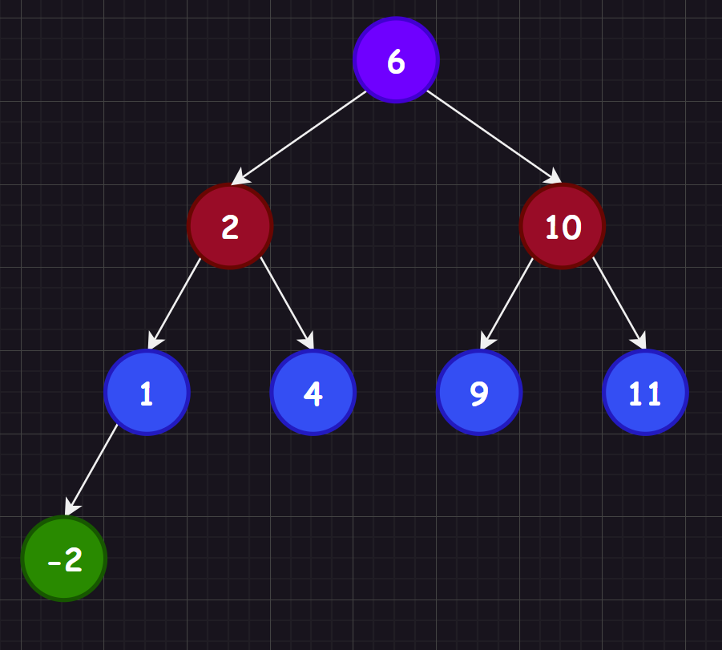
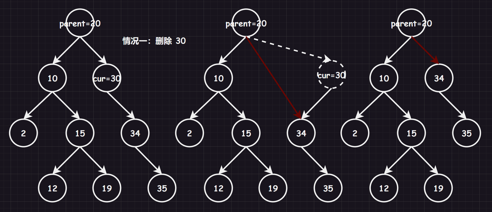
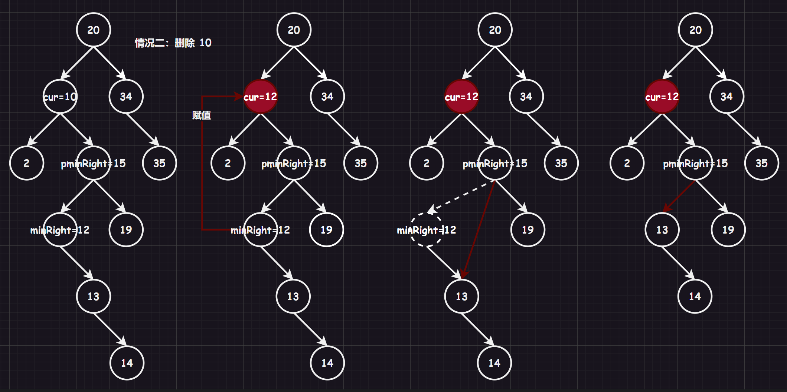

本章主要是二叉树的进阶部分，学习搜索二叉树后可以更好理解后面的 `map` 和 `set` 的特性，因为两者都是在二叉搜索树上作出一定的限定。

# 1.二叉搜索树概念

二叉搜索树/二叉排序树的递归定义为：非空左子树所有元素都小于根节点的值，非空右子树所有元素都大于根节点的值，而左右子树也是二叉搜索树。



# 2.二叉搜索树实现

## 2.1.接口分析

### 2.1.1.查找

1.   从根开始比较查找，比根大则往右边走查找，比根小则往左边走查找。 
2.   最多查找高度次，走到空，还没找到，则该值不存在。

### 2.1.2.插入

1.   树为空，则直接新增节点，赋值给 `root` 指针
2.   树不空，按二叉搜索树性质查找插入位置，插入新节点

### 2.1.3.删除

首先查找元素是否在二叉搜索树中，如果不存在，则返回 `false`。否则要删除的结点可能分下面四种情况：

1.   要删除的结点无孩子结点
2.   要删除的结点只有左孩子结点
3.   要删除的结点只有右孩子结点
4.   要删除的结点有左、右孩子结点

看起来有待删除节点有四种情况，实际情况 `1` 可以与情况 `2` 或者 `3` 合并起来，因此真正的删除过程如下： 

1.   情况 `1`：删除该结点，且使被删除节点的父结点指向被删除结点的左/右孩子结点（直接删除）

2.   情况 `2`：在它的右子树中寻找中序下的第一个结点（关键码最小，也就是右子树中最小的结点），用它的值填补到被删除节点中，再来处理该结点的删除问题，也就是复用情况 `1`（替换删除）

     >   补充：实际上情况 `2` 找左子树的最大节点也是可以的。

上述体现了一种“托孤”的现象，这和 `Linux` 中孤儿进程的托孤很是类似。





## 2.2.具体实现

下面的实现中，我不仅给出了插入和删除的循环版本，还给出了递归版本（其中循环版本使用的是右子树最小替换法，递归版本使用的是左子树最大替换法）。

```cpp
#include <iostream>
#include <string>
using namespace std;

template<typename K>//这里更加习惯写 K，也就是关键值 key 的类型
struct BinarySearchTreeNode
{
	BinarySearchTreeNode<K>* _left;
	BinarySearchTreeNode<K>* _right;
	K _key; 
	BinarySearchTreeNode(K key = K()) : _key(key), _left(nullptr), _right(nullptr) {}
};

template<typename K>
class BinarySearchTree
{
	typedef BinarySearchTreeNode<K> Node;
public:
	//BinarySearchTree() : _root(nullptr) {}
	BinarySearchTree() = default;//强制编译器生成默认的构造函数
	BinarySearchTree(const BinarySearchTree<K>& b)
	{
		_root = copy(b._root);
	}
	BinarySearchTree<K>& operator=(BinarySearchTree<K> b)//b 拷贝了一份
	{
		swap(_root, b._root);
		return *this;
	}
	~BinarySearchTree()
	{
		destroy(_root);
	}
	//1.插入
	bool insert(const K& key)
	{
		/*对于第一个插入的节点就是根节点。
		至于数据冗余，我在这里定义不允许数
		据冗余，也就是不允许出现重复的数据
		节点。这样的搜索二叉树会受到数据先
		后顺序插入的影响（您也可定义允许）*/
		
		//1.查看是否根节点
		if (_root == nullptr)
		{
			_root = new Node(key);
			return true;
		}
		//2.寻找存放的位置
		Node* parent = nullptr;//存放root的父节点
		Node* root = _root;//遍历，从根节点开始
		while (root)//直到空为止
		{
			parent = root;
			if (root->_key < key) 
			{
				root = root->_right;
			}
			else if(root->_key > key)
			{
				root = root->_left;
			}
			else//root->_key == key
			{
				return false;//默认不允许重复数据
			}
		}
		//3.插入节点及数据
		root = new Node(key);
		if (parent->_key < key)//注意不可以直接赋值给root，不仅内存泄露还连接不上节点
		{
			parent->_right = root;
		}
		else
		{
			parent->_left = root;
		}
		return true;
	}
	bool insertR(const K& key)
	{
		return _insertR(_root, key);
	}
	//2.删除
	bool erase(const K& key)
	{
		/*寻找被删除的节点，删除后，如果是单子节点还好，如果是多
		子节点就需要找到一个托孤后依旧满足二叉搜索树性质的节点，因此删除有两种情况：
		A.被删除节点是叶子节点 或者 被删除节点的左或右孩子为空，直接将孩子节点替换被删除节点即可
		B.被删除节点拥有两个子节点，取右子树中最小的节点替代被删除的节点（当然也可以取左子树的最大节点）
			b1.最小节点没有右孩子，最小节点直接替代被删除节点，并且将最小节点的空孩子节点交给父节点领养
			b2.最小节点存在右孩子，最小节点直接替代被删除节点，并且将最小节点的右孩子节点交给父节点领养
		最后还需要注意删除根节点，根节点没有父节点的问题*/
		Node* parent = nullptr;
		Node* cur = _root;
		//1.寻找节点
		while (cur)
		{
			if (cur->_key < key)
			{
				parent = cur;//不可以和下一个if语句共用，会出现cur和parenat的情况，例如：test_1()中删除10的时候
				cur = cur->_right;
			}
			else if (cur->_key > key)
			{
				parent = cur;
				cur = cur->_left;
			}
			else
			{
				//2.删除节点（找到了）
				if (cur->_left == nullptr)//2.1.左为空
				{
					if (parent == nullptr)//避免cur是根节点，没有父节点，例如：test_1()中删除11的时候
					{
						_root = cur->_right;
						delete cur;
						return true;
					}
					if (parent->_left == cur)
					{
						parent->_left = cur->_right;
					}
					else//parent->_right == cur
					{
						parent->_right = cur->_right;
					}
					delete cur;
				}
				else if (cur->_right == nullptr)//2.2.右为空
				{
					if (parent == nullptr)
					{
						_root = cur->_left;
						delete cur;
						return true;
					}
					if (parent->_left == cur)
					{
						parent->_left = cur->_left;
					}
					else//parent->_right == cur
					{
						parent->_right = cur->_left;
					}
					delete cur;
				}
				else//2.3.左右均不为空，取左子树中最大的或者取右子树中最小的节点替代被删除的节点
				{
					Node* pminRight = cur;//注意不能为nullptr，因为有可能出现不进循环的情况
					Node* minRight = cur->_right;//我们选择找右数最小节点
					while (minRight->_left != nullptr)//找到最左节点，但是需要注意这个最左节点如果有右树，那就需要最左节点的父节点接管
					{
						pminRight = minRight;
						minRight = minRight->_left;
					}
					cur->_key = minRight->_key;//替换相当于删除
					if (pminRight->_left == minRight)//最左节点的父节点托管最左节点的右树，注意可能有两种情况
					{
						pminRight->_left = minRight->_right;
					}
					else if (pminRight->_right == minRight)//最左节点的父节点托管最左节点的右树，注意可能有两种情况
					{
						pminRight->_right = minRight->_right;
					}
					delete minRight;
				}
				return true;
			}
		}
		return false;
	}
	bool eraseR(const K& key)
	{
		return _eraseR(_root, key);
	}
	//3.查找
	bool find(const K& key)
	{
		Node* root = _root;
		while (root)
		{
			if (root->_key < key)
			{
				root = root->_right;
			}
			else if (root->_key > key)
			{
				root = root->_left;
			}
			else
			{
				return true;
			}
		}
		return false;
	}
	bool findR(const K& key)
	{
		return _findR(_root, key);
	}
	//4.打印
	void inOrder()
	{
		_inOrder(_root);
		cout << endl;
	}

private:
	//1.销毁（提供给析构）
	void destroy(Node*& root)
	{
		if (root == nullptr)
			return;
		destroy(root->_left);
		destroy(root->_right);
		delete root;
		root = nullptr;
	}
	//2.拷贝（提供给拷贝构造）
	Node* copy(Node* root)
	{
		if (root == nullptr)
		{
			return nullptr;
		}
		Node* newroot = new Node(root->_key);
		newroot->_left = copy(root->_left);
		newroot->_right = copy(root->_right);
		return newroot;
	}
	//3.插入（提供给递归插入）
	bool _insertR(Node*& root, const K& key)//注意root是引用
	{
		if (root == nullptr)
		{
			root = new Node(key);//这里由于传递的是引用，那么root就是上一级递归的root->_left或者root->_right
			return true;
		}

		if (root->_key < key)
		{
			return _insertR(root->_right, key);
		}
		else if (root->_key > key)
		{
			return _insertR(root->_left, key);
		}
		else
		{
			return false;
		}
	}
	//4.删除（提供给递归插入）
	bool _eraseR(Node*& root, const K& key)//这里的引用一定要想明白
	{
		if (root == nullptr)
			return false;

		if (root->_key < key)
		{
			return _eraseR(root->_right, key);
		}
		else if (root->_key > key)
		{
			return _eraseR(root->_left, key);
		}
		else//root->_key == key
		{
			Node* del = root;//保存要删除的节点
			if (root->_right == nullptr)
			{
				root = root->_left;
			}
			else if (root->_left == nullptr)
			{
				root = root->_right;
			}
			else//左右均不为空
			{
				Node* maxleft = root->_left;
				while (maxleft->_right != nullptr)//找左树的最大节点
				{
					maxleft = maxleft->_right;
				}
				swap(root->_key, maxleft->_key);
				return _eraseR(root->_left, key);//由于左树的最大节点必有一个空孩子节点，因此使用递归删除即可，可以看到递归的删除比非递归及其的简单明了，将第二种情况转化为第一种情况（注意不可以直接传递maxleft，这是一个局部变量）
			}
			delete del;
			return true;
		}
	}
	//5.查找（提供给递归查找）
	bool _findR(Node* root, const K& key)
	{
		if (root == nullptr)
			return false;
		if (root->_key == key)
			return true;

		if (root->_key < key)
		{
			return _isRecursionFind(root->_left, key);
		}
		else//root->_key > key
		{
			return _isRecursionFind(root->_right, key);
		}

	}
	//6.打印（提供给递归打印）
	void _inOrder(Node* root)//注意这里不能直接就拿_root当作缺省值了，因为缺省值只能是常量或者全局变量，而_root需要使用this->_root，而this指针是函数形参，不一定传过来了，别谈使用_root了
	{
		if (root == nullptr)
			return;
		_inOrder(root->_left);
		cout << root->_key << " ";
		_inOrder(root->_right);
	}
	//？.成员变量
	Node* _root;
};
```

这里我还为您提供了三个测试样例，您可以自己写一遍上述代码，然后简单测试一下：

```cpp
//普通测试
void test_1()
{
	BinarySearchTree<int> b;
	b.insert(6);
	b.insert(2);
	b.insert(1);
	b.insert(4);
	b.insert(-2);
	b.insert(10);
	b.insert(9);
	b.insert(11);

	b.inOrder();

	b.erase(6);
	b.inOrder();

	b.erase(2);
	b.inOrder();

	b.erase(10);
	b.inOrder();

	b.erase(1);
	b.inOrder();

	b.erase(4);
	b.inOrder();

	b.erase(9);
	b.inOrder();

	b.erase(11);
	b.inOrder();

	b.erase(-2);
	b.inOrder();
}
//头删测试（需要该_root为公有成员才可以测试）
void test_2()
{
	BinarySearchTree<int> b;
	b.insert(6);
	b.insert(2);
	b.insert(1);
	b.insert(4);
	b.insert(-2);
	b.insert(10);
	b.insert(9);
	b.insert(11);

	//b.inOrder();
	//b.erase(b._root->_key);
	//b.inOrder();

	//b.erase(b._root->_key);
	//b.inOrder();

	//b.erase(b._root->_key);
	//b.inOrder();

	//b.erase(b._root->_key);
	//b.inOrder();

	//b.erase(b._root->_key);
	//b.inOrder();

	//b.erase(b._root->_key);
	//b.inOrder();

	//b.erase(b._root->_key);
	//b.inOrder();

	//b.erase(b._root->_key);
	//b.inOrder();
}
//递归测试
void test_3()
{
	BinarySearchTree<int> b;
	b.insertR(6);
	b.insertR(2);
	b.insertR(1);
	b.insertR(4);
	b.insertR(-2);
	b.insertR(10);
	b.insertR(9);
	b.insertR(11);

	BinarySearchTree<int> b1(b);

	b.inOrder();

	b.eraseR(6);
	b.inOrder();

	b.eraseR(2);
	b.inOrder();

	b.eraseR(10);
	b.inOrder();

	b.eraseR(1);
	b.inOrder();

	b.eraseR(4);
	b.inOrder();

	b.eraseR(9);
	b.inOrder();

	b.eraseR(11);
	b.inOrder();

	b.eraseR(-2);
	b.inOrder();

	b1.inOrder();
	b.inOrder();
}
```

>   补充：当前我们的二叉搜索树是不允许修改的，否则会失去搜索性质。

# 3.二叉搜索树应用

## 3.1.Key 模型

考虑“在不在”的问题，例如：

1.   门禁系统
2.   车库系统
3.   单词检查、搜索...

查找对象是否在数据库中存在，这样的场景在现实中有很多。

## 3.2.Key/Value 模型

通过一个值查找另外一个值，例如：

1.   中英文互译
2.   电话号码查询快递信息
3.   验证码查询信息...

只需要在一个节点中包含一个数据对即可。

另外，我们之前说过二叉搜索树一般不存储重复的元素，如果相同的元素可以让该元素绑定一个 `int` 元素形成键值对，这种情况的实际应用有：统计高频词汇。

类似的场景在现实中也很多。

>   补充：实际上，上面的这两种模型对标的是 `C++` 的 `set` 和 `map` 容器，这些我们后续学习。

# 4.二叉搜索树分析

给定一棵二叉搜索树，根据节点值大小排序所需时间复杂度是线性的，二叉搜索树也很适合拿来排序和去重。

但由于缺失平衡性，二叉搜索树在最不理想的状态（一颗斜树）查找的时间复杂度是 $O(n)$，最好的效率是 $O(log_{2}(N))$，对同一个集合按照不同顺序插入到二叉搜索树中，会导致构建出不同的树，无法保证该树位完全二叉树。

# 5.二叉树相关题目

## 5.1.[力扣 606. 根据二叉树创建字符串](https://leetcode.cn/problems/construct-string-from-binary-tree/)

```cpp
/**
 * Definition for a binary tree node.
 * struct TreeNode {
 *     int val;
 *     TreeNode *left;
 *     TreeNode *right;
 *     TreeNode() : val(0), left(nullptr), right(nullptr) {}
 *     TreeNode(int x) : val(x), left(nullptr), right(nullptr) {}
 *     TreeNode(int x, TreeNode *left, TreeNode *right) : val(x), left(left), right(right) {}
 * };
 */

//本题的步骤就在于：根不动，左子树和右子树的内容要各自用()包含起来
class Solution
{
public:
    void _tree2str(TreeNode* root, string& ret)
    {
        if(root == nullptr)
        {
            return;
        }
        //添加根结点数据
        ret += to_string(root->val);

        //添加左子树数据
        if(root->left != nullptr)
        {
            ret += '(';
            _tree2str(root->left, ret);
            ret += ')';
        }
        else if(root->left == nullptr && root->right != nullptr)
        {
            ret += "()";
        }

        //添加右子树数据
        if(root->right != nullptr)
        {
            ret += '(';
            _tree2str(root->right, ret);
            ret += ')';
        }
    }
    string tree2str(TreeNode* root)
    {
        string ret;
        _tree2str(root, ret);
        return ret;
    }
};
```

## 5.2.[力扣 102. 二叉树的层序遍历](https://leetcode.cn/problems/binary-tree-level-order-traversal/)

```cpp
/**
 * Definition for a binary tree node.
 * struct TreeNode {
 *     int val;
 *     TreeNode *left;
 *     TreeNode *right;
 *     TreeNode() : val(0), left(nullptr), right(nullptr) {}
 *     TreeNode(int x) : val(x), left(nullptr), right(nullptr) {}
 *     TreeNode(int x, TreeNode *left, TreeNode *right) : val(x), left(left), right(right) {}
 * };
 */
class Solution
{
public:
    vector<vector<int>> levelOrder(TreeNode* root)
    {
        //存储每一层的 vector 的 vector
        vector<vector<int>> vv;

        //处理空指针的情况
        if(!root) 
            return vv;

        //初始化辅助队列，存储一个树的根结点，并且层数 size 为 1
        queue<TreeNode*> q;
        int size = 1;
        q.push(root);

        while (!q.empty())
        {
            //存储一层的结点
            vector<int> v;
            while (size--)
            {
                TreeNode* front = q.front();
                q.pop();

                v.push_back(front->val);

                if(front->left)
                    q.push(front->left);
                if (front->right)
                    q.push(front->right);
            }

            //更新下一层的数据
            size = q.size();
            vv.push_back(v);
        }
        return vv;
    }
};
```

## 5.3.[力扣 107. 二叉树的层序遍历 II](https://leetcode.cn/problems/binary-tree-level-order-traversal-ii/)

## 5.4.[力扣 236. 二叉树的最近公共祖先](https://leetcode.cn/problems/lowest-common-ancestor-of-a-binary-tree/)

>   解析 `1`：可以存储到两个结点的两条路径的链表，这样就转化为求两条链表的公共结点。
>
>   那么怎么得到两条链表呢？可以利用栈的思想。
>
>   1.   根结点入栈
>   2.   然后一直入左子树，如果遇到空就出栈退回
>   3.   开始入右子树，如果该右子树为空就出根，不然就从步骤 `2` 开始执行
>
>   直到找到目标结点的栈路径，最后用求链表公共结点的思想操作即可，时间复杂度为 $O(n)$。
>
>   解析 `2`：实际上上面的做法还是太过冗余了，我们在查找两个目标结点的时候，有大量冗余的代码，我们可以换一种做题思路。
>
>   假设有一个函数 `InTree()`，用来检测一个目标结点是否存在于树中，是就返回 `true`，否则返回 `false`。
>
>   1.   如果检测出两个目标结点都在根的左子树里，那就直接将左子树作为整颗新树开始检测
>   2.   如果检测出两个目标结点都在根的右子树里，那就直接将右子树作为整颗新树开始检测
>   3.   如果检测出两个目标节点分别在根的左右子树里，那说明这个根就是公共祖先
>
>   这样编写的代码更容易理解，但是时间复杂度就是 $O(n^2)$。

```cpp
//解法一
class Solution
{
public:
    bool _lowestCommonAncestor(TreeNode* root, TreeNode* target, stack<TreeNode*>&path)
    {
        if (root == nullptr)
        {
            return false;
        }

        if (root == target)
        {
            path.push(target);
            return true;
        }

        //入结点进队列
        path.push(root);

        //如果结点的左右结点都不是目标结点就继续找
        if (_lowestCommonAncestor(root->left, target, path) == false
            && _lowestCommonAncestor(root->right, target, path) == false)
        {
            path.pop();
            return false;
        }

        return true;
    }
    TreeNode* lowestCommonAncestor(TreeNode* root, TreeNode* p, TreeNode* q)
    {
        //创建两栈存储两路径
        stack<TreeNode*> path1;
        stack<TreeNode*> path2;

        //寻找两结点的路径
        _lowestCommonAncestor(root, p, path1);
        _lowestCommonAncestor(root, q, path2);

        //出较大的栈直到和较小的栈同样长度
        int size = min(path1.size(), path2.size());
        while (path1.size() > size)
        {
            path1.pop();
        }
        while (path2.size() > size)
        {
            path2.pop();
        }

        //同时出栈寻找公共祖先
        while (!path1.empty())
        {
            if (path1.top()->val != path2.top()->val)
            {
                path1.pop();
                path2.pop();
            }
            else
            {
                return path1.top();
            }
        }

        return nullptr;
    }
};
```

```cpp
//解法二
class Solution
{
public:
    bool InTree(TreeNode* root, TreeNode* target)
    {
        if(root == nullptr)
            return false;
        if(root == target)
            return true;
        return InTree(root->left, target) || InTree(root->right, target);
    }
    TreeNode* lowestCommonAncestor(TreeNode* root, TreeNode* p, TreeNode* q)
    {
        if(root == p || root == q)
            return root;
        
        bool pInLeft = InTree(root->left, p);
        bool pInRight = !pInLeft;

        bool qInLeft = InTree(root->left, q);
        bool qInRight = !qInLeft;

        if(pInLeft && qInLeft)
            return lowestCommonAncestor(root->left, p, q);

        if(pInRight && qInRight)
            return lowestCommonAncestor(root->right, p, q);

        //(pInLeft && qInRight) || (pInRight && qInLeft)
        return root;
    }
};
```

```cpp
//解法一
class Solution
{
public:
    bool FindPath(TreeNode* root, TreeNode* target, stack<TreeNode*>&path)
    {
        if (root == nullptr)
            return false;

        path.push(root);
        if(root == target)
            return true;

        if(FindPath(root->left, target, path))
            return true;

        if(FindPath(root->right, target, path))
            return true;

        path.pop();
        return false;
    }
    TreeNode* lowestCommonAncestor(TreeNode* root, TreeNode* p, TreeNode* q)
    {
        //创建两栈存储两路径
        stack<TreeNode*> path1;
        stack<TreeNode*> path2;

        //寻找两结点的路径
        FindPath(root, p, path1);
        FindPath(root, q, path2);

        //出较大的栈直到和较小的栈同样长度
        while (path1.size() != path2.size())
        {
            if(path1.size() > path2.size())
                path1.pop();
            if(path1.size() < path2.size())
                path2.pop();
        }

        //同时出栈寻找公共祖先
        while (!path1.empty())
        {
            if (path1.top()->val != path2.top()->val)
            {
                path1.pop();
                path2.pop();
            }
            else
            {
                return path1.top();
            }
        }

        return nullptr;
    }
};
```

## 5.5.[力扣 LCR 155. 将二叉搜索树转化为排序的双向链表](https://leetcode.cn/problems/er-cha-sou-suo-shu-yu-shuang-xiang-lian-biao-lcof/)

>   解析：递归解决问题，假设有递归函数 `_treeToDoublyList()`，其作用为将树变为链表，使用参数 `cur` 和 `prev`，`cur` 是一棵树，`prev` 是辅助用的引用变量，最后的结果必返回链表的最后一个结点
>
>   1.   先让左子树使用该函数，`_treeToDoublyList(cur->left, prev)`，这样就保证左子树必须成为链表
>   2.   已经确认左子树是链表，并且我们还有其最后的一个结点指针 `prev`，只需要保证 `cur->left = prev` 和 `prev->right = cur` 即可，并且让 `cur` 成为新的 `prev`，交给右子树去链接
>   3.   再让右子树使用该函数，`_treeToDoublyList(cur->right, prev)`，这样就可以让右子树成为链表
>   4.   这样递归就可以走起来了，不过需要处理一些特殊情况，一开始 `prev` 是空的，这会出现空指针解引用，禁止即可

```cpp
class Solution
{
public:
    void _treeToDoublyList(Node* cur, Node*& prev)
    {
        if (cur == nullptr)
            return;

        _treeToDoublyList(cur->left, prev);

        cur->left = prev;

        if (prev != nullptr)
            prev->right = cur;

        prev = cur;
        _treeToDoublyList(cur->right, prev);
        
    }

    Node* treeToDoublyList(Node* root)
    {
        Node* prev = nullptr;
        _treeToDoublyList(root, prev);
        
        Node* cur1 = root;
        while (cur1!= nullptr && cur1->left)
        {
            cur1 = cur1->left;
        }

        Node* cur2 = root;
        while (cur2!= nullptr && cur2->right)
        {
            cur2 = cur2->right;
        }

        if(cur1!= nullptr)
            cur1->left = cur2;
        if(cur2!= nullptr)
            cur2->right = cur1;

        return cur1;
    }
};
```

## 5.6.[力扣 105. 从前序与中序遍历序列构造二叉树](https://leetcode.cn/problems/construct-binary-tree-from-preorder-and-inorder-traversal/)

```cpp
/**
 * Definition for a binary tree node.
 * struct TreeNode {
 *     int val;
 *     TreeNode *left;
 *     TreeNode *right;
 *     TreeNode() : val(0), left(nullptr), right(nullptr) {}
 *     TreeNode(int x) : val(x), left(nullptr), right(nullptr) {}
 *     TreeNode(int x, TreeNode *left, TreeNode *right) : val(x), left(left), right(right) {}
 * };
 */
class Solution
{
public:
    TreeNode* _buildTree(vector<int>& preorder, vector<int>& inorder, int& pre_i, int ino_begin_i, int ino_end_i)
    {
        if(ino_begin_i > ino_end_i)
        {
            return nullptr;
        }

        //根先创建好，能肯定 preorder[pre_i] 是根
        TreeNode* root = new TreeNode(preorder[pre_i]);
        //将中序分割好左右子树区间，让函数 _buildTree() 去构造好左右子树
        int root_i = ino_begin_i;
        while(root_i <= ino_end_i)
        {
            if(inorder[root_i] == preorder[pre_i])
            {
                break;
            }
            root_i++;
        }
        pre_i++;

        //左子树构造
        root->left = _buildTree(preorder, inorder, pre_i, ino_begin_i, root_i - 1);
        //右子树构建
        root->right = _buildTree(preorder, inorder, pre_i, root_i + 1, ino_end_i);
        
        //构造好了直接返回根即可
        return root;
    }
    TreeNode* buildTree(vector<int>& preorder, vector<int>& inorder)
    {
        int i = 0;
        return _buildTree(preorder, inorder, i, 0, inorder.size() - 1);
    }
};
```

## 5.7.[力扣 106. 从中序与后序遍历序列构造二叉树](https://leetcode.cn/problems/construct-binary-tree-from-inorder-and-postorder-traversal/)

```cpp
class Solution
{
public:
    TreeNode* _buildTree(const vector<int>& inorder, const vector<int>& postorder, int& pos_i, int ino_begin_i, int ino_end_i)
    {
        if (ino_begin_i > ino_end_i)
        {
            return nullptr;
        }

        TreeNode* root = new TreeNode(postorder[pos_i]);
        //分割 postorder 为 [ino_begin_i, ino_i - 1] [ino_i] [ino_i + 1, ino_end_i]
        int root_i = ino_end_i;
        while (root_i >= ino_begin_i)
        {
            if (postorder[pos_i] == inorder[root_i])
            {
                break;
            }
            root_i--;
        }
        pos_i--;

        root->right = _buildTree(inorder, postorder, pos_i, root_i + 1, ino_end_i);//根据后序结点和分割后的区间，让函数完成任务
        root->left = _buildTree(inorder, postorder, pos_i, ino_begin_i, root_i - 1);//根据后序结点和分割后的区间，让函数完成任务
        return root;
    }
    TreeNode* buildTree(vector<int>& inorder, vector<int>& postorder)
    {
        int i = postorder.size() - 1;
        return _buildTree(inorder, postorder, i, 0, inorder.size() - 1);
    }
};
```

## 5.8.[力扣 144. 二叉树的前序遍历（非递归实现）](https://leetcode.cn/problems/binary-tree-preorder-traversal/)

>   解析：先对一颗树的左路进行入栈，直到遇到空停止。然后开始出栈，一直出到栈顶元素存在右子树，将右子树和整棵树一样进行相同的操作，直到栈为空结束遍历。

```cpp
/**
 * Definition for a binary tree node.
 * struct TreeNode {
 *     int val;
 *     TreeNode *left;
 *     TreeNode *right;
 *     TreeNode() : val(0), left(nullptr), right(nullptr) {}
 *     TreeNode(int x) : val(x), left(nullptr), right(nullptr) {}
 *     TreeNode(int x, TreeNode *left, TreeNode *right) : val(x), left(left), right(right) {}
 * };
 */

class Solution
{
public:
    vector<int> preorderTraversal(TreeNode* root) 
    {
        stack<TreeNode*> s;
        vector<int> v;
        TreeNode* cur = root;
        
        while(cur || !s.empty())
        {
            //1.访问左路结点，直到遇到空        
            while(cur)
            {
                v.push_back(cur->val);
                s.push(cur);
                cur = cur->left;
            }

            TreeNode* top = s.top();
            s.pop();

            //2.取得左路节点的右子树，做同样的操作
            cur = top->right;
        }

        return v;
    }
};
```

## 5.9.[力扣 94. 二叉树的中序遍历（非递归实现）](https://leetcode.cn/problems/binary-tree-inorder-traversal/)

```cpp
/**
 * Definition for a binary tree node.
 * struct TreeNode {
 *     int val;
 *     TreeNode *left;
 *     TreeNode *right;
 *     TreeNode() : val(0), left(nullptr), right(nullptr) {}
 *     TreeNode(int x) : val(x), left(nullptr), right(nullptr) {}
 *     TreeNode(int x, TreeNode *left, TreeNode *right) : val(x), left(left), right(right) {}
 * };
 */
 
class Solution 
{
public:
    vector<int> inorderTraversal(TreeNode* root) 
    {
        stack<TreeNode*> s;
        vector<int> v;
        TreeNode* cur = root;
        
        while(cur || !s.empty())
        {
            //1.访问左路结点
            //2.取得左路节点的右子树
            
            while(cur)
            {
                s.push(cur);
                cur = cur->left;
            }

            TreeNode* top = s.top();
            v.push_back(top->val);
            s.pop();

            cur = top->right;
        }

        return v;
    }
};
```

## 5.10.[力扣 145. 二叉树的后序遍历（非递归实现）](https://leetcode.cn/problems/binary-tree-postorder-traversal/)

后续遍历有两种做法，一是和前序遍历差不多，只不过是左路换成右路，右子树换成左子树而已，最后只需要逆置一下顺序表即可。但是还有一种做法就是不改变之前的思路，但是需要额外判断某结点是否出栈，只有保证结点的上一个出栈结点是自己的右孩子时，才可以对该结点出栈，否则就继续留在栈内等待被访问。

```cpp
/**
 * Definition for a binary tree node.
 * struct TreeNode {
 *     int val;
 *     TreeNode *left;
 *     TreeNode *right;
 *     TreeNode() : val(0), left(nullptr), right(nullptr) {}
 *     TreeNode(int x) : val(x), left(nullptr), right(nullptr) {}
 *     TreeNode(int x, TreeNode *left, TreeNode *right) : val(x), left(left), right(right) {}
 * };
 */
class Solution
{
public:
    vector<int> postorderTraversal(TreeNode* root)
    {
        stack<TreeNode*> s;
        vector<int> v;
        TreeNode* cur = root;
        
        while(cur || !s.empty())
        {
            //1.访问右路结点            
            while(cur)
            {
                v.push_back(cur->val);
                s.push(cur);
                cur = cur->right;
            }

            //2.取得右路节点的左子树
            TreeNode* top = s.top();
            s.pop();

            cur = top->left;
        }

        //3.逆置访问顺序
        reverse(v.begin(), v.end());
        return v;
    }
};
```

```cpp
class Solution
{
public:
    vector<int> postorderTraversal(TreeNode* root)
    {
        stack<TreeNode*> s;
        vector<int> v;
        TreeNode* cur = root;
        TreeNode* prev = nullptr;
        
        while(cur || !s.empty())
        {
            //1.访问左路结点            
            while(cur)
            {
                s.push(cur);
                cur = cur->left;
            }

            //2.取得左路节点的右子树
            TreeNode* top = s.top();

            if(top->right == nullptr || top->right == prev)//3.当上一个被访问的结点是栈顶结点德右结点，则该节点次啊可以被访问
            {
                v.push_back(top->val);
                s.pop();

                prev = top;
            }
            else
            {
                cur = top->right;
            }
        }
        return v;
    }
};
```

还有一种方法，可以使用一个布尔栈，根据每一个结点是否被访问，设置布尔值真假，判断是否可以出结点栈，这个和上述方法二类似，但是方法二更优，我以后有时间了再来补充这种做法。
