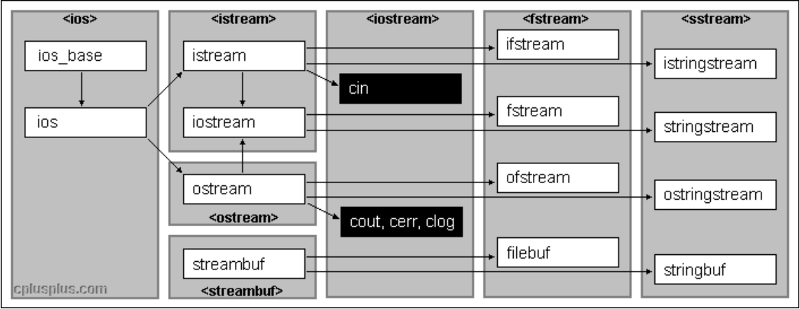

# 1.流的概念

“流”，即“流动”的意思，是物质从一处向另一处流动的过程。在计算机这边通常是指对一种有序连续且具有方向性的数据的抽象描述。

`C++` 中的流一般指两个过程的统一：

-   信息从外部输入设备（键盘）向计算机内部（内存）输入
-   计算机内部（内存）向外部输出设备（显示器）输出信息

这种输入输出的过程被形象的比喻为“流”，其具有有序性、连续性、方向性。

而为了实现这种流动，`C++` 定义了 `I/O` 标准类库，每个类都称为流类。

# 2.C 的输入输出

`C` 语言中最常使用输入/输出方式就是 `scanf()/printf()` 

-   `scanf()`：从标准输入设备（一般指键盘）读取字符数据，并将值通过指针和一定的格式存放在变量中

-   `printf()`：将指定的字符数据通过宽度输出和精度输出控制，来输出到标准输出设备（一般指屏幕）

`C` 语言借助了相应的输入/输出缓冲区（缓冲区这里涉及到一点系统的知识，您可以去看看我的 `Linux` 系列博文）来辅助进行输入/输出。

输入/输出缓冲区的意义：

1.   屏蔽低级 `I/O` 的实现：低级 `I/O` 的实现依赖于操作系统本身内核的实现（例如：`Linux` 的 `IO` 系统调用），如果能屏蔽这部分在系统调用上的差异，就更容易写出可移植的程序
2.   实现“行”读取的行为：计算机没有“行”这个概念，有了缓冲区就可以定义出“行”的概念，读取一行就是指解析缓冲区的内容返回一个“行”

但是 `C` 语言的输入输出在面对对象和泛型上有些吃力，因此 `C++` 就新构建了流类。

# 3.C++ 的输入输出

`C++` 系统实现了庞大的流类库，其中 `ios` 为基类，其他类都是直接或间接派生自 `ios` 类。

[](https://legacy.cplusplus.com/reference/)

## 3.1.C++标准 IO 流

`C++` 标准库提供了 `4` 个全局流对象 `cin`、`cout`、`cerr`、`clog`：

-   使用 `cin` 进行标准输入（数据通过键盘输入到内存中）
-   使用 `cout` 进行标准输出（数据从内存流向显示器）
-   使用 `cerr` 进行标准错误输出
-   使用 `clog` 进行日志输出

从类继承的图中可以看出：`cout`、 `cerr`、`clog` 是同属于 `ostream` 类的三个不同的对象，因此这三个对象的内部原理基本没有区别，只是应用场景和一些细节不同。

1.   `cin` 将键盘输入的数据保存在缓冲区中，当要提取时，就从缓冲区中拿。如果一次输入较多，会留在缓冲区中慢慢使用，如果输入发生错误，必须在回车之前修改，如果回车键按下就无法挽回了。只有把输入缓冲区中的数据取完后才会要求输入新数据。

     而输入的数据类型与要提取的数据类型不一致时出错，出错仅仅在流的状态字 `state` 字段中将对应位进行置位操作（置为 `1` 即可），但程序依旧继续运行。

     ```cpp
     //使用 cin 过程中出错并且处理的过程 
     #include <iostream> //streamsize
     #include <string>
     #include <limits> //numeric_limits
     
     using namespace std;
     
     int main()
     {
     	int number = 0;
     	cin >> number;
     	if (cin.fail()) //判断 cin 的状态，若 cin 为错误状态则返回 true, 正常状态则返回 false
     	{
     		cout << "发生错误" << endl;
     		cin.clear(); //清除cin的错误状态（重要）
     		in.ignore(numeric_limits<streamsize>::max(), '\n');  //忽略缓冲区中的所有字符，直到遇到换行符为止（重要）
     	
     		/* 
     		(1)std::numeric_limits 是一个模板类，用于获取各种数值类型（如整数、浮点数等）的特征信息 
     		(2)std::streamsize 是一个类型，用于表示输入/输出流操作的字节数或字符数的整数类型，通常情况下等同于 std::ptrdiff_t，也就是指针之间的差值类型
     		*/
     	}
     	else
     	{
     		cout << "number:" << number << endl;
     	}
     
     	//如果不清除状态，代码后续的 cin 都不会被执行，并且原先的输入数据仍然留在缓冲区中
     	//如果清除状态后，没有清除缓冲区，则原先留在缓冲区的数据会被 cin 继续读取
     	char character = 0;
     	cin >> character;
     	cout << "character:" << character << endl;
     	return 0;
     }
     ```

2.   空格和回车都可以作为数据之间的分格符，所以多个数据可以在一行输入，也可以分行输入。但如果是字符型或字符串，则空格（`ASCII` 码为 `32`）无法用 `cin` 输入，字符串中也不能有空格，回车符也无法被读入（这里可以了解一下 `C++` 的原始字符串）。

     ```cpp
     //cin 无法直接获取空格字符和回车字符
     #include <iostream>
     #include <string>
     using namespace std;
     
     int main()
     {
     	string str;
     	cin >> str;
     	cout << "str:" << str; //输入空格字符和换行字符无效
     	return 0;
     }
     ```

     这也使得读取读取带有空格的长字符串成为困难，因此可以使用 `string::getline()` 替代 `>>` 输入：

     ```cpp
     //string 的成员对象 cin 的输入用法
     #include <iostream>
     #include <string>
     using namespace std;
     
     int main()
     {
     	string str;
     	char ch = 0;
     
     
     	//第一种输入（跳过输入流中的所有空格字符，直到遇到非空格字符为止，开始读取）
     	cout << "第一种输入:" << '\n';
     	for (int i = 0; i < 5; i++)
     	{
     		cin >> str;
     		cout << "str:" << str << '\n';
     		ch = cin.get(); //只读取一个字符，去除换行符（这里可以不用，是因为就算被 str 读取了也会被跳过）
     	}
     	//ch = cin.get(); //如果上面循环中的 ch = cin.get(); 不用那么这里就应该加上 ch = cin.get(); 否则影响后面输入
     
     
     	//第二种输入（跳过输入流中的所有 ',' 字符，直到遇到非 ',' 字符为止，开始读取）
     	cout << "第二种输入:" << '\n';
     	for (int i = 0; i < 5; i++)
     	{
     		getline(cin, str, ',');
     		cout << "str:" << str << '\n';
     		if (i == 5)
     			break;
     		ch = cin.get(); //只读取一个字符，去除换行符
     	}
     
     
     	//第三种输入（一直读取输入，直到遇到换行符，并且直接抛弃换行符，不放回输入缓冲）
     	cout << "第三种输入:" << '\n';
     	getline(cin, str);
     	cout << "str:" << str << '\n';
     
     	return 0;
     }
     ```

     >   注意：`getline` 有两个版本，还挺乱的...

3.   `cin` 和 `cout` 可以直接输入和输出内置类型数据，原因：标准库已经将所有内置类型的输入方法和输出方法全部重载了。对于自定义类型，若要支持 `cin` 和 `cout` 的标准输入输出，需要对 `<<` 和 `>>` 进行重载

4.   `istream` 类型对象可以转换为逻辑条件判断值，使用 `while(cin >> i){/*...*/}` 去流中提取对象数据时, 调用的是 `istream& operator >>()`，但其返回值是 `istream` 类型的对象，而这里可以直接做逻辑条件值的原因是：`istream` 对象自动调用了 `operator bool()`（类似隐式类型转载）。因此如果接收流失败，或者有结束标志，则可以返回转化后的 `bool` 类型，值为 `false`，正常读取则返回 `true`。

     `operator bool()` 的本质是将自定义类型转化为内置类型，这是我们第一次遇到这种情况。以往我们都是自定义类型转自定义类型的，内置类型转内置类型的，没有尝试过自定义类型转化为内置类型（不过内置类型转化为自定义类型是有的，构造函数就可以做到，例如：`std::string str = "limou"`），这种行为默认不支持，即便用户使用强制类型转化也做不到。

     但用户可以借助 `operator bool()` 这来达到逆向转化的目的（其他的也有 `operatou int()` 等），可以让用户有更为强大的转化方法。

     ```cpp
     //自定义类型转为内置类型
     #include <iostream>
     using namespace std;
     
     class Data
     {
     public:
         operator int()
         {
             return _data2;
         }
     private:
         int _data1 = 10;
         int _data2 = 20;
     };
     int main()
     {
         Data d;
         int number = d;
         cout << number << '\n';
         return 0;
     }
     ```

     有这个重置也可以玩出一些比较“奇怪”的玩法：

     ```cpp
     //通过自定义转化来控制循环
     #include <iostream>
     using namespace std;
     
     class Data
     {
     	friend istream& operator>>(istream& in, Data& d);
     	friend ostream& operator<<(ostream& out, const Data& d);
     
     public:
     	operator bool() const
     	{
     		if (_data1 == 0)
     			return false;
     		else
     			return true;
     	}
     
     private:
     	int _data1 = 10;
     	int _data2 = 20;
     };
     
     istream& operator>>(istream& in, Data& d)
     {
     	in >> d._data1 >> d._data2;
     	return in;
     }
     
     ostream& operator<<(ostream& out, const Data& d)
     {
     	cout << d._data1 << "-" << d._data2 << '\n';
     	return out;
     }
     
     int main()
     {
     	Data d;
     	while (d) //如果用户输出了 _data1 为 0，则停止循环
     	{
     		cin >> d;
     		cout << d;
     	}
     	return 0;
     }
     ```

     如果在该重载前加上 `explicit` 就会不允许隐式类型转化，但允许强制类型转化。

     需要注意的是，库内不是所有类都有这个重载的。

5.   关于 `sync_with_stdio(false)` 的使用：在 `C++` 中 `sync_with_stdio(false)` 是一种提升 `cin`、`cout` 效率的手段。尽量在使用 `cin`、`cout` 前调用 `sync_with_stdio(false)`，因为 `cin`、`cout` 的特性在调用 `sync_with_stdio(false)` 前后有一定变化。调用 `sync_with_stdio(false)` 后，`scanf()`、`printf()` 和 `cin`、`cout` 等混用将存在输入顺序/输出顺序与调用顺序不一致的问题，`sync_with_stdio(false)` 属于不可逆操作。

>   补充：终止字符输入的方法主要有两种，比较暴力的就使用 `[ctrl+c]`，而更为正常的操作是 `[ctrl+z+enter]`，相当于流读取到结束标志。

## 3.2.C++文件 IO 流

`C++` 根据文件内容的数据格式分为二进制文件和文本文件。采用文件流对象操作文件的一般步骤：

1.   定义一个文件流对象
     -   `ifstream ifile`（只输入）
     -   `ofstream ofile`（只输出）
     -   `fstream iofile`（既输入又输出）
2.   使用文件流对象的成员函数打开磁盘文件，使得文件流对象和磁盘文件之间建立联系
3.   使用流提取运算符和流插入运算符对文件进行读写操作，或直接使用成员函数进行读写
4.   关闭文件对象，释放资源（有析构函数的存在，因此可以不显示调用）

```cpp
//文件流演示
#include <string>
#include <fstream>
#include <iostream>
using namespace std;

struct Data
{
	int _data1;
	int _data2;
	int _data3;
};

struct Serverinfo
{
	char _address[32]; 
	//不能使用 string，否则就变成写入指向字符串的指针信息了，
	//而不是字符串本身，在 string 释放后就会导致指针变成野指针，
	//读取的时候就会变成野指针解引用，因此二进制读写就不要使用这种方式，
	//但是文本输入不会在这方面出问题，因为会先转化为字符串再写入

	int _port;
	Data _data;
};

class ConfigManager
{
public:
	ConfigManager(const char* fileName)
		: _fileName(fileName)
	{}

	void WriteBin(const Serverinfo& info)
	{
		ofstream ofs(_fileName, ofstream::out | ofstream::binary); //二进制输入
		ofs.write((char*)&info, sizeof(info));
	}

	void ReadBin(Serverinfo& info)
	{
		ifstream ifs(_fileName, ofstream::in | ofstream::binary); //二进制输入
		ifs.read((char*)&info, sizeof(info));
	}

	void WriteText(const Serverinfo& info)
	{
		//C 语言需要不断转化为字符串再读写，但是 C++ 通过运算重载自动化了这个过程
		ofstream ofs(_fileName); //文本输入
		ofs << info._address << " "
			<< info._port << " "
			<< info._data._data1 << " "
			<< info._data._data2 << " "
			<< info._data._data3 << '\n';
	}

	void ReadText(Serverinfo& info)
	{
		ifstream ifs(_fileName);
		ifs >> info._address
			>> info._port
			>> info._data._data1
			>> info._data._data2
			>> info._data._data3;
	}

private:
	string _fileName;
};

int main()
{
	Serverinfo winfo = { "190.0.0.0", 80, {1, 2, 3} }; //服务器的信息

	Serverinfo rinfo1; //读取服务器的信息
	ConfigManager cmb("limouBin"); //信息文件路径
	cmb.WriteBin(winfo); //写入信息
	cmb.ReadBin(rinfo1);
	cout << rinfo1._address << "-" << rinfo1._port << ":"
		<< rinfo1._data._data1 << "-"
		<< rinfo1._data._data2 << "-"
		<< rinfo1._data._data3 << '\n';

	
	Serverinfo rinfo2; //读取服务器的信息
	ConfigManager cmt("limouText.txt"); //信息文件路径
	cmt.WriteText(winfo); //写入信息
	cmt.ReadText(rinfo2);
	cout << rinfo2._address << "-" << rinfo2._port << ":"
		<< rinfo2._data._data1 << "-"
		<< rinfo2._data._data2 << "-"
		<< rinfo2._data._data3 << '\n';

	return 0;
}
```

# 4.StringStream

在 `C` 中若想要将一个整形变量的数据转化为字符串格式

-   使用 `itoa()`
-   使用 `sprintf()`

但是都需要给出保存结果的空间大小，而空间的大小不容易界定，在转化格式不匹配时，还会得到错误的结果甚至是程序崩溃，因此 `C++` 又设计了新的 `sstream` 头文件，该文件包含四个类：

1.   `istringstream`：进行流的输入
2.   `ostringstream`：进行流的输出
3.   `stringstream`：进行流的输入输出操作

我们主要介绍 `stringstream`，该类在其底层维护了一个 `string` 类型的对象用来保存结果。

## 4.1.将数值类型数据格式化为字符串

```cpp
//将数值类型数据格式化为字符串
#include <sstream>
#include <iostream>
using namespace std;

int main()
{
    string str;
    stringstream s;

    //将一个整形变量转化为字符串，存储到 string 类对象中
    int int_a = 114514;
    s << int_a;
    s >> str;
    cout << str << '\n';
    cout << s.str() << '\n'; //str() 返回 stringsteam 中管理的 string 成员

    //多次转换时，必须使用 clear() 将上次转换状态清空掉
    //stringstreams 在转换结尾时（即最后一个转换后），会将其内部状态设置为 badbit
    //因此下一次转换是必须调用 clear() 将状态重置为 goodbit 才可以转换
    //但是 clear() 不会将 stringstreams 底层字符串清空掉
    //如果不将 stringstream 底层管理 string 对象设置成 "",
    //多次转换时，会将结果全部累积在底层 string 对象中
    s.str("");
    s.clear();

    //将一个浮点变量转化为字符串，存储到 string 类对象中
    double d = 3.14159;
    s << d;
    s >> str;
    cout << str << '\n';
    cout << s.str() << '\n'; //str() 返回 stringsteam 中管理的 string 成员
    
    return 0;
}
```

## 4.2.字符串拼接

```cpp
//字符串拼接
#include <sstream>
#include <iostream>
using namespace std;

int main()
{
	stringstream sstream;
	//将多个字符串放入 sstream 中
	sstream << "first" << " " << "string,";
	sstream << " second string";
	cout << "strResult is: " << sstream.str() << endl;
	
	//清空 sstream
	sstream.str("");
	sstream << "third string";
	cout << "After clear, strResult is: " << sstream.str() << endl;
	return 0;
}
```

## 4.3.序列化和反序列化数据

```cpp
//序列化和反序列化数据
#include <sstream>
#include <iostream>
using namespace std;

struct Date
{
    int _year = 2023;
	int _month = 12;
	int _day = 19;
};
istream& operator>>(istream& in, Date& d)
{
    return in >> d._year >> d._month >> d._day;
}
ostream& operator<<(ostream& out, const Date& d)
{
    return out << d._year << " " << d._month << " " << d._day;
}

struct ChatInfo
{
    string _name = "name";      //名字
    int _id = 0;                //id
    Date _date = { 2000,1,1 };  //时间
    string _msg = "msg";        //聊天信息
};

int main()
{
    //1.结构信息序列化为字符串
    ChatInfo winfo = { "limou", 114514, { 2023, 12, 19 }, "今天晚上吃什么？" };
    ostringstream oss;
    oss << winfo._name << " "
        << winfo._id << " " 
        << winfo._date << " "
        << winfo._msg;

    string str = oss.str();
    cout << str << '\n';
    //通过网络，将这个字符串发送给对象
    //一般会选用 Json、xml 等方式进行更好的支持（是描述信息用的文件）
    
    //2.字符串解析成结构信息
    ChatInfo rInfo;
    istringstream iss(str);
    iss >> rInfo._name >> rInfo._id >> rInfo._date >> rInfo._msg;
    cout << "-------------------------------------------------------" << '\n';
    cout << "姓名:" << rInfo._name << "(" << rInfo._id << ") " << '\n';
    cout << "时间:" << rInfo._date << '\n';
    cout << "消息:" << rInfo._name << ":>" << rInfo._msg << endl;
    cout << "-------------------------------------------------------" << '\n';
    return 0;
}
```
