# 1.图概念

## 1.1.图的定义

图 $G$ 由两个集合 $V$ 和 $E$ 构成，记为 $G = (V, E)$，其中：

1.   $V(G)$ 为顶点的有穷非空集合
2.   $E(G)$ 为 $V$ 中顶点偶对（边/弧长）的有穷集合

其中，我们规定：

1.   $E(G)$ 是无方向的边 $(v, v')$，则 $G$ 为无向图
2.   $E(G)$ 是有方向的弧 $<v, v'>$ 则 $G$ 为有向图


图用于解决一些交通网络、人物社交关系等等问题十分方便，尤其是求最短路径和最小生成树，这在实践中有较大的意义。

>   补充：树是特殊的图（无环但连通的图），而图不一定是树。树关注的是结点和其中存储的值，而图更加关注的是顶点和权值，尤其是权值更为重要，本质上来说树是一种存储结构，而图是一种表示结构。

## 1.2.图的术语

-   **顶点、边**：一般使用 $n$ 表示顶点个数，用 $e$ 表示边的数目

-   **子图、孤岛**：如果对于两个集合 $G = (V, E)$ 和 $G' = (V', E')$，如果有 $V' \subseteq V, E' \subseteq E$，则称 $G$ 为 $G'$ 的子图（子图有原图的一部分顶点和一部分顶点偶对）。如果只有一个顶点，该顶点没有顶点对，则成为“孤岛”，也就是特殊的子图

-   **完全图**：无向图若具有 $n(n - 1)/2$ 条边就称为“无向完全图”，有向图若具有 $n(n-1)$ 则称为“有向完全图”。实际上，就是将所有的顶点都链接起来，达到顶点对集合的大小最大化

-   **稀疏图和稠密图**：这个是相对的概念，有较少的顶点对就被称为“稀疏图”，有较多的顶点对就被称为“稠密图”

-   **权和网**：每一条顶点对都可以带上具有某种意义的数值，称为“权值”，具有权值的图也被称作“网”，权值和现实问题有很强烈的联系（另外权值可以为负数，权值的取值范围也会影响到后续讲解的一些算法）

-   **顶点对/顶点偶对**：无向图的边可以根据两个点表示为顶点对 $(v, v') \in E$，有向图的边可以根据两个点表示为顶点对 $<v, v'> \in E$（在本文有些地方我会把边或弧统称为顶点对，暗指有可能是无向图的边，也有可能是有向图的弧）

-   **邻接点**：对于两个点 $V$ 和 $V’$，若有 $(v, v') \in E$ 或者 $<v, v'> \in E$，则两点称为“邻接点”（其实就是两个顶点有链接形成顶点对），也称顶点对依附于两个顶点，或者说顶点对和两个顶点相关联（对有向图中，$<A, B>$ 里称“顶点 $A$ 邻接到顶点 $B $”和“顶点 $B$ 邻接自顶点 $A$”）

-   **度**：对于顶点 $V$ 有多少条相关联的边的数目，记着 $TD(v)$，其中在有向图中还将一个顶点的度分为入度 $ID(v)$ 和出度 $OD(v)$。一般的，如果有 $n$ 个顶点，$e$ 条边的图，满足关系 $e = \frac{1}{2} \displaystyle\sum_{i = 1}^{n}TD(v_i)  = \frac{1}{2}\displaystyle\sum_{i = 1}^{n}(ID(v_i) + OD(v_i))$

-   **路径和路径长度（无权路径长度、带权路径长度）**：路径是指一个顶点 $v$ 可以到达另外一个顶点 $v'$ 之间的顶点序列 $V = \{v = v_{i}, v_{i+1}, v_{i+2}, ..., v_{i+n} = v' \}$，而路径长度就是一条路径上经过的边或者弧的数目，也就是 $V.size() - 1$，如果顶点序列没有出现重复的元素，就是一个简单路径。

    (1)非权路径长度：若路径长度不考虑带权值，就是非权路径长度，结果为边或弧的个数（相当于 $1+1+...+1$）

    (2)带权路径长度：若路径长度要考虑带权值，就是带权路径长度，结果为路径上所有权值之和（相当于 $1×w_{1} + 1×w_{2} + ... + 1×w_{n-1}$）

-   **最短路径（`shortest path`**）：路径上边的权值之和最小的路径，一般针对的都是有向带权的网

-   **回路/环**：第一个顶点和最后一个顶点相同的路径就是 回路/环，如果路径（顶点序列）中没有出现重复的元素（除了第一个和最后一个顶点可以重复），就是一个简单回路/环，图复杂的原因也在于回路的出现

-   **连通/强连通**：如果图中一个顶点到另外一个顶点之间的路径（顶点序列）存在（无向图就是有链接，有向图就是两个方向都有），则称两顶点之间“连通/强连通”（无向图的连通比较简单，除非有孤岛的出现，而有向图的连通就比较困难）

-   **连通图、联通分量**：而如果对一个无向图来说，任意两个顶点都是连通的，则称为“连通图”。而如果一个图不是连通图，那么可以尽可能找到图中连通的子图，该子图被称为“图的连通分量”

    

-   **强连通图、强连通分量**：而如果对一个有向图来说，任意两个顶点都是连通的，则称为“强连通图”。而如果一个图不是强连通图，那么可以尽可能找到图中强连通的子图，该子图被称为“图的强连通分量”

    

-   **连通图的生成树（`spanning tree`）**：对于有 $n$ 个顶点的连通图 $G$，其连通分量 $g$ 若包含连通图 $G$ 中所有的节点，并且拥有 $n - 1$ 条边，则该连通分量也被称为“生成树”，并且如果添加了一个边，就必点构成一个回环（最少的线连通起来的连通子图，是连通图的连通分量中连接最少的）

-   **最小生成树（`minimum spanning tree`）**：生成树上所有权值之和达到最小则为最小生成树

    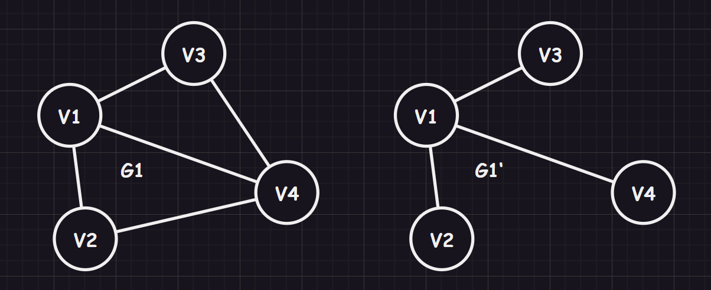

    >   补充：根据图的顶点个数和边个数可以反向得到一些结论
    >
    >   1.   若一个图有 $n$ 个顶点和小于 $n - 1$ 条边，则为非连通图
    >   2.   若一个图有 $n$ 个顶点和大于 $n - 1$ 条边，则图中存在环
    >   3.   若一个图有 $n$ 个顶点和等于 $n - 1$ 条边，则不一定为生成树

-   **强连通图的有向树（`Directed tree`）**：有向图中有且仅有一个顶点的入度为 $0$，其余顶点的入度均为 $1$，从树根到任一顶点有一条有向通路，则该有向图被称为“有向树”（最少的线连通起来的强连通子图，是强连通图的强连通分量中连接最少的）

    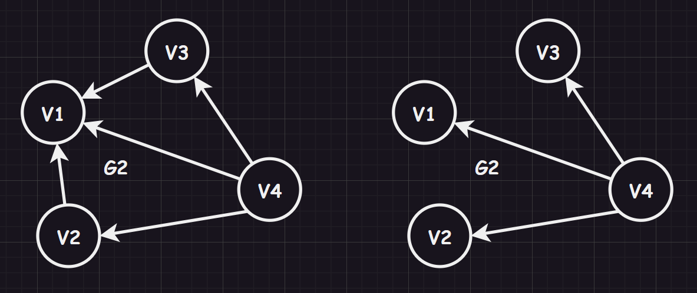

# 2.图接口

这里给出几个关于图需要实现的大致接口，在文章的最后会有详细的代码编写，您简单翻阅一下即可，不要深入。

## 2.1.邻接矩阵类模板

```cpp
//am_graph.hpp 邻接矩阵类模板
#pragma once

#include <vector>
#include <iostream>
#include <string>
#include <map>
#include <stdexcept>
#include <climits>
#include <cstdio>

namespace limou
{
	using std::vector;
	using std::string;
	using std::cout;
	using std::map;
	using std::invalid_argument;

	template <
		typename VertexType = char, //顶点数据类型
		typename WeightType = int, //权重数据类型
		WeightType MAX_W = INT_MAX, //表示无穷的数
		bool Direction = false //判断是否有向
	>
	class AMGraph
	{
		/*
		* 无向图或有向图（考虑带权值）邻接矩阵模板类，
		* 测试有三种方法：IO 输入、文件读取样例、手动在代码中添加
		*/
	public:
		AMGraph(const vector<VertexType>& arr, size_t arrSize)
		{
			/* 根据顶点序列，初始化邻接矩阵和其他相关信息 */
		}

		size_t GetVertexIndex(const VertexType& v)
		{
			/* 返回顶点对应的索引，并且有检查机制，防止用户输错顶点 */
		}

		void AddEdge(const VertexType& src, const VertexType& dst, const WeightType& w)
		{
			/* 添加边以及对应的权值 */
		}

		void Print()
		{
			/* 打印顶点集合和邻接矩阵来测试（只限于 int 类型的顶点数据） */
		}

	private:
		vector<VertexType> _vertexs; //顶点表
		vector<vector<WeightType>> _weights; //邻接矩阵（无向图的时候表示链接关系，有向图的时候不仅可以查看是否有链接，还可以查看权值）
		map<VertexType, int> _indexMap; //顶点映射下标（主要是用来提高效率的）
	};

	void TestGraph()
	{
        /* 测试邻接矩阵 */
    }
}
```

## 2.1.邻接表类模板

```cpp
//al_graph.hpp 邻接表类模板
#pragma once
#include <vector>
#include <iostream>
#include <string>
#include <map>
#include <stdexcept>

namespace limou
{
    using std::vector;
    using std::string;
    using std::cout;
    using std::map;
    using std::invalid_argument;
    
	template <typename WeightType = int>
	struct Edge
	{
        /*
        * 组织一条顶点对，主要存储终点和权值（也可以有源点）
        */
		//int _srci; //源点（可选，多重表就可以用这个）
		int _dsti; //终点
		WeightType _weig; //权值
		Edge<WeightType>* _next; //链接指针

		Edge(const int& dsti, const WeightType& weig)
			: _dsti(dsti), _weig(weig), _next(nullptr)
		{}
	};

	template <
		typename VertexType = char, //顶点数据类型
		typename WeightType = int, //权重数据类型
		bool Direction = false //判断是否有向
	>
	class ALGraph
	{
		/*
		* 无向图或有向图（考虑带权值）邻接表模板类，
		* 测试有三种方法：IO 输入、文件读取样例、手动在代码中添加
		*/
	public:
		ALGraph(const vector<VertexType>& arr, size_t arrSize)
		{
			/* 根据顶点序列，初始化邻接表和其他相关信息 */
		}

		size_t GetVertexIndex(const VertexType& v)
		{
			/* 返回顶点对应的索引，并且有检查机制，防止用户输错顶点 */
		}

		void AddEdge(const VertexType& src, const VertexType& dst, const WeightType& w)
		{
			/* 添加边以及对应的权值 */
		}

		void Print()
		{
			/* 打印顶点集合和邻接表来测试（只限于 int 类型的顶点数据） */
		}

	private:
		vector<VertexType> _vertexs; //顶点表
		map<VertexType, int> _indexMap; //顶点映射下标（主要是用来提高效率的）
		vector<Edge<int>*> _tables; //邻接表（有向图时只存储出度弧的正邻接表）
	};

	void TestALGraph()
	{
        /* 测试邻接表 */
	}
}
```

# 3.图细节

## 3.1.存储结构

根据图的定义，很容易就会想到一种方案：将顶点序列和顶点对序列直接使用 `vector` 存储起来。

```cpp
//图的一种有问题的存储结构
#include <vector>
#include <utility>
using std::vector;
using std::pair;

template <
	typename VertexType = char, //顶点数据类型
	typename WeightType = int, //权重数据类型
	bool Direction = false //判断是否有向
>
class Graph
{
private:
	vector<VertexType> _vertexs; //顶点表
	vector<pair<VertexType, VertexType>> _edges; //顶点对表
};
```

但是这种存储结构有点问题：

1.   两个顶点是否相连需要遍历 `_edges` 才可得知
2.   相连的权值怎么存储？怎么快速得到权值？
3.   对于有向图，怎么判断方向？

因此我们就需要探索其他的存储结构，其中邻接矩阵和邻接表是相辅相成的结构。

>   注意：下面我只是探讨存储结构的大致思路和图解，最后实现的过程中，我会结合多种存储结构来书写图的多种类模板（也就是开头给出的类模板和接口声明）。

### 3.1.1.邻接矩阵（adjacent matrix）

```cpp
//邻接矩阵
#include <vector>
#include <map>
#include <climits>
using std::vector
using std::map

template <
	typename VertexType = char, //顶点数据类型
	typename WeightType = int, //权重数据类型
	WeightType MAX_W = INT_MAX, //表示无穷的数
	bool Direction = false //判断是否有向
>
class AMGraph
{
private:
	vector<VertexType> _vertexs; //顶点表
	vector<vector<WeightType>> _weights; //邻接矩阵（无向图的时候表示链接关系，有向图的时候不仅可以查看是否有链接，还可以查看权值）
	map<VertexType, int> _indexMap; //顶点映射下标（主要是用来提高效率的）
};
```

#### 3.1.1.1.无向图

对于无向图，我们可以使用一个字符数组存储顶点数据，使用一个二维数组来存储两个结点之间的关系，用 `1` 表示两顶点有边，`0` 表示两顶点无边（也可以用 `int` 的最大值 `INT_MAX` 来代表 `0`，具体看实现）。

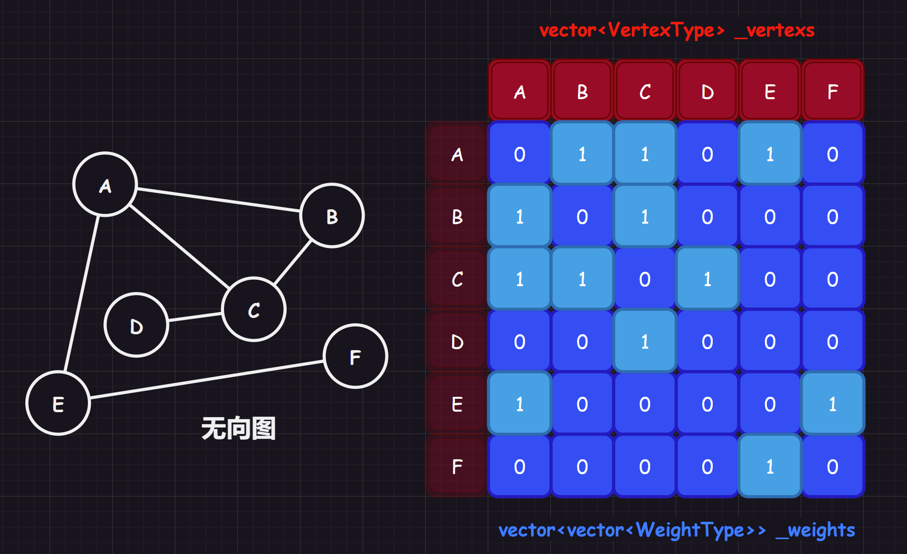

1.   无向图的邻接矩阵是对称的，且主对角线元素全为 `0`（因为顶点和自己没有边）
2.   顶点 `i` 的度 = 第 `i` 行(列)中 `1` 的个数
3.   完全图的邻接矩阵中，主对角元素为 `0`，其余全为 `1`

#### 3.1.1.2.有向图

有向图也是类似的实现，就是可能需要人为规定方向的规则，本系列文章的实现中认为：第 `i` 行和为一个顶点的出度，第 `j` 列和为一个顶点的入度。 


#### 3.1.1.3.带权图（网）

我们可以在 `int` 的二维数组存储权值，来构成网，而没有权值的边或弧一般使用 `int` 的最大值 `INT_MAX` 来代表（或者记作 $∞$）。


>   解析：邻接矩阵的优缺点
>
>   邻接矩阵的优点：
>
>   1.   快速判断两个顶点是否有顶点对，时间复杂度为 $O(1)$
>   2.   对于有向图可以快速查找权值
>   3.   适合稠密图的存储，比邻接表的密度高
>   4.   邻接矩阵对应唯一的一个图
>
>   邻接矩阵的缺点：
>
>   1.   增加和删除顶点困难，移动复制或扩容代价很大、步骤繁琐
>   2.   要得到每个顶点的度，需要时间复杂度为 $O(n)$
>   3.   占用空间大，对于稀疏图来说消耗大，时间复杂度为 $O(n^{2})$
>   4.   统计边的数目需要遍历二维数组才可得知，时间复杂度为 $O(n^{2})$

### 3.1.2.邻接表（adjacency list）

```cpp
//邻接表
#include <vector>
#include <list>
#include <utility>
using std::vector;
using std::list;
using std::pair;

template <
	typename VertexType = char, //顶点数据类型
	typename WeightType = int, //权重数据类型
	bool Direction = false //判断是否有向
>
class ALGraph
{
private:
	vector<
		pair<
			VertexType, list<pair<int, WeightType>>
		>
	> _vertexs;
};
```

有了前面的铺垫，我这里就简单给出邻接表的图解，实际上就是给使用顺序表存储每个顶点的链表，每个链表内存储的都是对应顶点的邻接点或者出度点/入度点在顺序表中的索引。


>   补充 `1`：上述的结构中存储的是出度的正邻接表，也可以存储入度的逆邻接表
>
>   补充 `2`：邻接表只存储了一个顶点的索引，而邻接多重表将一个顶点的索引改为存储边的两个顶点索引或者弧长、弧尾，这在某些操作中会更加方便，例如：标记某一条边或弧是否被访问过，删除一条边等。

>   解析：邻接表的优缺点
>
>   邻接表的优点：
>
>   1.   便于书写增加和删除顶点的代码
>   2.   可以快速统计边的数目，时间复杂度为 $O(n + e)$
>   3.   空间利用率较高，非常适合表示稀疏图，空间复杂度为 $(n + e)$
>
>   邻接表的缺点：
>
>   1.   判断两顶点是否有边的速度不如邻接矩阵快，需要去扫描其中一个顶点的边表，时间复杂度为 $O(n)$
>   2.   在有些情况判断一个结点的度比较困难，对于无向图顶点的度和有向图顶点的出度还好，但是得到入度就比较困难，需要遍历整个边表，时间复杂度为 $O(n + e)$，如果我们一开始定义边表是存储入度点的索引（也就是“逆邻接表”），则情况相反
>   3.   一个图有可能会产生不同的邻接表，取决于算法实现和输入顺序

### 3.1.4.十字链表（across linker）

```cpp
//十字链表
#include <vector>
using namespace std;

template <typename ArcType = int>
struct ArcBox
{
	int tailIndex, headInde;	//尾索引和头索引
	ArcType arc;				//携带的权值权值
	ArcBox* sameHead;			//相同头的弧
	ArcBox* sameTail;			//相同尾的弧
};

template <typename VertexType = char, typename ArcType = int>
struct VexNode
{
	VertexType data;					//顶点存储的数据
	ArcBox<ArcType>* firstHead;			//指向以该顶点为弧头的第一个顶点
	ArcBox<ArcType>* firstTail;			//指向以该顶点为弧尾的第一个顶点
};

template <typename VertexType = char, typename ArcType = int>
class OLGraph
{
private:
	vector<VexNode<VertexType, ArcType>> table;		//顶点表
};
```

这样的结构有些复杂，十字链表是专门用来方便求取有向图的出度和入度的。

顶点表包含：

-   每一个元素都包含顶点数据
-   指向以该顶点为头的第一个弧
-   指向以该顶点为尾的第一个弧

边表则包含：

-   该弧的头尾索引
-   指向下一个同弧头的顶点
-   指向下一个同弧尾的顶点

同样这里也只给出一个例子的图解：

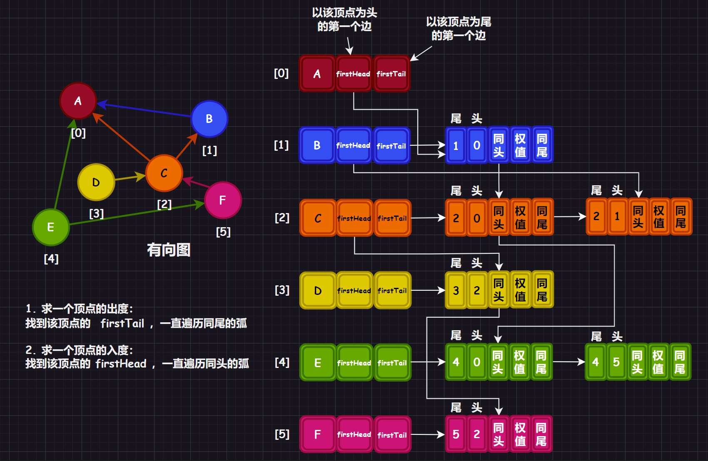

>   解析：十字链表的优缺点
>
>   方便求取有向图的出度和入度：
>
>   1. 求一个顶点的出度：找到该顶点的 `firstTail` ，一直遍历同尾的弧
>   1. 求一个顶点的入度：找到该顶点的 `firstHead` ，一直遍历同头的弧

## 3.2.图的遍历

### 3.2.1.深度优先遍历（BFS）

连通图的深度优先遍历（`BFS`）是树的先序遍历的推广：

1.   从起始顶点开始访问（并且标记为已访问 `true`），一直访问起始顶点的未被访问的邻接点
2.   邻接点被访问后，成为新的起始顶点，跳转步骤 `1`，直到遇到一个顶点的所有邻接点都被访问过的时候停下
3.   开始进行回溯（递归回来），返回前面被访问过，但是其还有邻接点没有被访问的顶点，跳转步骤 `1`
4.   最后图中所有的顶点都被访问过，搜索结束，得到深度搜索序列和深度优先生成树


>   补充：如果是非连通图，我们可以遍历一下顶点访问标记，查看有哪一个顶点没有标记，把这个顶点作为新的起点继续遍历，直到所有的标志位都被设置为 `true`

### 3.2.2.广度优先遍历（DFS）

连通图的深度优先遍历（`DFS`）是树的层序遍历的推广：

1.   从起始顶点开始访问，一直访问起始顶点的未被访问的所有邻接点
2.   所有邻接点被访问后，依顺序，每一个邻接点成为一个又一个新的起始顶点，跳转步骤 `1`，直到遇到一个顶点的所有邻接点都被访问过的时候停下
3.   最后图中所有的顶点都被访问过，搜索结束，得到广度搜索序列和广度优先生成树

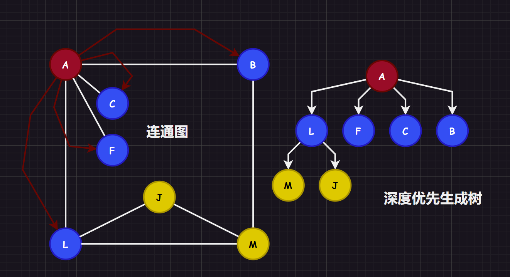

我们可以借助队列结构和标记位来访问顶点（和二叉树的层序遍历类似）：

1.   从图的起点入队（并且标记为已访问 `true`），取队头顶点进行访问
2.   将队头顶点出队，并且将队头顶点的未访问邻接点入队（也都标记为已访问）
3.   只要队不为空就跳转步骤 `1`，为空则停止得出 `DFS` 结果

>   补充 `1`：这里标记位被标记后不代表真的就在标记那一瞬间被访问了，而是可以保证该顶点在后续不会被其他顶点访问而已。
>
>   补充 `2`：如果是非连通图，我们可以遍历一下顶点访问标记，查看有哪一个顶点没有标记，把这个顶点作为新的起点继续遍历，直到所有的标志位都被设置为 `true`，这和前面非连通图的深度遍历的处理是一样的。

## 3.3.最小生成树

生成树说白了就是让 $n$ 个顶点以最小的链接（即 $n - 1$ 条）成为连通图。如果带上了权值，使得每一条顶点对的权值之和最小，则此时的生成树就是最小生成树。而求出最小生成树有两个十分有名的算法，两者都使用了逐步求解的贪心算法的思想，需要注意的是，贪心算法得出的结果不一定是最优解，但是接近最优解。

最小生成树的目的在于：尽可能使用最少的代价连通资源，这在一些城市电力传输规划很常见。

### 3.3.1.普里姆算法（Prim）

该算法使用了局部贪心思想，这个算法步骤如下：

1.   首先定义两个集合，一个集合 $X$ 只有起点元素（起点元素也是任意定义的，这说明该算法生成的结果也有可能不唯一），而除去起点元素的其他顶点元素则全部归属另外一个集合 $Y$
1.   在 $X$ 中找到元素，和 $Y$ 中的元素一一枚举链接，找到权值最小的顶点对 $(x, y)$ 作为最小生成树的一部分，然后将 $y$ 顶点加入到 $X$ 集合中（这样就可以保证一定不会出现环，毕竟要出现环就必须在一个顶点集合中有重复的顶点，而接下来两个集合的链接不可能出现 $X$ 中的元素又链接到 $X$ 元素的情况）
1.   重复步骤 `2` ，直到集合 $Y$ 为空，得到最小生成树

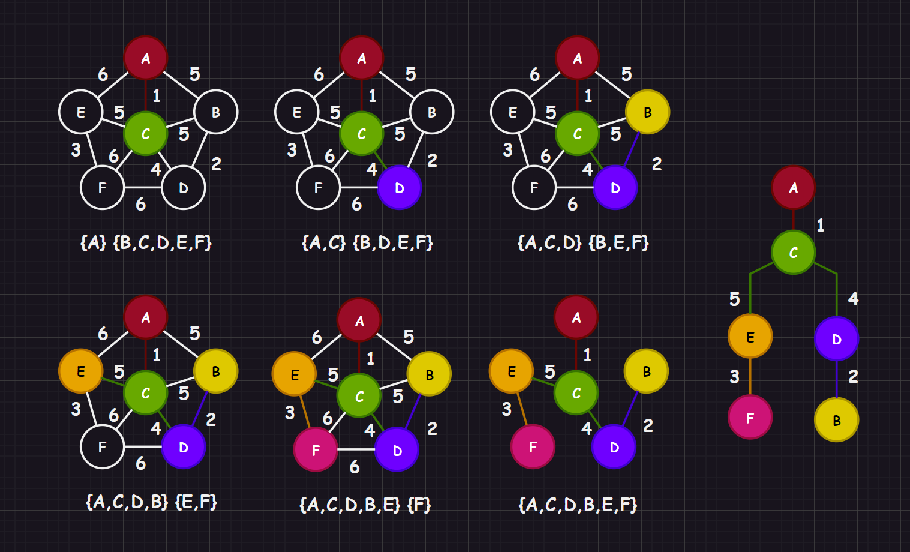

那么怎么找到最小权值的边呢？直接使用 `vector` 暴力查找可以么？可以，但是当两个集合中的元素趋近相等时，时间复杂度就会到达 $O(n^{2})$ ，因此还是推荐使用优先级队列，并且在其中还有一些值得注意的问题（在代码中会体现出来）。另外两个集合的顶点迁移表示可以用 `vector<bool>` 来表示，例如： `A` 从 `X` 移动到 `Y`，就设置 `X[A的下标] = true, Y[A的下标] = false`，这样的效率很高。

>   补充：为什么叫局部呢？因为 `Prim` 算法需要根据起点来得出对应的最小生成树，依赖于该点。

### 3.3.2.克鲁斯卡尔算法（Kruskal）

该算法也使用全局贪心思想，这个算法步骤如下：

1.   任给一个有 $n$ 个顶点的连通网络 $N = \{V, E\}$，首先构造一个由这 $n$ 个顶点组成、不含任何边的子图 $G = \{V, NULL\}$，其中每个顶点自成一个连通分量
2.   其次不断从 $E$ 中取出权值最小的一条边（若有多条权值相等则任取其一，这也说明该算法的结果很可能不唯一），若该边的两个顶点来自不同的连通分量（也就是没有形成环，在判断是否形成环的代码实现中，我借助了前面提及的并查集结构，因此在这方面上 `Prim` 算法思路更加精妙），则将此边加入到 $G$ 中
3.   重复步骤 `2`，直到所有顶点在同一个连通分量上，并且边数正好为 $n - 1$ 为止

也就是说：每次迭代时，选出一条具有最小权值，且两顶点不在同一连通分量上的边，加入生成树。

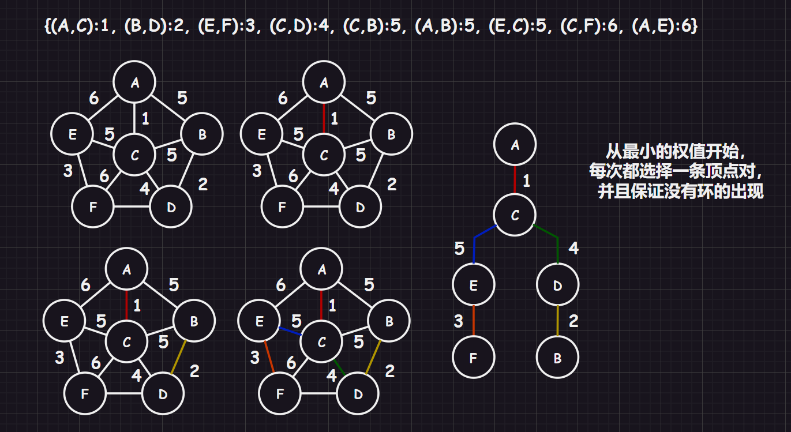

但是我们怎么判断是否有环的产生呢？有一种简单的思路，在选择下一条边之前，先判断是否和新加入的顶点构成连通，因为只要连通了，那再加入边就一定会构成环。但是这种实现很麻烦，效率也低下。

那怎么办呢？这个时候就可以使用并查集了，怎么用呢？在前面我提到过一个“划分省级”的题目，我们只需要将已选择的顶点对并到一个集合内，如果发现集合内已经拥有了该顶点，则此时就不能选择和这个顶点依赖的边。

>   补充：为什么叫全局呢？因为 `Kruskal` 算法无需根据起点来得出对应的最小生成树，依赖于全图。

## 3.4.最短路径

最短路径问题，实际就是在带权有向图 `G` 中的某一顶点出发，找出一条通往另一顶点的最短路径，“最短”也就是沿路径各边的权值总和达到最小。而求解最短路径的算法还有单源和多源之分，一个是求出一个起点的最短路径，另外一个是求出一个图中多个起点的最短路径。

### 3.4.1.迪杰斯特拉算法（Dijkstra）

`Dijkstra` [^3] 提出的 `Dijkstra` 算法适用于解决带权重的有向图上的单源最短路径问题，算法要求图中所有边的权重非负。一般在求解最短路径的时候都是已知一个起点和一个终点，所以使用 `Dijkstra` 算法求解过后也就得到了所需起点到终点的最短路径。

1.   针对一个带权有向图 $G(V, E)$，将所有顶点分为两组 $S\{...\}$ 和 $Q\{...\} = V - S$，$S$ 是已经确定最短路径的顶点集合，在初始时就可以将源节点 $s$ 放入，毕竟源节点到自己的代价是 $0$，$Q$ 为其余未确定最短路径的顶点集合
2.   每次从 $Q$ 中找出一个起点到该顶点代价最小的顶点 $u$ ，将 $u$ 从 $Q$ 中移出，并放入 $S$  中，对 $u$ 的每一个相邻顶点 $v$ 进行松弛操作（松弛操作即：对每一个相邻顶点 $v$ ，判断源节点 $s$ 到顶点 $u$ 的代价与 $u$ 到 $v$ 的代价之和是否比原来 $s$ 到 $v$ 的代价更小，若代价比原来小则要将 $s$ 到 $v$ 的代价更新为 $s$ 到 $u$ 与 $u$ 到 $v$ 的代价之和，否则维持原样）
3.   如此一直循环直至集合 $Q$ 为空，即所有节点都已经查找过一遍并确定了最短路径，至于一些起点到达不了的顶点在算法循环后其代价仍为初始设定的值，不发生变化

这里我用了两种画法：

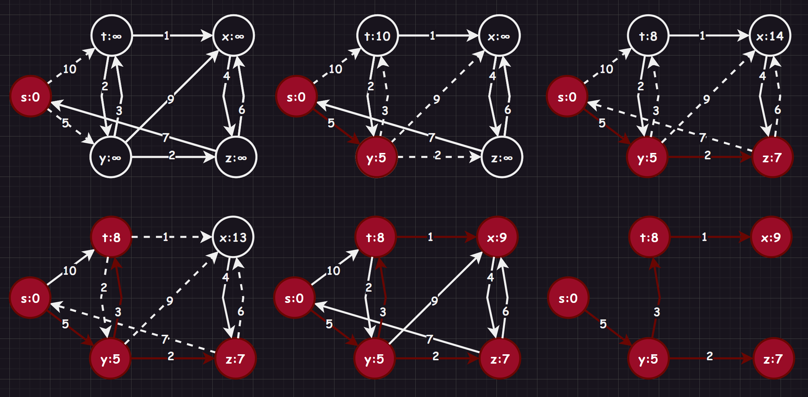

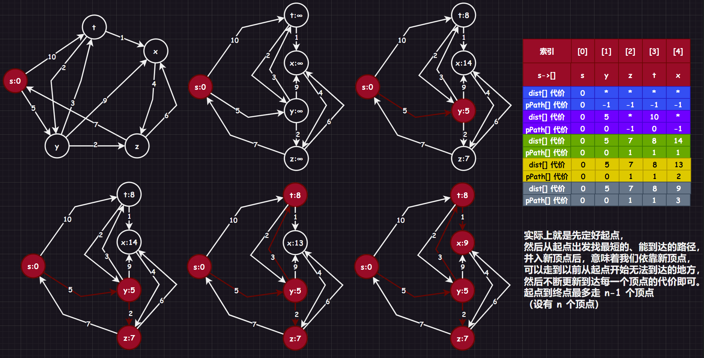

`Dijkstra` 算法每次都是选择 $Q\{...\} = V-S$ 中已确认最短的路径节点来进行更新（链接其他顶点），并加入 $S$ 中，所以该算法使用的是局部的贪心算法，时间复杂度为 $O(N^{2}),(N是顶点个数)$。

这个算法还是蛮复杂的。

### 3.4.2.贝尔曼-福特算法（Bellman-Ford）

`Dijkstra` 算法虽好，但是不支持负数权值的最短路径，而 `Bellman-Ford` 算法 [^4] 可以解决这一问题。该算法允许负权值的存在，并且思路相比 `Dijkstra` 算法更容易理解，但是效率会低下一些，时间复杂度为 $O(N · E),(N为顶点数,E为边数)$，而如果使用邻接矩阵实现的话时间复杂度还会降到 $O(N^{3}),(N是顶点个数)$，我在本系列中依旧使用邻接矩阵来实现。

其算法原理比较粗暴，每个顶点携带信息为 $(v_i, d_i + w_{ij})$，其中 $v_i$ 为到该顶点的上一个顶点下标，$d_i$为上一个顶点的权值和，$w{ij}$ 为两顶点对之间的权值，$d_i + w_{ij}$ 整体构成该顶点的新权值和（并且一开始的值为 $∞$，只有在遇到更小的权值和才会进行替换）。

规定好遍历顶点对的顺序，然后遍历每一条顶点对，对每个顶点对都进行松弛操作，更新顶点的权值和，在 $n$ 次松弛遍历中如果没有出现更新操作，则提前终止算法，表示找到最短路径。若超出 $n$ 次遍历，就说明存在负权回路，没有最短路径。

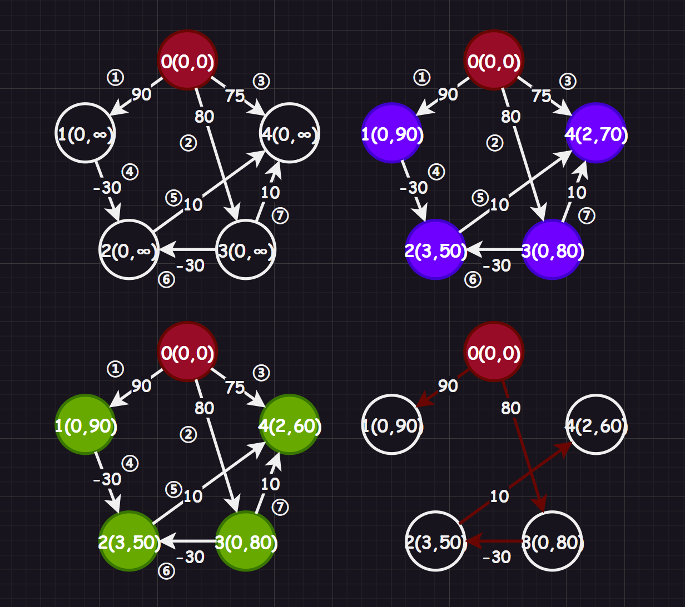

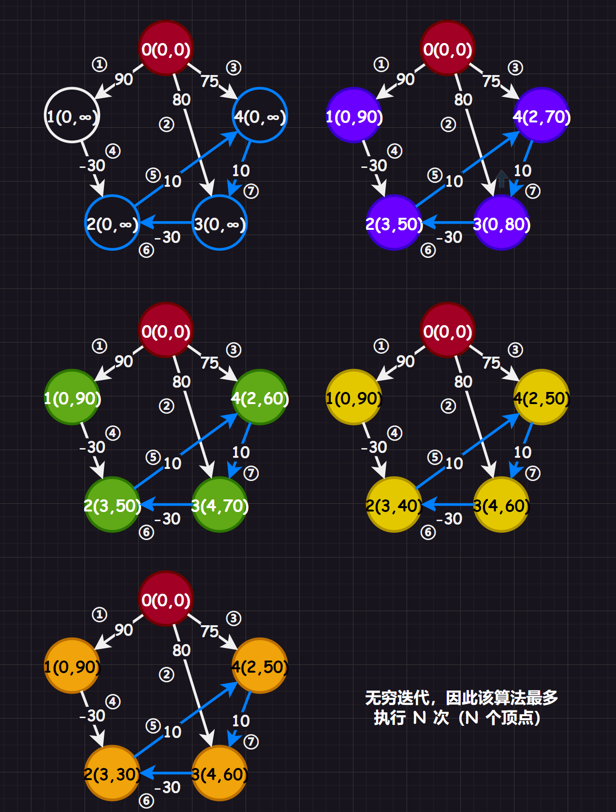

### 3.4.3.弗洛伊德算法（Floyd-Warshall）

`Floyd-Warshall` 算法 [^5]的原理是动态规划，操作步骤如下：

1.   待补充...

但是如果是单纯为了手写，大可不必如此麻烦，可以使用下面图解中的步骤：

>   补充：下述方法来源于我曾看过的一个[速通视频](https://www.bilibili.com/video/BV1tQ4y147pw?vd_source=4772b64d7a3cb1873f14bc0153c4de68)，应该是一种做题总结，您可以前去看一下...

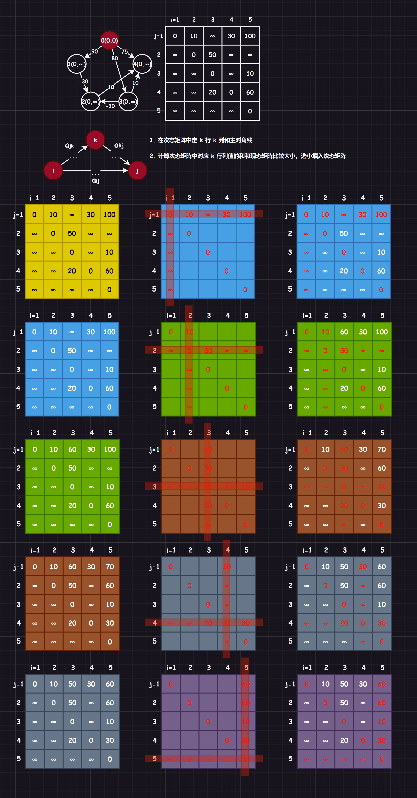

## 3.5.拓扑排序

图论中，拓扑排序（`Topological Sorting`）是一个有向无环图（`DAG`）的所有顶点的线性序列（必须针对有向无环图），该序列必须满足下面两个条件：

-   每个顶点出现且只出现一次

-   若存在一条从顶点 `A` 到顶点 `B` 的路径，那么在序列中顶点 `A` 出现在顶点 `B` 的前面

形成思路：

1.   从 `DAG` 图中选择一个没有前驱（即入度为 `0`）的顶点 `v` 并访问/输出
2.   从图中删除该顶点和所有以 `v` 为起点的有向边
3.   跳转步骤 `1` ，直到当前的 `DAG` 图为空或当前图中不存在无前驱的顶点为止（这种情况说明有向图中必然存在环）

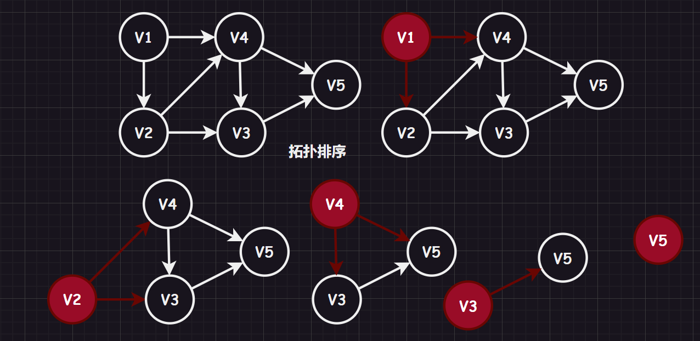

## 3.6.关键路径

### 3.6.1.AOE 网

在带权有向无环图中，以顶点表示事件，以有向边表示活动（以边上的权值表示完成该活动的开销），则称为“用边表示活动的网络（`activity on edge` 即：`AOE` 网）”，一个工程往往可以用一个 `AOE` 图来调整计划，达到效率优化的目的。

`AOE` 网满足以下的重要特征：

-   **源点**：有仅有一个入度为 `0` 的顶点，称为“开始顶点/源点”，它表示整个工程的开始
-   **汇点**：有仅有一个出度为 `0` 的顶点，称为“结束顶点/汇点”，它表示整个工程的结束
-   只有在某顶点所代表的事件发生后，从该顶点出发的各有向边所出去的活动才能开始（一对多）
-   只有在进入某顶点的各有向边所代表的活动都已结束时，该顶点所所出的事件才会发生（多对一）
-   有些活动是可以并行进行的，具体要看图

`AOE` 网最大的实际意义在于：

1.   求最短时间：估算完成整个工程的最少时间
2.   判关键活动：判断哪些活动是影响工程进度的关键活动，哪些活动是不影响工程进度的非关键活动（关键活动的提前或者延期会导致整个工程都提前或延期）

### 3.6.2.关键路径

完成工程的最短时间，是从源点到汇点所有路径中，带权路径长度最大的路径，也就是“关键路径”，关键路径上的活动被称为“关键活动”。

考虑极端情况，带权路径长度小的路径哪怕很快完成了，也会被其影响而进入阻塞，无法执行下一个事件后的活动。下图带权路径长度最大的路径为 $<V1,v3>$，带权路径长度为 `10000`，只有这条关键路径走完了，才可以考虑其他路径。

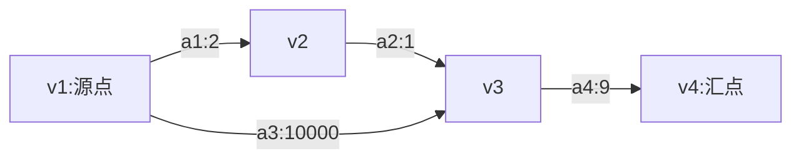

>   提醒 `1`：我们之前提到的术语“路径长度”分为两种，一是“无权路径长度（边弧个数）”，二是“带权路径长度（权值之和）”，强调这一点是为了消解一些术语混用导致的疑惑。
>
>   提醒 `2`：关键路径的无权路径长度，在所有的路径中不一定是最长的，要注意这里是带权路径长度，很容易发生混淆！

### 3.6.3.描述量

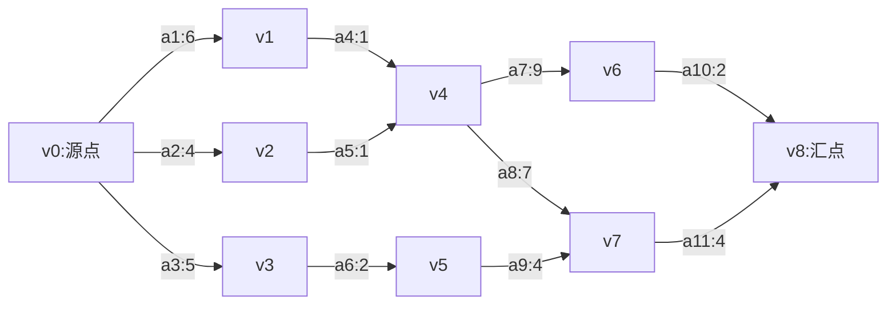

为了确定关键路径，首先我们需要知道四个描述量，接下来让我们来根据上面这个图来解释四个描述量，并且阐明它们的区别。

>   补充：这里提供一个[“省流”版本](https://www.bilibili.com/video/BV1DD4y1h7ac?vd_source=4772b64d7a3cb1873f14bc0153c4de68)的讲解视频，您要是着急知道求解方法，直接前去查看即可...

#### 3.6.3.1.事件 $v_i$ 的最早发生时间 $ve(i)$

进入事件 $v_i$ 之前，每一个活动都必须发生，可以给出递归公式如下，展开递归公式就会发现，实际上就是选出一个顶点的最大带权路径长度的那条路径：
$$
\begin{align}
ve(0) &= 0\\
ve(i) &= Max\{ve(k) + w_{k, i}\}, k 为 i 的上一个顶点
\end{align}
$$
而上面的图每一个事件 $v_{i}$ 的最早发生时间就是：
$$
\begin{align}
ve(0) &= 0\\
ve(1) &= Max\{ve(0) + w_{0,1}\} = 0 + 6 = 6\\
ve(2) &= Max\{ve(0) + w_{0,2}\} = 0 + 4 = 4\\
ve(3) &= Max\{ve(0) + w_{0,3}\} = 0 + 5 = 5\\
ve(4) &= Max\{ve(1) + w_{1,4}, ve(2) + w_{2,4}\} = 6 + 1 = 7\\
ve(5) &= Max\{ve(3) + w_{3,5}\} = 5 + 2 = 7\\
ve(6) &= Max\{ve(4) + w_{4,6}\} = 7 + 9 = 16\\
ve(7) &= Max\{ve(4) + w_{4,7}, ve(5) + w_{5,7}\} = 7 + 7 = 14\\
ve(8) &= Max\{ve(6) + w_{6,8}, ve(7) + w_{7,8}\} = 7 + 9 = 18\\
\end{align}
$$

>   总结：$事件最早发生时间 = Max\{前驱顶点的 ve() + 路径权值\}$，期间将较小的顶点对删去，最后得到 $vl(i)$ 表的时候就可以直接得到关键路径，进而得到关键路径的长度，方便后续求解 $vl(i)$ 表，因为 $vl(i)$ 的最后一个就是关键路径的长度。

#### 3.6.3.2.事件 $v_i$ 最晚发生时间 $vl_{i}$

事件 $v_{i}$ 不得延误后继事件的最迟发生时间，因此也可以给出递归定义如下：
$$
\begin{align}
vl(n-1) &= ve(n-1)\\
vl(i) &= Min\{vl(k) - w_{i, k}\}, k 为 i 的下一个顶点\\
\end{align}
$$
而上面的图每一个事件 $v_{i}$ 的最晚发生时间就是：
$$
\begin{align}
vl(8) &= 18\\
vl(7) &= Mix\{vl(8) - w_{7,8}\} = 18 - 4 = 14\\
vl(6) &= Mix\{vl(8) - w_{6,8}\} = 18 - 2 = 16\\
vl(5) &= Mix\{vl(7) - w_{5,7}\} = 14 - 4 = 10\\
vl(4) &= Mix\{vl(6) - w_{4,6}, vl(7) - w_{4,7}\} = 6 - 1 = 7\\
vl(3) &= Mix\{vl(5) - w_{3,5}\} = 10 - 2 = 8\\
vl(2) &= Mix\{vl(4) - w_{2,4}\} = 7 - 1 = 6\\
vl(1) &= Mix\{vl(4) - w_{1,4}\} = 7 - 1 = 6\\
vl(0) &= Mix\{vl(1) - w_{0,1}, vl(2) - w_{0,2}, vl(3) - w_{0,2}\} = 6 - 6 = 0\\
\end{align}
$$

>   总结：$事件最早发生时间 = Max\{后继顶点的 vl() - 路径权值\}$

#### 3.6.3.3.活动 $a_i$ 最早开始时间

依据上述定义，规定：
$$
\begin{align}
e(i) &= ve(j), j 为出度顶点\\
\end{align}
$$


>   总结：$活动最早开始时间 = 出度顶点的 ve()$

#### 3.6.3.4.活动 $a_i$ 最晚开始时间

依据上述定义，规定：
$$
\begin{align}
l(i) &= vl(k) - w_{j, k}, k 为 a_i 的边或弧头, j 为 a_i 的边或弧尾\\
\end{align}
$$

>   总结：$活动最早开始时间 = 入度顶点的vl() - 路径$

# 4.图实现

这里我主要是实现了邻接矩阵实现的图结构，内部还包含了遍历算法、最小生成树、最短路径等算法，而邻接表我只是作为一个演示，不做深入研究（因为理解图的概念和相关算法，使用邻接矩阵就足够了）。

## 4.1.邻接矩阵实现

```cpp
//am_graph.hpp 邻接矩阵实现
#pragma once
#include <vector>
#include <iostream>
#include <string>
#include <map>
#include <stdexcept>
#include <climits>
#include <cstdio>

namespace limou
{
    using std::vector;
    using std::string;
    using std::cout;
    using std::map;
    using std::invalid_argument;
    
	template <
		typename VertexType = char, //顶点数据类型
		typename WeightType = int, //权重数据类型
		WeightType MAX_W = INT_MAX, //表示无穷的数
		bool Direction = false //判断是否有向
	>
	class AMGraph
	{
		/*
		* 无向图或有向图（考虑带权值）邻接矩阵模板类，
		* 测试有三种方法：IO 输入、文件读取样例、手动在代码中添加
		*/
	public:
		AMGraph(const vector<VertexType>& arr, size_t arrSize)
		{
			/* 根据顶点序列，初始化邻接矩阵和其他相关信息 */
			_vertexs.reserve(arrSize);
			for (size_t i = 0; i < arrSize; ++i)
			{
				_vertexs.push_back(arr[i]);
				_indexMap[arr[i]] = (int)i;
			}

			_weights.resize(arrSize);
			for (size_t i = 0; i < arrSize; i++)
			{
				_weights[i].resize(arrSize, MAX_W);
			}
		}

		size_t GetVertexIndex(const VertexType& v)
		{
			/* 返回顶点对应的索引，并且有检查机制，防止用户输错顶点 */
			auto it = _indexMap.find(v);
			if (it != _indexMap.end())
			{
				return it->second;
			}
			throw invalid_argument("顶点不存在");//运行时报错
			return -1;//防止编译器警告
		}

		void AddEdge(const VertexType& src, const VertexType& dst, const WeightType& w)
		{
			/* 添加边以及对应的权值 */
			size_t srci = GetVertexIndex(src);
			size_t dsti = GetVertexIndex(dst);

			_weights[srci][dsti] = w;//链接
			if (Direction == false)//如果是无向图还需要镜像处理
			{
				_weights[dsti][srci] = w;
			}
		}

		void Print()
		{
			/* 打印顶点集合和邻接矩阵来测试（只限于 int 类型的顶点数据） */
			int i = 0;
			for (auto ver : _vertexs)
			{
				cout << ver << " ";
			}
			cout << '\n';

			for (size_t i = 0; i < _weights.size(); i++)
			{
				for (size_t j = 0; j < _weights[i].size(); j++)
				{
					if (_weights[i][j] != INT_MAX)
					{
						printf("[%zd, %zd]:%-10d  ", i, j, _weights[i][j]);
					}
					else
					{
						printf("[%zd, %zd]:%-10d  ", i, j, 0);
					}
				}
				cout << '\n';
			}

			cout << '\n';
		}

	private:
		vector<VertexType> _vertexs; //顶点表
		vector<vector<WeightType>> _weights; //邻接矩阵（无向图的时候表示链接关系，有向图的时候不仅可以查看是否有链接，还可以查看权值）
		map<VertexType, int> _indexMap; //顶点映射下标（主要是用来提高效率的）
	};

	void TestAMGraph()
	{
		string str = "ABCD";
		vector<char> vec(str.begin(), str.end());
		AMGraph<char, int, INT_MAX, true> amg(vec, 4);
		amg.AddEdge('A', 'B', 1);
		amg.AddEdge('A', 'D', 4);
		amg.AddEdge('B', 'D', 2);
		amg.AddEdge('B', 'C', 9);
		amg.AddEdge('C', 'D', 8);
		amg.AddEdge('C', 'B', 5);
		amg.AddEdge('C', 'A', 3);
		amg.AddEdge('D', 'C', 6);
		amg.Print();
	}
}
```

```cpp
//邻接矩阵测试用例
#include "am_graph.hpp"

int main()
{
	limou::TestAMGraph();
	return 0;
}
```

## 4.2.邻接表实现

```cpp
//al_graph.hpp 邻接表实现
#pragma once
#include <vector>
#include <iostream>
#include <string>
#include <map>
#include <stdexcept>

namespace limou
{
    using std::vector;
    using std::string;
    using std::cout;
    using std::map;
    using std::invalid_argument;
    
	template <typename WeightType = int>
	struct Edge
	{
		/*
		* 组织一条顶点对，主要存储终点和权值（也可以有源点）
		*/
		//int _srci; //源点（可选，多重表就可以用这个）
		int _dsti; //终点
		WeightType _weig; //权值
		Edge<WeightType>* _next; //链接指针

		Edge(const int& dsti, const WeightType& weig)
			: _dsti(dsti), _weig(weig), _next(nullptr)
		{}
	};

	template <
		typename VertexType = char, //顶点数据类型
		typename WeightType = int, //权重数据类型
		bool Direction = false //判断是否有向
	>
	class ALGraph
	{
		/*
		* 无向图或有向图（考虑带权值）邻接表模板类，
		* 测试有三种方法：IO 输入、文件读取样例、手动在代码中添加
		*/
	public:
		ALGraph(const vector<VertexType>& arr, size_t arrSize)
		{
			/* 根据顶点序列，初始化邻接表和其他相关信息 */
			_vertexs.reserve(arrSize);
			for (size_t i = 0; i < arrSize; ++i)
			{
				_vertexs.push_back(arr[i]);
				_indexMap[arr[i]] = (int)i;
			}

			_tables.resize(arrSize, nullptr);
		}

		size_t GetVertexIndex(const VertexType& v)
		{
			/* 返回顶点对应的索引，并且有检查机制，防止用户输错顶点 */
			auto it = _indexMap.find(v);
			if (it != _indexMap.end())
			{
				return it->second;
			}
			throw invalid_argument("顶点不存在");//运行时报错
			return -1;//防止编译器警告
		}

		void AddEdge(const VertexType& src, const VertexType& dst, const WeightType& w)
		{
			/* 添加边以及对应的权值 */
			size_t srci = GetVertexIndex(src); //找到源点对应的索引
			size_t dsti = GetVertexIndex(dst); //找到源点对应的索引

			Edge<WeightType>* eg = new Edge<WeightType>((int)dsti, w); //头插
			eg->_next = _tables[srci];
			_tables[srci] = eg;

			if (Direction == false) //如果是无向图还需要进一步镜像处理
			{
				Edge<WeightType>* eg = new Edge<WeightType>((int)srci, w); //头插
				eg->_next = _tables[dsti];
				_tables[dsti] = eg;
			}
		}

		void Print()
		{
			/* 打印顶点集合和邻接表来测试（只限于 int 类型的顶点数据） */
			//打印顶点表
			int i = 0;
			for (auto ver : _vertexs)
			{
				cout << ver << " ";
			}
			cout << '\n';

			//打印邻接表
			for (size_t i = 0; i < _tables.size(); ++i)
			{
				cout << "[" << i << "]" << _vertexs[i] << ":" << "->";
				Edge<WeightType>* cur = _tables[i];
				while (cur)
				{
					cout << "[" << cur->_dsti << "]" << "\"" << cur->_weig << "\"" << "->";
					cur = cur->_next;
				}
				cout << "nullptr" << '\n';
			}
			cout << '\n';
		}

	private:
		vector<VertexType> _vertexs; //顶点表
		map<VertexType, int> _indexMap; //顶点映射下标（主要是用来提高效率的）
		vector<Edge<int>*> _tables; //邻接表（有向图时只存储出度弧的正邻接表）
	};

	void TestALGraph()
	{
		string str = "ABCDE";
		vector<char> vec(str.begin(), str.end());
		ALGraph<char, int, true> amg(vec, 5);
		amg.AddEdge('A', 'E', 11);
		amg.AddEdge('B', 'E', 20);
		amg.AddEdge('C', 'E', 34);
		amg.AddEdge('D', 'E', 93);
		amg.AddEdge('A', 'C', 69);
		amg.AddEdge('A', 'B', 76);
		amg.Print();
	}
}
```

```cpp
//邻接矩阵测试用例
#include "al_graph.hpp"

int main()
{
	limou::TestALGraph();
	return 0;
}
```

# 5.图分析

略...

# 6.图实践

## 6.1.六度空间问题

寻找一个人的六度好友，只需要使用这个人的关系网走第 `6` 层的层序遍历即可。


---

[^3]:图灵奖获得者，`Dijkstra` 就提出“`Go To` 语句可以从高级语言中取消”、“一个程序的质量与程序中所含的 `Go To` 语句的数量成反比”...`1968` 年 `Dijkstra` 给 ACM 通讯写了一篇短文，该文后改成信件形式刊登，以便早日发表，这就是具有历史意义的、著名的“`Go To Letter`”。`Dijkstra` 在信中建议：“`Go To` 语句太容易把程序弄乱，应从一切高级语言中去掉，只用三种基本控制结构（顺序、条件、循环）就可以写出各种程序，而这样的程序可以由上而下阅读而不会返回”。这封信引起了激烈的讨论。人们逐渐认识到：不是一个简单地去掉 `Go To` 的问题，而是促进一种新的程序设计观念、方法和风格，以期显著提高软件生产率和降低软件维护代价。`Dijkstra` 还解决了著名的“哲学家就餐”问题。
[^4]:`Bellman-Ford` 算法是由理查德·贝尔曼和莱斯特·福特两人一起创立的。
[^5]:`Floyd-Warshall` 算法的创始人弗洛伊德也是堆排序算法、前后断言法的创始人，图灵奖获得者。
