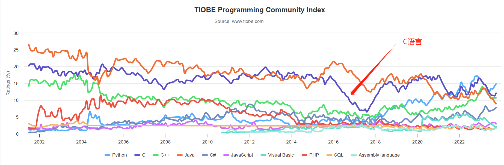
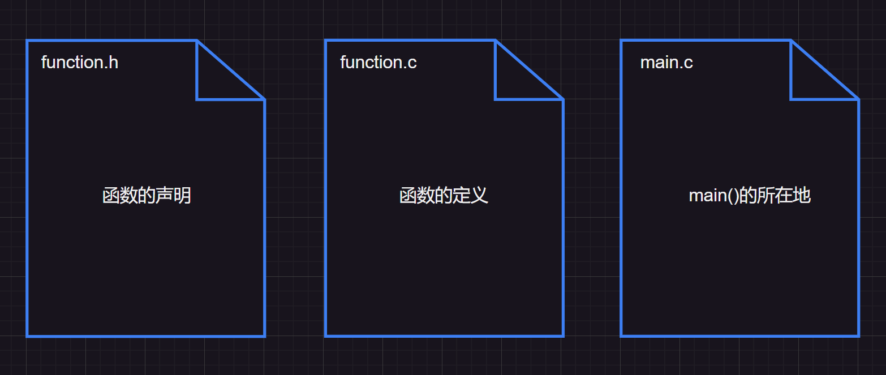

>   前要`1`：学习编程语言前，需要知道关于编程语言一些常识：
>
>   1.   [我该学哪个编程语言？对比10+主流语言优劣，入门编程不迷茫！](https://www.bilibili.com/video/BV1y3411r7pX?vd_source=4772b64d7a3cb1873f14bc0153c4de68)
>   2.   [比特鹏哥直播：大学生零基础如何学好C语言？](https://www.bilibili.com/video/BV1gY4y1T7gY?vd_source=4772b64d7a3cb1873f14bc0153c4de68)
>   3.   [What is a programming language? (youtube.com)](https://www.youtube.com/watch?v=EGQh5SZctaE)
>
>   前要`2`：先说在前头，由于对于初学者来说，很多知识模块都是缺失的，因此很多术语看不懂是很正常的（请您不要放弃）。在今后的`C`系列文章里，我会尽可能简化、形象化我的表述语言，并且给出一些资源链接和资源推荐。

>   概要：本节主要是一些对`C`语言的先导认知，不会讲解太深入，并且如果有些词语令您费解，那么您可以选择跳过，以后再来查看。
>
>   本文最重要的地方就是有关编译器软件`Visual stdio 2022`的下载。这类似写小说时需要使用的`office word`软件，写代码也需要使用一些软件。

# 1.C语言的简要概述

## 1.1.C语言类比自然语言

平时我们说的语言（汉语、英语...）就是人与人之间的交流语言，而[编程语言](https://baike.baidu.com/item/%E8%AE%A1%E7%AE%97%E6%9C%BA%E7%BC%96%E7%A8%8B%E8%AF%AD%E8%A8%80)就是人与计算机的交流语言。`C`语言就是众多编程语言中的一种（其他流行语言：`python`、`Java`、`C++`、`C#`、`Go`、`JS`）

## 1.2.计算机语言的发展

而计算机语言不是凭空出现的，是有一定的发展阶段的：

1.   一开始程序员都是直接使用二进制，并且需要查询手册，使用打孔机将孔打在纸条上，有孔和没孔代表`1/0`两种状态，然后交给计算机处理计算

2.   二进制使用起来过于繁琐，需要记忆不同的指令或者反复查找指令手册。

     而后来使用的汇编语言，是由一个个助记符构成的，比如说：想实现加法运算，假设加法指令的二进制代码是`01011`，这个时候给二进制`01011`命名为`Add`的加法指令，于是输入`Add`就就可以实现指令`01011`，其中`Add`就是一个助记符

3.   后面诞生了`BCPL`语言、`B`语言，最终演化到了`C`语言的诞生（在当时，对比二进制输入和汇编语言，`C`语言是极其方便的语言）

4.   然后就开始出现了其他语言的发展，例如：`Java`、`C++`、`Python`。

## 1.3.C语言在当今的地位

那么是否有必要学习`C`语言呢？`C`语言于`1978`年问世（已经是属于比较早远的语言了），可以从图中看出，即使过了这么久`C`语言仍然是程序员们热门的语言之一，常年占据前几名的位置，干掉了不少的语言。



>   补充：以上数据截止于`2023`年`10`月`14`日，来源[TIOBE指数 - TIOBE](https://www.tiobe.com/tiobe-index/)（`TIOBE`编程社区指数是编程普及程度的指标语言，该指数每月更新一次）。

从使用规模上来看，`C`还是值得我们学习的，尽管它属于比较古老的编程语言，但是学习`C`的过程，会帮助我们更深入学习其他计算机知识。

## 1.4.C语言的优势和劣势

### 1.4.1.C语言的优势

下面的优势您可能现在还感觉不出来，您姑且一看即可，以后再来慢慢了解。

1.  设计特性：其模块化设计和结构化编程的特点，使得写出的程序易懂易读（这是对比汇编语言而言的）。
2.  高效性：由于`C`是偏向计算机底层的语言（用`C`可以很直接操控某些硬件），可以充分利用计算机的优势，具有汇编语言的微调控制能力，可以更高效使用内存、运行速度很快（对比其他语言）。
3.  可移植性：可移植性是难得的特性，`C`出名原因之一就有这一点，您编写出来的同一份标准`C`代码在稍作修改甚至不修改的情况下，可以运行在其他机器上。不过需要注意的是，在某些硬件设备，例如：显示监视器或操作系统特殊功能编写的部分，通常是不可移植的。
4.  强大且灵活，我曾在`CoolShell`上看到一句很酷的话：“`C`语言不用多说，现今这个世界上几乎所有重要的软件都跟`C`有直接和间接的关系，操作系统、网络、硬件驱动等等。说得霸气一点儿，这个世界就是在`C`语言之上运行的”。
5.  面向程序员：`C`语言满足程序员的需求，程序员可以利用`C`方便地访问硬件、操作内存中的位。并且`C`的类型检查不像`C++`那么严格，这样做的好处是很多任务采用`C`都十分简洁（坏处是容易犯错）。
6.  库函数：包含众多程序员基础使用的`C`函数（但是没有直接的数据解构结构）。

### 1.4.2.C语言的劣势

实际上`C`语言的很多好处都有可能转化为坏处。

1.  `C`太过于自由，太信任程序员，这点在指针的使用上尤为突出，使用指针时，稍不注意就会导致程序崩溃，程序员需要对自己的C代码负责（这也提醒您，在后续学习中，遇到的第一个难点很可能就是指针）。
2.  `C`语言紧凑且简洁，有大量的运行，因此有可能写出令人费解的代码，甚至有“[国际C语言混淆代码大赛（IOCCC）](https://www.ioccc.org/)”的存在，这是只有`C`语言才独有的大赛。

# 2.C语言的应用场景

1.  撰写操作系统：小型计算机（例如：`UNIX`系统，类似于`Windows`系统，也是一种电脑操作系统）、个人计算机、大型计算机等。
2.  嵌入式开发：这些系统通常被嵌入到其他设备中（例如：智能手表、飞机、导弹、照相机等）`C`语言在单片机开发，嵌入式开发用的特别多，近几年物联网又让`C`语言掀起热潮！
3.  `C`还有一些应用场景，感兴趣的话您也可以查找一下其他相关知识。

>   补充：关于计算机的硬件知识，我觉得您有必要了解一下，您至少需要知道一点基础的计算机硬件知识，这对未来计算机技术的学习特别是对`C`语言的学习有很大的帮助。您可以看看我的另外一篇文章：[《简明计算机运行结构》](https://blog.csdn.net/m0_73168361/article/details/131525012?spm=1001.2014.3001.5502)。

# 3.C语言的学习路径

相信在前面的铺垫下，您对`C`有了一个初步的了解，因此有必要谈及未来学习`C`的道路和方法。

## 3.1.学习目的

1.   完整了解`C`语言的语法和规则
2.   数量使用`C`语言的语法和规则，形成一定的编程思维，可以使用`C`写出一些符合要求的基本算法
3.   借助`C`来理解很多计算机相关的概念

## 3.2.学习路径

学`C`好歹应该了解需要学什么板块吧？可以看看这份思维导图：[C语言思维导图](https://www.bitejiuyeke.com/path?key=c)，看完这份思维导图可以明确`C`语言的大概路径。

## 3.3.学习资源

### 3.3.1.推荐书籍

1.   首推《[C primer plus](https://book.douban.com/subject/26792521/)》。好处很多：全面、真的很全面，几乎涵盖了`C89`和`C99`的所有`C`语言基本特性，有非常深入的解析，还有大量的代码例子

     不过坏处也很明显：很厚，一个新手很容易半途而废，看完这本书至少需要`3`个月（但是会随着对`C`的熟练越看越快，我自己都看了`3`遍，每次都很有收获）。

2.   《[明解C语言 入门篇（第三版）](https://book.douban.com/subject/26663756/)》这本书的作者是一个日本人，该书在日本广受欢迎，是本不错的入门书，比上面那本书要容易读一些。

### 3.3.2.推荐课程

首推鹏哥`C`语言：[C语言程序设计从入门到进阶](https://www.bilibili.com/video/BV1Vm4y1r7jY?vd_source=4772b64d7a3cb1873f14bc0153c4de68)，这个教程真的秒杀市面上很多基础教程，懂得灵活用`C`是高手，但是会教会别人`C`更是高手中的高手，鹏哥完全可以胜任这份工作，这份视频也是我的第一份入门视频。

### 3.3.3.推荐题库

在学习`C`语言的过程中，最重要的是实践，也就是上机编写代码，这里推荐几个题库平台：[牛客网](https://www.nowcoder.com/)、[力扣](https://leetcode.cn/)、[PTA](https://pintia.cn/)。

这些题库很不错，都有大量的题库，不过新手推荐在有一定的`C`语言基础上刷下面这几个题单：

1.   [牛客网基础语法篇](https://www.nowcoder.com/exam/oj?page=1&tab=语法篇&topicId=290)
2.   [PTA基础编程题目](https://pintia.cn/problem-sets/14/exam/problems/type/6)
3.   [PTA程序设计练习集](https://pintia.cn/problem-sets/994805046380707840/exam/problems/type/7)

## 3.4.学习方法

### 3.4.1.多敲写代码

多多敲代码，不要嫌弃繁琐的敲键盘过程！

### 3.4.2.多撰写博客

在其他方面，我推荐您在`CSDN`上撰写自己的学习经历，就像[我自己写的博文](https://blog.csdn.net/m0_73168361?spm=1000.2115.3001.5343)那样，写博文的意义有以下几个：

1.   与他人分享知识
2.   整理、理清自己的学习思路，更好掌握知识
3.   方便以后自己修改复习使用
4.   面试是一个加分选项，有博客的人和没博客的人在面试的时候是两个档次的

### 3.4.3.多推送代码

我推荐注册一个`Gitee`账户，并且在[Gitee平台](https://gitee.com/)上推送自己的代码作为记录，这点在面试的时候也是加分项，相关的注册和使用可以看这个视频：[Gitee(码云)的注册和代码提交](https://www.bilibili.com/video/BV1hf4y1W7yT?vd_source=4772b64d7a3cb1873f14bc0153c4de68)。

对于一名“普通”在校大学生的建议节奏就是：以“上网课为主线，看书刷题为副线，博客为顺便”最好（当然，要根据实际情况）。

>   补充`1`：上面这些我写得比较简短，您还可以看一下`bilibili`上的这一段直播录播，里面会更加详细一些：[零基础如何学好C语言？](https://www.bilibili.com/video/BV1w94y1W7So?vd_source=4772b64d7a3cb1873f14bc0153c4de68)。
>
>   补充`2`：还有一篇`2018`年的文章也值得一看[程序员练级攻略（2018) ](https://coolshell.cn/articles/18360.html)作者是陈皓老师，今年（`2023`年）因心梗去世没多久。除了这一篇文章，还写了另外一个专栏，不过那个专栏在“极客时间”平台里，是收费的（不过价格还行，内容也不错，值得买来一看）

# 4.C语言的各大标准

## 4.1.“C标”的概念

一门语言需要被其他人拿去沟通，就必须拥有规则的语法体系，例如：汉语中形容词可以修饰一个名词，这是汉语的语法规则。不同语言可能会有相同的规则，也有可能会有不相同的规则。同理，要想要和计算机正常交流，就必须学好`C`的语法，也就是“`C`标准”。

`C`语言在一开始没有标准这一说法，各个公司使用`C`语言时都采用了不同的标准，于是产生了语言歧义，这个时候就出现了一些关于使用`C`的标准。

“`C`语言的标准”即“`C`标”，是一种编写代码的约定，“`C`标”让我们能够向计算机更加准确、规范表达我们的需求，一种编程语言的流行是需要一个标准的，否则很可能半途废掉。

## 4.2.“C标”的分类

`C`的标准有很多，常见的有：

1.  《`The C Programming Language`（`C`语言程序设计）》的第一版是公认的`C`标准，称为`K&R C`或“经典`C`”，该书的附录“`C`语言参考手册”是实现`C`的指导标准。但是这本书只是定义了什么是`C`语言，并没有定义`C`库，而`C`很依赖库，后来的`UNIX`实现提供的库逐渐变成了标准库（库就是函数库，里面存放了一些库函数，可以被直接调用，用来执行一些简短的任务）。
2.  美国国家标准协会（`ANSI`）于`1983`年组建委员会（`X3J11`），在`1989`年公布了`ANSI C`标准。而国际标准化组织在`1990`年采用了这套标准，也叫“`ISO C`标准。因此“`ANSI C`”和“`ISO C`”实际上是完全相同的标准，“`ANSI/ISO C`”的最终版本也就是后来的“`C89`标准”或“`C90`标准”。
3.  `C89`（也叫`ANSI C`）、`C90`的后继标准还有：`C95`、`C99`、`C11`、`C17`……未来也还有更加新的标准，这其实也侧面说明`C`还是非常流行的（因为仍在不断更新），但可惜只有`C99`之前的标准才更加流行。

这里需要注意，语言标准并不是越新就越好，新标准需要时间的沉淀！

不过其中仍有一些新的特性也值得我们学习，例如：柔性数组、变长数组等，这一部分我们以后再提及。

# 5.C语言的代码结构

首先让我们了解一下`C`语言这类编译型语言的使用步骤：

1.   定义程序的目标
2.   在纸上/脑中设计程序
3.   在编译器内编写代码
4.   编译和运行程序
5.   测试和调试代码
6.   维护和修改代码

这里只是提及一下，随着语言的深入，您会明白这些步骤的。

## 5.1.程序文件结构

要构成完整的`C`程序，首先需要有三个文件：

1.   一个文件是“头文件（`.h`后缀的文件）”
2.   另外两个文件是“源文件（`.c`后缀的文件）”

一般来说，头文件的内容是函数的声明，另外两个源文件的内容分别是函数的定义和`main()`所在的文件。



>   补充：什么是函数呢？在编程语言的函数和数学意义上的函数有些许不同，数学意义上的函数更多是一种输入数据和输出数据的关系，但是编程语言的函数不仅仅可以做到这一点，还可以完成一些额外的任务或者动作。
>
>   而一个函数需要被定义和声明，“定义”就是定义出函数具体要做的事情，“声明”就是提前告知编译器：“我要使用这个函数了，你注意一下”。

但是，我们先不纠结`C`程序的文件结构，我们在短时间内先只使用一个源文件来写`C`代码，这样更好入门，等我们学完函数后再来重新提及文件结构。

## 5.2.程序内容结构

我们先来讲讲单独一个源文件（`.c`后缀文件）内部怎么写`C`代码，我先给您一份实际的`C`代码，这份代码里暂时只有一个`main()`和一个`printf()`：

```cpp
//源文件内部
#include <stdio.h>//包含标准头文件
int main()//main函数是主函数，每一个C语言代码的入口都在这里
{
    printf("hello word\n");//向屏幕打印一串字符“hello word”，然后换行  
    return 0;//返回返回值为0 
}
```

>   注意：以后我们会在这个`main()`内加入其他的内容。

这都是什么意思呢？别急，下面会一一解释。

### 5.2.1.主函数main()

`main()`叫做作“主函数”，是整个程序的入口，在整个`C`程序中有且只能有一个。

无论`C`语言的代码有多少行，都必须要先从`main()`开始执行，我们看一份`C`代码的时候，可以选择从`main()`开始分析代码。

这里需要注意，`mian`函数有多种写法：

1.   第一种：常见的写法（比较多，初学者只需要使用这种就可以） 

     ```cpp
     int main()
     {  
         /*这里写上其他的C代码*/
         return 0;
     } 
     ```

2.   第二种：这种写法过于古老了，不建议使用，但是有的老教材可以看到这种写法

     ```cpp
     void main()
     {  
         /*这里写上其他的C代码*/
         return 0; 
     }
     ```

3.   第三种：也可以（目前很少写，以后在来讲解） 

     ```cpp
     int main(int argc, char* argv[], char* env[]) 
     {  
         /*这里写上其他的C代码*/
         return 0; 
     } 
     ```

4.   第四种：如果这样写也可以

     ```cpp
     int main(void)
     {  
         /*这里写上其他的C代码*/
         return 0; 
     }
     ```

>   注意：我在给一些`C`语言初学者`debug`的时候，总能遇到下面这些错误，请您查看是否“中招”，实际上这些写多了也就有经验了
>
>   1.   `main`被写成了`mian`
>   2.   `main`后边的`()`漏掉了 
>   3.   代码中不能使用中文符号，比如括号和分号
>   4.   ⼀条语句结束后，分号忘记写了
>   5.   最后的`return 0`不是`return ()`

### 5.2.2.打印函数printf()和标准头文件stdio.h

写一个`C`代码需要使用（或者叫“调用”）很多函数，而一个函数需要有函数声明（告知这个函数是什么，有什么样的参数）和函数定义（这个给函数的具体实现逻辑）才可以被我们使用/调用。

而`printf()`是`C`语言已经提前定义好的库函数（不需要我们自己实现），而标准头文件`stdio.h`则是标准库中的其中一个头文件，内部包含`printf()`的声明，在代码一开头中写入`#include <某个头文件.h>`，就是写入了`printf()`的声明。

`printf()`可以打印出括号内的内容到控制台上（就是一个黑色的小框框），后面运行代码的时候就可以看到。

>   类比：这里的`include`的使用就相当于：使用了别人的东西（标准头文件`stdio.h`），需要打个招呼（`#include<stdio.h>`），然后才能使用`printf()`。

在未来我们会学习更多这样的库函数，使用这些库函数也都需要包含对应的头文件。

### 5.2.3.返回值return 0

简单来说：一个`C`代码运行成功后程序就会返回一个`0`值，实际上在`C`语言中很多函数都具有返回值，这个`return 0`实际上就是`main()`函数的返回值。

# **6.C代码的编译运行**

通过[5.C语言的代码结构](# 5.C语言的代码结构)，我们得到了第一份C语言代码：

```cpp
//源文件内部
#include <stdio.h>//包含标准头文件
int main()//main函数是主函数，每一个C语言代码的入口都在这里
{
    printf("hello word\n");//向屏幕打印一串字符“hello word”，然后换行  
    return 0;//返回返回值为0 
}
```

可是光有代码是不行的，我们要让代码跑起来呀！这就需要通过编译器编译`C`语言代码了。那么接下来我们怎么编译（也就是翻译成计算机能够识别的机器代码）这个`C`代码并且运行起来呢？

在不同操作系统上，不同的编译方法有很多。但是我们都需要一个编译器或者`IDE`软件（`IDE`集合了编辑器、编译器、链接器这些组件我们以后学习`C`语言的编译链接过程就能明白）

我们先来简单理解一下什么是编译器：`C`语言是给人看懂的，计算机只能读懂二进制。简单来讲，编译器可以把我们写的代码转化为二进制让电脑能够理解（编译器是一名优秀的翻译家，好的编译器能得到更好的翻译，让计算机更好的理解我们的需求，运行代码的效率就更快）

## 6.1.Windows下的编译运行

在`Windows`下，常见的编译器软件有：`MSVC`、`GCC`、`Visual stdio`系列、`code blocks`、`Clang`、`SUBLIME`、`WIN-TC`、`Turbo C`等等。

需要注意的是，`VS2022`应该叫集成开发环境（缩写为`IDE`），是编辑器、编译器（例如：`msvc`）、调试器等组件的集合开发环境，一体式安装，即装即用，非常适合编程新手。

而最近这几年火的`VSCode`是个编辑器，不能独自进行编译，但是可以安装插件形成极具个性化的开发工具，但是配置环节能难倒很多编程新手，这里我们只是简单提及一下。

在我的文章系列，有关`C/C++`的代码编写和运行都是使用的`Visual stdio 2022`，偶尔使用`VSCode`或者`gcc`，因此我推荐您下载`Visual stdio 2022`，有关于`Visual stdio 2022`的安装和使用可以到我的另外一篇博文：《[安装并使用VS](https://blog.csdn.net/m0_73168361/article/details/134495624?csdn_share_tail=%7B%22type%22%3A%22blog%22%2C%22rType%22%3A%22article%22%2C%22rId%22%3A%22134495624%22%2C%22source%22%3A%22m0_73168361%22%7D)》。

>   补充：如果在使用`VS2022`的时候出现控制台一闪而过的问题（就是闪过一个黑色小框框），可以试试在 `return 0;` 的前面加上 `getchar()`函数。

## 6.2.Linux下的编译运行

在`Linux`下编译代码一般使用`gcc/g++`编译器，这个我们无需理会。

我相信有很多编程新手的学习机器大都是`Windows`或者`MacOS`的电脑，因此如果您想深入了解的话，你必须懂得`Linux`命令行的操作，可以看看我的`Linux`博文系列《`Linux`系列》，然后再去了解使用`gcc/g++`编译器。

## 6.3.MacOS下的编译运行

由于我对`MacOS`并不太熟悉，您可以查询网络资料，若是以后我更换`Mac`机器了，我会再回来这里补充推荐。
