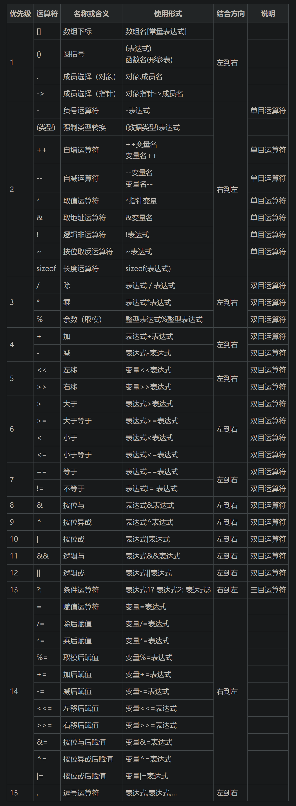

>   补充：这里我简单介绍 `C` 语言的基础语法，旨在让您快速上手 `C` 语言，更多细节还会在后续展开。

# 1.数据类型

## 1.1.数据类型使用分类

数据类型主要分为以下几类关键字：

```cpp
//数据类型
char     	//字符数据类型，存储单个字符 
short       //短整型，存储较小的整数
int         //整形，存储一般大小的整数
long        //长整型，存储较大的整数
long long   //更长的整形，存储更大的整数
float   	//单精度浮点数，存储低精度的小数
double      //双精度浮点数，存储高精度的小数
```

为什么需要数据类型关键字呢？数据类型可以帮助我们创建容器，也就是后面讲到的变量。

变量可以存储数据，这些数据不是立刻就需要被计算机作处理作输出的，可能还需要对变量内部的数据做一些其他的处理，等到处理完后才可以被计算机输出。

而使用容器/变量就是一种很好的选择，不同数据类型关键字创建出来的空间大小不同，内部存储规则也有可能不同，因此：根据数据的类型来择取数据类型关键字相当重要。

>   补充 `1`：实际上在之后的编码中，使用整型类关键字较多，原因您以后就会明白。
>
>   补充 `2`：上述有提到数据大小的字眼，如果您是编程新手，可能还需要了解下面的几个视频的知识。
>
>   -   了解什么是二进制，为什么我们需要二进制：[关于二进制，没有比这个讲的更清楚的了](https://www.bilibili.com/video/BV1Cb411s7hT?vd_source=4772b64d7a3cb1873f14bc0153c4de68)
>   -   这个视频可以了解一些计算机存储单位：[Bit、Byte、kb、KB、MB，KiB、MiB 都有什么区别？硬盘容量不符竟是这个的原因！](https://www.bilibili.com/video/BV1QW411h7iu?vd_source=4772b64d7a3cb1873f14bc0153c4de68)

而数据类型还有符号之分，如果是有符号的数据，直接使用数据类型关键字即可（或者在数据类型的最前面加上关键字 `signed`，但是这是默认行为，即使您不写也会自动加上）。但如果数据不具有符号，没有正数和负数之分，则最好使用 `unsigned` 修饰清楚。

## 1.2.数据类型的符号修饰

如果您存储的数据是具有负值的，那么可以给类型前加上关键字 `signed`，表明使用该数据类型创建的容器/变量不仅可以存储零和正值的数据，也可以存储负值的数据（例如 `-1`、`-0.31`），而如果加上关键字 `unsigned` 则表明该关键创建的变量只会出现非负值的数据。

## 1.3.数据类型的存储范围

不同的数据类型创建出来的容器/变量的大小是不一样的，能存储数据的范围是有限的（以下为  `32` 平台下的数据类型的存储范围，大概看一下就行，不同平台的相同关键字可表示的范围也有可能不一样）。

| 数据类型                     | 占内存字节数 | 表示范围                                                     |
| ---------------------------- | ------------ | ------------------------------------------------------------ |
| char (signed char)           | 1            | $[-128,127]$                                                 |
| unsigned char                | 1            | $[0,255]$                                                    |
| short int (signed short int) | 2            | $[-32\,768, 32\,767]$                                        |
| unsigned short int           | 2            | $[0, 65\,535]$                                               |
| int (signed int)             | 4            | $[-2\,147\,483\,648, 2\,147\,483\,647]或[-2^{31}, 2^{31}-1]$ |
| unsigned int                 | 4            | $[0,4\,294\,967\,295]$                                       |
| long int (signed long int)   | 4            | $[-2\,147\,483\,648, 2\,147\,483\,647]或[-2^{31}, 2^{31}-1)$ |
| unsigned long int            | 4            | $[0, 4\,294\,967\,295]$                                      |
| float                        | 4            | $[-3.4 × 10^{-38}, 3.4 × 10^{38}]$                           |
| double                       | 8            | $[-1.7 × 10^{-308}, 1.7 × 10^{308}]$                         |
| long double                  | 8            | $[-1.7 × 10^{-308}, 1.7 × 10^{308}]$                         |

# 2.变量常量

## 2.1.变量

### 2.1.1.变量的创建

变量的创建很简单，只需要根据不同的数据的特点，择取对应的关键字以及选择一个名词作为变量名，直接创建即可。

```cpp
//尝试创建变量
int main()
{
    int a = 10;//变量 a 存储了 10 这个整数数据
    int b = a;//同样可以用变量存储其他变量内的携带的数据，变量 b 存储了 a 内的值
    flaot c = 3.14;//变量 c 存储了 3.14 这个小数，但是其值可能精确度不高
    char ch = 'x';//ch 存储了 'x' 这个字符，注意需要加上单引号，告诉编译器 x 是一个字符而不是某一个新创建的变量

    a = 100;//变量 a 被修改成 100，也就是说：变量之所以叫变量，就是因为可以被修改
    
	return 0;
}
```

上述的 `a`、`b`、`c`、`ch` 是四个变量的变量名，使用它们就是在使用变量。

并且我们还可以注意到，在代码的结尾 `a` 变量发生了变动，这也就是为什么变量称为“变量”的原因：在代码运行过程种，可被修改的量。

>   补充：变量的命名规则
>
>   不可以随意取变量名，我们需要遵循以下规则：
>
>   1.   最好由字母（包括大写和小写）、数字和下划线组成
>   2.   不以数字开头
>   3.   长度不超过 `63` 个字符
>   4.   区分大小写
>   5.   不能使用已有的关键字（您不能给变量取名为 `int`、`float` 等关键字）
>   6.   最好取有意义的英文名词、动词等，非必要不直接使用一个字母作为变量名

### 2.1.2.变量的作用域

”作用域“是程序设计的概念，通常来说，代码中所用到的变量名并不是总是有效、可用的，而变量名的可用范围就是该变量的作用域。

1.   局部变量作用域：就是变量所在的局部范围（其实就是一对 `{}` 内）
2.   全局变量作用域：在一个工程/源文件中，均可被使用（缺点是可能不够安全，这个被声明的变量容易改变值，引起其他地方的 `bug`）

>   补充：需要注意的是，创建全局变量后，其内部初始的值为 `0`，但是最好由我们自己初始化，时刻对刚创建的变量进行初始化是一种好的编程习惯。

### 2.1.3.变量的生命周期

”生命周期“就是指创建变量和销毁变量的时间段。

1.   局部变量生命周期：局部变量使用完就会被销毁，也就是说局部变量的生命周期从进入作用域时，生命开始，离开作用域时，生命结束。开始和结束之间，就是该局部变量的生命周期

2.   全局变量生命周期：全局变量的生命周期和“整个程序”是一样的，程序结束时，全局变量也就被销毁

## 2.2.常量

>   注意：有关于常见的四种常量，您只需要知道有哪一些是常量即可，无需在意过多细节。

### 2.2.1.字面常量

就是在创建变量中，使用的直接从字面上就可以看出属于什么数据类型的量。

### 2.2.2.常变量

创建变量的过程中，使用 `const` 关键字可以让这个变量具有常量属性，在后续使用中虽然可以使用改变了，但是无法修改变量的值。

>   注意：但您需要记住，哪怕被 `const` 修饰了也依旧是一个变量，只不过无法被修改罢了（相当于加了把锁）。

### 2.2.3.宏常量

使用宏语法 `#define` 可以定义一个常量，这是 `C` 的一种特殊语法，我们以后会展开来讲。

### 2.2.4.枚举常量

枚举常量实际上属于结构体的知识，需要使用关键字 `enmu` 来创建一个枚举体，我们以后会展开来讲。

```cpp
//创建四种常量
#include <stdio.h>

//#define 定义的标识符常量，在代码编译过程中，
//代码中有 MAX 的地方会先被全部替换成 100，
//注意，宏常量的定义，其末尾不加分号，容易出 bug
#define MAX 100

//以下创建了一个枚举常量，只能枚举出离散变量，但是连续变量就不能被枚举出来
enum Sex
{
	MALE,		//默认值为0
	FEMALE,		//默认值为1
	SECRET		//默认值为2
};
//若是将 MALE 设定为 5，则后面就依次改为 6、7，
//这叫“初始化值”，不是“修改值”，所以是常量，而非变量

int main()
{
	//1.字面常量
	//这里只是写出字面常量，顾名思义“从字面上就可以看出来”
	100;	//整型常量
	'W';	//字符常量
	3.14;	//浮点常量

	//2.const 常变量
	int number_1 = 1;		//在这里 1 也是常量，但是 a 是变量
	number_1 = 20;			//number_1 是变量，值可以从 10 变成 20
	const int number_2 = 10;	//const 修饰的常变量
	//number_2 = 20;			//使用了 const 关键字后，这里就会报错，变量 number_2 无法被修改

	//3.宏常量
	int n = MAX;	//MAX 常量会在代码运行前被替换成 100，因此变量 n 会被初始化为 100

	//4.枚举常量
	enum Sex s = FEMALE;	//变量 s 的值被初始化为 1

	return 0;
}
```

# 3.字符基础

## 3.1.字符

`C` 语言表示字符由 `''` 引起，例如：`'w'`。

## 3.2.字符串

字符串由 `""` 引起，例如：`"abc"`，`"abc"` 会自动在末尾加上 `\0`，`\0` 表示“结束”，是一个转义字符，并不算入字符串的内容，只是做一个结束标志。

>   注意：`"a"` 和 `'a'` 是有区别的，前者有 `\0` 结尾，后者则没有！

字符串可以用两种方式存储，这两种方式在存储方式上有些许不同：

```cpp
//字符串的两种存储方式
int main()
{
    char* s_ptr = "abcd";	 	//使用指针指向字符串
    char s_arr[] = "abcd";		//使用数组存储字符串
    return 0;
}
```

您不必纠结什么是指针、数组，您目前只需要知道这样做就可以找到或者存储一个字符串即可。

## 3.3.转义字符

利用 `\` 字符，可以转变某些字符原有的意义，达到其他的目的（用的还是比较多的）。

常见的有：`\?`（打印 `?`），`\'`（打印 `'`），`\"`（打印 `"`），`\\`（打印 `\`），`\n`（换行），`\t`（水平制表符），`\v`（垂直制表符），`\b`（退格符，相当于 `backspace`），`\f`（换页），`\r`（回车），`\ddd`（`ddd` 表示八进制），`\xdd`（`dd` 表示十六进制）。

上述转移字符可以使用 `printf()` 来验证效果，例如：`printf("\n")` 就会在终端窗口换行。

>   补充 `1`：这里我给出一份 `C/C++` 官方的 [转义字符文档](https://zh.cppreference.com/w/c/language/escape)，您可以前去查阅一二。
>
>   补充 `2`：早期的编译器有“三字母词/三联符”概念，例如：`??)` 代表 `]`，因此 `\?` 是用来转义 `?` 的，使用 `\?` 可以正常打印出 `?`，而不会被编译器识别为三字母词（类似想打印 `"`，不能直接写 `"`，而是要写 `\"`），需要注意的是，不是所有编译器都支持三字母词。
>
>   ```cpp
>   //使用三字母词
>   #include <stdio.h>
>   int main()
>   {
>       //由于三字母词的存在，打印出 (are you ok]
>       printf("(are you ok??)");
>       printf("\n"); //换行
>   
>       //因此利用 \? 防止识别为三字母词，正常打印 (are you ok??)
>       printf("(are you ok\?\?)");
>       printf("\n"); //换行
>   
>       //printf("""); //打印失败，会报错
>       printf("\""); //使用反义字符就可以打印出单个 "
>       printf("\n"); //换行
>   	return 0;
>   }
>   
>   /* 输出结果
>   (are you ok]
>   (are you ok??)
>   "
>   */
>   ```
>
>   在 `VS2022` 中是无法直接得到上述结果的，但如果在 `gcc` 编译器中增加选项 `-trigraphs`，就可以看到这个现象（这里了解一下就行）。
>
>   ```bash
>   # 使用 gcc 验证三字母词的存在
>   $ cat main.c
>   //使用三字母词
>   #include <stdio.h>
>   int main()
>   {
>       //由于三字母词的存在，打印出 (are you ok]
>       printf("(are you ok??)");
>       printf("\n"); //换行
>   
>       //因此利用 \? 防止识别为三字母词，正常打印 (are you ok??)
>       printf("(are you ok\?\?)");
>       printf("\n"); //换行
>   
>       //printf("""); //打印失败，会报错
>       printf("\""); //使用反义字符就可以打印出单个 "
>       printf("\n"); //换行
>       return 0;
>   }
>   
>   $ gcc main.c
>   $ ./a.out
>   (are you ok??) # 这里的输出结果不同
>   (are you ok??)
>   "
>   
>   $ gcc main.c -trigraphs
>   $ ./a.out
>   (are you ok] # 这里的输出结果不同
>   (are you ok??)
>   "
>   ```

## 3.4.字符编码

实际上，字符需要转化为数字然后存储到计算机中，计算机需要显示字符时，再根据这个数字在字符集中查找对应的字符，然后才显示出来，而字符和数字之间对应的方案就叫做“`ASCII` 码表/`ASCII` 字符集”。


>   补充：上述表格来源于 `C/C++` 官网文档 [ASCII 码表](https://zh.cppreference.com/w/cpp/language/ascii)，更多关于字符编码的知识可以在视频 [锟斤拷�⊠是怎样炼成的——中文显示“⼊”门指南](https://www.bilibili.com/video/BV1cB4y177QR?vd_source=4772b64d7a3cb1873f14bc0153c4de68) 中深入了解。

`ASCII` 表虽然不用全部记忆（用时查即可），但是还是有必要简单记忆一下排布顺序：

-   字符 `A~Z` 的 `ASCII` 码值从 `65~90`
-   字符 `a~z` 的 `ASCII` 码值从 `97~122`
-   对应的⼤小写字符(`a` 和 `A`)的 `ASCII` 码值的差值是 `32`（不是 `26`！）
-   数字字符 `0~9` 的 `ASCII` 码值从 `48~57`
-   在这些字符中 `ASCII` 码值从 `0~31` 这 `32` 个字符是不可打印字符，⽆法打印在屏幕上观察，他们具有别的特殊用法（都是一些控制字符或者反义字符）

如果输入对应的 `ASCII` 码值到变量 `ch` 中，使用 `printf("%c", ch)` 就打印出对应的字符。另外，还可以利用 `\` 来使用 `ASCII` 码值表，不过这种是使用八进制和十六进制的 `ASCII` 码值来打印字符：

```cpp
//使用不同进制的 ASCII 值打印对应的字符
#include <stdio.h>
int main()
{
	printf("%c\n", 88);			//输出 X，使用 88 这个十进制来打印字符
	printf("%c\n", '\130');		//输出 X，其中 \130 是八进制的数字
	printf("%c\n", '\x58');		//输出 X，其中 \x58 是十六进制的数字

	//转义字符也算字符，整体包括 \ 符号看作一个整体
	return 0;
}

/* 输出结果
X
X
X
*/
```

>   补充：需要注意的是，使用反义字符来表示字符时，其数值不可以超过 `128`，也就是不能超过 `ASCII` 编码范围。

# 4.代码注释

## 4.1.注释作用

注释可以让别人看懂自己的代码，或者给未来的自己看懂自己曾经写的代码。再本系列中，我写的代码注释主要让您更深入理解一些代码细节。

## 4.2.注释方式

`C` 语言主要有两种注释方式，一是行注释 `//...`，二是块注释 `/*...*/`，需要注意的是，在双引号引起的字符串内无视这两种注释方式，例如：`"This a /*string1*/ and //string2"`，这是被允许的，不会被编译器识别出有注释的文本。

```cpp
//使用两种注释
int main()
{
    /* 第一种注释风格 */
    //第二种注释风格
	return 0;
}

/* 输出结果
无
*/
```

>   补充 `1`：`/**/` 不可以嵌套使用，例如：`/* /*...*/ */`，第一个 `/*` 只会和遇到的第一个出现的 `*/` 佩对，然后将两者中间的代码屏蔽掉。
>
>   补充 `2`：`VS 2022` 注释快捷键
>
>   用光标选中需要注释的代码，通过快捷键 `[ctrl+k/ctrl+c]` 添加注释，`[ctrl+k/ctrl+u]` 取消注释，当然，您也可以找找工具栏的按钮，那里也有注释和取消注释的按钮。
>
>   补充 `3`：实际上，行注释是 `C++` 的注释风格，在后面被添加到 `C` 中，我更推荐使用这种注释，不会产生配对问题，进而造成奇怪的错误。
>
>   补充 `4`：注释会被编译器忽略，在代码被运行后，注释会被替换成空格。

# 5.逻辑语句

首先我们需要知道，在 `C` 语言中，一个表达式的结果不为 `0`，这代表这个表达式为“真”，如是非零（包括负数）则为“假”。

```cpp
//验证 C 中真假的表示方法
#include <stdio.h>
int main()
{
    printf("%d\n", 5 == 6);//5 肯定不等于 6，整个表达式结果为假，输出 0
    printf("%d\n", 10 != -1);//10 确实不等于 -1，因此整个表达式结果为真，输出 1
    return 0;
}

/* 输出结果
0
1
*/
```

而根据由表达式做出某些行为，就是控制语句的功能，该表达式可以被称为“条件”。这里我只是简单介绍一些常见的逻辑语句，让您知道如何使用逻辑语句。

## 5.1.选择语句

### 5.1.if 语句

`if` 语句可以根据某个条件做出选择，基本的代码格式是：

```cpp
//if 语句的语法形式
if (<条件>)
{
    //代码 1
}
else
{
    //代码 2
}
```

只要 `if` 后的条件的结果为真，那么执行代码 `1`，而不执行代码 `2`。若为假，则跳过代码 `1`，执行代码 `2`。也就是说，代码 `1` 和代码 `2` 的结果只会执行一个。

```cpp
//if 语句的实际运用
#include <stdio.h>
int main()
{
	int a = 1;
	if (a == 1)//如果 a 等于 1 就会执行代码 1，否则执行代码 2
	{
		printf("haha\n");//代码 1
	}
	else
	{
		printf("hehe\n");//代码 2
	}
	return 0;
}

/* 输出结果
haha
*/
```

还可以写出一些多分支的循环语句，可以进行多种选择。

```cpp
//多 if 语句的语法形式
if (<条件 1>)
{
    //代码 1
}
else if (<条件 2>)
{
    //代码 2
}
else if (<条件 3>)
{
    //代码 3
}
else
{
	//代码 4
}
```

如果您愿意，还可以写出具有 `5` 种，乃至 `6` 种等等多种情况的 `if` 语句。

>   注意：最好不要在 `if` 语句后面加上分号，否则输出会出乎您的预料。
>
>   ```cpp
>   //问题代码(1)
>   #include <stdio.h>
>   int main()
>   {
>      int a = 100;
>      if(a != 100);//失误多写了一个分号
>          printf("limou");//误以为不会输出 limou
>      return 0;
>   }
>   
>   /* 输出结果
>   limou
>   */
>   ```
>
>   上面代码的含义就发生的变化，正确的代码缩进就变成了下面这样。
>
>   ```cpp
>   //问题代码(2)
>   #include <stdio.h>
>   int main()
>   {
>      int a = 100;
>      if(a != 100)
>          ;
>      printf("limou");
>      return 0;
>   }
>   
>   /* 输出结果
>   limou
>   */
>   ```
>
>   和上述问题代码等价的代码如下：
>
>   ```cpp
>   //问题代码(3)
>   #include <stdio.h>
>   int main()
>   {
>      int a = 100;
>      if(a != 100)
>      {
>          ;
>      }
>      printf("limou");
>      return 0;
>   }
>   
>   /* 输出结果
>   limou
>   */
>   ```
>
>   因此代码还是会输出 `limou`。

### 5.1.2.switch 语句

`switch` 语句也是一种选择语句，其作用是根据条件跳转到对应的标签，并且开始执行标签后的代码。

```cpp
//switch 语句的语法形式
switch (<条件>)//整型表达式
{
    case <某个常量值1>:
        //代码1
        break;
        
    case <某个常量值2>:
        //代码2
        break;
        
    case <某个常量值3>:
        //代码3
        break;
        
    case <某个常量值4>:
        //代码4
        break;
        
    //...
        
    default:
        //代码n
        break;
}
```

`switch` 语句会根据入口处的整型表达式的结果来选择对应的标签，将程序跳转到该标签，然后开始执行往下执行代码，其中 `break` 语句是必须的，否则代码会一直往后执行，将所有代码执行完才结束 `switch` 语句。

其中 `default` 是可选的，只有在其他标签都没有被匹配到的情况下才会执行。

>   注意：不要在 `switch()` 后加分号！

## 5.2.循环语句

循环语句实际上就是 `if` 语句的拓展，只不过多加了循环执行的特性。最经典的循环语句就是 `while`，除此以外，`C` 还有一些其他书写循环的写法。

### 5.2.1.while


`while` 的书写格式是：

```cpp
//while 语句的语法形式
while(<条件>)
{
    //需要被循环执行的某段代码
}
```

因此我们可以借助循环语句，减少一些重复性的工作。

```cpp
//使用 while 语句
#include <stdio.h>
int main()
{
    int i = 0;
    while (i < 10)
    {
        printf("%d ", i);
        i++;
    }
    return 0;
}

/* 输出结果
0 1 2 3 4 5 6 7 8 9
*/
```

还可以写出一些可以被死循环的代码。

```cpp
#include <stdio.h>
int main()
{
	int number = 10;
	while (number < 20)//只要 number 小于 20 就进入循环
	{
		printf("你好\n");
	}
	return 0;
}

/* 输出结果
结果是打印出无限的“你好”，这乍一看有些吓人，
但在VS中可以直接关闭控制台就可以结束这个循环，
或者按下快捷键 [ctrl + c]（不同系统的快捷键可能不太一样）
*/
```

>   注意：不要轻易在 `while()` 后加分号，但是有些时候我们确实需要这样做，我们遇到再提及。

### 5.2.2.do-while

`do-while` 也是书写循环的一种方式，但是和 `while()` 略有不同，两者在“先判断条件再执行代码，还是先执行代码再判断条件”上的顺序不一样，有时我们的确需要这种语句，简化我们的代码。

```cpp
#include <stdio.h>
int main()
{
	int i = 0;
	do
	{
		printf("%d\n", i);
		++i;//让 i 不断加一
	} while (i < 10);//先执行一次上面的代码，然后才进行判断，和 while 先判断再做的顺序相反

	return 0;
}

/* 输出结果
就会打印出 0~9 的 10 个数字
*/
```

在之前的 `while` 循环中，我们是写了一个“死循环”（不断执行某些语句的代码，除非手动停下，否则不会自动停止），但是更多的时候，我们会设计出让循环自动停下来的代码，在上面代码中体现在 `++i` 这句代码中，只要让 `i` 不断自增 `1`，总会出现 `i > 10` 的情况，因此就会导致 `while(i < 10)` 出的条件为假，导致循环停止。

### 5.2.3.for


`for` 循环对比其他的循环语句会稍显复杂，我们需要先了解 `for` 循环语句的书写格式：

```cpp
//for 语句的语法形式
for(<①初始化计数器>; <②判断计数器范围>; <④递增计数器>) //循环入口
{
	//③某些需要重复执行的代码
}
```

为什么是这种怪异的格式呢？我们回顾一下之前写的一段 `while` 代码：

```cpp
//while 和 for 之间的关联
#include <stdio.h>
int main()
{
    int i = 0;			    //初始化计数器 i 为 0
    while (i < 10)			//判断计数器是否在某个范围内
    {
        printf("%d ", i);	 //执行某些需要被循环的语句
        i++;				//计数器更新（自增 1）
    }
    return 0;
}
```

我们可以发现，很多的循环语句都在做上面的事情：

1.   初始化计数器 `i` 为 `0`
2.   判断计数器是否在某个范围内
3.   执行某些需要被循环的语句
4.   计数器更新（自增 `1`）

但是这样写出的代码不够简洁，有的时候甚至会漏写某个步骤，这个时候怎么办呢？`C` 提供了一种 `for` 循环语句，在循环的入口处就可以初始化计数器，然后根据循环条件判断是否执行循环体内的代码，最后更新计数器。也就是说，`for` 代码的执行流程为 $①\to ②\to ③\to ④ \to ① \to ...$

```cpp
//使用 for 语句
#include <stdio.h>
int main()
{
	int i;
	for (i = 0; i < 10; i++)
	{
		printf("你好\n");
	}
	return 0;
}

/* 输出结果
打印 10 个"你好"字符串
*/
```

>   补充：另外我们还在循环的流程图中提及了关键字 `break`、`continue`，这两个关键字很简单，一个是跳出循环，一个是跳出本次循环。
>
>   ```cpp
>   //使用 break 
>   #include <stdio.h>
>   int main()
>   {
>       int i = 0;
>       while(i <= 5)
>       {
>           i++;
>           if(i == 2)
>               break;
>           printf("%d ", i);
>       }
>       return 0;
>   }
>   /* 输出结果
>   代码运行后，只打印了 1 就结束了
>   */
>   ```
>
>   ```cpp
>   //使用 continue 
>   #include <stdio.h>
>   int main()
>   {
>       int i = 0;
>       while (i <= 5)
>       {
>           i++;
>           if (i == 2)
>               continue;
>           printf("%d ", i);
>       }
>       return 0;
>   }
>   
>   /* 输出结果
>   打印的时候遇到 i==2 就跳过本次循环，返回开头重新循环
>   */
>   ```

## 5.3.goto 语句

 `C` 提供了 `goto` 的跳转语句，可以跳转到对应标签处的语句，对于 `C` 新手来说尽量少用，容易导致逻辑混乱。

```cpp
//使用 goto 语句
#include <stdio.h>
int main()
{
    printf("hello\n");
    goto next://直接跳转到标签为 next 处开始执行
    printf("I am\n");//这个语句不会被执行
    
next://从这里开始执行
    printf("limou\n");

    return 0;
}
```

`goto` 语句在循环多次嵌套的时候非常好用，如果使用 `break` 就会写出下面代码：

```cpp
//使用 break 语句跳出多嵌套的循环结构
int main()
{
    while(1)
    {
        while(1)
        {
            while(1)
            {
                if(disaster)
                    break;
            }
            break;
        }
        break;
    }
    
    error:
        printf("There are bugs in the Code.\n");
    return 0;
}
```

可以看到必须使用多次 `break` 语句才可以跳出最外层的循环，而改用 `goto` 就只需一次：

```cpp
//使用 goto 语句跳出多嵌套的循环结构
int main()
{
    while(1)
    {
        while(1)
        {
            while(1)
            {
                if(disaster)
                    goto error;
            }
        }
    }
    
    error:
        printf("There are bugs in the Code.\n");
    return 0;
}
```

# 6.函数

在 `C` 语言中，函数就是处理数据的一份代码块。

## 5.1.自定义函数

### 5.1.1.函数结构

一个函数应该具有函数返回值、函数名、函数参数构成的函数签名。

```cpp
//函数定义的语法形式
返回值类型 函数名(形参1, 形参2)
{
    //内部关于函数的定义
    [return 返回值;] //返回值类型是 void 时，return 语句可以不写，或者直接写 return; 即可
}

//调用函数
int main()
{
    函数名(实参1, 实参2);
    return 0;
}
```

在函数的调用中，形式参数拷贝实际参数的传递过来的变量或常量，形成一个新的局部变量（只能在函数内部被使用），因此形参只是实参的临时拷贝，内部数据的存储位置不在同一个位置。

>   补充：由于形参是实参的临时拷贝，因此在函数中是没有办法通过修改形参的值来修改实参的（但是有其他的办法，例如使用指针）。

```cpp
//使用函数
int Add(int x, int y)
{
    int z = x + y;
    return z; //返回 z
}

int main()
{
    printf("%d\n", Add(1, 2));
    
    int a = 5, b = 10;
    printf("%d\n", Add(a, b));
	return 0;
}

/* 输出结果
3
15
*/
```

如果函数的返回值和返回类型不一致，会发生隐式转化，使得返回值和返回类型一致

```cpp
//函数的返回值和返回类型不一致
int Function()
{
    return 3.14; //原本返回 3.14 
}

int main()
{
    printf("%d\n", Function()); //函数的返回值和返回类型不一致，发生隐式转化
	return 0;
}

/* 输出结果
3
*/
```

如果函数具有有返回值，并且函数定义内存在 `if` 语句，则必须保证每一个分支都有返回值（在 `VS2022` 下会提出警告 `不是所有的控件路径都有返回值`，这说明我们对代码的各种情况考虑不够周全，存在程序无法确定返回值的情况）。

### 5.1.2.函数分类

根据函数的实现者，可以分为：

-   库函数：已经写好内部代码的函数，直接使用即可，例如`<stdio.h>` 里的 `printf()`

-   自定义函数：自己写的一个自定义的函数，例如我们之前自定义的 `Add()`

根据函数是否有返回值（有无 `return` 语句），可以分为：

-   无需返回的函数（无返回值的函数）

    ```cpp
    //定义无需返回的函数
    void MyPrint(int number)
    {
    	printf("[%d]", number);
        //无返回值
    }
    ```

-   需要返回的函数（有返回值的函数）

    ```cpp
    //定义需要返回的函数
    int Add(int x, int y)
    {
        int z = x + y;
        return z; //返回 z
    }
    ```

### 5.1.3.函数作用

之所以会有函数的存在，其中的几个目的是为了减少代码量、更加清晰地识别代码。

在我们要做某些事情的时候，只需要调用/使用曾经设计好的函数就行，而不必每次都去重复写这个函数里面的内容（也叫做代码的复用）。

>   类比：就好像想要吃薯片，虽然您可以自己做薯片，但是也可以选择直接买商店的包装薯片，而不必每次都自己去做。而函数就可以类比那些帮你包装好薯片的一个加工厂，加工厂将原料加工为薯片，函数将输入数据加工为返回值，都可以为用户节约时间和成本。

## 5.2.一些库函数

### 5.2.1.[scanf()](https://legacy.cplusplus.com/reference/cstdio/scanf/)

该函数可以根据用户在控制台的输入和格式化字符，给变量设定值，是一个输入函数。

```cpp
#include<stdio.h>//使用函数时必须引入的头文件，内部包含函数的声明
int scanf(char* s, ...);//函数签名，包含使用函数时需要传递的参数，调用完后的返回值
```

-   `scanf` 读取失败就返回 `EOF`，通常 `EOF` 的值是 `-1`
-   正常读取则返回读取到格式化数据的个数

另外，在 `VS 2022`，直接使用 `scanf()` 会报一个错误和一个警告：

1.   错误：`“This function or variable may be unsafe. Consider using scanf_s instead. To disable deprecation, use _CRT_SECURE_NO_WARNINGS. See online help for details.”`，出现这个错误，就需要在一开头使用 `#define _CRT_SECURE_NO_WARNINGS 1` 来屏蔽这个错误（出现这个错误的原因就是因为微软认为 `scanf()` 函数不够安全，要求您使用 `scanf_s()`，但是为了学到“原汁原味”的 `C` 语言，我们最好还是继续使用 `scanf()`）。

     但是每一次都需要添加这句话，未免有些麻烦，因此我们可以修改 `VS 2022` 的文件 `newc++file.cpp`，在内部第一行写入 `#define _CRT_SECURE_NO_WARNINGS 1` 保存即可，以后创建 `.c` 文件后就会自动在第一行填充这句语句。

     那为什么微软会认为 `scanf()` 不安全呢？这和指针有关，我们之后学习了指针再来提及。

2.   警告：“`scanf()` 的返回值被忽略”，提示我们要用上 `scanf()` 的返回值，我们可以暂时忽略这个，编译器只是提醒你：要注意使用返回值，不要轻易忽略。您可以用一个变量 `scaRet` 来接收使用 `scanf()` 的返回值。

有些时候，还可以利用 `scanf()` 的返回值来循环输入/多组输入，我们以后有机会再提及。

>   补充：关于符号，待补充...

### 5.2.2.[printf()](https://legacy.cplusplus.com/reference/cstdio/printf/)

该函数可以根据变量的值和格式化字符，输出变量的值到控制台上，是一个输出函数。

```cpp
#include<stdio.h>
int printf(char* s, ...)
```

`printf` 的返回值是是输出的字符数量，包括数字，字母，标点符号，空格，转义字符等

```cpp
#include<stdio.h>
int main()
{
	int A = 43;
	printf("%d\n", printf("%d", printf("%d", A)));
	return 0;
}
//结果会输出什么呢？432
//第三个 printf 输出 "43" 字符数量为 2，于是返回值为 2，第二个 printf 就输出 "2"
//第二个 printf 输出 "2" 字符数量为 1，于是返回值为 1，第一个 printf 就输出 "1"
```

```cpp
#include<stdio.h>
int main()
{
	printf("%d\n", printf("0,1,2,3\n"));
	return 0; 
}
//结果为
//0，1，2，3
//8
```

我们还可以用这个函数结合操作符 `sizeof()` 来打印出前面我们提及的“数据类型”的大小，其中注意：`sizeof()` 不是一个函数，其作用只是获取一个数据类型或者变量的大小，可以使用 `printf()` 和 `%zd` 打印出来。

```cpp
#include <stdio.h>
int main()
{
    printf("%zd\n", sizeof(char));
    printf("%zd\n", sizeof(short));
    printf("%zd\n", sizeof(int));
    printf("%zd\n", sizeof(long));
    printf("%zd\n", sizeof(long long));
    printf("%zd\n", sizeof(float));
    printf("%zd\n", sizeof(double));
    return 0;
}
```

>   补充：关于符号，待补充...

### 5.2.3.[strlen()](https://legacy.cplusplus.com/reference/cstring/strlen/?kw=strlen)

可以计算 `C` 风格字符串的长度，这里 `C` 风格字符串指的就是：以 `\0` 为结尾的字符串，该函数可以计算出字符串的长度（不包含 `\0`）。

>   补充：在之后的学习中，我们还会遇到更多的库函数。这里我给出了一份方便 [检索库函数的在线网站](https://legacy.cplusplus.com/reference/clibrary/)，虽然是全英文的，但还是请您留存一份，总有一天您会用上的。

### 5.2.4.[rand()](https://legacy.cplusplus.com/reference/cstdlib/rand/) 和 [srand()](https://legacy.cplusplus.com/reference/cstdlib/srand/) 和 [time()](https://legacy.cplusplus.com/reference/ctime/time/?kw=time)

在很多情况下我们都需要随机数，我们可以使用 `rand()` 函数生成伪随机数（真正的随机是无法预测的，我们的电脑只能生成伪随机）。

```cpp
#include <stdlib.h>
int rand (void);
```

该函数通过算法计算，来返回一个伪随机值（伪随机值的范围在 `0~RAND_MAX` 之间）。但是每次运行就会发现随机值是一模一样的，这是为什么呢？

`rand()` 是基于一个“种子”的值（这个值默认为 `1`）和算法来生成一个伪随机数的，而我们可以依靠 `srand()` 来设置这个种子，从而改变每次运行得到的随机数都是不同的。

```cpp
#include <stdlib.h>
void srand (unsigned int seed);
```

但是种子怎么设置呢？用一个随机数？这不就矛盾了么，我们本来就需要得到随机数，怎么可以先用随机数呢，因此我们可以让种子和时间关联起来，使用库函数 `time()`。

```cpp
#include <time.h>
time_t time (time_t* timer);
```

`time()` 会返回从 `1970` 年 `1` 月 `1` 日 `0` 时 `0` 分 `0` 秒到现在程序运行时间之间的 差值，单位为秒（也叫“时间戳”）。

返回的类型是 `time_t` 类型的，`time_t` 类型本质上其实就是 `32` 位或者 `64` 位的整型类型。

`time*()` 的参数 `timer` 如果是非 `NULL` 的指针的话，函数也会将这个返回的差值放在 `timer` 指向的内存中带回去（也就是输出型参数）。

如果 `timer` 是 `NULL`，就只返回这个时间的差值。

因此我们就可以利用这个时刻变化的时间戳作为时刻变化的数值，传入 `srand()` 设置为随机种子，让 `rand()` 每次运行都生成不一样的为随机数。

```cpp
#include <stdio.h>
#include <stdlib.h>
#include <time.h>

int main()
{
    srand((unsigned int)time(NULL));//使用时间戳的随机种子设置随机数
    printf("%d\n", rand());//生成一个随机数
    printf("%d\n", rand());//生成一个随机数
    printf("%d\n", rand());//生成一个随机数
    printf("%d\n", rand());//生成一个随机数
    printf("%d\n", rand());//生成一个随机数
    return 0;
}
```

# 7.数组

## 7.1.一维数组

### 7.1.1.数组的创建初始

有时候我们需要大量相同数据类型的变量，这个时候就可以使用数组同时存放一组相同类型的变量。


```cpp
元素类型 数组名[元素个数] = {元素列表};
```

>   补充：数组实际上是一种数据结构，关于数据结构的知识，我们以后再提及！

```cpp
int arr_1[3] = { 0 };//数组的初始化，和 int a = 0 这种单个变量初始化是类似的，不过数组的初始化 0 会让数组内每一个元素都初始化为 0
int arr_2[4]={ 1, 2, 3 };//不完全初始化，数组内只有部分元素被初始化了，还有的元素没有被初始化，内部可能存储的是一个随机值
char arr_3[] = "bit";//利用数组存放字符串，内部有四个元素，分别是 'b'、'i'、't'、'\0'，编译器会自动给出该数组的元素个数为 4
```

数组的存在可以让您不用一个一个的定义多个变量，减少重复的工作量。

但是需要注意的是，数组的大小必须是常量，不能是变量。

### 7.1.2.数组的下标访问

那如何取出数组里单个的变量/元素呢？`C` 使用“数组的下标/索引”来获取数组内的元素，下标从 `0` 开始，可以用下标访问一个元素。

```cpp
#include <stdio.h>
int main()
{
	int arr[3] = { 5,4,3 };
	printf("%d\n", arr[1]);//输出4
	
	//因此可以利用循环来输出arr的所有元素
	int i = 0;
	while (i < 3)
	{
		printf("%d ", arr[i]);//依次输出 5 4 3
		i++;
	}
	return 0;
}
```

需要注意的是，`C` 的下标必须是大于等于 `0`，小于数组元素个数的整数值。也就是必须遵循 `index` 处于 $[0, 数组元素个数)$ 这个区间中，否则有可能出现“下标越界”造成程序奔溃的结果。

### 7.1.3.数组的存储方式

数组在内存中是怎么存储的呢？实际上，创建数组时，编译器向内存申请了一块连续的内存空间，然后划分空间，每一块空间的大小和指定的数据类型相同，然后允许用户使用下标对这些划分好的空间进行使用（存数据或取数据）。

这里我们重要的是记下结论，至于证明，等到什么学习了什么是指针再来证明。

### 7.1.4.数组的元素个数

数组的元素个数多少由您做决定，但是有些时候，一个数组的元素个数经常会被您改变，如果在代码的其他地方也需要数组的元素个数，那么您改动数组定义处的个数时，使用到数组元素个数的相关代码中也需要做同步做出改动。

```cpp
#define _CRT_SECURE_NO_WARNINGS 1
#include <stdio.h>
int main()
{
	int arr[3] = { 10, 102, 34 };//这里的数组大小为 3，如果修改了这里的大小，比如：改为 5
	for (int i = 0; i < 3; i++)//那么这里就需要修改 i < 3 为 i < 5
	{
		printf("%d ", arr[i]);
	}
	return 0;
}
```

这样万一有很多处代码都需要使用数组的元素个数呢？用变量给定数组的元素个数？这是不行的，指定数组内元素个数的量必须是常量，而不能是变量。

我们可以结合 `sizeof()` 关键字，实时计算出数组的元素个数供给他人使用。

```cpp
#define _CRT_SECURE_NO_WARNINGS 1
#include <stdio.h>
int main()
{
	int arr[3] = { 10, 102, 34 };//这里的数组大小为 3，如果修改了这里的大小，比如：改为 5

	for (int i = 0; i < sizeof(arr)/sizeof(int); i++)//这里无需修改
	{
		printf("%d ", arr[i]);
	}
	return 0;
}
```

这样就方便了许多，只需要修改一处就可以。

>   吐槽：我一直感觉非常奇怪的一件事情，就是大家习惯上会称呼 `C` 语言数组的元素个数为“数组大小”，但我个人认为这么有有些奇怪，假设你问一个 `C` 程序员 `int` 的大小是多少，他几乎一定会说是 `4` 字节，不考虑平台的情况下，这没什么问题。
>
>   但是你问一个 `C` 程序员，`int[4]` 的大小是多少呀？咦？我应该回答 `4*4` 字节，还是以存储 `4` 个 `int` 元素？
>
>   个人认为还是将数组的大小归为所占字节大小比较合适，而另外一个直接使用数组的“元素个数”，而不应该混杂使用，造成误解（当然，这只是个人见解，实际上不改变也没什么大的问题）。

## 7.2.高维数组

在 `C` 语言中，数组可以存储所有类型，甚至存储数组类型，因此就会诞生二维、三维、乃至更多维的数组（类似“套娃”）。

首先我们来看二维数组，二维数组实际上也是一个一维数组，只不过这次这个一维数组存储的不再是简单的数据类型 `int`、`float` 等，而是一个数组类型，`int[3][4]` 的含义可以理解为 `int[3] [4]`，也就是一个有 `4` 个元素的一维数组，但是每一个元素的类型是 `int[3]`，其本身也是一个数组。

因此二维数组的初始化可以这么写：

```cpp
#define _CRT_SECURE_NO_WARNINGS 1
#include <stdio.h>
int main()
{
	int arr[3][4] = {
		{ 4, 3, 9, 4 },	//arr[0]
		{ 0, 1, 8, 0 },	//arr[1]
		{ 3, 2, 7, 9 }	//arr[2]
	};

	return 0;
}
```

对于数组 `arr` 来说，可以使用下标来访问每一个元素，也就是每一个子数组，例如：`arr[1]` 对应第二个数组。

但是对于子数组来说，数组 `arr` 的下标访问就是自己的数组名，例如：`arr[2]` 实际上就是第三个数组的数组名，数组名加下标可以访问子数组的元素，`arr[2][1]` 就是元素 `2`。

根据这个逻辑，我们可以写双循环来遍历整个二维数组：

```cpp
#define _CRT_SECURE_NO_WARNINGS 1
#include <stdio.h>

int main()
{
	int arr[3][4] = {
		{ 4, 3, 9, 4 },	//arr[0]
		{ 0, 1, 8, 0 },	//arr[1]
		{ 3, 2, 7, 9 }	//arr[2]
	};

	for (int i = 0; i < 3; i++)
	{
		for (int j = 0; j < 3; j++)
		{
			printf("%d ", arr[i][j]);
		}
		printf("\n");
	}

	return 0;
}
```

二维数组的初始化和一维数组的初始化有一些不太一样的地方。在声明二维数组并且定义的时候，不能省略列，只能省略行。

```cpp
 int arr[][5] = { {1, 2}, {3, 4}, {5, 6};//不可以省略 5
```

因此读到这里，您完全可以使用二维数组存储一位数组的思维吗，创造出更加复杂的多维数组，而它们的访问方法也是相类似的。而所有多维数组的存储方式，也都是和一维数组一样采用顺序存储。

## 7.3.变长数组

我们之前说数组的元素个数只能用常量指定，但是 `C99` 标准里的”变长数组“却支持使用变量指定（注意不是长度可变就叫”变长“，只是单纯可以使用变量指定而已，不要被这个名字迷惑了）。

但是这一特性有些编译器不支持，比如：`VS 2022`，而实际上使用这一新规则的人也不算多，您了解一下即可，或者读一下《C primer plus》中对于 `C99` 的变长数组（`VLA`）的探讨，那里写得很详细。

# 8.操作符

`C` 语言很灵活，操作符有很多，操作符需要多少个量进行运算，就说该操作符有多少个操作数，例如：`+` 操作符需要两个操作数才可以进行加法运算，因此也叫三目运算符。

由于我们第一次接触操作符，因此我们来细细讲解一些操作符的细节。

## 8.1.算术操作符

-   `+`：对两个操作数做加法
-   `-`：对两个操作数做减法
-   `*`：对两个操作数做乘法，需要注意的是，乘法没有办法像数学一样缩写，`3*x` 不能写成 `3x`，也不能写成 `3·5`
-   `/`：对两个操作数做除法
-   `%`：对两个操作数做取模，且操作数必须都是整数，该操作符可以得到两个操作数相除。如果是负数，结果以第一个操作数的符号

## 8.2.移位操作符

-   `<<`：对一个整数的二进制做逻辑左移，末尾直接补零即可
-   `>>`：对一个整数的二进制做逻辑右移，开头一般补符号位
-   `&`：按位与
-   `^`：按位异或
-   `|`：按位或
-   `~`：对一个操作数的存储结果二进制序列全部位取反

## 8.3.赋值操作符

-   `=`：这个操作符我们之前就被用过了，不过这里强调一个点，”初始化（`int a=0`）和赋值（`a=20`）是两个概念“，至于区别是什么我们以后详细深入

-   `+=`、`-=`、`*=`、`/=`

-   `&=`、`^=`、`|=`

-   `<<=`、`<<=`

## 8.4.符号操作符

`+`、`-`，这两个操作符不是加法和减法，而是正负数的前缀符号，用来标明操作数的正负性。

## 8.5.关系操作符

`==`、`>=`、`<=`、`!=`，这些操作符和数学上的定义、使用几乎一模一样，需要注意的是等号和不等号的写法（`==` 和 `!=`）。

>   补充 `1`：将“ `==` 等于符号”写成“ `=` 赋值符号”的例子比比皆是，还请您注意。
>
>   补充 `2`：语法规定上，数学上的区间 `x∈[number1, number2]` 必须被写成 `x >= number1 && x <= number2` 或 `(x >= number1) && (x <= number2)`，而不能写成 `number1 <= x <= number2`，这样写代码不会报错，但是逻辑上是错误的。

## 8.6.逻辑操作符

首先我们需要知道 `C` 语言对真和假的理解：视一切非零值为真（包括负数）。

-   `&&`：对于 `子表达式1 && 子表达式2` 中，只有两个子表达式同时为真，整个表达式才为真，否则为假
-   `||`：对于子 `表达式1 || 子表达式2` 中，只要两个子表达式中有一个为真，整个表达式就为真，否则为假
-   `!`：对于 `!子表达式`，若子表达式为真，则整个表达式就为假，否则整个表达式为真

另外还需要重点提及的是 `&&` 和 `||` 的短路特性，对于 `&&` 中，如果左边的子表达式为假，则无需执行左边的子表达式（因为根据第一个子表达式，已经足够判定整个表达式是假了）。同样。对于 `||` 也是如此，如果左表达式为真，则无需执行右边的子表达式（因为已经可以肯定整个表达式必为真了） 。

```cpp
#include <stdio.h>
int main()
{
    int i = 0;
    int j = 2;
    int z = 0;
    z = ((i++) && (j += 2));
    printf("%d\n", j);//输出 2
    return 0;
}
```

```cpp
#include <stdio.h>
int main()
{
    int i = 0;
    int j = 2;
    int z = 0;
    z = ((++i) && (j += 2));
    printf("%d\n", j);//输出 4
    return 0;
}
```

## 8.7.条件操作符

对于 `exp1 ? exp2 : exp3`：

-   若是 `exp1` 为真，整个表达式的结果为 `exp2`
-   若是 `exp1` 为假，整个表达式的结果为 `exp3`

咦？这个操作符可以做到和 `if` 语句类似的效果，好像哪一个都可以呀？一般条件操作符只能写一些简单的条件判断，对于多个条件的判断（尤其是带有嵌套的 `if` 语句），使用 `if` 语句可读性更好，代码书写的顾虑较少。

```cpp
int main()
{
    int a = 0;
    int b = 0;
    
    scanf("%d", &a);//用户输入，给 a 赋值
    
    if(a > b)
        b = 3;
    else
        b = -3;
    
    printf("%d\n", b);
    return 0;
}
```

上面的条件判断就可以改写为下面的条件操作符，可以看到代码确实简洁了许多。

```cpp
int main()
{
    int a = 0;
    int b = 0;
    
    scanf("%d", &a);//用户输入，给 a 赋值
    
    b = (a > b ? 3 : -3);    
    
    printf("%d\n", b);
    return 0;
}   
```

## 8.8.逗号操作符

对于 `(exp_1, exp_2, exp_3, exp_4, exp_5, exp_6, …, exp_n)` 从左往右算，则最后一个表达式 `exp_n` 的值为整个式子的值。

```cpp
//使用逗号操作符
int main()
{
    int a = 1, b = 1, c = 1;
    int x = (a + 1, b + 2, c + 2);
    printf("%d\n", x);
    return 0;
}
```

## 8.9.地址操作符

`&` 可以对一个变量进行取地址，我们下面讲解指针的时候会使用这个操作符，这里先跳过，简单了解一下就行。

## 8.10.结构操作符

下标引用 `[]`、使用结构成员的 `.` 和 `->`。

## 8.11.自增操作符

`++`、`--`，分别可以对变量进行加一和减一

>   补充：有种说法是认为前置 `++` 要比后置 `++` 要高效，实际上这在 `C` 语言的 `++` 操作符和 `C++` 的内置类型 `++` 操作符中体现不出来，但是在 `C++` 的自定义类型中重载后 `++` 的的确存在这种区别，不过这就涉及到 `C++` 语言的使用了，我们就不提及，只是做简单的解释。

## 8.12.其他操作符

-   `sizeof` 应该是属于运算符，而不是函数，其本身不会真的进行某些计算（有机会我们验证一下）
-   `()` 这个括号操作符和某个函数名结合使用，变成函数调用或者标识一个关键字是函数，但是实际上大家常常忽略这个操作符，知道和不知道没什么太大区别，在函数调用 `Add(a, b)` 中，`()` 的操作对象是 `Add`、`a`、`b`
-   `[]` 的主要的作用就是利用数组的下标来访问数组的各个元素
-   `.` 和 `->` 是属于结构体知识的，后期会讲

（3）乘法

数学里面“3x”表示“3 *x”，但是在 C 语言里面就必须写成“3* x”，不能只写“3x”（编译器会报错的）



# 9.关键字

我们之前提到的数据类型关键字，是 `C` 语⾔中关键字的一类。而之前提到的条件、循环，也需要关键字 `if`、`while`、`do...while`、`for` 来构成逻辑语句。

实际上，大多数的编程语言都会有一批保留名字的符号，这些名字不能交给用户去定义变量名和函数名，具有特殊的含义和语法使用规则。这些名字就被被称为“关键字”，或者说“保留字”、“关键词”。常见的关键字有：

```cpp
break、case 、char、const、continue、default、do、double、else、enum、extern、float、for、goto、if、int、long、register、return、short、signed、sizeof、static struct、switch、typedf、union、unsigned、void、volatile、while
```

这些关键字您可以自己稍微拓展学习一下，在以后的学习中我还会提及，您也需要熟记这些关键字（实际上敲多了就记住了，本人英语很烂，也是靠不断的敲击记忆的...）。

>   补充：这里我也给您留了一份 [关键字的相关文档](https://zh.cppreference.com/w/c/keyword)。

下面我简单介绍几个比较容易理解的关键字，让您能快速理解并且使用。

## 9.1.typedef

假设有个人的名字全称是“欧阳李四”，而他村里的人却叫他小名“狗蛋”。这就相当于起了一个“别名”，故 `typedef` 的作用就像是给一些类型起了个“别名”。（叫“狗蛋”是为了方便，而您使用 `typedef` 也是为了方便）

```cpp
unsigned int num_1 = 100;
typedef unsigned int num uint;
unit num_2 = 10;//num_1 和 num_2 是同一种类型的
```

## 9.2.static

我们一直在说变量是存储在内存中的，但是究竟存储到内存中的那里呢？从 `C` 语言的角度来说，内存空间可以暂时被我们简单划分为：

-   栈区：存储局部变量、函数的形式参数
-   堆区：存储动态内存分配（像 `malloc()`、`calloc()`、`realloc`、`free` 等函数就是在这块区域做操作的
-   静态区：存储静态变量、全局变量（静态区里的东西，只有整个程序结束才会被销毁）

而关键字 `static` 的翻译是“静态”，它可以做到将一个原本在栈区存储的局部迁移到静态区存储，该局部变量就拥有了和全局变量一样的生命周期（但是作用域依旧不一样，也就是说，局部变量的作用域依旧不变，出了定义局部变量的代码块时，依旧无法直接使用被 `static` 修饰的局部变量）

```cpp
#include <stdio.h>
void test_1()
{
	int a = 1;//没有使用 static
	a++;
	printf("%d ", a);
}

void test_2()
{
	static int a = 1;//增加了关键字 static
	a++;
	printf("%d ", a);
}

int main()
{
	int i = 0;
	while (i < 10)
	{
		test_1();
		i++;
	}//得到打印结果为 2 2 2 2 2 2 2 2 2 2

	printf("\n");

	int j = 0;
	while (j < 10)
	{
		test_2();
		j++;
	}//得到打印结果为 2 3 4 5 6 7 8 9 10 11

	return 0;
}
```

>   类比：加了 `static` 就相当于：你在做数学试卷，被老师叫去谈话，当你回来的时候，继续往下做题，没有必要重新从第一题开始。不加 `static` 就相当于：你在做数学试卷，被老师叫去谈话，当你回来的时候，又从头开始做题了。

---

注意：一个局部变量本来放在栈区，加了 static 修饰的局部变量，就会放在静态区了，存储位置发生变化，导致局部变量出了作用域不会被销毁，改变了变量的使用周期（即存储位置发生了变化）。

注意：被 static 修饰后，这个 a 后面就不会重新创建为 a = 1 了（但是 a 的值是可以再被改变的，只是每次都不会被重新创建 a，静态和常量不是一个概念！！！）。

注意：静态变量和全局变量还是有很大区别的！静态变量只会在被修饰的局部变量里面值不变，而全局变量整个程序都是适用的。

②修饰全局变量

使得全局变量只能在本源文件里面使用，同时能让其他源文件里，另外一个被 extern 修饰的全局变量跨文件作用失效。（让全局变量的外部链接属性消失了）。其实这样的话就有对这个变量进行隐藏的功能（不会被别人看到，有保密效果）

//源文件 1

extern int a；

printf("%d", a);//打印不出 a 的值

//源文件 2

static int a = 10；//则只能在本源文件里使用

③修饰函数

//在 main_1.c 中

int Add(int x, int y)

{

  return (x+y);

}

//在 main_2.c 中

extern int Add(int x, int y);//没有 extern 的时候，有的编译器是不会去调用别的头文件里面定义的函数的

int main()

{

  int a = 10, b = 20, sum;

  sum = Add(a, b);

  printf("%d\n", sum);

  return 0;

}

实际上在 C++里面 static 还有两种用法，所以实际上是有两种用法

---

## 9.3.extern

可以跨 `.c` 文件使用一个被 `extern` 修饰的变量

```cpp
extern int num=1;
```

另外函数也有类似的使用方法

```cpp
int Add(int x,int y)
{
    return x+y;
}
```

```cpp
exterp int Add(int,int)//这里是函数的声明，只需要告知函数的参数是什么即可
{
    int a=10,b=20;
    int sum=Add(a,b);
    printf("%d\n",sum);
    return 0;
}
```

与 `static` 的同时出现时，会让 `extern` 的作用会消失

# 10.宏

关于宏的使用，我们在前面有简单提及过，我们这里来详细讲解一下

## 10.1.宏常量

```cpp
#include <stdio.h>
#define M 100
#define STR "hello bit"

int main()
{
    printf("%d\n",M);
    printf("%s\n",STR);
    return 0;
}
//就会分别输出100和hello bit
```

## 10.2.宏体

```cpp
#define MAX(x, y) (x > y ? x : y)//包括宏参（宏参是没有类型的），宏内容。
//宏与函数是有去区别的
int main()
{
    int a=10, b=20;
    int m = MAX(a, b);
    printf("%d\n", m);
    return 0;
}
```

# 11.指针

在学习指针之前，首先要理解一点关于内存的基本概念概念。

## 11.1.内存是什么

内存是电脑上特别重要的存储器，计算机中的程序运行后都是在内存中运行的，内存在哪里呢？就在内存条中，这也就是为什么有些人会追求 `16G`、`32G` 甚至更大内存的电脑，内存越大，同时运行的程序也就会越多，程序可以使用的资源空间而就越多，电脑整体来看也就越快。

而内存条内的内存空间，可以被分割成一个个“小内存”，这个“小内存”可以用一个小格子表示，每个小格子有一个对应的编号，计算机就可以依靠这些编号来快速找到这个小格子。

而这个编号就是地址，这个小格子就叫内存单元，内存单元一般可以存放一个字节的数据（刚好放一个 `char` 类型的数据，大小是 `8` 比特，或者叫”八位组“）。

## 11.2.编址如何编

`32` 位电脑实际就是指有 `32` 根地址线（相当于电线），电线是可以被通电的，有高电平，低电平，转化为数字信号就是 `1` 或者 `0`，`32` 个二进制位就可以产生 $2^{32}$ 个编号，也就能够产生 $2^{32}$ 个地址（管理 $2^{32}$ 字节的空间，其实也就 `4G` 大小的空间）。因此，一般 `32` 位电脑使用 `4G` 大小的内存就足够使用了。

>   注意：`64` 位也可以类似理解。

## 11.3.代码怎么写

此时我们就可以更深刻理解 `int a = 10` 的含义：向内存申请 `4` 个字节的空间，存储 `10` 这个值（具体怎么存放我们以后讲）。

这里放个图把...

`a` 实际上是占用 `4` 个字节的空间，但是每个字节都有地址，因此 `&a` 取的地址，其实是第一个字节的地址（也就是最小的地址）

而 `int *pa = &a` 中，把 `a` 的地址存放到变量 `pa` 中，`pa` 就是一个存放地址的变量，它的类型是 int*，我们把 `pa` 叫做一个”指针变量“，也叫”指针“。

## 11.4.指针怎么用


## 11.5.指针和数组

指针和数组有关系，但是不是一回事。

我们可以使用代码打印出指针来验证一下，查看数组的每一个元素是不是按照顺序进行存储的（这里的指针指的是地址，地址是对划分好的空间的一个标识，可以通过这个地址找到对应的空间，本文后面会提及指针的相关问题）。

```cpp
#define _CRT_SECURE_NO_WARNINGS 1
#include <stdio.h>
int main()
{
	int arr[6] = { 10, 21, 34, 33, 90, 67 };//这里的数组大小为 3，如果修改了这里的大小，比如：改为 5

	for (int i = 0; i < sizeof(arr)/sizeof(int); i++)//这里无需修改
	{
		printf("arr[%d] = %d, %p\n", i, arr[i], &arr[i]);//%p 可以打印十六进制的地址值，&arr[i] 可以取出存储数组元素所的空间的标识，即：指针值
	}
	return 0;
}
```

```cmd
arr[0] = 10, 0000001280D2FC08
arr[1] = 21, 0000001280D2FC0C
arr[2] = 34, 0000001280D2FC10
arr[3] = 33, 0000001280D2FC14
arr[4] = 90, 0000001280D2FC18
arr[5] = 67, 0000001280D2FC1C
```

打印出来的数组元素所对应空间的地址是十六进制的，相邻两个地址的差值都是 `4`，刚好就是 `int` 的大小，至于为什么是这样，您可以查看一下后面的指针知识。


注意：*在表明 pa 是指针变量，int 是在说明 pa 指向的对象是 int 类型。

注意：通过地址可以找到变量的值，甚至改变变量的值

注意：定义指针时，*跟在类型还是跟在变量上都可以

注意：%p 是用来专门打印地址的，如果

（5）当然指针变量本身也是一个变量

（6）那么指针变量本身的大小是多少个字节呢？

指针变量是存放地址的，地址是：

① 32 位机器上：32 个 0/1 组成的 2 进制序列，需要 32 位 bit 位的空间存储，指针变量就需要 4 个字节

② 64 位机器上：64 个 0/1 组成的 2 进制序列，需要 64 位 bit 位的空间存储，指针变量就需要 8 个字节（编译器可以换位数）

int main()

{

​    char* p1;

  int* p2;

   double *p3;

   printf("%zd\n", sizeof(p1));//zd 是

   printf("%zd\n", sizeof(p2));

   printf("%zd\n", sizeof(p3));

}//在 x86（32 位机器）结果都是 4，而 64 位机器都是 8

注意：故不要被*前面的类型影响判断

注意：编译器如果报警告就可以将%d 改成%zd

# 12.结构体

结构体是为了描述更多的复杂变量而诞生的，有些变量仅仅靠单个的 `char`、`int`、`float`…来描述是不够的，这个时候就需要结构体的存在了。

`struct` 是创建结构体的重要关键字，结构的存在使得描述一个变量时，可以使用多个数据类型来综合描述，内部每一个成员就是结构体成员。

```cpp
struct Student
{
    char name[20];//名字
    int age;//年龄
    char id[15];//学号
    float score;//成绩
};
```

结构体成员可以利用 `.` 或者 `->` 来访问，两者用法是有区别的，但是作用类似。

```cpp
#define _CRT_SECURE_NO_WARNINGS 1
#include <stdio.h>

struct Student
{
	char name[20];	//名字
	int age;		//年龄
	char id[15];	//学号
	float score;	//成绩
};

int main()
{
	struct Student s1 = { "张三", 20, "2022010823", 88.5f };
	struct Student s2 = { "翠花", 18, "2022030405", 98.0f};
	printf("%s %d %s %f\n", s1.name, s1.age, s1.id, s1.score);

	struct Student* ps2 = &s2;
	printf("%s %d %s %f\n", (*ps2).name, (*ps2).age, (*ps2).id, (*ps2).score);
	printf("%s %d %s %f\n", ps2->name, ps2->age, ps2->id, ps2->score);
	return 0;
}
```

# 13.语句


# 14.编码素养

## 14.1.编码风格

编写 `C` 的代码过程中，有很多的代码风格值得我们学习，我这里只总结了一些常见的代码风格，更多的代码风格我在段尾给出了相关的链接。

>   补充：编码风格相关链接

## 14.2.编码自救

我们在编写代码中，难免会出现错误，我们首先需要做到以下几点：

1.   不畏惧编译器的错误提示（包括警告）

2.   编译器给出的提示不仅仅是错误提示，还包含警告提示，不要忽略后者

3.   拥有一定的搜索检索能力，不要用 `baidu`（乐色堆），推荐使用 `bing`，也提倡使用多个平台的内置收索，小红书也好、`CSDN` 也好、博客园也好，甚至您有办法的话，使用 `google`、`chat GPT` 也是可以的，总之，站到更远的互联网，不要拘泥于国内互联网

4.   有些时候，编译器也会“犯迷糊”，您写的代码在编译器看来可能暂时没有错误，但这不代表以后没有错误（有可能含有隐藏的 `bug`，但这不会导致运行出错）

     这是新手常会误会的错误，认为只要有好的编译器，并且代码能运行就说明正确。但实际上，写代码时我们要尽可能足够严谨，否则就会出现意想不到的错误

只有您知道和遵循上述几点，才能得到快速的进步和 `debug` 的能力。

# 15.代码练习

下面我给出一些代码练习（附带答案），以及一些相关的题目链接，方便您进行代码练习。

## 两端汇聚字符

## 二分查找
