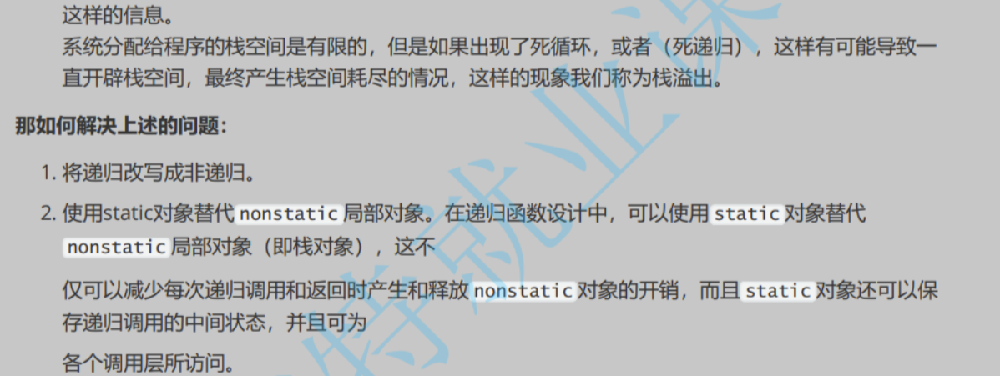

# 1.函数是什么

在数学里，函数是一种对应关系，而 `C` 语言里的函数和数学中的函数具有相似点，但是有很大的不同，甚至有些人认为“函数”这个名词不够恰当。准确来说，`C` 函数的函数是一种子程序，下面是 `Wiki` 对子程序的解释。

.png)

所谓的子程序，实际上就是大型程序中的某部分子代码。子程序本身由一个或多个语句组成，负责完成某项特定的任务，而且相较于其他代码具有相对的独立性。

可以认为，程序员在实践中，发现某一段代码也就是子程序经常被反复使用，因此就将这段代码摘取出来，给其进行命名做标记。而后续编码过程中，如果需要使用这段代码，就只需要调用对应的命名标记即可。

```cpp
//计算算式 (x + y) / 3 - z 的结果
#include <stdio.h>
int main()
{
    int val1 = (1 + 2) / 3 - 4;
    printf("%d\n", val1);
    
    int val2 = (6 + 3) / 3 - 5;
    printf("%d\n", val2);
    
    int val3 = (-3 + 4) / 3 - 7;
    printf("%d\n", val3);
    
    return 0;
}
```

可以看到，我们反复使用下面这段子代码：

```cpp
//提炼出子代码
#include <stdio.h>
int valn = (x + y) / 3 - z;
printf("%d\n", valn);
```

如果需要计算的次数变多，就会重复写上述的子代码，这样做的效率实在太低，因此我们把子代码摘取出来，给予一个标记/函数名作为子代码的命名，这个过程也被称为“封装”。

```cpp
//把子代码封装为函数
#include <stdio.h>
void Function(int x, int y, int z)
{
    int valn = (x + y) / 3 - z;
    printf("%d\n", valn);
}
```

那怎么调用呢？看下面代码：

```cpp
//把子代码封装为函数
#include <stdio.h>
void Function(int x, int y, int z) //接受三个参数拿去计算并且输出结果
{
    int valn = (x + y) / 3 - z;
    printf("%d\n", valn);
}

//计算算式 (x + y) / 3 - z 的结果
int main()
{
    //int val1 = (1 + 2) / 3 - 4;
    //printf("%d\n", val1);
    Function(1, 2, 4); //传递三个参数交给函数去计算
        
    //int val2 = (6 + 3) / 3 - 5;
    //printf("%d\n", val2);
    Function(6, 3, 5); //传递三个参数交给函数去计算
    
    //int val3 = (-3 + 4) / 3 - 7;
    //printf("%d\n", val3);
    Function(-3, 4, 7); //传递三个参数交给函数去计算
    
    return 0;
}
```

这样就简化了 `main()` 函数内冗余的代码。

>   吐槽：不过函数这个名字实际上我感觉也没错，上述例子中的确是进行了输入和输出，很像数学里的函数或方程...

# 2.函数的传参

## 2.1.实际参数/实参

真实传给函数的参数，实参可以是：常量、变量、表达式、函数等。

实参在进行函数调用的时候，必须有确定的值，然后传值给形参使用。

## 2.2.形式参数/形参

简单来讲就是函数定义后，函数名后面括号的内容中的变量，只有在函数被调用的时候，实参传值给形参时，形参才会有值（即“才会实例化“，“才会分配内存单元”，因此就是形式上的参数）。

更简单理解就是，“形参”是“实参”的临时拷贝，对形参的改动和修改是不会影响到实参的。

如果需要通过形参来改动实参，则不能只是传递值，而是应该传递地址！

另外形式参数在函数调用完后就自动销毁了，因此形式参数只有在函数内部才是有效的

函数中的形式参数是在栈中开辟空间的


有关函数参数易错题

**int founction((a1, a2), (a3, a4), a5, a6);//函数有几个参数呢？**

实际上应该是4个参数，(a1, a2)和(a3, a4)是逗号表达式，他们都各有一个结果，分别为a2和a4，故实际上函数的参数为a2，a4，a5，a6四个参数

>   补充：函数参数个数设置得越少越好，不然用户使用的时候，还得搞清楚每个参数的意义，并且还需要输入较多参数才能使用（很麻烦）。

# 3.函数的分类

## 3.1.库函数

①C语言自带的函数，可以直接使用，方便程序员进行软件开发

可以在这个网站里面查找： [https://cplusplus.com](https://cplusplus.com/)

或者C/C++官网： [cppreference.com](https://en.cppreference.com/w/)（中文版： [cppreference.com](https://zh.cppreference.com/w/首页)）

或者使用工具MSDN，可以离线查看，但是更新度不够

②使用库函数，需要包含#include对应的头文件

③常用的库文件如下：

*   IO函数<stdio.h>
*   字符串操作函数<string.h>
*   字符处理函数<ctype.h>
*   内存操作函数<stdlib.h>
*   时间/日期函数<time.h>
*   数学函数<math.h>
*   错误消息<errno.h>
*   功能函数<stdlib.h>
*   windows<windows.h>
*   其他库函数<……>

## 2.2.自定义函数

不可能所有的库函数都符合我们的需求，因此我们还需要自己写符合自己需求的函数，所以学会写自定义函数是最为重要的！ 

①函数必须有这些构成：函数的返回类型（注意这不是函数的类型）、函数名、函数参数列表、函数体

②伪代码：函数的结构

返回类型 函数名(参数列表)//注意返回指和参数列表可以是“空”，即void的情况

{

   函数体(具体代码);

}//如果忘记写返回类型，则默认返回一个整数，但不写返回类型是一个坏习惯！

③一些例子

例子1：比大小的函数

int MAX(int x, int y)//自定义“相加”函数

{

  return (x>y)?(x):(y);//使用了三目操作符

}

int main()//主体函数

{

  int num_1 = 10;

  int num_2 = 100;

  int max = MAX(num_1, num_2);

  printf("max = %d\n",max);

  return 0;

}

例子2：查找闰年

int is_leap_year(int y)//自定义“判断是否为闰年”函数

{

   return ((y % 4 == 0) && (y % 100 != 0)) || y % 400 == 0;

}

int main()//主体函数

{

  int y = 0;

  for (y = 1000; y <= 2000; y++)

  {

​     //判断y是否为闰年

​    //如果是闰年返回1 

​    //如果不是闰年返回0

​    if (is_leap_year(y))

​    {

​       printf("%d ", y);

​    }

  }

  return 0;

}

④一般来说要先在主函数（主程序）里面写如何去用、在哪里用这个函数，再去写自定义函数的具体实现会比较好一点。（这其实是TDD思想，TDD指“测试驱动开发（Test-Driven Development）”）


//实际上函数的声明和变量的声明很像

\#include <stdio.h>

int a;变量的声明

int main()

{

  printf("%d\n",a);//变量的使用

   return 0;

}

int a = 10;//变量的定义

//这种写法也是可以正常打印出来10的

**（1）函数的声明**

①是为了告诉编译器存在一个自定义的函数，需要声明函数的结构

（函数名字、函数参数、返回类型）

②一般在使用函数之前声明函数

③函数的声明一般放在头文件中

**（2）函数的定义**

交代函数的具体实现方式

**（3）教科书里常见函数声明的使用：**

\#include <stdio.h>

int Add(int x, int y);//函数的声明

int main()

{

  int a = 1, b = 2;

  printf("%d", Add(a, b));//函数的使用

  return 0;

}

int Add(int x, int y)//函数的定义

{

  return x + y;

}

//这种写法虽然对，但是实际情况一般不会这么写，函数的声明一般放在头文件中，函数的实现则放到另外一个专门用来自定义函数的源文件中

**（4）实际上的工程里常见的，函数声明较多的写法是：**

//头文件add.h中

\#ifndef __ADD_H__

\#define __ADD_H__

int Add(int x, int y);//函数的声明

\#endif

//函数定义源文件add.h

int Add(int x, int y)//函数的定义

{

  return x + y;

}

//程序主体文件main.h

\#include <stdio.h>

\#include "Add.h"

int main()//主函数

{

  int a = 1,b = 2;

   printf("%d", Add(a, b));//函数的使用

  return 0;

}

**（5）一是适合分工、二是有保密措施（静态库.lib的使用）**

①总不可能一堆程序员挤在一个电脑屏幕上写代码吧？多文件使得有程序员得以有效分工，每一个程序员写各种工作的头文件和源文件，最后再开始整合比较好

②使用VS产生静态库详细步骤，见我另外一篇博客：VS静态库的产生和使用

# 4.函数的返回

**（1）**使用多个全局变量，在函数内部改变，则相当于函数返回了多个值

**（2）**返回一个数组指针，就可以通过数组返回多个值

**（3）**形参使用多个指针变量，在函数体内部解引用，改变指针指向的值

唯独不能单用return，只能返回一个值，即一个函数只能返回单个结果，不能是多个

**其他：**

1、全局变量不声明默认值就是0

2、汉诺塔问题：比特大博哥用C语言有讲

3、青蛙跳台阶问题（本质是斐波那契数列）

4、设计函数时，尽量做到谁申请的资源就由谁来释放。谁申请的谁维护谁释放，否则如果交给外部使用者释放，外部使用者可能不知道或者忘记，就会造成资源泄漏

5、 函数中的形式参数是在栈中保存， 函数的形参一般都是通过参数压栈的方式传递的

6、可以看下《函数栈帧的创建和销毁》视频

7、下面这个不太懂：第三节-函数pdf内容

# 5.函数的调用

## 5.1.传值调用

函数的形参和实参分别占有不同的内存，对形参的修改不会影响实参。

如果写成下面这个代码就会交换失败（本质就是形参和实参的问题）

//一个典型的例子（写一个错误交换两个数的函数）

void function(int a, int b)//这里自定义函数只是临时拷贝（传过来）num_1和num_2两个数的值，所以下面只是x和y的值交换了，而num_1和num_2却没有进行实际上的交换

{

  int t = 0;

  t = a;

  a = b;

  b = t;

}

int main()

{

  int num_1 = 1;

  int num_2 = 2;

  printf("%d %d\n",num_1, num_2);

  

  function(num_1, num_2);//使用交换函数

  printf("%d %d\n", num_1, num_2);

  return 0;

}//这个函数通过编译器的调试功能会更加清晰看到

## 5.2.传址调用

//一个典型的例子（写一个正确交换两个数的函数）

void function(int *pa, int *pb)

{

  int t = 0;

  t = *pa;

  *pa = *pb;

  *pb = t;

}

int main()

{

  int num_1 = 1;

  int num_2 = 2;

  printf("%d %d\n", num_1, num_2);

  

  function(&num_1, &num_2);//使用交换函数

  printf("%d %d\n", num_1, num_2);

  return 0;

}

总之函数的调用无论是传值还是传址都有利弊，看情况选择传值方式。从功能上传址调用比较强大，但是容易出现更多问题。

>   补充：函数设计应该追求“高内聚低耦合”，在函数体内实现修改，尽量不要对外部产生影响，否则代码不便修改

## 5.3.嵌套调用

\#include <stdio.h>

void function_1()

{

   printf("aaaaa\n");

}

void function_2()

{

   int i = 0;

   for(i=0; i<3; i++)

   {

​     function_1();//调用了另外一个函数

   }

}

int main()

{

  function_2();

   return 0;

}

注意：函数可以嵌套调用但是不能嵌套定义（一个A函数里面又定义了一个B函数，但是可以在A定义里面调用一个已经定义好的函数B（或者B定义里面调用一个已经定义好的函数A））

//以下“嵌套定义”是不被允许的！

返回类型 f1(参数列表)

{

  //一些代码

  返回类型 f2(参数列表)

  {

​     //一些代码  

   }

   //一些代码

}


递归适当使用会大大减少代码量

**（1）什么是递归**

函数“直接”或者“间接”调用自己的一种编程技巧，它通常把一件“大事”化成“小事”来进行求解，函数不断递推出去，然后再不断地回归，组合成“递归”一词。

①最简单的递归

//最简单的递归，main函数自己调用自己

\#include <stdio.h>

int main()

{

  printf("abcd\n");

  main();

}//不断打印abcd此时main将不断消耗栈区的空间，最后栈溢出，程序崩溃

②按照顺序打印一个数的每一位数字字符

\#include <stdio.h>

my_printf(unsigned int x)

{

  if(x > 9)

   {

​     my_printf(x / 10);

​     printf("%u ", x % 10);

   }

  else

   {

​     printf("%d ", x);

   }

}

//大事化小

//my_printf(1234)

//my_printf(123)4

//my_printf(12)34

//my_printf(1)234

int main()

{

  unsigned int number = 0;

  scanf("%u",&number);

  my_printf(number);

  return 0;

}

理解递归函数可以像上面一样大事化小，或者是画多个图来理解

③自定义一个函数，实现和strlen函数一样的功能

\#include <stdio.h>

my_strlen(const char *str)

{

  if(*str == '\0')

  {

​     return 0;

  }

   else

   {

​     return (1 + my_strlen(str+1));

   }

}

int main()

{

  char arr[10] = "abcdef";

  printf("%d", my_strlen(arr));

  return 0;

}

④第n个斐波那契数列（不考虑溢出的情况）

\#include <stdio.h>

int fun(int n)

{

   if (n <= 2)

​     return 1;

  else

​    return fun(n - 1) + fun(n - 2);

}

int main()

{

  int n = 0;

  while (scanf("%d", &n) == 1)

  {

​    printf("第%d个斐波那契数列为%d\n", n, fun(n));

  }

  return 0;

}

⑤阶乘的实现（不考虑溢出的情况）

\#include <stdio.h>

int fun(int n)

{

   if (n <= 1)

  {

​     return 1;

  }

  else

   {

​    return n * fun(n - 1);

  }

}

int main()

{

  int n = 0;

  scanf("%d", &n);

  printf("%d", fun(n));

  return 0;

}

**（2）递归的必要条件**

①存在限制条件（不能像上面main自己调用自己一样，否则迟早栈溢出（stack overflow））让递归停下

②每次递归都要接近这个条件，不能原封不动

递归有可能大量消耗栈空间，计算量极大，有的时候反而效率低，例如：求斐波那契数列的时候求第50个数就会很吃力了，运算时间很久

**（3）迭代（循环）方式代替递归（斐波那契数列另外一种写法）**

\#include <stdio.h>

int function(int n)//用递归的方法求斐波那契数列

{

  int a=1;

  int b=1;

  int c=1;

  while(n >= 3)

  {

​     c = a + b;

​     a = b;

​     b = c;

​     n--;

   }

​     return c;

}

int main()

{

  return 0;

}

\#include <stdio.h>

int function(int n)

{

  int a = 1;

  while(n > 1)

   {

​     a *= n;

​     n--;   

   }

  return a;

}

int main()//利用迭代求n的阶乘

{

  int n = 0;

  scanf("%d", &n);

  printf("%d", function(n));

  return 0;

}

**（4）何时选递归**

看情况，那种方便少缺陷就选哪种，没必要一定要写出递归（当然递归能大大减少代码量）。况且迭代（循环）的方法会更加清晰。

## 5.4.链式访问

//链式访问例子1

\#include <stdio.h>

\#include <string.h>

int main()

{

   printf("%d\n", strlen("abcd"));

  return 0;

}

//链式访问例子2

\#include <stdio.h>

int main()

{

  printf("%d",printf("%d",printf("%d",43)));//printf返回值是读取到字符的个数

  return 0;

}//结果为4321这四个字符，注意不是四千三百二十一，只是单纯的输出4、3、2、1这四个字符

