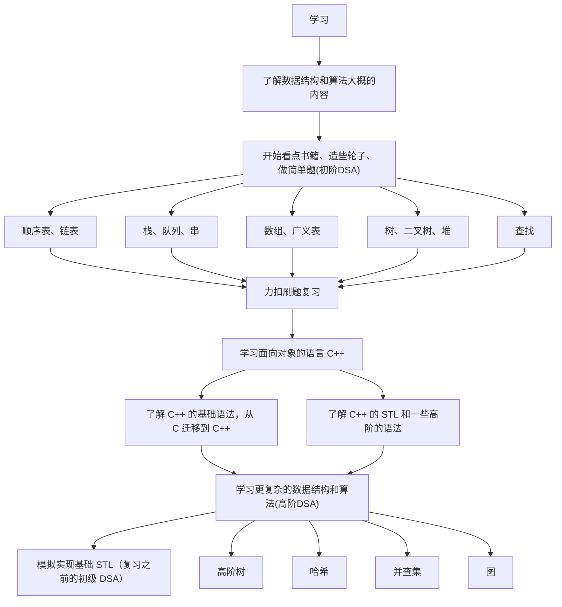

>   注意：请先保证您对 `C` 语言有足够的了解，这里的“了解”指您应当做到以下事情：
>
>   1.   熟悉大部分的 `C` 语言语法，至少需要知道 `C89/99` 的所有基本语法，例如：指针、数组、结构体...总之就是越熟悉越好
>   1.   熟悉库内的一些常见库函数，例如：`string.h`、`assert.h`、`stdio.h`、`stdlib.h`，尤其是关于动态内存申请的 `malloc()`、`free()`、`calloc()` 等函数，它们会充斥整个初阶数据结构系列文章
>   1.   拥有一个优秀且强大的代码运行调试环境，您必须足够熟悉一些调试方法，懂得查看监视窗口来：调试代码、寻找 `bug`、修正 `bug`...
>   1.   请完整看完本节先导文章，我会告诉您：为什么要做某一些事情、接下来要做什么、怎么去做...

# 1.数据结构和算法的意义

我必须提一下，数据结构和算法并不好学（如果您只是需要通过考试，那大概率很简单，您只需要知道一些操作，无需过度深入细节，就通过某些相关课程的考核，当然视情况而定）。

如果说编程语言让我们学会了“写字”，那么组织代码就需要我们学习一些写作框架（数据结构），还需要我们学习优秀的修辞手法（算法）。

可以说，数据结构和算法是编码学习的第一个拐点，只有踏过数据结构和算法（下文都简称为 `DSA`）这一“拐点”，才有精进一步的可能。

>   补充：本文关于拐点的说法来自于这篇文章《[The Key To Accelerating Your Coding Skills](https://blog.thefirehoseproject.com/posts/learn-to-code-and-be-self-reliant/)》，您也可以去寻找它的一些翻译版本《[提高编码技能的关键](https://learnku.com/articles/74764)》

您应该可以感觉到，学习编程语言到后期时，实际会越来越轻松，您只需经过 `1` 到 `2` 个月的时间差不多就可以上手一门语言了（有的语言甚至会更快），但是学到数据结构和算法就会出现明显的停滞状态，这个时期很容易出现“放弃”的心态。

但是一旦通过这个拐点，您一定会得到以下的成长：

1.   编程语言语法的深刻理解，我们对一些语法规则会更加记忆深刻
2.   可以实现一些简单的算法，分析并且解决一些实际问题，并且可以进行一定程度的优化
3.   调试技巧，在编写数据结构框架和一些算法时，类似指针越界、差一问题...的错误会经常陪伴着你，会逼迫您深入学习调试技巧
4.   ...

**再强调一下，如果您下定决心要走向编程与开发的道路，请不要放弃，相信我，您会得到提升的！**

# 2.数据结构和算法的内容

这个网站的思维导图您值得一看，会让您清楚即将要学习的内容：[DSA 学习大纲](https://www.bitejiuyeke.com/path?key=dsh)，里面提及的内容在在最后的学习规划中也有所体现。

# 3.数据结构和算法的资源

这里我会推荐一些资源，并且进行不定时的更新，您可以先概览一下...

## 3.1.书籍

这里推荐一些书籍供您查阅，需要注意的是，有些书籍并不适合您仔细阅读，而需要您作为科普类书籍查看即可。

### 3.1.1.入门

上面这两本书个人觉得作为入门科普书籍还是不错的，图文并茂：

1.   《小黑的漫画算法》
2.   《大话数据结构》

前一本我只看过一半，没看下去的原因是我看的是电子版本，有部分缺失内容，并且太简略了。后一本我完整看过一遍，稍微详细了一些，但是书内的代码一言难尽（看不懂代码不要硬看，因为书内的代码比较一般，学习起来很费劲）。

记住，这两本书您简单作为科普书看一看即可，只需要摸索一下大概的框架，心里有底就行，不必过于较真。

### 3.1.2.初学

上面的书籍还是太过于

1.   《[数据结构（C 语言版）](https://book.douban.com/subject/24699581/)》
2.   《[算法（第 4 版）](https://book.douban.com/subject/19952400/)》
3.   《剑指 offer》

国内的很多大学教材都会先从数学化的定义和抽象的描述来写 DSA 的教程，这种教程对于初学者来说，很容易会出现知其意不知其所然的情况（经典的我懂但是写不出代码）。

有了上述的理论知识，就可以开始深入“造轮子”了，注意不是看完再“造”，而是边看边“造”。

### 3.1.3.深入

这个阶段赶紧去学习面向对象的语言！入门阶段过去了就需要开始过渡一些比较高级的 DSA 了，这些纯 `C` 实现起来颇为复杂和“恶心”，容易消化不良。

`C++` 或 `Java` 都可以，不过本系列文章主要还是面向 `C++` 学习者的，还是推荐您使用 `C++` 来学习本系列的文章。

等学习完 `C++` 的基础语法后，再开始看我的高级 `DSA`。

如果您看过我的文章结构，就可以发现：我将 `C` 语言学习和初阶 `DSA` 混合在一起，并且将 `C++` 语法学习和高级 `DSA` 混杂在一起，我认为这样学习起来会比较连贯一些，您顺序看下去就行。

还要推荐几本书，属于比较晦涩的书：

1.   《STL 源码剖析》
1.   《算法（第 4 版）》

## 3.2.网站

### 3.2.1.刷题网站

1.   [力扣（国外版）](https://leetcode.com/)
2.   [力扣（国内版）](https://leetcode.cn/)

### 3.2.2.可视化网站

1.   [Data Structure Visualizations](https://www.cs.usfca.edu/~galles/visualization/Algorithms.html)
2.   [visualgo](https://blog.csdn.net/weixin_42208959/article/details/108065466)
3.   [BinaryTreeVisualiser](http://btv.melezinek.cz/home.html)
4.   [btree-js](https://yangez.github.io/btree-js/)
5.   [Algorithm Visualizer](https://algorithm-visualizer.org/backtracking/hamiltonean-cycles)
6.   [bigocheatsheet]()

## 3.3.课程

暂时还没有，等待补充...

# 4.数据结构和算法的规划

本系列文章是基于 `C/C++` 语言的，因此我们将编程语言和数据结构进行了耦合，您会在学习数据结构和算法的过程中同时学习 `C++` 的一些语法，以及关于 `STL` 的使用（但是说这些还是太早了）。

在学习初阶数据结构的时候，我向您保证不会用到 `C++` 的语法，尽可能使用纯 `C` 来编写代码。而只有涉及到高阶数据结构和算法的时候，我才会使用 `C++` 来编写代码。

您短期内关于数据结构和算法的大致学习路线如下：

