# 1.Unity 创建项目

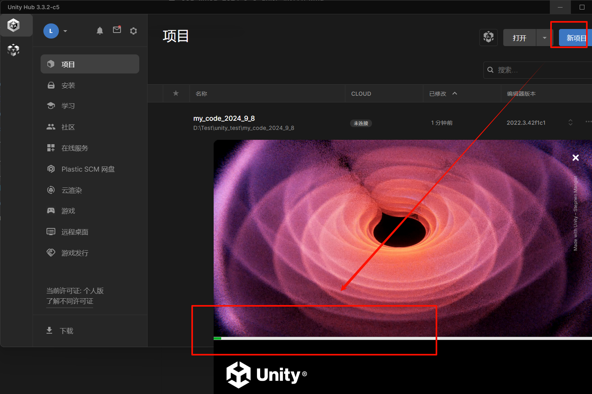

非常直观，直接使用 `Unity Hub` 管理项目即可，创建完毕后，就会开始编译一些初始化项目的代码，编译完成后就会打开下面这段代码。

# 2.Unity 界面认识

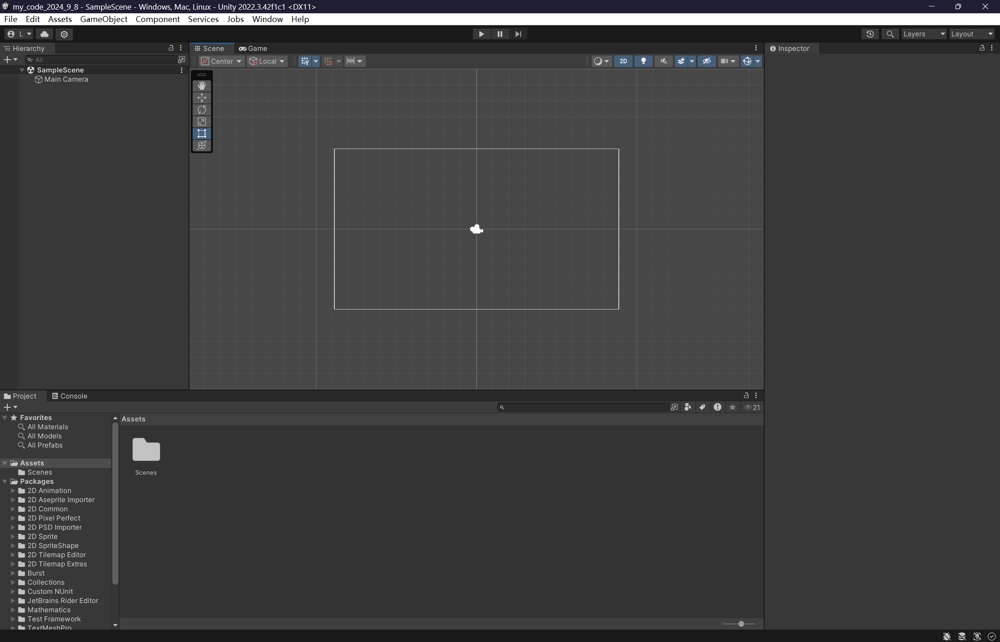

# 3.Unity 游戏准备

## 3.1.游戏视角

[关于游戏视角可以参考这篇文档](https://docs.unity.cn/cn/current/Manual/Quickstart2DPerspective.html)

-   平面
-   侧面
-   俯视

## 3.2.游戏风格

[关于游戏风格可以参考这篇文档](https://docs.unity.cn/cn/current/Manual/Quickstart2DArt.html)

-   极简注意
-   像素艺术
-   插图
-   预渲染 `3D`

# 4.Unity 极简项目

接下来我们 [根据官方文档中的一个小游戏项目进行编码](https://learn.unity.com/project/ruby-s-adventure-2d-chu-xue-zhe)。

## 4.1.下载资源文件

先 [到官方资源库中下载资源文件](https://assetstore.unity.com/packages/essentials/tutorial-projects/unity-learn-2d-beginner-adventure-game-complete-project-urp-271239) 并且导入到 `Unity` 编辑器中。

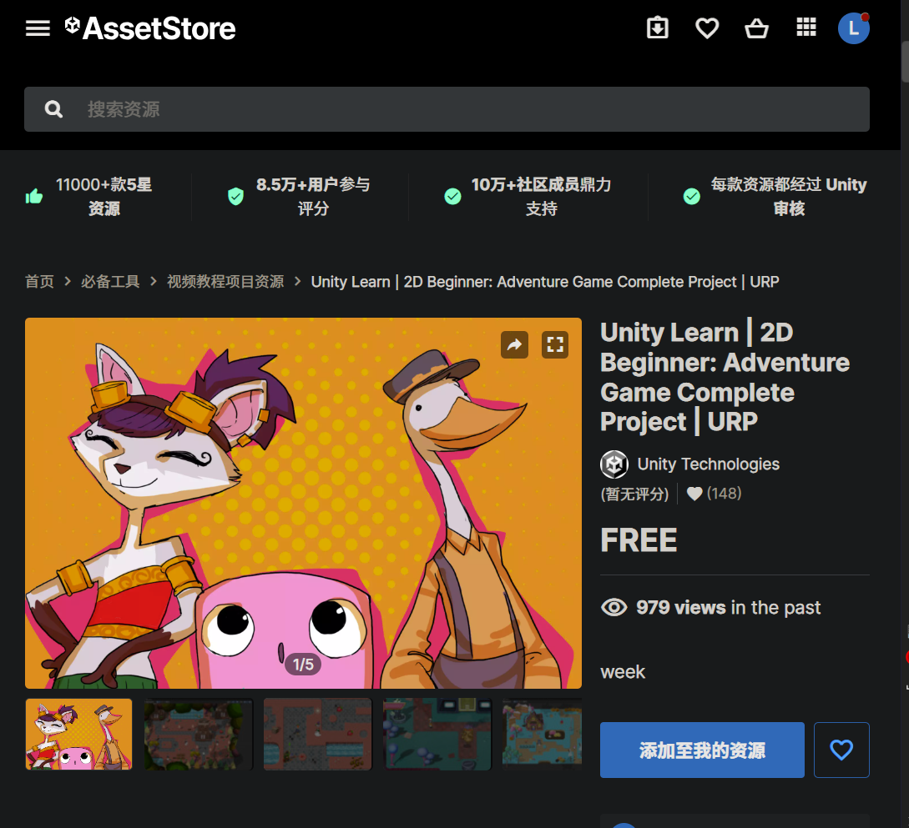

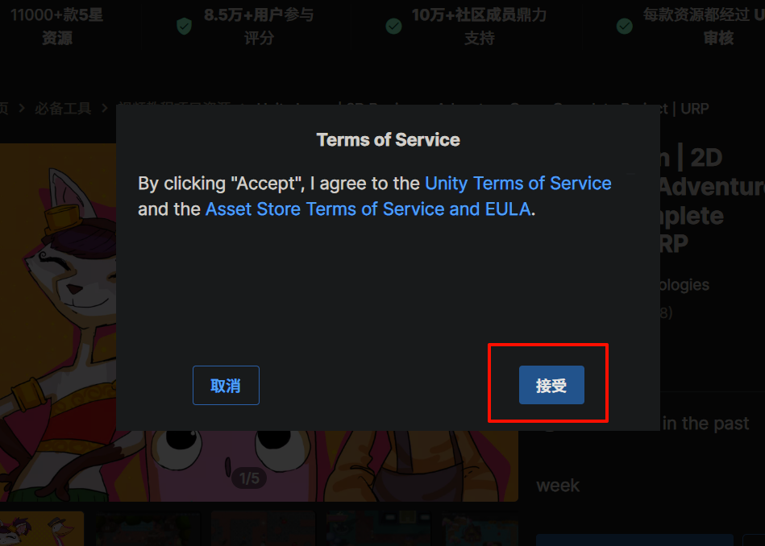

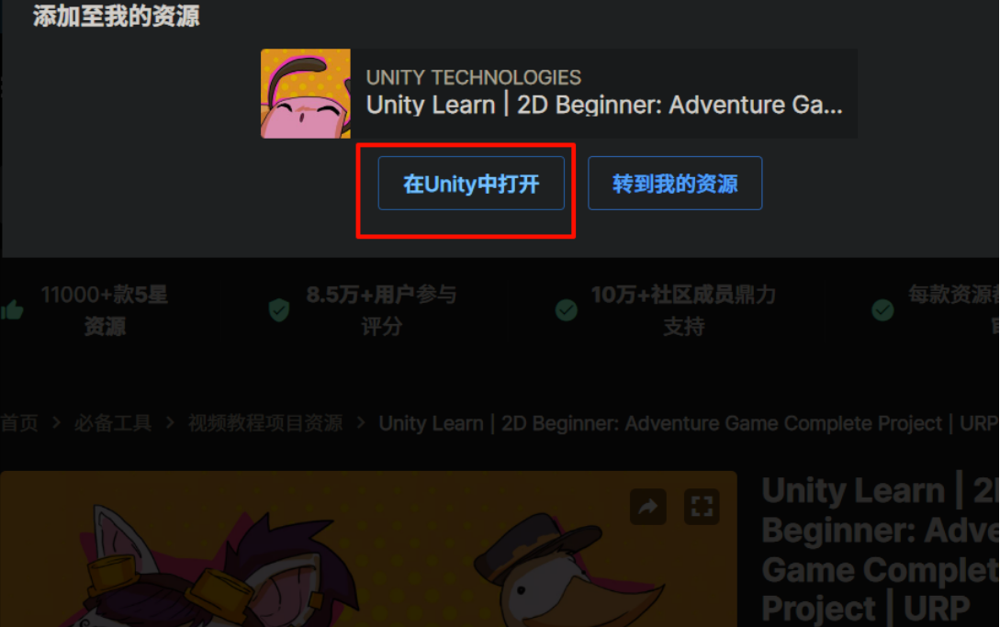

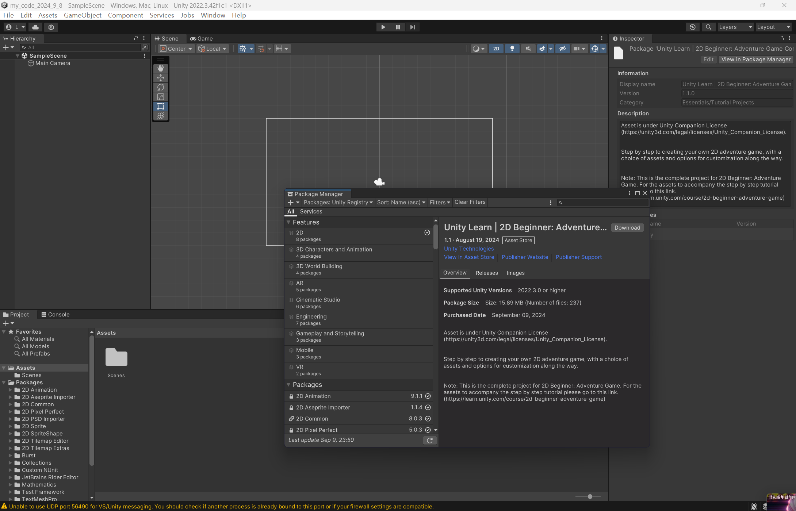

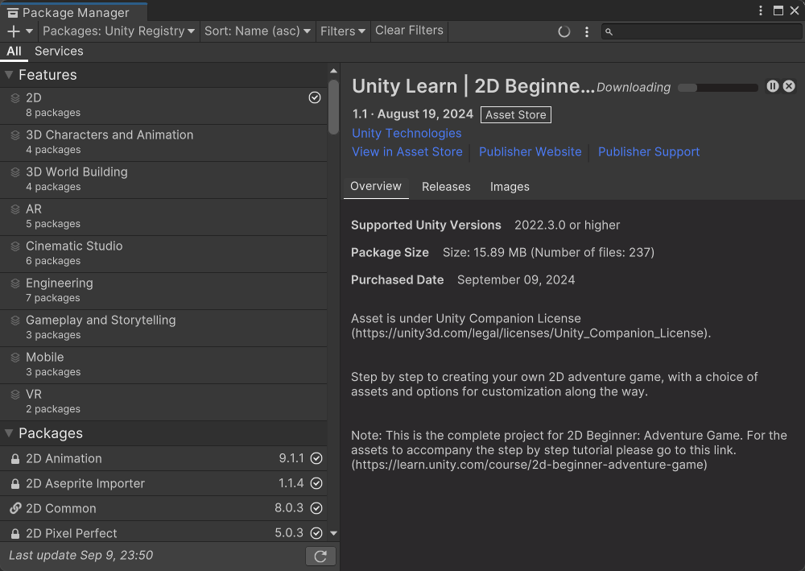

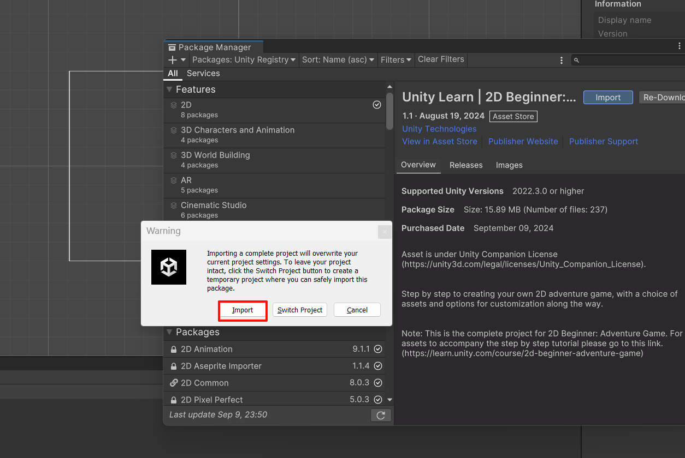

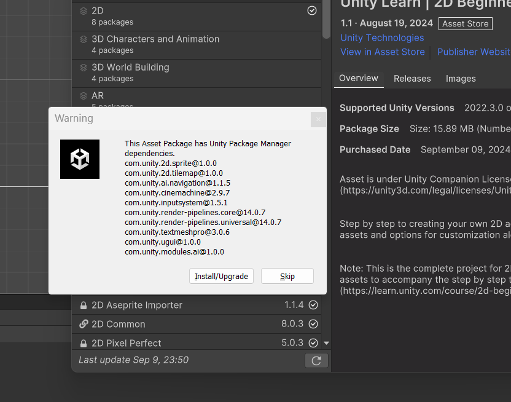

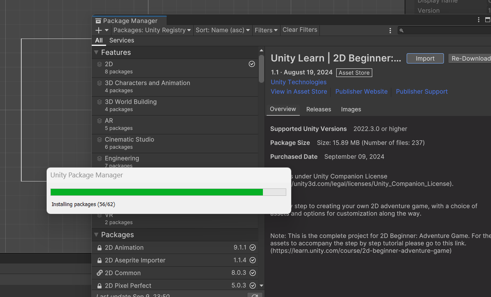

## 4.2.添加中文模块

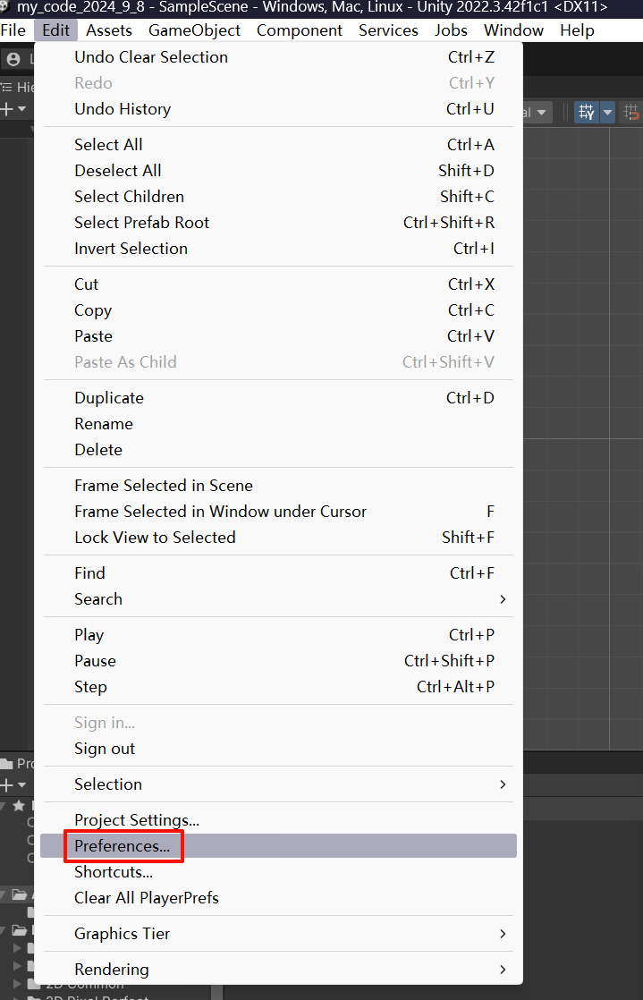

## 4.3.熟悉编辑窗口

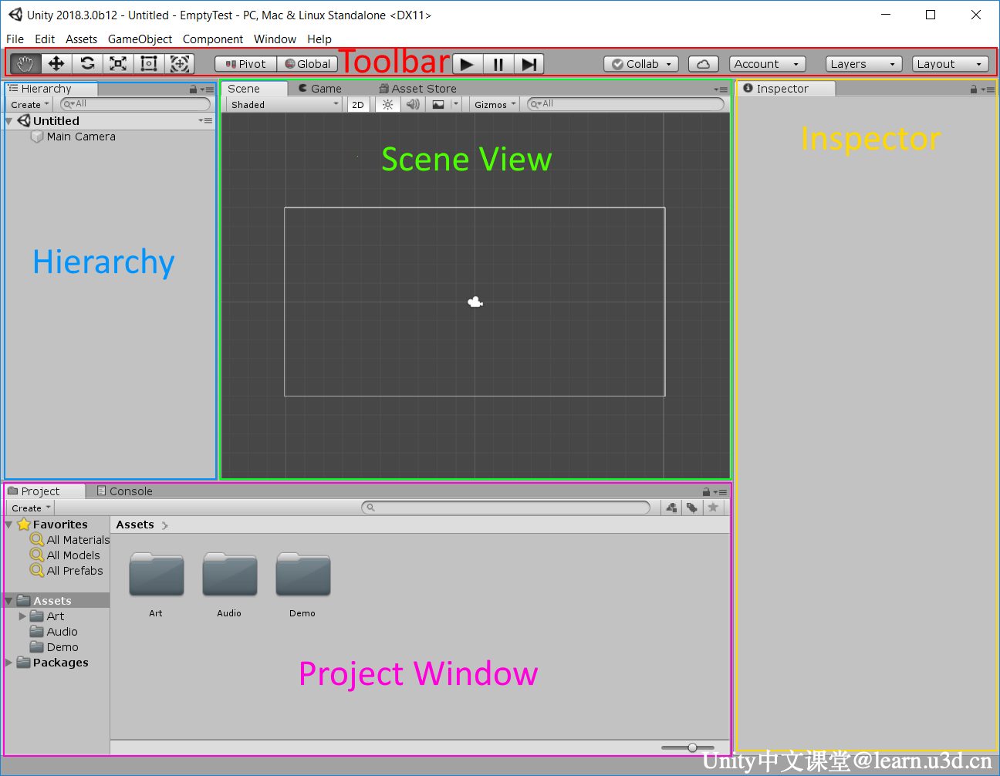

上图是官方文档给出的布局，下图是我自己导入后的布局，给您对照进行参考。

我们打开 `Demo` 文件夹