[TOC]

# 1.正负逻辑系统

1.   正逻辑：在电平图（$Y-t$）中，高电平代表逻辑$1$，低电平代表$0$
2.   负逻辑：在电平图（$Y-t$）中，高电平代表逻辑$0$，低电平代表$1$

而正负逻辑对应的门电路设计在逻辑函数上是对偶的。

| 正逻辑 | 负逻辑 |
| ------ | ------ |
| 与门   | 或门   |
| 或门   | 与门   |
| 与非门 | 或非门 |
| 或非门 | 与非门 |
| 异或门 | 同或门 |
| 同或门 | 异或门 |

>   补充证明：假设有逻辑函数$Y = A + B$，其有反逻辑$G = Y^{'}(C = A^{'},D = B^{'}) = (A + B)^{'} = A^{'} B^{'} = CD$，因此对于$Y = A + B$的反逻辑是$Y = AB$。

后面我们都使用正逻辑电路。

# 2.高低电平实现

数字电路中，高低电平的实现是依靠“开关电路”来完成的，如：二极管、三极管电路。

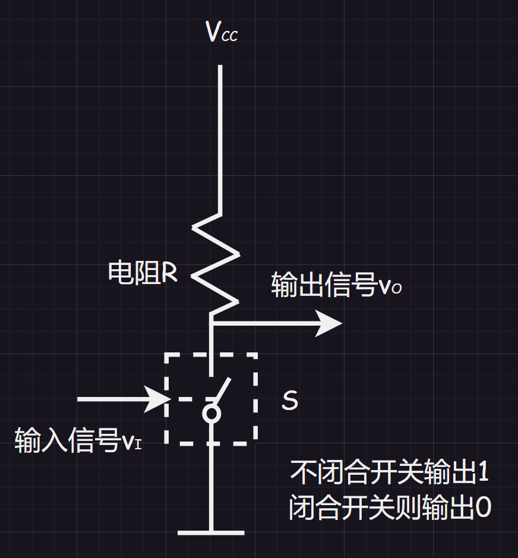

>   补充：这里的电阻是用来保护电路的，$V_{cc}$是

单开关电路功耗大，目前出现互补开关电路（如：`CMOS`门电路），即：用一根管子替代电阻$R$。

互补开关电路中，两个开关总有一个是断开的，流过的电流为零，故电路的功耗非常低，因此在数字电路中得到广泛的应用。

而输出的高低电平不是总是为固定值的，而是在某个区域，以此划分出两个高低电平区域，作为判定高低电平的区间。

# 3.数字电路分类

## 3.1.按内部组成分类

1.   分立元件逻辑门电路：半导体器件、电阻、电容连接而成
2.   集成逻辑门电路：由大量的分立元件通过特定工艺集成到很小的半导体芯片上（可根据规模划分为小规模（$\le 100$）、中规模（$(100,1000]$）、大规模（$(10^{3},10^{5}]$）、超大规模（$\ge 10^{5}$）)

## 3.2.按导电类型分类

$$
\left

\{
\begin{array}{left}
& 单级型(FET)\\
& 双级型(BJT)\\
& 兼容型(FET + BJT)\\
\end{array}

\right.
$$

## 3.3.按功能特点分类

实际上是按照输出方式分类。

1.   普通门（推拉式输出）
2.   输出开路们
3.   三态门
4.   `CMOS`传输门

## 3.1.基本门电路

之前就有接受过一些门电路，这里只是简单提一下：

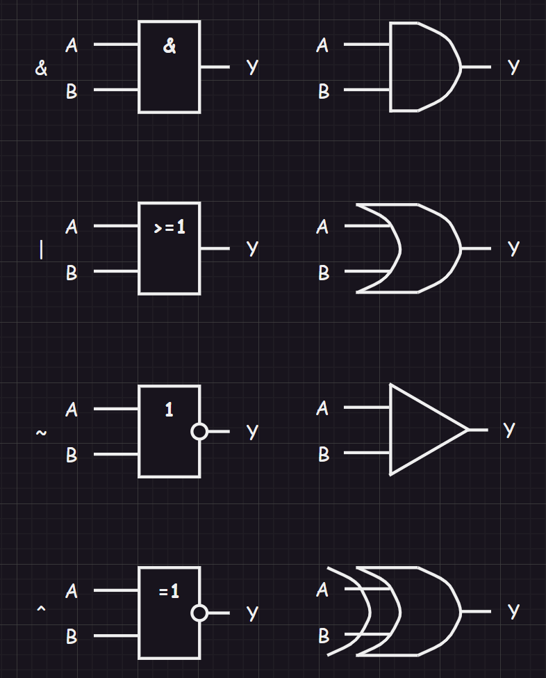

## 3.2.分立元件逻辑门电路

### 3.2.1.半导体

#### 3.2.1.1.本征半导体

本征半导体是完全纯净、结构完整的半导体晶体。由于共价键具强力的结合力，使得本征半导体的中自由电子很少，导电能力很弱。

1.   载流子：在绝对零度（理想情况）和没有外界激发的时候，价电子完全被共价键束缚着，本征半导体中没有可以运动的带电粒子（即：载流子），他的导电能力为$0$，相当于绝缘体。
2.   空穴：在常温下，由于热激发（本征激发），使得一些价电子获得足够的能量脱离共价键束缚，成为自由电子，同时共价键上就留下一个空位，称为“空穴”。
3.   导电机理：空穴有可能在其他力的作用下吸引附件的电子来填补，相当于正电子移动（空穴在迁移），也就是可以认为空穴也是载流子。
4.   两种电流：本征半导体的电流由两部分组成，一是“自由电子移动产生的电流”、二是“空穴吸引电子产生的电流“，因此本征半导体的导电能力取决于载流子的浓度（并且是具有温敏性质的，温度越高浓度越高，导电能力越强）

#### 3.2.1.2.杂质半导体

杂质半导体是在本征半导体中加入微量的杂质（某种元素）就是杂质半导体

1.   $N$型半导体：掺杂五价$P$（外层有五个电子），会多出一个自由电子，这种半导体由于大量掺入，自由电子变多，导致自由电子导电成为主要的导电方式（自由电子是多数载流子）。并且由于失去自己的自由电子，就会变成$P^{+}$

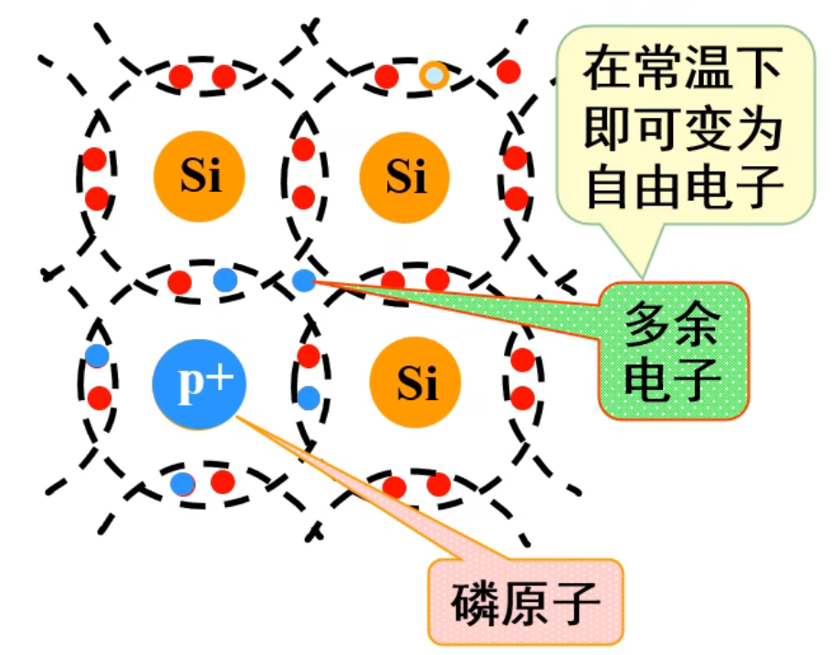

2.   $P$型半导体：掺杂三价$B$（外层有三个电子），会得到一个空穴，由于出现了大量的空穴，导致空穴吸引电子成为主要的导电方式（空穴就是多数载流子）。并且得到自由电子，就会变成$B^{-}$

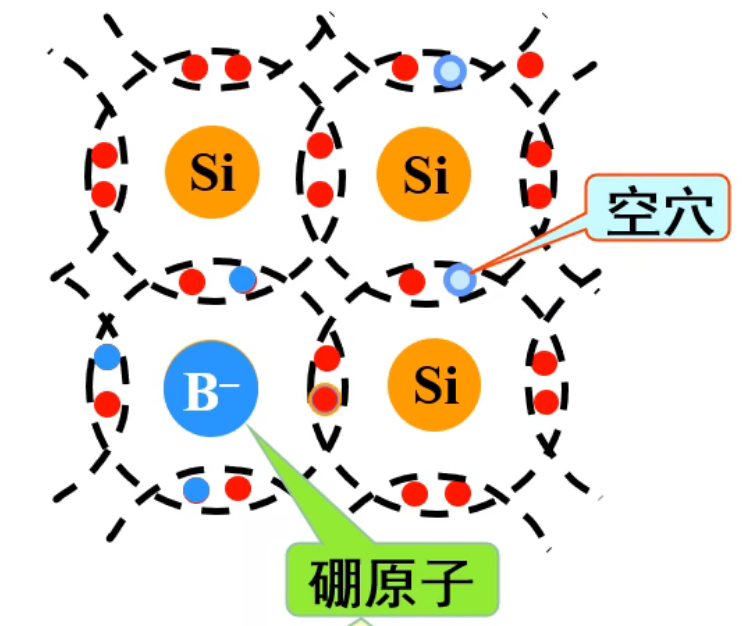

电中性：无论是$P$还是$N$型半导体，从整体上来看都是呈现电中性的，对外不显电性（上述电子的挪动都只是发生在半导体的内部）

#### 3.2.1.3.PN结

$PN$结：两边会形成电子浓度差，造成多子的扩散运动，形成空间电荷区。中间会有内电场，电场力越强（扩散），电子转移（漂移）越多，导致电场力减弱。扩散和飘逸一起，最后达到动态平衡，空间电荷区的厚度固定不变，而这个固定不动的空间电荷区就是“$PN$结”。

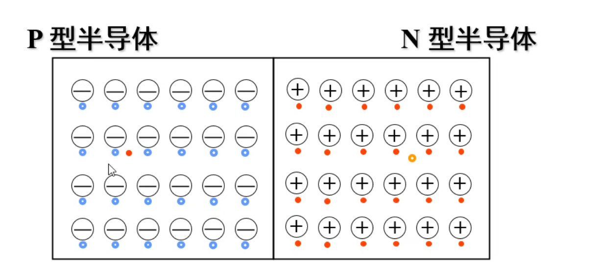

如果我们在外面加上外电场：

1.   $PN$结加正向电压（正向偏置）则可以通电变成导通状态（原因是$PN$结变窄，正向电阻变小，电流变大）
2.   $PN$结加反向电压（反向偏置）则可以阻电变成截止状态（原因是$PN$结加厚，少子漂移运动加强，内部形成反向电流$I_{r}$）

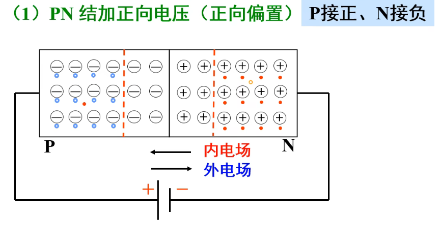

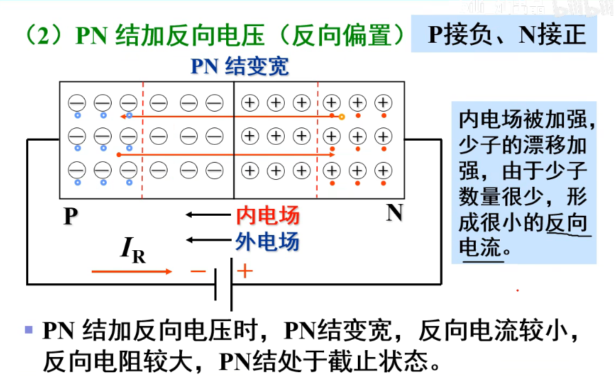

### 3.2.2.二极管

如果将$PN$结加上管壳和引线就会形成二极管，而$LED$灯就是发光二极管。

#### 3.2.2.1.二极管分析

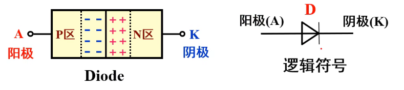

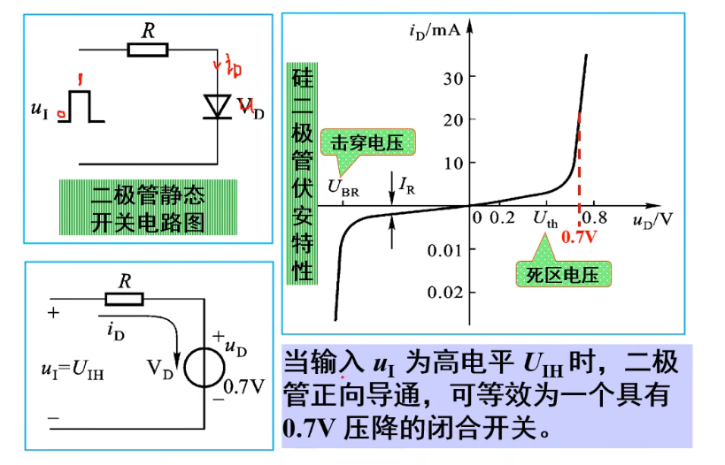

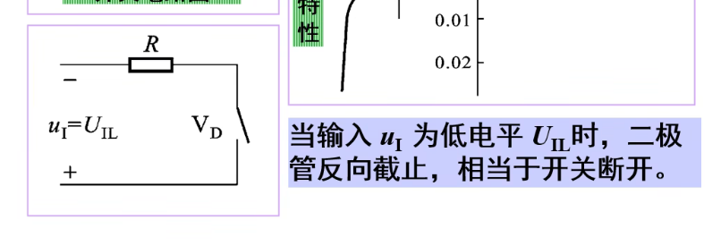

因此我们得到了一个具有开关特性的电子元件：二极管。

#### 3.2.2.2.二极管表示

#### 3.2.2.3.二极管封装

### 3.2.3.三极管

#### 3.2.3.1.三极管分析

三极管也是由$P$型半导体和$N$型半导体构造而成。

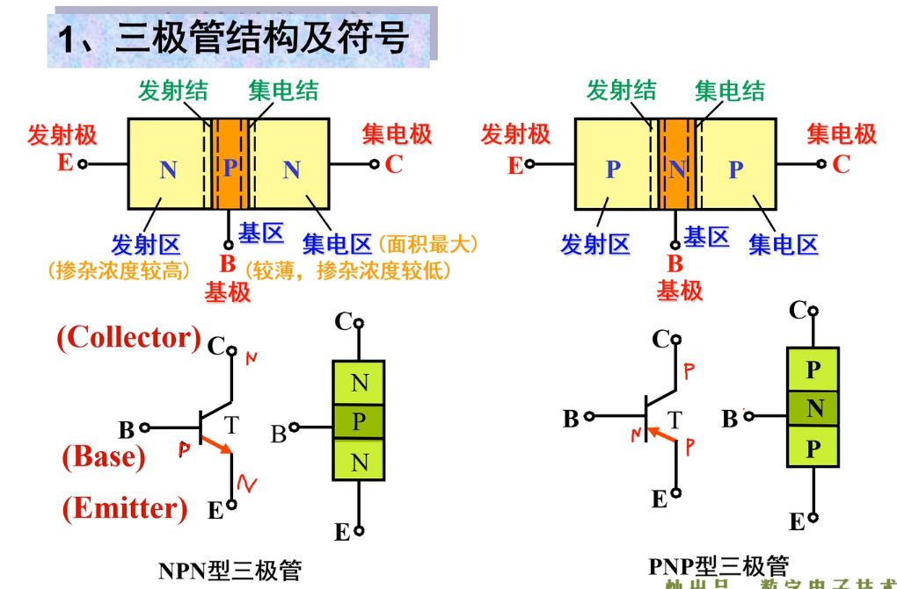

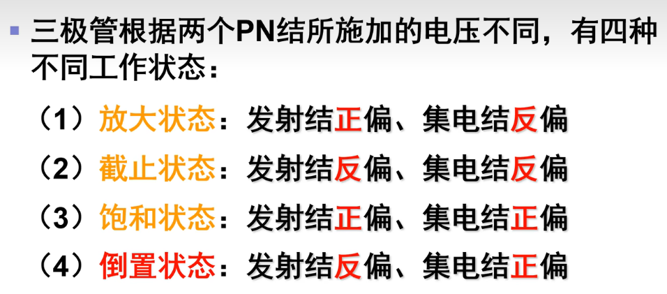

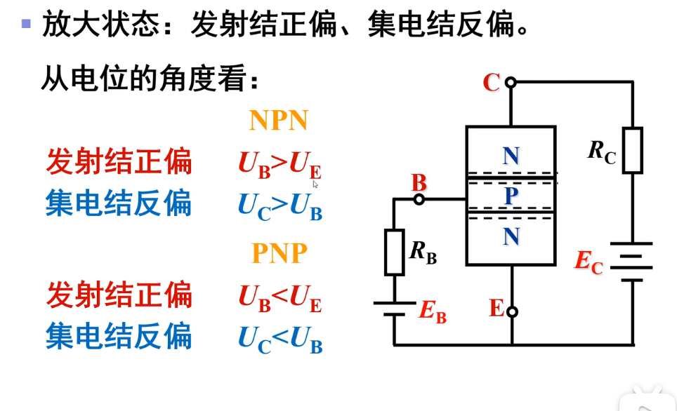

#### 3.2.3.2.三极管表示

#### 3.2.3.3.三极管封装

三极管的封装常见的有：

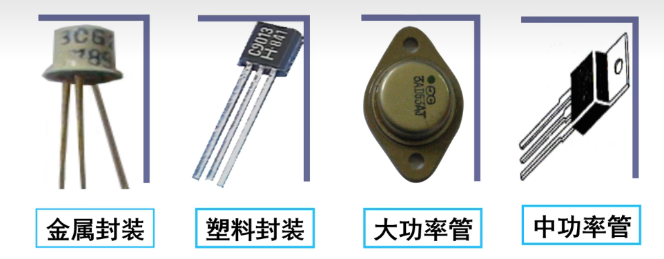

## 3.3.集成逻辑门电路

### 3.3.1.TTL集成门电路

输入端和输出端都用三极管的逻辑门电路。

### 3.3.2.CMOS集成门电路

用互补对称的`MOS`管构成的门电路。
