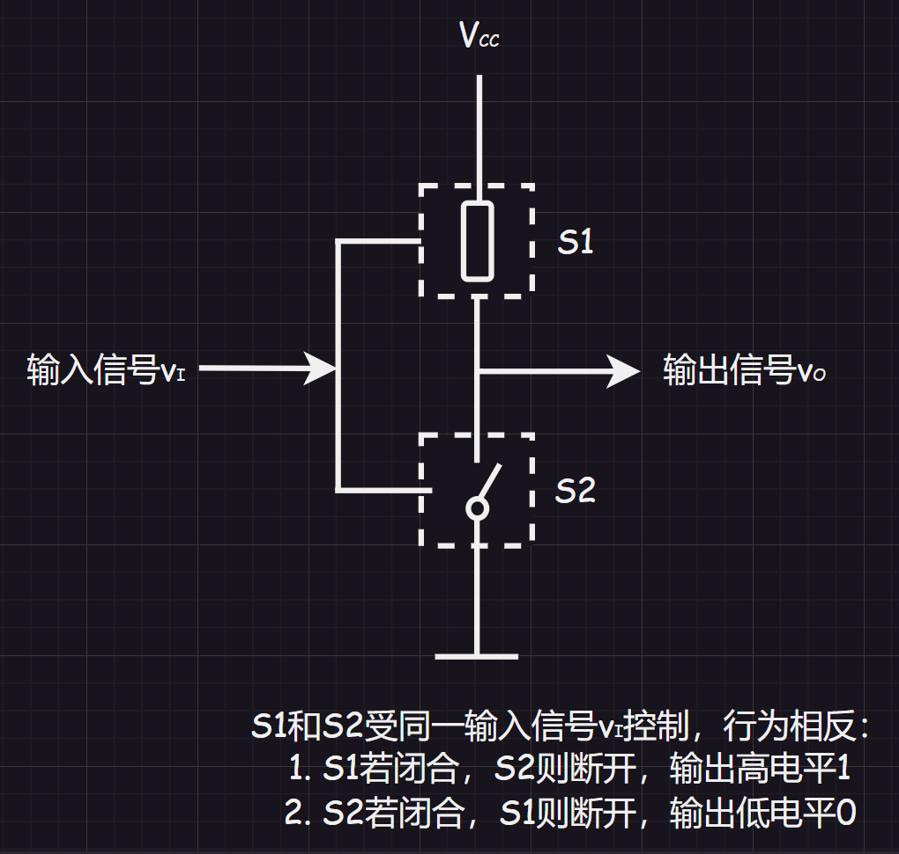

[TOC]

# 1.门电路基础

之前就有接受过一些门电路，这里只是简单提一下：

# 2.正负逻辑系统

1.   正逻辑：在电平图（$Y-t$）中，高电平代表逻辑$1$，低电平代表$0$
2.   负逻辑：在电平图（$Y-t$）中，高电平代表逻辑$0$，低电平代表$1$

而正负逻辑对应的门电路设计在逻辑函数上是对偶的。

| 正逻辑 | 负逻辑 |
| ------ | ------ |
| 与门   | 或门   |
| 或门   | 与门   |
| 与非门 | 或非门 |
| 或非门 | 与非门 |
| 异或门 | 同或门 |
| 同或门 | 异或门 |

>   补充证明：假设有逻辑函数$Y = A + B$，其有反逻辑$G = Y^{'}(C = A^{'},D = B^{'}) = (A + B)^{'} = A^{'} B^{'} = CD$，因此对于$Y = A + B$的反逻辑是$Y = AB$。

后面我们都使用正逻辑电路。

# 3.高低电平的实现

数字电路中，高低电平的实现是依靠“开关电路”来完成的，如：二极管、三极管电路。

单开关电路功耗大，目前出现互补开关电路（如：`CMOS`门电路），即：用一根管子替代电阻$R$。

互补开关电路中，两个开关总有一个是断开的，流过的电流为零，故电路的功耗非常低，因此在数字电路中得到广泛的应用。

# 4.数字电路分类

按组成可分为“分立元件逻辑门电路”和“集成逻辑门电路”：

1.   分立元件逻辑门电路：半导体器件、电阻、电容连接而成
2.   集成逻辑门电路：由大量的分立元件通过特定工艺集成到很小的半导体芯片上（可根据规模划分为小规模（$\le 100$）、中规模（$(100,1000]$）、大规模（$(10^{3},10^{5}]$）、超大规模（$\ge 10^{5}$）)

按导电类型可分为：
$$
\left

\{
\begin{array}{left}
& 单级型(FET)\\
& 双级型(BJT)\\
& 兼容型(FET + BJT)\\
\end{array}

\right.
$$

# 5.半导体

