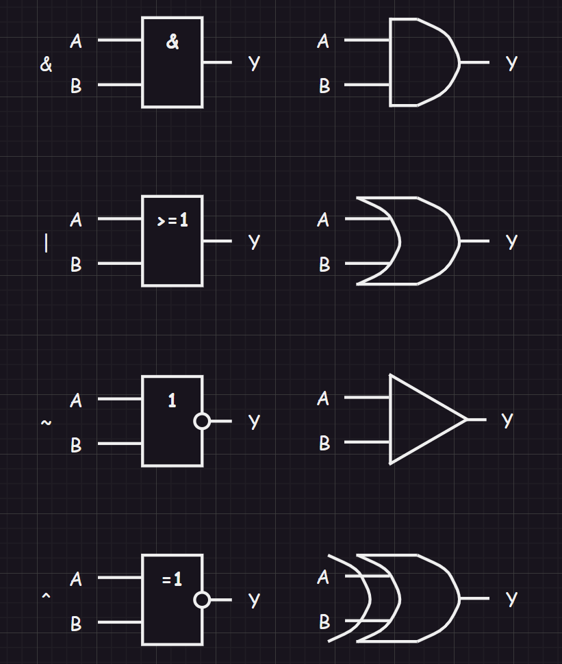
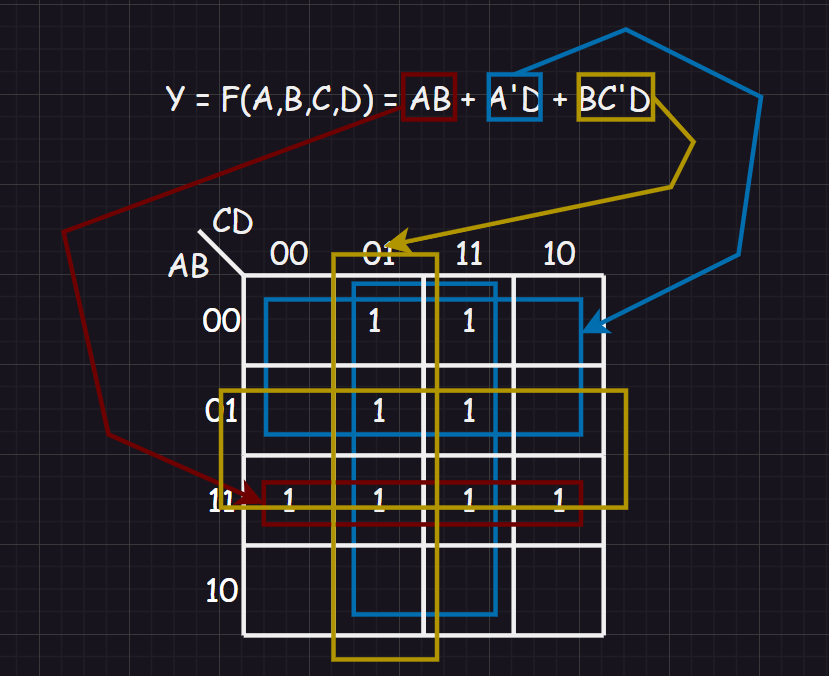
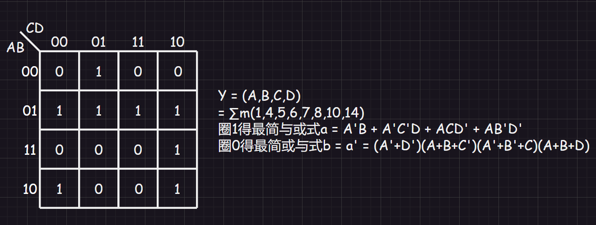

# 1.基本运算

在数字电路中，`0`和`1`是一种对立逻辑，被称为“二值逻辑”，当二值逻辑使用某种因果关系运行时，就是“逻辑运算”。

对于逻辑运算，最基本的三种运算就是：与`&`、或`|`、非`~`，设有两个逻辑变量`A`和`B`，则有以下运算以及派生复合运算：

1.   与运算：$Y = A \cdot B$，其对应的电路实现为“与门”电路
2.   或运算：$Y = A + B$，其对应的电路实现为“或门”电路
3.   非运算：$Y = A^{'}或Y = \bar A或Y = \sim A$，其对于的电路实现为“非门”电路（也叫反相器）
4.   与非运算：$Y = (A \cdot B)^{'}$，其对于的电路实现为“与非门”电路
5.   或非运算：$Y = (A + B)^{'}$，其对于的电路实现为“或非门”电路
6.   与或非运算：$Y = (A \cdot B + C \cdot D)^{'}$，其对于的电路实现为“与或非门”电路
7.   异或运算：$Y = A \oplus B = A B^{'} + A^{'} B$，其对于的电路实现为“异或门”电路（同$0$异$1$）
8.   同或运算：$Y = A\odot B = AB + A^{'} B^{'}$，其对于的电路实现为“同或门”电路（同$1$异$0$）

>   补充`1`：门电路标识符
>
>   
>
>   补充`2`：五种芯片
>
>   在实验中我们经常用到的五种`TTL`芯片就是由即门电路构成的，主要由以下五种，都有`14`个引脚。
>
>   -   `74LS08D`：由四个与门构成
>   -   `74LS32N`：由四个或门构成
>   -   `74LS04D`：由六个非门构成
>   -   `74LS00N`：由四个与非门构成
>   -   `74LS86D`：由四个异或门构成

# 2.基本公式

下面基本不等式也叫“布尔恒等式”：

| 序号 | 公式组                                                       | 公式组                                   |
| ---- | ------------------------------------------------------------ | ---------------------------------------- |
| 1    | $$1 \cdot A = A和0 \cdot A = 0(零一律)$$                     | $$1 + A = 1和0 + A = A(零一律)$$         |
| 2    | $$A \cdot A = A(重叠律)$$                                    | $$A + A = A(重叠律)$$                    |
| 3    | $$A \cdot A{'} = 0(互补律)$$                                 | $$A + A^{'} = 1(互补律)$$                |
| 4    | $$A \cdot B = B \cdot A(交换律)$$                            | $$A + B = B + A(交换律)$$                |
| 5    | $$A \cdot (B \cdot C) = (A \cdot B) \cdot C(结合律)$$        | $$A + (B + C) = (A + B) + C(结合律)$$    |
| 6    | $$A(B + C) = AB + AC(分配律)$$                               | $$A + (BC)=(A + B)(A + C)(分配律)$$      |
| 7    | $$(AB)^{'} = A^{'} + B^{'}(摩根反演律)$$                     | $$(A + B)^{'} = A^{'}B^{'}(摩根反演律)$$ |
| 8    | $$AB + AB' = A(B + B') = A(吸收律)\\A + AB = A(1 + B) = A(吸收律)\\A + A^{'}B = (A + A')(A + B) = A + B(吸收律)\\A' + A'B = A' + B$$ | $$A(A + B) = A(吸收律)$$                 |
| 9    | $$AB + A'C + BC\\ = AB + A'C + BC(A + A')\\ = AB(1 + C) + A'C(1 + B)\\ = AB + A'C(冗余律)\\AB + A'C + BCXY...\\ = AB + A'C + BC + BCXT...\\ = AB + AC + BC(1 + XY...)\\ = AB + A'C(冗余律推广)\\$$ |                                          |
| 10   | $$(A')' = A(还原律)$$                                        |                                          |

异或的运算也满足交换律、结合律、分配律，还满足一个因果互换律。
$$
A \oplus B = C,则有：A \oplus C = B、B \oplus C = A
$$

# 3.基本定理

## 3.1.代入定理

在任何一个包含变量$A$的逻辑等式$S(A)$中，将$A$代入另外一个逻辑子等式$s(b)$后，则$S(A) = S(s(b))$。

>   补充：利用代入定理可以将摩根定律拓展为多变量情况，也就是反演定律。

## 3.2.反演定理

实际上就是利用多变量的摩根定律推导出一个逻辑函数的逻辑反函数。对于逻辑表达式$Y$需要遵循：

1.   将所有`.`换成`+`，`+`换成`.`
2.   `0`换成`1`，`1`换成`0`
3.   原变量变成反变量，反变量变成原变量
4.   取反函数后，需要保持函数的运算顺序（括号优先级最高、非优先级较高、与优先级次之、或优先级最低）
5.   不属于单个变量的非号需要保留（长非号）

>   样例`1`：对于$Y = A(B + C) + C^{'}D$，则$= (A^{'} + (B^{'}C^{'}))(C + D^{'})$
>
>
>   样例`2`：对于$Y = A (B + C)' + CD$，则$Y' = (A' + (B' C')') + (C' + D')$
>
>   样例`3`：对于$Y = ((AB' + C)' + D)' + E$，则$Y' = (((A'+B)C')'D')'E'$

## 3.2.对偶定理

在反演定理的基础上做修改（操作相反），变量保持不变就可以得到$Y$的对偶式$Y^{D}$。并且如果两个逻辑式相等，则两者对应的对偶式也相等，且充分必要。

# 4.描述方法

由于数字电路时开关电路，具有二值变量，一次可以使用逻辑函数来进行描述（效仿普通函数），进而产生逻辑代数学科。

逻辑代数和普通代数类似，存在“交换律”、“结合律”、“分配律”。

也存在“逻辑变量”，但是逻辑变量的取值只有`1`和`0`，其本身没有数值意义，只表示事物的两种逻辑状态。

对于逻辑函数$Y = F(A_{1},A_{2},A_{3},A_{4},...,A_{n})$称为“$F$关于变量$n$的逻辑函数”，而$A_{1},A_{2},A_{3},A_{4},...,A_{n}$称为逻辑变量，取值只有$0$和$1$，而描述逻辑函数有多种方法：

## 4.1.逻辑函数式

就是$Y = F(A_{1},A_{2},A_{3},A_{4},...,A_{n})$。

## 4.2.逻辑真值表

也就是逻辑函数的函数$A-B-Y$表，其中$A$和$B$是输入，$Y$是输出。另外，真值表也可以转化为逻辑函数，只需要找出在真值表中输出为$1$的，根据最小项只有一种变量序列才为$1$的原理转化。

## 4.3.逻辑图

就是将基本逻辑运运算使用电路门图解的方式表达，也就是说，逻辑表达式实际上是电路的代数表达，化简逻辑表达式的另一种理解就是简化电路设计。

## 4.4.波形图

也就是一种特殊函数图形，该函数对应一个逻辑表达式。一般用真值表表示波形图，再转化为逻辑函数比较快一些。而逻辑函数转为波形图使用真值表作为中间，再转化为波形图也很方便。

# 5.两标准型

## 5.1.最小项和最大项

### 5.1.1.最小项

在$n$个变量的逻辑函数中，若$m$为这$n$个变量构成的逻辑积式，并且满足这$n$个变量均以原变量和反变量的形式存在，并且都是出现一次且仅有一次。那么，我们称$m$为该组变量的最小项。

>   例子：给出一组逻辑变量$A、B、C$得到$m = ABC、m = A^{'}BC^{'}...$均称$m$为该组变量的逻辑变量。

可以注意到$n$个变量构成的最小项呈现树形，总共有$2^{n}$个。

最小项有很多，如果精确描述某个最小项呢？这里有一个很巧妙的表达方式：假设变量按$A_{1} \sim A_{n}$来排列，由于每一个变量$A_{i}$为唯一的并且只能取原或者取反，那么可以看作是二进制中的$1/0$数位（原变量假设为$1$，反变量假设为$0$），此时$A_{1} \sim A_{n}$映射为一个唯一的二进制序列$I$，那么对于固定的序列可以精确描述某一个最小项，记号为$m_{I}$，$I$为最小项在该固定变量序列的编号。

>   例子：下面是三变量的最小项求取过程，注意$1$表示原变量$0$表示反变量。
>
>   | $A_{1}$ | $A_{2}$ | $A_{3}$ | 二进制 | 十进制 | $m_{I}$                  |
>   | ------- | ------- | ------- | ------ | ------ | ------------------------ |
>   | $A^{'}$ | $B^{'}$ | $C^{'}$ | $000$  | $0$    | $A^{'}B^{'}C^{'}(m_{0})$ |
>   | $A^{'}$ | $B^{'}$ | $C$     | $001$  | $1$    | $A^{'}B^{'}C^{}(m_{1})$  |
>   | $A^{'}$ | $B$     | $C^{'}$ | $010$  | $2$    | $A^{'}B^{}C^{'}(m_{2})$  |
>   | $A^{'}$ | $B$     | $C$     | $011$  | $3$    | $A^{'}B^{}C^{}(m_{3})$   |
>   | $A$     | $B^{'}$ | $C^{'}$ | $100$  | $4$    | $A^{}B^{'}C^{'}(m_{4})$  |
>   | $A$     | $B^{'}$ | $C$     | $101$  | $5$    | $A^{}B^{'}C^{}(m_{5})$   |
>   | $A$     | $B$     | $C^{'}$ | $110$  | $6$    | $A^{}B^{}C^{'}(m_{6})$   |
>   | $A$     | $B$     | $C$     | $111$  | $7$    | $A^{}B^{}C^{}(m_{7})$    |

最小值还有一些性质值得注意：

1.   对于同一组变量的最小项，有且仅有一组最小项的逻辑值输出为$1$，其他都是$0$
2.   因此也可以得到推论$\displaystyle\sum (\displaystyle\prod_{i=1}^{n}(A_{i})) = \displaystyle\sum_{I=0}^{2^{n} - 1} m_{I} = 1 $，也就是所有最小项之逻辑和为$1$
3.   任意两个最小项的逻辑积为$0$
4.   对于相邻的两个最小项（相邻指只有一个逻辑变量相反，其他都一样，包括次序也一样）进行逻辑和，可以消去这对因子合并为新的一项（例如：$A^{'}B^{'}C^{'}、A^{'}B^{'}C、A^{'}BC^{'}...$只看相邻的$A^{'}B^{'}C^{'}$和$A^{'}BC^{'}$，则$A^{'}B^{'}C^{'} + A^{'}BC^{'} = A^{'}C^{'}(B^{'} + B) = A^{'}C^{'}$）

### 5.1.2.最大项

在$n$个变量的逻辑函数中，若$M$为这$n$个变量构成的逻辑和式，并且满足这$n$个变量均以原变量和反变量的形式存在一次且仅有一次。那么，我们称$M$为该组变量的最大项。

>   例子：给出一组逻辑变量$A、B、C$得到$M = ABC、M= A^{'}BC^{'}...$均称$M$为该组变量的逻辑变量。

可以注意到$n$个变量构成的最大项呈现树形，总共有$2^{n}$个。

最大项也有很多，如果精确描述某个最大项呢？答案和之前表示最小项类似，但是又些许改动：假设变量按$A_{1} \sim A_{n}$来排列，由于每一个变量$A_{i}$为唯一的并且只能取原或者取反，那么可以看作是二进制中的$0/1$数位（原变量假设为$0$，反变量假设为$1$），此时$A_{1} \sim A_{n}$映射为一个唯一的二进制序列$I$，那么对于固定的序列可以精确描述某一个最大项，记号为$M_{I}$，$I$为最大项在该固定变量序列的编号。

>   例子：下面是三变量的最大项求取过程，注意$0$表示原变量$1$表示反变量。
>
>   | $A_{1}$ | $A_{2}$ | $A_{3}$ | 二进制 | 十进制 | $M_{I}$                  |
>   | ------- | ------- | ------- | ------ | ------ | ------------------------ |
>   | $A^{'}$ | $B^{'}$ | $C^{'}$ | $111$  | $7$   | $A^{'}+B^{'}+C^{'}(M_{7})$ |
>   | $A^{'}$ | $B^{'}$ | $C$     | $110$  | $6$  | $A^{'}+B^{'}+C^{}(M_{6})$  |
>   | $A^{'}$ | $B$     | $C^{'}$ | $101$  | $5$  | $A^{'}+B^{}+C^{'}(M_{5})$  |
>   | $A^{'}$ | $B$     | $C$     |  $100$  | $4$  | $A^{'}+B^{}+C^{}(M_{4})$   |
>   | $A$     | $B^{'}$ | $C^{'}$ | $011$  | $3$   | $A^{}+B^{'}+C^{'}(M_{3})$  |
>   | $A$     | $B^{'}$ | $C$     |  $010$ | $2$  | $A^{}+B^{'}+C^{}(M_{2})$   |
>   | $A$     | $B$     | $C^{'}$ | $001$  | $1$  | $A^{}+B^{}+C^{'}(M_{1})$   |
>   | $A$     | $B$     | $C$     |  $000$ | $0$  | $A^{}+B^{}+C^{}(M_{0})$    |

最大值还有一些性质值得注意：

1.   对于一组最大项，有且仅有一组最大项的逻辑值输出为$0$，其他都是$1$

2.   因此也可以得到推论$\displaystyle\prod (\displaystyle\sum_{i=1}^{n}(A_{i})) = \displaystyle\prod_{I=0}^{2^{n} - 1} M_{I} = 0 $，也就是所有最大项之逻辑积为$0$

3.   任意两个最小项的逻辑和为$1$

4.   对于相邻的两个最大项，进行逻辑积，等于各相同变量之和（例如：$A^{'}+B^{'}+C^{'}、A^{'}+B^{'}+C、A^{'}+B+C^{'}...$只看相邻的$A^{'}+B^{'}+C^{'}$和$A^{'}+B+C^{'}$，则
     $$
     (A^{'}+B^{'}+C^{'}) \cdot (A^{'}+B+C^{'}) \\
     = A^{'}A^{'} + A^{'}B + A^{'}C^{'} + A^{'}B^{'} + B^{'}B + B^{'}C^{'} + A^{'}C^{'} + BC^{'} + C^{'}C^{'} \\
     = A^{'}A^{'} + C^{'}C^{'} + 0 + A^{'} + C^{'} + 2A^{'}C^{'} \\
     = A^{'} + C^{'} + (A^{'}+C^{'})^{2}\\
     = (A^{'} + C^{'})(1 + A^{'} + C^{'})\\
     = A^{'} + C^{'}
     $$

## 5.2.最小项和最大项的关系

对于$n$个逻辑变量序列$A_1 \sim A_n$有最小项$m_I$和最大项$M_I$，则两者是互补的，也就是$\overline{m_I} = M_I$。

>   例子：$m_{5}^{'} = {(AB^{'}C)}^{'} = A^{'} + B + C^{'} = M_{5}$

## 5.3.最小项之和和最大项之积

### 5.3.1.逻辑函数的最小项之和形式

式子为积项之和的形式，不一定包含所有最小项，但是每一项必须是最小项。

>   例子：$Y(A, B, C) \\= m_{0} + m_{1} + m_{3} + m_{5} + m_{6} \\= A^{'}B^{'}C^{'} + A^{'}B^{'}C + A^{'}BC + AB^{'}C + ABC^{'}$

在$n$变量的逻辑函数中，若某一积项因为缺少某个逻辑变量导致不是最小项，则可以利用公式$A+A^{'} = 1$，让该不符合最小项的项乘以“该缺失变量的原变量和反变量之和”，使之成为最小项。

>   例子：标准与或式转写$Y(A, B, C) \\= A + B^{'}C \\=A(B^{'} + B)(C^{'} + C) + (A^{'} + A)B^{'}C \\= AB^{'}C^{'} + AB^{'}C + ABC^{'} + ABC + A^{'}B^{'}C + AB^{'}C \\= m_{4} + m_{5} + m_{6} + m_{7} + m_{1}$

### 5.3.2.逻辑函数的最大项之积形式

式子为加项之积的形式，不一定包含所有最大项，但是每一项必须是最大项。

>   例子：$Y(A, B, C) \\= M_{0}  M_{2}  M_{4}  M_{5}  M_{7} \\= (A+B+C)    (A+B^{'}+C)  (A^{'}+B+C)  (A^{'}+B+C^{'}) (A^{'}+B^{'}+C^{'})$

在$n$变量的逻辑函数中，若某一和项因为缺少某个逻辑变量导致不是最大项，则可以利用公式$AA^{'} = 0$让该不符合最大项的项加以“该缺失变量的原变量和反变量之积”，使之成为最小项（期间有可能还会利用分配律$A + BC = (A + B)(A + C)$）。

>   例子：标准或于式转写$Y(A, B, C) \\= AC + B^{'}C \\= (AC + B^{'}) (AC + C) \\= (A + B^{'})(C + B^{'})C \\=(A + B^{'} + CC^{'})( C + B^{'} + AA^{'})(C + AA^{'}) \\= (A + B^{'} + C)(A + B^{'} + C^{'})(C + B^{'} + A)(C + B^{'} + A^{'})(C + A)(C + A^{'}) \\= M_{2}M_{3}M_{6}(C + A + BB^{'})(C + A^{'} + BB^{'}) \\= M_{2}M_{3}M_{6}(C + A + B)(C + A + B^{'})(C + A^{'} + B)(C + A^{'} + B^{'}) \\= M_{2}M_{3}M_{6}M_{0}M_{4}$

## 5.4.最小项之和和最小项之积的关系

首先需要知道逻辑函数如果写成最小项之和的形式为$Y = \displaystyle\sum m_{i}$，则$Y^{'} = \displaystyle \sum m_{k},(k \neq i)$（证明很简单，有$Y + Y^{'} = 1$，又有$Y + Y_{除Y剩余的最小项} = \displaystyle\sum m_{i} + \displaystyle\sum m_{k},(k \neq i) = 1$，故有$Y^{'} = \displaystyle\sum m_{k},(k \neq i)$）

>   例子：如果有$Y = m_3 + m_6 + m_7 = \displaystyle \sum m_i(3, 6, 7)$，则有$Y^{'} = m_0 + m_1 + m_2 + m_4 + m_5 = \displaystyle \sum m_i(0, 1, 2, 4, 5)$

而根据反演定理，可以得到：
$$
Y = \displaystyle\sum m_{i} = (Y^{'})^{'} 
= (\displaystyle \sum m_{k})^{'},其中(k \neq i) 
= \displaystyle\prod (m_{k})^{'},其中(k \neq i) 
= \displaystyle\prod M_k,其中(k \neq i)
$$

# 6.化简方法

## 6.1.简单逻辑函数化简

依靠基本运行、基本公式、基本定理有的时候依旧很难得到两种标准形式，这个时候还有一些其他的方法来辅助我们化简。

化简逻辑函数的另一层是化简电路设计，这点在中小规模集成电路中几乎无法忽略。

### 6.1.1.公式法

就是利用之前提及的基本运算、基本公式、基本定理还有标准型来化简公式。其中“与或式”和“或与式”可以化简为“最简与或式”和“最简或与式”。

#### 6.1.1.1.最简与或式

最简与或式：“与或式”所含有的积项最少，且每个积项中的因子也最少。

化简方法有：

1.   合并法：利用$AB + A^{'}B = (A + A^{'}) \cdot B = B$合并变量
2.   消因法：利用$A + A^{'}B = A + B$等吸收律和冗余律消去变量
3.   配项法：利用$A + A^{'} = 1$增项来化简

需要注意的是，有很多情况下得到其他的最简式都是可以通过最简与或式来转化的。

>   例子`1`：$Y = AB^{'}C + A^{'}BC + ABC^{'} + ABC$
>
>   $Y = AB^{'}C + A^{'}BC + ABC^{'} + ABC + ABC + ABC \\= (AB^{'}C + ABC) + (A^{'}BC + ABC) + (ABC^{'} + ABC) \\= AC(B^{'} + B) + BC(A^{'} + A) + AB(C^{'} + C) \\= AC + BC + AB$
>
>   或者也可以
>
>   $Y = AB^{'}C + A^{'}BC + AB(C^{'} + C) \\= AB^{'}C + A^{'}BC + AB = AB^{'}C + (A^{'}C + A)B \\= AB^{'}C + (A + C)B = AB^{'}C + AB + CB \\= A(B^{'}C + B) + CB = A(B + C) + CB \\= AB + AC + CB$
>
>   例子`2`：$Y = AB^{'} + A^{'}B + BC^{'} + B^{'}C$
>
>   例子`3`：$Y = ((AB^{'})C + C^{'}D)^{'}(AC + BD)$
>
>   例子`4`：$Y = AD^{'} + A^{'}C^{'} + B^{'}C^{'}D + C$
>
>   例子`5`：
>   $$
>   Y = AC + B^{'}C + BD^{'} + CD^{'} + A(B + C^{'}) + A^{'}BCD^{'} + AB^{'}DE + A((B + C^{'})^{'})^{'}
>   $$

#### 6.1.2.1.最简或与式

最简或与式：“或与式”所含有的和项最少，且每个和项中的因子也最少。

化简方法有：

1.   利用$A(A + B) = A$和$A(A^{'} + B) = AB$
2.   利用对偶，对式子整体取一次对偶，经过化简再次对偶

>   例子`1`：
>   $$
>   Y = A(A + B)(A^{'} + D)(B^{'} + C^{'})(A + C + E + H)
>   $$
>   例子`2`：
>   $$
>   Y = A(A + B)(A^{'} + D)(B^{'} + C^{'})(A + C + E + H)
>   $$

### 6.1.2.卡诺图

可以看到公式的化简有些时候很困难，也不够直观，这个时候可以来试试卡诺图，该方法可以直观给出简化的结果。

#### 6.1.2.1.卡诺图定义

将逻辑函数的真值表图形化，把真值表中的变量分成两组分别排列在行和列的方格中，就构成二维图表，即为卡诺图，它是由卡诺（`Karnaugh`）和范奇（`Veich`）提出的。

将最小项按相邻性排列成矩阵，构成卡诺图实质是将逻辑函数的最小项之和以图形的方式表示出来。最小项的相邻性就是它们中变量只有一个是不同的。

第一次遇到卡诺图，可能会好奇其奇怪的排列，实际上横和纵是为了保证任意相邻的最小项都具有相邻属性（只有一位不同）而设计的。并且从$00$开始还可以保证最左和最右的最小项具有相邻属性，最上和最下的最小项具有相邻属性。

#### 6.1.2.2.卡诺图转化

实际上，根据规律$n$变量的卡诺图可以根据$n-1$变量的卡诺图叠折生成。

#### 6.1.2.3.卡诺图表示

要画出逻辑函数的卡诺图，先需要将逻辑函数化为标准“与或式”，然后在相应的地方填$1$即可，卡诺图实际上就存放了$n$变量的最小项组合表。

那能不能使用真值表来推导卡诺图呢？实际是可以的，假设对于上述的$Y = (A,B,C,D)$的最小项展开式子中，如果假设$(A, B, C, D) = (0,0,0,0)$也就是说，只有最小项$A^{'}B^{'}C^{'}D^{'}$是会得到$Y = 1$的，其他最小项必为$Y = 0$，因此可以借助$(A,B,C,D) = (0,0,0,0)$得到$Y$值，来判断$A^{'}B^{'}C^{'}D^{'}$是否存在。而检验其他最小项是否存在也可以利用这个方式，因此可以利用真值图判断，只要$Y = 1$，对应的最小项就存在。

因此我们只需要用逻辑函数代入得到输出就可以得到卡诺图（熟练的还可以“瞪眼法”）。

如果对于非最小项的逻辑函数，可以采取公共交集的方法来画出卡诺图 。

#### 6.1.2.4.卡诺图化简

绘画出卡诺图后，化简就会变得直观有效：

1.   对于圈起的卡诺图中相邻的$2^{n}$个$1$，意味着可以将每个$1$对应的最小项合并中消去$n$个变量（注意边角的情况），可以这么做的原因归功于卡诺图的排列设计
2.   $1$可以被反复圈起，但是每圈一次必须包含没有圈过的$1$（重复圈$1$的设计是因为$A + A = A$，必须包含一个没被圈果的$1$原因也是因为这样）
3.   每次圈$1$，尽可能从圈的最多开始，但是要满足是相邻的$2^{n}$个$1$

>   复习：最小项性质
>
>   对于相邻的两个最小项（相邻指只有一个逻辑变量相反，其他都一样，包括次序也一样）进行逻辑和，可以消去这对因子合并为新的一项。

>   例子：这里给出几个例子供您参考和练习
>
>   1.   $Y = AC^{'} + A^{'}C + BC^{'} + B^{'}C$
>   2.   $Y = B^{'}C + A^{'}B + AC^{'}$
>   3.   $Y = ABC + ABD + AC^{'}D + C^{'}D^{'} + AB^{'}C + A^{'}CD^{'}$

有些时候，卡诺图还可以取反得到反函数$Y^{'}$（这是因为公式$(\displaystyle\sum m_{i})^{'} = \displaystyle\sum m_{k},(k \neq i)$），先将$Y^{'}$通过圈$0$的方式消除变量然后求出，再利用$(Y^{'})^{'}$求得$Y$即可（这在有时会异常简单）。

>   例子：$Y = ABC + ABD + AC'D + C'D' + AB'C + A'CD'$，这道题目就可以尝试画出卡诺图，然后先求出反函数表达式，最后取反得到结果。

而实际上，在卡诺图非$1$的填写$0$，所拥有一个最大项形成的或与式就等价于填$1$形成的最小项形成的与或式（原因是因为$Y = \displaystyle\sum m_{i} = \displaystyle\prod M_k,其中(k \neq i)$）。又因为卡诺图的设计使得最小项和最大项都可以相邻，因此圈$0$也就是在化简最大项。

>   例子`1`：$Y(A,B,C,D) = \displaystyle\sum m(1,4,5,6,7,8,10,14)$化简为“最简与或式”和“最简或与式”两种标准形式。
>
>   
>
>   例子`2`：$Y = \displaystyle\sum m(4,5,6,13,14,15)$化简为“最简与或式”和“最简或与式”两种标准形式。
>
>   例子`3`：$Y = \displaystyle\prod M(2,3,4,6,11,12,14)$化简为“最简与或式”和“最简或与式”两种标准形式。

#### 6.1.2.5.卡诺图拓展

卡诺图除了可以化简逻辑函数，还有一些其他的用途。

##### 6.1.2.5.1.判断函数关系

如果两个逻辑函数的卡诺图一模一样，哪怕式子不一样也是等价的（例如：$K(A,B,C) = AB + A'C + BC$和$G(A,B,C) = AB + A^{'}C$）。

##### 6.1.2.5.2.进行函数运算

分别画出两个逻辑函数的卡诺图，直接按照正常的与、或等运算计算卡诺图内部填入的数字，最终得到的新卡诺图就是两个逻辑函数进行逻辑运算后的结果。

##### 6.1.2.5.3.与或式和或与式转化

可以根据卡诺图和与或式，圈$0$将其转化为最简或于式（原理是$Y = \displaystyle\sum m_{i} = \displaystyle\prod M_k,其中(k \neq i)$）。

### 6.1.3.奎恩-麦克拉斯基化简法（Q-M法）

这个以后补充（适用于多变量和程序实现）。

## 6.2.无关项逻辑函数化简

假设有一台电动机，逻辑变量$A、B、C$代表电动机的正转、反转、停止状态，若三个逻辑变量其中一个设置为$1$，则开始其中一种状态。因此对于变量$ABC$只可能是$100、010、001$三种，不可能出现$000、011、101、110、111$（因为三种状态不可能同时出现），故$ABC$被称为具有约束性的变量。

根据最小项的性质，“对于同一组变量的最小项，有且仅有一组最小项的逻辑值输出为$1$，其他都是$0$”，因此让最小项等于$0$，就可以保证最小项不出现等于$1$的那一个最小项，因此约束项可以合为约束条件：
$$
\left

\{
\begin{array}{left}
A^{'}B^{'}C^{'} = 0,(相当于不会出现000)\\
A^{'}BC = 0,(相当于不会出现011)\\
AB^{'}C = 0,(相当于不会出现101)\\
ABC^{'} = 0,(相当于不会出现110)\\
ABC = 0,(相当于不会出现111)\\
\end{array}

\right.
\\联立方程得到约束条件:
A^{'}B^{'}C^{'} + A^{'}BC + AB^{'}C + ABC^{'} + ABC = \displaystyle\sum d(0,3,5,7)  = 0
$$
也可以得到电动机的正转、反转、停止的逻辑函数为：
$$
\left

\{
\begin{array}{left}
Y_{正转} = AB^{'}C^{'},(只会输出1或0,其中1的情况只有100)\\
Y_{反转} = A^{'}BC^{'},(只会输出1或0,其中1的情况只有010)\\
Y_{停止} = A^{'}B^{'}C,(只会输出1或0,其中1的情况只有001)\\
\end{array}

\right.
$$
也就是说，在结合物理背景的情况下：

1.   在逻辑函数中，输入变量的取值不是任意的，受到限制。对输入变量取值所加的限制称为“约束”，被约束的最小项叫做约束项（也就是上面恒等于$0$的哪些最小项）
2.   输入变量的某些取值对电路的功能没影响，这些最小项称为“任意项”（例如`BCD`码只用前`10`个编码，剩下`6`个项都不可能出现，项的值为`0`或者`1`都不影响整个逻辑函数）
3.   而“约束项”和“任意项”统称为“无关项”

而由于将“约束项”或者“任意项”加入到逻辑函数之中，不会影响逻辑函数的结果，因此在卡诺图中可以将$X$也一起圈起来（也就是将$X$可以看作$1$或$0$），就可以和其他项一起化简逻辑函数。

另外，在与或式中，约束项在“与或式”中一般写作$d$来表示，在“或于式”中一般写作$D$来表示。

>   例子`1`（有利约束项）：化简以下逻辑函数
>   $$
>   \left
>   
>   \{
>   \begin{array}{left}
>   Y = F(A,B,C) = AC + A^{'}B^{'}C + B^{'}C^{'},(逻辑函数)\\
>   B^{'}C^{'} = 0,(约束项)\\
>   \end{array}
>   
>   \right.
>   $$
>   若考虑约束项：
>
>   
>
>   若不考虑约束项：
>
>   
>
>   例子`2`（无利约束项）：化简以下逻辑函数
>   $$
>   \left
>   
>   \{
>   \begin{array}{left}
>   Y = F(A,B,C) = A^{'}B^{'}C^{'} + A^{'}B^{'}C + AB^{'}C,(逻辑函数)\\
>   A^{'}BC = 0,(约束项)\\
>   \end{array}
>   
>   \right.
>   $$
>   若不考虑约束项：
>
>   
>
>   若考虑约束项：此时将约束项看作$0$更好
>
>   
>
>   例子`3`：化简下面式子
>   $$
>   Y = F(A,B,C,D) = \displaystyle\sum m(3,6,8,10,13) + \displaystyle\sum d(0,2,5,7,12,15)
>   $$
>   
>
>   例子`4`：化简下面式子
>
>   $Y(A,B,C,D) =\displaystyle\sum(0,1,6,9,14,15) + \displaystyle\sum d(2,4,7,8,10,11,12,13)$
>
>   例子`5`：化简下面式子
>   $$
>   \left
>   
>   \{
>   \begin{array}{left}
>   Y(A,B,C,D) = \displaystyle\sum A^{'}BC^{'} + A^{'}BCD^{'} + AB^{'}CD^{'} + AB^{'}CD,(逻辑函数)\\
>   A \odot B = 0,(约束项)\\
>   \end{array}
>   
>   \right.
>   $$
>   例子`6`：化简下面式子
>   $$
>   \left
>   
>   \{
>   \begin{array}{left}
>   Y(A,B,C,D) = \displaystyle\sum A^{'}B^{'}CD^{'} + ACD^{'} + ABC^{'}D,(逻辑函数)\\
>   C、D不可能相同,(约束项)\\
>   \end{array}
>   
>   \right.
>   $$

## 6.3.多输出逻辑函数化简

由于单个逻辑函数利用卡诺图化简的结果不一，因此多个逻辑函数一起化简然后设计电路的时候，可以一起考虑，做合理的卡诺图化简，达到优化电路的目的。

# 7.转化方法

有些时候我们需要将“与或式”和“与非式”进行转化，我们只需要将“与或式”整体取两次反函数，保留最外层的取反，化简内层的取反即可。

>   样例：$f(A,B,C) = AB' + BC \to f(A, B, C) = ((AB' + BC)')' = ((AB')' (BC)')'$
