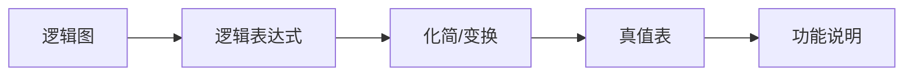
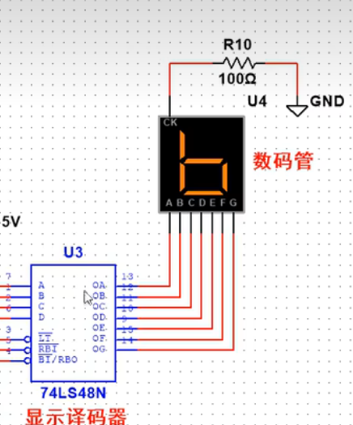

>   前言：组合逻辑电路和时序逻辑电路的区别
>
>   组合逻辑电路是一种只由逻辑门和电线构成的电路，其输出仅由输入信号决定，并且没有存储器件。具体来说，组合逻辑电路的输出仅取决于时刻 `t` 的输入信号，而与之前的输入信号历史记录无关。换句话说，组合逻辑电路的输出只由当前输入信号的状态决定。常见的组合逻辑电路包括加法器、多路选择器、译码器等。
>
>   时序逻辑电路是一种有存储器件的电路，其输出除了取决于当前输入信号外，还受到之前输入信号和内部存储器状态的影响。时序逻辑电路通常包含了触发器、计数器、状态机等功能。时序逻辑电路的输出会随着时间的推移而变化，并且可以保留之前的状态信息，以便后续处理，时序逻辑电路可以用于时钟、计数器、加法器等。

# 1.组合逻辑电路

## 1.1.组合逻辑电路分析

根据给定的逻辑电路，找到输入输出的逻辑关系，确定电路的功能，我们后面将会举出例子演示。

### 1.1.1.例子 1

### 1.1.2.例子 2

>   补充：上述例二如果对结果取反，就是检偶电路。

## 1.2.组合逻辑电路设计

由于卡诺图就是按照循环码来设计的，因此可以借助空卡诺图来快速得出顺序序号和格雷码的一一对应关系。

>   补充：若某个 $B_I$ 没给出，则默认给 $0$ 即可，这在上图有所体现。

然后根据真值表来设计电路，每次只看一个输出结果 $Y$ 来分析即可，画出四个卡诺图得到化简公式：

## 1.3.组合逻辑电路模块

### 1.3.1.编码器

#### 1.3.1.1.二进制编码器

>   补充：当 $I_1$ 到 $I_7$ 都无效时，$I_0$ 就是有效的。

#### 1.3.1.2.二-十进制编码器

#### 1.3.1.3.优先编码器

“优先”是指“优先级”。

### 1.3.2.译码器

#### 1.3.2.1.二进制译码器

#### 1.3.2.2.二-十进制译码器

#### 1.3.2.3.显示译码器

专门搭配数码管，用于显示数字使用。

### 1.3.3.选择器

### 1.3.4.加法器

#### 1.3.4.1.半加器

>   补充：$\sum$ 表示求和，$CO$ 表示进位输出。

#### 1.3.4.2.全加器

#### 1.3.4.3.加法器

##### 1.3.4.3.1.串行加法器

##### 1.3.4.3.2.并行加法器

### 1.3.5.比较器

#### 1.3.5.1.一位比较器

#### 1.3.5.2.多位比较位

### 1.3.6.可编器

## 1.4.组合逻辑电路现象
### 1.4.1.竞争-冒险现象的原因
### 1.4.2.竞争-冒险现象的解决

# 2.时序逻辑电路

