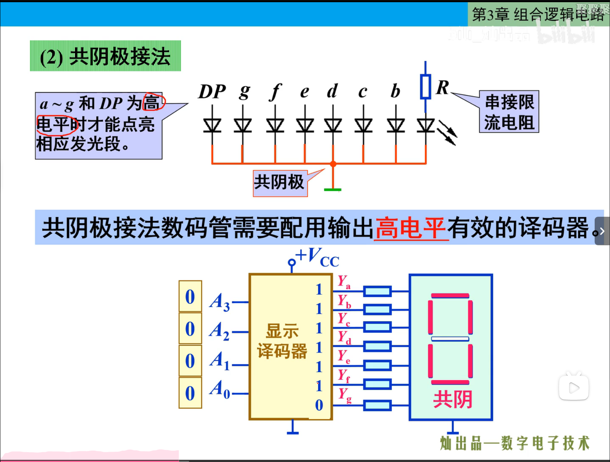
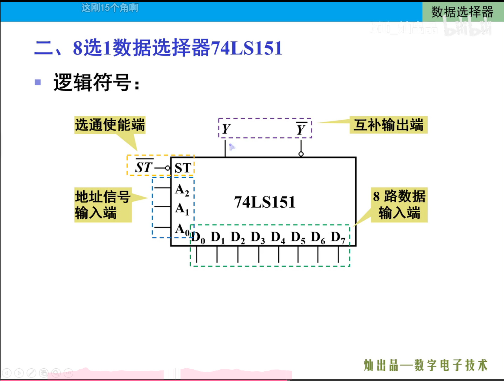
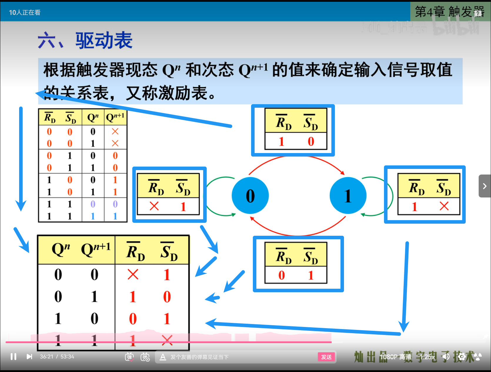
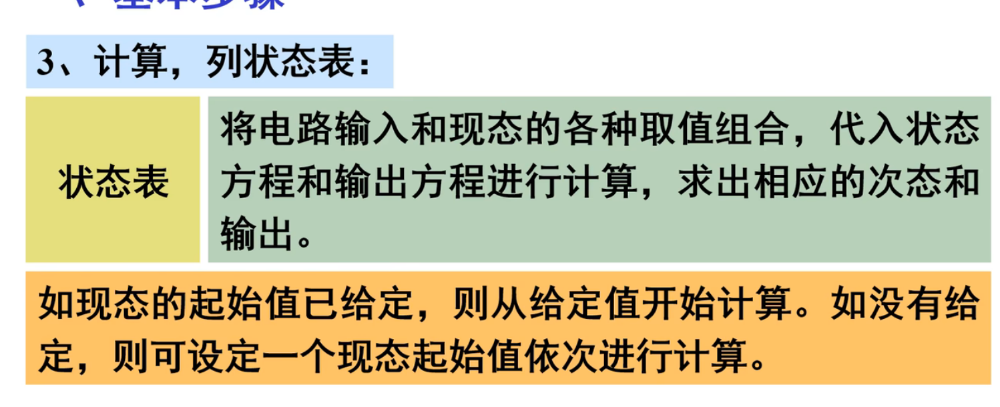
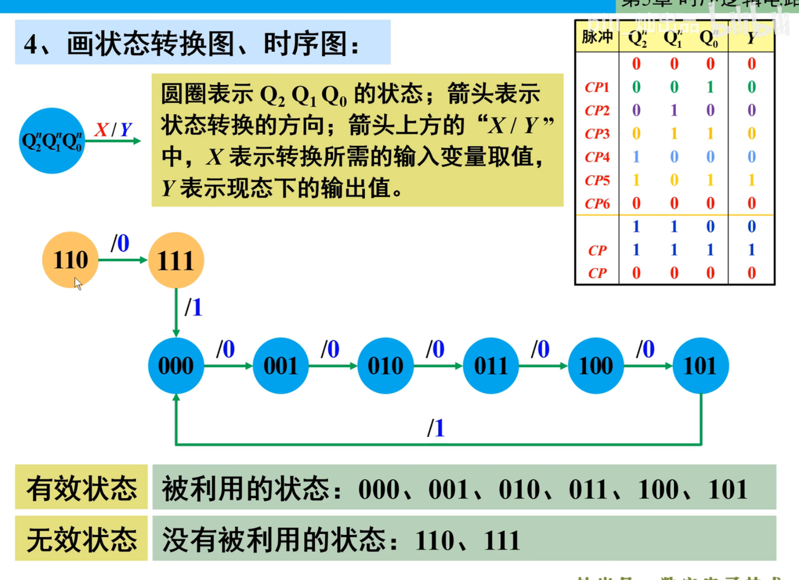
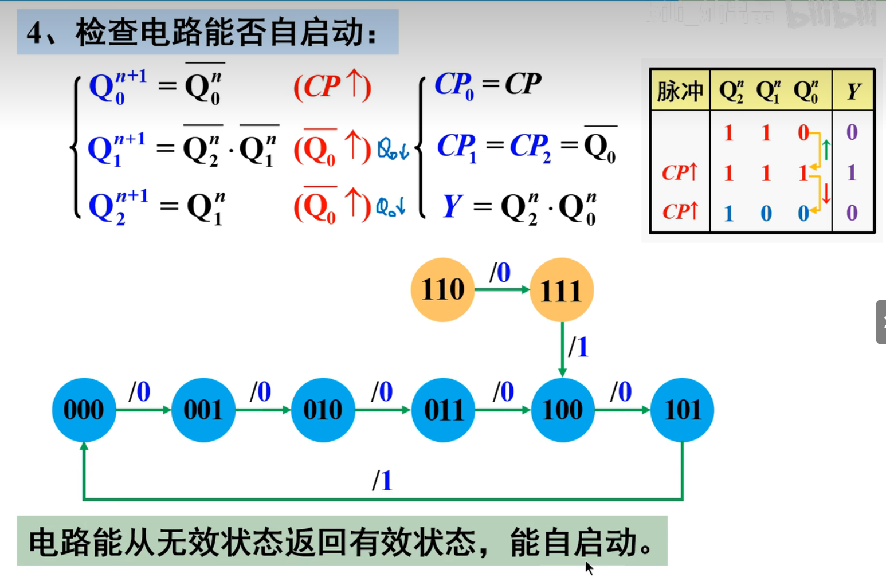
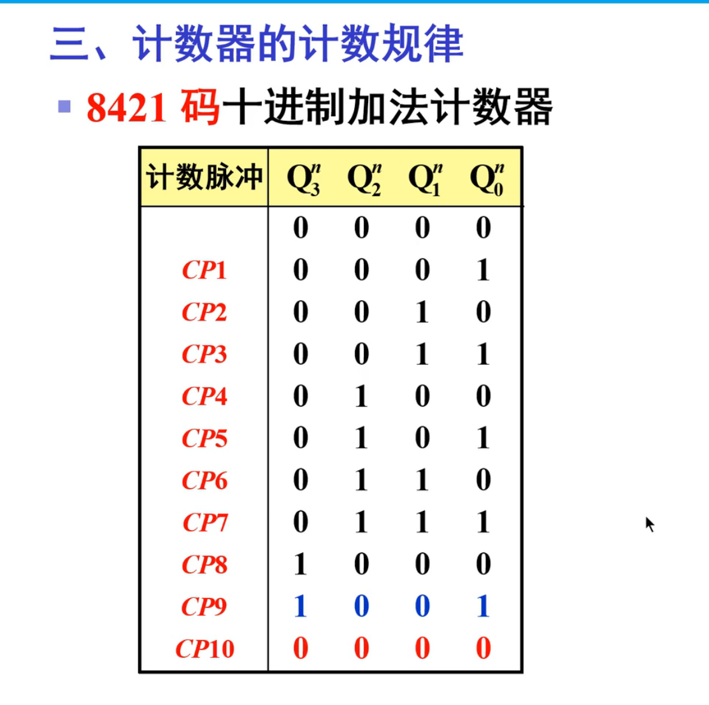
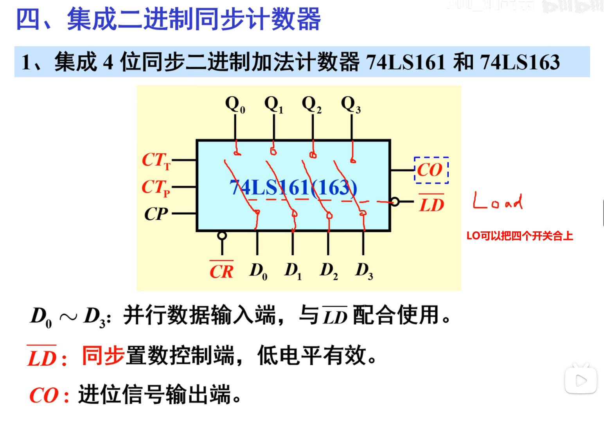

>   前言：组合逻辑电路和时序逻辑电路的区别
>
>   组合逻辑电路是一种只由逻辑门和电线构成的电路，其输出仅由输入信号决定，并且没有存储器件。具体来说，组合逻辑电路的输出仅取决于时刻 `t` 的输入信号，而与之前的输入信号历史记录无关。换句话说，组合逻辑电路的输出只由当前输入信号的状态决定。常见的组合逻辑电路包括加法器、多路选择器、译码器等。
>
>   时序逻辑电路是一种有存储器件的电路，其输出除了取决于当前输入信号外，还受到之前输入信号和内部存储器状态的影响。时序逻辑电路通常包含了触发器、计数器、状态机等功能。时序逻辑电路的输出会随着时间的推移而变化，并且可以保留之前的状态信息，以便后续处理，时序逻辑电路可以用于时钟、计数器、加法器等。

# 1.组合逻辑电路

## 1.1.组合逻辑电路分析

根据给定的逻辑电路，找到输入输出的逻辑关系，确定电路的功能，我们后面将会举出例子演示。

### 1.1.1.例子一

### 1.1.2.例子二

>   补充：上述例二如果对结果取反，就是检偶电路。

## 1.2.组合逻辑电路设计

由于卡诺图就是按照循环码来设计的，因此可以借助空卡诺图来快速得出顺序序号和格雷码的一一对应关系。

>   补充：若某个 $B_I$ 没给出，则默认给 $0$ 即可，这在上图有所体现。

然后根据真值表来设计电路，每次只看一个输出结果 $Y$ 来分析即可，画出四个卡诺图得到化简公式：

## 1.3.组合逻辑电路模块

### 1.3.1.编码器

#### 1.3.1.1.二进制编码器

>   补充：当 $I_1$ 到 $I_7$ 都无效时，$I_0$ 就是有效的。

#### 1.3.1.2.二-十进制编码器

#### 1.3.1.3.优先编码器

“优先”是指“优先级”。

### 1.3.2.译码器

译码器实际上是将具有特定意义的编码（二进制代码）转化为相应信号输出的过程。

#### 1.3.2.1.二进制译码器

假设设计 `3` 位二进制代码的译码器。

注意在芯片中最后的结果是取反的，也就是“低电平有效”，并且还可以利用有效位进行拓展：

#### 1.3.2.2.二-十进制译码器

#### 1.3.2.3.显示译码器

专门搭配数码管，用于显示数字使用，原理也很简单。

#### 1.3.2.4.集成编码器

>   注意 `1`：消隐只会对原本需要显示 `0` 的位置进行灭灯。
>
>   注意 `2`：锁存就会将上一个数据存储起来，无法修改当前锁存的数据。

### 1.3.3.选择器

选择器可以根据地址信号的要求，从多输入数据中选择一条输出。

#### 1.3.3.1.四选一数据选择器

#### 1.3.3.2.八选一数据选择器

### 1.3.4.加法器

#### 1.3.4.1.半加器

>   补充：$\sum$ 表示求和，$CO$ 表示进位输出。

#### 1.3.4.2.全加器

#### 1.3.4.3.加法器

##### 1.3.4.3.1.串行加法器

##### 1.3.4.3.2.并行加法器

### 1.3.5.比较器

#### 1.3.5.1.一位比较器

#### 1.3.5.2.多位比较位

### 1.3.6.分配器

数据分配器没有特有的芯片，一般使用译码器来构成数据分配器。

## 1.4.组合逻辑电路函数

组合逻辑函数的电路设计有多种实现，可以用基础元件实现，也可以用芯片实现：

如果对逻辑函数两次取反变成与非表达式：

那我们如何使用芯片来实现呢？主要是使用译码器和选择器来实现，下面会详细展开。

### 1.4.1.译码器实现组合逻辑函数

如果不使用基础的元件，也可以利用译码器可以输出最小项来得到逻辑函数。

>   注意：函数逻辑式是与或式，因此只要一个最小项为真即可，逻辑函数内只会根据一个最小项输出函数值（最小项只有一个为 $1$，其他都为 $0$）。

### 1.4.2.选择器实现组合逻辑函数

如果不使用基础的元件，也可以利用选择器可以根据 $D_i$ 的取值直接得到对应的逻辑函数。

第二种方法值得推荐。

 

## 1.5.组合逻辑电路现象

这个先忽略，待补充...

### 1.5.1.竞争-冒险现象的原因

### 1.5.2.竞争-冒险现象的解决

# 2.半导体存储电路

触发器简写为 `FF` ，又称为“双稳态触发器”。

## 2.1.基本触发器

### 2.1.1.与非构成的基本 RS 触发器

>   补充：由于触发器的结果是由 `Q` 和 `Q'` 共同决定的，因此后面求出的状态方程实际上是整个触发器的状态，但是由于这个共同决定的结果和 `Q` 是等价的，因此状态方程实际上也是单独关于 `Q` 的方程。

>   补充：在约定俗成下，对于逻辑符号（不是电路图）
>
>   1.   输入：带有小圆圈代表低电平输入有效
>   2.   输出：带有小圆圈代表低电平输出有效

 

 

$Q^{n}$ 应该代表整个触发器之前状态，$Q^{n+1}$ 应该代表整个触发器之后的状态。

记住 $Set$ 是置位，$Reset$ 是复位，而低电平有效即可。

触发器的例题：

注意“不允许”的状态下虽然不允许，但是两个输出绝对都是 `1`，因此也必须标明出来，并且注意从“不允许”恢复的。

### 2.1.2.或非构成的基本 RS 触发器

### 2.1.3.集成 RS 触发器

### 2.1.4.消抖器

>   补充：把这里的开关理解为弹簧开关即可，拨动后可能会发生反弹。

## 2.2.同步触发器

### 2.2.1.同步 RS 触发器

异步输入端开始工作是绝对不会被同步工作端影响的，作用和 `CP` 无关，详细的电路图如下。

### 2.2.2.同步 D 触发器

`D` 触发器保证不再有约束条件。

## 2.3.边沿触发器

  

### 2.3.1.边沿 D 触发器

`0` 和 `1` 的情况

从 `1` 变 `0` 的下降沿

需要注意的是这里的上升沿不对应这个电路结果，不要混一起，上述电路图的上升沿的输出是保持不变的（因此下面的功能表实际上是将下降沿有效通过取反变成了上升沿有效，本质和下降沿有效是一样的）。

### 2.3.2.边沿 JK 触发器

### 2.3.3.边缘 T/T' 触发器

由 `JK` 触发器或者 `D` 触发器构成，没有对应的元件。

## 2.4.转化触发器

### 2.4.1.JK 触发器转其他

### 2.4.2.D 触发器转其他

## 2.5.触发器区别

# 3.时序逻辑电路

## 3.1.时序逻辑电路分析

### 3.1.1.同步时序逻辑电路分析

#### 3.1.1.1.例子一

>   注意：这里的 `J`、`K` 直接代入的不是引脚输出，而是使用整个 `jk` 触发器状态标识来标识引脚输出

#### 3.1.1.2.例子二

### 3.1.2.异步时序逻辑电路分析

#### 3.1.2.1.例子一

#### 3.1.2.2.例子二

## 3.2.时序逻辑电路设计

### 3.2.1.同步时序逻辑电路设计

 

### 3.2.2.异步时序逻辑电路设计

## 3.3.时序逻辑电路模块

### 3.3.1.计数器

#### 3.3.1.1.同步二进制计数器

加法计数器。

减法计数器。

#### 3.3.1.4.异步二进制计数器

#### 3.3.1.3.同步十进制计数器

#### 3.3.1.4.异步十进制计数器

#### 3.3.1.5.N 进制计数器

### 3.3.2.寄存器

#### 3.3.2.1.基本寄存器

#### 3.3.2.2.移位寄存器

#### 3.3.3.3.寄存型计数器

##### 3.3.3.3.1.环形计数器

##### 3.3.3.3.2.扭环计数器

下面介绍一个环形计数器。

### 3.3.4.发生器

全称位顺序脉冲发生器。

轮流输出有效的脉冲。

#### 3.3.4.1.计数型顺序脉冲发生器

#### 3.3.4.2.移位型顺序脉冲发生器

实际上前面讲的一个自启的环形计数器就是一个发生器。

实际上也可以又扭环计数器实现。

