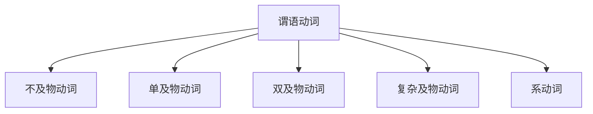
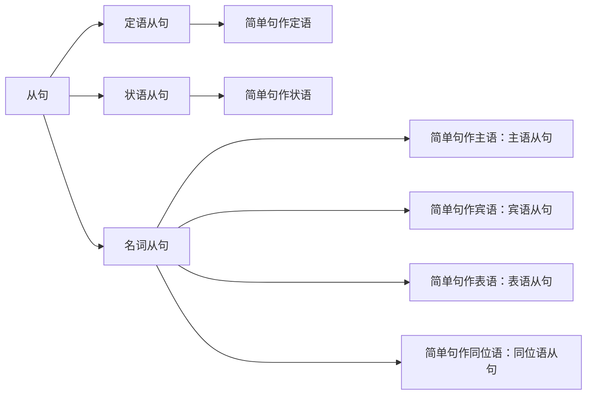

# 1.句子

## 1.1.简单句

说话、写文章的时候，有时用短句子，有时用长句子。不同的短句，可以组合成新的长句，但并不适合语法讨论，只有把长句子拆开来直到不能再拆解的句子，这样的不能再拆的基本句便称作”简单句`simple sentences`”。

这样的简单句除去那些：“嗯、哦、啊...”的感叹句、省略句、（向整句提问的）问句等。

### 1.1.1.简单句构成

而简单句全部都是在说：”什么+怎么样“

-   也就是”主语` subject`+谓语`predicate`“
-   或者说”人/物+动作/发生了什么事“

其中谓语的核心关键在于谓语动词，谓语和谓语动词有很大的区别，前者是“整个句子去掉主语就是谓语”，后者是”谓语中的核心成分“，两者是包含关系。

>   注意：这个动作并不是平时狭义说的”要动起来的动作“，而是广义的动作，也就是我们语法上说的”动词“。

### 1.1.2.简单句类型

有哪些不同类型的动作呢？或者说，有哪些谓语动词呢？有以下`5`种：

1.   可以独立完成的动作，没有承受者的动作叫”不及物动词`intransitive verbs`”

     >   对应句子结构：==主语 + 不及物动词==
     >
     >   例子：Papa Rabbit sleeps.

2.   有一个动作的承受者，这样的动词叫“及物动词`monotransitive verbs`”，而这个动作承受者就是“宾语`object`”

     >   对应句子结构：==主语 + 单及物动词 + 宾语==
     >
     >   例子：Papa Rabbit likes you.

3.   有两个动作承受者，把这样的动词的两个承受者分别称为“直接宾语 `direct object`”和“间接宾语`indirect object`”。其中就算是去除间接宾语，句意也是完整的，而这里的动词就叫做“双及物动词`ditransitive verbs`”。

     >   对应句子结构：==主语 + 双及物动词 + 间接宾语 + 直接宾语==
     >
     >   例子：Papa Rabbit teaches you English.

4.   只有一个动作承受者，但是要和第`2`种情况不太一样，动词必须要有个补充信息，在语法上称为“补足语/补语/宾语补语`compliment`”，这样的需要补语的动词，称为“复杂及物动词`complex-transitive verbs`”

     >   对应句子结构：==主语 + 复杂及物动词 + 宾语补语==
     >
     >   例子：Papa Rabbit considers you smart.

5.   还有最后一种比较特殊的动词，这种动词的作用是“将该动词后的信息赋予前面的主语”，做“赋予/赋值”作用时，没有其他实际意义（偶尔可以翻译出来），而这样的动词被称为“连系动词/系动词`linking verbs`”。由于后面的信息也是一种补充，但是是对主语补充，因此就称为“主语补语/表语`predicative`”

     >   对应句子结构：==主语 + 系动词 + 主语补语(表语)==
     >
     >   例子：Papa Rabbit looks tall.

因此我们通过对动词的分类，就可以对简单句子做分类。

### 1.1.3.简单句成分

通过上述的分类，可以看到简单句包含：主语、谓语动词、宾语、（宾语/主语）补语、定语、状语、同位语。

>   注意`1`：状语就是修饰谓语动词的
>
>   注意`2`：定语可以修饰主语，也可以修饰宾语
>
>   注意`3`：将主语用另外一种方式再说一遍，就是同位语，例子：Papa Rabbit, an English teacher, eats carrots.

## 1.2.复杂句

### 1.2.1.并列句

并列关系：简单叠加起来的简单句，形成一个长句就是并列句。

### 1.2.2.嵌套句

从属关系：通过句子内部嵌套句子的操作，形成的长句就是嵌套句（这种”套娃“就是从句的使用）。

根据从属关系可以将嵌套句划分为”主句“和”从句“，从句说白了就是经过修改的简单句子。

下主要成分定语attributes主要用来修饰主语或宾语如 the little white rabbit ate a large carrot the little white，就是主语 rabbit的定语而 a large，就是宾语 carrot的定语状语 i will主要用来修饰谓语动词如 the rabbit ate quickly兔子快速的吃 quickly就是 it的状语同谓语a positive主要用来再把主语或宾语说一遍如一个英语老师吃胡萝卜这里的an english teacher，其实就是把用不同方式再说一遍在这里算是和主语同等地位而到现在为止我们便说道了英语句子中所有可能出现的句子成分总结一下就是主语谓语动词宾语宾语补语主语主语补语或者说表语定语状语。同位语into再次强调，咱们直到现在所说的都是所谓简单句说。白了，就是没法再拆成更多句子可是我们说话写文章可不全是简单句一个接一个的说呀，除非你才 5岁当然，如果屏幕前的你真的是 5岁，你旅途，我还是非常欢迎你的咱们平时说话写文章经常会把这些不同的简单句互相组合。形成所谓compounds and this和 complex compenses说白了其实就是句子简单的叠加是并列关系直接翻译为复合句，但是有的语法书上的术语是并列句而 complex说白了，就是把一个句子套在另一个句子里，甚至一个句子套在一个句子还能再套一个句子一直套下去此处并不禁止套娃这是一种从属关系complexence直接翻译为复杂句可是神奇的是有些语法数据然后会用复合句这个术语。造成了很多人的混乱在这里一个句子套另一个句子在英语法上分别叫做主句main close和从句 subordinate close从句说白了就是把简单句修改一下来充当另一个句子的句子成分比如我们修改一个简单句它就可以充当另一个句子的主语这就是主语从句比如我们修改一个简单句，它可以充当另一个句子的宾语这就是宾语从句。比如我们修改一个简单句，它又可以充当另一个句子的主语补语或者说表语，这就是表语从句比如我们修改一个简单句，它就可以充当另一个句子的同位语这就是同位语从句以上这几种从句都具有名词的性质。所以又合称为名词性从句另外，我们修改一个简单从句它就可以做定语状语很显然，那些就是定语从句状语从句定语这种套娃的从句啊和咱们中文习惯区别挺大，所以是英语语法难点之一之后，英语兔，我会专门做一个视频合集细讲英语从句以上说了英语的句子成分和造句，但是现在问题来了2个句子也许句子组成的方式相同比如都是主语加谓语动词加宾语可是句中包含的词的类型并不一定相同。比如the rabbit ate a carrot he saw something over很显然，这两句话句型相同。但是包含的词却不太一样，也就是说，同一类句子成分里可能有不同的词类这概念，其实，咱们中文也有语法中的词性包括名词 nouns表人和物比如名词nouns表人和物比如 papa rabbit is rabbit冠词 articles英语中说明人和事物如 pop rabbit is a rabbit代词 pronounce替代人格物比如 i am a rabbit形容词 ejectives形容人和物如 i am a smart rabbit数词 numerous表数量如 i at two carrots副词修饰动词或形容词等等如i a to carrots quickly介词 represent表示，和其他词关系的词如 ia to carrots with chopsticks。看词intellectuals不要感叹如啊，the carrotistic，连词conjunctions连接词和句如 i a two carrot in the potato because i was hungry以上这些词类同我们之前着重讲的动词一起便是英语的十大词类说到这里英语兔，我要提醒你句子成分和句子中的词类是完全不同的概念，这里面，每一种句子成分除了谓语动词是动词其他都可能包含不同的词类你也许注意到了句子成分中最特殊的似乎就是谓语动词这一类。其他句子成分可能是不同词类，但是谓语动词呃很显然只可能是动词英语谓语动词有些很厉害的本领，而这些本领，咱们中文的动词都没有所以是英语语法难点之一谓语动词有咱们中文动词没有的三大本领第一表示动作的时间比如动作可能在过去或将来第二表示动作的状态比如动作可能是已经完成的状态或者正在进行的状态以上两者合在一起称为时态。没错，英语的时态是时间加状态合在一起而并非只有时间英语描述动词时间可能有4种现在过去将来从过去某个时间点算将来过去将来英语描述动词状态也可能是4种未说明也就是一般状态完成进行不但完成而且继续完成进行而动词的 4种时间和 4种状态自由排列组合理论上就有 16种可能的时态。很多同学之所以时态这块很乱，就是没有搞清楚时态实际上是排列组合并不是线性的列表也并非尺和时间有关时态是英语的难点之一，因为咱们中文动词没有这样的特性，英语兔，我之后会专门做一个视频细讲英语的时态第三表示动作的假设情感等这个叫做动词的语气。和咱们平时说话，那个语气不是一个语气。这里是语法的语气比如虚拟语气用来表示意愿和事实相反的假设等在rabbit中， i后的 word就暗示了我其实并不是指兔子中文动词也没有这样的特性，所以也是一大难点英语拓之后也会专门做一个视频细讲动词语气以上3个概念在专业术语中称作动词的 tens aspect mood合称 tam中文往往译作动词的实体系英语兔，我在之后的视频会详细讲述谓语动词的几种例案的本领，但是现在要特别指出一点那就是。英语的谓语动词本身往往是不能够独立完成刚才说的那些本领，以及另外一些其他的本领，而且谓语动词独自也无法完成比如表示，否定可能性必须性等意思想而谓语动词充分发挥，我们必须用到另一类经常和动词一起用的词帮助完成任务，它们就是助动词比如，吃这个谓语动词it为了协助它表示，吃过了完成的状态。就需要用到助动词have have eaten为了协助他表示正在吃进行的状态就需要用到助动词 b is eating为了协助他表示是被吃就要用到助动词 be is eaten为了协助他表示有能力吃就要用到助动词 can can eat为了协助他表示有可能吃就要用到助动词 might might eat为了协助他表示有义务吃就要用到助动词 must must eat为了协助他表示否定不吃就需要用到助动词 do do not eat，但是有个麻烦的事儿就是很多助动词特别喜欢伪装似乎就是爱和你过不去他们除了做助动词没有失忆只是帮助谓语动词而已还可以做实义动词甚至其他词性比如 can还可以是易拉罐 might可以是力量 musty可以是发霉的 do可以是做某事 have可以是拥有 b可以是存在。这些也恰恰是容易让人混乱的地方所以千万不要把助动词和它其他的身份做实义动词时用混淆言语出我再重复一遍千万不要把助动词和它其他身份弄混淆，那么，你也许会问干嘛叫谓语动词啊，不能光叫动词吗？那是因为啊，还有所谓非谓语动词这听起来似乎是一句废话不过之所以这么叫是因为动词除了充当句子中的谓语动词。还有可能充当主语宾语宾语补语主语补语定语等只不过，需要把谓语动词修改一下改成非谓语动词不仅如此非谓语动词几乎可以取代所有的从句从而简化句子只不过，这样的动词就不再具有表示动作时间状态语态语气的功能也就是它们丧失了时态语气语态这些本领了它们是以不同的形式出现在句中包括动词不定式现在分词动名词获取分词这里也有个麻烦事儿不定式长得和谓语动词原型一样，比如我告诉你句中出现了it你并不能确定它是谓语动词还是不定式除非我告诉你其他还有什么词现在分词和动名词长得和谓语动词进行状态一样，比如我告诉你句中出现了 ****你并不能确定它是谓语动词进行中还是现在分词或者是动名词过去分词长得和谓语动词的完成状态一样，比如我告诉你句中出现了 eaten并不能确定它是谓语动词完成了还是过去分词所以说非谓语动词也是英语语法的一大难点。如果你以上几句，不太明白，不用担心英语兔我接下来会专门做一个非谓语动词的视频合集来细讲，这些概念像你这样聪明的同学可能已经意识到了咱们怎么说来说，去都是在说动词呢？您这么感觉就对了，英语兔，我现在就告诉你英语语法的核心就是动词动词能够串起几乎所有语法概念，你要是不信英语兔我现在就用动词来为你高度或者说粗略概括一下整个英语语法体系。英语的核心是动词分为谓语动词和非谓语动词谓语动词分为5种分别决定了简单句也就是不能再拆的句子的 5种基本句型同时，也囊括以下句子成分主语谓语动词宾语宾语补语主语补语也就是表语除此之外，句子成分还有定语状语同位语简单句可以组合成并列关系的复合句以及从属关系的复杂句后者包括主句和从句。从虚可以充当所有除谓语动词外的句子成分句子成分可以由不同词类充当分别是名词代词冠词形容词数词副词介词碳词连词谓语动词可以表达动作的时间状态语气等，但是需要用到助动词助动词还能帮助否定动词表达动词的被动可能性义务性等等。非谓语动词可以视作改动后的谓语动词可以充当除谓语动词之外，所有句子成分取代几乎所有从句简化句子概括完毕，以上就是英语语法体系的容体框架绝大多数的语法规则都逃不出这个框架而无数的规则和特例，也只不过，就是让这个核心体系更加丰富而已。当然，请不要误解英语兔，我做这个视频的目的，我做这个视频可不是要告诉你英语语法很简单很规则就那么几条更不是告诉你。那些厚厚的语法书里全都是废话，英语兔，我做这个视频的目的是尽量简化语法体系简化到一个能够让你看到清晰脉络的地步如果你之前脑中没有一个对英语语法完整清晰的认知。那么，这里，这个粗线条的核心语法框架至少可以帮助你鸟瞰啊。不是兔看全局，但是相应的这样的粗线条就会牺牲一些细节的准确性因为英语语法充斥了大量的所谓特例一个短短视频当然不可能一应俱全，而英语全套的语法非常复杂。可我还是要说你别以为学好全套语法才算学好英语你只要掌握了核心语法就已经基本够用了剩下的只是不断积累和改进请加油。 test question for you what is