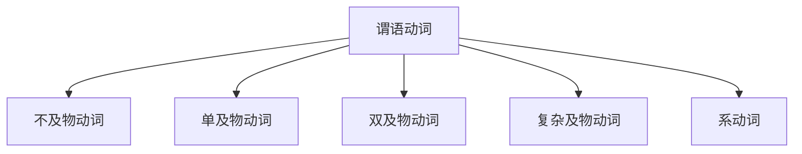
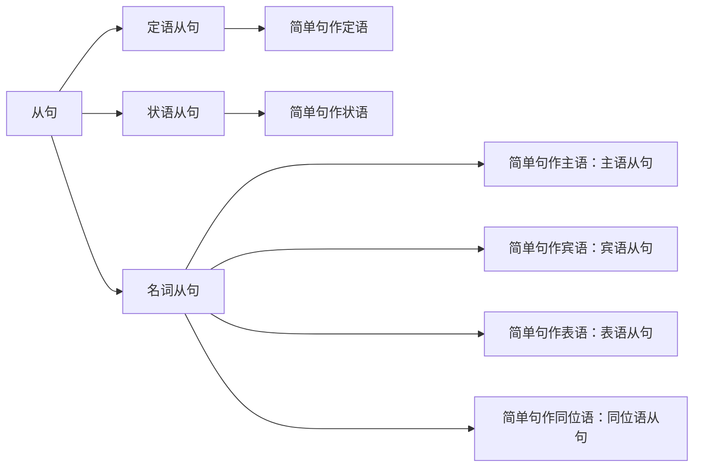
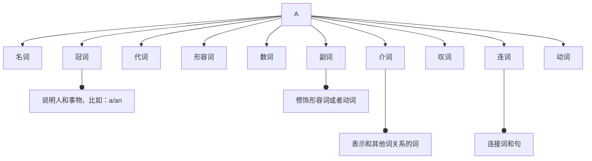
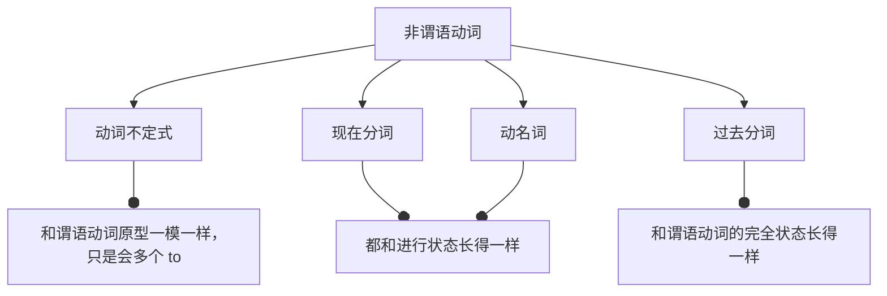

# 1.句子

## 1.1.简单句

说话、写文章的时候，有时用短句子，有时用长句子。不同的短句，可以组合成新的长句，但并不适合语法讨论，只有把长句子拆开来直到不能再拆解的句子，这样的不能再拆的基本句便称作”简单句`simple sentences`”。

这样的简单句除去那些：“嗯、哦、啊...”的感叹句、省略句、（向整句提问的）问句等。

### 1.1.1.简单句构成

而简单句全部都是在说：”什么+怎么样“

-   也就是”主语` subject`+谓语`predicate`“
-   或者说”人/物+动作/发生了什么事“

其中谓语的核心关键在于谓语动词，谓语和谓语动词有很大的区别，前者是“整个句子去掉主语就是谓语”，后者是”谓语中的核心成分“，两者是包含关系。

>   注意：这个动作并不是平时狭义说的”要动起来的动作“，而是广义的动作，也就是我们语法上说的”动词“。

### 1.1.2.简单句类型

有哪些不同类型的动作呢？或者说，有哪些谓语动词呢？有以下`5`种：

1.   可以独立完成的动作，没有承受者的动作叫”不及物动词`intransitive verbs`”

     >   对应句子结构：==主语 + 不及物动词==
     >
     >   例子：Papa Rabbit sleeps.

2.   有一个动作的承受者，这样的动词叫“及物动词`monotransitive verbs`”，而这个动作承受者就是“宾语`object`”

     >   对应句子结构：==主语 + 单及物动词 + 宾语==
     >
     >   例子：Papa Rabbit likes you.

3.   有两个动作承受者，把这样的动词的两个承受者分别称为“直接宾语 `direct object`”和“间接宾语`indirect object`”。其中就算是去除间接宾语，句意也是完整的，而这里的动词就叫做“双及物动词`ditransitive verbs`”。

     >   对应句子结构：==主语 + 双及物动词 + 间接宾语 + 直接宾语==
     >
     >   例子：Papa Rabbit teaches you English.

4.   只有一个动作承受者，但是要和第`2`种情况不太一样，动词必须要有个补充信息，在语法上称为“补足语/补语/宾语补语`compliment`”，这样的需要补语的动词，称为“复杂及物动词`complex-transitive verbs`”

     >   对应句子结构：==主语 + 复杂及物动词 + 宾语补语==
     >
     >   例子：Papa Rabbit considers you smart.

5.   还有最后一种比较特殊的动词，这种动词的作用是“将该动词后的信息赋予前面的主语”，做“赋予/赋值”作用时，没有其他实际意义（偶尔可以翻译出来），而这样的动词被称为“连系动词/系动词`linking verbs`”。由于后面的信息也是一种补充，但是是对主语补充，因此就称为“主语补语/表语`predicative`”

     >   对应句子结构：==主语 + 系动词 + 主语补语(表语)==
     >
     >   例子：Papa Rabbit looks tall.

因此我们通过对动词的分类，就可以对简单句子做分类。

### 1.1.3.简单句成分

通过上述的分类，可以看到简单句包含：主语、谓语动词、宾语、（宾语/主语）补语、定语、状语、同位语。

>   注意`1`：状语就是修饰谓语动词的
>
>   注意`2`：定语可以修饰主语，也可以修饰宾语
>
>   注意`3`：将主语用另外一种方式再说一遍，就是同位语，例子：Papa Rabbit, an English teacher, eats carrots.

## 1.2.复杂句

### 1.2.1.并列句

并列关系：简单叠加起来的简单句，形成一个长句就是并列句。

### 1.2.2.嵌套句

从属关系：通过句子内部嵌套句子的操作，形成的长句就是嵌套句（这种”套娃“就是从句的使用）。

根据从属关系可以将嵌套句划分为”主句“和”从句“，从句说白了就是经过修改的简单句子。

# 2.词语

## 2.1.词类分类

句子成分我们清楚了，但是成分需要有实例化，也就是单词组，即：“词语”来充当成分。

>   1.   the rabbit ate a carrot
>   2.   he saw something over
>
>   很显然，这两句话句型相同，但是包含的词却不太一样，也就是说，同一类句子成分里可能有不同的词类这概念。

除了谓语动词这一成分被动词充当，其他句子成分有可能被其他词类充当。

## 2.2.动词本领

### 2.2.1.谓语动词

在英文里，动词的本身具有本领很强大，可以依靠动词完成：

1.   动作时间的描述
2.   动作状态的描述
3.   动作语气的描述（假设、情感...）

前面两点合称为”时态“，三点合称为动词的`TAM`。

但是动词本身无法独自发挥这些本领（包括否定、被动等），往往需要借助很多助动词来实现（有些助动词会有其他非助动词词性的意思，这也是难点之一）。

### 2.2.3.非谓语动词

并且由于动词除了可以充当谓语动词，还可以充当非谓语动词（主语、谓语动词、宾语、（宾语/主语）补语、定语、状语、同位语）成分。

因此非谓语动词几乎可以做任何类型的从句，但是这样的动词就不再具有动词本领`TAM`了！

这在句子中就表现为：

# 3.总结

可以看到整个英语语法体系的核心点在动词。

