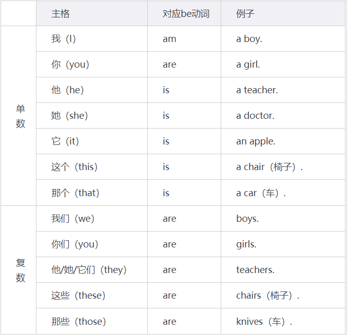
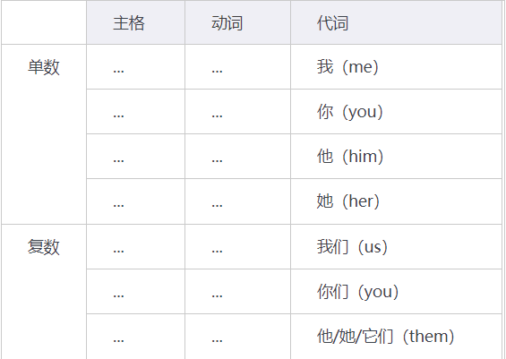
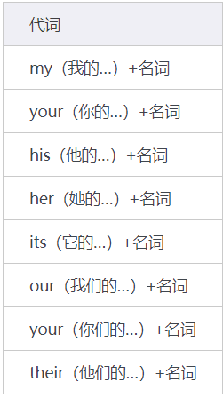
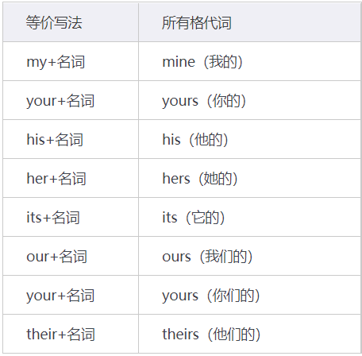
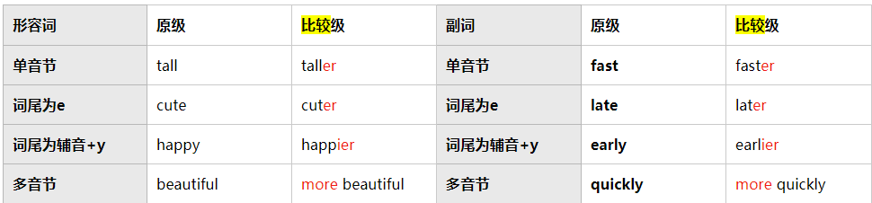
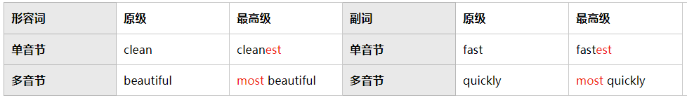

# 0.基础

## 0.1.音标

暂时略过...

## 0.2.词性

1. 冠词：`Articles` (`art.`)

2. 名词：`Noun`(`n.`)、可数名词：`Countable Noun`(`c./cn.`)、不可数名词：`Uncountable Noun`(`u./un.`)

3. 代词：`Pronoun`(`pron.`)

4. 形容词：`Adjective`(`a./adj.`)

5. 动词：`Verb`(`v.`)、及物动词：`Transitive Verb`(`vt.`)、不及物动词：`Intransitive Verb`(`vi.`)、助动词（`helping verb`）

6. 连词：`Conjunctions`(`conj.`)

7. 介词：`Prepositions`(`prep.`)

8. 副词：`Adverbs`(`ad./adv.`)

9. 叹词：`Interjections`(`int.`)

10. 疑问词：`interrogative`

# 1.冠词

## 1.1.不定冠词a/an

表示“一个”，是一种“泛指”，要和“特指”的`the`区分开来。

使用`a`还是`an`要根据下一个单词的第一个音素来决定。如果该音素是元音音素`/a/、/e/、/i/、/o/、/u/`，那么就应该使用`an`。否则，就应该使用`a`。

如果是复数形式的名词，不能使用`a/an`。

> an apple.
> 
> This is a red apple.

## 1.2.定冠词the

`the`具有“指出特定”作用，可以翻译为“那个/哪些”。可以替代`a/an`和`this(这个)/than(那个)`和`these(“这些”this的复数)/those(“那些”than复数)`，单复数都可以。

## 1.3.零冠词

在概念、职业、类别、学科、语言、餐饮名称、国籍宗教的时候通常都会省略冠词。

# 2.名词

## 2.1.普通名词

### 2.1.1.“名词单数”与“名词复数”

1. 普通名词：名词+s（girl----girls）

2. 名词s：名词s+es（bus----buses）

3. 名词y：去y，名词+ies（baby----babies）

4. 名词f/fe：去f/fe，名词+ves（thief----thieves）

5. 特殊名词：特殊处理（man----men，you----you）

### 2.1.2.“名词可数”与“名词不可数”

只有可数的名字才有单数和复数的区分，不可数名词则没有。而关于可数和不可使名词的区分只有一个大概的判断，具体使用还是要以经验为主。

1. 可数名词：明确可数的，通常不可用刀切开。大多数保持外表完整（cat、dog、bus）

2. 不可数名词：没有明确的数量可数。通常外表不具体，所以拿刀切开后，本质不变（time、water、money）

## 2.2.专有名词

“专有名词”的种类有：人名、地名、国家、语言等

1. 第一个字母要大写

2. 专有名词不需要加“a/an”来表示数量，因为专有名词是独一无二的

## 2.3.数字与序数词

## 2.4.年份月份日期

# 3.代词（和格）

## 3.1.主格，用作主语

## 3.2.宾格，用着宾语

### 3.2.1.直接宾语

### 3.2.2.间接宾语

有的时候可以看到这种句子`He give me a present.`这个时候`me`就是一个间接宾语。

## 3.3.人称代词所有格（形容词性物主代词）

当作形容词使用即可。

## 3.4.所有格代词（名词性物主代词）

当作名词使用即可。

## 3.5.有生命所有格（所属）

### 3.5.1.单数名词+`'s`

> John's 
> 
> that dog's
> 
> his student's
> 
> that man's
> 
> his student's
> 
> Mary's book is blue.
> 
> Mary's books are blue.

### 3.5.2.复数名词+`s'`

> cats----cats'
> 
> girls----girls'
> 
> parants----parants'
> 
> man----men's
> 
> women----women's
> 
> children----children's

## 3.6.无生命所有格（所属）

部分+`of`+全部。

> The cap of the cup is black.（这里的the其实是特指某个杯子/杯盖，而不是所有杯子/杯盖，要和a/an区分开来）
> 
> The windows of the house is broken（broken是“破损的”）.
> 
> The leg of the table is good.（leg是“腿”）
> 
> The diamond(s) of the ring are beautiful. （diamond是“钻石”，ring是“戒指”）

## 3.7.反身代词

| 单数                     | 复数       |
| ---------------------- | -------- |
| myself                 | ouirself |
| yourself               | yourself |
| himself、herself、itself | themself |

4.形容词
=====

形容词直接可以加在名词前面，用来修饰名词。另外可以注意指示代词也可以做形容词来修饰（that boy、those boy）。

## 4.1.原级/比较级/最高级/不规则

### 4.1.1.原级

原级有一个语法就是`A + be + as + 形容词/副词原型 + as + B`意为“A像B一样...”，两个相比的`A`和`B`需要在语法上是同级的，比如：同时使用主格。

> You are as smart as he.

### 4.1.2.比较级

`A + 形容词/副词比较级 + than + B`意为“A比B...”

> I am taller than he.
> 
> She is more intelligent(聪明) than her classmates.

### 4.1.3.最高级

`the + 形容词/副词最高级 + [范围]`，这里的`the`是“特定”的意思。

> Our classroom is the cleanest in the(或this) school.

### 4.1.4.不规则

另外还有少数不规则的比较级、最高级变化。

## 4.2.every

`every`的意思是“每一个”，属于形容词，“每一个”算作单数，`be动词`要用`is`。

> eg：Every student is happy.
> 
> eg：why is every house green?
> 
> eg：Is every postman busy?

4.3.many/much
-------------

“many/much”都意为“许多的”，不同的是前者搭配可数的名词，后者搭配不可数的名词。

> many的使用例子：
> 
> 1. many books
> 
> 2. many birds
> 
> 3. many apples
> 
> 4. He has many apples.
> 
> 5. There are many apples on the desk.
> 
> 6. Your have many chairs.

> much的使用例子：
> 
> 1. much time
> 
> 2. much money
> 
> 3. much water
> 
> 4. I drink much water.
> 
> 5. There is much water in the pool.
> 
> 6. There is much beer in the kitchen.

> 补充：实际上`more`和`most`是变化过来的比较级
> 
> I like that table more.
> 
> I like that table most.

# 5.动词

## 5.1.系动词

### 5.1.1.be动词

`be`动词是常见的系动词，但是不只有`be`动词是系动词

### 5.1.2.感官动词

## 5.2.使役动词

## 5.3.助动词

### 5.3.1.do/does

1. 基础使用

一般疑问句只需要将`be`动词前移就好了，但是在上面讲的例如`have`、`teach`的句式里没有`be`动词，这个时候就需要助动词来“协助”了，协助句子成为一个疑问句。

同理遇到三单也要改`do`变成`does`，原本句子中遇到三单的动词就会被“打回原形”。

> I have a book.----Do I have a book?
> 
> He has a book.----Does he have a book?
> 
> She teaches me English.----Does she teach me English?
> 
> We teach them history.----Do weteach them history?
> 
> Does their father teach us music?

2. `do/does`的肯定/否定回答

当不是`be`动词的问句，而是实义动词的问句时：do除了当组动词还可以取代“所做的事情”，代表“是”的意思。可以做一个简单的回答使用。不过西药注意第三人称单数的问题！即：`be`动词问句用`be`动词回答，实义动词的问句用`do/does`回答。

> Do you teach him English?----Yes, I do.
> 
> Does that teacher teach us English?----Yes, he does.
> 
> Does she teach him math?----Yes, he does.

否定和`be`动词类似，在后面加上`not`即可，注意三单的问题。

> Do you teach him math?----No, I do not.

为了简便，`do+not=don't，does+not=doesn't`

> Do you teach him math?----No, I don't.
> 
> Does he teach you math?----No, he doesn't teach me math.
> 
> Do they teach you art?----No, they don't.(They don't teach me art.)

### 5.3.2.情态动词

## 5.4.及物动词和不及物动词

及物动词后面有承受动作的宾语，不及物动词后面不需要有承受动作的宾语。大部分动词都是兼具“及物”和“不及物”属性，只有少部分动词只当“及物动词”或“不及物动词”。

> eg：“I have a book.”后加宾语后，表达的意思比“I have.”要完整
> eg：“I smile”表达的意思就已经足够了，后面无需再多加宾语

> 补充：
> 
> 1. 只当及物动词
>    应该是`I like the house.`而不能是`I like.`，如果单纯是表达我喜欢可以用`I like it.`（创造了一个“假的宾语”来承受 ）
>    Does he like the song?----Yes, he likes it. 
> 
> 2. 只当不及物动词
>    应该是“I sleep.”而不能是“I sheep the bed.”

## 5.5.have

`have`意为“拥有”，注意和`there be`表示存在句区分开来，`have`是动态，`there be`是静态。有三单的情况下，`have`要改写成`has`

> eg：Your have a cat.
> 
> eg：He has a cat.
> 
> eg：This boy has a cat.

## 5.6.teach

`teach`意为“教”，后面接宾格。

> eg：I teach him English.（英语句子里只能有一个动词）
> eg：We teach her English.
> eg：He teaches her math.（注意动词里的第三人称单数，即三单的问题）

6.连词
====

6.1.简单对等连词
----------

### 6.1.1.because

`because`的意思是“因为”，主要有两种用法。

1. 放在句中：`句1+because+句2`

2. 放在句首：`because句1, 句2`（可以把逗号当作“所以”来理解记忆）

> eg：He is smart because he is a scientist.（他很聪明，因为他是科学）
> 
> eg：Beause he is sick, he is sad.（因为他病了，所以他很伤心）

### 6.1.2.although

`although`的意思是“虽然”，主要有两种用法。

使用方法和`because`一样

1. 放在句中：`句1+although+句2`

2. 放在句首：`although句1, 句2`（可以把逗号当作“但是”来理解记忆）

> eg：Although I am poor, I am happy.
> 
> eg：Although the(this) piano is good, it is old.
> 
> eg：I am happy although I am busy.
> 
> eg：The(That) new postman is nice although he is stupid.
> 
> eg：That driver is thin although he is healthy.

### 6.1.3.so

`so`的意思是“所以”，`句1, so+句2`。

> eg：He is sick, so he is weak.
> 
> eg：She is sick, so she is tired.

### 6.1.4.but、and、or

1. `but`的意思是“但是”，用于转折句子，前面有句子要加逗号

2. `and`的意思是“和、而且”，通常连接意思对等的句子，前面有句子要加逗号

3. `or`的意思是“还是、或是”，主要是让对方在答案中选一个，前面有句子要加逗号

> eg：Billy is poor, but he is happy.
> 
> eg：Your sister is tall, and your sister is smart.
> 
> eg：Is your son tall or short?

### 6.1.5.if

`if`表示“如果”的意思，经常和表示“必须”的`have(has)+to+动词原型`搭配

if的使用方法和`because`一样。

> eg：If your sister wants to speak English well, she has to study hard.（如果你妹妹想说好英语，她必须努力学习）
> 
> eg：You have to study hard if you want to speak English well.（如果你想说好英语，你必须努力学习）

## 6.2.复杂对等连词

待补充...

# 7.介词

## 7.1.地点介词

| 介词             | 意义                  | 例句                                                                        |
| -------------- | ------------------- | ------------------------------------------------------------------------- |
| in+地点          | 在…里面                | That cat is in my room.                                                   |
| on+地点          | 在…表面上               | That apple is on your chair.                                              |
| at+地点          | 在…地点（超级近）           | He is at that station.                                                    |
| beside+地点      | 靠着…（比较近）            | That cat is beside your baby.                                             |
| near+地点        | 在…附近（距离最远）          | My house is near that park.                                               |
| under/below+地点 | 在…东西“正”下方/下方        | His box is under the car.  His box is below the car.                |
| over/above+地点  | 在…东西“正”上方/上方（都是悬浮的） | That balloon is over your house.  That balloon is above your house. |

> 注意：“在树上”的写法，如果是树本身的东西（果实、叶子）就使用`on`，如果不是树本身的东西（穿梭在林间的动物）就使用`in`。

> 补充：to介词用在地点时
> 
> 1. `to+目的地`：“走向/跑到某个地方”，但是如果遇到了`here/there`这样的地点副词就不需要使用`to`了，直接跟上目的地就行（因为地点副词本身就有辅助说明地点位置 的功能）
> 
> 2. `go+to+地点`：“去/向某个地方”后面地点一般使用`the`连接，或者有的时候也不加`to`，例如`go to the bookstore`、`go home`、`go to school`
> 
> 3. `come+to+地点`：“来到某个地方”，例如`comes to here`
> 
> 另外“想要睡觉”的翻译有两种：
> 
> want to sleep.（这里的to是不定式）
> 
> wan go to bed.（这里的to是介词）

## 7.2.时间介词

| 介词  | 意义         | 例句                                          |
| --- | ---------- | ------------------------------------------- |
| in  | 表示一段时间内    | I want to go Japan in February（2月）.         |
| on  | 表示一个指定日期   | Jonn plans（打算）to swim with Billy on Friday. |
| at  | 表示一个比较精确时间 | at one o'clock.                             |

## 7.3.伴随介词

常用为`做某事+with+某人`意为“和某人做某事”，其中“某人”要用宾格。

> eg：I run with him.（对比I run to him.语境是不一样的）
> eg：I often swim with him.
> eg：I seldom drink with him.

## 7.4.目的介词

常用为`for+某人”意为“为了某人做某事`，其中“某人”要用宾格

> eg：These books are for you.
> 
> eg：I teach math for him.
> 
> eg：Why are these flowers for me?

# 8.副词

英语中的副词是一类用于修饰动词、形容词、其他副词或整个句子的词语（中文的“xx地”）。注意副词也是有比较级的，不过我已经写在上面的形容词里了。

## 8.1.频率副词

| 频率分布                        |
| --------------------------- |
| always（总是）：100%的时间，表示完全肯定   |
| often（常常）：大约75%~90%的时间      |
| usually（通常）：大约50%~75%的时间    |
| sometimes（有时候）：大约25%~50%的时间 |
| seldom（很少）：大约10%~25%的时间     |
| never（从不）：0%的时间，表示完全否定      |

`usually`和`often`的区别：前者用于“习惯”后者用于“次数”，要根据语义选择使用

> eg：He is always busy.
> eg：Your are often busy.
> eg：He usually runs in the park.
> eg：He seldom plays in the forest.
> eg：That monkey sometimes plays in the garden.
> eg：Her piano is often dirty.
> eg：She sometimes teaches me English.（sometimes直接放在实义动词前面）
> eg：Sometimes she teaches me English.（前调整句可以sometimes放在句首）
> eg：That student is sometimes lazy.
> eg：Sometimes that student is lazy.
> eg：That teacher sometimes teaches us English.
> eg：Sometimes that teacher teaches us English.

## 8.2.方式副词

### 8.2.1.方式副词的转化

方式副词是指“辅助说明动作状况”的副词，一般放在动词后面，方式副词有很多是由形容词转化过来的。

1. 多是`形容词+ly`变来的

> slow（慢的）--- quickly（快地）
> quick（快的）--- sadly（伤心地）
> beautiful（漂亮的）---- beautifully（漂亮地）

2. 部分`辅音+y则去y改ily`

> happy（快乐的）---- happily（快乐地）
> hungry（饥饿的）---- hungrily（饥饿地）
> busy（忙碌的）---- busily（忙碌地）
> angry（生气的）---- angrily（生气地）

3. 少数形副同形

> fast（快的）---- fast（快地）
> early（早的）---- early（早地）
> late（晚的）---- late（晚地）
> hard（困难的）---- hard（努力地）

### 8.2.2.方式副词的使用

方式副词一般放在动词后面（相当于形容词和名词的关系）

> eg：He runs quickly.（直接加ly的）
> 
> eg：He runs slowly.
> 
> eg：Your sister runs quickly.
> 
> eg：Does your sister run quickly.
> 
> eg：My brother walks slowly?
> 
> eg：That student learns happily.（去y加ily的）
> 
> eg：Does that student learns happily?
> 
> eg：That driver drives busily.
> 
> eg：That bird flies fast.（不变的）
> 
> eg：Why does that farmer work early?
> 
> eg：Your friend works hard.
> 
> eg：Why does your fiend work hard?

## 8.3.好坏副词

形容“好坏”的的副词，辅助说明动作完成的状况。

> good（好的）---- well（好地）
> bad（坏的）---- badly（坏地）
> 
> eg：He teaches math well.（他+教+数学+很好地=他数学教得好）
> 
> eg：My sister sings well.
> 
> eg：Why does my sister sing well?
> 
> eg：This student draws badly.

## 8.4.地点副词

辅助说明“地点位置”在哪里。

| 近指          | 远指           |
| ----------- | ------------ |
| `here`（在这里） | `there`（在那里） |

> eg：I am here.（不要写成“I am in here.”，因为不需要in或at协作说明）
> 
> eg：I teach him English in there.
> 
> eg：She often coms here.
> 
> eg：I sometimes go there.==Sometimes I go there.
> 
> eg：Why does she often come here?
> 
> eg：He always goes there.

## 8.5.时间副词

辅助说明“时间”的状况，不必加`at`、`on`、`in`

1. `today`（今天）

2. `tonight`（今晚）

3. `now`（现在）

4. `early`（早地）

5. `late`（晚地）

> 例子1：
> 
> That teacher is angry now.
> 
> We learn history today.
> 
> You come early.
> 
> We sing tonight.
> 
> Do we sing tonight?
> 
> Why does she come late?
> 
> 例子2：注意地点和时间均习惯放在句尾，并且若同时存在，要先写地点再写时间 
> ①They are here now.
> 
> ②You learn history here today.
> 
> ③He goes there early.
> 
> ④We learn English there today.
> 
> 例子3：注意“before（以前）”的用法，类似“because”的形式
> 
> ①Before I came home , my brother had been sick.
> 
> ②My brother had been sick before I came home.

## 8.6.程度副词

加强语句用的，相当与中文里的“非常”“很”。

### 8.6.1.very（非常）

`very`是比较特殊的副词，只能用来修饰“形容词”和“副词”，不能修饰动词 

> He likes me very much.（不要写成He very like me.）
> 
> He sings very well.
> 
> This piano is very good, but it is very old.
> 
> My brother is very smart, but he is selfish.
> 
> I like the(that) girl very smart because he arns very quickly.

### 8.6.2.also、too、either（也是）

1. `also`一般放在`be`动词后面，或是实义动词的前面（可以用在肯定句和否定句）

> He is also a student.
> 
> Do you also like to swim?
> 
> He also doesn't like to drive.
> 
> Is your mother also very angry?

2. `too`、`either`则习惯放在句尾（`too`可以用在肯定句，`either`可以用在否定句）

> He is a student too.
> 
> Do you like to swim too?
> 
> I am not a student, and he is not a student either.
> 
> He doesn't like to dirve either.
> 
> Is your mother very angry too?

### 8.6.3.about（大约）、only（只有）

`about`常常和数字搭配使用

> There are about there students here today.
> 
> I have about five apples.

`only`一般放在`be`动词后面，或是实义动词的前面

> There are only there persons in the room.
> 
> I only have two pens.
> 
> He only likes to swim in the ocean.

# 9.叹词

最熟悉的叹词就是`yes`和`no`，一般来说这两者的翻译是“是的”和“不”，主要放在句首，后面要用逗号来连接句子。主要的作用是“用来肯定/否定他人的提问”。

用法虽然简单，但是要注意！在英语中，表达“不是”的概念和“不”的概念是不一样的，“不是”的表达会使用`not`（`No, I am not eat.`“不，我不吃”）。

# 10.疑问词

这里只介绍一下一些常见的疑问词。

1. `What`（什么）：用于询问事物、概念或事件的性质、名称、目的等。例：`What is your name?`（你叫什么名字？）

2. `Who`（谁）：用于询问身份、人物或个体。例：`Who is he?`（他是谁？）
   `Whom`（谁）：用于正式语境中，作为宾语的人称代词。例：`Whom did you invite to the party?`（你邀请了谁来参加聚会？）
   `Whose`（谁的）：用于询问所有权或归属。例：`Whose car is this?`（这是谁的车？）

3. `Where`（哪里）：用于询问地点或位置。例：`Where is the nearest coffee shop?`（最近的咖啡店在哪里？）

4. `When`（何时）：用于询问时间、日期或事件发生的时间。例：`When is your birthday?`（你的生日是什么时候？）

5. `Why`（为什么）：用于询问原因、动机或解释。例：`Why did you choose that movie?`（你为什么选择那部电影？）

6. `How`（如何）：用于询问方式、方法或程度。例：`How do you cook pasta?`（你怎样煮意大利面？）

7. `Which`（哪一个）：用于从多个选项中进行选择。例：`Which book do you prefer, Harry Potter or Lord of the Rings?`（你更喜欢哪本书，哈利·波特还是指环王？）
