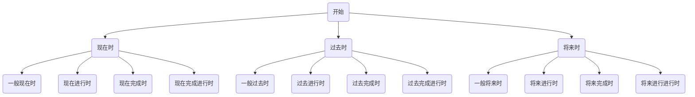

# 0.形式主语it

形式主语比较简单，也就是使用`it`代替过长的主语，这里的`it`不再是一种简单的“它”了，而是一种语法抽象。

> It is good to study hard every day.
> 
> It is bad to smoke every day.（every是单数概念，所以后面要加单数名词）
> 
> It is happy for me to go to school.
> 
> It（这件事：每天跑步）is good to run every day.

# 1.动名词、不定式、现在分词

## 1.1.语法区别

### 1.1.1.现在分词（动词→谓语）

现在分词则是一种将动词变成谓语的方案，也是构成时态和进行时的一种方式（后面会提到）。

> I am playing basketball.
> 
> I am swimming.

现在分词的特殊情况就是“动名词（动词转化为名词）”。`like`是及物动词，后面必须是`宾语it/名词`，来承接`like`这个动词。而有的时候会出现需要将动词转化为名词的需要（加上`ing`），这个时候就是动名词。

动名词转化为名词后就和名词完全一样了，具有名词所有的语法特性。

> I like swimming.

### 1.1.2.不定式（动词→谓语）

不定式也是一种解决双动词的方案（`to+动词`整体为名词）。

> I like to swim.

需要注意的一点是，如果不定式里的动词是及物动词，后面需要加上宾语或者`it`来让句子更加完整。

> I want to do it.

## 1.2.语法联系

### 1.2.1.相互替代

上述语法有一定程度上的互替的情况。

1. `Riding a bicycle is interesting.`（现在分词/动名词）

2. `To ride a bicycle.`（不定式）

3. `It is interesting.`（形式主语）

### 1.2.2.使用习惯

从使用习惯来说，“现在分词/动名词作主语”比“不定式作主语”更常用。

### 1.2.3.主谓一致

在判断句中要主谓同步，也就是说：

1. `现在分词/动名词 be 现在分词/动名词`

2. `不定式 be 不定式`

> Seeing is believing.（所见即所得）
> 
> To see is to believe.

### 1.2.4.禁止某事

如果使用动名词，可以直接在前面加上`No`来标识禁止做某事。

> No smoking.（禁止吸烟）
> 
> No parking.（禁止停车）

# 2.判断句

判断句我们已经写过很多了，`主语+be+宾语/谓语`，需要注意要根据名词的单复数来使用`be`动词。

> 1. She is a good doctor.
> 
> 2. They are doctors.

如果要转变成一般疑问句的话就是把`be`动词提前。

> 1. Is she a good doctor?
> 
> 2. Are they doctors?

# 3.存在句

`There be+...`表示“有/存在...”，需要注意根据后面名词的单复数来使用。

> 1. There is a bird on your desk.  （注意一个句子只能有一个动词，所以a bird后面的is去掉了）
> 
> 2. There is a cat on our table.
>    There are three books on your desk.

如果要转变成一般疑问句的话就是把`be`动词提前。

> 1. Is there a bird on your desk?
> 
> 2. Is there a young person in your house?
> 
> 3. Are there sixteen cats on our table?

# 4.疑问句

## 4.1.一般疑问句

上述将判断句和存在句转化为疑问句的形式就是一般疑问句。

一般疑问句的回答可以直接使用`Yes`或者`No`，然后将疑问句的`be`动词换回来构成回答。

> She is a good doctor.---->Is she a good doctor?
> 
> 回答一：Yes, she is a good doctor.（简短回答是Yes, she is.）
> 
> 回答二：No, she is not a good doctor.（简短回答是No, she is not.）

## 4.2.特殊疑问句

由特殊疑问词构成的疑问句，关于疑问词我们在前一章节的末尾有给出。

### 4.2.1.What|什么

`What + be动词`构成特殊疑问句，只需要将普通句子的`be动词`提到最前，然后头插一个`What`即可。

>What is this?
>
>What is your name?
>
>What time is it?（这里的`What time`是专门用来问时间的） 

### 4.2.2.Why|为什么

`Why + be动词`构成特殊疑问句。

> Why is John sad.

### 4.2.3.Who|谁

`Who + be动词`构成特殊疑问句。

> Who is that boy?
>
> Who is that driver?

### 4.2.4.How|如何

`How + be动词`构成特殊疑问句。

1. 可以用来询问对方的身体状况如何，常使用`fine`表示“身体安好”，需要注意不要使用`good`，这个单词只是单纯表示“好”

	> How are you?----I'm fine.
	>
	> How is your grandmother?----My grandmother is fine.

2. `How + 形容词 + be动词`：一般都是询问状态到如何程度

	`How + many + 复数可数名词`：有多少

	`How + much + 不可数名词`：有多少

	> How old are you?
	>
	> How new is this piano?
	>
	> How tall are you?
	>
	> How lazy is your daughter?
	>
	> How many students are there in the forest?（这里把`student`提前了）
	>
	> How many chairs do you have?
	>
	> How many students are there in your school?
	>
	> How many students does she teach?
	>
	> How much milk is there in the kitchen?
	>
	> How much money do you have?
	>
	> How much beer is there in the car?
	>
	> How much beer does he drink?

3. `How + 副词：`一般都是询问如何（频率）做某事

	> How often does he teach you English?（他多久教你英语？）
	>
	> How often do they drink?
	>
	> How often does your mother teach you?
	>
	> How often does she teach us art? 

### 4.2.5.Where|在哪里

`Where + be动词`构成特殊疑问句。

> Where is my teacher?
>
> Where is Mary?
>
> Where is that doctor?
>
> Where are her parents? （注意这句是复数）

### 4.2.6.Whose|谁的

`Whose + be动词`构成特殊疑问句，意为“谁的东西”。

1. 一方面可以作为疑问代词的“谁的东西”

	> Whose is this?

2. 另外一方面，也可以作为形容词/疑问代词使用。

	> whose doctor?（即：谁的医生）
	>
	> Whose book is this?
	>
	> Whose cat is this?
	>
	> Whose doctor are you?
	>
	> Whose chickens are those?

### 4.2.7.Which|哪一个/哪一些

`Which + be动词`构成疑问句，本身可作单数和复数，需要注意变化`be`动词。

> Which is my book?
>
> Which are my chairs?
>
> Which is our tree?
>
> Which is his apple?
>
> Which are their keys?

### 4.2.8.When|什么时候

`When + be动词`构成特殊疑问句。

> When is the meeting?"（会议是什么时候？）
>
> When are they arriving?（他们什么时候到达？）

也可以`When + do/does`构成特殊疑问句，实际上之前的特殊疑问句也可以这么做。

> When does he teach me English?
>
> When do you teach her English?

还有一种特殊的用法，`when`还可以作为连词，意思为“当...时”，用法和`because`类似。

> When he is sick, he is sad.
>
> He is sad when he is sick.

## 4.3.间接疑问句

# 5.被动句

`be动词 + 过去分词`构成被动句，通常在后面加上“地点”或“人”表示“在什么地方被完成”或“被什么人给完成”。

而通常在后面接“人”的时候会使用`by + 宾语`这个介词类显式强调这个人，表示“被...人完成”。

> This computer is made in Chine.（is+过去分词）
>
> This cake **is made** by my mother.（is+过去分词）
>
> We **were taught** math by him last week.（is+过去分词）
>
> My book has **been stolen**.（注意不要写成is stolen，been是is的过去分词）

# 6.八大时态

## 6.1.现在时

### 6.1.1.一般现在时

由于之前所讲的基本都是一般现在时，正常使用动词即可，无需变化。

### 6.1.2.现在进行时

强调“动作当前正在进行”，一般使用`be + 现在分词`（正在）的形式构成，后面有时会加上`now`。

>   补充：关于现在分词，需要注意一点变化规则
>
>   | 类型         | 原型  | 现在分词  |
>   | ------------ | ----- | --------- |
>   | 大部分动词   | walk  | walk`ing` |
>   | 词尾`e`不发  | smile | smil`ing` |
>   | 词尾前发重音 | hit   | hit`ting` |
>
>   1.   Mary is working.（注意work必须改成working不然存在两个动词）
>   2.   Your dog is sleeping now. I am walking in the park.
>   3.   There are many persons walking in the park now.
>   4.   I am writing.
>   5.   Because I am doing my homework.
>   6.   I am running in the park.

### 6.1.3.现在完成时

强调“动作当前完成了”，一般使用`have/has + 过去分词`（已完成）构成，在中文句子中体现为“...了”。

>   补充：关于过去分词，需要注意一点变化规则
>
>   | 类型   | 原型 | 过去分词 |
>   | ------ | ---- | -------- |
>   | 规则   | open | open`ed` |
>   | 不规则 | buy  | `bought` |
>   
>1.   I have opened the door.（我已经打开了门）
>   2.   She has bought two chairs.
>   3.   Have you bought a cake?

>   注意：去没去的问题
>
>   1.   A has gone to Beijing.（A已经去北京了）
>   2.   A has been to Beijing.（“A已经去过北京了”，这里的been是is/are/am的现在分词）

### 6.1.4.现在完成进行时

强调“正在持续”，一般使用`hava/has + been + 动词ing`（已经持续正在完成）构成。而持续了多久时间通常会使用介词`for`来表示（这个介词一般在其他地方是“为了”的意思），而这个动作从什么时候开始，通常会用`since`（介词）来表示。

>   1.   I am eating it.----I have eaten it.----I have been eating it.
>   2.   I have been working for three hours.
>   3.   Why has she been crying for forty minutes?
>   4.   Why has he been walking for one hour this afternoon?
>   5.   I have been swimming since two o'clock.
>   6.   Why has he been sleeping since three o'clock?

## 6.2.过去时

### 6.2.1.一般过去时

前面一般现在时无需对动词进行修改，而一般过去时只需要将动词转变为过去时态即可，强调“过去做了某件事情”，并且通常都会加上一个过去时间，例如：`yesterday、last night、last year、before、ago`。

>   补充：关于动词的过去式
>
>   | 类型  | 原型  | 过去式  |
>   | ------- | --------- | ---------- |
>   | 大部分动词   | play  | play`ed` |
>   | be动词 | is/are/am | `was/were/was` |
>   | 助动词 | do/does | `did/did` |
>
>   1.   He played in the park yesterday.
>   2.   He went to the the zoo three days ago everyday.
>   3.   Did he run in the forest yesterday?（遇到三单也要改do变成does，原句子中三单的动词就会被“打回原形”，而does的过去时时did）----No, he didn't run in the forest（森林） yesterday.

### 6.2.2.过去进行时

强调“动作过去正在进行”，一般使用`was/were + 现在分词 + 过去时间`构成。

>   1.   He was sleeping at three o’clock yesterday afternoon.
>   2.   When he came here last night, I was singing.（come过去式came）

### 6.2.3.过去完成时

强调“动作过去完成了”，一般使用`had + 过去分词 + 过去时间`构成

>   1.   He had washed the car yesterday.
>   2.   Yes, she had gone to Japan yesterday.

### 6.2.4.过去完成进行时

强调“已经持续（多久）”，一般使用`hava/has + been + 动词ing`（已经持续正在完成）构成。

>   When you sew me this morning, I had been working for there hours.

## 6.3.将来时

### 6.3.1.一般将来时

将来时体现在新加的`will`上，一般使用`will + 动词原型 + 未来时间`构成（一般来说，第一人称`I`和`we`必须用`shall`来表示将要的意思，但是从使用习惯上来说，`will`三种都可以），而常见的未来时间：`tomorrow、tomorrow afternoon、the day after tomorrow、next week、next month `。
>   1.   She will like you.
>   2.   It will rain tomorrow afternoon.
>   3.   I will go to bed at nine o' clock tonight.
>   4.   Will you come to Beijing tomorrow?（come here和come to beijing不同，北京是专有名词，要加介词to，here是地点副词，不用加to）
>   5.   I will visit my old friend the day after tomorrow.
>   6.   I will go to Beijing with Billy this year. 

### 6.3.2.将来进行时

强调“动作将来那时正在进行”，一般使用`will + be + 现在分词`构成，`will`也是助动词，原句子中的三单也会被打会原型。

>   1.   I will be watching TV tomorrow afternoon.（我明天下午“正在”看电视）
>   2.   Mary will be sleeping at home tomorrow afternoon.（home是名词，通常家只有一个，前面不加the）
>   3.   Mary will be sleeping home tomorrow afternoon（home是地点副词）
>   4.   Because I will be washing my car at ten o' clock tomorrow morning.

### 6.3.3.将来完成时

强调“动词将来那时完成了”，一般使用`will + have + 过去分词`构造，`will`也是助动词，原句子中的三单也会被打会原型，因此不会使用`has`。

>   He will have read this book tomorrow.（“他”+“将会”+“已经看完”+“这本书”+“明天”==他明天将会已经看完这本书）  

### 6.3.4.将来完成进行时

强调“将要持续（多久）”，一般使用`will + have + been + 现在分词`构造，如果句子存在大小时间时，先写小时间，再写大时间

>   1.   He will have been waiting for you for three hours by five o' clock.（在5点之前，他将已经持续等你3小时了，另外before主要用在表达“在…事件之前”，by主要用在表达“在…精确时间之前”）
>   2.   He will have been waiting for us for two hours when we arrive there.（“他”+“将”+“已经”+“持续”+“等待ing”+“为了我们”+“for2小时”+“when（当，在……时候）”+“我们到达那里”==当我们到达的时候，他将已经持续等我们2小时了。注意为了某人要用宾格，所以用us）
>   3.   My grandfather will have been living here for ten years next month.（next time是时间副词）
>   4.   I will have been driving for four hours by eight o' clock.
>   5.   She will have been waiting for us for three hours when we arrive at her house.

# 7.虚拟语气

虚拟语气使用动词和助动词的过去式表示“假设”。

>   | 助动词 | 过去式 |
>   | ------ | ------ |
>   | can    | could  |
>   | may    | might  |
>   | will   | would  |
>   | shall  | should |
>
>   1.   If I `had` a computer, I `would` be very happy.
>   2.   If you `were` a butterfly, you `could` fly.

# 8.从句

## 8.1.名词从句

## 8.2.定语从句

## 8.3.状语从句
