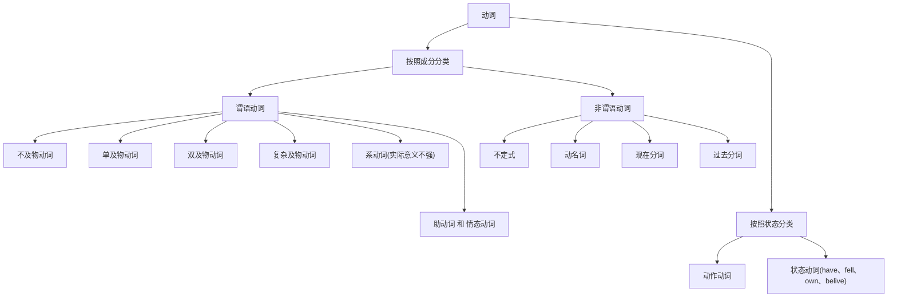

# 1.动词分类

我们之前简单讲过，动词有以下分类：

```mermaid
flowchart TD
O["动词"]
O --> A["按照成分分类"]
O ------> B["按照状态分类"]

A --> A1 & A2

A1["谓语动词"] --> A11 & A12 & A13 & A14 & A15
A11["不及物动词"]
A12["单及物动词"]
A13["双及物动词"]
A14["复杂及物动词"]
A15["系动词(实际意义不强)"]
A1 ----> A16
A16["助动词 和 情态动词"]

A2["非谓语动词"] --> A21 & A22 & A23 & A24
A21["不定式"]
A22["动名词"]
A23["现在分词"]
A24["过去分词"]

B --> B1 & B2
B1["动作动词"]
B2["状态动词(have、fell、own、belive)"]
```

# 2.动词TAM

## 2.1.时间

## 2.2.空间

## 2.3.语气

后续补充...

