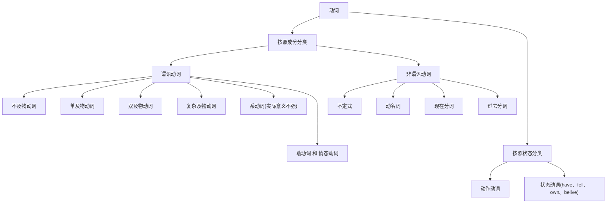
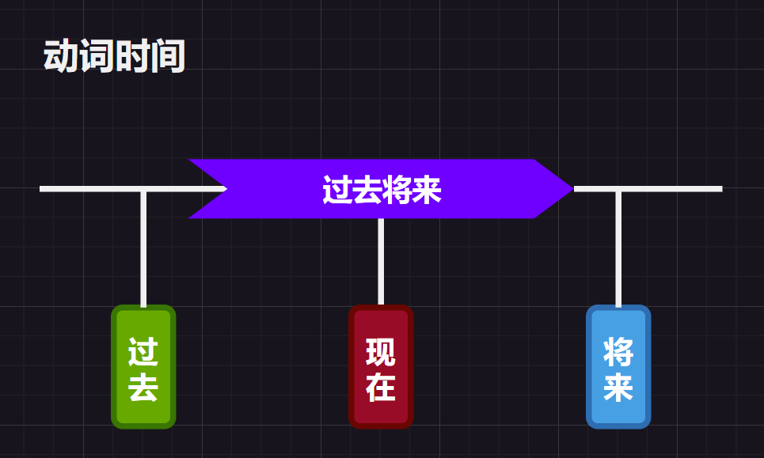
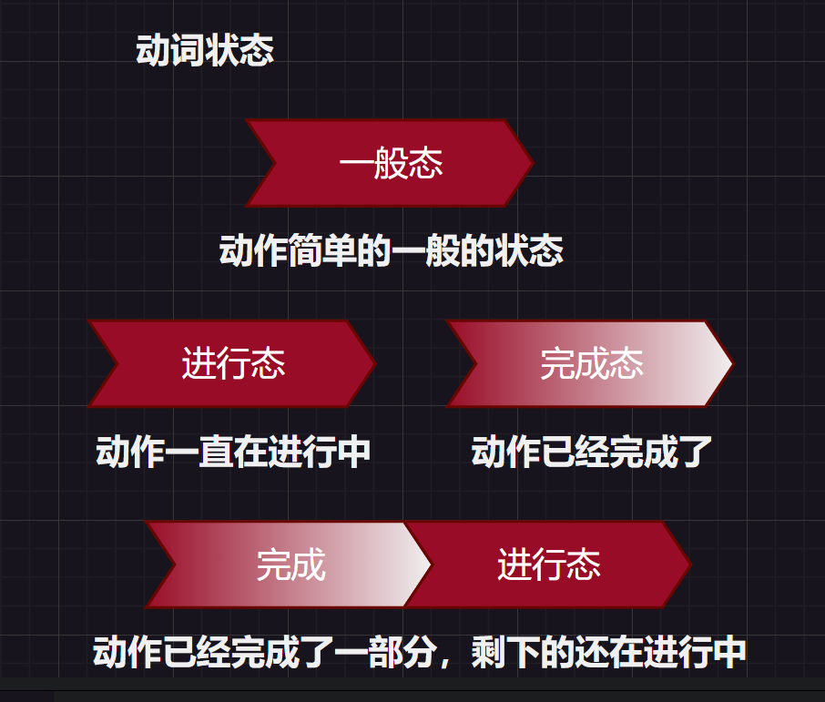

# 1.动词大致分类

我们之前简单讲过，动词有以下分类：

# 2.谓语动词TAM解析

## 2.1.时间

## 2.2.状态

## 2.3.语气

除了时态，动词的语气也是一大本领，但是这里说到的动词语气和说话语气是两个概念，不要混淆。

# 3.谓语动词时态细化

## 3.1.现在时间下的动作状态

### 3.1.1.“一般”现在时态

==动词原型（第三人称单数时要加`s`）==

#### 3.1.1.1.表达事实

>   `I eat carrots.`
>
>   `The rabbit eats carrots.`

这里的`carrots`是复数且没有冠词特指，因此是泛指“胡萝卜”这一类事物，因此只是一个事实陈述，并没有和“现在”这个时间状态有太多关系。

因此像`I eat a carrot.`这句话虽然语法是对的，但是不够自然，原本我们想表达“我现在正在吃萝卜”，我知道是动作发生在“现在”，但我不知道动作是否“完成”，错误选择了一般现在时表达，导致在母语人士来说，这句话很奇怪，他们会认为这句话是一个事实。同样`I eat a carrot now.`这样的表达也很奇怪。

#### 3.1.1.2.表达习惯/重复

>   `I play baskball.`

#### 3.1.1.3.表示预计发生

>   `The bus leaves at 8PM every day.`

### 3.1.2.“进行”现在时态

==助动词`be`变位+动词的现在分词==

`be`有两种主要用法，一是作系动词赋值，二是作助动词辅助构成时态，变位有：`is`、`are`、`am`。

现在分词字通常在结尾加上`ing`即可，但是有些时候需要变化，这些变化是为了更好发音。

>   `I am eating a carrot.`
>
>   `The rabbit is eating a carrot.`

### 3.1.3.“完成”现在时态

==助动词`have`变位+动词的过去分词==

`have`有两种主要用法，一是作实义动词表示“有”，二是作组动词辅助构成时态，变位有：`hava`、`has`。

过去分词通常在结尾加上`ed`即可，但是有些时候也会发生变化以便更好发音。

>   `I have eaten carrots.`
>
>   `I have eaten a carrot.`

### 3.1.4.“完成进行”现在时态

==助动词`have`变位+`been`+动词的现在分词==

只要将“进行现在时态”中的“`be`变位”作为“完成现在时态”中的“过去分词”即可。

>   `I have been eating carrots.`

## 3.2.过去时间下的动作状态

知道上面现在时下的四种态构句，那么我们可以依靠修改动词来移动时间。

-   动词修改为动词过去式，就可以修改为过去时。
-   动词修改为动词将来式，就可以修改为过去时（但是英语动词没有将来式啊？因此只能用助动词`will`了）。

### 3.2.1.“一般”过去时态

==动词过去式==

#### 3.2.1.1.表达事实

也可以表达式事实，但是类似看一张“照片”，描述照片里的事实，是过去拍下来的事实。

>   `You watched my video.`

#### 3.2.1.2.表达习惯/重复

习惯确实也可以是过去式，但是重复不容易表达出来，需要加上其他词辅助表达。

>   `I used to palyed basketball.`（我曾经常打篮球。）

### 3.2.2.“进行”过去时态

==助动词`be`变位的过去式+动词的现在分词==

改变`be`动词为过去式，也就是`was`、`were`。

>   `You were watching my video.`
>
>   `I was thinking of you.`

### 3.2.3.“完成”过去时态

==助动词`have`变位的过去式+动词的过去分词==

改变`have`动词为过去式，也就是`had`。

>   `I had already gone to Shanghai.`

### 3.2.4.“完成进行”过去时态

==助动词`have`变位的过去式+`been`+动词的现在分词==

改变`have`动词为过去式，也就是`had`。

>   `The rabbit had been eating a carrot.`
>
>   `You had been watching my video.`

## 3.3.将来时间下的动作状态

由于没有进行式，只能用一些助动词来表达，常用的就是`will`（有时也用`shall`）放在主动词前面即可。

>   `I will eat a carot.`

因此，除了`will`还有其他表示将来的方法：

1.   一般现在时可以表达将来的动作（`The bus leaves at 8PM.`）
2.   助动词`be`的变位+`going` +`to`+动词原型（`I am going to eat a carrot.`）
3.   上面的`going`省略也可以，带有命令意味（`You are to eat a carrot.`）
4.   使用`about`替代`going`（`I am about to eat a carrot.`）

### 3.3.1.“一般”将来时态

==will+动词原型（第三人称单数时要加`s`）==

动词原型前加个`will`就可以，不过由于加上`will`本身就是`will`。一般表达确信的事情，描述说话者十分肯定会发生的事情。如果是不太确定就不能用这个时态，那如何表示不太确定的呢？后面借助动词的语气即可做到。

>   `I will definitely do my best to make high-quality videos.`

### 3.3.2.“进行”将来时态

==will+助动词`be`+动词的现在分词==

动词原型前加个`will`就可以，不过这个动词就是`be`动词了，并且无需变位。如果特别笃定某件事情在未来可以发生，那就用这个时态，比一般将来时态要更加确信。

>   `I will be eatnig a carrot for lunch tomorrow from 1PM to 3PM.`

### 3.3.3.“完成”将来时态

==will+助动词`have`+动词的过去分词==

动词原型前加个`will`就可以，不过这个动词就是`have`动词了，并且无需变位，这个时态比上面两种还要特别笃定！

>   `I will have finished making the video by 4PM tomrow, so I can publish it after that.`

### 3.3.4.“完成进行”将来时态

==will+助动词`have`+`been`+动词的现在分词==

动词原型前加个`will`就可以，不过这个动词就是`have`动词了，并且无需变位，然后接着加上`been`和现在分词即可。

>   `I will have been eating carrots for 2 hours by 3PM tomorrow.`

### 3.3.4.过去将来时下的动作状态

经常出现在从句中，实际上是将将来时前移到过去时间，也就是说将`will`变成`would`即可。而如果不是由`will`构成的将来时态，只要体现在助动词`be`的变位上即可。

注意这里的`would`是`will`的过去式子，构成过去将来时态。但是它还可以表示为与事实相反，构成虚拟语气，以后还会提及。

>   `I knew you would watch my video.`（对于我作出判断的那个时间点来说，是在将来”你会看我的视频“，也就是过去将来）

==would+动词原型（第三人称单数时要加`s`）==

==would+助动词`be`+动词的现在分词==

==would+助动词`have`+动词的过去分词==

==would+助动词`have`+`been`+动词的现在分词==

|              | 一般             | 进行                          | 完成                          | 完成进行                           |
| ------------ | ---------------- | ----------------------------- | ----------------------------- | ---------------------------------- |
| **现在**     | `动词原型`       | `be变位+动词现在分词`         | `have变位+动词过去分词`       | `have变位+been+动词现在分词`       |
| **过去**     | `动词过去式`     | `be过去式的变位+动词现在分词` | `have过去式变位+动词过去分词` | `have过去式变位+been+动词现在分词` |
| **将来**     | `will+动词原型`  | `will+be+动词现在分词`        | `will+have+动词过去分词`      | `will+have+been+动词现在分词`      |
| **过去将来** | `would+动词原型` | `would+be+动词现在分词`       | `would+have+动词过去分词`     | `would+have+been+动词现在分词`     |

# 4.谓语动词语气细化

## 4.1.陈述语气

主要用于描述现实，如果对陈述语气提问就会得到疑问语气。

## 4.2.祈使语句

主要用于命令和请求，绝大多数情况下，将第二人称的一般现在时态中的你去掉，保持动词原形既可以转化为祈使语句。

>   `You are quiet!`$\to$`Be quiet!`
>
>   `You never give up!`$\to$`Never give up!`

## 4.3.虚拟语气

用来描述脑海中的主观想象，尤其是与事实相反的事情。

### 4.3.1.不可能假设

#### 4.3.1.1.表示和现在事实相反

=={条件句:动词过去式}+{主句:`would`+动词原型}==，动词是`be`的话，过去分词要使用`were`而不是`was`，不管是什么人称，例如：`If I were you, I would give this video a thumbs-up.`中的`am`就变成了`were`

中文表达”如果我现在看到这只兔子，我将会去咬他“，不能简单用英语表达为`If I see the rebbit now, I will bite him.`为什么呢？看见兔子是不是事实？不是，与事实相反，他看不见这只兔子，而这句话本身是一句客观描述。

那怎么办呢？改句子的动词为过去式即可，`If I saw the rebbit now, I would bite him.`就行。

但是如果是`If I see rebbit tomorrow, I will bite him.`（实际这就是条件语句）又可以了，这就导致虚拟语气的学习很困难。为什么呢？无法和一般过去时态区分开了，我们不能看到一个动词是过去式就判定这是一个一般过去时，也有可能是虚拟语气。

#### 4.3.1.2.表示和将来事实相反

=={条件句:`should/were to`+动词原型}+{主句:`would/should/could/might`+动词原型}==，例如：`If I should meet thee after long years, how should I greet thee?`

如果将来的事情发生的可能性很小或者不可能，此时使用的虚拟语气就是与将来事实相反，”万一我明天看到这只兔子，我将咬他“，翻译为`If I should see the rebbit tomorrow, I would bite him.`

#### 4.3.1.3.表示和过去事实相反

=={条件句:`had`+动词过去分词}+{主句:`would have`+动词过去分词}==，如果是和过去事实相反，假设过去事实上没有看见那只兔子，翻译为`If I saw the rabbit a few days ago, I would bite him.`是有问题的，应该使用过去完成态，变成`If I had seen the rabbit a few days ago, I would have bitten him.`

### 4.3.2.愿望请求建议命令

希望某个动作的发生，也不是现实中的事实，只是脑海中的想法。

`wish`希望，可能性较小，而`hope`希望，可能性较中。

1.   对现在的愿望：==wish+动词过去式==，注意动词是`be`就使用`were`，无论何人称。表示对现在的愿望，`I wish (that) I were a rebbit.`
2.   对过去的愿望：==wish+had/would have+动词过去分词==，`I wish (that) I had eaten the carrot.`
3.   对将来的愿望：==wish+should/might/could/would+动词原型==，`I wish (that) could eat the carrot. `

还有一些其他的表示希望的词：`would rather`，表示”宁愿“，用法和`wish`差不多。

还有：`demand`（要求）、`suggest`（建议）、`insist`（坚持）、`order`（命令），这些词的虚拟语气一律是`should+动词原型`，这和`wish`有不同。而改变时间，则从这些词本身体现出来。

>   `I demand that you (should) give me a carrot.`
>
>   `I demanded that you (should) give me a carrot.`

# 5.非谓语动词解析

非谓语动词丧失了动词本领，因为它不像谓语动词被限定（也叫“非限定动词”），不受主语限制，不具备表达时间和人称的本领，谓语动词是一个简单句的核心，非谓语动词出现在句子的某些成分中。

>   `I like to eat carrots.`
>
>   `I am a talking rabbit.`
>
>   `The rabbit likes minced carrots.`
>
>   这里的`eat`、`talking`、`minced`就是非谓语动词。

但是非谓语动词可以充当句子的主语、宾语、宾语/主语补语、定语、状语等各种成分，但不可以独立做谓语。

这和非谓语动词的功能很像，确实，非谓语动词的存在，可以大大简化带有从句的句子。

## 5.1.不定式

==to+动词原型==，这里的“不定式”就是指“不受时间、人称”限制等概念限制。

>   完全不定式：`To be or not to be, that is the question.`
>
>   裸不定式：`You helped me (to) cook the carrot.`

### 5.1.1.不定式作主语

表示某种行为，不受具体的人称和时间的限制。

>   `To eat a carrot every day is good for the rabbit.`（一天吃一根胡萝卜对兔子有好处）
>
>   如果使用`it`代替主语作“形式主语”，则可以修改为`It is good for the rabbit (to eat a carrot every day is good for the rabbit).`

### 5.1.2.不定式作宾语

也可以作宾语，但是注意不是所有动词后面都可以接不定式。

>   也可以用`it`代替宾语作“形式宾语”，则可以修改为`I consider it important to eat a carrot every day.`

### 5.1.3.不定式作补语

不定式作宾语补语，需要注意的是，有些使役动词（`see`、`find`、`watch`、`have`、`make`、`let`......）后面用不定式作宾语补语时需要省略`to`。

>   `The rabbit expected the wolf to eat a carrot.`，这里的不定式就是补充了宾语。
>
>   `The wolf helped the rabbit to grow carrots.`（狼帮兔子种胡萝卜）。
>
>   `The rabbit's dream is to eat every kind of carrot in the world.`（兔子的梦想就是吃掉世界上每一种胡萝卜），这里的`is`就是系动词，`dream`作为子句中主语，后面不定式就充当`dream`的表语（主语补语）。

### 5.1.4.不定式作定语

也可以作为定语修饰主语。

>   `The rabbit has a lot of carrots to eat.`（兔子有很多胡萝卜要吃），这里吃修饰`carrots`，也就是“动宾关系”（指一个动作的执行者（动词的主语）和动作的承受者（动词的宾语）之间的关系）。

### 5.1.5.不定式作状语

#### 5.1.5.1.表原因

修饰谓语，表示谓语的原因。

>`I was surprised to get a thumbs-up.`（我很吃惊（因为）得到一个赞），`surprised`的原因是得到赞。

#### 5.1.5.2.表目的

修饰谓语，表示谓语的目的。

>   `I will do anything in order that I (to) get a thumbs-up.`（为了点赞我可以做出任何事情），`do`的目的是获取赞。

#### 5.1.5.3.表结果

修饰谓语，表示谓语的结果。

>   `I got enough thumbs-up to make another video.`（我得到足够的赞，可以去做另一个视频了），`got`的结果是去做另外一个视频。

## 5.2.动名词

==动词ing==，也就是将动词转化为名词来使用，使用起来的行为就如同名词。

### 5.2.1.动名词作主语

>   `Eating carrots is healthy for the rabbit.`

### 5.2.2.动名词作宾语

动名词作宾语的时候，经常容易和不定式作宾语混淆（这样的动词/动词词组有：`enjoys`、`avoid`、`advise`、`consider`、`escape`、`mind`、`practice`、`insist on`、`give up`、`feel like`、`put off`等）。

为什么会这样呢？该如何区分使用？之后补充...

有时介词会接上宾语，但是这个介词有可能是`to`，千万不要错认为是不定式。

>   `The rabbit likes eating carrots.`
>
>   `The rabbit is looking forward to seeing the wolf again.`，其中`look forward to`是词组，`to`是介词，`seeing`是动名词作宾语。

### 5.2.3.动名词作补语

>   `The rabbit's hobby is growing carrots.`，这里就是“种萝卜”作为表语（主语补语）。
>
>   `Seeing is believing.`，也是作表语。

### 5.2.4.动名词作定语

>   `a sleeping pill`，也就是作为`pill`的定语。

## 5.3.现在分词

==动词ing==构成现在，基本就相当于一个形容词，但是怎么和动名词区分呢？

### 5.3.1.现在分词作补语

动词不定式作宾语补语时，表示动作自始至终的过程，强调动作已经发生了。

现在分词作宾语补语时，表示动作进行的状态。

### 5.3.2.现在分词作状语

可以表示时间、原因、条件、结果、让步、目的、凡是、伴随等情况。

>   `Hearing the news, the rabbit became excited.`（表示时间）
>
>   `Not knowing what to eat, the rabbit skipped lunch.`（表示原因）

## 5.4.过去分词

==动词ed==构成过去分词，本身不自带时间，不表示过去，可以看作一个形容词，很多常见的过去分词都是不规则的。

### 5.4.1.过去分词作定语

单个过去分词作定语和普通的形容词一样，都放在前面修饰，但是如果是过去分词短语，则一定要放在要修饰的词后面（后置定语）。

>   `The carrot cake eaten by the rabbit is delicious.`，其中`eaten by the rabbit`是一个过去分词短语。

### 5.4.2.过去分词作补语

过去分词和现在分词作主语补语的区别就是：前者有主动意义，后者有被动意义（对于主语来说）。

>   `The story is interesing.`（这个故事让人感到有趣）$\to$`The rebbit is interested.`（兔子被某事某物引起了兴趣）
>
>   `The rabbit was frightening.`（兔子令人感到害怕）$\to$`The rabbit was frightened.`（兔子感到害怕）
>
>   `I am interesting.`（我引发了某人的兴趣）$\to$`I am interested.`（我被某人/某物引发了兴趣）
>
>   `The rabbit is interested in growing carrots.`

过去分词作也可以宾语补语。

>   `The rabbit found his carrot stolen.`

### 5.4.3.过去分词作状语

>   `Seen from the hill, the carrot field looks beautiful.`，句子前面的过去分词作为地点，修饰了谓语动词 `looks`，其中`seen`和`carrot field`是被动的关系。
>
>   `Born in a rabbit family, the rabbit has been growing carrots all his life.`（由于出生在一个兔子家庭里，兔子种了一辈子萝卜），这里的过去分词作为原因，修饰`growing`。
>
>   `Given another chance, the rabbit would go to the wolf's party.`（如果再给兔子一次机会，他会去参加狼的聚会），句子前面的过去分词是一种条件，修饰谓语动词`would go`。

# 6.非谓语动词高级不定式

我们之前都是`to + 动词原型`，实际上动词可以变化状态，但是整体还是不受时间限制的，不过比较少用，这里先不写出来，有需要以后再来补充。

# 7.非谓语动词独立主格

`The work finished, the rabbit went home.`（简单句）$\to$`The work was finished, and/so the rabbit went home.`（并列句）$\to$`After the work was finished, the rabbit went home`（从句），注意这里第一句的`finished`是修饰`work`而不是后面的`rabbit`，可以看到过去分词可以大大简化句子。

这种除了核心的谓语动词，其他动词转化为对应过去分词或者对应现在分词的用法，就叫“独立主格”的使用，此时现在分词或者过去分词是在句子中的状语里，并非是句子的主语，但是在状语内部，分词修饰的对象，隐含了主语的感觉，虽然并不是整个句子的主语。

从`Because he was invited him, the rabbit decided to go the party.`开始简化句子，如果将`because`删除句子就会有两个谓语动词`invited`和`decided`，这是不符合语法规则的，需要去掉一个但是不改变句子意义，那就将次要的谓语动词转变为非谓语动词，而`wolf`是主动邀请的，因此使用`Inciting`，最后句子就变成`The wolf Inviting him, the rabbit decided to go to the party.`其中`the wolf`是独立的主语，也叫“逻辑主语/独立主格”，但是和真正的主语是有所区别的。

>   1.   `If the weather permits, the rabbit will go out.`$\to$`The weather permitting, the rabbit will go out.`
>   2.   `After the work was finished, the rabbit went home.`$\to$`The work finished, the rabbit went home.`
>   3.   `The rabbit is lying in bed and a carrot is still held in his hand.`$\to$`The rabbit is lying in bed, a carrot still held in his hand.`其中`held`是`hold(握住)`的过去分词 

而独立主格的形式通常都是==名词 + 非谓语动词==，而还有一些==名词 + 名词/形容词/副词/介词短语==的情况，这些情况都像是省略了`being`的情况，也就是==名词 + (being) + 其他==的简化形式。

>   1.   `The rabbit to come, the wolf is overjoyed.`动词不定式一般表示将要发生的动作
>   2.   `Many animals went to the party, some of them (being) rabbits and wolves.`这是名词/代词+名词的情况
>   3.   `Many animals went to the party, some of them (begin) happy.`这是名词/代词+形容词
>   4.   `The rabbit sat on a chair, head (begin) down.`这是名词+副词
>   5.   `The rabbit came in, carrot (begin) in head.`这是名词+介词短语
