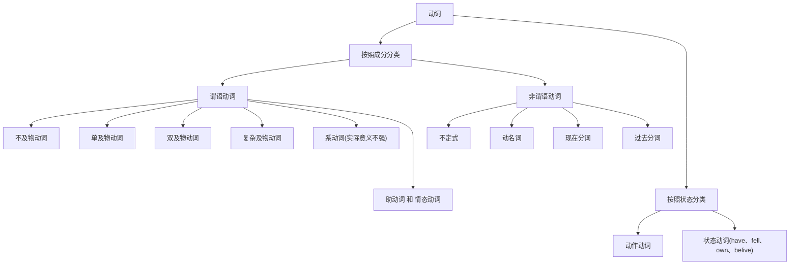

# 1.动词分类

我们之前简单讲过，动词有以下分类：

# 2.动词TAM

## 2.1.时间

## 2.2.空间

## 2.3.语气

后续补充...

# 3.动词时态细化

## 3.1.现在时间下的动作状态

### 3.1.1.“一般”现在时态

==动词用原型即可，除了第三人称单数时要加`s`。==

#### 3.1.1.1.表达事实

>   `I eat carrots.`
>
>   `The rabbit eats carrots.`

这里的`carrots`是复数且没有冠词特指，因此是泛指“胡萝卜”这一类事物，因此只是一个事实陈述，并没有和“现在”这个时间状态有太多关系。

因此像`I eat a carrot.`这句话虽然语法是对的，但是不够自然，原本我们想表达“我现在正在吃萝卜”，我知道是动作发生在“现在”，但我不知道动作是否“完成”，错误选择了一般现在时表达，导致在母语人士来说，这句话很奇怪，他们会认为这句话是一个事实。同样`I eat a carrot now.`这样的表达也很奇怪。

#### 3.1.1.2.表达习惯/重复

>   `I play baskball.`

#### 3.1.1.3.表示预计发生

>   `The bus leaves at 8PM every day.`

### 3.1.2.“进行”现在时态

==助动词`be`变位+动词的现在分词。==

`be`有两种主要用法，一是作系动词赋值，二是作助动词辅助构成时态，变位有：`is`、`are`、`am`。

现在分词字通常在结尾加上`ing`即可，但是有些时候需要变化，这些变化是为了更好发音。

>   `I am eating a carrot.`
>
>   `The rabbit is eating a carrot.`

### 3.1.3.“完成”现在时态

==助动词`have`变位+动词的过去分词。==

`have`有两种主要用法，一是作实义动词表示“有”，二是作组动词辅助构成时态，变位有：`hava`、`has`。

过去分词通常在结尾加上`ed`即可，但是有些时候也会发生变化以便更好发音。

>   `I have eaten carrots.`
>
>   `I have eaten a carrot.`

### 3.1.4.“完成进行”现在时态

==助动词`have`变位+`been`+动词的现在分词.==

只要将“进行现在时态”中的“`be`变位”作为“完成现在时态”中的“过去分词”即可。

>   `I have been eating carrots.`

## 3.2.过去时间下的动作状态

知道上面现在时下的四种态构句，那么我们可以依靠修改动词来移动时间。

-   动词修改为动词过去式，就可以修改为过去时。
-   动词修改为动词将来式，就可以修改为过去时（但是英语动词没有将来式啊？因此只能用助动词`will`了）。

### 3.2.1.“一般”过去时态

#### 3.2.1.1.表达事实

也可以表达式事实，但是类似看一张“照片”，描述照片里的事实，是过去拍下来的事实。

>   `You watched my video.`

#### 3.2.1.2.表达习惯/重复

习惯确实也可以是过去式，但是重复不容易表达出来，需要加上其他词辅助表达。

>   `I used to palyed basketball.`（我曾经常打篮球。）

### 3.2.2.“进行”过去时态

改变`be`动词为过去式，也就是`was`、`were`。

>   `You were watching my video.`
>
>   `I was thinking of you.`

### 3.2.3.“完成”过去时态

改变`have`动词为过去式，也就是`had`。

>   `I had already gone to Shanghai.`

### 3.2.4.“完成进行”过去时态

改变`have`动词为过去式，也就是`had`。

>   `The rabbit had been eating a carrot.`
>
>   `You had been watching my video.`

## 3.3.将来时间下的动作状态

由于没有进行式，只能用一些助动词来表达，常用的就是`will`（有时也用`shall`）放在主动词前面即可。

>   `I will eat a carot.`

因此，除了`will`还有其他表示将来的方法：

1.   一般现在时可以表达将来的动作（`The bus leaves at 8PM.`）
2.   助动词`be`的变位+`going` +`to`+动词原型（`I am going to eat a carrot.`）
3.   上面的`going`省略也可以，带有命令意味（`You are to eat a carrot.`）
4.   使用`about`替代`going`（`I am about to eat a carrot.`）

### 3.3.1.“一般”将来时态

动词原型前加个`will`就可以，不过由于加上`will`本身就是`will`。一般表达确信的事情，描述说话者十分肯定会发生的事情。如果是不太确定就不能用这个时态，那如何表示不太确定的呢？后面借助动词的语气即可做到。

>   `I will definitely do my best to make high-quality videos.`

### 3.3.2.“进行”将来时态

动词原型前加个`will`就可以，不过这个动词就是`be`动词了，并且无需变位。如果特别笃定某件事情在未来可以发生，那就用这个时态，比一般将来时态要更加确信。

>   `I will be eatnig a carrot for lunch tomorrow from 1PM to 3PM.`

### 3.3.3.“完成”将来时态

动词原型前加个`will`就可以，不过这个动词就是`have`动词了，并且无需变位，这个时态比上面两种还要特别笃定！

>   `I will have finished making the video by 4PM tomrow, so I can publish it after that.`

### 3.3.4.“完成进行”将来时态

动词原型前加个`will`就可以，不过这个动词就是`have`动词了，并且无需变位，然后接着加上`been`和现在分词即可。

>   `I will have been eating carrots for 2 hours by 3PM tomorrow.`

## 3.4.特殊：过去将来时态

