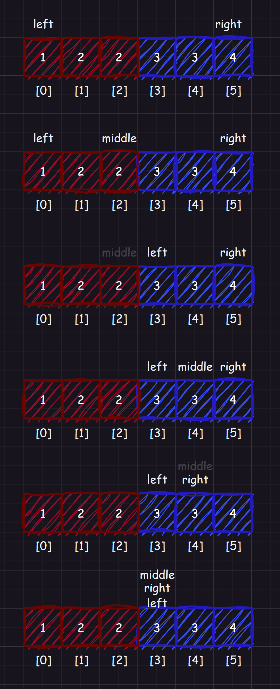
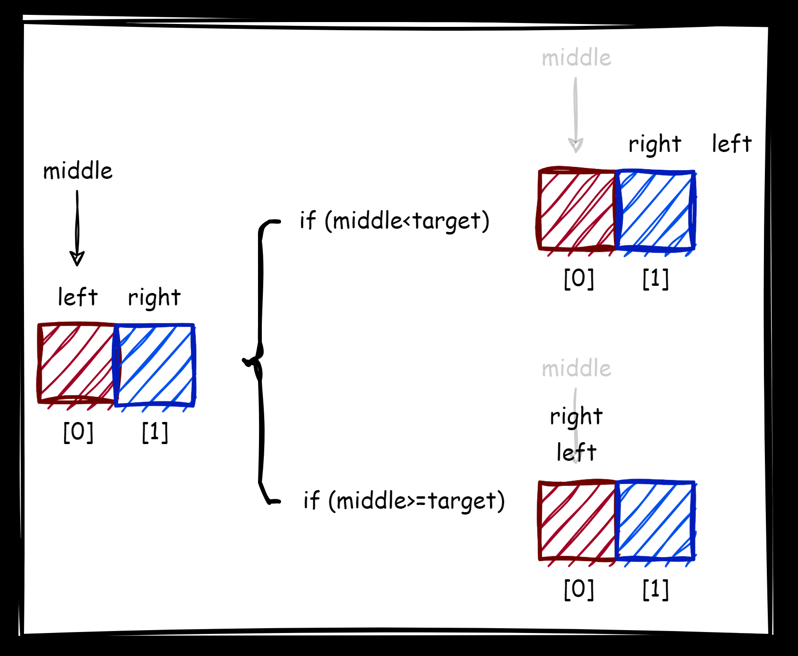
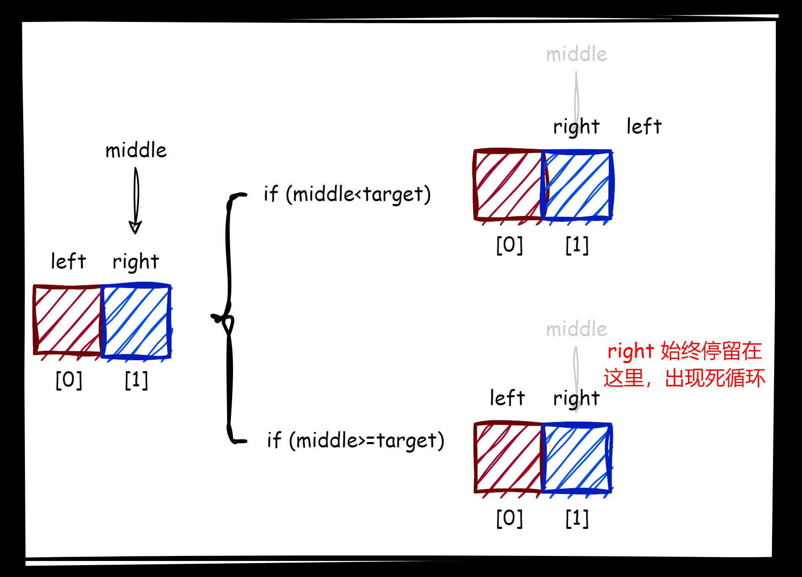

# 1.原理

二分查找最恶心的地方在于越界和死循环，并且很难查找 `bug`，但是还请您继续看下去。

一般我们学到的二分查找算法是基于序列有序的情况下才能使用，但是实际上并不是这样的，这只是一种狭义的理解。

## 1.1.朴素二分查找

最朴素的二分查找我相信有很多人都知道，这里给一道 [704. 二分查找](https://leetcode.cn/problems/binary-search/) 给您做一做。

更加朴素、直接、暴力的查找方法就是顺序查找，顺序查找之所以低效的原因是它无法得知哪些数据需要被丢弃，只能把数据一个一个访问。

而由于序列本身是有顺序的（假设升序），因此如果直接从中间开始访问，和目标值比较大小，一次比较就可以舍弃大致一半的数据，这样折半下去就是一种指数爆炸，第一次查找比较的时候，就能少做一半的数据。

```cpp
class Solution 
{
public:
    int search(std::vector<int>& nums, int target)
    {
        int left = 0;
        int right = nums.size() - 1;
        while (left <= right) //等于是为了处理特殊情况（只有一个数的情况），也可以说是多次二分后剩下一个数的情况
        {
            int middle = left + (right - left) / 2; //在除以 2 的时候也可以是 left + (right - left + 1) / 2，这两种写法某一次查找时，数据量为奇数时是没有差别的。但是数据量为偶数时，中间数有两个，两种写法分别对应前后两个中间数，在朴素二分法种，选择哪一个都是可以的
            
            if (nums[middle] < target)
            {
                left = middle + 1;
            }
            else if (nums[middle] > target)
            {
                right = middle - 1;
            }
            else
            {
                return middle;
            }
        }
        return -1;
    }
};
```

那时间复杂度怎么计算呢？寻找 $1$ 次就有 $n/2$ 的数据被丢弃，$2$ 次就有 $\frac{\frac{n}{2}}{2}$，最坏情况到 `x` 次剩 $\frac{n}{2^x}=1$ 个数据，也就是 $x=log_{2}{(n)}$，时间复制度就是 $O(log_{2}{(n)})$

而实际上，有顺序只是一种条件，如果我们能保证舍弃另外一半的数据也不影响我们查找，就可以得到广义的二分查找法。

我把能这样二分操作，但是不影响查找的性质，用 `二段性` 这个词来描述。也就是说：具有二段性的序列，可以使用二分查找算法，并且可以和大小顺序无关。这样抽象出来的二分查找算法才是我们下面要学的真正意义上的二分查找算法。

而进一步，如果二分无法舍弃一部分数据，可以三分、四分...

```cpp
class Solution 
{
public:
    int search(std::vector<int>& nums, int target)
    {
        int left = 0;
        int right = nums.size() - 1;
        while (left <= right)
        {
            int middle = left + (right - left) / 3; //可以改成其他整数，而 2 是最高效的（大量数据的情况）
            
            if (nums[middle] < target)
            {
                left = middle + 1;
            }
            else if (nums[middle] > target)
            {
                right = middle - 1;
            }
            else
            {
                return middle;
            }
        }
        return -1;
    }
};
```

只要保证不断循环的分割中，总能舍弃一部分数据，就可以抽象出多分查找法。

但是大部分的多分查找都是二分查找，这其实也可以说是数学中概率学（数学期望）的知识。 

[34. 在排序数组中查找元素的第一个和最后一个位置](https://leetcode.cn/problems/find-first-and-last-position-of-element-in-sorted-array/)，这道题目有个比较骚气的方法，就是先确定和 `target` 相等的索引位置，然后向前和向后查找同样相同的数据，最后返回该数据范围的起始和末尾位置即可。

```cpp
class Solution 
{
public:
    int SearchNumber(std::vector<int>& nums, int target)
    {
        int left = 0;
        int right = nums.size() - 1;
        while (left <= right)
        {
            int middle = (left + right) / 2;
            
            if (nums[middle] < target)
            {
                left = middle + 1;
            }
            else if (nums[middle] > target)
            {
                right = middle - 1;
            }
            else
            {
                return middle;
            }
        }
        return -1;
    }

    std::vector<int> FindBeginAndEnd(std::vector<int>& nums, int i)
    {
        int begin = i;
        int end = i;
        if (i != -1)
        {
            while (begin >= 0 && nums[begin] == nums[i])
            {
                begin--;
            }
            while (end < nums.size() && nums[end] == nums[i])
            {
                end++;
            }
            return { begin + 1, end - 1 };
        }
        return { -1, -1 };
    }

    std::vector<int> searchRange(std::vector<int>& nums, int target)
    {
        return FindBeginAndEnd(nums, SearchNumber(nums, target));
    }
};
```

但是这怎么做容易产生一个时间复杂度退化的问题，在最坏情况下退化为 $O(n)$ 算法，比如序列的每一个元素都是一样时，或者内部相同的元素非常长，这样二分查找法的高效率就会被大大降低。

## 1.2.边界二分查找

先对题目的情况进行分析，序列本身时具有二段性（可以将序列划分为 `[{arr[i]<target}],[{arr[i]>=targe}]`），因此可以考虑使用二分法（拥有二段性才能让有可能让算法经过对比抛弃掉一半的数据）。每次如果 `middle<target` 就 `left=middle+1`，如果 `middle>=target` 就 `right=middle`（注意不是 `right=middle-1`，原因是设置了 `arr[i]>=target` 而不是 `arr[i]>target`，导致计算到 `middle` 时，对应的元素可能就是左边界，也有可能其左边存在左边界，因此也要把 `middle` 结果加入计算中），以此来寻找左边界：



最后我们会发现，无论是序列中有结果、还是序列中的值都大于 `target`、亦或者序列中的值都小于 `target`。在 `left` 和 `right` 相等时就找到了边界（后两种情况就需要额外判断，如果是都小于那么就会一直循环），因此我们的循环条件只用写 `left<right` 即可。

二分法比较头疼的两个点就是：(1)循环终止条件 (2)中间点截取方法

第一个问题我们解决了，接下来我们要解决第二个问题，选取 `left+(right-left)/2` 还是 `left+(right-left+1)/2` 呢？

在极端情况下，只有两个数组构成的序列，选用 `left+(right-left)/2` 则不会死循环，选用 `left+(right-left+1)/2` 则有可能陷入死循环。





而右边界也是类似的思路（起始把数组逆序来看，依旧是向左做边界二分法），总结起来就是：

```cpp
class Solution
{
public:
    int searchLeft(std::vector<int>& nums, int target)
    {
        int left = 0;
        int right = nums.size() - 1;
        int middle = 0;
        while (left < right)
        {
            middle = left + (right - left) / 2;

            if (nums[middle] < target)
            {
                left = middle + 1;
            }
            else if (nums[middle] >= target)
            {
                right = middle;
            }
        }
        return right;
    }
    
    int searchRight(std::vector<int>& nums, int target)
    {
        int right = 0;
        int left = nums.size() - 1;
        int middle = 0;
        while (left > right)
        {
            middle = (left + right + 1) / 2;

            if (nums[middle] > target)
            {
                left = middle - 1;
            }
            else if (nums[middle] <= target)
            {
                right = middle;
            }
        }
        return right;
    }

    std::vector<int> searchRange(std::vector<int>& nums, int target)
    {
        int left = searchLeft(nums, target);
        int right = searchRight(nums, target);
        if ( left < 0 || right < 0 //防止返回值为负数
            || nums[left] != target || nums[right] != target) //防止序列中都是大于或小于 target 的值
        {
            return { -1, -1 };
        }
        return { left, right };
    }
};
```

当然，上面那么写有点反人类，可以采用下面这个写法，也是一样的。

```cpp
class Solution
{
public:
    int searchLeft(std::vector<int>& nums, int target)
    {
        int left = 0;
        int right = nums.size() - 1;
        int middle = 0;
        while (left < right)
        {
            middle = left + (right - left) / 2;

            if (nums[middle] < target)
            {
                left = middle + 1;
            }
            else if (nums[middle] >= target)
            {
                right = middle;
            }
        }
        return right;
    }

    int searchRight(std::vector<int>& nums, int target)
    {
        int left = 0;
        int right = nums.size() - 1;
        int middle = 0;
        while (left < right)
        {
            middle = left + (right - left + 1) / 2;

            if (nums[middle] <= target)
            {
                left = middle;
            }
            else if (nums[middle] > target)
            {
                right = middle - 1;
            }
        }
        return right;
    }

    std::vector<int> searchRange(std::vector<int>& nums, int target)
    {
        int left = searchLeft(nums, target);
        int right = searchRight(nums, target);
        if (left < 0 || right < 0 //防止返回值为负数
            || nums[left] != target || nums[right] != target) //防止序列中都是大于或小于 target 的值
        {
            return { -1, -1 };
        }
        return { left, right };
    }
};
```

>   总结：先判断序列是否具有二分的属性，寻找循环的结束条件，选择中间点的取法。

# 2.题目

## 2.1.[69. x 的平方根 ](https://leetcode.cn/problems/sqrtx/)

这道题目如果简单写会很快，直接计算也可以通过：

```cpp
int mySqrt(int x)
{
    for(long i = 0; i <= x; i++)
    {
        if(i*i <= x && (i+1)*(i+1) > x)
            return i;
    }
    return -1;
}
```

但是需要遍历，在大数据的情况下不够高效。

但是我们也可以选择使用二分法来解决，假设我们要求 `9` 的平方根，这个时候我们首先可以确定，其平方根结果 `3` 一定在 `[1,9]` 内。可以分段为 `[{mid*mid<=x}, {mid*mid>x}]`，则 `middle` 有可能就是结果，因此必须在循环中 `middle=left`。

```cpp
class Solution
{
public:
    int mySqrt(double x)
    {
        long left = 0;
        long right = x;
        long middle = 0;
        while (left < right)
        {
            middle = (int)(left + (right - left + 1) / 2);
            if (middle * middle <= x)
            {
                left = middle;
            }
            else
            {
                right = middle - 1;
            }
        }
        return left;
    }
};
```

因此我们做二分，先不考虑中点选取哪一个的问题，先判断是否有二段性，然后根据二段性决定怎么更换 `left` 和 `right`，然后根据 `+1/-1` 决定使用前取平均数还是后取平均数。

