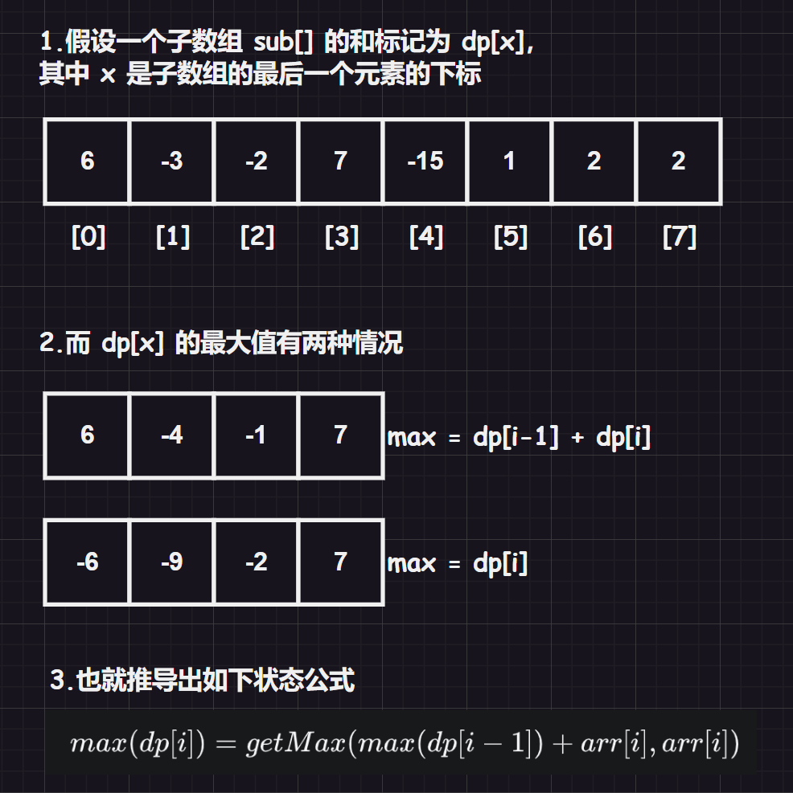

# 1.编程题

## 1.1.[统计回文](https://www.nowcoder.com/practice/9d1559511b3849deaa71b576fa7009dc?tpId=122&tqId=33664&ru=/exam/oj)

可以一个一个插入然后直接判断该字符串是否位回文字符串。

```cpp
#include <iostream>
#include <string>
using namespace std;
bool IsOK(const string& str)
{
    int begin = 0;
    int end = str.size() - 1;
    while (begin < end)
    {
        if (str[begin] != str[end])
        {
            return false;
        }
        begin++;
        end--;
    }
    return true;
}
int main()
{
    string A;
    string B;
    cin >> A;
    cin >> B;

    int index = 0;
    int count = 0;
    while (index != A.size() + 1)
    {
        string copy(A);
        copy.insert(index, B);
        if (IsOK(copy))//是回文就++count
        {
            count++;
        }
        index++;
    }
    cout << count;
    return 0;
}
```

## 1.2.[连续最大和](https://www.nowcoder.com/practice/5a304c109a544aef9b583dce23f5f5db?tpId=182&tqId=34613&ru=/exam/oj)

原本我觉得是使用滑动窗口，结果到最后发现是经典的动态规划问题，也就是`DP`问题。

要想解决`DP`问题，就需要知道状态方程式：

$max(dp[i]) = getMax(max(dp[i-1]) + arr[i], arr[i])$



```cpp
#include <iostream>
#include <vector>
using namespace std;
int main()
{
	//1.输入数据
	int size = 0;
	cin >> size;
	vector<int> nums(size);
	for (auto& it : nums)
	{
		cin >> it;
	}

	//2.动态规划
	int sum = nums[0];
	int max = nums[0];
	for (int i = 1; i < size; i++)
	{
		sum = std::max(sum + nums[i], nums[i]);
		if (sum >= max)
		{
			max = sum;
		}
	}

	//3.输出结果
	cout << max;
	return 0;
}
```

# 2.选择题

没有错误，暂时不写。