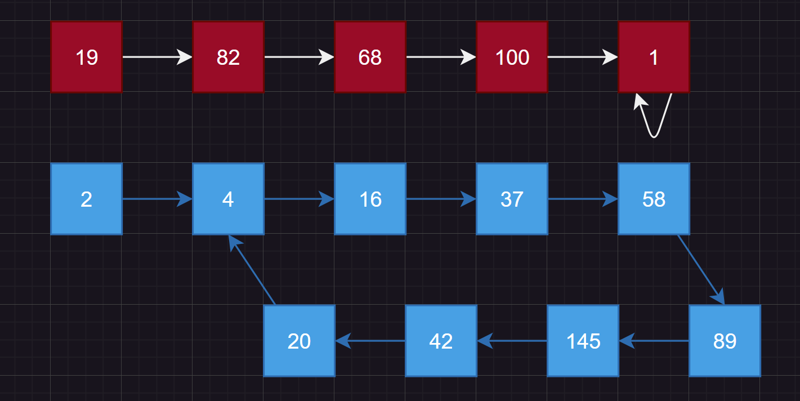

# 1.原理

双指针是一种解题常用方法，常用于将数组按照某种要求进行分块/划分，这里的指针对于数组来说，可以替换成下标（毕竟使用下标实际上就是用了指针）。

## 1.1.划分区间

通常将这两个指针命名位`dest/cur`（或者`begin/end`），利用这两个指针将区间划分为三个不同性质的区间`[0, dest-1][dest, cur-1][cur, n-1]`，在`cur`移动的时候，保持三个区间的性质不变。

实际上这也是快速排序中的前后指针、三路划分中使用的原理。仔细回想一下，快速排序的算法逻辑中，实际上也是将下标`[left, right]`之间的数据划分为`[left, key-1][key, key][key+1, right]`，并且让这三个区间保持某种性质不变（在快排中是第一个区间比`key`小/大，最后一个区间比`key`大/小）。

具体可以看一下这一道：[2.1.[力扣283. 移动零]](##2.1.[力扣283. 移动零])。

## 1.2.覆盖重写

利用双指针可以达到覆盖数组的目的，这里可以看看：[2.2.[力扣1089. 复写零]](##2.2.[力扣1089. 复写零])。

## 1.3.快慢指针

经典的应用就是判断链表是否带环，可以看看：[2.3.[力扣202. 快乐数]](##2.3.[力扣202. 快乐数])。

## 1.4.单调性

有些时候将序列排序后使用双指针会有很高效的解法，可以看看：[2.5.[力扣611. 有效三角形的个数]](##2.5.[力扣611. 有效三角形的个数])、[2.6.[力扣LCR 179. 查找总价格为目标值的两个商品]](##2.6.[力扣LCR 179. 查找总价格为目标值的两个商品])

# 2.题目

## 2.1.[力扣283. 移动零](https://leetcode.cn/problems/move-zeroes/)

这道题目的解法有很多，这里我写一个常见的解法：使用`cur`扫描/遍历数组，使用`dest`来作为分界线，在划分成的`[0,dest-1][dest, cur-1][cur, n-1]`中，三个区间的性质是：`[0,dest-1]`是已经处理过确认非`0`的区间，`[dest, cur-1]`是确认为`0`的区间，`[cur, n-1]`是待处理的部分，然后接下来一直移动`cur`直至`[cur, n - 1]`为空，区间一直保持以上的性质。

```c++
class Solution
{
public:
    void moveZeroes(vector<int>& nums)
    {
        size_t dest = 0;   
        size_t cur = 0;     
        while(cur < nums.size())
        {
            if(nums[cur] != 0)
            {
                std::swap(nums[cur], nums[dest]);
                dest++;
            }
            cur++;
        }
    }
};
```

>   时间复杂度为$O(n)$，因为只需要遍历一次即可解决问题
>   空间复杂度为$O(1)$，因为不计输入数据，只用到了两个有限的变量

## 2.2.[力扣1089. 复写零](https://leetcode.cn/problems/duplicate-zeros/)

首先最容易想到的就是使用另外一个`vector<int> ret`顺序表来存储复写后的数组，并且拷贝回`vector<int> arr`即可。

```c++
class Solution
{
public:
    void duplicateZeros(vector<int>& arr)
    {
        std::vector<int> ret;
        for(auto it : arr)
        {
            ret.push_back(it);
            if(it == 0)
            {
                ret.push_back(0);
            }
        }
        int i = 0;
        for(auto& it : arr)
        {
            it = ret[i]; 
            i++;
        }
    }
};
```

虽然可以过，但是忽略了“就地修改”这个规则，这又该怎么办呢？

我们可以定义一个`size`指向“复写操作后数组”的最后一个元素，`cur`指向“复写操作前数组”的最后一个元素，也就是说：对于`arr=[1,0,2,3,0,4,5,0]`经过复写操作后为`ret=[1,0,0,2,3,0,0,4]`。因此`cur`下标指向`arr[5]=4`的位置，假设`size`下标指向`arr[7]=0`的位置，然后从右往左判断覆盖（非`0`就`arr[7]=arr[5]`，`0`则复写两个`0`），重复操作即可。

但是怎么找到“复写操作后数组”的最后一个元素的下标呢？依旧可以使用双指针寻找，你么看错，就是双指针里面套双指针。

1. 我们假设`size=0, cur=0`然后让`cur`遍历整个数组，只要遇到`0`就让`size+=2, cur++`，如果是遇到非`0`就让`size++, cur++`
2. 也就是说`size`实时记录了“复写操作后数组”的大小
3. 最后遍历完整个数组，此时的`cur`一定指向复写操作后数组的最后一个元素的后面
4. 然后执行之前说的“从右向左覆盖”操作即可

```c++
class Solution
{
public:
    void duplicateZeros(vector<int>& arr)
    {
        //1.寻找复写操作后，数组的最后一个元素
        int cur = 0;//寻找“复写操作后数组”的最后元素的下标
        int size = 0;//记录“复写操作后数组”的大小

        //[例子1]
        //复写前：[1,5,2,0,6,8,0,6,0]
        //复写后：[1,5,2,0,0,6,8,0,0]
        //[例子2]
        //复写前：[5,2,1,3,0]
        //复写后：[5,2,1,3,0]0 会溢出一个0
        while (size < (int)arr.size())
        {
            if (arr[cur] == 0)
            {
                size += 2;
            }
            else
            {
                size += 1;
            }
            cur++;
        }
        cur--;
        size--;

        //2.从右往左做开始复写
        //[例子1]
        //复写前：[1,5,2,0,6,8,0,6,0],cur->arr[5]=4, size->arr[7]=0
        //复写后：[1,5,2,0,0,6,8,0,0]
        //[例子2]
        //复写前：[5,2,1,3,0],cur->arr[4]=0, size->arr[5] 越界了 
        //复写后：[5,2,1,3,0]0 会溢出一个0

        if (arr[cur] == 0 && size >= arr.size())
        //当出现最后一个元素为0的时候很特殊，有两种可能：
        //1.复写操作后溢出了一个0，这种情况只复写一次即可
        //2.复写操作后刚好最后两个元素为0，这种情况正常复写即可
        {
            size--;
            arr[size] = arr[cur];
            size--;
            cur--;
        }
        while (cur != -1)
        {
            if (arr[cur] != 0)
            {
                arr[size--] = arr[cur--];
            }
            else
            {
                arr[size--] = arr[cur];
                arr[size--] = arr[cur];
                cur--;
            }
        }
    }
};
```

>   时间复杂度为$O(n)$，两次循环就是$O(n+n)=O(2n)$，也就是$O(n)$
>   空间复杂度为$O(1)$，只用到了常数个有限的变量

## 2.3.[力扣202. 快乐数](https://leetcode.cn/problems/happy-number/)

实际上这是一道双链表判断是否回环的问题，可以使用快慢指针（双指针的一种使用方法）来判断链表是否存在回环点。本题最麻烦的问题就是如何知道是否会出现无限循环的情况。



`````c++
using namespace std;
class Solution
{
private:
    int _function(int number)//计算平方值
    {
        int add = 0;
        while (number)
        {
            add += (number % 10) * (number % 10);
            number /= 10;
        }
        return add;
    }
public:
    bool isHappy(int number)
    {
        //循环判断是否happy
        int p = number;//走一步的指针（慢指针）
        int curp = number;//走两步的指针（快指针）
        while (true)
        {
            p = _function(p);//得4，走一步...
            curp = _function(_function(curp));//得16，走两步...
            if (p == curp)//如果找到循环点，也就是快慢指针相遇，就进入if语句
            {
                if (p == 1)//如果相遇点处的值为1就返回true
                {
                    return true;
                }
                return false;//如果不是1就返回false
            }
        }
    }
};
`````

但是这道题目实际上是出简单的了，题目已经提前告诉我们取平方后只有两种情况：

1.   最后得到`1`（实际上也是循环）
2.   最后是无限循环，一直在一个回环里循环

但是实际上，从简单的思考上，是否存在：无限计算下去得不到`1`，但是不存在环的可能？我们可以使用”鸽笼原理“：在`n`个鸽笼中放入`n+1`只鸽子，则至少有一个笼子，里面的鸽子数量大于`1`。

我们设`int`的范围中最大的正数为`(0111 1111 1111 1111 1111 1111 1111 1111)2=(21 4748 3647)10≈(2.1*10^9)2`。

假设有一个比`int`更大的数`(99 9999 9999)10`，则经过平方后得到`9^2*10=810`。因此`[1, 99 9999 9999]`范围内的数，经过平方后得到的数一定在`[0, 810]`的范围内，因此我们就有了`810`个鸽笼，假设最坏情况下一个属于`[1, 99 9999 9999]`数经过平方后得到`1`填充了一个笼，再次平方得到`2`填充第二个笼...一直到`810`个笼子全部填完（这里只是假设最坏情况，实际不太可能达到），则第`811`次平方后又得到了一个`[0, 810]`内的数，因此造成了循环。

那对于`int`范围内的数就更加会出现循环的情况了，毕竟`int`范围内的数平方得到的新数一定在`[0, 810]`的范围内，如果不循环，那么每一个数才放进小于`810`的笼子里根本不够用！

## 2.4.[力扣11. 盛最多水的容器](https://leetcode.cn/problems/container-with-most-water/)

本题难度相较于前面会上升一些，首先最容易的解法就是：暴力穷举，直接上两个`循环`，枚举出所有的情况，找到最大的容积，但是使用这种方法一定会超时。

但是本题可以在遍历的时候作出节省，这是一种重要的思路：有的时候不得不使用枚举时，可以考虑是否剔除一些情况达到提高枚举效率的目的。

1.   首先使用两个指针`begin`和`end`指向数组`heights[]`的首尾处
2.   计算高和宽`height = min{heights[begin], heights[end]}`和`width = end - begin`，然后尾插到`volumes`中
3.   然后从`heights[begin]`和`heights[end]`选择中最小的那一个数的下标`begin++`或者`end--`
4.   只要满足`begin < end`就一直循环`1~3`即可
5.   最后找到`volumes`中最大的体积返回即可

```c++
class Solution 
{
public:
    int maxArea(vector<int>& heights) 
    {
        int begin = 0, end = (int)heights.size() - 1;

        vector<int> volumes;
        
        int width = 0;
        int height = 0;
        while (begin < end)
        {
            //1.取得“最大的宽”
            width = end - begin;

            //2.取得“最小的高”
            height = heights[begin];
            if (height > heights[end])
            {
                height = heights[end--];
            }
            else
            {
                begin++;
            }
            //3.计算区间内最大面积
            volumes.push_back(width * height);
        }
        return *std::max_element(volumes.begin(), volumes.end());;
    }
};
```

>   时间复杂度是$O(n)$，由于是两个指针在遍历数组，因此就相当于遍历整个数组，因此数据复杂度就是$O(n)$
>
>   空间复杂度是$O(1)$，这点没什么好解释的

## 2.5.[力扣611. 有效三角形的个数](https://leetcode.cn/problems/valid-triangle-number/)

一般而言，判断三个数`a`、`b`、`c`能否构成三角形的依据是：
$$
\begin{cases}
a+b>c\\
a+c>b\\
b+c>a
\end{cases}
$$
但是，如果将`a`、`b`、`c`三个数有序为`a <= b <= c`，就只需要判断一次`a + b > c`即可，因此就可以先把整个数组排序好后再来判断是否构成三角形。

因此暴力一点的话可以像下面这么写：

`````c++
class Solution
{
    bool check(vector<int>& nums, int i, int j, int k)
    {
        return (nums[i] + nums[j] > nums[k]);
    }
public:
    int triangleNumber(vector<int>& nums)
    {
        sort(nums.begin(), nums.end());

        int count = 0;
        for (int i = 0; i < nums.size(); i++)
        {
            for (int j = i + 1; j < nums.size(); j++)
            {
                for (int k = j + 1; k < nums.size(); k++)
                {
                    if (check(nums, i, j, k))
                    {
                        count++;
                    }
                }
            }
        }
        return count;
    }
};
`````

但是这只能过大部分的例子，还有一些情况没有办法过（数据量太大），因此还需要做优化。

首先数组已经是有序（具有单调性）的了，只需要判断`a + b > c`即可。

则从最后一个元素$x_{n}$开始证明有$x_{0}+x_{n-1}>x_{n}$即可直接认为$x_{n-2}$后的数都可以和$x_{n-1}$以及$x_{n}$构成三角形，无需判断...

```c++
class Solution
{
public:
    int triangleNumber(vector<int>& nums)
    {
        //1.排序数组
        sort(nums.begin(), nums.end());

        //2.通过三角形的性质结合单调性判断有多少种符合的情况
        int count = 0;//存储有多少种组合
        int key = nums.size() - 1, begin = 0, end = key - 1;//分为区间[begin, end]key
        while (key >= 2)
        {
            while (begin < end)
            {
                if (nums[begin] + nums[end] > nums[key])
                    //如果nums[begin] + nums[end] > key，
                    //那么nums[end]加上“nums[begin]...nums[end-1]”的任意一个数都大于key
                    //然后变成[begin, end--]key，也就是说：明确了和nums[end]结合有end - begin种情况
                {
                    count += (end - begin);
                    end--;
                }
                else//如果不是这样，那么就变成[begin++, end]key
                {
                    begin++;
                }
            }
            begin = 0;//最后重置一下左区间索引
            end = --key - 1;//最后重置一下右区间索引（并且修改key）
        }
        return count;
    }
};
```

>   时间复杂度：$O(n^{2})$

## 2.6.[力扣LCR 179. 两数之和](https://leetcode.cn/problems/he-wei-sde-liang-ge-shu-zi-lcof/)

这道题目也是利用单调性达到节省枚举次数的目的。

1.   首先选定最后一个数`price[end]`，和数组其他的数`price[begin]`相加
2.   如果发现相加值等于目标值，则返回`price[begin]`和`price[end]`
3.   如果发现相加值小于目标值，则`begin++`
4.   如果发现相加值大于于目标值，则说明不用继续移动`begin`了。因为此时的`price[begin] + price[end] > target`，那么根据单调性，`price[begin~end-1] + price[end]`都大于`target`。此时`begin`重置为`0`，然后`end--`，重复`1~4`步骤即可

`````c++
class Solution
{
public:
    vector<int> twoSum(vector<int>& price, int target)
    {
        //1.创建要返回的顺序表
        vector<int> ret;

        //2.创建双指针begin和end
        int end = price.size() - 1;
        int begin = 0;

        //3.从最后一个指针开始循环，每次循环向前一步
        while (end != 0)
        {
            while (begin < end)
            {
                if (price[begin] + price[end] == target)//如果相等就找到了
                {
                    ret.push_back(price[begin]);
                    ret.push_back(price[end]);
                    return ret;
                }
                else if (price[begin] + price[end] < target)//如果小于就找比price[begin]更大的数
                {
                    begin++;
                }
                else//price[begin] + price[end] > target，这个时候已经大于目标值了，没有必要再循环让begin++了，直接跳出即可
                {
                    break;
                }
            }
            begin = 0;//重置begin
            end--;
        }
        return ret;
    }
};
`````

或者简化为以下代码（上述代码还有些冗余）：

```cpp
class Solution
{
public:
    vector<int> twoSum(vector<int>& price, int target)
    {
        //1.创建要返回的顺序表
        vector<int> ret;

        //2.创建双指针begin和end
        int end = price.size() - 1;
        int begin = 0;

        //3.从最后一个指针开始循环，每次循环向前一步
        while (begin < end)
        {
            if (price[begin] + price[end] > target)//如果相等就找到了
            {
                end--;
            }
            else if (price[begin] + price[end] < target)//如果小于就找比price[begin]更大的数
            {
                begin++;
            }
            else
            {
                ret.push_back(price[begin]);
                ret.push_back(price[end]);
                break;
            }
        }

        return ret;
    }
};
```

>   时间复杂度：`O(n)`

## 2.7.[力扣LCR 007. 三数之和](https://leetcode.cn/problems/1fGaJU/)

```cpp
class Solution
{
public:
    vector<vector<int>> threeSum(vector<int> nums)
    {
        //1.设置要返回的顺序表
        vector<vector<int>> ret;
        //2.排序原数据数组
        sort(nums.begin(), nums.end());
        //3.查找复合条件的三元组
        int n = nums.size();
        for (int i = 0; i < n; )
        {
            if (nums[i] > 0) break;

            int left = i + 1, right = n - 1, target = -nums[i];
            while (left < right)
            {
                int sum = nums[left] + nums[right];
                if (sum > target)
                {
                    right--;
                }
                else if (sum < target)
                {
                    left++;
                }
                else
                {
                    ret.push_back({ nums[i], nums[left], nums[right] });
                    left++, right--;

                    //去重
                    while (left < right && nums[left] == nums[left - 1]) left++;
                    while (left < right && nums[right] == nums[right + 1]) right--;
                }
            }
            i++;
            while (i < n && nums[i] == nums[i - 1]) i++;
        }
        return ret;
    }
};
```

这题比较难，以后再做然后补充。

>   时间复杂度：$O(n^{2})$

## 2.8.[力扣18. 四数之和](https://leetcode.cn/problems/4sum/)

```cpp
class Solution
{
public:
    vector<vector<int>> fourSum(vector<int>& nums, int target)
    {
        vector<vector<int>> ret;
        sort(nums.begin(), nums.end());

        int n = nums.size();
        for (int i = 0; i < n; )
        {
            for (int j = i + 1; j < n; )
            {
                int left = j + 1, right = n - 1;
                long long aim = (long long)target - nums[i] - nums[j];//防止溢出
                while (left < right)
                {
                    int sum = nums[left] + nums[right];
                    
                    if (sum < aim)
                    {
                        left++;
                    }
                    else if (sum > aim)
                    {
                        right--;
                    }
                    else
                    {
                        ret.push_back({ nums[i], nums[j], nums[left++], nums[right--] });
                        //去重
                        while (left < right && nums[left] == nums[left - 1]) left++;
                        while (left < right && nums[right] == nums[right + 1]) right--;
                    }
                }
                //去重
                j++;
                while (j < n && nums[j] == nums[j - 1]) j++;
            }
            //去重
            i++;
            while (i < n && nums[i] == nums[i - 1]) i++;
        }
        return ret;
    }
};
```

>   时间复杂度：$O(n) = n^{3}$
>
>   空间复杂度：主要消耗在排序那里


