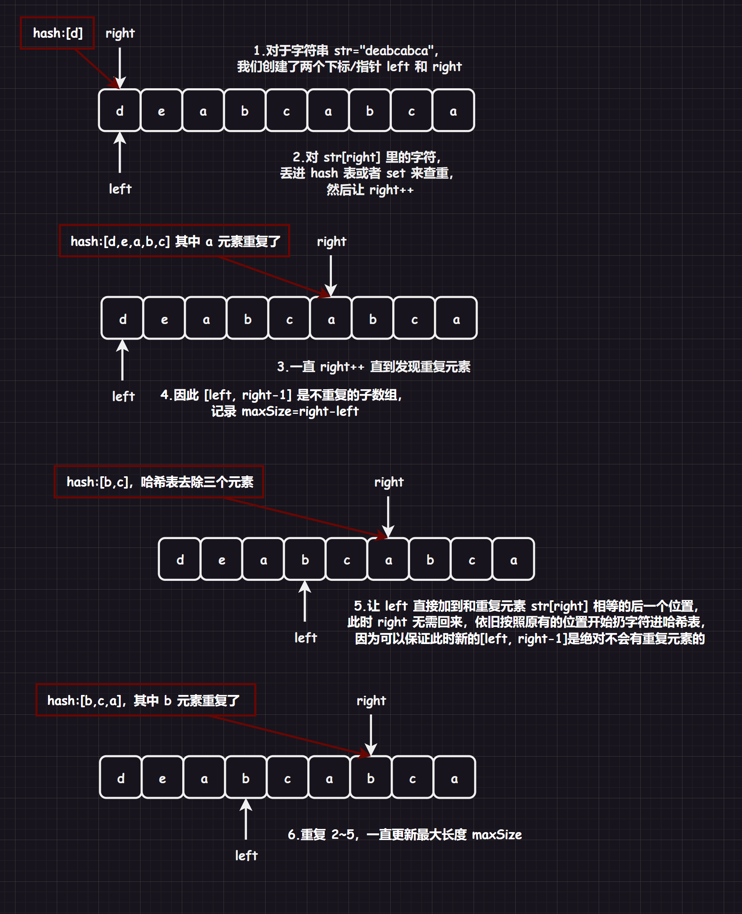
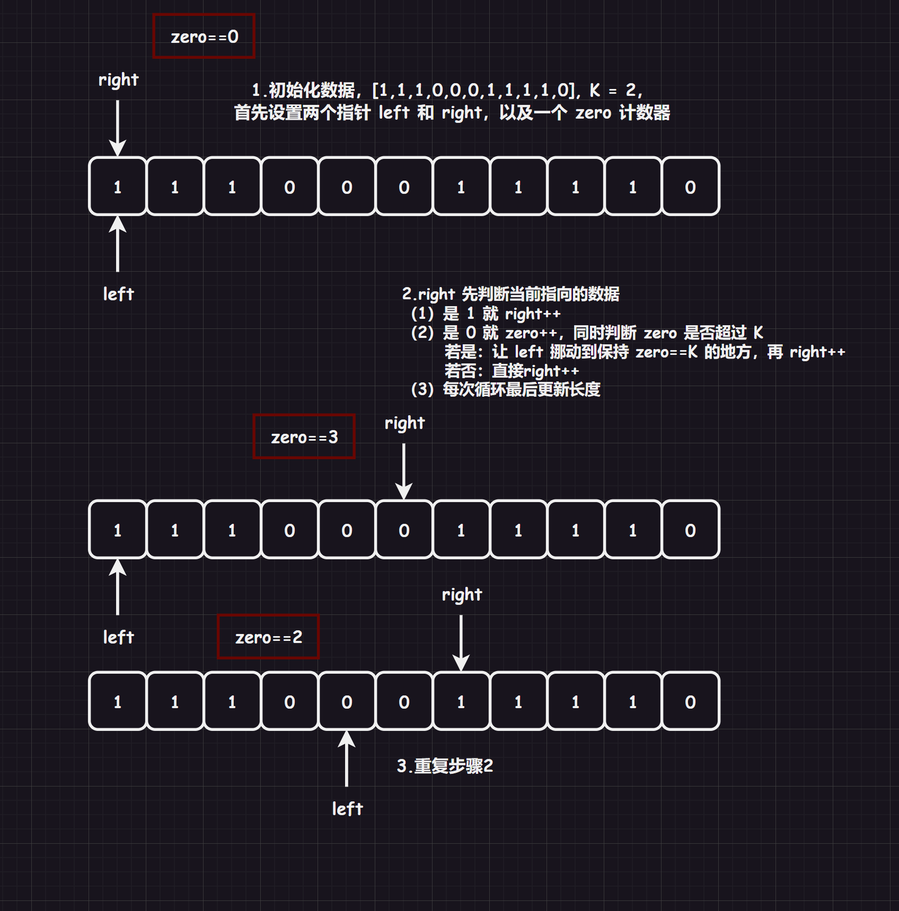

# 1.原理

我们用这道题目[LCR 008. 长度最小的子数组](https://leetcode.cn/problems/2VG8Kg/)来讲解“滑动窗口”的解法。

## 1.1.暴力$O(n^{3})$

遍历每一个子数组（都要大于等于`7`），最统计出最小的数组。

这样做的话，划分左右区间（`left`和`right`）就需要$O(n^{2})$，然后每一个区间都要求和，所有求和又需要$O(n)$，整体时间复杂度就是$O(n^{3})$。

## 1.2.优化$O(n^{2})$

如何将上述解法优化呢？首先在求和上就可以优化到$O(n)$。

划分区间从`[left,left=right]`开始，先让`sum+arr[right]`，然后再`right++`，这样子就不需要重复计算`sum`了，这样就可以优化为$O(n^{2})$。

## 1.3.优化$O(n)$

全部都是正整数，也就是，加的数越多，得到的结果`sum`就越大（也就是具有单调性），因此当我们划分区间`[left,right]`后得到的`sum`只要比`target`大或等于就无需再`right++`了，继续让其加加得到的数组肯定会比`target`大，但是数组长度也变大了，这是我们不需要的。

上述划分结束后，我们就得到了一个`[left,right]`窗口区间和对应的`sum`，其中`[left,right-1]`的`sum`一定小于`[left,right]`的`sum`或者说`target`。

后面让这个窗口区间挪动起来，找比这个区间长度要小，但是窗口的`sum`大于等于`target`的，并且实时更新`maxLength`。

直接让`sum-arr[left]`，然后`left++`即可得到`[left,right]`区间的新`sum`。

查看这个`sum`是否大于`target`，如果是继续加加，如果不是就整个窗口移动，直到`right`到结尾。

而这种`left`和`right`双指针同向移动的情况就称为“滑动窗口”。

```cpp
class Solution
{
public:
    int minSubArrayLen(int target, vector<int>& nums)
    {
        int sum = 0;
        int maxLength = 0;

        int left = 0;
        int right = 0;

        while (right < nums.size())
        {
            sum += nums[right];
            if (sum >= target)
            {
                break;
            }
            right++;
        }
        maxLength = right - left + 1;
        //得到窗口[left, right]
        
        if(sum < target)
        {
            return 0;
        }

        while(right < nums.size())
        {
            sum -= nums[left];
            left++;
            if (sum >= target)
            {
                maxLength = right - left + 1;
            }
            else//sum < target
            {
                right++;
                if (right >= nums.size())
                {
                    break;
                }
                sum += nums[right];
            }
        }
        return maxLength;
    }
};
```

或者写得更加高明一些：

```cpp
class Solution
{
public:
    int minSubArrayLen(int target, vector<int>& nums)
    {
        int n = nums.size();
        int sum = 0;
        int len = INT_MAX;

        for(int left = 0, right = 0; right < n; right++)
        {
            sum += nums[right];
            while(sum >= target)
            {
                len = min(len, right - left + 1);
                sum -= nums[left++];
            }
        }
        return len == INT_MAX ? 0 : len;
    }
};
```

>   时间复杂度：由于只操作两个指针，最坏情况下操作$n+n$次，也就是$O(n)$

因此可以看出，滑动窗口的题目基本都是：

1.   设定窗口范围
2.   让数据进窗口
3.   判断是否符合要求，不符合则让数据出窗口

# 2.题目

## 2.1.[LCR 016. 无重复字符的最长子串](https://leetcode.cn/problems/wtcaE1/)

### 2.1.1暴力


>   时间复杂度：$O(n^{2})$

### 2.1.2.优化



```cpp
class Solution
{
public:
    int lengthOfLongestSubstring(string str)
    {
        int left = 0;
        int right = 0;
        int maxSize = 0;
        int hash[128] = { 0 };

        while (left < str.size())
        {
            while (right < str.size() && hash[str[right]] == 0)//不是重复的字符就放入哈希表之中
            {
                hash[str[right++]]++;
            }
            //走到这里说明出现了重复的字符，这个重复元素就是str[right]
            maxSize = maxSize > right - left ? maxSize : right - left;//记录最大长度
            while (str[left] != str[right])//让left直接跳到在和str[right]重复的元素后面
            {
                hash[str[left]]--;
                left++;
            }
            hash[str[left]]--;
            left++;//走到这里还要在加加一次
        }

        return maxSize;
    }
};
```

还可以写得更加简洁：

```cpp
class Solution
{
public:
    int lengthOfLongestSubstring(string str)
    {
        int left = 0, right = 0, maxSize = 0, n = str.size(), hash[128] = { 0 };

        while (right < n)
        {
            hash[str[right]]++;//进窗口
            while (hash[str[right]] > 1)//判断
                hash[str[left++]]--;//出窗口

            maxSize = max(maxSize, right - left + 1);//记录最大长度
            right++;
        }

        return maxSize;
    }
};
```

>   时间复杂度：$O(n)$

## 2.2.[1004. 最大连续1的个数 III](https://leetcode.cn/problems/max-consecutive-ones-iii/)

如果转变思路为：一个区间内包含的`0`的个数不超过`K`，求这样的区间的最大值。



```cpp
class Solution
{
public:
    int longestOnes(vector<int> nums, int K)
    {
        int left = 0, right = 0;
        int zero = 0;
        int maxSize = 0;
        int n = nums.size();
        
        while (right < n)
        {
            if (nums[right] == 0) zero++;

            while (zero > K)
            {
                if (nums[left] == 0) zero--;
                left++;
            }

            right++;
            maxSize = max(maxSize, right - left);
        }
        return maxSize;
    }
};
```

