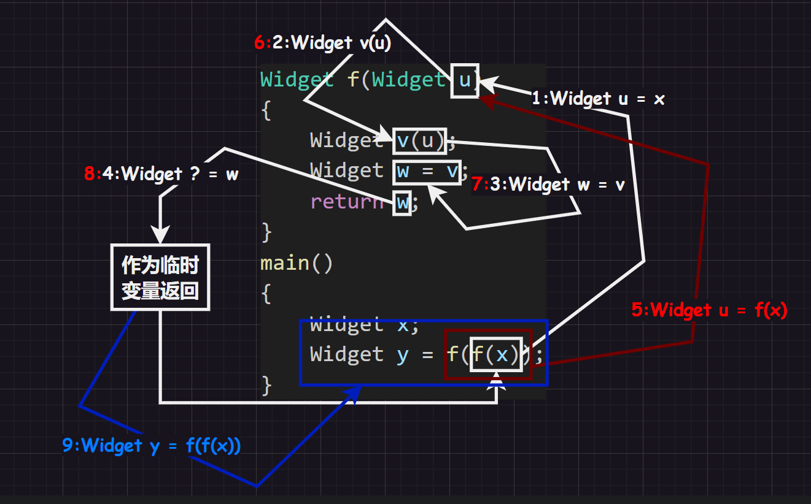

# 1.编程题

## 1.1.[WY20 两种排序方法](https://www.nowcoder.com/practice/839f681bf36c486fbcc5fcb977ffe432?tpId=122&tqId=33666&ru=/exam/oj)

想复杂了，这题实际上直接判断就可以，只需要满足升序即可，一定要看清楚题目呀！

```cpp
#include <iostream>
#include <vector>
#include <string>
using namespace std;

int main()
{
    int n = 0;
    cin >> n;
    vector<string> arr(n);

    for(auto& str : arr)
    {
        cin >> str;
    }
    
    bool lsort = true, csort = true;

    for(int i = 1; i < n; i++)
    {
        if(arr[i - 1].size() > arr[i].size())
        {
            lsort = false;
        }
        if(arr[i - 1] > arr[i])
        {
            csort = false;
        }
    }

    if(lsort && csort)
    {
        cout << "both" << endl;
    }
    else if(lsort)
    {
        cout << "lengths" << endl;
    }
    else if(csort)
    {
        cout << "lexicographically" << endl;
    }
    else
    {
        cout << "none" << endl;
    }
    return 0;
}
```

## 1.2.[求最小公倍数](https://www.nowcoder.com/questionTerminal/dc0e22ddf9974db2b78ed6f65088f8b3)

首先需要复习为什么叫“最大公约数”和“最小公倍数”，对于数$X$和数$Y$：

1.   最大公约数$M$是指最大的能够同时整除它们的数
2.   最小公倍数$N$是指最小的能够被它们同时整除的数

### 1.2.1.最大公约数

#### 1.2.1.1.解法一：定义法

待补充...

#### 1.2.1.2.解法二：辗转相除法

辗转相除法的步骤如下：

1.   对于两个数`X`和`Y`
2.   计算`Z = X % Y`
3.   若取余结果不为`0`，重新赋值`X = Y`和`Y = Z`
4.   直到取余的结果为`0`，则`Y`最大公约数

```cpp
//求最大公约数
#include <iostream>
using namespace std;
int main()
{
    int X = 0;
    int Y = 0;
    cin >> X >> Y;
    int product = X * Y;

    int Z = 0;
    while (Z = X % Y)
    {
        X = Y;
        Y = Z;
    }
    cout << Y;
    return 0;
}
```

### 1.2.2.最小公倍数

#### 1.2.2.1.解法一：定义法

```cpp
//求最小公倍数
#include <stdio.h>
int main()
{
    int a = 0;
    int b = 0;
    scanf("%d %d", &a, &b);
    int m = (a, b);//取较大值
    while(m % a != 0 && m % b != 0)
    {
        m++;
    }
    printf("%d", m);
    return 0;
}
```

#### 1.2.2.2.解法二：公式法

可以根据$X \cdot Y = M \cdot N$公式来解得，但是需要知道最大公约数，可以使用辗转相除法。

```cpp
//求最小公倍数
#include <iostream>
using namespace std;
int main()
{
    int X = 0;
    int Y = 0;
    cin >> X >> Y;
    int product = X * Y;

    int Z = 0;
    while (Z = X % Y)
    {
        X = Y;
        Y = Z;
    }
    cout << product / Y;
    return 0;
}
```

# 2.选择题

## 2.1.题目一：拷贝构造函数的调用次数

下面代码的输出结果是什么？

```cpp
Widget f(Widget u)
{   
    Widget v(u);
    Widget w = v;
    return w;
} 
main()
{ 
    Widget x;
    Widget y = f(f(x)); 
}
```

>   解释：
>
>   可以从上图看到，该代码调用了`9`次，但是当函数返回值是类类型对象时，编译器可以会对返回值类型进行优化，这里优化了两次（第`5`和`9`条被优化了）。因此答案是输出`7`，主要是编译器优化的问题干扰了我，老老实实的写出次数，然后分析即可。