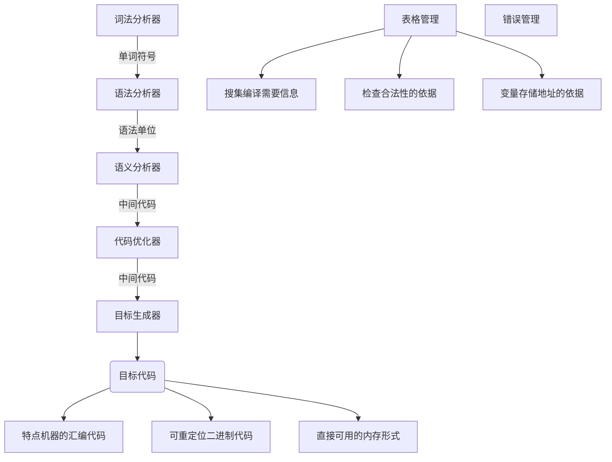

# 1.翻译程序的分类

一般可以把翻译可以分为汇编程序（编译为汇编程序）、编译程序（编译为目标程序）、解释程序（边解释变执行），或者干脆直接根据有无目标代码生成这一特征分为编译程序（有目标代码生成）和解释程序（无目标代码生成）。

而我重点讨论编译程序的运行逻辑，以及中间的算法和细节。

# 2.翻译程序的过程

而学习编译技术的主要内容就是细化上述的步骤，并且还需要对表格管理和错误管理进行细化。另外，有些编译器的侧重点有可能不同，可能会重点实现某一个步骤；还有的编译可能把多个步骤融合为一个步骤理解；还有的编译器不仅仅做一趟流程处理，有可能会执行多趟翻译流程...