# 1.第一份程序

## 1.1.代码编写

```java
/*块注释
HelloWord.java 内部
*/

/**文档注释
* 作者：limou3434
*/
public class HelloWord {
    public static void main(String[] args){
        System.out.println("Hello Word!");//打印“Hello Word!”
    }
}
```

直接上代码，上面就是一段 `Java` 代码，我们先来观察一下这段代码的细节：

1. 首先看到的是一个 `main()` 函数（每一个类只能有一个 `main()`），主函数没有所谓的返回值，因此返回类型是 `void`，在 `main()` 的内部有一个字符数组类型的 `args` 变量，用来接收命令行参数

2. 在一个 `Java` 文件中只能有一个 `public` 类，并且 `pubilc` 类的名字必须和 `.java` 文件名字相同。而 `main()` 函数被包含在这个类中，不允许被写在类外

3. 在 `main()` 内部，有一个调用，调用了打印函数 `println()`，这个函数后面的 `ln` 指的是换行，打印函数内部包含了需要被打印的内容

4. 在 `Java0` 中有三种注释：行注释、段注释、文档注释，这里故意都使用了一遍

## 1.2.代码运行

那么如何编译这一份代码呢？

### 1.2.1.命令行编译

1. 在最原始的情况下只需要将上述代码写入 `HelloWord.java`，然后通过使用 `Java` 的编译器 `javac` 这个可执行程序，使用命令 `javac ./HelloWord.java`（注意需要正确写好 `Hellow.java` 的相对路径或者绝对路劲）

2. 此时在 `HelloWord.java` 的同级目录中就存在一个经过编译的字节码文件 `HelloWord.class`

3. 运行 `Java` 代码代码直接使用 `Java HelloWord` 即可

4. 需要注意的是，`Java` 不是单个文件就生成单个字节码的文件，而是有多少个类就有多少个字节码文件，并且字节码文件名和类相同，这点和很多编程语言有很大的不同。

> 注意：这里如果因为编码问题无法通过编译，则可以尝试在编译的时候设置某个编码运行，例如 `javac -encoding utf-8 HellowWord.java` 就可以使用 `utf-8` 来进行编码。

### 1.2.2.IEDA 编译

这个后面补上...

## 1.3.代码文档

`Java` 有一个非常独特的功能，给代码生成文档，使用 `javadoc -d [想要生成的代码文档目录名] -author -version UTF-8 -charset UTF-8 [您自己的Java代码文件名] ` 即可生成一个 `html` 帮助文档。

# 2.运行过程

在我们安装 `JDK`（`Java` 开发开发工具包）的时候，`JDK` 里包含 `JRE`（`Java` 运行时环境），`JRE` 里包含 `JVM`（`Java` 虚拟机）

`.java` 后缀的 `Java` 文件使用 `javac` 编译成 `.class` 后缀的字节码文件，再通过 `JVM` 虚拟机转化为机器码运行起来。

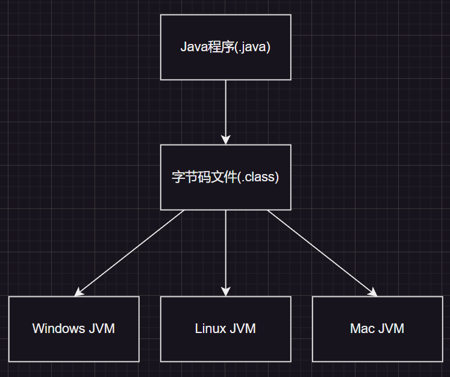 

因此哪怕是其他语言，如果能被转化成字节码，也同样可以在虚拟机上运行。

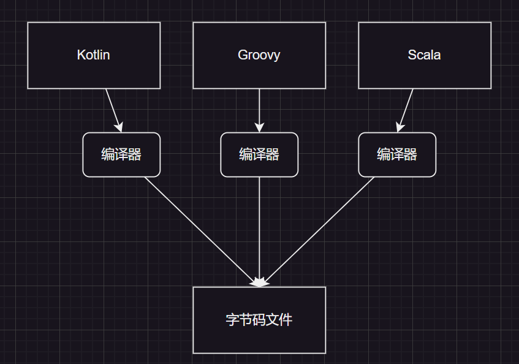

# 3.关键字

有些关键字被 `Java` 所保留，不可以给用户创建标识符来使用，这些关键字的类别有很多，例如：`int`、`class`、`catch` 等等，我们后面再来一一介绍。

# 4.标识符

在 `Java` 中可以将类名、对象名、变量名、方法名称为“标识符”。`Java` 的标识符可以包含：字母、数字、下划线、`$` 符号等。

不过需要注意的是不可以使用数字作为标识符的起始字符，但是可以把 `$` 作为标识符的开头（但是不建议）。

在命名的时候，不仅要注意命名合法，还要注意合理。在本系列文章中我统一采用：

1. 类名：大驼峰

2. 方法名：小驼峰

3. 变量名：小驼峰

# 5.常量与变量

在提及常量和变量的时候，就需要先提及数据类型。

## 5.1.数据类型

`Java` 的数据类型分为两种：基本数据类型和引用类型。

引用类型我们暂时不理会，后面会提及。

其中基本数据类型有四类八种。

### 5.1.1.四类

1. 整型（整数）

2. 浮点型（小数）

3. 字符型（一个字符）

4. 布尔类型（`true` 和 `false`，就是对和错）

### 5.1.2.八种

| 数据类型   | 关键字       | 内存占用  | 范围                   |
| ------ | --------- | ----- | -------------------- |
| 字节型    | `byte`    | `1` 字节 | $[-128,127]$         |
| 短整型    | `short`   | `2` 字节 | $[-32768,32767]$     |
| 整型     | `int`     | `4` 字节 | $[-2^{31},2^{31-1}]$ |
| 长整型    | `long`    | `8` 字节 | $[-2^{63},2^{63}-1]$ |
| 单精度浮点数 | `float`   | `4` 字节 | 有，但是不关注              |
| 双精度浮点数 | `double`  | `8` 字节 | 有，但是不关注              |
| 字符型    | `char`    | `2` 字节 | $[0,65535]$          |
| 布尔型    | `boolean` | 无     | `true` 和 `false`       |

`Java` 的数据类型是固定的不会受平台影响，因此很方便做代码移植。

## 5.2.字面常量

数据类型可以给字面常量（数据）做出分类。

类似 `100`、`3.14`、`"abcdef"`、`false` 等这种一眼就能看出数据的都是字面常量，字面常量的类别也是根据数据类型来分类的。

类似 `100` 就是整型常量、`3.14` 就是浮点数常量、`"abcdef"` 就是字符串常量、构成字符串的每一个字符 `a`、`b`、`c`...就是字符常量、`false` 和 `true` 就是布尔常量。

## 5.3.数据变量

变量可以理解为一个容器，可以用来存储一个常量，不同类别的常量需要靠不同类别的变量来存储。
而我们需要用一些关键字（也就是前面在数据类型中提到的），使得变量变成只存储某一字面常量类型的变量。

```java
//定义变量的语法形式为：
int a = 10;//int 是关键字，a 是标识符，标记一个变量，10 为字面常量
//此时变量 a 存储了 10 这个字面量
```

> 注意 `1`：`Java` 时没有全局变量这个术语的，但有类似的。
> 
> 注意 `2`：在 `Java` 编程中如果没有对变量初始化就使用的话，很多编译器直接就会报错，编译也不会通过。
> 
> 注意 `3`：如果赋值给变量过大或者过小的值，`Java` 是不会通过编译的。 

> 补充：字符类型
>
> `Java` 的字符类型是包装类型，不是基本数据类型。为了方便后续一些代码的使用，这里提前讲解一下字符类的相关概念。
>
> `C` 没有字符类型，但是 `Java` 利用类的优势，使用 `String` 类定义字符串类型。
>
> ```java
> //使用 String 类
> public static viod main() {
>     String s1 = "Hello";
>     String s2 = "I am limou3434";
>     String s3 = "100";
>     System.out.prinln(s1 + s2);
>     //String 转 int
>     int number = Inreger.parseInt(str);
>     //int 转 String
>     String s = String.valueOf(number);
> }
> ```
>
> 如果您学过面向对象的语言（例如 `C++`），那您就能很快理解什么是包装类，您可以简单理解为基本数据类型被包装为一个类类型，这么做的好处是统一参数，由于 `Java` 是纯粹的面向对象语言，因此传递参数的时候，大部分使用的是类的实例化对象，因此将基本数据类型就被包装为包装类，可供程序传递参数使用。

# 6.类型转化

需要注意的是，`Java` 是强类型语言，有些不合适的类型转化将会直接报错（`C` 语言是弱类型语言）。

## 6.1.隐式类型转换

代码不需要经过处理，编译器会进行处理不同类型的转换，但是 `Java` 在这一方面检查得比较严格，不允许溢出和不相关类型转化。

```java
//使用隐式类型转化
public class Main {
    public static void main(String[] args) {
        int a = 10;
        long b = 100L;
        b = a;//可以，发生了隐式类型转化，a 从 int 变成 long
        //a = b;//不可以，不够存

        float f = 3.14F;
        double d = 5.12;
        d = f;//可以，f 从 float 转化为 double
        //f = d;//不可以，不够存
    }
}
```

## 6.2.显式类型转换

这方面类似 `C` 语言，也是使用 `()` 来转换，但是不一定能成功，小范围可以转化为大范围的，赋值的数值一定不能溢出，前强制转换的类型要相关且合理。

```java
//使用显示类型转化
public class Main {
    public static void main(String[] args) {
        int a = 10;
        long b = 100L;
        b = a;//可以，发生了隐式类型转化，a 从 int 变成 long
        a = (int)b;//可以，将 b 从 long 强制转化为 int

        float f = 3.14F;
        double d = 5.12;
        d = f;//可以，f 从 float 转化为 double
        f = (float)d;//可以，将 d 从 double 前置转化为 float
    }
}
```

## 6.3.整型提升

在不同变量的运算的运算中，`Java` 也存在整型提升，和 `C` 基本差不多，需要注意是 `Java` 对溢出极其敏感（`C` 对待溢出十分迟钝），提升后需要赋给对应的容器（除非强转）。

```java
//查看整型提升现象
public class Main {
    public static void main(String[] args) {
        byte a = 127;
        byte b = 127;
        //byte c = (byte)(a + b);//a 和 b 提升为 int 进行计算，结果也为 int，虽然可以强转为 byte，但是 很危险
        int d = a + b;//这样才比较好
    }
}
```

# 7.运算符

这里我们只挑出几个比较特殊的运算符，其余的运算符和 `C` 基本差不多（包括“结合性”和“优先级”），这里就不再赘述。

1. `Java` 的除法和 `C` 类似，会向下取整，并且除以 `0` 会抛出异常 `ArithmeticException`（算数异常）

    ```java
    //使用除法的示例
    public class Main {
        public static void main(String[] args) {
            System.out.println(5 / 2); //2
            System.out.println(5.0 / 2); //2.5
            System.out.println(5 / 2.0); //2.5
            System.out.println((float)5 / 2); //2.5
            System.out.println(5 / (float)2); //2.5
            System.out.println((float)(5 / 2)); //2.0
        }
    }
    ```

2. 由于除法一样，所以 `%` 运算也是一样的，需要注意的是，该运算符也可以对小数进行操作（就是很少用）

    ```java
    //使用取模的示例
    public class Main {
        public static void main(String[] args) {
            System.out.println(10 % 3); //1
            System.out.println(-10 % 3); //-1
            System.out.println(10 % -3); //1
            System.out.println(-10 % -3); //-1
    
            System.out.println(-10.3 % 3); //-1.3000000000000007
        }
    }
    ```

3. 在增量运算符中有的时候会发生类型转化，等价于强转

   ```java
   //使用增量运算符发生隐式强转
   public class Main {
       public static void main(String[] args) {
           int num1 = 10;
           double num2 = 3.14;
   
           int add1 = 0;
           double add2 = 0.0;
   
           //方式一
           //add1 = num1 + num2; //4 字节和 8 字节相加，发生整形提升，只用 4 个字节是放不下去的
           //System.out.println(add1);
           add2 = num1 + num2;
           System.out.println(add2);
           System.out.println();
   
           //方式二
           add1 = (int) (num1 + num2);
           System.out.println(add1);
           add2 = (double) (num1 + num2);
           System.out.println(add2);
           System.out.println();
   
           //方式三
           num1 += num2; //等价于 a = (int)(a + b)
           System.out.println(num1);
       }
   }
   ```

   而自增、自减运算符还有一种特殊的情况需要您注意，您应该避免出现下面这样的代码...

   ```java
   //有关于加加和减减的一个很坑的点
   public class Main {
       public static void main(String[] args) {
           int a = 10;
           a = a++;
           System.out.println(a);
           //结果为 10，而不是 11，这个原因涉及底层，
           //以后我再来填坑，这里充分体现了 Java 和 C/C++ 不一样！
       }
   }
   ```

4. 关系运算符、逻辑运算符（也具有短路效应）的操作表达式必须为布尔表达式，其运算结果为 `true` 和 `flase`，不是 `非0` 和 `0`。而 `if` 和 `for` 判断的环节中使用的也是布尔表达式

5. `Java` 的移位操作符有三个 `<<`、`>>`、`>>>`，`>>` 是左补符号位，`>>>` 是左补 `0`

6. 也有一个唯一的三目操作符：条件运算符 `表达式1 ? 表达式2 : 表达式3`。并且该表达式必须是被使用的（其结果必须被使用），不能单独存在

7. 对于位操作，建议还是使用括号引导表达式的逻辑，避免出现意想不到的后果（在 `C` 中也最好一样）

> 注意：如果摒弃掉 `C` 的“非零为真”的概念在接下来的编码中会轻松很多...

# 8.控制语句

和大部分编程语言类似，`Java` 也有自己的控制语句，和 `C` 也有些类似，但是在入口判断有很大的不同，不同的根源来自于：`C` 使用整数的非零和 `0` 来判断真假，而 `Java` 完全使用布尔类型来判断真假，而 `Java` 的布尔类型和整数是无法进行比较的，这就导致 `Java` 写出来的入口判断会更加清晰（也可以说没有 `C/C++` 那样整洁，至于是清晰好还是简洁好，看您喜好而定）

## 8.1.分支语句

### 8.1.1.if 语句

`Java` 的 `if` 语句，几乎和 `C/C++` 的使用一样，并且也有类似的悬挂 `else` 的问题，真要说有哪些点不同，就是 `C/C++` 和 `Java` 的代码缩进风格不太一样。

```java
//使用 if 语句
public class Main {
    public static void main(String[] args) {
        int a = 1;
        if (a == 1) { //这里只能是整型
            System.out.println(a);
        } else {
            System.out.println("a != 1");
        }
    }
}
```

### 8.1.2.switch 语句

同样，几乎和 `C` 一样，就是需要注意的是：`switch` 的入口只能使用 `char`、`byte`、`short`、`int`、`Character`、`Byte`、`Short`、`Integer`、`String`、`enum` 类型，其他类型一概不支持（比如 `long` 就不行），这点很重要。

```java
//使用 switch 语句
public class Main {
    public static void main(String[] args) {
        int a = 1;
        switch (a) { //这里只能是整型
            case 1:
                System.out.println(a);
                break;
            case 2:
                System.out.println(a);
                break;
            default:
                System.out.println("default");
        }
    }
}
```

## 8.2.循环语句

### 8.2.1.for 语句

```java
//使用 for 语句
public class Main {
    public static void main(String[] args) {
        for (int a = 1; a < 10; a++) {
            System.out.println(a);
        }
    }
}
```

### 8.2.2.while 语句

```java
//使用 while 语句
public class Main {
    public static void main(String[] args) {
        int a = 1;
        while (a < 10) {
            System.out.println(a);
            a++;
        }
    }
}
```

### 8.2.3.do-while 语句

```java
//使用 do-while 语句
public class Main {
    public static void main(String[] args) {
        int a = 1;
        do {
            System.out.println(a);
            a++;
        } while (a < 10);
    }
}
```

让我们借助循环语句，顺便来讲解一下在 `IDEA` 中如何调试代码：

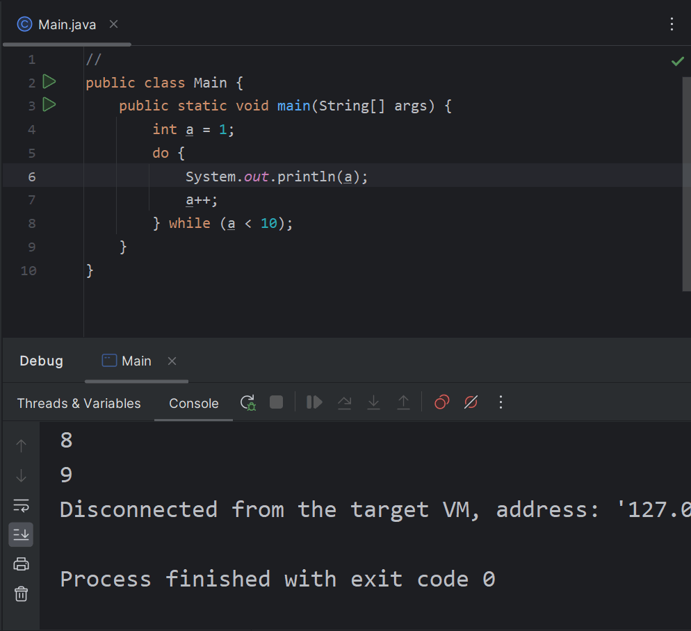

# 9.输入输出

## 9.1.输出

`Java` 有三种常用的输出，均体现在下述代码中：

```java
//使用三种输出语句
public class Main {
    public static void main(String[] args) {
        System.out.print("limou"); //输出，但不换行（无需关注类型）
        System.out.println("limou"); //输出，但是换行（无需关注类型）
        System.out.printf("%s", "limou"); //格式化输出输出
    }
}
```

您可能会好奇格式化输出是否和 `C` 一样，实际上有些类似，也有些不同：

-   `%o`、`%d`、`%x`：整数的八进制、十进制、十六进制输出
-   `%f`、`%e`、`%g`、`%a`：定点浮点数、指数浮点数、通用浮点数、十六进制浮点数输出
-   `%s`、`%c`：字符串、字符输出
-   `%b`：布尔值输出
-   `%h`：散列码输出
-   `%%`：百分号输出

此外，也有一些修饰符，您稍微了解一下即可。

## 9.2.输入

```java
//使用输入语句
//导入相关的包（可以将光标停在对应关键字上，使用快捷键 [alt+enter] 来快速导入）
import java.util.Scanner;

public class Main {
    public static void main(String[] args) {
        //创建一个 scan 对象，并且 System.in 代表设置为“从键盘输入”
        Scanner scan = new Scanner(System.in);

        System.out.println("请输入您的年龄"); //提示用户输入
        int age = scan.nextInt(); //通过方法获取输入

        System.out.println("请输入您的名字"); //提示用户输入
        String name = scan.next(); //通过方法获取输入（会忽略空白字符）

        //使用 nextLine() 则会获取空白字符，但是有可能有
        //失效的问题也就是多余空白字符被误输入的问题
        String ch = scan.nextLine(); //除去上述输入得最后产生得换行符
        System.out.println("输入您的爱好");
        String hobby = scan.nextLine();

        System.out.println("请输入您的体重"); //提示用户输入
        float weight = scan.nextFloat(); //通过方法获取输入（会忽略空白字符）

        System.out.println("年龄:" + age); //输出信息
        System.out.println("名字:" + name); //输出信息
        System.out.println("爱好:" + hobby); //输出信息
        System.out.println("体重:" + weight); //输出信息

        scan.close(); //类似 C 语言的文件关闭（暂时先这么理解即可）
    }
}

/* 输出结果
请输入您的年龄
18
请输入您的名字
limou 3434
输入您的爱好
game and programme
请输入您的体重
51.2
年龄: 18
名字: limou
爱好: game and programme
体重: 51.2
*/
```

当然，一般建议文本输入最好放在最前面处理（尤其是多数据类型输入的时候）。

还有一个循环输入的代码也值得您一看：

```cpp
//多组输入
//导入相关的包（可以将光标停在对应关键字上，使用快捷键 [alt+enter] 来快速导入）
import java.util.Scanner;

public class Main {
    public static void main(String[] args) {
        Scanner scan = new Scanner(System.in);
        System.out.print("请输入一个数字 ");
        while (scan.hasNextInt()) {
            int number = scan.nextInt();
            System.out.println("您输入的数字是:" + number);
            System.out.print("请输入一个数字 ");
        }
        //[ctrl+d] 会终止循环
    }
}

/* 输出结果
请输入一个数字 18
您输入的数字是: 18
请输入一个数字 20
您输入的数字是: 20
请输入一个数字 35
您输入的数字是: 35
请输入一个数字 5
您输入的数字是: 5
请输入一个数字 100
您输入的数字是: 100
请输入一个数字
*/
```

# 10.随机数

`Java`  的随机数生成也比较简单，使用如下代码即可：

```java
//随机数生成
//导入相关的包（可以将光标停在对应关键字上，使用快捷键 [alt+enter] 来快速导入）
import java.util.Random;

public class Main {
    public static void main(String[] args) {
        int count = 0;

        Random random1 = new Random();
        while (count < 10) {
            int n = random1.nextInt();
            System.out.println(n);
            count++;
        }

        Random random2 = new Random();
        while (count > 0) {
            int n = random2.nextInt(100); //限定 [0, 100) 的随机数
            System.out.println(n);
            count--;
        }
    }
}

/* 输出结果
1341966210
210008845
453512808
804932370
28871118
-913616368
469568144
-904536397
190689066
-546299782
69
65
21
54
6
83
0
1
81
41
*/
```

还有一个数学库的随机数，您也可以去了解一下...

# 11.方法

## 11.1.方法的调用

方法和 `C` 中的函数是否类似（因为它们的工作是差不多的，都是通过调用来达到简化代码的目的），而为什么不继续延用“函数”这个术语，而使用“方法”呢？

简单来说就是类的出现导致的，`Java` 使用类来创建一个又一个的对象，这些对象很类似普通的变量，而类内写入的对象可以执行的方法，这样创建出一个对象就可以使用配套的对象方法，这些内容我将会在下一节的类中重新阐述（现在您把方法简单视为函数）。

```java
//方法的使用
public class Main {
    public static void main(String[] args) {
        System.out.println(add(1, 2));
    }
    public static int Add(int a, int b) {
        return a + b;
    }
}

/* 输出结果
3
*/
```

另外，方法不能嵌套定义，一个方法的内部是不能定义另外一个方法的。

方法在类内是全局的，也就是说无论把 `Add()` 写到类的哪里，`main()` 都可以执行该方法。

## 11.2.方法的参数

`Java` 的方法也有和 `C` 函数类似的形参和实参的问题，但由于 `Java` 没有 `C/C++` 的指针，如果传递一个参数过来，该怎么进行修改呢？这里挖个坑，我们以后再来补充...

```java
//形参和实参的一个问题
public class Main {
    public static void main(String[] args) {
            int num1 = 5, num2 = 10;

            System.out.println("交换方法一");
            System.out.println("交换前 num1:" + num1 + " " + "num2:" + num2);
            int tmp = num1;
            num1 = num2;
            num2 = tmp;
            System.out.println("交换后 num1:" + num1 + " " + "num2:" + num2);

            System.out.println("交换方法二");
            System.out.println("交换前 num1:" + num1 + " " + "num2:" + num2);
            Swap(num1, num2);//使用方法交换（交换失败）
            System.out.println("交换后 num1:" + num1 + " " + "num2:" + num2);
    }
    public static void Swap(int num1, int num2) {
        int tmp = num1;
        num1 = num2;
        num2 = tmp;
    }
}
/*
交换方法一
交换前 num1: 5 num2: 10
交换后 num1: 10 num2: 5
交换方法二
交换前 num1: 10 num2: 5
交换后 num1: 10 num2: 5
*/
```

## 11.3.方法的递归

除此之外，`Java` 也支持递归调用方法。

```java
//使用方法递归计算阶乘
public class Main {
    public static void main(String[] args) {
        int number = 5;
        System.out.println(Test(number));
    }
    public static int Test(int number) {
        if (number == 0 || number == 1) {
            return 1;
        } else if (number < 0) {
            return -1;
        }
        return Test(number - 1) * number;
    }
}

/* 输出结果
120
*/
```

## 11.4.方法的重载

函数重载和 `C++` 的重载类似，也就是说：`Java` 允许一个方法可以有多种实现，这些方法实现的方法名字是一样的，但是参数列表是不一样的（参数个数或参数顺序不一样）。

```java
//需要使用方法重载的例子
public class Main {
    public static void main(String[] args) {
        int number1 = 5;
        System.out.println(Test(number1));
        double number2 = 5.0;
        System.out.println(Test(number2)); //无法调用 Test()
    }

    public static int Test(int number) {
        if (number == 0 || number == 1) {
            return 1;
        } else if (number < 0) {
            return -1;
        }
        return Test(number - 1) * number;
    }
}
```

```java
//为 Test() 提供重载版本
public class Main {
    public static void main(String[] args) {
        int number1 = 5;
        System.out.println(Test(number1));

        double number2 = 5.0;
        System.out.println(Test(number2)); //成功调用 Test() 的重载版本
    }

    public static int Test(int number) {
        if (number == 0 || number == 1) {
            return 1;
        } else if (number < 0) {
            return -1;
        }
        return Test(number - 1) * number;
    }

    public static double Test(double number) {
        if (number == 0 || number == 1) {
            return 1;
        } else if (number < 0) {
            return -1;
        }
        return Test(number - 1) * number;
    }
}

/* 输出结果
120
120.0 
*/
```

# 12.数组

## 12.1.数组的创建

`C/C++` 诡异的数组、指针创建风格曾折磨过不少初入门的家伙们，而 `Java` 的数组和 `C/C++` 有很大的不同，永远都依照下面的格式创建数组：

```java
//创建数组的格式
数组类型 数组名 = { 元素列表 }; //元素可以为变量（静态数组）

数组类型 数组名 = new 元素类型[元素个数]; //元素可以为变量（动态数组）
数组类型 数组名 = new 元素类型[]{ 元素列表 }; //元素可以为变量（动态数组）

//无论是静态创建还是动态创建，最终数组元素都会存储到堆上，而数组名作为引用变量指向/引用堆空间里的数组元素，并且使用下标/索引来进行访问
```

`Java` 的数组可以使用索引来查找和修改对应元素，并且索引也是从 `0` 开始的，`Java` 的数组越界会抛出异常，这比 `C/C++` 的基本数组要安全得多。数组的长度可以使用成员变量 `length` 来获得。

## 12.2.数组的遍历

```java
//数组的使用(1)
public class Main {
    public static void main(String[] args) {
        int[] arr = new int[]{1, 2, 3, 4, 5}; //创建数组并且初始化
        for (int i = 0; i < arr.length; i++) {
            arr[i] *= 10;
            System.out.println(arr[i]);
        }
    }
}

/* 输出结果
10
20
30
40
50
*/
```

对于基本类型的数组，默认初始化为 `0`。

```java
//数组的使用(2)
public class Main {
    public static void main(String[] args) {
        int size = 5;
        int[] arr = new int[size]; //创建数组，但不进行初始化
        for (int i = 0; i < arr.length; i++) {
            System.out.println(arr[i]);
        }
    }
}

/* 输出结果
0
0
0
0
0
*/
```

另外，我们还可以使用 `foreach` 来遍历数组（类似 `C++` 的范围 `for`）

```java
//foreach 增强 for 循环格式
for( 存储数组元素变量 : 数组 ) {
    //这样变量里存储的就是数组的某一个元素
}
```

```java
//数组的使用(3)
public class Main {
    public static void main(String[] args) {
        int[] arr = new int[]{1, 2, 3, 4, 5}; //创建数组并且初始化
        for (int e : arr) {
            e *= 10;
            System.out.println(e);
        }
    }
}

/* 输出结果
10
20
30
40
50
*/
```

而 `Java` 还有一个工具专门用来操控数组，这个工具就是 `Arrays`，这个工具内有很多方法，我们只需要将数组转化为字符串交给 `Arrays` 来处理即可（还有一些其他的方法，例如排序、二分...）。

```cpp
//数组的使用(4)
import java.util.Arrays;
public class Main {
    public static void main(String[] args) {
        int[] arr = new int[]{1, 2, 3, 4, 5}; //创建数组并且初始化
        String ret = Arrays.toString(arr);
        System.out.println(ret);
    }
}

/* 输出结果
[1, 2, 3, 4, 5]
*/
```

## 12.3.数组的引用

这里还有一个需要您注意的点，数组是一个引用类型，那么什么是引用类型呢？

我们需要了解一下 `Java` 的内存分布，首先内存是连续分布的存储空间，程序中运行所需要的数据就存储在内存空间中，而 `JVM` 对内存的划分大致如下：

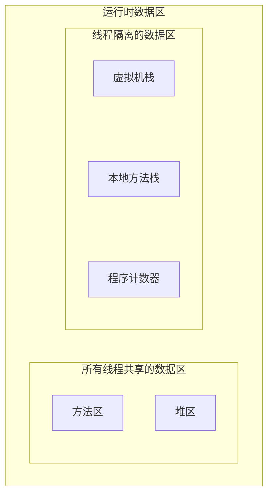

1.   方法区（`Method Area`）: 用干存储已拟机加载的类信息．常量、静态变量．即编译器编译后的代码
2.   堆（`Heap`）: `JVM` 所管理的最大内存区域，使用 `new` 创建的对象都是在堆上保存，堆是随着程序开始运行时而创建，随着程序的退出而销毁，堆中的数据只要还有在使用，就不会被销毁
3.   虚拟机栈（`JVM stack`）：与方法调用相关的一些信息，每个方法在执行时，都会先创建一个栈帧，栈帧中包含有了局部变量表、操作数栈、动态链接、返回地址...保存的都是与方法执行时相关信息（例如局部变量，在方法运行结束后，栈帧就会被销毁，栈帧中保存的数据也跟着销毁了。
4.   本地方法栈（`Native Method Stack`）: 本地方法栈与虚拟机栈的作用类似，只不过保存的内容是 `Native` 方法（即原生方法）的局部变员．在有些版本的 `JVM` 实现中（例如 `HotSpot`)，本地方法栈和虚拟机栈是在一起使用的
5.   程序计数器（`PC Register`）：只是一个很小的空间，保存下一条执行的指令的地址

这里简单看一下即可...我们主要焦距在堆和虚拟机栈上，让我们来分析下面这个代码的变量和数组的存储情况：

```java
//分析内存情况
public class Main {
    public static void main(String[] args) {
        int a = 10;
        int b = 5;
        int[] arr = { 1, 2, 3, 4 };
    }
}
```

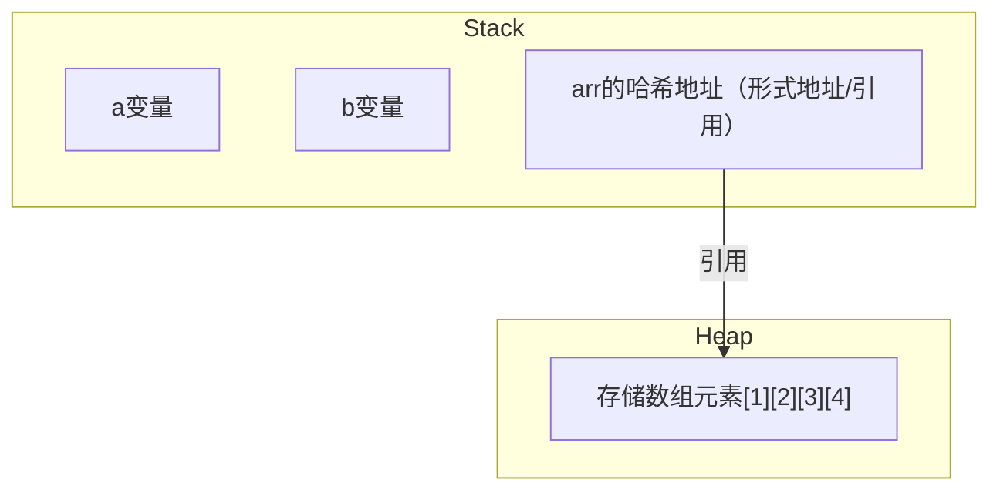

因此我们在 `Java` 中就会遇到传递引用的情况，并且我还给出了图示：

```java
//分析传引用的情况
public class Main {
    public static void main(String[] args) {
        int a = 10;
        int b = 5;
        int[] arr1 = { 1, 2, 3, 4 };
        for(int e : arr1) {
            System.out.print(e + " ");
        }
        System.out.println();

        int[] arr2 = arr1;
        for(int e : arr2) {
            System.out.print(e + " ");
        }
        System.out.println();

        arr2[2] = 100;
        for(int e : arr1) {
            System.out.print(e + " ");
        }
        System.out.println();
    }
}
/* 输出结果
1 2 3 4
1 2 3 4
1 2 100 4
*/
```

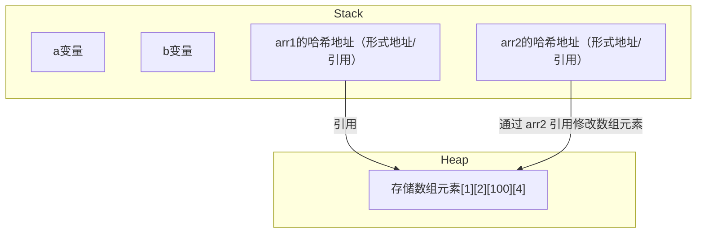

>   注意：强调一下，从这里的引用就可以看出 `Java` 的引用和 `C++` 的引用有很大的不同，我建议直接认为是两个不同的东西避免混淆...

还有一些特殊并且值得注意的传递引用情况：

```java
//改变引用
public class Main {
    public static void main(String[] args) {
        int a = 10;
        int b = 5;
        int[] arr1 = { 1, 2, 3, 4 };
        for(int e : arr1) {
            System.out.print(e + " ");
        }
        System.out.println();

        int[] arr2 = { 4, 3, 2, 1 };
        for(int e : arr2) {
            System.out.print(e + " ");
        }
        System.out.println();

        arr1 = arr2;
        for(int e : arr1) {
            System.out.print(e + " ");
        }
        System.out.println();

        //尝试膝盖并且观察
        arr2[1] = 10000;
        for(int e : arr1) {
            System.out.print(e + " ");
        }
        System.out.println();
        for(int e : arr2) {
            System.out.print(e + " ");
        }
        System.out.println();
    }
}
/* 输出结果
1 2 3 4 
4 3 2 1 
4 3 2 1 
4 10000 2 1 
4 10000 2 1 
*/
```

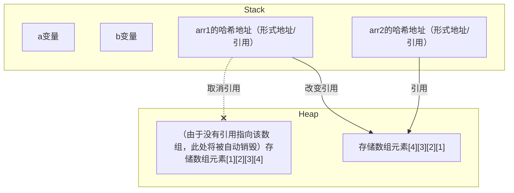

也就是说，一个引用不能同时指向多个对象，但是一个对象能被多个引用指向。

引用类型的初始化可以使用 `null`，代表引用不指向任何的对象（直接使用索引进行读写操作就会出现空指针异常），值得一提的是：`Java` 的 `null` 和 `C/C++` 不一样，它不是指内存上的 `0` 地址，两者没有直接关联。

## 12.4.数组的传递

下面这个代码您需要好好分析一下：

```java
//传递数组参数
import java.util.Arrays;
public class Main {
    public static void func1(int[] arr) {
        arr = new int[]{0, 0, 0, 0};
    }
    public static void func2(int[] arr) {
        arr[1] = 100;
    }

    public static void main(String[] args) {
        int[] arr = { 1, 2, 3, 4 };
        func1(arr);
        func2(arr);
        System.out.println(Arrays.toString(arr));
    }
}
/* 输出结果
[1, 2, 3, 4]
*/
```

这份代码可能会让您吃惊，让我们来看看引用指向和内存分布的分析图，调用方法 `func1()` 且尚未执行 `arr = new int[]{0, 0, 0, 0};` 时：

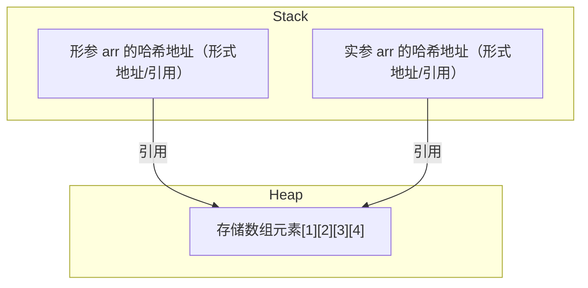

执行 `arr = new int[]{0, 0, 0, 0};` 后：

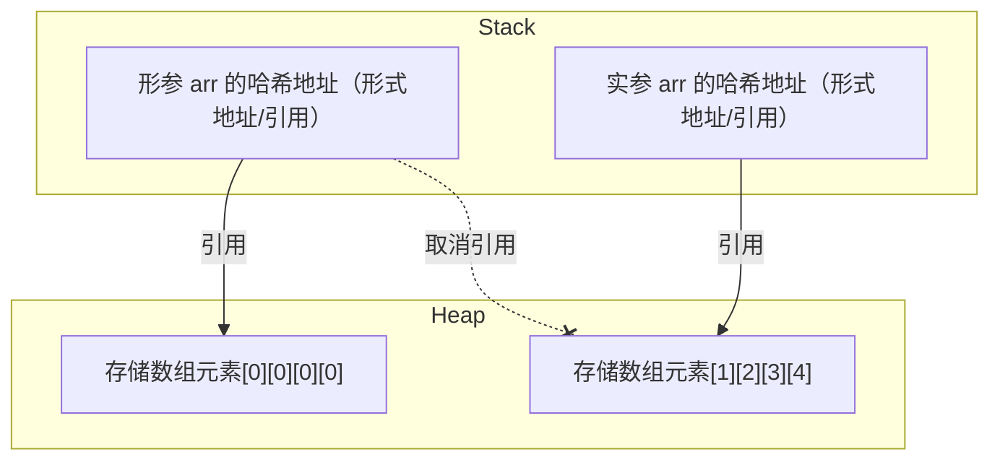

而 `func()` 调用结束后，形参 `arr` 被销毁，执行的对象没有被引用，就会被 `Java` 自动销毁：

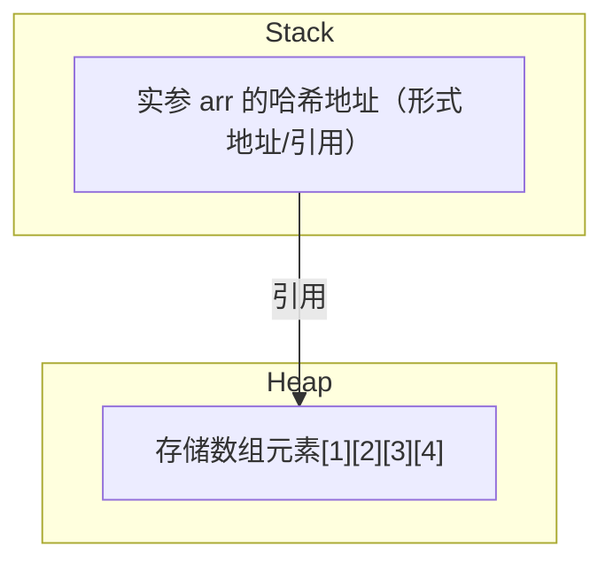

而调用 `func2()` 并且执行语句 `arr[1] = 100;` 就会导致实参指向的数组也会跟着变化：

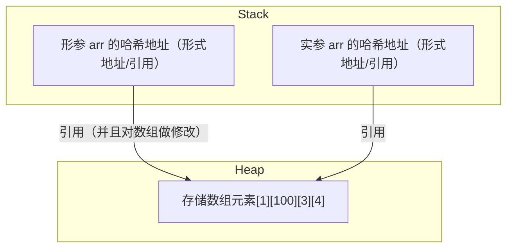

利用数组的引用传递，我们可以使用数组引用的特性来完成两数交换的目的。

```cpp
//两数交换
import java.util.Arrays;
public class Main {
    public static int[] Swap(int[] arr) {
        int tmp = arr[0];
        arr[0] = arr[1];
        arr[1] = tmp;
        return arr;
    }

    public static void main(String[] args) {
        int[] arr = { 5, 10 };
        System.out.println(Arrays.toString(arr));

        int[] swapArr = Swap(arr);
        System.out.println(Arrays.toString(swapArr));
    }
}
/* 输出结果
[5, 10]
[10, 5]
*/
```

